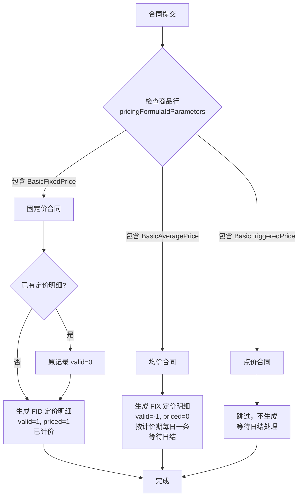
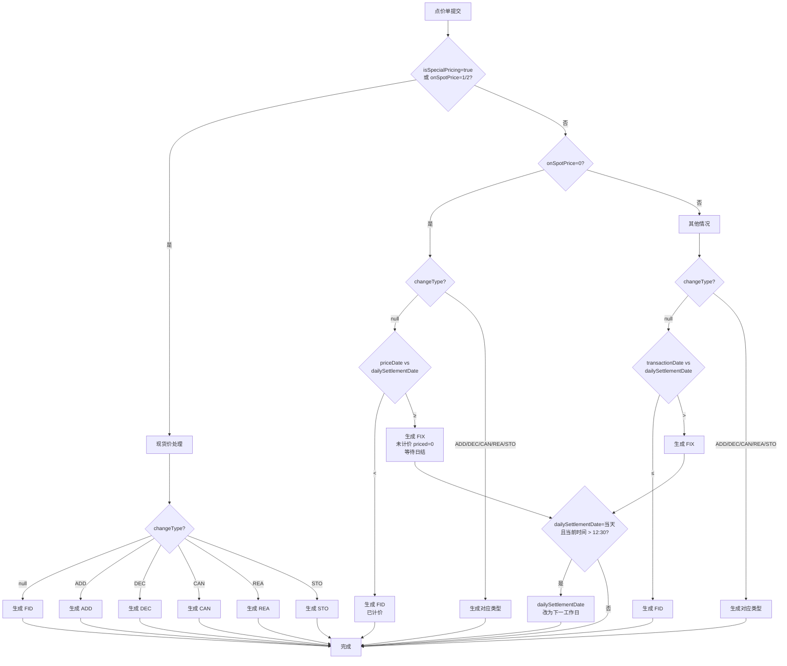
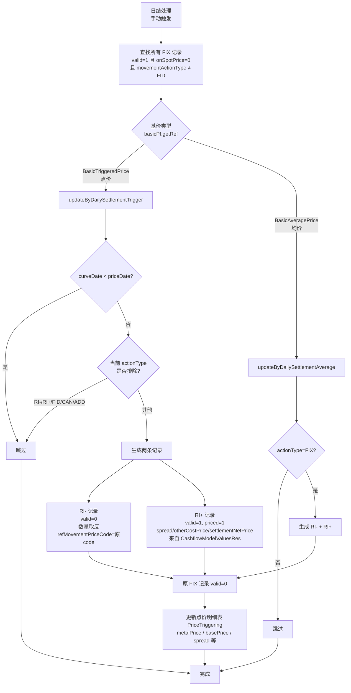
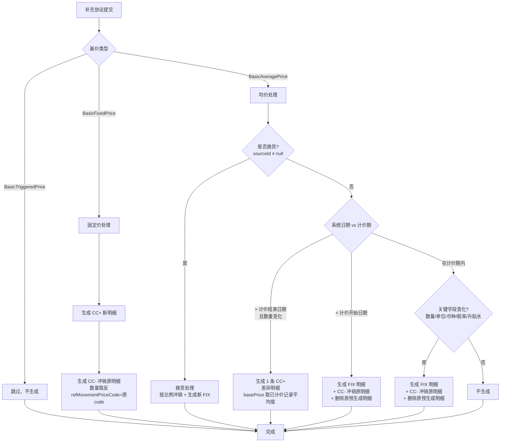
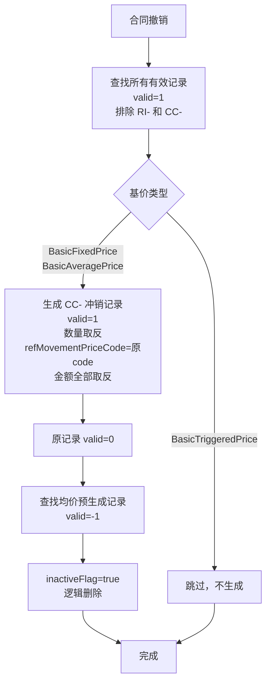
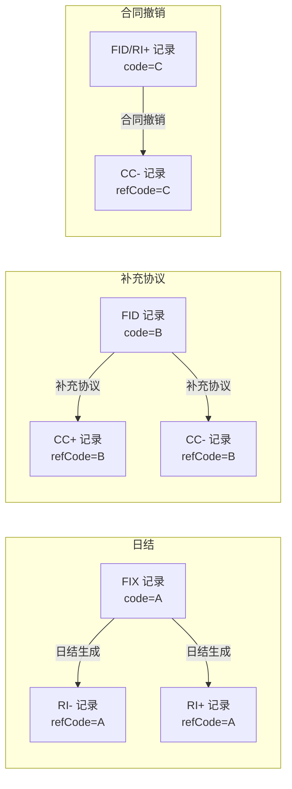

# 定价明细（MovementPrice）生成逻辑文档

> 生成日期：2026-06-10
> 源码位置：`MovementPriceServiceImpl.java`

---

## 一、概述

定价明细系统用于记录订单的敞口变动历史，通过不同的 `movementActionType` 标识不同的业务操作。

### 核心字段说明

| 字段 | 类型 | 说明 |
|------|------|------|
| `movementActionType` | String | 操作类型：FID / FIX / RI+ / RI- / CC+ / CC- / ADD / DEC / CAN / REA / STO |
| `valid` | Integer | 生效状态：1-生效，0-失效（被冲销），-1-待日结更新 |
| `priced` | Integer | 计价状态：1-已计价，0-未计价 |
| `onSpotPrice` | Integer | 定价方式：0-Unknown（日结时按规则找价格），1-On Spot Price（手动输入），2-Known（按过去价格定） |
| `refMovementPriceCode` | String | 关联定价明细编码，用于记录冲销引用链 |
| `refDocumentType` | Integer | 关联单据类型：1-现货订单，2-长协订单，3-补充协议，4-点价记录 |

---

## 二、操作类型详解

| 枚举值 | 代码 | 全称 | 含义 | 触发场景 |
|--------|------|------|------|----------|
| FID | FID | Fixed Initial Deal | 固定初始交易 | 固定价合同提交、点价单提交（已计价） |
| FIX | FIX | Fixation | 定价等待 | 均价合同预生成、点价单提交（未计价，等待日结） |
| RI+ | RI+ | Reverse Initial Plus | 反向初始（正） | 日结时生成，新生效的定价记录 |
| RI- | RI- | Reverse Initial Minus | 反向初始（负） | 日结时生成，冲销原 FIX 记录 |
| CC+ | CC+ | Contract Change Plus | 合同变更（正） | 补充协议变更时生成新记录 |
| CC- | CC- | Contract Cancel Minus | 合同撤销（负） | 合同撤销/补充协议冲销时生成 |
| ADD | ADD | Add | 增加 | 点价单增加数量 |
| DEC | DEC | Decrease | 减少 | 点价单减少数量 |
| CAN | CAN | Cancel | 取消 | 点价单取消 |
| REA | REA | Reassign Add | 变更商品增加 | 换货时新商品增加 |
| STO | STO | Reassign Decrease | 变更商品减少 | 换货时原商品减少 |

---

## 三、业务流程总览

```mermaid
flowchart TB
    subgraph 合同阶段
        A1[合同提交] --> A2{基价类型}
        A2 -->|固定价 BasicFixedPrice| A3[生成 FID]
        A2 -->|均价 BasicAveragePrice| A4[生成 FIX<br/>按计价期每日一条]
        A2 -->|点价 BasicTriggeredPrice| A5[不生成<br/>等待日结]
    end

    subgraph 点价阶段
        B1[点价单提交] --> B2{onSpotPrice}
        B2 -->|1 或 2| B3{changeType}
        B2 -->|0| B4{priceDate vs<br/>dailySettlementDate}
        B3 -->|null| B5[生成 FID]
        B3 -->|ADD/DEC/CAN/REA/STO| B6[生成对应类型]
        B4 -->|<| B7[生成 FID]
        B4 -->|≥| B8[生成 FIX]
    end

    subgraph 日结阶段
        C1[日结处理<br/>手动触发] --> C2{基价类型}
        C2 -->|点价/均价| C3[FIX → RI- + RI+]
    end

    subgraph 补充协议阶段
        D1[补充协议提交] --> D2{基价类型}
        D2 -->|固定价| D3[生成 CC+ + CC-]
        D2 -->|均价| D4{系统日期 vs 计价期}
        D2 -->|点价| D5[不生成]
        D4 -->|> 计价结束日期| D6[生成 CC+<br/>差异明细]
        D4 -->|< 计价开始日期| D7[生成 FIX + CC-]
        D4 -->|在计价期内| D8{关键字段变化?}
        D8 -->|是| D9[生成 FIX + CC-]
        D8 -->|否| D10[不生成]
    end

    subgraph 合同撤销阶段
        E1[合同撤销] --> E2{基价类型}
        E2 -->|固定价/均价| E3[生成 CC-<br/>冲销所有有效记录]
        E2 -->|点价| E4[不生成]
    end
```

---

## 四、详细流程

### 4.1 合同提交流程

**入口方法**：`updateByContractCommit`（第 188 行）

**说明**：
- 固定价合同提交时，如果已有定价明细（提交→撤销→提交场景），先将原记录标记为 `valid=0`
- 均价合同预生成的 FIX 记录 `valid=-1`，表示等待日结更新
- 点价类型在合同提交时不生成定价明细

---

### 4.2 点价单提交流程

**入口方法**：`updateByPricingCommit`（第 1661 行）
**核心方法**：`generateByPricing`（第 1998 行）

**onSpotPrice 含义**：

| 值 | 枚举 | 含义 |
|----|------|------|
| 0 | Unknown | 日结时按规则找价格 |
| 1 | On Spot Price | 用户手动输入价格 |
| 2 | Known | 按照过去的价格定 |

**changeType 含义**（`PriceChangeTypeEnum`）：

| 值 | 枚举 | 含义 |
|----|------|------|
| 1 | ADD | 增加点价数量 |
| 2 | DEC | 减少点价数量 |
| 3 | CAN | 取消点价 |
| 4 | REA | 变更商品增加（换货） |
| 5 | STO | 变更商品减少（换货） |

---

### 4.3 日结处理流程

**入口方法**：`updateByDailySettlement`（第 2379 行）
**点价方法**：`updateByDailySettlementTrigger`（第 2317 行）
**均价方法**：`updateByDailySettlementAverage`（第 2565 行）

**RI+ 价格信息来源**：`CashflowModelValuesRes`（通过 `myFinanceMapper.selectCashModelValuesByPdLineId` 查询）

| 字段 | 来源 |
|------|------|
| spread | cashflowModel.getSpread() |
| otherCostPrice | cashflowModel.getOtherCostPrice() |
| settlementNetPrice | cashflowModel.getSettlementNetPrice() |

**均价预生成记录处理**（valid=-1）：
- 当计价日到达 `nextPricingDate` 时，将 valid=-1 的记录转换为 RI+/RI-

---

### 4.4 补充协议提交流程

**入口方法**：`updateBySupplementCommit`（第 634 行）

**均价关键字段**（`changeSupLineIdSet`，第 687-710 行）：
- 数量（quantity）
- 数量单位（quantityUnitId）
- 结算币种（settlementCurrencyId）
- 税率（productTaxCodeId）
- 升贴水值（spreadValue）
- 升贴水币种（spreadCurrencyId）
- 升贴水单位（spreadUnitId）
- 升贴水是否百分比（spreadIsPercentage）

---

### 4.5 合同撤销流程

**入口方法**：`updateByContractCancle`（第 348 行）

---

## 五、完整操作对照表

| 操作 | 基价类型 | 条件 | 生成类型 | valid | priced |
|------|----------|------|----------|-------|--------|
| 合同提交 | 固定价 | - | **FID** | 1 | 1 |
| 合同提交 | 均价 | - | **FIX**（按计价期每日一条） | -1 | 0 |
| 合同提交 | 点价 | - | 不生成 | - | - |
| 点价单提交 | - | onSpotPrice=1/2, changeType=null | **FID** | 1 | 1 |
| 点价单提交 | - | onSpotPrice=1/2, changeType=ADD | **ADD** | 1 | 1 |
| 点价单提交 | - | onSpotPrice=1/2, changeType=DEC | **DEC** | 1 | 1 |
| 点价单提交 | - | onSpotPrice=1/2, changeType=CAN | **CAN** | 1 | 1 |
| 点价单提交 | - | onSpotPrice=1/2, changeType=REA | **REA** | 1 | 1 |
| 点价单提交 | - | onSpotPrice=1/2, changeType=STO | **STO** | 1 | 1 |
| 点价单提交 | - | onSpotPrice=0, changeType=null, priceDate < dailySettlementDate | **FID** | 1 | 1 |
| 点价单提交 | - | onSpotPrice=0, changeType=null, priceDate ≥ dailySettlementDate | **FIX** | 1 | 0 |
| 日结处理 | 点价/均价 | - | **RI-**（冲销原记录） | 0 | - |
| 日结处理 | 点价/均价 | - | **RI+**（新生效记录） | 1 | 1 |
| 补充协议 | 固定价 | - | **CC+**（新记录）+ **CC-**（冲销原记录） | 1 | 1 |
| 补充协议 | 均价 | 系统日期 > 计价结束日期 且 数量变化 | **CC+**（差异明细） | 1 | 1 |
| 补充协议 | 均价 | 系统日期 < 计价开始日期 | **FIX** + **CC-** | -1/1 | 0/- |
| 补充协议 | 均价 | 系统日期在计价期内 且 关键字段变化 | **FIX** + **CC-** | -1/1 | 0/- |
| 补充协议 | 均价 | 系统日期在计价期内 且 非关键字段变化 | 不生成 | - | - |
| 补充协议 | 点价 | - | 不生成 | - | - |
| 合同撤销 | 固定价/均价 | - | **CC-**（冲销所有有效记录） | 1 | - |
| 合同撤销 | 点价 | - | 不生成 | - | - |

---

## 六、冲销引用链关系

---

## 七、关键方法索引

| 方法名 | 行号 | 功能 |
|--------|------|------|
| `updateByContractCommit` | 188 | 合同提交生成定价明细 |
| `generateByContractCommitFixed` | 449 | 固定价合同提交 → FID |
| `generateByContractCommitAverage` | 510 | 均价合同提交 → FIX |
| `updateByContractCancle` | 348 | 合同撤销 → CC- |
| `updateByPricingCommit` | 1661 | 点价单提交生成定价明细 |
| `generateByPricing` | 1998 | 点价单生成定价明细核心方法 |
| `updateByDailySettlement` | 2379 | 日结处理入口 |
| `updateByDailySettlementTrigger` | 2317 | 点价日结 → RI+/RI- |
| `updateByDailySettlementAverage` | 2565 | 均价日结 → RI+/RI- |
| `updateBySupplementCommit` | 634 | 补充协议提交 → CC+/CC- |
| `generateBySupplementFixed` | - | 固定价补充协议 → CC+ |
| `generateBySupplementAverage` | 1012 | 均价补充协议 → FIX |
| `generateBySupplementAverageAfterPriceDate` | 1122 | 均价补充协议（计价期后）→ CC+ |
| `generateReverseBySupplement` | 1192 | 补充协议冲销原记录 → CC- |

---

## 八、注意事项

1. **点价类型（BasicTriggeredPrice）** 在合同提交和补充协议提交时都不生成定价明细，只在日结处理时生成 RI-/RI+
2. **均价预生成记录**（valid=-1）在合同撤销时会被标记为 `inactiveFlag=true`，而不是生成 CC-
3. **日结处理** 时，RI+ 记录的价格信息来自 `CashflowModelValuesRes`，包含 spread、otherCostPrice、settlementNetPrice
4. **补充协议** 在计价期内，只有修改关键字段（数量、单位、币种、税率、升贴水）才会生成新的定价明细
5. **点价单提交** 时，如果当前时间超过 12:30 且生成的是 FIX 类型，`dailySettlementDate` 会调整为下一个工作日
6. **合同撤销** 时，排除 RI- 和 CC- 类型的记录（它们本身已经是冲销记录），排除点价类型（BasicTriggeredPrice）
7. **日结触发时机**：一般约定到时间手动触发，不是定时任务自动执行
