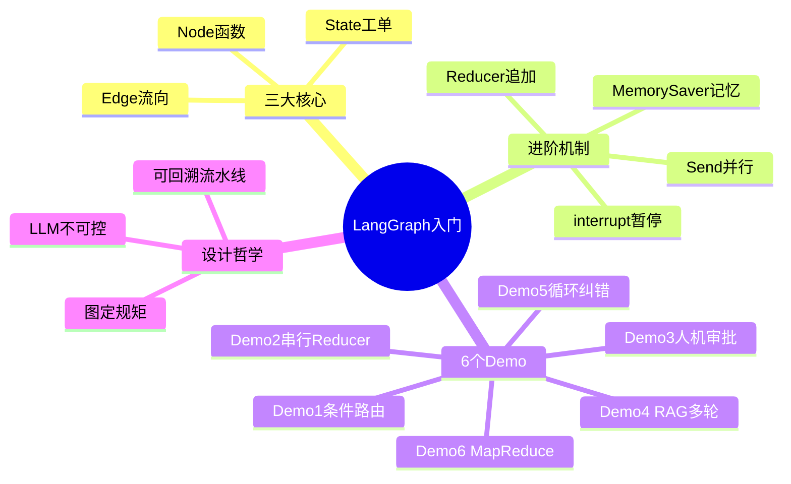
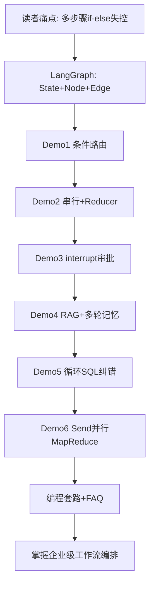

---
tags:
  - LangGraph
  - Agent架构
  - StateGraph
  - 工作流编排
  - 个人学习
  - 入门实战
created: 2026-06-25
category: 个人学习/LangGraph
aliases:
  - LangGraph入门实战
  - langgraph_demo
  - 6个Demo入门LangGraph
source: https://blog.csdn.net/binbin3828/article/details/162213325
author: binbin3828（大侠锅锅）
github: https://github.com/binbin3828/langgraph_demo
---

# LangGraph：6 个企业级 Demo 入门实战

> **原文链接**: [CSDN - LangGraph 入门实战](https://blog.csdn.net/binbin3828/article/details/162213325)

> **原标题**: LangGraph 入门实战：6个企业级Demo带你从零搞懂工作流编排

> **GitHub 项目**: [binbin3828/langgraph_demo](https://github.com/binbin3828/langgraph_demo)

> **索引**: [[📋 LangGraph索引]]

> **一句话总结**: 用 6 个递进式可运行 Demo（路由→串行→人机→RAG→循环→并行）把 LangGraph 的 State/Node/Edge 及 Reducer、interrupt、Send 讲透，核心思想是把不可控 LLM 收敛到可回溯的流水线。

> **前置知识检查**:
> - [ ] 会用 Python 调用大模型 API（如 DeepSeek / OpenAI）
> - [ ] 了解 TypedDict、基本 Prompt 工程
> - [ ] 知道 Agent 与「一问一答」Chat 的区别
> - [ ] （可选）读过 [[LangGraph 企业级落地实战报告]] 的架构对比章节

## 原文

本文通过 6 个递进式企业级 Demo，带你从零理解 LangGraph 的核心原理。不堆概念，先跑代码，再讲原理。

---

### 前言

用大模型做过项目的同学一定有过这种感受：一问一答很简单，但一旦涉及多步骤、有条件分支、需要人工审批、需要记住上下文，代码就开始失控了——if-else 套了一层又一层，Prompt 越来越长，出错了也不知道是哪一步的问题。

LangGraph 就是为解决这个问题而生的。

本文用 6 个递进式 Demo，从最基础的「分类路由」到高级的「并行 Map-Reduce」，带你一步步理解 LangGraph 的核心概念和设计思想。每个 Demo 都可以直接跑，建议 clone 下来边跑边看。

---

### 一、LangGraph 到底是什么？

#### 1.1 一句话定义

LangGraph 是一个「画流程图」的框架，让 AI 按你画的路线图干活。

你只需要定义三个东西：

- **节点（Node）**：干活的函数，比如「分类」「审查」「生成报告」
- **边（Edge）**：节点之间的连线，决定数据往哪流
- **状态（State）**：一张全局工单，在节点之间传递，每个节点读它、改它

```
[节点A] --边--> [节点B] --边--> [节点C]
   ↑              ↑              ↑
读/改 State   读/改 State    读/改 State
```

State 就是那张「工单」，节点就是「员工」，边就是「工单传递规则」。

#### 1.2 为什么需要 LangGraph？

LLM 本质是发散的、不可控的。同一个问题问三遍，可能得到三种不同的回答。

而企业级链路需要的恰恰相反——稳定地按既定路线图运行，每一步走哪个节点、数据怎么流转、什么时候停、出错怎么重试，全由你画的图说了算，不能依赖模型「随机发挥」。

LangGraph 做的事情，就是把不可控的 LLM 收敛到一个可回溯、有状态、边界清晰的「流水线」中。

用通俗的话说：你画的流程图就是规矩，模型只管在每个节点里干活，走哪条路、数据怎么传，模型说了不算，图说了算。

这就是 Demo 中 State（状态约束）、条件边（路线约束）、循环控制（边界约束）设计的根本目的——不是为了复杂而复杂，而是为了让不可控的 LLM 在企业级场景下变得可控。

---

### 二、核心概念速查

#### 2.1 State（状态/工单）

用 `TypedDict` 定义，就是一张工单模板：

```python
class DataAnalysisState(TypedDict):
    question: str       # 用户问题
    sql: str            # 生成的SQL
    sql_result: str     # SQL执行结果
    analysis: str       # 分析报告
    retry_count: int    # 重试次数
    is_valid: bool      # 是否有效
    error_message: str  # 错误信息
```

每个节点可以读取工单上的字段，也可以写入/修改字段。节点之间通过这张工单传递数据。

#### 2.2 Node（节点）

就是一个普通 Python 函数，接收 state，返回要修改的字段：

```python
def generate_sql(state: DataAnalysisState) -> dict:
    question = state["question"]
    sql = llm.invoke(...)
    return {"sql": sql}
```

关键规则：节点返回的字典会自动和原 state 合并，没返回的字段保持不变。

#### 2.3 Edge（边）

决定数据流向，有三种：

| 类型 | 代码 | 含义 |
| --- | --- | --- |
| 固定边 | `add_edge(A, B)` | A 执行完一定到 B |
| 条件边 | `add_conditional_edges(A, fn, mapping)` | A 执行完根据 fn 返回值决定去哪 |
| 循环边 | `add_edge(B, A)` | B 执行完回到 A，形成循环 |

#### 2.4 Annotated + Reducer（追加而非覆盖）

默认情况下，节点返回的字段会覆盖原 state 的值。如果多个节点都要写同一个字段，后面的会覆盖前面的——数据就丢了。

```python
def reducer_list(old: list, new: list) -> list:
    return old + new  # 新旧合并，不是覆盖

class OverallState(TypedDict):
    research_results: Annotated[list[str], reducer_list]  # 追加
    final_report: str                                       # 覆盖（默认）
```

什么时候需要 reducer？当多个节点（尤其是并行节点）要往同一个字段写数据时。

#### 2.5 MemorySaver + interrupt（检查点 / 记忆 / 暂停）

```python
checkpointer = MemorySaver()
app = graph.compile(checkpointer=checkpointer)
```

- 没有 checkpointer：每次 invoke 互不相干，像每次换一个客服。
- 有 checkpointer：同一 thread_id 的 invoke 能接着上次的聊，像同一个客服记住了你。

```python
from langgraph.types import interrupt, Command

def manager_approve(state):
    decision = interrupt("请审批")  # 程序冻住！
    return {"manager_decision": decision}

app.invoke(Command(resume={"decision": "approve", "comment": "同意"}), config=config)
```

`interrupt()` = 暂停并存档，`Command(resume=...)` = 读档继续。

---

### 三、6 个 Demo 递进学习

学习路线：

```
Demo1 基础路由 → Demo2 串行流水线 → Demo3 人机交互 → Demo4 RAG+记忆 → Demo5 循环纠错 → Demo6 并行处理
```

---

#### Demo1：客户意图分类路由

学习重点：StateGraph、条件边、路由

场景：客服系统，根据用户输入分类，路由到不同的专业 Agent。

```
用户输入 → [分类] ──→ [技术支持] → 结束
              ├──→ [账单客服] → 结束
              └──→ [一般咨询] → 结束
```

State 设计：

```python
class CustomerServiceState(TypedDict):
    user_input: str    # 用户输入
    category: str      # 分类结果
    response: str      # 最终回复
```

核心代码：

```python
# 1. 创建图
graph = StateGraph(CustomerServiceState)

# 2. 添加节点
graph.add_node("classify", classify_intent)
graph.add_node("tech_support", handle_tech_support)
graph.add_node("billing", handle_billing)
graph.add_node("general", handle_general)

# 3. 固定边：START → classify
graph.add_edge(START, "classify")

# 4. 条件边：classify → 根据分类结果路由
graph.add_conditional_edges("classify", route_by_category, {
    "tech_support": "tech_support",
    "billing": "billing",
    "general": "general",
})

# 5. 各处理节点 → END
graph.add_edge("tech_support", END)
graph.add_edge("billing", END)
graph.add_edge("general", END)

# 6. 编译
app = graph.compile()
```

条件边的路由函数：

```python
def route_by_category(state: CustomerServiceState) -> Literal["tech_support", "billing", "general"]:
    return state["category"]
```

`Literal["tech_support", "billing", "general"]` 声明这个函数只能返回这三个字符串之一。LangGraph 据此确保每个返回值都有对应的节点。

运行：

```python
result = app.invoke({
    "user_input": "我的App打开后一直闪退怎么办？",
    "category": "",
    "response": "",
})
# classify 节点写入 category="tech_support"
# 条件边路由到 tech_support 节点
# tech_support 节点写入 response="..."
```

为什么要分类路由，不直接让大模型一次性回答？

简单场景确实不需要。但企业级场景中，不同类型的请求需要不同的 Prompt、不同的工具、不同的权限、甚至不同的模型。分类路由让你可以按需分配，成本更低、质量更高、可追溯性更强。

---

#### Demo2：代码审查流水线

学习重点：串行协作、State 累积、Reducer

场景：代码提交 → 安全审查 → 风格审查 → 自动修复 → 生成报告

```
[安全审查] → [风格审查] → [自动修复] → [生成报告]
```

State 设计：

```python
def reducer_list(old: list, new: list) -> list:
    return old + new

class CodeReviewState(TypedDict):
    code: str
    security_issues: Annotated[list[str], reducer_list]  # 追加
    style_issues: Annotated[list[str], reducer_list]     # 追加
    fixed_code: str
    final_report: str
```

为什么 security_issues 和 style_issues 用 reducer？

如果将来改成并行审查（安全审查和风格审查同时进行），两个节点同时写同一个字段，没有 reducer 就会互相覆盖。加了 reducer 是防御性设计——确保列表只增不减。

节点返回值的合并：

```python
def security_review(state: CodeReviewState) -> dict:
    # 只返回自己负责的字段
    return {"security_issues": ["发现硬编码密钥", "SQL注入风险"]}
    # LangGraph 自动合并到 state，其他字段不变
```

为什么要拆成串行节点，不直接一次让大模型全审了？

拆开后每个节点职责单一、Prompt 更聚焦、模型表现更好；企业中每个节点可能用不同模型/工具；出了问题能追溯是哪一步出错的。

---

#### Demo3：请假审批（人机交互）

学习重点：interrupt、MemorySaver、Command(resume)

场景：员工请假 → 经理审批（暂停等人工）→ HR 备案 / 驳回通知

```
[提交请假] → [经理审批(暂停)] ──→ [HR备案] → 结束
                          └──→ [驳回通知] → 结束
```

核心：interrupt 暂停与恢复

```python
def manager_approve(state: LeaveApprovalState) -> dict:
    decision = interrupt("请审批")  # 程序在这里冻住！
    # 外部传入审批结果后，decision 才有值，程序才继续
    return {"manager_decision": decision}
```

两次 invoke 才能完成整个流程：

```python
config = {"configurable": {"thread_id": "leave-001"}}

# 第1次：提交请假，流程在经理审批节点暂停
app.invoke({
    "employee": "张三",
    "leave_type": "年假",
    "days": 3,
    "reason": "家庭旅行",
}, config=config)

# 第2次：经理审批，从中断处恢复
app.invoke(
    Command(resume={"decision": "approve", "comment": "同意请假，注意交接工作"}),
    config=config,  # 同一个 thread_id，才能找到上次暂停的流程
)
```

config 和 thread_id 的作用：

MemorySaver 可能同时存了很多流程的状态。thread_id 就是流程的身份证号，确保暂停和恢复能对应上同一个人。两次 invoke 传同一个 thread_id，LangGraph 就能找到上次暂停的流程继续执行。

---

#### Demo4：智能客服（RAG + 多轮对话记忆）

学习重点：RAG 集成、messages 累积、MemorySaver 多轮记忆

场景：基于知识库回答问题，支持多轮对话。

```
[检索知识库] → [生成回答]
```

State 设计：

```python
class CustomerServiceState(TypedDict):
    messages: Annotated[list[BaseMessage], reducer_messages]  # 对话历史，追加
    context: str    # 检索到的知识库内容
    query: str      # 当前问题
```

messages 为什么必须用 reducer？

因为每轮对话都要往 messages 里追加内容：

```
第1轮: [HumanMessage("退货政策?"), AIMessage("支持7天...")]
第2轮: [HumanMessage("退货政策?"), AIMessage("支持7天..."), HumanMessage("运费?"), AIMessage("满99免运费")]
```

没有 reducer，生成节点返回 `{"messages": [AIMessage(...)]}` 会覆盖整个 messages，之前的对话历史全丢了。

检索节点：

```python
def retrieve_knowledge(state):
    last_msg = state["messages"][-1]           # 取最后一条（用户最新问题）
    query = last_msg.content                    # 提取文本
    context = simple_retrieve(query)            # 去知识库检索
    return {"context": context, "query": query}
```

生成节点：

```python
def generate_answer(state):
    context = state.get("context", "")          # 检索到的知识
    history = state["messages"][:-1]             # 历史对话（去掉最后一条）
    query = state["query"]                       # 当前问题

    messages = [
        SystemMessage(content=f"你是智能客服...知识库:{context}"),  # 系统提示+知识
        *history[-6:],                          # 最近6条历史（控制token）
        HumanMessage(content=query),             # 当前问题放最后
    ]

    result = llm.invoke(messages)
    return {"messages": [AIMessage(content=result.content)]}  # AI回答追加到历史
```

多轮记忆的原理：

```python
checkpointer = MemorySaver()
app = graph.compile(checkpointer=checkpointer)

config = {"configurable": {"thread_id": "user-001"}}

# 第1轮
app.invoke({"messages": [HumanMessage(content="退货政策是什么？")]}, config=config)
# MemorySaver 存档: messages = [Human, AI]

# 第2轮（MemorySaver 自动加载上一轮的 state）
app.invoke({"messages": [HumanMessage(content="运费怎么算？")]}, config=config)
# messages = [Human("退货政策?"), AI("支持7天..."), Human("运费怎么算?"), AI("满99免运费")]
#                          ↑ 上一轮的          ↑ 新追加的
```

---

#### Demo5：自我纠错数据分析 Agent

学习重点：循环重试、条件边控制循环、最大重试次数

场景：生成 SQL → 执行 → 验证，如果失败则自动反思重试（最多 3 次）。

```
[生成SQL] → [执行SQL] → [验证分析] ──→ 成功 → 结束
                    ↑          │
                    │          └── 失败且未达上限 → [计数+1] → 回到生成SQL
                    │
                    └── 失败且达到上限 → [强制结束] → 结束
```

State 设计：

```python
class DataAnalysisState(TypedDict):
    question: str       # 用户问题
    sql: str            # 生成的SQL
    sql_result: str     # 执行结果
    analysis: str       # 分析报告
    retry_count: int    # 重试次数（控制循环）
    is_valid: bool      # 是否成功（决定是否继续循环）
    error_message: str  # 错误信息（告诉模型上次错在哪）
```

`retry_count` 和 `is_valid` 是循环的关键——retry_count 控制最多循环几次，is_valid 决定是继续还是停止。

自我纠错的核心：重试时带上错误提示

```python
def generate_sql(state):
    retry_hint = ""
    if state["retry_count"] > 0:
        # 第2次、第3次时，告诉模型上次错在哪
        retry_hint = f"\n注意: 之前的SQL有问题 - {state['error_message']}\n请修正SQL。"

    prompt = f"""你是SQL专家...
用户问题: {state['question']}
{retry_hint}"""
    ...
```

条件边控制循环：

```python
def should_retry(state) -> str:
    if state["is_valid"]:
        return "done"                    # 成功 → 结束
    if state["retry_count"] >= 3:
        return "max_retries"             # 失败且达上限 → 强制结束
    return "retry"                       # 失败但还能重试 → 循环

graph.add_conditional_edges("validate", should_retry, {
    "done": END,
    "max_retries": "handle_max_retries",
    "retry": "increment_retry",
})
graph.add_edge("increment_retry", "generate_sql")  # 这条边形成了循环！
```

`add_edge("increment_retry", "generate_sql")` 就是循环的关键——从后面的节点连回前面的节点，形成环路。

---

#### Demo6：并行研究 Agent（Map-Reduce）

学习重点：Send()、并行执行、Map-Reduce 模式

场景：输入多个研究主题 → 并行研究每个主题 → 汇总生成报告。

```
START ──→ [研究: AI市场]   ──┐
       ├──→ [研究: 新能源]  ──┤──→ [汇总报告] → END
       └──→ [研究: 云计算]  ──┘
```

两个 State：

```python
class OverallState(TypedDict):          # 全局状态
    topics: list[str]
    research_results: Annotated[list[str], reducer_list]  # 追加！
    final_report: str

class TopicState(TypedDict):            # 单个主题的状态
    topic: str
```

为什么需要两个？因为并行研究时，每个节点只需要知道自己负责的那一个主题：

```
OverallState.topics = ["AI市场", "新能源", "云计算"]
        │
        ▼  Send() 拆分
节点A 只看到 TopicState(topic="AI市场")
节点B 只看到 TopicState(topic="新能源")
节点C 只看到 TopicState(topic="云计算")
```

并行是怎么实现的：

```python
def route_to_researchers(state: OverallState) -> list[Send]:
    # 返回多个 Send 对象 → LangGraph 同时创建多个节点实例
    return [Send("research_topic", {"topic": t}) for t in state["topics"]]

graph.add_conditional_edges(START, route_to_researchers, ["research_topic"])
```

返回 1 个值走 1 条路，返回 3 个 Send 就同时走 3 条路，这就是并行。

research_results 为什么必须用 reducer：

3 个并行节点同时写 `research_results`，没有 reducer 就会互相覆盖，只保留最后一个的结果。Demo6 是 6 个 Demo 中 reducer 最不可省略的。

汇总节点：

```python
def synthesize_report(state: OverallState) -> dict:
    all_research = "\n\n".join(state["research_results"])  # 把3份结果拼成一个字符串
    prompt = f"你是首席分析师...各主题研究:\n{all_research}"
    result = llm.invoke(...)
    return {"final_report": result.content}
```

所有 research_topic 实例都完成后，LangGraph 才会执行 synthesize。这就是 Map-Reduce：Map（并行研究）→ Reduce（汇总报告）。

---

### 四、6 个 Demo 核心机制对比

| Demo | 图结构 | 核心机制 | Reducer | Checkpointer | 循环 | 并行 |
| --- | --- | --- | --- | --- | --- | --- |
| Demo1 | 分叉 | 条件路由 | 无 | 无 | 无 | 无 |
| Demo2 | 串行 | 节点串行+State累积 | 有（防御性） | 无 | 无 | 无 |
| Demo3 | 分叉 | interrupt暂停/恢复 | 无 | 有 | 无 | 无 |
| Demo4 | 串行 | RAG+messages累积 | 有 | 有 | 无 | 无 |
| Demo5 | 循环 | 条件边控制循环重试 | 无 | 无 | 有 | 无 |
| Demo6 | 并行 | Send()并行+Map-Reduce | 有（必须） | 无 | 无 | 有 |

---

### 五、LangGraph 编程套路总结

#### 5.1 固定套路

```python
# 1. 定义 State
class MyState(TypedDict):
    field1: str
    field2: Annotated[list[str], reducer_list]

# 2. 定义节点函数
def node_a(state: MyState) -> dict:
    return {"field1": "new_value"}

# 3. 构建图
graph = StateGraph(MyState)
graph.add_node("a", node_a)
graph.add_node("b", node_b)
graph.add_edge(START, "a")
graph.add_edge("a", "b")
graph.add_edge("b", END)

# 4. 编译
app = graph.compile()  # 或 graph.compile(checkpointer=MemorySaver())

# 5. 运行
result = app.invoke({"field1": "initial"}, config=config)
```

#### 5.2 什么时候用什么

| 需求 | 用什么 |
| --- | --- |
| 根据条件走不同分支 | `add_conditional_edges` |
| 多个节点写同一个字段 | `Annotated[list, reducer]` |
| 暂停等人工审批 | `interrupt()` + `MemorySaver` + `Command(resume=...)` |
| 多轮对话记忆 | `MemorySaver` + 同一 `thread_id` |
| 循环重试 | 条件边 + `add_edge(B, A)` 回到前面节点 |
| 并行执行 | `Send()` + `add_conditional_edges` |

---

### 六、常见问题

#### Q1：节点返回的是部分字段还是完整 State？

部分字段。只返回你修改的字段，LangGraph 自动合并。没返回的字段保持不变。

```python
return {"sql": "SELECT * FROM users"}  # 只改 sql，其他字段不动
```

#### Q2：什么时候需要 Reducer？

当多个节点要写同一个字段时（尤其是并行节点），需要 reducer 防止覆盖。如果每个字段只有 1 个节点写入，不需要。

#### Q3：interrupt 和普通节点函数有什么区别？

interrupt 让程序暂停，等待外部输入后才能继续。普通节点函数执行完就往下走，不会暂停。

#### Q4：thread_id 有什么用？

MemorySaver 用 thread_id 区分不同的流程。两次 invoke 传同一个 thread_id，LangGraph 就知道是同一个流程，能接着上次的进度继续。

#### Q5：Send() 和普通条件边有什么区别？

普通条件边返回 1 个值，走 1 条路。Send() 返回多个对象，同时走多条路，实现并行。

#### Q6：interrupt 返回什么类型？

`interrupt()` 是透明的管道——你从 `resume` 端塞什么，`interrupt` 端就收到什么：

```python
Command(resume="approve")         # → interrupt 返回 str
Command(resume={"k": "v"})        # → interrupt 返回 dict
Command(resume=1)                 # → interrupt 返回 int
```

---

### 七、总结

LLM 是发散的、不可控的。LangGraph 把它收敛到可回溯、有状态、边界清晰的「流水线」中。掌握 State、Node、Edge，加上 Reducer、interrupt、Send，就能应对绝大多数企业级 AI 工作流场景。

**运行方式**：

```bash
git clone https://github.com/binbin3828/langgraph_demo.git
cd langgraph_demo
cp .env.example .env
# 编辑 .env 填入 DEEPSEEK_API_KEY
pip install -r requirements.txt
python demo1_intent_router.py
```

6 个 Demo 从易到难排列，建议按序号逐个运行。

---

## 核心概念脑图



## 与你已有知识的关联

**《[[LangGraph 企业级落地实战报告|LangGraph 企业级落地]]》**：本文偏「动手跑 Demo 理解 API」，该报告偏生产数据、四行业案例与 Redis/PostgreSQL 部署架构；先读本文再读报告，概念到落地路径更顺。

**《[[../../大厂技术文章-DailyTech/文章/得物活动Agent-从表单到LangGraph的社区活动搭建实践|得物活动 Agent]]》**：国内真实业务中的 Interrupt/Resume、Checkpointer 与两阶段 Skill；与 Demo3 人机交互、Demo4 多轮记忆直接对应。

**《[[个人学习/LLM大模型类相关知识/LangGrash/小案例/README|人机协作 Agent 小案例]]》**：本地可运行的 interrupt + Redis 记忆 + 自定义状态示例；可作为 clone langgraph_demo 之后的第二套练习代码。

**《[[../../大厂技术文章-DailyTech/文章/业务需求专家Agent-端到端搭建指南|业务需求专家 Agent]]》**：四层架构与纵向闭环；LangGraph 工作流是其中「编排层」的具体实现选型之一。

**《[[../../大厂技术文章-DailyTech/文章/告警排查Agent-得物LLM Agent重构告警流程|告警排查 Agent]]》**：ReAct + 动态策略组装；Demo5 的「失败带 error 重试」与 Agent 自我纠错思路同源。

## 重难点理解

- **重点1**: State 是全局工单 — 节点只返回改动字段，LangGraph 自动 merge；不要把节点写成返回完整 state 的大函数。
- **重点2**: 条件边 vs Send — 条件边是「选一条路」；Send 是「同时开多条并行路」，Map-Reduce 的 Map 阶段靠 Send 实现。
- **难点1**: Reducer 何时必须 — Demo2 是防御性；Demo6 是刚需。并行写同一 list 字段无 reducer 必丢数据。
- **难点2**: interrupt 两次 invoke — 第一次跑到 interrupt 冻住；第二次 `Command(resume=...)` + 同一 thread_id 才续跑。与得物实践里前后端 Approve/Edit 模式是同一套底层能力。
- **误区**: 「LangGraph = 更复杂的 LangChain Chain」— 核心是**图控制流**（分支/循环/并行/暂停），LLM 只在节点内执行，不参与路由决策。

## 原文内容流程图



## 经验

1. **先跑 Demo 再读概念**: 作者「不堆概念，先跑代码」的路线适合已有 Python+LLM 基础的同学 — **应用场景**: 第一次接触 LangGraph 时，clone 仓库按 demo1→demo6 顺序执行。
2. **分类路由是企业 Agent 第一站**: 不同意图走不同 Prompt/工具/模型，比一个大 Prompt 全能回答更省 token、更可审计 — **应用场景**: 客服、工单、内部 Copilot 入口。
3. **thread_id 是流程身份证**: 多用户、多会话并存时，config 里 configurable.thread_id 必须业务侧自己生成并贯穿 — **应用场景**: 请假审批、多轮客服、长任务恢复。
4. **循环必须有硬边界**: Demo5 用 retry_count + is_valid 双保险，避免 LLM 无限重试烧 token — **应用场景**: SQL 生成、代码修复、外部 API 调用重试。

## 知识

| 知识点 | 定义 | 关键要素 | 关联概念 |
| --- | --- | --- | --- |
| StateGraph | 以 TypedDict 为 schema 的有状态图 | 字段读写、partial update | Checkpoint、Reducer |
| 条件边 | 节点完成后按函数返回值选下一跳 | route 函数、Literal 类型映射 | 意图路由、风控分流 |
| Reducer | 多节点写同字段时的合并策略 | Annotated[list, fn] | 并行聚合、messages 历史 |
| interrupt | 节点内暂停等待外部输入 | Command(resume)、thread_id | Human-in-the-loop |
| MemorySaver | 内存级 Checkpointer | 同 thread 续聊 | 生产环境换 Redis/PostgreSQL |
| Send | 动态 fan-out 到多个节点实例 | list[Send] 返回值 | Map-Reduce、并行研究 |

## 可复用建议

1. **按 Demo 能力矩阵选型**: 对照原文第四节表格，新项目先勾选需要的列（Reducer/Checkpointer/循环/并行），再决定从哪个 Demo 抄骨架 — **适用场景**: 技术方案评审 — **预期效果**: 避免一上来就堆 Send 或忘记 reducer。
2. **节点职责单一化**: Demo2 拆安全/风格/修复/报告四节点，Prompt 各管一事 — **适用场景**: 代码审查、文档审核、合规检查 — **预期效果**: 出错可定位到具体节点，便于替换模型或规则。
3. **错误信息回灌 Prompt**: Demo5 把 sql error 写进 retry_hint — **适用场景**: 工具调用失败、编译错误、API 4xx — **预期效果**: 比盲重试成功率明显更高。
4. **本地 MemorySaver 换生产 Checkpointer**: 本文用 MemorySaver 教学；上线参考 [[LangGraph 企业级落地实战报告#2.3 持久化执行（Durable Execution）]] 换 Redis/PostgreSQL — **适用场景**: 7×24 服务、审计、断点续跑 — **预期效果**: 进程重启不丢状态。

## 实施办法

1. **第1步**: `git clone` [langgraph_demo](https://github.com/binbin3828/langgraph_demo)，配置 `.env` 中的 `DEEPSEEK_API_KEY`，按 demo1→demo6 逐个运行并改输入观察路由。
2. **第2步**: 选一个业务场景（如内部 FAQ 客服），用 Demo1 路由 + Demo4 RAG 骨架搭最小 POC，State 只保留 messages/context/query 三字段。
3. **第3步**: 若需人工确认，加 Demo3 的 interrupt + thread_id；若需失败重试，参考 Demo5 加 retry_count 与 error_message 回灌。
4. **第4步**: 对照 [[📋 LangGraph索引]] 中的企业落地报告与得物实践，规划 Checkpointer 存储与部署分层。

---

*关联索引*: [[📋 LangGraph索引]]
