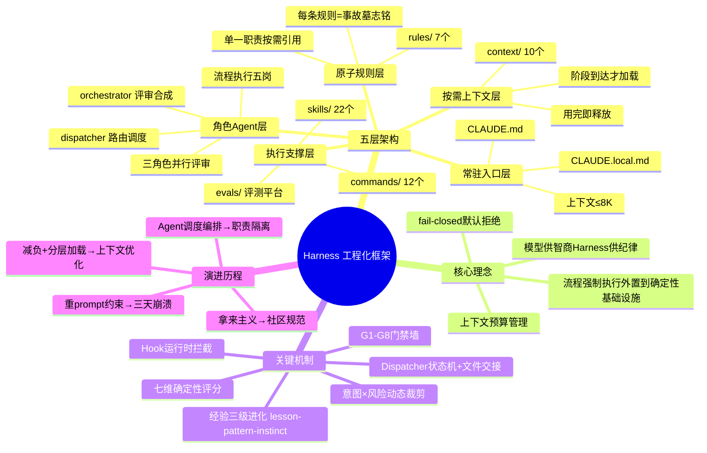
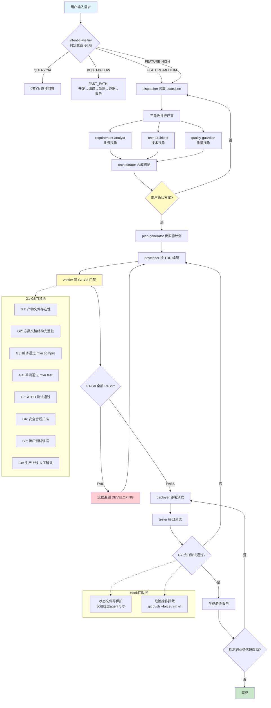

---
tags:
  - tech-article
  - AI
  - AI-Engineering
  - Agent-Architecture
  - Claude-Code
  - Harness
  - Prompt-Engineering
created: 2026-06-16
category: 技术文章/AI
aliases:
  - Harness 工程化实践
  - AI Coding 流程工程
  - AI 纪律框架
---
# AI 不缺智商缺纪律：我的 Harness 工程化实践

> **原文链接**: https://mp.weixin.qq.com/s/2kWi0Fld09fNMVIUg9ddKQ
> **一句话总结**: AI Coding 的瓶颈正从"模型能力"转移到"流程工程"——模型已经足够聪明但不稳定，稳定性必须由外部框架（Harness）供给，核心思路是将上下文当预算管理、用 dispatcher 状态机 + 文件交接替代 prompt 堆砌、用确定性门禁和评分替代对模型的"信任"。
> **前置知识检查**:
> - [ ] 了解 Claude Code 的基本使用方式（CLAUDE.md、hooks、agents、skills）
> - [ ] 理解 LLM 上下文窗口限制及"Lost in the Middle"现象
> - [ ] 了解 Agent 多智能体协作的基本概念
> - [ ] 有 AI Coding 实际踩坑经验（如模型遗忘规则、上下文污染）

## 原文

### 引言：从堆 Prompt 到建框架

作者曾用一个不断膨胀的 `CLAUDE.md` 解决 AI "不守纪律"的问题——把所有规矩写进去：先写单测、部署前评审、提交前合 master。前三天确实管用，但随后规则多到撑爆上下文，模型读完规则就没"脑容量"读代码，开始遗忘、串味、自我矛盾。

**核心洞察**：对付 AI 的不确定性，堆 prompt 是负债，做框架才是资产。

### 一、Harness 是什么

**Harness = 把"AI 该怎么干活"固化成可执行、可约束、可评测的工程框架。** 与"写更好的 prompt"有本质区别——prompt 是一次性的说服，harness 是结构性的约束。模型供给智商，harness 供给纪律。

三个痛点对比：
- **工序随机**：改了接口跳过单测直接推预发 → 意图×风险决定流程，同类任务走同一条链
- **上下文污染**：方案设计时模型混入上一段需求的字段名 → 角色分工、状态外置，各管一段
- **坑反复踩**：`mvn -am` 卡死踩过三次，每次换会话都忘 → 坑沉淀成规则，一次踩、永久兜底

**遗忘的三重根因**：压缩丢失（Auto-Compact 省略流程步骤）、检索失败（记忆文件未被加载）、指令遵循失败（信息都在但模型仍跳步）。Harness 的三层设计（规则外置、状态持久化、门禁阻断）恰好对应这三个根因。

### 二、Harness 五层架构

核心设计思想：**把上下文当预算来管理**。分层标准不是"按功能分类"，而是"按何时被读取"——常驻的极小，深的按需加载。

#### 2.1 常驻入口层：CLAUDE.md + CLAUDE.local.md
放角色、代码偏好、流程触发规则、G1–G8 门禁速查。`CLAUDE.local.md` 自包含、不依赖全局 `@import`。效果：主会话常驻上下文压到 ≤8K。

#### 2.2 原子规则层：rules/（7 个）
每个规则单一职责、可被按需引用。本质是把踩过的坑固化成强制约束：
- `build.md`：禁用 `mvn -am`，只编译单模块（背后事故：`-am` 触发全量解析卡死）
- `branch-hygiene.md`：提预发前必须先合 master（背后事故：多分支集成构建报"找不到符号"）
- `code-search.md`：禁 Grep 搜 Java 结构、禁 LSP，强制走 kbase（背后事故：符号搜索误命中）

**每条规则都是一次事故的墓志铭。**

#### 2.3 角色 Agent 层：agents/
把一个"全能主会话"拆成职责清晰的流水线：

| 类别 | 角色 | 为什么不能合并 |
|------|------|----------------|
| 调度+合成 | dispatcher（路由）、orchestrator（合成） | dispatcher 只读 state.json 做路由决策，orchestrator 只读 phases/*.md 做合成确认——职责正交 |
| 三角色评审 | requirement-analyst、tech-architect、quality-guardian | 业务/技术/质量必须独立思考、互不看到对方初稿，才有对抗性 |
| 流程执行 | plan-generator → developer → verifier → deployer → tester | 每个节点的 system prompt 和可用工具完全不同，合并意味着同时暴露所有工具 |

**核心判断**：主会话应该退化成一个"什么都不想、只执行 dispatcher 指令"的纯执行器。三条铁律：
1. 主会话只听 dispatcher
2. 职责隔离——每个 agent 的可用工具严格受限
3. 上下文 ≤8K

**诚实代价**：链路变长（一次需求在多个 agent 间转交）、调试更难（跨 agent 追 bug）、agent 间通信有 token 与协调开销。

#### 2.4 按需上下文层：context/（10 个）
完整流程详情、Pre-Mortem 模板、对抗辩论模板、证据链规范、TDD/ATDD 指南、记忆进化机制——全放这层，只在进入对应阶段时才被 Read。

**设计原则**：上下文不是越大越好的"免费缓冲区"，而是需要精心管理的稀缺资源。每份 context 只含该阶段所需最小集，用完即释放。

#### 2.5 执行支撑层：skills/（22 个）+ commands/（12 个）+ evals/
- **skills/**：把内部 CLI 和研发工具链封装成 AI 可调用的能力（如 `ubase` 全家桶自动拼 SLS 查询）
- **commands/**：slash 命令入口（`/init-harness`、`/harness-audit`、`/learn`）
- **经验三级进化**（auto-learn 规则驱动）：lesson（单次记录）→ pattern（归纳规律）→ instinct（自动注入规则），每级晋升需人工确认

#### 2.6 稳定性支点：eval 检测 + hook 拦截

- **G1–G8 门禁墙**：每个门禁是确定性的 Python 函数，检查产物存不存在、编译过不过、单测通没通。任一 gate FAIL 则流程退回，不是"建议"是"阻断"。
- **Hook 拦截**：① 状态文件写操作只允许编排层 agent 触发；② 危险操作（`git push --force`、`rm -rf`）弹确认。

**核心原则**：流程强制执行必须从 LLM 推理中外置到确定性基础设施。门禁必须是确定性代码，独立于上下文窗口，fail-closed（默认拒绝）。

#### 贯穿五层的主线：19 节点链 × G1–G8 门禁 × intent×risk 动态裁剪

标准 19 节点链路：需求评审→需求确认→方案设计→方案确认→Pre-Mortem→实施计划→验收标准确认→拉变更→建分支→建 worktree→开发→编译→单测→ATDD→证据链→部署预发→接口测试→上线确认→验收报告

动态裁剪规则：
- `QUERY / NA`：0 个必需节点
- `BUG_FIX · LOW`：FAST_PATH（开发→编译→单测→证据→报告）
- `FEATURE · MEDIUM`：+ 方案设计、对抗辩论、TDD
- `FEATURE · HIGH`：19 节点拉满 + ADR 架构决策记录

外加硬规则——**"改完必部署"**：检测到真实业务代码改动，自动追加部署预发、接口测试为必需节点。

### 三、演进四阶段

- **第一阶段 · 拿来主义**：用社区项目（oh-my-claudecode 等）的 OpenSpec 规范起步，但通用规范覆盖不了自己的开发流程
- **第二阶段 · 重 prompt 约束**：把所有流程规矩写进 CLAUDE.md，三天后崩了——不听话、上下文爆炸、自我矛盾
- **第三阶段 · 减负 + 分层加载**：常驻 prompt 砍到 ≤8K，深度内容移到 context/ 层按需加载
- **第四阶段 · Agent 调度编排**：不再约束模型"你该怎么做"，而是让不同 agent 各司其职、互相制衡

**核心教训**：prompt 约束是说服，不是强制。模型"理解"了规则不等于"遵守"了规则——你无法用更多的字来对抗概率性的遗忘。

### 为什么选文件交接而不是现成编排

| 方案 | 问题 |
|------|------|
| Workflow（JS 脚本编排）| 超时机制（长构建被静默杀死）、无 `askUser` 交互原语、跨 session 不可续 |
| Agent Team（消息驱动）| 松散协调无确定性工序保证、状态散落在 TaskList 中、SendMessage 是"通知"不是"阻断" |
| **dispatcher 状态机 + 文件交接** | 天然持久化（进程崩了文件还在）、可审计（`git diff` 看清每步产物）、强一致性（hook 拦截 + schema 校验） |

**结论**：Workflow 管计算平面，Team 管协作平面，dispatcher + 文件交接管控制平面——三种机制正交互补。

### 四、评测：把流程当被测对象

**核心理念**：评测平台是评估者，不是执行者。它只检测被试是否走完了 harness 的每个节点。

三条轨道：
- `/eval`：多版本×多 case 跑分对比、管基线（headless 全自动）
- `/dev`：用当前基线 harness 真实跑需求全链路（真 MCP + 确认门 + 真部署）
- `/query`：只读排查根因（真 bug 一键转 `/dev`）

**七维评分体系**（100% Python 确定性逻辑、零 LLM 调用、3 次跑分 hash 完全一致）：

| 维度 | 权重 | 检查什么 |
|------|------|----------|
| 流程完整性 | 22% | 该走的流程节点是否都走了（按 intent×risk 裁剪） |
| 产物质量 | 15% | 方案文档是否有实质内容（结构检查+反注水检测） |
| 代码正确性 | 22% | 代码能不能编译、单测能不能过（真跑 mvn compile + mvn test） |
| 效率 | 10% | 花了多少时间和 token |
| 安全合规 | 8% | 有没有违反 harness 自身的规则 |
| 迭代能力 | 5% | 编译失败后能不能自己修好 |
| 接口验收 | 18% | 写的代码经得起集成测试吗（真跑 ATDD + 检查 G7 门禁） |

**宁要可复现的"粗糙分"，不要会漂移的"精准分"。** 评测的唯一目的是驱动迭代——只有 3 次跑分完全一致，才能回答"这次改规范到底变好还是变坏"。

**自进化闭环**：创建（AI 生成/fork）→ 评测对比（7 维×多 case）→ 激活基线（留备份可回退）→ 收集弱项维度再优化。

### 五、诚实代价与边界

| 欠账 | 现状与方向 |
|------|-----------|
| D2 判不了深度 | 产物质量只做结构检查，判不了方案优劣 → 拟引 LLM 评委，多次投票取中位数 |
| eval 跑批是单机单进程 | 进程挂了任务就丢 → 需容器化部署 + 任务持久化 |
| 评测集太小 | 仅 5 个 case，长尾意图覆盖不足 |

**前沿方向**：结构化记忆层（VikingMem：更少 Token + 更智能组织 > 全量保留）、代码知识图谱（Codebase-Memory-MCP：AST 分析构建持久化图谱）、编排形态 A/B 对比（agent 编排 vs dynamic workflow）。

### 结语：可迁移的模式

任何"能力够强但输出不稳定、且过程可观测"的 AI 工作流，都可以被这样工程化——给它分层的约束、外置的状态、确定性的评分。边界：依赖"过程可观测"（中间产物可落盘、可检测），且价值随模型进化而衰减——当模型强到能自我保证流程纪律的那天，harness 就该功成身退。

## 核心概念脑图

## 与你已有知识的关联

- **《[[Skills：从编程工具的配角到Agent研发的核心|Skills：从编程工具的配角到Agent研发的核心]]》**：本文 harness 中 skills/ 层（22 个）正是将内部工具链封装为 AI 可调用能力的实践落地，与 Skills 从配角到核心角色的论述一脉相承——Skills 在 haraness 中承担了"执行支撑"的关键角色。

- **《[[AgentSkillsTeams 架构演进过程及技术选型之道|AgentSkillsTeams 架构演进过程及技术选型之道]]》**：本文第四阶段的 Agent 调度编排演进（从 24 agent 过度拆分到精简合并）与该文的技术选型方法论高度呼应——两者都强调"职责隔离"优于"全能模型"，都经历了从过度拆分到合理收敛的过程。

- **《[[企业级 Agent 多智能体架构与选型指南|企业级 Agent 多智能体架构与选型指南]]》**：本文的 dispatcher 状态机 + 文件交接模式为该指南提供了具体的落地参考——特别是 Workflow / Agent Team / dispatcher 三种编排机制的对比分析，直接回答了"什么场景用什么编排"的选型问题。

- **《[[如何构建和调优高可用性的Agent？浅谈阿里云服务领域Agent构建的方法论|如何构建和调优高可用性的Agent？浅谈阿里云服务领域Agent构建的方法论]]》**：本文的七维确定性评分体系和 G1-G8 门禁墙，与该文高可用性 Agent 构建方法论中的"可观测性"和"容错机制"直接对应——两者都强调不能依赖模型自报、必须用确定性手段验证。

- **《[[AI Agent系列｜深入解析Function Calling、MCP和Skills的本质差异与最佳实践|AI Agent系列｜深入解析Function Calling、MCP和Skills的本质差异与最佳实践]]》**：本文对 Workflow / Agent Team / dispatcher 三种机制的对比分析，与该文对 Function Calling、MCP、Skills 的辨析形成互补——前者关注编排层面的技术选型，后者关注工具调用层面的协议选型，组合起来构成 Agent 技术栈的完整视图。

- **《[[优秀的Prompt提示词参考|优秀的Prompt提示词参考]]》**：本文"堆 prompt 是负债，做框架才是资产"的核心教训，为 Prompt 工程划定了边界——Prompt 再好也只能解决"单次说服"，无法解决"持续遵守"，这也解释了为什么需要从 Prompt 工程升级到 Harness 工程。

- **《[[深入理解OpenClaw技术架构与实现原理（上）|深入理解OpenClaw技术架构与实现原理（上）]]》**：本文的 dispatcher 状态机 + 文件交接架构与 OpenClaw 的技术架构形成有趣的对照——两者都涉及多 agent 协调、状态外置、职责隔离，但一个偏重研发流程的工序链控制，一个偏重通用 agent 框架的基础设施。

- **《[[LLM大模型学习|LLM大模型学习]]》**：本文涉及的"Lost in the Middle"（Stanford TACL 2024）、RULER 基准（NVIDIA）、Auto-Compact 压缩机制 等底层 LLM 原理，都需要该文档中的 LLM 基础知识作为前置理解。

## 重难点理解

### 1. 为什么 prompt 约束会失效？（概率性遗忘 vs 确定性约束）

**难点**：很多人直觉认为"把规则写得更详细、更全面"就能让 AI 遵守，但实际效果恰恰相反。规则越多，上下文越拥挤，模型注意力越分散。

**解释**：LLM 的注意力机制呈 U 型分布（Stanford "Lost in the Middle"），上下文中间位置的信息准确率显著下降。当你把所有规则堆进 CLAUDE.md 时，它们占据窗口前端，实际代码被挤到注意力衰减区；更致命的是，Auto-Compact 压缩时会"省略看似不重要的流程步骤"。**prompt 约束的本质是"说服"，模型可以选择性忽略；而 harness 的门禁是 Python 确定性代码，是"阻断"，不存在商量余地。** 这也是为什么作者说"你无法用更多的字来对抗概率性的遗忘"。

### 2. Dispatcher 状态机 + 文件交接为什么优于 Workflow 和 Agent Team？

**难点**：Claude Code 原生提供了 Workflow（JS 脚本编排）和 Agent Team（消息驱动团队），为什么还要自己造一个 dispatcher + 文件交接？

**解释**：关键在于这三种机制解决的是不同层面的问题。Workflow 适合**计算平面**（高并行、单阶段、可在超时窗口内完成的任务），但它有硬伤——无 `askUser` 交互原语（无法暂停等用户决策）、跨 session 不可续（换 session 后状态丢失）。Agent Team 适合**协作平面**（多人并行改多模块），但它松散协调、无确定性工序保证、SendMessage 是"通知"不是"阻断"。**dispatcher + 文件交接专攻控制平面**——天然持久化（进程崩了文件还在）、可审计（`git diff` 看清每步产物）、强一致性（hook 拦截 + schema 校验）。三种机制正交互补，不是替代关系。

### 3. 为什么要用确定性评分而不是 LLM 评委？

**难点**：LLM 打分更懂语义、更"精准"，为什么反而不能用？

**解释**：评测的唯一目的是**驱动迭代**——你必须能回答"这次改规范到底变好还是变坏"。如果评分器本身有 ±5 分的随机波动，A/B 对比就彻底失去意义。确定性评分（100% Python 逻辑、3 次跑分 hash 完全一致）牺牲了"语义精度"，换来了"可复现性"——而可复现性才是迭代的基础。这是一个反直觉但正确的取舍：**宁要可复现的粗糙分，不要会漂移的精准分。** 此外，文件系统不会说谎——流程完整性不靠"模型说做了"，而靠"产物文件在不在"。

### 4. 经验三级进化（lesson → pattern → instinct）的设计精髓

**难点**：为什么不直接把所有踩坑经验自动注入规则，而要设计三级进化 + 人工确认？

**解释**：这是防止错误经验扩散的安全机制。第一次踩坑（lesson）可能是特定环境的偶然事件；第二次在不同项目又遇到（pattern）说明有规律性；第三次验证后才晋升 instinct 自动注入。**每级晋升都需人工确认**——这解决了 AI 自进化中最危险的问题：错误经验的放大传播。以 `mvn -am 卡死` 为例：如果第一次踩坑就自动全局禁用 `-am`，可能在某些确实需要全量编译的场景造成阻碍；但经三次验证确认"Mac + system-scope 依赖 = 禁用 -am"这个精确条件后，规则才值得全局生效。

### 5. 为什么"主会话应该退化成一个纯执行器"？

**难点**：我们本能地想让主模型更全能，但全能恰恰是污染之源。

**解释**：当一个会话同时处理需求分析、方案设计、编码、测试、部署时，所有信息（业务术语、技术细节、状态标记）全挤在一个上下文窗口里互相串味。作者的做法是将主会话类比为微服务架构中的 **thin controller**——不是能力不足，而是职责收窄。dispatcher 读 state.json 决定"下一步调谁"，主会话照做，禁止自己 Read phases/*.md / evidence.json。每个子 agent 从干净上下文启动、只装自己那一段的规则和输入。**这反直觉但有效：让主模型变"笨"（职责收窄），反而让整个系统变聪明（上下文隔离）。**

## 原文内容流程图

## 经验

1. **Prompt 约束是说服，不是强制。** 模型"理解"了规则不等于"遵守"了规则。当规则多到撑爆上下文时，模型开始选择性遵守、遗忘、自我矛盾。应尽快从堆 prompt 转向建框架。

2. **上下文是预算，不是草稿纸。** 常驻层只放角色定义 + 触发规则（≤8K），深度内容按需加载、用完即释放。分层的唯一标准是"按何时被读取"，而非"按功能分类"。

3. **每个 agent 的 system prompt 和可用工具必须差异化。** developer 有 Edit/Bash，verifier 只有 Read/Bash——合并意味着同时暴露所有工具，等于没约束。真正需要警惕的不是 agent 多，而是 agent 间耦合多。

4. **失败必须响亮，绝不静默兜底。** 空产物被兜底成 70 分中性值的教训说明——评分系统必须对失败零容忍，否则劣化版本会和正常版本"分数持平"，完全失去评测意义。

5. **坑只踩一次，之后由规则兜底。** 每条规则背后都是一次真实事故（`mvn -am` 卡死、分支没合 master 集成构建失败、Grep 搜 Java 误命中），将经验固化为规则是 harness 最朴素也最值钱的复利。

## 知识

1. **Claude Code 记忆机制**：完全基于文件系统（CLAUDE.md + JSONL 日志），无向量数据库、无 Embedding。上下文管理靠 5 层渐进式压缩管线——从裁剪低优先级提示、截断工具输出，到最后手段的全量模型摘要（Auto-Compact），流程状态细节恰恰在这一层被丢失。

2. **LLM 注意力 U 型分布**：Stanford "Lost in the Middle"（TACL 2024）证明中部信息准确率显著下降；NVIDIA RULER 基准表明声称支持 32K+ 的模型仅半数能在该长度保持可靠性能。这解释了为什么"把所有规则堆进上下文"注定失败。

3. **验证反馈质量决定 Agent 成功率**：arxiv 2605.29682 的核心发现——原始 token 消耗和工具调用仅解释 agent 成功率方差的 R²=0.33~0.42，而验证反馈质量达到 R²=0.94~0.99。**决定 AI 干活靠不靠谱的不是"给它多少预算"，而是"检查做得多好"。**

4. **Devin 的"脑机分离"架构**：推理（"大脑"）在沙箱外执行，执行环境（"机器"）无权访问大脑状态。本文的 harness 走了更轻量的路——不隔离进程，而是通过 agent 职责隔离 + 文件交接达到类似效果。

5. **Apache Burr 状态机模式**：每个 Agent 决策表达为状态机节点 + 可插拔持久化 + 实时追踪 UI——与本文 dispatcher + state.json 的思路异曲同工，但 Burr 做成了通用框架。

6. **VikingMem 的反直觉发现**（VLDB 2026, ByteDance）：更少的 Token 留存 + 更智能的组织 > 全量保留（16.82% Token 留存得分 75.80，朴素 RAG 100% 留存仅 63.81）。这对上下文管理策略有直接指导意义。

## 可复用建议

1. **新项目接入 Harness 的最小可行集**：① 一份 `CLAUDE.local.md`（角色定义 + 触发规则 + 门禁速查，自包含不依赖全局 import）；② 3-5 条原子规则（覆盖最高频踩坑场景）；③ 至少一个 dispatcher agent（读 state.json 做路由决策）。不要一上来就建 22 个 skills 和 12 个 commands——从最小集开始，踩一个坑加一条规则。

2. **上下文预算管理三原则**：常驻层 ≤8K（只放角色+触发规则）、按需加载（深度内容只在对应阶段 Read）、用完即释放（不占后续窗口）。可用 `/harness-audit` 定期体检上下文占用。

3. **门禁必须外置、确定性、fail-closed**：不要依赖模型"记住"该执行哪个步骤。每个门禁写成确定性 Python 函数，检查产物在不在、编译过不过。默认拒绝，只放行显式允许的操作——即使 AI 不听话，越界就被拦住。

4. **意图×风险动态裁剪**：不是所有需求都走全流程。QUERY 走 0 节点，BUG_FIX/LOW 走 FAST_PATH 5 节点，FEATURE/HIGH 才拉满 19 节点 + ADR。外加"改完必部署"硬规则——检测到业务代码改动自动追加部署+测试。

5. **评分体系设计原则**：宁要可复现的粗糙分，不要会漂移的精准分。用 100% 确定性逻辑、零 LLM 调用。权重最高的维度（如代码正确性 22%）必须真编译真跑单测，不能信 AI 自报。

6. **经验管理三级进化**：lesson（单次记录）→ pattern（跨项目归纳规律）→ instinct（自动注入新项目规则），每级晋升需人工确认，防止错误经验扩散。

## 实施办法

### 第一步：建立最小 Harness 骨架（1-2 天）

1. 在项目根目录创建 `.claude/CLAUDE.local.md`，写入角色定义（如 Java 后端开发）、代码偏好（语言、框架、命名规范）、3-5 条最高频触发规则（如"改完代码必须编译+单测"）。
2. 创建 `.claude/rules/` 目录，将过去一个月踩过的 3-5 个高频坑写成原子规则（每条 ≤200 字，单一职责）。
3. 创建 `.claude/state.json`，定义最简状态机：`{ "status": "IDLE", "phase": null, "intent": null }`。

### 第二步：引入 Dispatcher + 门禁（3-5 天）

1. 创建一个 `dispatcher` agent，读 state.json 做路由决策，system prompt 只写路由逻辑不写业务。
2. 定义 3-4 个基础门禁（G1 产物存在、G2 编译通过、G3 单测通过、G4 代码改动检测），用 Python 脚本实现，集成到 hook 中。
3. 用一个真实的 BUG_FIX/LOW 需求跑通 FAST_PATH（开发→编译→单测→证据→报告），验证 dispatcher + 门禁链路。

### 第三步：扩展 Agent 角色和上下文层（按需渐进）

1. 当发现 developer agent 的 system prompt 超过 3K 时，拆分出 verifier agent（只做检查不管编码）。
2. 当发现某个阶段反复需要查阅同一份知识（如 TDD 规范）时，将其从常驻 prompt 移到 context/ 层按需加载。
3. 当出现跨项目复现的坑时，启动经验三级进化流程（lesson → pattern → instinct）。

### 第四步：建立评测基线（1 周）

1. 准备 3-5 个典型 case（覆盖 QUERY、BUG_FIX/LOW、FEATURE/MEDIUM、FEATURE/HIGH）。
2. 实现 Python 评分脚本，至少覆盖流程完整性（产物文件存在性）和代码正确性（真编译真单测）两个维度。
3. 跑一次基线评分并记录。之后每次改 harness 规范都重跑评分、对比基线——只有分数提升的改动才合入。

### 关键度量指标

- 常驻上下文 Token 数（目标 ≤8K）
- 单次需求端到端耗时（对比 harness 使用前后）
- 编译/单测一次通过率
- 重复踩坑次数（目标：同一类坑只踩一次）
- 评测基线分数 vs 当前分数