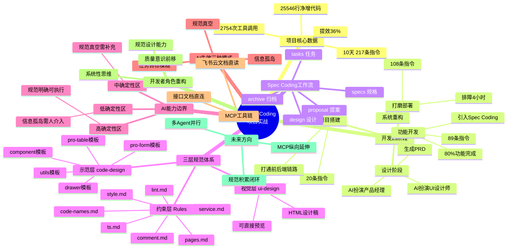
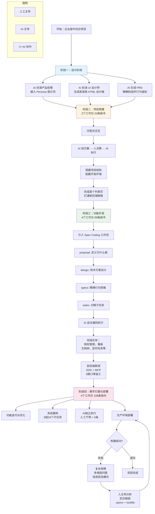

---
tags:
  - tech-article
  - AI
  - Agent
  - Spec-Coding
  - Claude-Code
  - MCP
  - 前端工程化
created: 2026-06-15
category: 技术文章/AI
aliases:
  - Spec Coding 项目实战
  - AI编程能力边界
---

# AI编程能力边界探索：基于 Claude Code 的 Spec Coding 项目实战｜得物技术

> **一句话总结**: 10天、217条指令、2754次工具调用、25546行代码——本文复盘了一场基于 Claude Code 的 Spec Coding（规格驱动编码）从0到1的企业级中后台项目实战，核心结论是：AI编码的本质不是让AI替代人写代码，而是用结构化的规范和工作流把不确定性消除在执行之前，人负责维护"确定性空间"的边界，AI负责在边界内高速执行。

> **前置知识检查**:
> - [ ] 了解 AI 辅助编程的基本概念（如 GitHub Copilot、Cursor、Claude Code）
> - [ ] 了解 LLM（大语言模型）的基本原理和局限性（幻觉、上下文窗口等）
> - [ ] 了解前端工程化的基本知识（React/Vue、TypeScript、CSS 预处理器等）
> - [ ] 了解企业级中后台项目的基本架构（路由、状态管理、API 层等）
> - [ ] （加分）了解 MCP（Model Context Protocol）的基本概念
> - [ ] （加分）了解 OpenSpec 或类似的规格驱动开发工具

---

## 原文

### 一、前言

10 天，2.5 万行代码，提效 36%。基于 Claude Code 的 Spec Coding（规格驱动编码）深度实战。通过 2,754 次工具调用，团队不仅完成了从 0 到 1 的前端项目搭建，更在"约束+示范+视觉"的三层规范体系下，摸清了 AI 编程的真实能力边界。

### 二、Spec Coding：规格驱动编码

**什么是 Spec Coding 工作流**

Spec Coding 的核心思想是：**在写代码之前，先写规格文档**。通过 openspec 工具，每个功能变更都经历以下阶段：

```
proposal → design → specs → tasks → archive
```

1. **proposal（提案）**：描述为什么要做这个变更、做什么；
2. **design（设计）**：技术方案 — 改哪些文件、数据流怎么走；
3. **specs（规格）**：精确的功能行为描述，类似"可执行的 PRD"；
4. **tasks（任务）**：分解为可逐项执行和验证的子任务；
5. **archive（归档）**：变更完成后归档，保留完整决策链。

**Spec 工作流的实际价值**

- **减少返工**：在 proposal 阶段明确"为什么"和"怎么做"，避免实现完才发现方向不对。
- **适合复杂功能**：对于跨多个文件多个层次的功能，tasks 分组让 AI 聚焦在当前步骤。
- **可审计**：每个 Change 的完整决策链（proposal → design → specs → tasks）都留有记录，方便回溯。

### 三、项目是什么

一个标准企业级中后台搭建，包括表格、表单、卡片列表、数据看板等中后台常见核心功能，项目从零搭建到完成全部功能，全程使用 Claude Code 辅助开发。

### 四、数据概览

核心数据（来自 Claude Code 对 109 个 .jsonl 会话文件的统计）：

| 指标 | 数值 |
|------|------|
| 总指令数 | 217 条 |
| 工具调用总次数 | 2,754 次 |
| 文件读取 (Read) | 738 次 |
| 代码编辑 (Edit/Write) | 550 次 |
| 终端命令执行 (Bash) | 662 次 |
| 任务进度标记 (TodoWrite) | 208 次 |
| 会话文件数 | 109 个 .jsonl |
| 净增代码行数 | 25,546 行 |
| 提效比例 | 36% |

2,754 次工具调用的分布揭示了 AI 的"工作方式"——AI 自主完成的文件读取、代码编辑、终端命令执行以及任务进度标记，几乎覆盖了一个研发日常工作的全部动作类型。

### 五、开发时间线：10 天的演进过程

#### 阶段一：设计阶段

在动工之前，完成了产品方向的确认和 UI 设计稿、PRD 的输出。过程主要使用 Cursor + 设计规范 Rules，直接从概念沟通到生成高保真 UI 稿（HTML 文件），再生成标准的 PRD 需求描述，覆盖系统所有核心页面。

#### 阶段二：项目搭建（2个工作日，20 条指令）

以问答式交互为主，聚焦项目基础设施的搭建。向 AI 提出架构问题，由 AI 给出方案，人决策后执行。AI 帮助团队熟悉技术栈、搭建项目结构、配置开发环境，并完成了第一个核心列表页面的开发，成功打通前后端数据链路。

#### 阶段三：功能开发（4个工作日，89 条指令）

开发强度最高的阶段，引入 Spec Coding 工作流，约 80% 的功能代码在此阶段完成。团队不再是简单地给 AI 下达指令，而是先与 AI 共同定义清晰的功能规格（Specification），然后 AI 基于这份"蓝图"自主进行编码。高效完成了授权管理、数据分析看板、文档树状结构等多个复杂功能的开发。

#### 阶段四：细节打磨与生产部署（4个工作日，108 条指令）

工作重心转向功能迭代、系统重构和生产环境的部署排障。与 AI 一起对已有功能进行多轮优化（完善核心业务流程、重构侧边栏导航、修复登录跳转逻辑等），同时对项目首页进行深度代码重构，解决了前期快速迭代中积累的技术债。在部署阶段遇到复杂的构建问题，通过多轮分析和尝试最终定位并解决。

### 六、典型案例

#### 案例一：AI 驱动产品设计

没有产品经理、没有 UI 设计师，一个工程师如何用 AI 独立完成从产品定义到高保真原型、再到研发文档的全流程。

- **让 AI 扮演产品经理**：在 Rules 中植入"首席产品专家" Persona 提示词，将 AI 从工程师的"急于执行"模式切换为产品经理的"先想清楚"模式。
- **让 AI 扮演 UI 设计师**：在 Rules 中定义设计规范，通过对话式生成逐页产出高保真 HTML 文件（而非源码）。
- **让 AI 生成研发可读的 PRD**：基于产品经理角色，将 HTML 设计稿作为上下文，生成精确到组件行为级别的 PRD。

#### 案例二：SDD 驱动前端功能研发

开发"定时任务管理"完整模块，对接 6 个后端接口：

- **页面功能开发**：opsx:new 到 archive，人工指令 < 10 条，AI 代码占比 100%。
- **前后端联调**：SDD + MCP 的联调路径：接口 URL → MCP 直连文档 → 一次性获取字段/枚举/必填项 → 接口文件一次生成 → **联调一次通过，6 个接口零联调返工**。
- **研发效率**：同日额外交付两个完整模块，**3个独立完整模块单日全部开发完成**，当天人效提升 3 倍。

#### 案例三：SDD 驱动系统重构

**重构与新功能的根本差异**：新功能是"从无到有"（AI 可以大胆生成，错了删掉重来），重构是"在活体系统上动手术"（不仅要知道改什么，更要知道不能改什么，以及按什么顺序改）。

**知识问答首页重构**：

- **架构债务**：大量首页业务组件与公共组件混放、useChat 导出 20+ 方法（4 种无关职责混合）、ChatInterface 接收 17 个 props（参数 3 层传递）。
- **执行 TASKS**：9 组 34 个子任务，从"grep 确认组件当前归属"→"按新分层迁移"→"更新所有 import 路径"→"tsc 类型检查"→"冒烟验证"，每一步有明确输入和验收标准。
- **执行结果**：34 个任务全部完成（含 4 个验证任务），AI 全程独立执行，人工干预 < 5 条指令。7 个业务组件与公共组件完成解耦，useChat 拆为 3 个单职责 hook，ChatInterface 从 17 个 props 缩减至 6-8 个。

#### 案例四：复杂问题排障

测试环境构建失败，约 4 小时、7 个会话、15+ 次方案尝试、59 条指令——整个项目单日指令最多的一天，也是 AI 独立解决能力最受限的一天。

**问题特征**：
1. **云服务器构建时发生，本地无法复现**：每次验证方案必须提交代码等待 CI（一轮约 10 分钟），AI 只能分析日志截图，无法感知 CI 环境的隐性配置。
2. **多根因互相掩盖，解决一层才暴露下一层**：AI 每次分析都正确，但只覆盖当前暴露的那一层。
3. **隐性行为无文档，根因藏在依赖源码内部**：Prisma postinstall 境外下载没有任何显式错误，需阅读 node_modules 源码第 2319 行才能发现根因。

**最终确认的原因**：
- `.npmrc` 历史副作用：omit=optional 跳过了 `@tailwindcss/oxide-linux-x64-gnu`（Tailwind v4 native binding），postinstall 陷入循环等待。
- Prisma v6 境外下载沉默卡死：postinstall 不报错、不超时，只是无限等待。
- pnpm 跨平台 lockfile 不一致：macOS arm64 生成的 lockfile 不含 Linux x64 native package。

**最终解法**：锁定 tailwindcss@4.1.11，配置 `PRISMA_ENGINES_MIRROR=https://registry.npmmirror.com/-/binary/prisma`，统一使用 pnpm，CI 命令同步更新，删除 `.npmrc` 中的 `omit=optional`。

### 七、代码规范落地：CLAUDE.md 和 Rules 的实际效果

#### 规范体系设计思想：三层结构

```
第一层：约束层（.claude/rules/）   ← 告诉 AI「禁止什么、必须怎样」
第二层：示范层（.claude/code-design/）← 告诉 AI「标准产出长什么样」
第三层：视觉层（.claude/ui-design/）  ← 告诉 AI「页面应该长什么样」
```

**为什么需要三层？**
只有"约束层"时，AI 知道规则但缺乏参考实现，容易在复杂场景下产生符合规则但不符合团队风格的代码。加入"示范层"和"视觉层"后，AI 可以直接对齐团队的标准产出。

**第一层：约束层（.claude/rules/）**——7 个规范文件：

| 文件 | 约束维度 |
|------|----------|
| ts.md | TypeScript 规范（禁止 any、使用可选链等） |
| code-names.md | 命名规范（kebab-case/camelCase/PascalCase） |
| comment.md | 注释规范（JSDoc、文件头标注） |
| lint.md | 代码风格（单引号、文件末尾换行） |
| style.md | 样式规范（Tailwind CSS、less 文件） |
| pages.md | 页面目录结构规范（constants/services/hooks/components 分层） |
| service.md | API 接口生成规范（fetch{Name}Api 命名、UniversalResp 泛型） |

**第二层：示范层（.claude/code-design/）**——6 个标准模板：

| 模板 | 用途 |
|------|------|
| pro-table/ | 通用列表页模板（含搜索、分页、批量操作、行操作） |
| pro-form/ | 通用表单页模板（含创建/编辑双模式、字段验证） |
| editable-pro-table/ | 可编辑表格模板（含行内编辑、添加/保存/删除） |
| drawer/ | 抽屉组件模板（含标准打开/关闭逻辑） |
| component/ | 通用组件模板（含 README、Props 定义、使用示例） |
| utils/ | 工具函数模板 |

**第三层：视觉层（.claude/ui-design/）**——HTML 设计稿，覆盖主要页面的视觉参考（knowledge-spaces.html、search-strategy.html、space-detail.html 等），可直接在浏览器中打开预览，AI 也可读取其中的结构和样式信息。

#### 规范约束的实际效果

**正面效果：**
- 所有接口函数均以 `fetch{Name}Api` 命名，类型以 `I{Name}Req/Res` 格式，205 个文件保持高度一致。
- 目录分层（constants/services/hooks/components）在每个新页面中被正确创建。
- CURD 页面均参照 pro-table 模板的 hooks 分离方式，代码结构高度一致。
- 几乎所有数据访问都使用了 `?.` 和 `??`，有效避免运行时报错。

**需人工干预的案例：**
- AI 曾将所有代码写在单文件中未按规范分层——通过一条追问后 AI 重构为正确结构。
- AI 错误使用 `.less` 后缀（项目实际使用 SCSS）——收到错误提示后立即修正。
- AI 使用 antd v5 废弃 API（destroyOnClose、dropdownStyle）——需通过报警信息触发修正。

**结论**：规范体系对 AI 的约束是有效的，但规范文件只是"约束"而非"能力"。加入"示范层"和"视觉层"后，AI 有了对齐的锚点，输出质量和一致性明显提升。

### 八、MCP 工具：消除信息断层

在 AI 辅助前端开发中，有两类高频信息断层：

1. **接口文档断层**：接口文档在 API 平台，AI 无法直接访问，只能靠用户手工复制字段。
2. **需求文档断层**：PRD、设计文档存在飞书云文档中，每次引用都需要用户打开→复制→粘贴。

**MCP 一：接口文档直连**

AI 可根据接口 URL 自动拉取完整接口文档——包括入参字段、出参结构、枚举值定义、必填项标注。累计调用 21 次，完成 39 个接口联调。服务端接口未生效之前，支持同步生成 mock 数据。`interface.ts` 类型定义质量非常高，字段注释完整，无需人工校对。

**MCP 二：飞书云文档直读**

AI 可直接读取飞书云文档中的 PRD、设计说明、技术文档等，无需用户手工复制粘贴。典型应用场景：PRD 文档、需求说明等直接从飞书读取为上下文。

### 九、AI Spec Coding 经验总结

#### 重新理解「AI 辅助编程」是什么

AI 不是简单的 "Copilot"，而是一个**极度服从、无限耐心、但没有内部业务知识常识的"顶级执行者"**：

- **极度服从**：一字不差地执行规范，不会主动质疑"这样做合理吗"——规范写得越准确，执行越可靠；规范有歧义，AI 会选一个"看起来合理"的解释而不是停下来问。
- **无限耐心**：34 个任务的重构、9 组联调任务、跨会话的上下文恢复——在人类身上需要消耗大量意志力的事情，AI 没有摩擦成本。
- **没有内部业务常识**：不知道部署环境长什么样、不知道接口上周刚换过版本、不知道"这个交互用户会抱怨"。

#### AI 的能力边界在哪里

根据需求颗粒度选择协作模式：

| 需求颗粒度 | 场景 | 策略 | 理由 |
|------------|------|------|------|
| 小颗粒 | 改文案、修显隐逻辑、调整 CSS 间距 | Cursor Chat 对话即改 | 沟通成本低于编写规范 |
| 中颗粒 | 标准 CRUD 页面、简单业务组件 | 基于 Rules/Skills 预设规范生成 | 有强烈"模式感"，规则定义好即可高质量输出 |
| 中大颗粒 | 重构核心逻辑、复杂业务模块、无参考代码的新功能 | OpenSpec 标准流 (SDD) | 业务逻辑复杂，必须"先设计后编码"防止幻觉和需求偏移 |

#### AI 失效的三种模式

| 模式 | 表现 | 频率 | 应对 |
|------|------|------|------|
| 规范真空 | AI 自行填充"合理默认值"，代码功能正确但风格偏离 | 高 | 补充规范，一次修复全局生效 |
| 信息孤岛 | 本地正常 CI 失败，AI 分析每次都对但只解当前暴露的问题 | 低但代价高 | 跨平台依赖提前锁定，环境差异写成规范前置处理 |
| 任务目标模糊 | AI 把"该问人的问题"当成"执行问题"来解决 | 中 | Spec 的 proposal 阶段强制先描述 Why |

#### 开发者角色的重构

AI Coding 不是让开发者"消失"，而是让开发者的工作**向上迁移**：

- **以前**：写代码（从产品需求 → 系统设计 → 编码）
- **现在**：AI 负责"系统设计 → 编码"，人负责"产品需求 → 系统设计"
- **未来**：人 + AI 协作从"产品需求 → AI 协作执行"

这意味着：

1. **规范设计能力**成为 AI 时代开发者的核心竞争力——能写出让 AI 可靠执行的规范，价值比能写出同等功能代码更高。
2. **系统性思维**变得更重要——AI 可以帮你解决每一个局部问题，但无法帮你看到真实业务全局。
3. **质量意识前移**——过去 Code Review 在代码写完后进行，现在需要在方案设计/任务执行阶段就介入。

#### 值得期待的方向

- **规范体系的结构化积累**：每次踩坑后补充到 CLAUDE.md/rules，形成团队共享的"AI 执行约束库"，建立"踩坑→提炼规范→自动追加"的闭环。
- **MCP 工具链的纵向延伸**：当前 MCP 仅覆盖接口文档、飞书文档。后续接入设计稿、测试用例、发布平台、日志平台，形成完整的 AI Coding 链路。
- **多 Agent 并行开发**：目前大型任务执行等待时间较长，下一步尝试多 Agent 并发生成不同功能模块。

#### 一句话总结

> AI Coding 的本质不仅仅是用 AI 写代码，而是用结构化的规范和工作流把不确定性消除在执行之前——AI 负责在确定性空间里高速执行，人负责维护和扩展那个确定性空间的边界。规范是杠杆，AI 是力，Spec 工作流是支点。

---

## 核心概念脑图



---

## 与你已有知识的关联

本文与你已有知识库中的以下文章存在直接关联：

**《[[个人学习/LLM大模型类相关知识/AI Agent系列｜深入解析Function Calling、MCP和Skills的本质差异与最佳实践|AI Agent系列]]》**：本文第八章详细介绍了 MCP 工具在 AI Coding 中的落地实践（接口文档直连、飞书云文档直读），正是 MCP 协议在前端研发场景中的具体应用案例。

**《[[个人学习/LLM大模型类相关知识/Skills：从编程工具的配角到Agent研发的核心|Skills核心]]》**：本文提出的"三层规范体系"中的"示范层"（code-design 模板），本质上就是 Skills 思维在编程规范中的体现——将团队的"标准产出"固化为可被 AI 直接引用的模板和规则。

**《[[个人学习/LLM大模型类相关知识/AgentSkillsTeams 架构演进过程及技术选型之道|AgentSkillsTeams]]》**：本文第九章"值得期待的方向"中提到的"多 Agent 并行开发"，正是 Agent 协作架构在 AI Coding 场景下的潜在应用方向。

## 重难点理解

### 重难点 1：Spec Coding 为什么能减少返工？

**通俗解释**：想象你要装修一套房子。直接让工人进场施工（传统 AI Coding），工人可能凭经验把墙刷成白色的——但你其实想要淡灰色。Spec Coding 相当于先画好效果图、列清楚材料清单、标出每个插座的位置，然后才让工人进场。AI 在这个比喻里就是那位"极度服从但没常识"的工人——它不会主动问"你要什么颜色"，它会直接选一个自己认为合理的颜色。

**核心洞察**：AI 不会主动澄清歧义，它会在歧义中选择"看起来合理"的解释。所以 Spec 的价值不是约束 AI，而是**消除歧义**。

### 重难点 2：为什么"三层规范体系"比单层约束更有效？

**通俗解释**：如果只给 AI "约束层"（比如"接口必须叫 fetchXxxApi"），就像只给厨师一本《食品安全法》——他知道什么不能做，但不知道你们餐厅的招牌菜长什么样。加入"示范层"（code-design 模板），相当于给了厨师一本菜谱，他能照着做出标准口味。加入"视觉层"（HTML 设计稿），相当于给了成品照片，他可以看到最终的摆盘效果。三层叠加，厨师（AI）的成品才会符合你的期待。

### 重难点 3：AI 的"信息孤岛"模式为什么代价最高？

**通俗解释**：这是一个经典的"洋葱问题"——AI 每次分析都正确，但因为只能看到最外层的问题，解决一层后才暴露出下一层，如此反复。就像你告诉医生"头疼"，医生开药治好了头疼，但你其实是脑膜炎——头疼只是表象。AI 能看到并解决当前暴露的症状，但看不到系统全局的因果链，特别是当根因藏在它无法感知的地方（如 CI 环境配置、node_modules 内部行为）。

**核心洞察**：这不是 AI 的分析能力不够，而是**问题的结构性特征超出了 AI 的信息范围**。

### 重难点 4：开发者角色如何被重构？

**通俗解释**：过去开发者的价值链是：需求理解 → 方案设计 → 编码实现。AI 正在"吃掉"编码实现这一层，让开发者的重心向上迁移到方案设计和规范编写。未来衡量一个开发者价值的，不是你写了多少行代码，而是你设计的规范能让 AI 高效地生成多少高质量的代码。这类似于从"手工艺人"变成了"生产线的质量控制经理"。

### 重难点 5：如何根据需求颗粒度选择协作模式？

**通俗解释**：不是所有需求都值得写一份 Spec——就像不是去楼下买个菜也需要写购物清单。本文给出了一个实战性极强的分级策略：

- **小颗粒**（改文案、修间距）：直接对话，Spec 的沟通成本高于编码成本。
- **中颗粒**（标准 CRUD）：用预设模板/Rules，因为这些需求有强烈的模式感。
- **中大颗粒**（新功能、重构）：走完整的 SDD 流程，因为业务复杂度需要"先想清楚再动手"。

这个分级策略的价值在于：它不是一刀切地说"所有代码都要 Spec"，而是根据**规范成本 vs 返工成本**的权衡来做决策。

---

## 原文内容流程图



---

## 经验

以下是本文可提炼的实践经验和团队可学习的要点：

### 经验 1：先建规范，再写代码

AI Coding 效率的瓶颈不在 AI 本身，而在**规范体系是否完整**。如果团队没有统一的技术规范（命名、目录结构、代码风格），AI 会自行填充"合理默认值"，导致产出虽然功能正确但风格混乱。建议在项目启动时，先花时间建立三层规范体系（约束层 + 示范层 + 视觉层），而不是等项目混乱后再修复。

### 经验 2：Spec 的价值是消除歧义，不是增加文档负担

Spec 不是"多写一份文档"，而是**将决策前置**。在 proposal 阶段把"为什么做"和"怎么做"想清楚，远比实现完才发现方向不对要高效。对于简单需求不需要走完整 SDD 流程，需要根据复杂度分级决策。

### 经验 3：MCP 消除信息断层是提效的关键杠杆

接口文档和需求文档的"复制粘贴"流程看似小事，但日积月累会成为 AI Coding 的最大摩擦点。用 MCP 工具让 AI 直接拉取接口文档和需求文档，消除人为的信息中转环节，才能让 AI 在上下文完整的条件下做最优判断。

### 经验 4：AI 排障效率取决于信息可及性

当问题涉及 AI 无法感知的环境状态（CI 配置、node_modules 内部行为、跨平台差异）时，AI 的排障能力急剧下降。这类问题需要人的系统性思维来补充——人负责看到全貌、定位根因，AI 负责执行具体排查动作。

### 经验 5：质量意识前移，而非后置检查

过去的 Code Review 在代码写完后进行，但 AI 生成代码的速度远超人工 Review 的速度。更高效的方式是在方案设计（design/specs 阶段）就介入审查，确保"蓝图"正确，然后信任 AI 的执行。

---

## 知识

### 知识点卡片 1：Spec Coding（规格驱动编码）

| 维度 | 内容 |
|------|------|
| **定义** | 在写代码之前先写规格文档的编程范式，通过结构化流程消除 AI 执行中的不确定性 |
| **五个阶段** | proposal → design → specs → tasks → archive |
| **核心价值** | 减少返工、适合复杂功能、决策链可审计 |
| **适用场景** | 中大颗粒复杂功能、无参考代码的新功能、系统重构 |
| **不适用场景** | 小颗粒简单修改（改文案、修样式），Spec 成本高于编码成本 |
| **关键工具** | openspec |

### 知识点卡片 2：AI Coding 三层规范体系

| 维度 | 内容 |
|------|------|
| **约束层（.claude/rules/）** | 告诉 AI "禁止什么、必须怎样"（命名、类型、风格、目录结构） |
| **示范层（.claude/code-design/）** | 告诉 AI "标准产出长什么样"（pro-table、pro-form 等模板代码） |
| **视觉层（.claude/ui-design/）** | 告诉 AI "页面应该长什么样"（HTML 设计稿，可浏览器预览） |
| **为什么需要三层** | 单层约束只能告诉 AI "不能做什么"，加示范和视觉层才能让 AI 对齐团队标准产出 |
| **实际效果** | 205 个文件命名高度一致，目录分层正确，代码结构统一 |

### 知识点卡片 3：AI 失效的三种模式

| 模式 | 根因 | 表现 | 应对策略 |
|------|------|------|----------|
| **规范真空** | 领域无规范约束 | AI 自行填充默认值，风格偏离 | 补充规范，一次修复全局生效 |
| **信息孤岛** | AI 看不到系统外状态 | 本地正常 CI 失败，多根因层层掩盖 | 跨平台依赖提前锁定，环境差异前置处理 |
| **任务目标模糊** | 需求描述不精确 | AI 把"该问人的问题"当执行问题解决 | Spec 的 proposal 阶段强制先描述 Why |

### 知识点卡片 4：需求颗粒度分级协作策略

| 颗粒度 | 场景示例 | 协作模式 | 决策依据 |
|--------|----------|----------|----------|
| **小颗粒** | 改文案、修显隐、调 CSS | 直接对话 | 沟通成本 < 规范编写成本 |
| **中颗粒** | 标准 CRUD 页面、简单业务组件 | Rules/Skills 预设规范 | 有强烈模式感，模板可复用 |
| **中大颗粒** | 重构核心逻辑、复杂新模块 | OpenSpec SDD 标准流 | 业务逻辑复杂，需先设计后编码 |

### 知识点卡片 5：MCP 在 AI Coding 中的应用

| 维度 | 内容 |
|------|------|
| **解决的核心问题** | 消除 AI 与外部系统（接口文档、需求文档）的信息断层 |
| **MCP 一：接口文档直连** | AI 直接拉取接口文档（字段、枚举、必填项），自动生成 interface.ts，21 次调用完成 39 个接口联调 |
| **MCP 二：飞书云文档直读** | AI 直接读取 PRD、设计文档，消除人工复制粘贴环节 |
| **联调效率提升** | SDD + MCP 模式下，6 个接口零联调返工 |
| **扩展方向** | 接入设计稿、测试用例、发布平台、日志平台 |

---

## 可复用建议

### 建议 1：建立团队的 AI Coding 规范体系

**具体做法**：在项目仓库中创建 `.claude/` 目录，分三层组织：

```
.claude/
├── rules/          # 约束层：ts.md, code-names.md, comment.md, lint.md, style.md, pages.md, service.md
├── code-design/    # 示范层：pro-table, pro-form, drawer, component, utils 等模板
└── ui-design/      # 视觉层：各核心页面的 HTML 设计稿
```

**预期收益**：AI 生成的代码从"功能正确但风格混乱"提升到"功能正确且风格一致"。

### 建议 2：按需求颗粒度分级使用 Spec 工作流

**小颗粒**：直接用 AI Chat 对话修改，不写 Spec。

**中颗粒**（标准 CRUD、简单组件）：准备一套 Rules 或 Skills，让 AI 参考模板生成。可以复用现有的 pro-table.mdc 等规则。

**中大颗粒**（新功能模块、重构）：走完整 SDD 流程：proposal → design → specs → tasks → archive。

### 建议 3：用 MCP 打通 AI 与研发基础设施

优先接入两类 MCP：
1. **接口文档 MCP**：让 AI 直接拉取 API 平台的接口定义，减少人工复制粘贴和字段遗漏。
2. **文档平台 MCP**：让 AI 直接读取 PRD/设计文档，保持需求上下文的一致性。

### 建议 4：将 AI 排障经验固化为规范

每次遇到"信息孤岛"类型的排障问题后，将问题根因和环境差异**写入规范文件**（如 `.claude/rules/deploy.md`），形成"踩坑→提炼规范→下次避免"的闭环。例如：
- CI 构建平台的 Node 版本
- pnpm/npm 的选用策略
- 需要锁定的关键依赖版本
- 跨平台 lockfile 的处理方式

### 建议 5：重构开发者的 Code Review 流程

将 Code Review 前移：
- **Spec 阶段 Review**：检查 proposal/design/specs 是否合理，而非等代码生成后再检查。
- **任务阶段 Review**：对 tasks 的分解方式进行审查，确保验收标准明确。
- **代码阶段 Review**：信任规范约束下的 AI 产出，重点检查边界情况和规范遵循度，而非逐行检查。

---

## 实施办法

### 第一步：搭建项目基础设施（预计 1-2 天）

1. 在项目仓库中创建 `.claude/` 目录结构。
2. 编写约束层规范文件（rules/），至少覆盖：TypeScript 规范、命名规范、目录结构规范、API 接口生成规范。
3. 从团队已有项目中提取 2-3 个标准页面作为示范层模板（code-design/）。
4. 如果有 UI 设计稿，导出为 HTML 放入视觉层（ui-design/）。

### 第二步：小范围试点 Spec Coding（预计 3-5 天）

1. 选择一个**中颗粒度**的新功能（如一个标准 CRUD 页面），尝试用 Rules/Skills 驱动生成。
2. 验证三层规范体系的实际效果，记录 AI 产出中的偏离项。
3. 根据偏离项反向补充规范文件，形成第一轮"踩坑→提炼规范"的闭环。

### 第三步：逐步引入完整 SDD 流程（预计 1-2 周）

1. 选择一个**中大颗粒度**的复杂功能或重构任务。
2. 按 SDD 流程执行：与 AI 共同完成 proposal → design → specs → tasks。
3. 让 AI 自主执行 tasks，人仅在关键节点介入验证。
4. 记录完整的时间消耗和代码质量数据，对比传统开发方式的效率差异。

### 第四步：接入 MCP 工具链

1. 调研团队已有的 API 文档平台和文档管理平台，确定可对接的 MCP 服务。
2. 优先实现接口文档 MCP（投入产出比最高）——让 AI 直接拉取接口定义生成 TypeScript 类型。
3. 实现文档平台 MCP，让 AI 直接读取 PRD 和设计文档。

### 第五步：建立持续优化闭环

1. 每次遇到 AI 产出偏差或排障困难，将根因提炼为规范条目，追加到对应的 rules 文件。
2. 定期回顾规范文件，删除过时的、合并重复的、补充缺失的。
3. 将规范体系从"个人项目"推广到"团队共享"，形成团队的 AI 执行约束库。

### 成功标准

- **初级目标**：AI 生成的标准 CRUD 页面，一次通过率达到 80% 以上，无需多轮调整。
- **中级目标**：复杂功能模块通过 SDD 流程，返工轮次控制在 2 轮以内。
- **高级目标**：团队所有成员共享同一套规范体系，AI 产出风格高度一致，Code Review 重点从"查风格"转向"查逻辑"。

---

> **原文信息**：作者 阳凯，来源 得物技术微信公众号
> **数据声明**：本报告由 Claude Code 基于 109 个真实历史会话、2,754 次工具调用记录生成，人工补充并校准。
> **原文链接**：https://mp.weixin.qq.com/s/1Oi7YhMgcPp9gQAWPndXWA