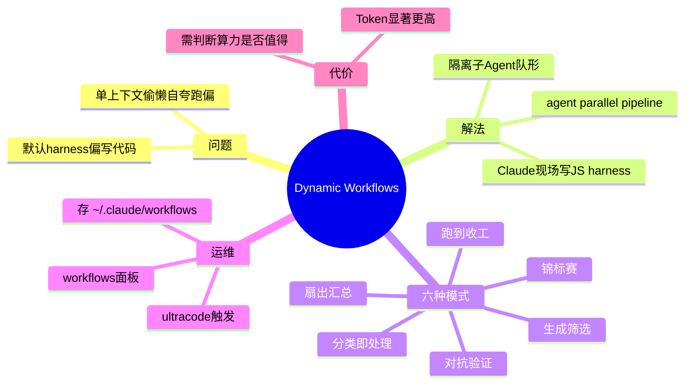

---
tags:
  - tech-article
  - AI
  - Claude-Code
  - Harness
  - Dynamic-Workflow
  - Agent-Teams
  - Loop-Engineering
created: 2026-06-24
category: 技术文章/AI
aliases:
  - Claude Code动态工作流
  - Dynamic Workflows
  - 动态harness
---

# Claude Code 动态工作流详解：让 Claude 自己现写一套 harness，把一个任务拆给一队 Claude 去干

> **原文链接**: [微信公众号原文](https://mp.weixin.qq.com/s/oppul-tJ8_X5ZRLX6NMzPg)

> **一句话总结**: Anthropic 在 Claude Code 推出 Dynamic Workflows——Claude 针对当前任务现场生成可执行的 JavaScript harness（`agent`/`parallel`/`pipeline`），用隔离子 Agent 队形解决单上下文偷懒、自夸、跑偏，但 Token 成本显著高于普通会话。

> **前置知识检查**:
> - [ ] 了解 Claude Code 与 harness 概念
> - [ ] 知道 Agent 上下文窗口与 context rot
> - [ ] 理解 Agent vs Workflow 选型
> - [ ] 有子 Agent / 多 Agent 协作基本概念

## 原文


录友们好，继续聊 Claude。

上一篇 Managed Agents 讲了 Anthropic 怎么把 harness 连同基础设施托管——主角是「平台替你管 harness」。这一篇反过来：**Claude Code 能自己现写 harness，针对当前任务临时造专属外壳。** 这就是 **动态工作流（Dynamic Workflows）**。

## 先搞清楚：默认 harness 是为「写代码」定制的

harness 控制 Claude **读什么、什么时候动手、产出怎么验证**。Claude Code 自带 harness 为写代码打磨，但实际任务还有深度调研、安全审计、分工、代码评审等——过去要极致只能 **手搓 harness**。动态工作流：**不用你手搓，Claude 现场写。**


固定 harness 一套尺寸套所有任务；动态工作流则 Claude 分析任务后为调研、安全、评审各写量身外壳。

## 关键一步：工作流是「真的代码」，不是提示词

**动态工作流是 Claude 现场生成并执行的 JavaScript 文件。** 基本积木：

- `agent(prompt, opts)`：开子 Agent，干净上下文，JSON Schema 约束输出；
- `parallel(...)`：栅栏，多任务全完才继续；
- `pipeline(items, ...)`：流水线，项之间不互相阻塞。

Claude 据此决定开几个子 Agent、强弱模型路由、git worktree 隔离、并行/串行——**非预先写死，而是分析任务后自定。**

## 为什么非得这么折腾？单个 context 扛不动

长任务单 Claude 易出现：


- **偷懒（agentic laziness）**：审 50 文件审到 35 就说完——上下文满把「差不多」当「做完」；
- **自夸（self-preferential bias）**：验自己活偏向维护旧结论；
- **跑偏（goal drift）**：长对话压缩丢约束，解的不是原问题。

动态工作流 **结构性** 解法：多隔离子 Agent——无全局上下文藏偷懒；独立验证 Agent 消除自夸；短窗口摁住跑偏。

## 六种最常复用的编排模式

| 模式 | 怎么跑 | 适合 |
| --- | --- | --- |
| 分类即处理 | 先分流，路由专门 Agent | 工单 triage、产出归档 |
| 扇出+汇总 | 并行多 Agent，栅栏汇总 | 审计、跨模块评审、深度调研 |
| 对抗验证 | 提出 vs 挑刺，上下文隔离 | 根因排查、结论复核 |
| 生成+筛选 | 广撒网生成再筛弱项 | 取名、方案探索、测试用例 |
| 锦标赛 | 多 Agent/模型竞赛，裁判选优 | 模型路由、方案择优 |
| 跑到收工为止 | 动手—检查—修复直到停止条件 | 开放式排查、清扫式发现 |

**对抗验证**最该记住：验活与干活分家，结论须「反驳失败」才算数。

## 怎么开、怎么存、怎么分享

- **触发**：说「给这个任务做一套工作流」，或 effort 调 `ultracode`；
- **盯进度**：`/workflows` 面板看阶段、子 Agent、工具调用、token；可暂停/跳过/重试；
- **可恢复**：运行有 ID，断点续跑，已完成阶段走缓存；
- **沉淀**：面板按 `s` 存到 `~/.claude/workflows`，可分享 JS 到 Skill 文件夹——**是模板非死脚本**，会随任务自适应。

## 但别滥用：它很烧 token

动态工作流比普通单 Agent **烧得多得多**。判断标准：**是否真的需要比一个上下文窗口更多的算力？**

- **值得上**：50 文件安全审计、上千行排序、高不确定调研、高风险独立验证、高复用可沉淀流程；
- **别上**：两行 bug、单文件改动——杀鸡用牛刀。

与 Agent Teams 关系：角色固定用 Teams，角色需临场拆解用动态工作流。目前 research preview，跑在 Claude Opus 4.8。

## 写在最后

从「写 Loop」到 Managed Agents 托管 harness，再到 Claude 自己现写 harness——**编排正从「人设计架构」挪到「模型自己决定」**。你负责说清楚成功标准与信任边界，外壳 Claude 自己搭。

> **图片说明**: 原文 3 张配图位于 `assets/Claude Code 动态工作流详解：让 Claude 自己现写一套 harness，把一个任务拆给一队 Claude 去干/`。

---

## 核心概念脑图



## 与你已有知识的关联

**《[[大厂技术文章-DailyTech/Prompt被淘汰了？深度拆解Loop Engineering，炒作还是趋势？|Loop Engineering]]》**：Loop 的生成者/检查者分离与本文「对抗验证」「独立验证 Agent」同构——动态工作流把 Loop 思想代码化为可执行 JS 模板。

**《[[大厂技术文章-DailyTech/Loop Engineering 实践指南：在 Code Buddy 中构建自主循环系统|Loop实践指南]]》**：Code Buddy 双层循环 + 对抗验证；Claude Code Dynamic Workflows 是 Anthropic 官方侧的同类能力，且 harness 由模型即时生成而非人预写。

**《[[大厂技术文章-DailyTech/重磅！Loop Engineering 实操手册公开|Loop实操手册]]》**：实操手册强调接受率 KPI 与五构件；动态工作流 `/workflows` 面板的可观测性（阶段/token/重试）是 Loop 工程在 Claude Code 内的产品化表达。

**《[[大厂技术文章-DailyTech/一篇搞懂 AI Coding Agent 的 Token 成本控制|Token成本控制]]》**：该文五层优化框架；本文明确警告动态工作流 **Token 远高于单会话**，选型前须做「算力是否值得」判断。

**《[[大厂技术文章-DailyTech/AI 不缺智商缺纪律：一场 Harness 工程化实践|Harness工程化]]》**：企业 Harness 讲门禁与编排纪律；Dynamic Workflows 是 Claude Code 内置的「模型自生成 Harness」极端——编排权上移到模型，人定义成功标准与信任边界。

## 重难点理解

- **重点/难点1**: 不是提示词工作流 — 是 **可执行 JavaScript**，含 `agent`/`parallel`/`pipeline` 等真实编排原语。

- **重点/难点2**: 结构性抗失败模式 — 隔离防偷懒、独立验证防自夸、短窗口防跑偏；比「写更长 system prompt」更可靠。

- **重点/难点3**: 对抗验证 — 提出与挑刺 Agent **不共享上下文**，结论须经受反驳失败，与 Loop/Skills 挑刺子 Agent 同源。

- **重点/难点4**: 模板 vs 死脚本 — 存到 `~/.claude/workflows` 的是 **自适应模板**，非一行不差重放；分享进 Skill 文件夹供队友复用。

- **重点/难点5**: Token 代价 — 多 Agent 协调成本极高；两行 bug 别上，50 文件审计才值得。

## 原文内容流程图

```mermaid
flowchart TD
  A[用户任务] --> B{需要多算力?}
  B -->|否| C[默认单Agent harness]
  B -->|是| D[Claude分析任务]
  D --> E[生成JS Dynamic Workflow]
  E --> F[编排: agent/parallel/pipeline]
  F --> G[子Agent隔离执行]
  G --> H{对抗验证?}
  H -->|是| I[独立验证Agent挑刺]
  H -->|否| J[栅栏汇总]
  I --> J
  J --> K[/workflows 可观测]
  K --> L{值得沉淀?}
  L -->|是| M[存 ~/.claude/workflows]
  L -->|否| N[结束]
```

## 经验

1. **先问算力是否值得**: 单上下文能搞定的别上动态工作流 — **应用场景**: 任务评估与 effort 选择。

2. **对抗验证用于高风险结论**: 干活与验活必须分 Agent、不共享上下文 — **应用场景**: 安全审计、根因复核、代码评审。

3. **扇出+汇总做 breadth 任务**: 50 文件审计、跨模块评审 — **应用场景**: 大 scope 只读分析。

4. **沉淀可复用模板**: 一次漂亮根因排查存 workflow，下次自适应复用 — **应用场景**: 团队 SOP 资产化。

5. **与 Agent Teams 分工**: 角色固定 → Teams；角色临场拆 → Dynamic Workflows — **应用场景**: 多 Agent 选型。

## 知识

| 知识点 | 定义 | 关键要素 | 关联概念 |
|-------|------|---------|---------|
| Dynamic Workflows | Claude 针对任务现场生成的 JS harness | agent/parallel/pipeline | Managed Agents |
| harness | 控制读/动手/验证的编排外壳 | 默认偏写代码 | Harness 工程 |
| agentic laziness | 上下文满时提前宣称完成 | 结构性拆子 Agent | Context Rot |
| 对抗验证 | 提出与挑刺 Agent 隔离 | 反驳失败才采纳 | Loop 检查者 |
| ultracode effort | 触发自动上工作流的档位 | 与口头指令等效 | Claude Code |

## 可复用建议

1. **任务分级再选 harness**: 小改 → 默认；大 audit/调研 → 动态工作流或 Teams — **适用场景**: Claude Code 日常 — **预期效果**: 避免 Token 浪费。

2. **优先对抗验证模式**: 任何「模型验自己的结论」场景改为独立验证子 Agent — **适用场景**: CR、安全、根因 — **预期效果**: 降低 self-preferential bias。

3. **用 /workflows 做 Loop 观测**: 阶段/token/重试对应 Loop KPI 采集 — **适用场景**: 长任务调试 — **预期效果**: 可定位卡死或偷懒步骤。

4. **沉淀 workflow 到 Skill**: 团队共享 JS 模板而非复制 prompt — **适用场景**: 重复性高流程 — **预期效果**: 组织级 Harness 资产。

## 实施办法

1. **第1步**: 评估任务 scope——是否超过单上下文、是否需要独立验证或并行 breadth。

2. **第2步**: 触发方式：明确说「做一套工作流」或 effort `ultracode`。

3. **第3步**: 执行中用 `/workflows` 监控；卡住则暂停/跳过/单 Agent 重试。

4. **第4步**: 成功后按 `s` 存模板；高价值流程放入 Skill 文件夹分享。

5. **第5步**: 复盘 Token 消耗，校准「值得上/别上」清单，避免小任务滥用。
