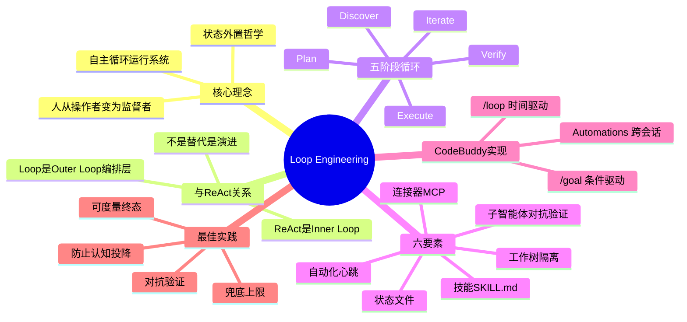
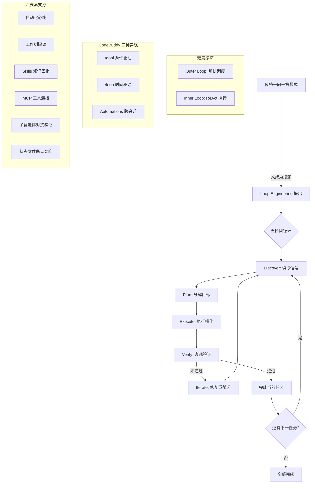

---
tags:
  - tech-article
  - AI
  - Loop-Engineering
  - Code-Buddy
  - Agent
  - ReAct
  - 对抗验证
  - 状态外置
created: 2026-06-22
category: 技术文章/AI
aliases:
  - Loop Engineering CodeBuddy
  - 自主循环系统实践
---

# Loop Engineering 实践指南：在 Code Buddy 中构建自主循环系统

> **原文链接**: https://mp.weixin.qq.com/s/YqIyL7uW4EV2r5HLDW7wcA

> **一句话总结**: Loop Engineering 是在 ReAct 之上构建编排层，通过状态外置、对抗验证和条件驱动循环，让 AI 从单次响应工具升级为长期自治代理的系统设计范式。

> **前置知识检查**: 
> - [ ] 了解 ReAct（Reasoning + Acting）交互范式
> - [ ] 了解 AI Agent 基本概念（Agent、Tool Calling、Context Window）
> - [ ] 了解 Git worktree 并行开发模式
> - [ ] 了解 Prompt Engineering 和 Context Engineering 基础

## 原文

### 一、什么是 Loop Engineering

Loop Engineering 是由谷歌工程师 Addy Osmani 提出的 AI 编程新范式。核心理念：**围绕大模型构建自主循环运行系统，使 AI 从单次响应工具升级为长期自治代理。**

传统 AI 辅助开发中，交互模式是"一问一答"——瓶颈在于**人成了循环的瓶颈**。每一步都需要人类介入，AI 无法自主推进复杂工作流。

Loop Engineering 的解法：**让人从循环内部的操作者，转变为循环之上的监督者和目标设定者。** 你定义"做什么"和"何时算完成"，AI 自己决定"怎么做"和"下一步是什么"。

类比 PDCA 循环（Plan-Do-Check-Act）：
- **模型**是执行者
- **Loop**是控制中枢
- **规则框架**是边界约束

**为什么现在重要**：当模型能力足够强时，**循环设计**成为决定 AI 自主性与可靠性的关键瓶颈。被视为继 Prompt Engineering、Context & Harness Engineering 之后的"AI 编程第三次革命"。

### 二、Loop Engineering 与 ReAct 的区别

**本质关系：ReAct 是 Loop Engineering 的 Inner Loop。**

```
Loop Engineering（Outer Loop）
┌─────────────────────────────────────────────────────┐
│  目标拆解 → 任务分配 → 结果汇总 → 再计划              │
│                                                       │
│  ┌─────────────────────────────────────────────────┐ │
│  │  ReAct（Inner Loop）                             │ │
│  │  思考 → 行动 → 观察 → 思考 → 行动 → 观察 ...     │ │
│  └─────────────────────────────────────────────────┘ │
│                                                       │
│  ┌─────────────────────────────────────────────────┐ │
│  │  ReAct（Inner Loop）                             │ │
│  │  思考 → 行动 → 观察 → 思考 → 行动 → 观察 ...     │ │
│  └─────────────────────────────────────────────────┘ │
└─────────────────────────────────────────────────────┘
```

**核心差异：**

| 维度 | ReAct | Loop Engineering |
|------|-------|-----------------|
| 关注层次 | 单次任务的执行过程 | 跨任务的编排与调度 |
| 循环粒度 | 细粒度（单步工具调用） | 粗粒度（整个任务周期） |
| 状态管理 | 依赖上下文窗口内记忆 | 状态外置到文件/数据库 |
| 停止条件 | 模型自己判断"做完了" | 独立评估器验证可度量条件 |
| 验证机制 | 自我检查（同一模型） | 对抗验证（不同模型/独立评估器） |
| 错误恢复 | 在同一上下文内重试 | 断点续跑，可跨会话恢复 |
| 并行能力 | 单 Agent 串行 | 多 Agent 并行 + 工作树隔离 |
| 运行周期 | 单次对话 | 可持续数小时甚至数天 |

**类比**：ReAct 是工人砌墙，Loop Engineering 是项目经理编排工程。

**ReAct 的四大局限与 Loop Engineering 的补位：**

1. **上下文窗口有限** → 状态外置（Memory、CODEBUDDY.md、Rules）
2. **自我检查有盲区** → 对抗验证（执行者和评估者用不同模型）
3. **无跨任务进度跟踪** → 断点续跑（状态文件 + `/goal --resume`）
4. **缺少编排能力** → 多 Agent 并行 + 工作树隔离

**演进关系**：
```
Prompt Engineering    → 怎么问（单次交互优化）
  ↓
ReAct                → 怎么做（单任务内的推理-行动循环）
  ↓
Loop Engineering     → 怎么管（跨任务的编排、验证、状态管理）
```

### 三、核心架构

**五阶段循环机制：Discover → Plan → Execute → Verify → Iterate**

| 阶段 | 说明 | 关键设计 |
|------|------|---------|
| Discover | 自动读取 CI 失败、issue、代码审查等信号 | 输入源要结构化、可订阅 |
| Plan | 分解目标为具体步骤 | 温度适中，避免过早收敛 |
| Execute | 执行代码编辑与工具调用 | 工具调用要幂等、可回滚 |
| Verify | 通过测试、lint、类型检查等客观信号验证 | 验证标准必须客观、可机器判定 |
| Iterate | 失败则自动修复并重新循环；成功则进入下一任务 | 状态要持久化，支持断点续跑 |

**六要素构建体系：**

| 要素 | 作用 | 为什么重要 |
|------|------|-----------|
| 自动化 | 提供循环心跳 | 没有心跳就没有循环 |
| 工作树 | Git worktree 并行隔离 | 并行开发零冲突 |
| 技能（SKILL.md） | 固化项目知识 | 避免冷启动重新推导 |
| 连接器（MCP） | 打通 issue、CI 等工具链 | AI 必须能感知真实世界 |
| 子智能体 | 写代码与检查代码分离 | 对抗验证避免盲区 |
| 状态文件 | 记录进度，支撑断点续跑 | 防止上下文遗忘和信息漂移 |

**状态外置哲学**：所有状态存储在外部系统，而非模型的上下文窗口。每次循环迭代从全新上下文开始，基于持久化内容工作。

### 四、CodeBuddy 中的三种实现

#### 4.1 `/goal` — 条件驱动的持续工作

```bash
# 基本语法
/goal <完成条件>

# 实际示例
/goal all tests in test/auth pass and the lint step is clean

# 加兜底上限
/goal all tests pass or stop after 20 turns
```

**写好条件的三个关键要素：**

| 要素 | 说明 | 示例 |
|------|------|------|
| 可度量的终态 | 测试结果、构建退出码 | `all tests in test/auth pass` |
| 可证明方式 | 明确怎么验证 | `` `npm test` exits 0 `` |
| 不可破坏的约束 | 过程中不能改的东西 | `no other test file is modified` |

**评估机制**：每轮结束后，由独立小模型（如 gemini-2.5-flash）评估器判断：
- ✅ `ok: true` — 条件满足，完成
- 🔄 `ok: false` — 条件未满足，继续下一轮
- ❌ `ok: false, impossible: true` — 目标不可达，立即停止

#### 4.2 `/loop` — 时间驱动的循环任务

```bash
/loop 3m 检查一下流水线是否跑完
/loop 30m 帮我运行一次单元测试
/loop 1h 看一下有没有新的 PR 需要我审查
```

特性：最小间隔 1 分钟，每会话上限 50 个任务，3 天后自动清除。

#### 4.3 Automations — 跨会话的定时任务

持久化的定时任务，支持 Recurring（cron 规则）和 Once（一次性触发）。

**三种方式对比：**

| 方式 | 驱动模式 | 何时停止 | 适用场景 |
|------|---------|---------|---------|
| `/goal` | 条件驱动 | 评估器确认满足 | 有明确终态的实质性工作 |
| `/loop` | 时间驱动 | 主动停或模型判定 | 监控、巡检 |
| Automations | cron 规则 | 永久或设有效期 | 跨会话长期监控 |

### 五、实践案例

1. **`/goal` 完成模块迁移** — 自动扫描、修改、验证、迭代直到测试通过
2. **`/loop` CI 监控与自动修复** — 每 2 分钟检查 CI，失败自动分析修复
3. **Team 模式对抗验证** — planner/coder/reviewer 三角分工
4. **Skills 固化项目知识** — 编码规范和架构约定持久化
5. **MCP 连接器打通工具链** — 接入 Jira、Jenkins 等
6. **Rules + Memory 状态外置** — 跨会话保持上下文

### 六、最佳实践与注意事项

**写好 `/goal` 条件的 checklist：**
- 终态可度量（客观指标，非主观判断）
- 验证方式明确（指定命令/工具）
- 约束不可破坏（过程中不能改的东西）
- 兜底上限（`or stop after N turns`）

**常见陷阱：**
- 验证责任不可转移 — Loop 不代替 Code Review
- 理解债务加速累积 — 定期 review AI 的变更
- 认知投降风险 — 把 AI 当协作者而非权威
- Token 成本约束 — 设置上限，用小模型评估器
- 条件模糊导致无效循环 — 写成"AI 自己的输出能证明"的形式

---

## 核心概念脑图



## 与你已有知识的关联

**《[[个人学习/LLM大模型类相关知识/Skills：从编程工具的配角到Agent研发的核心|Skills核心]]》**：本文的 Skills 要素是该文"Skills 在 Agent 研发中核心价值"的具体落地实践——CodeBuddy 的 SKILL.md 机制正是 Skills 作为 Loop Engineering 六要素之一的体现。

**《[[个人学习/LLM大模型类相关知识/AgentSkillsTeams 架构演进过程及技术选型之道|Agent-Skills-Teams 架构]]》**：本文的 Team 模式（planner/coder/reviewer 三角分工）直接对应该文的 Teams 架构演进，且通过不同角色使用不同模型实现对抗验证。

**《[[技术文章-DailyTech/Loop Engineering 概念解析、思考与实践|Loop Engineering 概念解析]]》**：本文是该文的延伸实践篇，聚焦 CodeBuddy 的具体实现（`/goal`、`/loop`、Automations），是对概念层的工程化落地。

**《[[技术文章-DailyTech/Prompt被淘汰了？深度拆解Loop Engineering，炒作还是趋势？|Loop Engineering 深度拆解]]》**：本文从 CodeBuddy 产品视角补充了该文的理论分析，提供了 `/goal` 条件写作 checklist、评估器三态结果等实操细节。

**《[[个人学习/LLM大模型类相关知识/AI Agent系列｜深入解析Function Calling、MCP和Skills的本质差异与最佳实践|Function Calling/MCP/Skills]]》**：本文的 MCP 连接器要素是该文 MCP 分析的实际应用——通过 MCP 协议打通 Jira、Jenkins 等工具链，使 AI 在循环中能感知和操作真实世界。

## 重难点理解

- **重点1**: 双层循环模型 — Inner Loop（ReAct）负责单任务执行，Outer Loop（Loop Engineering）负责跨任务编排。类比：工人砌墙 vs 项目经理管工程。常见误区：以为 Loop Engineering 替代了 ReAct，实际是在 ReAct 之上增加编排层。

- **重点2**: 状态外置哲学 — 所有状态存在外部系统而非上下文窗口，每次迭代从全新上下文开始。为什么重要：彻底解决模型遗忘、信息漂移与上下文压缩问题，使长任务（数小时/数天）成为可能。

- **重点3**: 对抗验证 — 执行者和评估者使用不同模型/指令，避免"我写的代码当然没问题"的确认偏误。CodeBuddy 中 `/goal` 用小模型评估器，Team 模式中 planner/coder/reviewer 分工。

- **难点4**: `/goal` 条件设计 — 需要同时满足"可度量终态 + 可证明方式 + 不可破坏约束"三要素。常见陷阱：条件太模糊导致 AI 反复尝试但无法满足（无效循环）。

## 原文内容流程图



## 经验

1. **条件驱动的循环比时间驱动更精确**: `/goal` 通过可验证的完成条件自动停止，而 `/loop` 需要手动取消 — **应用场景**: 有明确终态的任务（迁移、重构）用 `/goal`，持续性监控用 `/loop`

2. **对抗验证是防止 AI 自我欺骗的关键**: 让写代码和审代码的 Agent 使用不同模型/指令 — **应用场景**: 任何需要质量保证的 AI 编码任务

3. **状态外置让长任务成为可能**: 不依赖模型记忆，而是从持久化文件读取状态 — **应用场景**: 跨越数小时/数天的复杂重构任务

4. **兜底上限防止 Token 失控**: 始终加 `or stop after N turns` — **应用场景**: 所有无人值守的循环任务

5. **Skills 固化避免冷启动**: 将项目知识写成 SKILL.md，AI 每次自动加载 — **应用场景**: 团队有统一编码规范和架构约定的项目

## 知识

| 知识点 | 定义 | 关键要素 | 关联概念 |
|-------|------|---------|---------|
| Loop Engineering | 围绕大模型构建自主循环运行系统的 AI 编程范式 | 五阶段循环、双层架构、六要素 | ReAct、PDCA、Agentic Coding |
| 双层循环模型 | Outer Loop 编排 + Inner Loop(ReAct) 执行的架构 | Outer Loop、Inner Loop、编排层 | 微服务编排、工作流引擎 |
| 状态外置 | 所有状态存储在外部系统而非上下文窗口 | 持久化文件、Memory、Rules | 12-Factor App、外部化配置 |
| 对抗验证 | 执行者和评估者使用不同模型/指令相互校验 | 不同模型、独立评估器、三态结果 | 代码审查、红蓝对抗 |
| `/goal` 条件三要素 | 可度量终态 + 可证明方式 + 不可破坏约束 | 客观指标、验证命令、兜底上限 | TDD、验收标准 |
| 循环设计六要素 | 自动化、工作树、技能、连接器、子智能体、状态文件 | 心跳、隔离、知识复用、工具链 | Agent 架构模式 |

## 可复用建议

1. **使用条件驱动循环替代手动监督**: 为复杂任务定义 `/goal` 条件，让 AI 自主循环直到完成 — **适用场景**: 模块迁移、大规模重构 — **预期效果**: 减少人工介入次数 80%+

2. **实施对抗验证机制**: 为 AI 编码任务设置独立的审查 Agent 或使用不同模型评估 — **适用场景**: 需要质量保证的任何 AI 编码 — **预期效果**: 减少确认偏误，提升代码质量

3. **建立项目 Skills 文档**: 将编码规范、架构约定写成 SKILL.md — **适用场景**: 团队共享项目 — **预期效果**: AI 每次自动遵循规范，无需重复说明

4. **始终设置循环兜底上限**: 在 `/goal` 条件中加 `or stop after N turns` — **适用场景**: 所有无人值守循环 — **预期效果**: 防止 Token 成本失控

5. **区分三种循环模式使用**: `/goal` 用于有终态的任务，`/loop` 用于监控，Automations 用于长期定期任务 — **适用场景**: AI 辅助开发全流程 — **预期效果**: 选择最合适的驱动模式，避免误用

## 实施办法

1. **第1步**: 在 CodeBuddy 中用 `/goal` 定义一个小任务的条件（如"所有测试通过"），体验自动循环过程，理解条件驱动的运行机制

2. **第2步**: 为当前项目创建 SKILL.md，写入核心编码规范和架构约定，验证 AI 在后续任务中自动加载并遵循这些约定

3. **第3步**: 在复杂重构任务中使用 Team 模式，配置 planner/coder/reviewer 三角分工，让不同角色使用不同模型实现对抗验证

4. **第4步**: 通过 MCP 协议接入项目的 CI/CD 和 issue 系统（如 Jenkins、Jira），打通 AI 循环与真实工具链的连接

5. **第5步**: 建立 Rules + Memory 的状态外置体系，确保跨会话任务能从断点续跑，关键信息不依赖模型记忆
