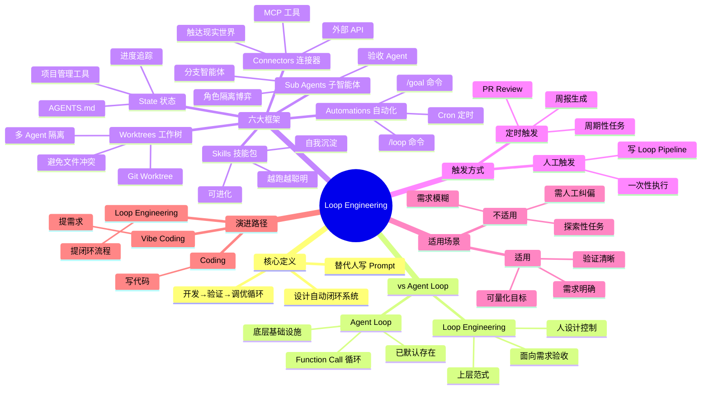
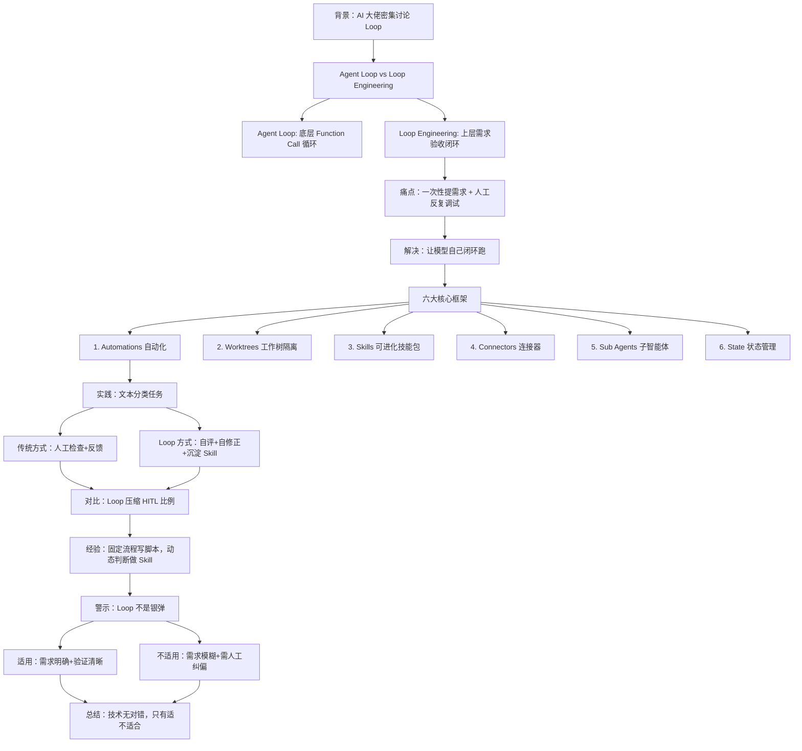

---
tags:
  - tech-article
  - AI
  - Loop-Engineering
  - Agent
  - 自动化
  - 工程化
created: 2026-06-18
category: 技术文章/AI
aliases:
  - 循环工程
  - Loop Engineering
---

# Loop Engineering 概念解析、思考与实践

> **原文链接**: https://mp.weixin.qq.com/s/ael7aIEoomk4AU84E-mpGg

> **一句话总结**: Loop Engineering 是将人从"给 Agent 提示词"的角色中解放出来，转而设计一套能自动循环执行开发→验证→调优的闭环系统，让 Agent 自主完成从需求到交付的全流程。

> **前置知识检查**: 
> - [ ] Agent Loop（Agent 的基础循环机制）
> - [ ] Human-in-the-Loop（HITL，人在循环）
> - [ ] Function Call（函数调用）
> - [ ] Git Worktree（工作树隔离）
> - [ ] Skills（可进化的技能包）

## 原文

### 01 背景

AI 领域出现新概念 **Loop Engineering（循环工程）**。Anthropic Claude Code 负责人 Boris Cherny 表示已不再手写 Prompt，而是编写 Loop 驱动工作流；OpenClaw 创始人 Peter Steinberger 指出应通过设计 Loop 引导 Agent 行为；Andrej Karpathy 强调"必须把自己从 Loop 执行过程中移除"。

Google AI 总监 Addy Osmani 正式定义：
> Loop engineering is replacing yourself as the person who prompts the agent. You design the system that does it instead.
> 
> （Loop Engineering 就是把你从"给 Agent 提示词的人"这个位置上替换掉。你不需要再亲自去写提示词，而是转而设计一套能够自动完成这件事的系统）

### 02 Agent Loop vs Loop Engineering

**Agent Loop（基础循环）**：
- 本质：大模型输出 Response 或 Function Call，将工具执行结果再次作为输入，形成循环
- 特点：底层基础设施，已默认存在
- 变种：ReAct、Ralph Loop 等

**Loop Engineering（循环工程）**：
- 本质：构建在 Agent 之上的、由人设计和控制的**新范式**
- 特点：面向需求验收的外部 Loop，而非底层执行 Loop
- 目标：让模型把"人来催"的环节自动化

**当前痛点**：
- 一次性提需求 → Agent 交付 → 人工验收 → 发现问题 → 反复调试
- 高频指令："继续"、"报错"、"回滚"、"你改了啥"
- 人工参与度高，耗时耗力

### 03 「人机协同循环」重构为「自动化验收闭环」

**核心思路**：
1. 模型完成开发后，**自己先对自己说**"检查错误"、"不符合预期"
2. 基于测试集跑验证 → 拿到反馈 → 调优系统 → 再测试 → 再调优
3. 从「人在循环（HITL）」→「模型自己闭环跑」

**关键变化**：
- **Coding** → **Vibe Coding**：从"写代码"变成"提需求"
- **Vibe Coding** → **Loop Engineering**：从"提一个需求"变成"提一套闭环流程"

**触发方式**：
1. **人工触发**：写一个 Loop 形式的 Pipeline，一步步自动执行
2. **定时触发**：周期性任务（如每天 PR Review、周报生成、股票盯盘）

### 04 Loop Engineering 的六大核心框架

#### 1. Automations（自动化）
- **Codex**：创建自动化任务，选项目、定 Prompt、设频率，问题进 Triage 收件箱
- **Claude Code**：`/loop` 命令、Cron 调度、Hook 触发、`/goal` 命令（多轮对话持续工作直到条件满足）

#### 2. Worktrees（工作树隔离）
- **问题**：多个 Agent 同时改同一文件会冲突
- **解决**：Git Worktree，独立工作目录 + 独立分支 + 共享仓库历史
- **Codex**：内置 Worktree 支持
- **Claude Code**：`--worktree` 参数、子 Agent 设置 `isolation: worktree`

#### 3. Skills（可进化的技能包）
- 可渐进式披露、可复用的能力包（Markdown + 脚本）
- **关键能力**：自我沉淀，在 Loop 每次循环中不断更新积累经验
- **效果**：Agent 越跑越聪明，实现能力迭代与复用

#### 4. Connectors / Plugins（连接器/插件）
- MCP 及延伸工具，接入外部 API
- **作用**：让模型"伸手"触达现实世界服务与数据源
- **现状**：落地最广泛的基础设施

#### 5. Sub Agents（子智能体）
- 主 Loop 运行中动态生成的"分支智能体"
- **典型场景**：主 Agent 开发 → 独立验收 Sub Agent 检查（博弈关系）
- **设计原则**：
  - 探索性、分析性子任务：大胆生成 Sub Agent
  - 最终结果：汇总回主 Agent 整合
  - 验证类 Sub Agent：保持独立，避免"既当运动员又当裁判员"

#### 6. 状态（State）
- 追踪"哪些事已做完"
- **方式**：Markdown 文件（AGENTS.md）、Linear 等项目管理工具（通过 MCP 对接）

### 05 简单实践与思考

**文本分类任务示例**：

**传统方式**：
1. 写提示词 → 模型输出分类结果
2. 人工检查准确率 → 手动反馈调整
3. 沉淀成 Skill

**Loop 方式**：
```
请完成文本分类，分类标准为 1/2/3/4/5；
完成后，请严格按照该标准对结果进行自评；
若发现错误，请主动修正分类逻辑或标准，直到满足要求；
最终将稳定的分类能力沉淀为 Skill。

量化目标：在 100 条测试数据上，准确率 ≥95% 或错误率 ≤5%
```

**与 Skill 自进化的区别**：
- 完全由 Agent 自主驱动完成的 Loop
- 不依赖外部开源框架或预置代码
- Agent 自己构建验证与优化机制

**经验建议**：
- **固定流程**：直接写成脚本（省 token、稳定可复现）
- **需要模型动态判断**：做成可复用的 Skill
- **每天重跑 Loop**：太费 token，实现路径可能漂移

### 06 Loop 不是银弹，用之前需要先想清楚

**适用场景**：
- ✅ 需求明确、验证标准清晰
- ✅ 可量化的目标（准确率、通过率等）
- ✅ 重复性高、流程固定的任务

**不适用场景**：
- ❌ 需求模糊、验证标准不明确
- ❌ 需要人工中途纠偏、调整
- ❌ 探索性、创新性任务

**核心提醒**：
- Loop 对**需求描述和验证逻辑**的要求**更高**
- 开头没写清楚 → Loop 跑偏 → 烧 token 但结果差
- 把控不住时，老老实实回到 Human-in-the-Loop

### 07 总结

Loop Engineering 不是全新技术，而是在原有基础上把自动化又往前推了一步。当有明确需求和清晰验证标准时，Loop 是提效神器；但如果需求和验证模糊，人工迭代可能更稳妥、更经济。

---

## 核心概念脑图



## 与你已有知识的关联

> 注：当前知识库目录为空，暂无可关联的已有知识文档。

## 重难点理解

- **重点1**: **Agent Loop vs Loop Engineering 的本质区别** — Agent Loop 是底层执行机制（Function Call 循环），已默认存在；Loop Engineering 是上层范式（面向需求验收的外部 Loop），由人设计控制。混淆两者会导致理解偏差。

- **重点2**: **从 HITL 到自动化闭环的转变** — 传统模式是"人在循环"（Human-in-the-Loop），人负责验证、反馈、纠偏；Loop Engineering 是让模型自己闭环跑，人只在最后验收。这要求需求和验证标准必须**提前定义清楚**。

- **难点1**: **何时用 Loop、何时不用** — Loop 不是银弹。需求模糊时强行用 Loop，会烧大量 token 但结果差。判断标准：能否用量化指标描述验收条件（如准确率≥95%）。

- **难点2**: **Sub Agents 的拆分原则** — 不是越多越好。探索性任务可大胆拆分，但最终必须汇总回主 Agent；验证类 Sub Agent 必须独立，避免"既当运动员又当裁判员"。

- **误区1**: **Loop = 每天重跑** — 固定流程应写成脚本或 Skill，而非每天现开 Loop。原因：费 token、实现路径可能漂移、不好复现。

## 原文内容流程图



## 经验

1. **Loop 前必须明确需求和验证标准**: 以前提需求模糊点没关系，人可以中途纠偏；但 Loop 中间人不参与，开头没写清楚就会跑偏烧 token。 — **应用场景**: 任何使用 Loop 的场景，尤其是自动化任务。

2. **固定流程写脚本，动态判断做 Skill**: 每天重跑 Loop 太费 token，且实现路径可能漂移不好复现。如果流程固定不需要模型推理，直接写脚本；需要模型动态判断，做成可复用 Skill。 — **应用场景**: 周期性任务（如每日 PR Review、周报生成）。

3. **验证类 Sub Agent 必须独立**: 不让主 Agent 自我检查（当局者迷），引入独立验证 Sub Agent 制造"博弈"关系，用角色隔离打破认知盲区。 — **应用场景**: 复杂任务的质量保证，如代码开发+验收。

4. **多 Agent 并行用 Worktree 隔离**: 两个 Agent 同时改同一文件会冲突，用 Git Worktree 让每个 Agent 拿到独立工作目录，避免"打架"。 — **应用场景**: 并行执行多个 Agent 任务。

5. **Loop 对需求描述能力要求更高**: 把控不住 Loop 效果时，老老实实回到 Human-in-the-Loop，先人工迭代几轮再说。 — **应用场景**: 探索性、创新性任务，或需求不明确时。

## 知识

| 知识点 | 定义 | 关键要素 | 关联概念 |
|-------|------|---------|---------|
| Loop Engineering | 将人从"给 Agent 提示词"的角色中解放，设计能自动循环执行开发→验证→调优的闭环系统 | 替代人写 Prompt、设计闭环系统、自动化循环 | Agent Loop、HITL、Pipeline |
| Agent Loop | Agent 的基础循环机制，模型输出 Response 或 Function Call，将工具执行结果再次作为输入形成循环 | Function Call、Response、循环执行 | ReAct、Ralph Loop |
| HITL (Human-in-the-Loop) | 人在循环，人负责验证、反馈、纠偏 | 人工参与、中途确认、迭代调整 | Loop Engineering、自动化 |
| Automations | Loop 的自动化触发机制，支持定时循环和人工触发 | Cron 定时、/loop 命令、/goal 命令 | Codex、Claude Code |
| Worktrees | Git 工作树隔离，解决多 Agent 并行时的文件冲突 | 独立工作目录、独立分支、共享仓库历史 | Git、多 Agent 并行 |
| Skills（Loop 语境） | 可进化的技能包，在 Loop 每次循环中自我沉淀更新 | 可复用、自我沉淀、越跑越聪明 | EvoSkill、SkillOpt |
| Sub Agents | 主 Loop 运行中动态生成的分支智能体，各司其职 | 验收 Agent、角色隔离、博弈关系 | 多 Agent 协作 |
| State | 状态管理，追踪"哪些事已做完" | 进度追踪、AGENTS.md、项目管理工具 | 任务管理 |

## 可复用建议

1. **文本分类任务用 Loop 自动优化**: 定义分类标准 + 自评逻辑 + 量化目标（准确率≥95%），让 Agent 自主循环打磨直到达标，最后沉淀为 Skill。 — **适用场景**: 需要反复调优的分类、标注任务。 — **预期效果**: 减少人工校验，自动化达到目标准确率。

2. **每日 PR Review 设为定时 Loop**: 定义评审标准和合并逻辑，每天自动拉取 PR、做 Review、审核、合并分支。 — **适用场景**: 团队代码审查流程。 — **预期效果**: 自动化日常 Code Review，减少人工介入。

3. **复杂任务拆分 Sub Agents 并行执行**: 探索、设计、实现拆分为独立 Sub Agent，验证类 Sub Agent 保持独立，最终汇总回主 Agent。 — **适用场景**: 大型项目开发、多模块任务。 — **预期效果**: 提升并行效率，通过角色隔离保证质量。

4. **需求不明确时先用 HITL 模式**: 人工迭代几轮明确需求和验证标准后，再转为 Loop 自动化。 — **适用场景**: 探索性任务、创新性项目。 — **预期效果**: 避免盲目烧 token，确保方向正确。

5. **成熟 Loop 沉淀为脚本或 Skill**: 固定流程写脚本，需要模型判断的做 Skill，避免每天重跑 Loop。 — **适用场景**: 周期性任务稳定后。 — **预期效果**: 节省 token、稳定可复现、成本可控。

## 实施办法

1. **第1步**: 评估任务是否适合 Loop — 检查需求是否明确、验证标准是否可量化（如准确率、通过率）。如果模糊，先用 HITL 模式人工迭代明确后再转 Loop。

2. **第2步**: 设计 Loop 的完整闭环 — 定义开发任务、验证逻辑、调优策略、量化目标。写入 Loop 描述中，确保模型能自主执行。

3. **第3步**: 选择触发方式 — 一次性任务用人工触发（写 Loop Pipeline）；周期性任务用定时触发（Cron、/loop 命令）。

4. **第4步**: 配置六大框架 — 根据任务复杂度选择：Automations（自动化）、Worktrees（多 Agent 隔离）、Skills（能力沉淀）、Connectors（外部工具）、Sub Agents（并行+验证）、State（进度追踪）。

5. **第5步**: 运行并监控 — 首次运行观察 Loop 执行情况，确认验证逻辑是否符合预期。如有偏差，调整 Loop 描述后重跑。

6. **第6步**: 沉淀为可复用资产 — Loop 稳定后，固定流程写成脚本，需要模型判断的做成 Skill，避免每次重跑 Loop 浪费 token。
