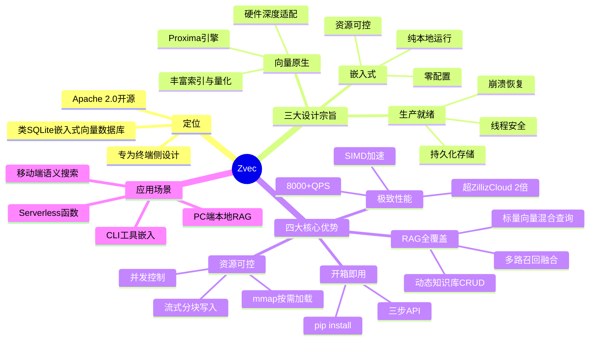

---
tags:
  - tech-article
  - AI
  - Vector-Database
  - RAG
  - Edge-Computing
  - Zvec
created: 2026-01-26
category: 技术文章/AI
aliases:
  - Zvec向量数据库
  - 嵌入式向量检索
---

# Zvec: 开箱即用、高性能的嵌入式向量数据库

> **原文链接**: https://mp.weixin.qq.com/s/4t5QTUghdqVU-aTYbj0X-w

> **一句话总结**: Zvec 是阿里开源的类 SQLite 嵌入式向量数据库，专为终端侧 RAG 设计，开箱即用、资源可控、性能超越 ZillizCloud 2 倍，从原型到生产一站到位。

> **前置知识检查**: 
> - [ ] 向量检索与 ANN（近似最近邻）算法（如 HNSW）
> - [ ] 嵌入式数据库概念（类比 SQLite）
> - [ ] RAG（检索增强生成）架构
> - [ ] 端侧 AI / 边缘计算基础

## 原文

### 1. 背景

向量检索已从搜索推荐系统的后台组件，演变为智能应用的通用数据基础设施。RAG 兴起后，开发者为任意知识问答、语义理解或智能助手嵌入"语义记忆"。同时，向量检索从云端下沉至终端设备，驱动因素：

- **开发者门槛降低**：LangChain 等框架降低向量检索使用门槛
- **终端设备算力提升**：边缘 AI 趋势下，端侧算力持续提升
- **数据隐私与低延迟刚需**：医疗/金融要求数据本地处理，AR/自动驾驶需低延迟

以 **PC/手机端本地 RAG 助手** 为例，需求包括：
- 向量与标量混合存储与查询
- 完整 CRUD 能力（知识库动态增删改）
- 内存与资源占用严格受限
- 崩溃恢复能力
- 低延迟响应

然而现有技术方案存在适配缺口：
- **纯索引库（Faiss）**：缺乏标量存储、混合查询、CRUD、崩溃恢复，需大量外围工程
- **嵌入式方案（DuckDB-VSS）**：向量功能受限，索引类型单一，不支持量化压缩，内存不可控
- **服务化方案（Milvus）**：依赖独立进程与网络，架构复杂，无法嵌入终端应用

### 2. What is Zvec?

Zvec = 类 SQLite 的嵌入式向量数据库，核心设计目标：**让高质量向量能力触手可及**

设计宗旨：
- **嵌入式**：纯本地运行，零配置，资源可控，易于集成
- **向量原生**：全栈面向向量工作负载，丰富索引与量化能力，深度适配硬件
- **生产就绪**：持久化存储、线程安全、崩溃自动恢复

### 3. Why Zvec?

#### 3.1 开箱即用
- `pip install zvec` 一键安装
- 三步 API：`create_and_open → insert → query`
- 从安装到运行不超过一分钟

#### 3.2 极致性能
- 基于阿里通义实验室自研 **Proxima** 引擎
- 多线程并发、内存布局优化、SIMD 加速、CPU 预取
- VectorDBBench Cohere 10M 场景：**检索吞吐超 8000 QPS，是 ZillizCloud 的 2 倍以上**

#### 3.3 资源可控
- **内存控制**：流式分块写入（64MB）、mmap 按需加载、强内存管控（`memory_limit_mb`）
- **并发控制**：索引构建 `concurrency` 参数、全局 `optimize_threads`、查询 `query_threads`

#### 3.4 应用就绪（RAG 全覆盖）
- **动态知识库管理**：完整 CRUD、Schema 变更
- **多路召回与融合**：多向量联合查询、内置重排序器（加权融合/RRF）
- **标量-向量混合查询**：过滤条件下推、倒排索引加速

### 4. 后续规划
- 开发体验优化：CLI 工具、多语言 SDK、LangChain/LlamaIndex 集成
- 能力纵向扩展：分组查询等向量特色能力
- 生态协同共建：DuckDB/PostgreSQL 向量扩展、外表（Parquet/CSV）支持
- 场景闭环验证：iOS/Android/Nvidia Jetson 端侧交付案例

### 5. 开源信息
- 协议：Apache 2.0
- 支持语言：C++/Python/Rust
- 当前版本：Python SDK v0.1.0

---

## 核心概念脑图



## 与你已有知识的关联

**《[[技术文章-DailyTech/深度解析LLM Wiki - Obsidian-Wiki - GBrain：Agent时代知识的自组织与自进化|Agent知识系统]]》**：Zvec 可作为 Agent 本地语义记忆底层，替代云端向量库，实现完全离线的知识检索与管理。

**《[[技术文章-DailyTech/ContextBucket Agent 的无限记忆与工作区底座|ContextBucket记忆]]》**：ContextBucket 的无限记忆机制可搭配 Zvec 做向量索引层，实现低成本的语义召回 + 精确检索混合方案。

**《[[技术文章-DailyTech/一篇搞懂 AI Coding Agent 的 Token 成本控制|Token成本控制]]》**：Zvec 端侧部署意味着无需通过 API 调用云端向量服务，减少网络开销和 API 调用成本，从架构层面降低 Token 消耗。

**《[[技术文章-DailyTech/横向拆解Claude Code、Codex等六大Agent上下文压缩策略后，我们做了第7个|上下文压缩策略]]》**：向量检索是上下文压缩后检索恢复的关键环节，Zvec 的嵌入式特性让压缩-检索链路可以完全在本地完成。

**《[[技术文章-DailyTech/如何搭建一个端到端业务需求专家 Agent|端到端Agent]]》**：端到端 Agent 需要本地知识库支撑，Zvec 提供了轻量级的本地向量存储方案，无需额外运维。

## 重难点理解

- **重点1**: HNSW 图索引的内存爆炸问题 — HNSW 在构建/查询阶段可能瞬时占用数倍于原始数据的内存。Zvec 通过流式分块写入（64MB 块）+ mmap 按需加载 + 强内存池（`memory_limit_mb`）三层机制解决 — 这是端侧部署最大的工程挑战

- **重点2**: 嵌入式 vs 服务化 — 嵌入式数据库（如 SQLite）直接嵌入应用进程，零网络开销、零运维；服务化（如 Milvus）需要独立进程和网络通信。Zvec 选择嵌入式路线，牺牲了分布式扩展能力，换取终端场景的极简部署

- **重点3**: 标量-向量混合查询 — 纯向量检索不够用，实际 RAG 场景需要"向量相似度 + 时间范围 + 文件类型"等多维过滤。Zvec 支持标量过滤条件下推到向量索引执行层，避免全量扫描 — 这是 Faiss 等纯索引库做不到的

- **难点4**: mmap 的取舍 — mmap 让数据由 OS 按需换入，数据量超过 RAM 也不会 OOM，但性能受磁盘 IO 影响。Zvec 默认关闭 mmap，只在资源极度受限时建议开启

## 原文内容流程图

```mermaid
flowchart TD
    A[向量检索下沉到终端] --> B{现有方案痛点}
    B -->|Faiss| C[缺数据库能力<br/>无CRUD/崩溃恢复]
    B -->|DuckDB-VSS| D[向量功能受限<br/>内存不可控]
    B -->|Milvus| E[架构重<br/>无法嵌入终端]
    
    C --> F[Zvec: 嵌入式向量DB]
    D --> F
    E --> F
    
    F --> G[开箱即用<br/>pip install + 三步API]
    F --> H[极致性能<br/>Proxima引擎 8000+QPS]
    F --> I[资源可控<br/>内存/并发精细管控]
    F --> J[RAG全覆盖<br/>CRUD/多路召回/混合查询]
    
    G --> K[终端侧RAG生产就绪]
    H --> K
    I --> K
    J --> K
```

## 经验

1. **嵌入式向量库选型优先级**: 终端场景优先选嵌入式方案（Zvec/SQLite-VSS）而非服务化方案（Milvus），避免运维负担和资源浪费 — **应用场景**: 桌面应用、CLI 工具、移动端 App

2. **内存管控三层防御**: 流式写入（避免全量驻留）→ mmap（按需加载）→ 强内存池（硬上限），三层递进确保不 OOM — **应用场景**: 任何需要在有限内存下处理大规模数据的系统

3. **性能对标要看 Recall 对齐**: 对比向量数据库性能时，必须在相同 Recall 水平下对比 QPS，否则没有意义 — **应用场景**: 技术选型、性能评测报告

## 知识

| 知识点 | 定义 | 关键要素 | 关联概念 |
|-------|------|---------|---------|
| 嵌入式向量数据库 | 直接嵌入应用进程的向量存储引擎，无需独立服务 | 零配置、零网络、资源可控 | SQLite、DuckDB |
| Proxima | 阿里通义实验室自研的高性能向量检索引擎 | SIMD加速、多线程、内存布局优化 | Zvec底层引擎 |
| HNSW | 分层可导航小世界图，主流 ANN 索引算法 | 图结构、多层索引、高召回率 | 内存爆炸问题 |
| mmap | 内存映射文件，OS 按需加载数据页到物理内存 | 按需换入、避免OOM、磁盘IO开销 | Zvec内存管控机制 |
| RRF | 倒数排名融合，多路召回结果融合策略 | 排名倒数加权、无需权重调参 | 多路召回排序 |
| 标量过滤下推 | 将标量过滤条件推入向量索引执行层 | 避免全量扫描、提升混合查询效率 | Faiss缺失能力 |

## 可复用建议

1. **端侧 RAG 用嵌入式向量库**: 选 Zvec 或 DuckDB-VSS 而非 Milvus — **适用场景**: 桌面应用、CLI 工具、移动端 — **预期效果**: 零运维、低延迟、资源可控

2. **用 `memory_limit_mb` 防止 OOM**: 在资源受限环境显式设置内存上限 — **适用场景**: Serverless 函数、移动端、容器环境 — **预期效果**: 避免因内存超限被系统 Kill

3. **多路召回用 Zvec 原生融合**: 多向量字段 + 内置 RRF/加权融合，无需应用层手动合并 — **适用场景**: 多模态搜索、语义+关键词混合检索 — **预期效果**: 代码简洁、排序准确

## 实施办法

1. **第1步**: 安装 Zvec Python SDK — `pip install zvec`
2. **第2步**: 用 One-Minute Example 验证基本功能（create → insert → query）
3. **第3步**: 根据场景选择内存策略 — 数据量小用默认、大数据用 mmap、极端受限用 `memory_limit_mb`
4. **第4步**: 设计 Schema — 向量字段 + 标量字段（时间、类型、标签），为高频过滤字段建倒排索引
5. **第5步**: 集成到 RAG Pipeline — 替换云端向量库，用 Zvec 做本地语义检索
6. **第6步**: 性能调优 — 设置 `concurrency`、`query_threads` 控制并发，用 `optimize_threads` 限制最大线程数
