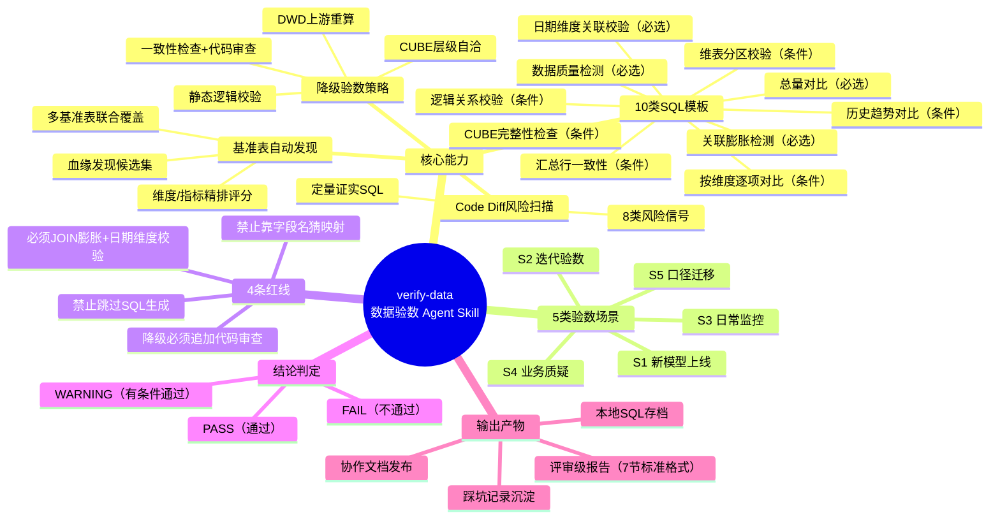
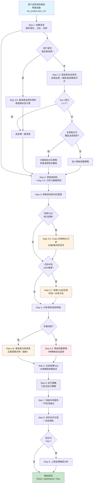

# verify-data：一个端到端的数据验数 Agent Skill

> **原文链接**: https://mp.weixin.qq.com/s/CX7H8LUm9PokC19NDDd_WQ
> **一句话总结**: verify-data 是一个端到端的数据验数 Agent Skill，通过自然语言触发，自动完成从表结构获取、基准表发现、代码逻辑分析、验数 SQL 生成、执行到评审级报告发布的全流程，将传统手工验数从 2-4 小时压缩到 30 分钟以内，并提供 PASS/WARNING/FAIL 三档结构化结论。

> **前置知识检查**:
> - [ ] 了解数据仓库分层概念（ADS/DWS/DWD/DIM）
> - [ ] 了解 Agent Skill 的基本概念（Skill = Agent 的 SOP）
> - [ ] 了解 SQL 基本语法和 JOIN 操作
> - [ ] 了解数据血缘（Data Lineage）的基本概念
> - [ ] 了解 GROUPING SETS / CUBE 聚合语法

## 原文

在业务数据团队中，每张数据表上线前或迭代后，都需要回答"数据到底准不准"这个核心问题。传统手工验数存在覆盖度不够、基准表选错、代码理解偏差、结论无依据、沉淀成本高等痛点。verify-data 将数据验数的全部流程——从信息收集、SQL 生成、执行到报告产出——编码成一套可复用、可迭代的 Agent 能力。核心包括：两阶段基准表自动发现（血缘 + 维度/指标精排）、10 类标准化验数 SQL 模板、Code Diff 驱动的风险扫描、4 种降级验数策略、4 条不可逾越的红线、三档结论判定体系（PASS/WARNING/FAIL）。经过多轮迭代，覆盖 S1 新模型上线、S2 迭代验数、S3 日常监控、S4 业务质疑、S5 口径迁移五类场景，已在生产环境中验证了从 2-4 小时到 30 分钟的效率提升。

## 核心概念脑图

## 与你已有知识的关联

- **《[[AI Agent系列｜深入解析Function Calling、MCP和Skills的本质差异与最佳实践|AI Agent系列｜深入解析Function Calling、MCP和Skills的本质差异与最佳实践]]》**：verify-data 是 Agent Skill 理念在数据质量领域的具体落地案例，展示了如何将"Agent 的 SOP"编码为可复用的能力包，与此文对 Skill 的定义完全吻合——Skill 定义了 Agent 在特定场景下应该做什么、怎么做、有哪些约束和红线。

- **《[[Skills：从编程工具的配角到Agent研发的核心|Skills：从编程工具的配角到Agent研发的核心]]》**：verify-data 的 14 个 References 文档设计体现了 Skill 的模块化架构思想——主文件是流程路由骨架，每步执行细节在 references 目录中按需加载，保持主流程清晰的同时不丢失边缘场景的处理能力。

- **《[[AgentSkillsTeams 架构演进过程及技术选型之道|AgentSkillsTeams 架构演进过程及技术选型之道]]》**：verify-data 的模块化依赖设计（表结构与元数据服务、文档协作服务、计算引擎执行能力）与此文讨论的 Agent 架构演进思路一致——核心逻辑与具体平台实现解耦，通过替换能力模块适配不同技术栈。

- **《[[如何构建和调优高可用性的Agent？浅谈阿里云服务领域Agent构建的方法论|如何构建和调优高可用性的Agent？浅谈阿里云服务领域Agent构建的方法论]]》**：verify-data 的 4 条红线设计、结论判定体系、分区预检机制，都是 Agent 高可用性方法论在数据验证场景的具体实践——红线要硬、结论要结构化、前置检查要完备。

- **《[[企业级 Agent 多智能体架构与选型指南|企业级 Agent 多智能体架构与选型指南]]》**：verify-data 的架构展示了单一 Agent Skill 如何通过模块化设计支撑企业级数据质量场景，其"7-9 步主流程 + 条件触发子步骤"的设计模式可推广到其他企业级 Agent 场景。

## 重难点理解

### 1. 基准表自动发现的两阶段策略为何是核心难点

基准表选择是验数成败的关键——选错基准表，后续所有比对都无效。verify-data 的两阶段策略解决了这个痛点：第一阶段通过血缘 API 追溯研发表的上游依赖，构建候选集；第二阶段通过加权评分公式 `score = 血缘亲和度 × 0.5 + 维度重合度 × 0.3 + 指标重合度 × 0.2` 进行精排。重点在于当 Top-1 得分 < 0.7 但多张表联合可覆盖全部指标时，触发"分路指标对比策略"（多基准表联合覆盖），这解决了 CUBE 表依赖多张上游 DWD 表的典型场景。

**解释**：一张新的 CUBE 表可能同时依赖用户行为表、转化事件表、交易明细表三张 DWD 表，没有任何一张单独的基准表能覆盖所有指标，但三张表联合就能完整验证。这个设计避免了"找不到完美基准表就放弃验证"的困境。

### 2. 降级策略中 DWD 重算"只能自证执行一致"的陷阱

这是全文最深刻的洞察之一。当使用降级策略 [1] 时，如果 DWD 重算 SQL 直接复制了 ADS 代码的 JOIN 和聚合逻辑，即使结果 100% 一致，也只能证明"我写的 SQL 和我写的 ADS 代码执行结果一致"，无法证明"ADS 代码本身是对的"。

**解释**：典型案例中，DWD 重算与 ADS 汇总行四个指标完全一致（差异 < 1e-11），但审代码后发现两个真 bug——`refund_stage > '1'` 在当前分区命中 0 条（退款路径事实失效），以及 `trade_id IS NOT NULL` 判据存在隐患。因为 DWD 重算同样跳过了这些行，两侧照样"一致"。这就是为什么降级策略 [1] 强制要求代码审查 + 独立构造 V 类证实 SQL。

### 3. 4 条红线为何是"强制"而非"建议"

4 条红线不是贴在文档里的口号，而是在流程层面做了硬约束：

- **禁止跳过 SQL 生成直接手写跑数**：确保覆盖度和可追溯性，防止 Agent 走捷径
- **禁止靠字段名猜映射**：必须读运行态代码 + 查 schema，这是最常见的验数错误来源
- **降级策略 [1] 仅跑 D 类 SQL 就出报告**：必须追加代码审查和 V 类定量证实
- **必须对所有 JOIN 做膨胀率验证、对所有日期维度做日期关联校验**：评审最高频退回原因

**解释**：没有红线的 Agent 工具很容易在边缘场景翻车——尤其是在降级场景和 Code Diff 场景，没有强制约束的 Agent 会倾向于走捷径。这些红线是从多次生产事故中总结出来的"血泪教训"。

### 4. 关联膨胀检测（SQL 9）和日期维度关联校验（SQL 10）为何是最高频退回原因

很多表总量对比没问题，但 JOIN 膨胀导致某些维度组合行数翻倍，或者日期维度关联时区错位，这些问题只有专项检测才能发现。

**解释**：关联膨胀检测在 JOIN 操作后检查行数膨胀率，目标值 = 1.00，超过 1.01 即判定 FAIL。日期维度关联校验检查格式/时区对齐和 T-1 分区是否存在。这两个检测项是数据评审退回的最主要原因，手工验数时极易忽略。

### 5. CUBE 汇总行 NULL 不是 Bug —— 浮点精度不要较真

GROUPING SETS 生成的汇总行中，某些维度的值为 NULL 或 'all'，某些指标为 NULL 是正常行为。浮点类型金额字段在多次累加后会产生 `~10^-10` 级的精度差异。

**解释**：verify-data 在报告生成时会专门标注汇总行 NULL 是正常行为，避免误判。同时内置了浮点精度容忍度判定（差异 < 1e-6 视为实质为 0），避免在无关紧要的精度上浪费时间。这些经验来自真实踩坑记录，在 `lessons-learned.md` 中沉淀。

## 原文内容流程图

## 经验

**1. 从最高频场景开始，不要试图一开始就覆盖所有场景。** 先做 S1 新表上线和 S2 迭代对比，这两个场景占了 80% 的验数需求。先让 80% 的需求跑通，再逐步补齐长尾场景。

**2. 标准化比智能化更重要。** 验数最关键的是覆盖度和可重复性，10 类标准化模板比"让 AI 自由发挥"可靠得多。AI 的能力放在理解代码逻辑、选择模板组合和解读结果上，而不是临时发挥写 SQL。

**3. 踩坑记录是核心资产。** `lessons-learned.md` 里记录的 19 条实战经验，每一条都是真实踩过的坑。没有这些，Agent 就会重复犯同样的错误。每次生产事故都是一次 Skill 升级的契机。

**4. 红线要硬，不能只是"建议"。** 关键红线在流程层面做了硬约束——到了关键节点如果不满足条件就不会继续。没有红线的 Agent 工具很容易在边缘场景翻车。

**5. DWD 重算同构只能自证执行一致，不能证明逻辑正确。** 降级策略中，如果 DWD 重算 SQL 直接复制了 ADS 代码的 JOIN 和聚合逻辑，即使结果 100% 一致，也无法证明 ADS 代码本身是对的。必须追加代码审查和独立构造 V 类证实 SQL。

## 知识

**1. Agent Skill 的定义**：Agent Skill 是一种给 AI Agent 定义的可复用能力包，可以理解为"Agent 的 SOP"。一个 Skill 定义了 Agent 在特定场景下应该做什么、怎么做、有哪些约束和红线。当用户用自然语言触发后，Agent 会按照 Skill 定义的流程自动执行，而不是靠模型临时发挥。

**2. 基准表自动发现评分公式**：`score = 血缘亲和度 × 0.5 + 维度重合度 × 0.3 + 指标重合度 × 0.2`。Top-1 得分 ≥ 0.7 时直接选为基准表；Top-1 < 0.7 但多张表联合可覆盖全部指标时触发分路指标对比策略；Top-5 最高得分 < 0.3 时进入降级验数策略。

**3. 10 类验数 SQL 模板**：必选模板包括 SQL 1（总量对比）、SQL 2（数据质量检测）、SQL 9（关联膨胀检测）、SQL 10（日期维度关联校验）。条件模板包括 SQL 3（按维度逐项对比）、SQL 4（维表分区校验）、SQL 5（CUBE 完整性检查）、SQL 6（汇总行一致性）、SQL 7（逻辑关系校验）、SQL 8（历史趋势对比）。

**4. 三档结论判定体系**：PASS（所有 SQL 通过，无风险，可以上线）；WARNING（主要项通过，但有外部阻塞或非关键差异，消除条件后上线）；FAIL（关键 SQL 失败或差异无法解释，必须修复）。

**5. 8 类风险信号**（Code Diff 扫描）：数据源变更、JOIN 关系变更、聚合方式变更、过滤条件变更、字符串比较陷阱、NULL/默认值假设、日期窗口定义、UNION ALL 各路命中量。

**6. 降级策略的 D+V 耦合判定**：D 类（数据一致性）全部 PASS 且 V 类（逻辑合理性）全部 PASS 或仅口径建议 → PASS；D 类全部 PASS 但 V 类发现真 bug 且当前分区无损 → WARNING（附修复建议）；D 类全部 PASS 但 V 类发现真 bug 且已实际影响数据 → WARNING 或 FAIL；D 类任一 FAIL → FAIL。

**7. 高频退回判定速查**：关联膨胀率 = 1.00 → PASS，1.00~1.01 → WARNING，> 1.01 → FAIL；日期关联格式/时区对齐 + T-1 存在 → PASS，格式可转换 → WARNING，格式不一致/T-1 缺失 → FAIL。

## 可复用建议

**1. 构建领域 Agent Skill 时，优先设计标准化模板而非依赖 AI 自由发挥。** 验数场景的 10 类 SQL 模板证明了标准化比智能化更重要——AI 的能力应该放在理解上下文、选择模板组合和解读结果上，而不是临时生成核心逻辑。

**2. 为 Agent Skill 设计明确的降级策略。** 不是所有场景都有完美条件，没有基准表时 agent 不能放弃验证，而应该自动选择降级策略（CUBE 层级自洽、DWD 上游重算、静态逻辑校验等），并强制追加代码审查作为兜底。

**3. 在 Agent 流程中嵌入"红线"机制。** 关键约束必须是硬性的——在流程层面做检查，不满足条件时阻止继续执行。这些红线应从真实生产事故中总结，而非凭空设计。常见的红线包括：禁止跳过关键步骤、禁止靠命名猜测、强制对高风险项做专项检测。

**4. 建立踩坑记录机制（lessons-learned）。** 每次 Agent 在真实场景中出错或做出次优决策，都应该沉淀为一条 lessons-learned，让 Agent 在后续执行中不会重复犯同样的错误。这是 Agent 持续进化的核心资产。

**5. 分区预检可以避免大量无效等待。** 在数据计算场景中，跑 SQL 之前通过元数据 API（秒级完成）确认目标分区是否存在、实例状态是否成功，可以避免白跑几十分钟 SQL 后发现分区还没产出的问题。这个设计思路适用于所有涉及大数据计算的 Agent 场景。

## 实施办法

**第一步：梳理验数场景清单。** 列出团队最高频的验数场景（通常 S1 新表上线和 S2 迭代对比占 80%），明确每种场景的输入、输出和验收标准。为每种场景定义触发关键词和场景识别规则。

**第二步：设计标准化验证模板。** 参考 verify-data 的 10 类 SQL 模板，根据团队实际业务定义必选模板和条件模板。必选模板确保基础覆盖度（总量对比、质量检测、关联膨胀检测、日期维度校验），条件模板按需触发。

**第三步：实现基准表自动发现逻辑。** 如果数据平台支持血缘 API，设计两阶段策略（血缘追溯 + 维度/指标精排评分）。如果不支持，至少实现基于命名规范和字段匹配的基准表候选集构建。

**第四步：定义红线与降级策略。** 从历史验数事故中总结 3-5 条不可逾越的红线，在 Agent 流程中做硬约束。同时设计 2-3 种降级策略，确保任何表都能给出有意义的结论。

**第五步：建立踩坑记录和报告模板。** 创建 `lessons-learned.md` 文件，每次验数后发现的问题都沉淀进去。设计结构化报告模板（7 节标准格式），包含结论判定、差异明细、SQL 附录，确保输出是评审级证据链。

**第六步：渐进式推广。** 先在 S1 和 S2 场景跑通，积累 20+ 条踩坑记录后再逐步覆盖 S3-S5。每次生产事故都是一次 Skill 升级的契机，不要试图一开始就完美。