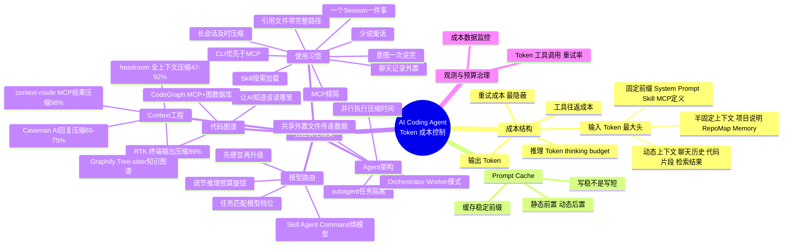
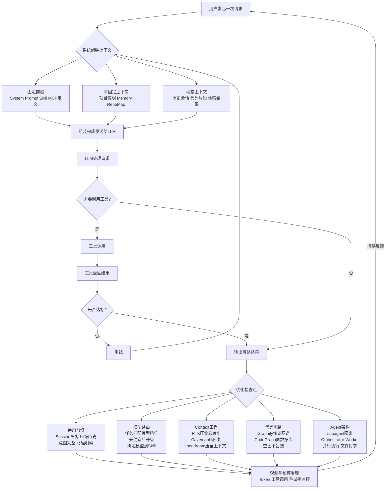

---
tags:
  - tech-article
  - AI
  - Agent
  - Token
  - 成本优化
  - Prompt-Cache
  - Coding-Agent
created: 2026-06-15
category: 技术文章/AI
aliases:
  - Token成本控制
  - AI Coding Agent 成本
---

# 一篇搞懂 AI Coding Agent 的 Token 成本控制

> **一句话总结**: AI Coding Agent 的成本本质上不是"你问了什么"，而是"系统为了回答你，重复搬运了多少上下文"——优化核心在于减少重复上下文、合理模型路由、精准代码检索和清晰 Agent 分工，而非简单地缩短提问。

> **前置知识检查**:
> - [ ] 了解 LLM 的 Token 基本概念（输入 Token / 输出 Token）
> - [ ] 使用过至少一款 AI Coding Agent（如 CodeBuddy、Cursor、Codex、Gemini CLI）
> - [ ] 了解 System Prompt、Tool Calling、MCP 的基本作用
> - [ ] 有基本的命令行操作经验
> - [ ] 了解 Agent 的多轮对话机制（上下文窗口、历史消息管理）

---

## 原文

### 第一章 账单都花在哪了

#### 1.1 你问的那句话，其实最便宜

一个典型的 AI Coding Agent 请求结构如下：

| 组成部分 | 典型大小 |
|---------|---------|
| System Prompt | 5K |
| 项目说明文档 | 10K |
| Skill 定义 | 20K |
| Tool / MCP 定义 | 30K |
| 历史会话 | 100K |
| 代码文件 | 50K |
| 用户问题 | 0.1K |

**贵的是系统塞进去的东西，不是你写的那句话。**

总成本近似公式：

```
总成本 ≈ 固定前缀 + 会话历史 + 运行时检索 + 工具往返 + 模型输出
```

三层上下文结构：
- **固定前缀**：System Prompt、Skill 定义、Tool / MCP 定义、稳定背景文档
- **半固定上下文**：项目说明、Repo Map、Memory、长期约束
- **动态上下文**：聊天历史、代码片段、检索结果、工具返回、你这轮新问题

用户提问往往只是最后一撮"点火器"，负责触发任务，但通常不是成本主体。

#### 1.2 "它明明记得"只是一种幻觉

大模型本身通常是无状态的。真正"记得"的，不是模型，而是包在模型外面的 Agent / CLI / 平台层。它在每一轮请求前，把历史、规则、工具、代码、文档重新拼起来，再发给模型。所谓"记忆"，很多时候只是"再次传入"。

三个关键结论：
1. **会话越长，后续每一轮越贵**——历史不是"存在那里等模型自己想起来"，而是每轮都要重新带过去
2. **工具越多，常驻定义越重**——一个 Tool / MCP 不只是"多一个按钮"，而是多一段要让模型理解的说明、参数模式和调用约束
3. **工具调用会形成回路**——模型先读一大包上下文，再调用工具；工具返回一段结果；结果又被塞回上下文，再进入下一轮

AI Agent 最怕的不是问题复杂，而是：会话越滚越长、工具越堆越多、背景越塞越满、每次都从零找信息、输出不合格反复重试。

#### 1.3 五种成本，不止是"输入字数"

| 成本类型 | 它是什么 | 为什么会放大 |
|---------|---------|------------|
| 输入 Token | 系统提示词、历史消息、代码片段、检索结果、工具定义 | 每轮都可能重复携带，是最大头 |
| 输出 Token | 模型最终回答的文字 | 回答越长、越啰嗦、越容易失控 |
| 推理 Token / thinking budget | 模型内部用于思考和规划的预算 | 简单任务如果走高推理档位，会明显溢价 |
| 工具往返成本 | 工具描述、调用参数、返回结果进入上下文 | 一次工具调用，常常比原问题还长 |
| 重试成本 | 第一次做错后重新来一轮 | 每修一次，都可能把整包上下文再付一遍 |

最容易被低估的是后两项。**工具往返成本**：你以为只是"让它查个文件"，模型实际经历的是理解工具定义 -> 生成参数 -> 接收返回值 -> 再结合返回值继续思考。**重试成本**更隐蔽：第一次不合格 -> 重新描述问题 -> 重新附带历史 -> 重新拉代码或工具结果 -> 再跑一轮模型。"减少重试"本身就是一种非常硬的成本优化手段。

#### 1.4 Prompt Cache：为什么它是所有优化的基础

Prompt Cache 缓存的是**稳定前缀的处理结果**。如果两次请求前半段几乎一样，服务端就不必每次都从头处理那一大段相同内容。

原理：
```
固定前缀 → 缓存命中 → 不用每次都从头处理
```

最容易被缓存的内容：System Prompt、Tool / MCP 定义、Skill 定义、长文档背景、稳定的 few-shot 前缀。

三个关键推论：
1. **Prompt Cache 省的不是首次成本，而是重复成本**——第一次正常付费，价值在后续复用中体现
2. **缓存不是"写短"，而是"写稳"**——天天改系统提示词，缓存理论上存在，实践中很难命中
3. **缓存优化和上下文治理是一回事**——减少前缀抖动、稳定内容前置、变化内容后置，本质都在提升"可复用比例"

**Token 优化重点，不是把提示词写短，而是把前缀写稳。**

#### 1.5 一张全图：五层模型

文章核心优化框架分五层（从便宜到贵、从易到难）：

1. **使用习惯**——解决"无意义的历史和废 Token"
2. **模型路由**——解决"贵模型干便宜活"
3. **Context 工程**——解决"同样前缀重复发送"
4. **代码图谱**——解决"每次都从零找代码"
5. **Agent 架构**——解决"所有任务都塞给同一个大上下文"

总目标：让模型少看无关内容、让便宜模型多干标准活、让贵模型只做高价值推理。

---

### 第二章 使用习惯：最便宜也是最被低估的优化

#### 2.1 一个 Session，一件事

Session 越长 → 继承的历史越多 → 每一轮越贵。**一个 Session 只服务一个目标**：修 Bug 开一个，做重构开一个，写文章开一个，查线上问题开一个。Topic 切分就是最便宜的 Context 管理。

#### 2.2 长会话不压缩，就是负债

模型不需要完整试错过程。它需要的是：现在要干什么、做完了什么、哪条路不通、卡在哪了、下一步怎么做。`/compact` 把完整历史压成可继续工作的状态。对话记录不是资产，未压缩的长对话是负债。

#### 2.3 聊天记录不是数据库

真正该长期保留的信息，外置出去：项目文档、Summary 文件、Memory 文件、Repo Map / Knowledge Graph、任务清单。让会话只承载"当前工作状态"，而不是全部项目历史。

#### 2.4 少说废话，也是省 Token

编码场景最浪费的回答不是"错"，是"废"：先复述一遍问题，再讲一段众所周知的背景，然后一堆礼貌性铺垫，最后才给结论。如果你只需要 diff、步骤、结论、表格、JSON——直接要求它这么给。这类约束同时省输出 Token 和减少重试。

```
直接给结论，不要复述问题，必要时再展开
```

#### 2.5 Skill ≠ 免费能力

每个 Skill 都带着 Description、Instructions、Examples、触发逻辑。这些信息如果常驻，就会进上下文。原则：**高频、稳定、通用的 Skill 常驻；低频、长说明、低复用的按需触发。** 常驻能力要尽量少而精。

#### 2.6 MCP 越多，不一定越强

每多一个 MCP，就多一份 Tool Definition、多一层选择成本。问题不只是"文档长"：选择空间变大 → 决策变慢、错误调用概率变高、每轮携带定义更重。工具治理和依赖治理一样：关键不是能不能装，是有没有必要常驻。

#### 2.7 CLI 优先于 MCP

```
能 CLI 解决 → 尽量 CLI
能脚本解决 → 尽量脚本
最后才考虑 MCP
```

已有成熟命令链路时，不要为了看起来高级而过度工具化。MCP 的价值在：跨系统编排、结构化返回、权限统一收敛、内部业务能力包装。

推荐工具：
- **tapd-ai-cli**：腾讯 TAPD 的 AI Agent 专用 CLI，支持需求、缺陷、任务的查询和更新
- **gongfeng-cli**：腾讯工蜂代码托管的 AI Agent 专用 CLI，Token 消耗显著低于同等 MCP 方案

#### 2.8 引用文件时带完整路径

| 方式 | 链路 |
|-----|------|
| 只写文件名 | 搜索 → 可能多次确认 → 读取 |
| 完整路径 + `@` | 直接读取 |

一个 `@路径` 节省的，是一整条搜索链路。

#### 2.9 把意图一次说完，别聊天式拆碎

每一轮来回都在消耗 Token。四轮对话的成本，往往是一次完整表达的好几倍。

```
看 @src/order/service.go 的 CreateOrder 函数，
找出潜在的 bug，修复，并为修复后的函数写单测。
```

越具体、越完整的指令，浪费的轮次越少。

---

### 第三章 模型路由：别让贵模型干便宜活

#### 3.1 匹配优先，不是便宜优先

- 复杂任务 → 强模型
- 简单任务 → 便宜模型
- 重复任务 → 稳定模型

#### 3.2 任务-模型匹配表

| 任务 | 推荐模型档位 | 理由 |
|-----|------------|------|
| 写 UT | 便宜模型 | 模式稳定、模板化 |
| 写 commit | 便宜模型 | 输出短、风险低 |
| Code Review | 中高档模型 | 需要语义理解 |
| 架构设计 | 强模型 | 长链路推理 |
| 复杂 Bug 分析 | 强模型 | 多步假设和验证 |
| 批量分类/摘要 | 低价或 Batch | 规模大、成本敏感 |

#### 3.3 先过便宜模型，再升级

```
便宜模型先跑 → 判断复杂度 → 需要才升级
```

级联工作流既省钱，又让贵模型花在刀刃上。

#### 3.4 不只换模型，也要调预算旋钮

可调节参数：`reasoning effort`、`thinking budget`、`verbosity`、`max output tokens`。

不是所有任务都要深度思考，也不是所有任务都要长答案。让一个模型用高推理档位做分类、摘要、提交说明，本质上是在拿推土机扫地。

#### 3.5 Skill / Agent / Command 都应该绑定模型

以 CodeBuddy 为例，SKILL.md 文件头部声明模型和上下文策略：

```yaml
---
context: fork
model: deepseek-v4-pro
---
```

Agent 绑定模型示例：
- Planner → 中高档
- Coder → 中档 / 便宜
- Reviewer → 强

这类设计一旦固化，成本治理就从"靠人记得切"变成"系统默认更省"。

---

### 第四章 上下文压缩：先把高频上下文压下来

#### 4.1 RTK：终端输出才是真正的 Token 大杀手

**实测：30 分钟开发会话对比**（中等规模 TypeScript/Rust 项目）：

| 场景 | Token 消耗 |
|-----|-----------|
| 不用 RTK | ~118,000 |
| 用 RTK | ~23,900 |
| 节省 | **80%** |

按命令类别的典型压缩率：

| 命令类别 | 原始 | RTK 后 | 节省 |
|---------|------|--------|------|
| cargo test / npm test | 25,000 | 2,500 | -90% |
| pytest | 8,000 | 800 | -90% |
| vitest run | 102,199 字符 | 377 字符 | -99.6% |
| ls / tree | 2,000 | 400 | -80% |
| grep / rg | 16,000 | 3,200 | -80% |
| git status | 3,000 | 600 | -80% |
| git diff | 10,000 | 2,500 | -75% |
| cat / read | 40,000 | 12,000 | -70% |

四层过滤策略：智能过滤、分组聚合、智能截断、去重合并。

安装：
```bash
# macOS
brew install rtk
# Linux / WSL
curl -fsSL https://raw.githubusercontent.com/rtk-ai/rtk/master/install.sh | sh

# 全局启用 CodeBuddy
rtk init -g --agent codebuddy
```

#### 4.2 Caveman：压缩输出端的废话

RTK 压缩命令输出（输入 Token），Caveman 压缩 AI 回复（输出 Token），两者可叠加。

| 任务类型 | 正常输出 | Caveman | 节省 |
|---------|---------|---------|------|
| 解释 React bug | 118 tokens | 15 tokens | 87% |
| 配置 PostgreSQL | 234 tokens | 38 tokens | 84% |
| Docker 多阶段构建 | 104 tokens | 29 tokens | 72% |
| Code Review PR | 67 tokens | 39 tokens | 41% |
| **平均** | - | - | **65-75%** |

四种模式：`/caveman lite`（保留冠词）、`/caveman` full（删冠词，碎片句）、`/caveman ultra`（极度压缩，箭头因果链）、`/caveman wenyan`（文言文模式）。

#### 4.3 headroom：压"进上下文的所有内容"

RTK 压命令输出，Caveman 压 AI 回复，headroom 压所有读进上下文的内容——文件内容、工具调用返回值、会话历史。

核心机制：
- **代理层**：Agent 不直接连 LLM，先经过本地 headroom 代理
- **处理流水线**：CacheAligner 稳定前缀 + ContentRouter 判断内容类型 + 按类型分发压缩器
- **CCR 可逆压缩**：原始数据保留在本地，模型只收到压缩版，需要细节时通过 `headroom_retrieve` 按需取回

实测效果：

| 场景 | 压缩前 | 压缩后 | 节省 |
|-----|-------|--------|------|
| 代码搜索（100 条结果） | 17,765 | 1,408 | 92% |
| SRE 故障排查 | 65,694 | 5,118 | 92% |
| GitHub Issue 分类 | 54,174 | 14,761 | 73% |
| 代码库探索 | 78,502 | 41,254 | 47% |

安装：
```bash
pip install "headroom-ai[all]"
# 接入 CodeBuddy
headroom wrap codebuddy --memory --code-graph
```

#### 4.4 context-mode：工具输出不再撑爆上下文

解决 MCP 工具调用返回值太大的问题。四层能力：
1. **Sandbox 工具输出（98% 压缩）**：315 KB → 5.4 KB
2. **跨 compact 会话连续性**：用 SQLite + FTS5 全文索引按相关性取回
3. **用代码代替读文件**：`ctx_execute()` 工具让 AI 写脚本处理数据，而非读 50 个文件进上下文
4. **不干预输出格式**：只管数据往哪走，不管 AI 怎么回答

安装：
```bash
npm install -g context-mode
```

#### 四个压缩工具一览

| 工具 | 压缩什么 | 典型节省 | 装法 |
|-----|---------|---------|------|
| RTK | 终端命令输出 → 上下文 | 89% | `brew install rtk` + `rtk init -g` |
| Caveman | AI 回复输出 | 65-75% | `install.sh` |
| headroom | 所有进上下文的内容 | 47-92% | `pip install headroom-ai[all]` |
| context-mode | MCP 工具结果 + 会话连续性 | 98%（工具输出） | `npm install -g context-mode` |

最低成本起点：先装 RTK + Caveman，五分钟，立即见效。

---

### 第五章 代码图谱：让 AI 不再盲搜

#### 5.1 真正贵的是"找代码"，不是"读代码"

项目越大，AI 越容易陷入循环：grep 一圈找入口 → 读几个文件找关系 → 发现漏了一个 → 再 grep 一圈 → 反复几轮才定位到。这个过程消耗大量 Tool Call 和上下文。

代码图谱解决的是：**让 AI 在动手读文件之前，就知道该读哪里。**

#### 5.2 Graphify

核心机制：用 Tree-sitter 解析代码构建知识图谱，AI 查图而不是反复读文件。官方数据：**比直接读文件减少 71.5 倍 Token 消耗**。

安装：
```bash
uv tool install graphifyy
# 或
pipx install graphifyy

# 注册到 CodeBuddy
graphify install --platform codebuddy
```

执行 `/graphify` 后生成三份产物：交互式可视化 HTML、自然语言报告 MARKDOWN、AI 查询用的 JSON。

支持 30+ 种语言，多模态（SQL schema、Markdown、PDF、图片），git hook 增量更新。

#### 5.3 CodeGraph

基于 MCP Server + 持久化图数据库（Neo4j/KuzuDB）。在 7 个真实开源仓库上的 benchmark（Claude Opus 4.8，2026-06-02 验证）：

**平均数据**：16% 更低成本、47% 更少 Token、58% 更少 Tool Call、22% 更快。

安装：
```bash
npm i -g @colbymchenry/codegraph
cd your-project
codegraph init -i
```

核心工具：`codegraph_context`（找入口点）、`codegraph_trace`（追调用路径）、`codegraph_impact`（重构影响分析）。

**选型建议**：个人项目、快速上手 → Graphify（Skill 形态，零配置）；团队、大型仓库、需要持久化查询 → CodeGraph（MCP 服务器，功能更完整）。

---

### 第六章 多 Agent 协作：边界清晰时更省 Token

#### 6.1 单 Agent 为什么越用越贵

规划、写代码、跑测试、Code Review 全在一个会话 → 上下文越积越长 → 所有任务用同一个模型配置。**职责越混，上下文越胖，成本越高。**

#### 6.2 subagent：任务隔离的最低成本方式

每个 subagent 有独立的上下文边界——它只看到自己需要的内容，主 session 只看到结果。

```
主 session（规划 + 决策）
  ├── subagent A：影响分析（只看图谱，不读源码）
  ├── subagent B：写实现（只看相关文件）
  └── subagent C：跑测试 + 生成报告
```

subagent 可以单独绑定便宜模型。规划用强模型，执行用便宜模型。

#### 6.3 Orchestrator-Worker 模式

核心思路：
```
Orchestrator（协调器 Agent）
  ├── 负责规划、拆解、调度、汇总
  ├── 不亲自读大量文件，不亲自跑命令
  └── 只负责决策

Worker（子 Agent，按需派遣）
  ├── 每个 Worker 只做一件事
  ├── 只看自己需要的上下文
  └── 做完了把结果交回
```

成本对比（同样完成任务，每轮成本压缩 5-10 倍）：
- 单 Agent：215K tokens × N 轮
- Orchestrator + Worker：Orchestrator 轮次 10K + Worker A 14K + Worker B 10K

#### 6.4 上下文隔离之后，数据怎么流转

**通过共享外置文件，不通过会话历史。**

四个原则：
1. **输出格式要结构化**：用 JSON 而非自然语言传递 Agent 间数据
2. **用进度文件追踪状态**：`progress.json` 记录每个步骤的完成状态
3. **每个 Worker 的 context 包精心裁剪**：明确告诉 Worker"只读哪些东西"
4. **临时文件及时清理**：任务完成后归档或删除 `.agent/` 目录

#### 6.5 并行执行

| 并行 Worker 数 | 实际加速倍数 |
|---------------|------------|
| 2 个 | 1.5-1.8 倍 |
| 3 个 | 2.2-2.6 倍 |
| 4 个 | 2.8-3.4 倍 |

适合并行：不同模块的 Bug 修复、代码+测试+文档同时生成、多文件格式化/重构、影响分析+实现方案设计同时推进。

不适合并行：有顺序依赖的步骤、修改同一个文件的多个任务、依赖上一步输出的任务。

#### 6.6 完整的编排流程示例

场景：中型 Go 项目 API 层重构。单 Agent 总成本约 800K-1.2M tokens；Orchestrator-Worker 编排后总消耗约 100K-150K tokens（节省 70-85%）。

---

### 第七章 误区

- **误区一：上下文越多越好。** 噪音越多，模型越容易分神。
- **误区二：MCP 越多越强。** 选择空间越大、决策越慢、错误调用概率越高。
- **误区三：所有 Agent 都上最强模型。** 这叫放弃路由，不叫优化质量。
- **误区四：聊天记录当长期记忆。** 长会话方便，但不是记忆系统。
- **误区五：只看单价不看总成本。** 真正该看的是完成一次任务的总成本。
- **误区六：Prompt 越短越好。** 压缩要精准，不是一味缩短。

---

## 核心概念脑图



---

## 与你已有知识的关联
**《[[个人学习/LLM大模型类相关知识/AI Agent系列｜深入解析Function Calling、MCP和Skills的本质差异与最佳实践|AI Agent系列]]》**：AI Agent系列]] — MCP 成本、Skill 管理 — 本文 2.5、2.6 节深入讨论了 Skill 和 MCP 的常驻成本问题，是对那篇文章中 MCP/Skills 概念的**成本视角补充**——不仅要知道怎么用，更要知道怎么省着用

**《[[个人学习/LLM大模型类相关知识/AI Agent系列｜深入解析Function Calling、MCP和Skills的本质差异与最佳实践|AI Agent系列]]》**：AI Agent系列]] — Skill 绑定模型、按需加载 — 本文 3.5 节提出的 Skill 绑模型（SKILL.md 中声明 `model:`）是 Skill 工程化的进一步实践，将"Skill 核心化"与"成本控制"结合

**《[[个人学习/LLM大模型类相关知识/AgentSkillsTeams 架构演进过程及技术选型之道|AgentSkillsTeams]]》**：AgentSkillsTeams]] — Orchestrator-Worker 模式 — 本文第六章的多 Agent 协作（subagent 隔离、Orchestrator-Worker、并行执行）与那篇文章的架构演进直接呼应，提供了**成本维度的架构决策依据**

**《[[个人学习/LLM大模型类相关知识/优秀的Prompt提示词参考|Prompt参考]]》**：Prompt参考]] — Prompt 优化 ≠ 写短 — 本文 1.4 节明确指出 Token 优化的重点不是把提示词写短，而是把前缀写稳、减少重试——这是对 Prompt 优化方向的**纠偏和深化**

## 重难点理解

### 难点 1：Prompt Cache 命中的本质是"前缀稳定性"而非"前缀长度"

**通俗解释**：把 Prompt Cache 想象成高速公路的 ETC 通道。你不需要把车变短（缩短 Prompt），而是要保持车牌号不变（前缀稳定），这样每次过收费站（API 调用）时都能走快速通道（缓存命中），不用每次都停下来人工缴费（从头计算）。如果你每次请求都改 System Prompt（换车牌），就算内容很短，也无法享受缓存加速。

**关键点**：静态内容放前面，动态内容放后面；缓存省的是第 N 次的成本（N >= 2），不是首次。

### 难点 2：工具往返成本是"隐性大户"

**通俗解释**：你让 AI "查一下这个文件"，就像你让同事帮你找一份档案。你以为的成本只是"帮我找一下"这句话，但实际上同事需要走过去、翻柜子、找到文件、拿回来、告诉你内容。对 AI 来说，这一个操作其实是：理解工具定义（读说明书） -> 生成调用参数（决定怎么查） -> 收到返回结果（接收档案） -> 结合结果继续思考（消化内容）。一步操作，四次上下文交换。这就是为什么装了 20 个 MCP 只用了 3 个反而更贵——每个没用到的 MCP 定义也在每次请求中被携带。

### 难点 3：减少重试是最高 ROI 的优化手段

**通俗解释**：重试的成本不是"再问一次"，而是"整个对话重新跑一遍"。就像你点了外卖，外卖员送错了，你重新下单——但你付的不是一份餐的钱，而是商家重新做菜、重新包装、重新配送的全链路成本。第一次没答对 -> 重新描述问题 -> 重新附带历史 -> 重新拉代码或工具结果 -> 再跑一轮模型。所以"把意图一次说清楚"和"指定输出格式"的价值不仅是省 Token，更是预防整条失败链路。

### 难点 4：Orchestrator-Worker 模式中上下文隔离后数据如何流转

**通俗解释**：每个 Worker 就像独立的外包团队，各有各的办公室（独立上下文），互不串门。那怎么协作？靠**共享文件夹**（`.agent/` 目录下的结构化 JSON 文件），而不是靠互相传话（会话历史）。A 完成任务后把结果写成 JSON 放到共享文件夹，然后销毁办公室。B 打开文件夹读取 JSON，只拿自己需要的字段，开始干活。这样每个团队只看和当前步骤相关的内容，而不是把整个项目文档都复印一份放在每个办公室。

### 难点 5：五层优化框架不是并列关系而是依赖关系

**通俗解释**：这五层像是装修房子的步骤——先清理垃圾（使用习惯），再决定哪个房间用什么灯（模型路由），再装隔音材料（Context 工程），再画户型图让工人知道哪是哪（代码图谱），最后安排不同工人负责不同区域（Agent 架构）。你不能跳过清理垃圾直接装隔音——不然垃圾会被封在墙里。同理，不先养成好习惯就直接上工具，往往事倍功半。从便宜到贵、从易到难，每层都在为下一层奠定基础。

---

## 原文内容流程图



---

## 经验

1. **成本大头不在你敲的那句话，在系统自动带上的上下文。** 你的问题可能只占请求的 1%，真正的成本在 System Prompt、历史会话、工具定义和代码文件上。优化方向是减少系统重复搬运的内容，而非压缩自己的提问。

2. **AI 的"记忆"是假象，它每一轮都在"重新学习"。** 大模型无状态，"记得"其实是系统每次把历史重新塞进去。所以会话越长，每轮越贵；工具越多，每轮定义越重。珍惜每一轮上下文空间。

3. **`/compact` 不是"压缩质量"，是"提炼状态"。** 长对话是负债不是资产。压缩不是丢掉信息，而是把"完整试错过程"提炼成"当前工作状态 + 已确认结论 + 下一步方向"。

4. **Prompt Cache 省的是重复成本，不是首次成本。** 缓存策略的核心不是把 Prompt 写短，而是把前缀写稳。静态内容前置，动态内容后置；高频不变的定义集中放在最前面。

5. **减少重试是最硬的优化。** 一次失败的调用 = 整包上下文被反复付款。把意图说完整、输出格式约束清楚、上下文给得准——省的不只是一次输出，而是整条失败链路。

6. **五层优化有顺序依赖：先习惯、再路由、再工具、再图谱、再架构。** 没养成好习惯就上工具，等于在垃圾上盖房子。每层都在为下一层打基础。

7. **便宜模型 + 更多重试 ≠ 更省。** 成本优化要看"完成一次任务的总成本"，不是看单价。便宜模型如果导致更多搜索、更多上下文回填、更多重试，总成本未必更低。

8. **Orchestrator-Worker 的核心不是"拆得碎"，而是"上下文隔离 + 文件传参"。** 如果每个 Worker 都要重复读同一批背景，拆得越多反而越贵。关键是让每个 Worker 只看和当前步骤相关的最小上下文。

---

## 知识

### 知识卡片 1：AI Coding Agent 请求成本结构

**定义**：一次 AI Coding Agent 请求的总 Token 消耗由五部分组成——固定前缀、会话历史、运行时检索、工具往返、模型输出。用户实际输入通常只占不到 1%。

**为什么重要**：理解成本结构才能抓对优化重点。大部分人的直觉是"缩短提问"，但这只动了最小的一块。

**应用场景**：成本预算编制、优化方案设计、工具链选型。

**关键数据**：用户问题约 0.1K tokens，而历史会话可达 100K+、工具定义可达 30K+。

---

### 知识卡片 2：Prompt Cache

**定义**：LLM 服务端对请求前缀的 KV-cache 复用机制。如果两次请求的前半段内容相同，服务端不必重新计算，直接复用之前的计算结果。缓存通常命中在请求前缀部分。

**为什么重要**：大幅降低重复请求的输入成本和延迟。OpenAI 和 Anthropic 官方均报告长前缀命中缓存后成本和延迟显著下降。

**核心原则**：静态内容前置、动态内容后置；保持前缀稳定比缩短前缀更重要。

**适用范围**：System Prompt、Tool/MCP 定义、Skill 定义、长文档背景、稳定的 few-shot 前缀。

---

### 知识卡片 3：上下文压缩四件套

**定义**：四款互补的 Token 压缩工具——RTK（终端输出）、Caveman（AI 回复）、headroom（全上下文）、context-mode（MCP 工具结果）。方向不同，可叠加使用。

**工具对比**：

| 工具 | 方向 | 节省率 | 安装方式 |
|-----|------|-------|---------|
| RTK | 终端命令输出 | ~89% | brew / curl |
| Caveman | AI 回复 | 65-75% | git clone + install.sh |
| headroom | 所有进上下文的内容 | 47-92% | pip install |
| context-mode | MCP 工具结果 | 98% | npm install -g |

**最低成本起点**：RTK + Caveman，五分钟安装，立即见效。

---

### 知识卡片 4：代码图谱（Code Graph）

**定义**：通过静态代码分析（Tree-sitter）或持久化图数据库构建代码库的知识地图，让 AI 查图定位而非反复 grep 搜索。

**核心价值**：解决"每次都从零找代码"的浪费。项目越大，搜索链路越长，图谱收益越明显。

**两种方案**：
- **Graphify**：Skill 形态，零配置，Tree-sitter 解析，生成 JSON 知识图谱，比直接读文件减少 71.5 倍 Token
- **CodeGraph**：MCP Server 形态，Neo4j/KuzuDB 持久化，支持调用路径追踪和重构影响分析，平均降低 47% Token

**选型原则**：个人项目用 Graphify（快速上手），团队大型仓库用 CodeGraph（功能更完整）。

---

### 知识卡片 5：Orchestrator-Worker 模式

**定义**：一种多 Agent 协作架构，由一个协调器 Agent（Orchestrator）负责规划、拆解、调度和汇总，多个子 Agent（Worker）各负责单一任务，独立上下文，通过共享外置文件传递数据。

**为什么能省 Token**：每个 Worker 只看和当前步骤相关的上下文，而非把整个任务的所有背景塞进每一次调用。单 Agent 每轮 215K tokens 的任务，用此模式每轮可压至 10-14K tokens。

**四个关键设计原则**：
1. 输出格式结构化（JSON 传参，不用自然语言）
2. 进度文件追踪状态（`progress.json`）
3. 每个 Worker 的上下文精裁（明确"只读哪些东西"）
4. 临时文件及时清理（`.agent/` 目录归档或删除）

---

### 知识卡片 6：工具往返成本

**定义**：模型调用工具（Function Calling / MCP Tool）时产生的额外上下文开销，包括工具定义理解、参数生成、返回结果处理、结果再推理——一次工具调用实际是多次上下文交换。

**误区**：用户以为"让它查个文件"就是一个动作，实际模型经历的是：读工具定义 → 生成参数 → 接收返回值 → 结合返回值继续推理，每一步都消耗 Token。

**优化方向**：
- 精简常驻工具数量（只保留高频使用的 MCP）
- CLI 优先于 MCP（已有成熟命令链路时）
- 用 `@路径` 直接指定文件，免去搜索工具调用

---

### 知识卡片 7：重试成本链路

**定义**：第一次输出不合格导致的"再来一轮"并非只重复一次输出，而是整条链路的重复付款。

```
错误的第一次调用
+ 第二、第三次修正调用
= 整包上下文被反复付款
```

**预防策略**：
- 把意图一次说完（避免聊天式拆碎）
- 指定输出格式（diff/步骤/结论/表格/JSON）
- 上下文给得更准（完整路径、精确范围）
- 格式约束更清楚（few-shot 示例）

---

## 可复用建议

1. **建立 Session 管理规范**：在团队中推行"一个 Session 只服务一个目标"的原则，修 Bug、重构、写文档各自独立开会话。在 `.codebuddy/` 或项目文档中写明这一约定。

2. **制定模型路由矩阵**：参照 3.2 节的任务-模型匹配表，结合团队实际任务类型，制定一份团队的模型路由决策表，固化到 Skill 定义和 CI/CD 流程中。例如：
   - `/commit` 命令 -> 便宜模型
   - `/gen-ut` 命令 -> 便宜模型
   - `/review` 命令 -> 中高档模型
   - 架构设计 -> 强模型

3. **立即安装上下文压缩工具**：优先安装 RTK + Caveman（五分钟见效），有条件的团队再评估 headroom 和 context-mode。将安装步骤写入团队 onboarding 文档。

4. **代码图谱纳入项目初始化**：新项目初始化时，将 Graphify 或 CodeGraph 作为标准工具链的一部分。在项目 README 或 CODEBUDDY.md 中添加图谱生成命令。

5. **设计 `.agent/` 目录约定**：参考 6.4 节，制定团队统一的 Agent 间数据传递规范——结构化 JSON 格式、`progress.json` 进度追踪、任务完成后归档清理。

6. **建立成本观测面板**：追踪每次任务/每次会话的 Token 消耗、工具调用次数、重试率。没有数据，优化就会变成体感。可以用 headroom 或 context-mode 自带的分析面板作为起点。

7. **定期清点 MCP 和 Skill**：每月 review 一次已安装的 MCP 和 Skill 列表，卸掉超过一个月未使用的。将"按需加载"作为 Skill 设计的默认原则。

8. **Prompt 模板化**：将高频使用的指令（如修复 Bug、写单测、Code Review）模板化，固化 few-shot 示例和输出格式约束，减少重试。模板本身也可以作为 Prompt Cache 的稳定前缀。

---

## 实施办法

### 今天就能做（零工程投入）

- [ ] 检查当前是否有超长会话，执行 `/clear` 切断无关历史，一个 Session 聚焦一件事
- [ ] 长会话执行 `/compact` 压缩历史，别让历史变包袱
- [ ] 在下次请求中明确指定输出格式（"直接给结论，不要复述问题"、"输出 JSON"、"输出 diff"）
- [ ] 清点已安装的 Skill 和 MCP，卸载或禁用低频使用的
- [ ] 能用 CLI 解决的问题优先用 CLI（`gh pr create`、`kubectl get pods`、`git diff`），不额外装 MCP
- [ ] 引用文件时用 `@路径` 代替只写文件名
- [ ] 下一次编码请求时，把意图一次说完（背景 + 目标 + 期望输出），不拆成多轮聊天

### 这周能做（轻度工程投入）

- [ ] 按任务类型给模型分档，写一份团队的任务-模型路由参考表
- [ ] 给常用的 Skill、Agent、Slash Command 绑定默认模型（在 SKILL.md 中声明 `model:` 字段）
- [ ] 安装 RTK：`brew install rtk` 然后 `rtk init -g --agent codebuddy`，验证 `rtk gain`
- [ ] 安装 Caveman：`git clone` + `./install.sh`，在编码场景试用 `/caveman`
- [ ] 评估 Graphify 或 CodeGraph，选择其一安装并在一个项目中试用

### 这个月能做（架构级投入）

- [ ] 审查并优化 System Prompt 和 Skill 定义的前缀结构，确保稳定内容前置、动态内容后置，提升 Prompt Cache 命中率
- [ ] 评估 headroom（`pip install "headroom-ai[all]"`）或 context-mode（`npm install -g context-mode`），选择适合团队的方案
- [ ] 在一个项目中建立代码图谱、Summary 文件、Memory 文件等外置记忆层
- [ ] 将复杂任务拆分为多 Agent 工作流：规划用强模型（Orchestrator），实现和测试用便宜模型（Worker），通过 `.agent/` 目录传递结构化数据
- [ ] 建立 Agent 间数据传递规范文档：JSON 格式约定、`progress.json` 状态追踪模板、任务完成后清理脚本
- [ ] 识别项目中可并行的独立子任务，利用 Agent tool 并行调用来压缩时间成本
- [ ] 搭建 Token 消耗、成本、重试率、工具调用次数的观测面板（可用 headroom 或 context-mode 内置分析功能作为起点）

---

**核心公式回顾**：

```
更低成本
=
更少重复上下文（RTK、Caveman、headroom、context-mode、会话管理）
+ 更合理模型路由（任务匹配、Skill 绑模型）
+ 更精准代码检索（Graphify、CodeGraph）
+ 更清晰 Agent 分工（subagent 隔离、worktree 并发、记忆外置）
```