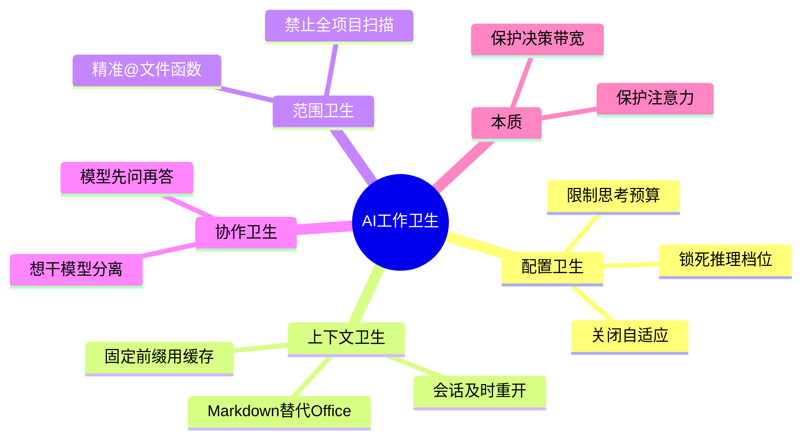

---
tags:
  - tech-article
  - AI
  - Token
  - Prompt-Cache
  - 人机协作
  - 工程化
created: 2026-06-23
category: 技术文章/AI
aliases:
  - 你讲卫生吗
  - AI工作卫生
  - Enri七条经验
---

# 你讲卫生吗？

> **原文链接**: [微信公众号原文](https://mp.weixin.qq.com/s/1dUfjAM1sr-Ja_Ad3LPT9g)

> **一句话总结**: Token 变便宜不等于可以乱用——腾讯 AI 产品工程师 Enri 用七条「工作卫生」习惯说明：锁配置、用缓存、控上下文、精准 @、先问后干、想干分离，才能保住注意力与决策带宽，避免模型和人都变「脏」。

> **前置知识检查**:
> - [ ] 了解 LLM 上下文窗口与 Token 计费的基本概念
> - [ ] 使用过带 @ 文件/函数、多轮对话的 AI Coding 工具
> - [ ] 知道 Prompt Cache / 前缀缓存的大致原理
> - [ ] 理解「推理档位」「思考预算」等模型配置项

## 原文

Enri，一位腾讯 AI 产品工程师，过去半年 Enri 和大模型打交道，最大收获就两个字：**卫生**。不是物理卫生，是交互习惯的卫生。Token 越来越便宜，但你的注意力和决策带宽不会。脏活干多了，模型变傻，脑子也跟着乱。

以下七条实战经验：

**一、锁死模型配置**

很多工具默认「自适应思考」，实际上它会让 Token 消耗失控。正确做法是固定配置：推理档位锁死 high，关掉自适应，思考预算设上限 32K，关掉超长上下文，设定 200K 自动压缩。降智是你没把档位锁死，不是模型变笨。

**二、固定内容别动，利用缓存**

模型对完全相同的输入前缀有缓存命中机制，重复使用只需十分之一的费用。长期不变的内容（如身份、业务、输出偏好、原则、约束）固定下来，不要每次重新组织语言。临时放本次任务、材料、目标、截止时间。变动的成本远高于你想象。

**三、别喂 PPT**

PPT、Word 这类复杂格式文件包含大量排版控制信息，喂给模型会消耗 80% 以上的无效 Token。先转成 Markdown 再喂。格式是给人看的，Markdown 是给模型看的。

**四、别让会话变垃圾桶**

超长会话堆积历史日志和工具调用记录，模型翻旧账，又贵又慢。换任务就开新对话，跑偏了重开重说背景，距上一条超一小时也重开。只有同一任务连续推进且不足一小时，留原对话才划算。

**五、让 AI 看一段，别扫一片**

用 @ 精准指定文件或函数，别让 AI 自己扫描整个项目。@文件名引用文件，@函数名引用函数，选中代码直接改。改一个验证规则从扫几十个文件降到几百 Token，差距是几十倍。能 @ 函数不 @ 文件，能 @ 文件不靠扫描。

**六、让模型先问**

告诉模型「你一次问我一个问题，帮我把思路理清」，等它问完再整理成文档，产出的 AI 感会弱很多。或先问「你需要我给你什么信息才能完成得更好？」，让模型主动暴露你的盲区。让模型先问，比让模型先猜便宜。

**七、把想和干拆开**

用顶配模型讨论方案，只出方案不动文件；然后交给便宜模型机械执行。顶配模型不需要读取整个项目，消耗降 3-5 倍；便宜模型不思考只管干，Token 极便宜。机械的活交给机器，思考留给最贵的脑子。

这些习惯不是为了省钱。Token 会继续变便宜，但你的思考带宽和注意力不会。AI 太便宜反而容易滥用——一十个 Agent 全开，扫整个项目，无限试错无限返工。你的决策带宽有限。对自己前额叶好点，注意 AI 时代的工作卫生。

---

## 核心概念脑图



## 与你已有知识的关联

**《[[一篇搞懂 AI Coding Agent 的 Token 成本控制|Token成本控制]]》**：该文从系统架构层拆解 Token 账单结构；本文从个人交互习惯层给出七条可立即执行的卫生准则，二者互补——前者讲「系统怎么省」，后者讲「人怎么不浪费」。

**《[[横向拆解Claude Code、Codex等六大Agent上下文压缩策略后，我们做了第7个|上下文压缩策略]]》**：该文讨论 Agent 如何在接近上下文上限时自动压缩；本文「别让会话变垃圾桶」「200K 自动压缩」是用户侧主动配合压缩策略的前置习惯。

**《[[AI 不缺智商缺纪律：一场 Harness 工程化实践|Harness工程化]]》**：Harness 强调门禁、预算与流程纪律；本文的「工作卫生」可视为 Harness 理念在个人 daily 使用层的轻量版实践清单。

**《[[人和Agent怎么一起干活——复制粘贴的进化之路，先装个贾维斯吧|人机协作]]》**：该文关注剪贴板级人机协作入口；本文第五条「@ 精准指定」是同一协作哲学在 IDE Agent 场景下的具体操作规范。

**《[[Prompt被淘汰了？深度拆解Loop Engineering，炒作还是趋势？|Loop Engineering]]》**：Loop 工程强调生成者与检查者分离；本文第七条「把想和干拆开」是模型路由层面的同类分离——思考用贵模型，执行用便宜模型。

## 重难点理解

- **重点/难点1**: 工作卫生 ≠ 省钱 — 核心稀缺资源是**人类注意力与决策带宽**，不是 Token 单价。常见误区是 Token 便宜了就可以无限开 Agent、无限扫仓库。

- **重点/难点2**: 固定前缀与 Prompt Cache — 身份、规则、输出偏好等**长期不变**的内容应字面稳定地放在每次请求前缀，才能触发缓存命中（约 1/10 费用）。每次「换说法」都在破坏缓存。

- **重点/难点3**: 会话生命周期 — 只有「同一任务、连续推进、距上条 <1 小时」才值得保留会话；换任务、跑偏、超时都应重开，避免模型在垃圾上下文中「翻旧账」。

- **重点/难点4**: 想干分离的模型路由 — 讨论方案时顶配模型**不读全库、不改文件**；机械执行交给便宜模型。这不是抠门，而是把贵模型的推理能力用在刀刃上。

## 原文内容流程图

```mermaid
flowchart TD
  A[与大模型协作] --> B{配置是否锁死?}
  B -->|否| C[Token失控 / 降智感]
  B -->|是| D[固定前缀 + 缓存]
  D --> E{输入是否干净?}
  E -->|PPT/长会话| F[80%+无效Token]
  E -->|Markdown + 新会话| G[精准@范围]
  G --> H{先问还是先猜?}
  H -->|先猜| I[盲区 + 返工]
  H -->|先问| J[理清需求]
  J --> K[顶配想 / 便宜干]
  K --> L[保住注意力与决策带宽]
```

## 经验

1. **锁配置先于 blaming 模型**: 推理档位、思考预算、上下文上限先固定，再评估模型是否「变笨」 — **应用场景**: 任何默认开启「自适应思考」的 Coding Agent。

2. **Markdown 是模型的母语**: Office 格式先转 Markdown 再喂，可砍掉大量排版噪声 Token — **应用场景**: 需求文档、方案评审材料输入 Agent。

3. **@ 函数优于 @ 文件优于扫全库**: 改一条验证规则，精准 @ 可差几十倍 Token — **应用场景**: 局部代码修改、规则调整。

4. **模型先问再写**: 「一次一个问题」或「你需要什么信息」比直接生成长文更省 Token、更少 AI 味 — **应用场景**: 方案起草、需求澄清。

5. **想干分离**: 讨论用 Sonnet/Opus 级，执行用 Haiku/Flash 级 — **应用场景**: 先设计后批量改代码的多步任务。

## 知识

| 知识点 | 定义 | 关键要素 | 关联概念 |
|-------|------|---------|---------|
| AI 工作卫生 | 与大模型协作时的交互纪律 | 锁配置、净上下文、精准范围、先问后干 | Harness、Token 优化 |
| 前缀缓存 | 相同输入前缀重复使用时费用大幅降低 | 固定身份/规则/偏好文案、避免改写 | Prompt Cache |
| 会话垃圾桶 | 超长多任务会话堆积历史与工具日志 | 换任务重开、超 1 小时重开、跑偏重开 | Context Rot |
| 想干分离 | 思考型与执行型任务用不同档位模型 | 顶配只出方案、便宜模型机械执行 | 模型路由 |
| 精准 @ | 用符号引用文件/函数而非全库扫描 | @函数 > @文件 > 扫描 | RAG 范围控制 |

## 可复用建议

1. **建立固定 System 块模板**: 身份、业务背景、输出格式、原则约束写成固定段落，每次原样粘贴 — **适用场景**: 日常重复型 Agent 对话 — **预期效果**: 提高缓存命中、减少组织语言成本。

2. **任务切换 checklist**: 新任务 → 新会话；读 PPT/Word → 先转 MD；改代码 → 先 @ 最小范围 — **适用场景**: 团队 AI 使用规范 — **预期效果**: 统一卫生标准，减少「模型变傻」抱怨。

3. **双模型工作流**: Phase1 顶配讨论（禁止 tool write）；Phase2 便宜模型执行（只读方案+改文件） — **适用场景**: 中大型重构、多文件改动 — **预期效果**: 总 Token 降 3-5 倍且方案质量不降。

4. **先问模式 Prompt**: 开头加「请先一次只问我一个问题，直到信息足够再输出」 — **适用场景**: 文档/方案生成 — **预期效果**: 减少猜测性输出与返工轮次。

## 实施办法

1. **第1步**: 检查当前 Agent 工具的配置项，关闭自适应思考，锁推理档位与思考预算上限。

2. **第2步**: 整理一份「固定前缀」文档（身份、规则、偏好），后续每次对话原样放入，仅把任务/材料/目标/截止时间放在变动区。

3. **第3步**: 制定会话规则——换任务开新聊、超 1 小时重开、Office 文档先转 Markdown。

4. **第4步**: 代码类任务强制 @ 最小范围；复杂任务启用「模型先问」或「想干分离」双阶段流程。

5. **第5步**: 每周回顾一次 Token/轮次日志，识别是否仍有「扫全库」「长会话翻旧账」等脏习惯并纠正。
