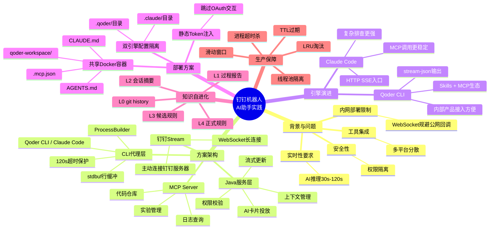
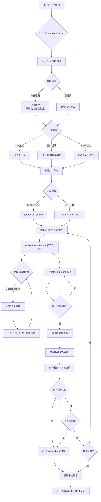

# 基于钉钉机器人的 Qoder CLI / Claude Code 双引擎 AI 助手实践

> **原文链接**: https://mp.weixin.qq.com/s/UdQ7xhM25Er6Eyk0xs577w
> **一句话总结**: 通过钉钉 Stream WebSocket 长连接 + Java ProcessBuilder 代理 CLI 引擎，以最低工程成本实现企业级 AI 助手从零到一的落地，支持 Qoder CLI 与 Claude Code 双引擎可切换，融入 MCP 工具调用、流式卡片展示、安全权限隔离等生产级能力。
> **前置知识检查**: - [ ] 钉钉 Stream 模式 / WebSocket 长连接基础概念
> - [ ] MCP (Model Context Protocol) 协议基础
> - [ ] Java ProcessBuilder 子进程管理
> - [ ] Docker 容器化部署与多进程共存
> - [ ] OAuth2 认证流程

## 原文

闪购搜索团队在钉钉群中构建了一个 AI 助手，让成员通过自然语言对话即可完成搜索问题排查、性能分析、实验管理等操作。核心挑战在于：内网部署无法暴露公网回调地址、AI 推理耗时 30s-120s 用户无法接受一次性返回、需要权限隔离、需要集成多种外部工具。

方案采用 **钉钉 Stream (WebSocket) + CLI 代理** 架构：钉钉 Stream 长连接解决内网回调问题，Java 服务层负责权限校验、上下文管理（LRU + TTL + 滑动窗口三重防护）、并发控制（线程池 10-15），CLI 代理层通过 ProcessBuilder spawn Qoder CLI 或 Claude Code 子进程，stdbuf -oL 行缓冲解决 Node.js 非 TTY 全缓冲导致的延迟，输出通过钉钉 AI 卡片实现流式打字机效果。

MCP 工具集成方面通过预先静态获取 Bearer Token 写入 .mcp.json 的 headers，跳过 OAuth 交互式授权流程，使无头 Docker 容器也能调用外部 MCP 服务。知识自进化机制采用 L0-L4 五级沉淀模型，候选规则触发 >=3 次且成功率 >=80% 自动晋升为正式规则。

最终实现了完全内网部署、实时流式回复、安全权限隔离、MCP 工具开放、引擎可切换、生产级稳定的企业 AI 助手。

## 核心概念脑图 (mermaid mindmap)

## 与你已有知识的关联

**《[[个人学习/LLM大模型类相关知识/AI Agent系列｜深入解析Function Calling、MCP和Skills的本质差异与最佳实践|AI Agent系列-Function Calling、MCP和Skills本质差异]]》**：本文的 MCP 工具集成实践是该文中 MCP 理论的具体落地案例——通过静态 Bearer Token 跳过 OAuth 解决了无头服务器的认证难题，是可复用的实战方案。

**《[[个人学习/LLM大模型类相关知识/AgentSkillsTeams 架构演进过程及技术选型之道|AgentSkillsTeams 架构演进及技术选型]]》**：本文从 Qoder CLI 到 Claude Code 的引擎切换过程，正是 Agent 技术选型在真实生产环境中的迭代验证——复杂推理场景下模型能力是瓶颈，CLI 代理模式则是低成本的快速切换方案。

**《[[个人学习/LLM大模型类相关知识/如何构建和调优高可用性的Agent？浅谈阿里云服务领域Agent构建的方法论|如何构建和调优高可用性的Agent]]》**：本文的 LRU + TTL + 滑动窗口三重上下文防护、线程池隔离、进程超时自动杀等设计，是高可用 Agent 方法论在钉钉机器人场景的具体落地。

**《[[个人学习/LLM大模型类相关知识/企业级 Agent 多智能体架构与选型指南|企业级 Agent 多智能体架构与选型指南]]》**：本文展示了单 Agent（非多智能体）在企业场景中的完整生产技术方案——从消息接入、权限控制、工具集成到知识沉淀，是选型指南中的"CLI 代理 + WebSocket"模式实例。

**《[[个人学习/LLM大模型类相关知识/Skills：从编程工具的配角到Agent研发的核心|Skills：从编程工具的配角到Agent研发的核心]]》**：本文的 L0-L4 五级知识自进化机制，正是 Skills 从简单指令集向持续学习进化体系的工程化体现——候选规则自动晋升机制让 AI 助手越用越聪明。

## 重难点理解

**1. 钉钉 Stream 模式为何是内网部署的最优解**

传统钉钉机器人回调要求服务暴露公网地址，内网环境下需要反向代理、DNS 配置等额外工作。Stream 模式反其道而行——服务主动通过 WebSocket 连接钉钉服务器，天然规避了内网穿透问题。代价是多实例部署时需精确控制开关，否则消息会重复处理。

**2. stdbuf -oL 为何是流式体验的关键**

Node.js 在非 TTY 环境（被 Java ProcessBuilder 调用时）默认采用 4KB 全缓冲，即输出攒够 4KB 才刷出。对 AI 推理的逐字输出场景，这意味着用户会看到"卡住 30 秒然后突然一大段文字"。stdbuf -oL 强制切换为行缓冲，每遇到换行符就刷出，让 Java 层能实时读取每一行 JSON 并更新 AI 卡片。

**3. 静态 Bearer Token 跳过 MCP OAuth 的本质**

MCP OAuth 流程需要浏览器交互（授权页面点击授权），无头 Docker 容器无法完成。方案是本地预获取长期 token（mcpa_ 前缀），将其硬编码在 .mcp.json 的 headers.Authorization 中，CLI 发起请求时直接携带。本质是把"运行时交互授权"前置为"构建时静态注入"，牺牲了 token 自动刷新的便利性换取了无头环境的可用性。

**4. 引擎切换的低成本设计**

两个引擎的调用方式高度统一：都通过 ProcessBuilder spawn，都输出 stream-json 格式。Java 层的流式解析和 AI 卡片更新逻辑完全复用，切换引擎只需改变 CLI 路径和环境变量。这种"标准化 CLI 接口 + 统一输出格式"的设计让引擎迭代几乎零成本——本质上是把 AI 引擎当作标准化的命令行工具来看待，而非紧密耦合的 SDK 依赖。

**5. 五级知识自进化的自动化门槛设计**

L3 候选规则晋升 L4 正式规则的条件是"触发 >=3 次且成功率 >=80%"，这是一个精心设计的门槛：次数门槛（>=3）避免偶然成功的噪音，成功率门槛（>=80%）确保质量。这种自动晋升机制让知识沉淀从"需要人工维护"变成"AI 自动发现并提议"，是知识管理从被动到主动的关键转变。

## 原文内容流程图 (mermaid flowchart)

## 经验

1. **WebSocket 反向连接是内网服务对外暴露能力的通用解法**：不只是钉钉 Stream，任何需要内网服务接收外部消息的场景都可以考虑让服务主动连接外部平台的长连接方案，避免配置公网回调的复杂度和安全风险。

2. **CLI 代理模式是快速接入 AI 最轻的方式**：相比集成 SDK 或 HTTP API，直接 spawn CLI 进程获取流式输出，几乎没有框架依赖，输出格式统一后切换引擎成本极低。适合早期快速验证和多引擎 A/B 测试阶段。

3. **进程级隔离天然适合 AI Agent 场景**：每个请求一个进程，异常可直接 kill 而不影响其他请求，状态完全隔离。相比线程池内共享状态的方式，避免了复杂的并发安全问题。

4. **静态 Token 注入是内部 MCP 基础设施尚不完善时的务实方案**：当 MCP 平台还不支持客户端凭证模式（client_credentials grant）时，硬编码长期 token 是可行的过渡方案。长期应推动 MCP 平台支持非交互式认证方式。

5. **三防机制（TTL + 滑动窗口 + LRU）覆盖了上下文管理的全部边界**：单看任何一种机制都有盲区，TTL 处理"太旧"，滑动窗口处理"太多"，LRU 处理"全局满"。三者组合才构成完整的防护体系。

## 知识

1. **钉钉 Stream 模式**本质是服务端主动通过 WebSocket 连接钉钉开放平台，订阅消息事件，无需公网可回调地址。适合内网微服务场景。关键风险是多实例并发时消息重复，需环境开关精确控制。

2. **ProcessBuilder + stdbuf -oL** 是 Java 调用 Node.js CLI 获取实时输出的标准范式。stdbuf 是 coreutils 工具，-oL 表示对标准输出使用行缓冲（Line buffered）。注意 stdbuf 只对动态链接的 C 库有效，对静态链接程序无效。

3. **MCP 协议**定义了 AI 调用外部工具的标准化流程，包括工具发现、参数定义、调用执行。OAuth 认证流程中客户端需要交互式授权，但可通过预先获取 token 并静态注入 headers 跳过。mcpa_ 前缀的 token 是长期有效的 personal access token。

4. **AI 卡片流式更新**需要三个权限：企业内机器人发送消息、互动卡片实例写权限、AI 卡片流式更新权限。卡片更新频率控制在累计 >=50 字符才触发，避免频繁更新导致 API 限流。内容超过 3000 字符截断是卡片 API 的限制。

5. **Qoder CLI 与 Claude Code 的核心差异**：Qoder CLI 是阿里内部产品，接入方便有现成 Skills 生态，但在复杂多步推理场景下能力偏弱；Claude Code 在复杂问题排查上推理深度和准确性更强，MCP 工具调用成功率和参数构造准确度更高。两者通过不同的调用入口并行部署。

## 可复用建议

1. **内网 AI Agent 消息接入方案**：直接套用"Stream/WebSocket 长连接 + 服务主动连接平台"的模式，可复用到飞书、企业微信等其他 IM 平台。关键是把消息接收从"被动等回调"变为"主动订阅"。

2. **双引擎部署的目录隔离设计**：在 Docker 容器中通过独立的配置目录（.qoder/ 和 .claude/）和共享的工作目录（workspace/），实现不同引擎对同一套 MCP 配置和知识文件的复用。这个模式可复用到任意多引擎并行场景。

3. **MCP 无头部署的四步法**：(1)本地通过浏览器完成 OAuth 获取 access_token；(2)将 token 写入 .mcp.json 的 headers.Authorization；(3)chmod 600 限制读取权限；(4)Dockerfile COPY 打包进容器。任何需要在无浏览器环境中调用 MCP 的场景都可复用这个流程。

4. **知识自进化的晋升规则可参数化**：将"触发次数阈值"和"成功率阈值"作为可配置参数，不同团队可根据自身场景调整（高风险操作降低触发次数阈值尽快形成规则，低风险操作可放宽以收集更多数据）。

## 实施办法

1. **第一步：钉钉机器人注册与 Stream 启用**。登录钉钉开放平台创建企业内部机器人应用，获取 appKey 和 appSecret，开通"企业内机器人发送消息""互动卡片实例写权限""AI 卡片流式更新权限"，在消息接收模式中选择 Stream 模式。

2. **第二步：搭建 Java 服务骨架**。创建 Spring Boot 项目，引入钉钉 Stream SDK，编写 @PostConstruct 初始化 WebSocket 连接，注册 /v1.0/im/bot/messages/get 回调。实现权限校验逻辑（管理员 vs 只读用户）和上下文管理的 LinkedHashMap（LRU + TTL + 滑动窗口）。

3. **第三步：CLI 代理层开发**。编写 ProcessBuilder 通用调用方法，参数化 CLI 路径、prompt、环境变量。关键配置：stdbuf -oL 前置、--output-format stream-json、--max-turns 限制、120s 超时 + destroyForcibly。BufferedReader 256 字节小缓冲确保及时输出。

4. **第四步：MCP 配置与 Token 注入**。在本地通过正常 OAuth 流程获取 MCP access_token，写入 .mcp.json 各 mcpServer 的 headers.Authorization。chmod 600 保护 token 文件。Qoder CLI 还需要配置 mcp-oauth-tokens.json（JSON 数组格式）和 mcp-oauth-clients.json（444 只读）。

5. **第五步：Docker 化部署**。编写 Dockerfile：安装 ajdk + nodejs + git，npm install 两个 CLI 引擎，COPY 工作目录和配置目录，设置文件权限。关键配置通过 antx/diamond 注入（禁止硬编码），多实例环境通过开关控制 Stream 只在日常环境启用。

6. **第六步：知识体系初始化**。创建工作目录下的 AGENTS.md 和 CLAUDE.md 作为知识入口，配置 L0-L4 五级知识目录结构，设定候选规则晋升参数（触发次数 >=3，成功率 >=80%）。随团队使用持续沉淀经验。