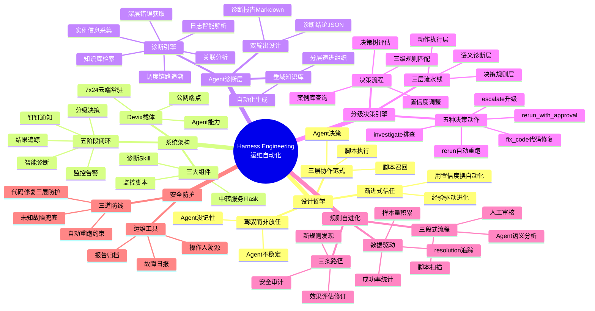
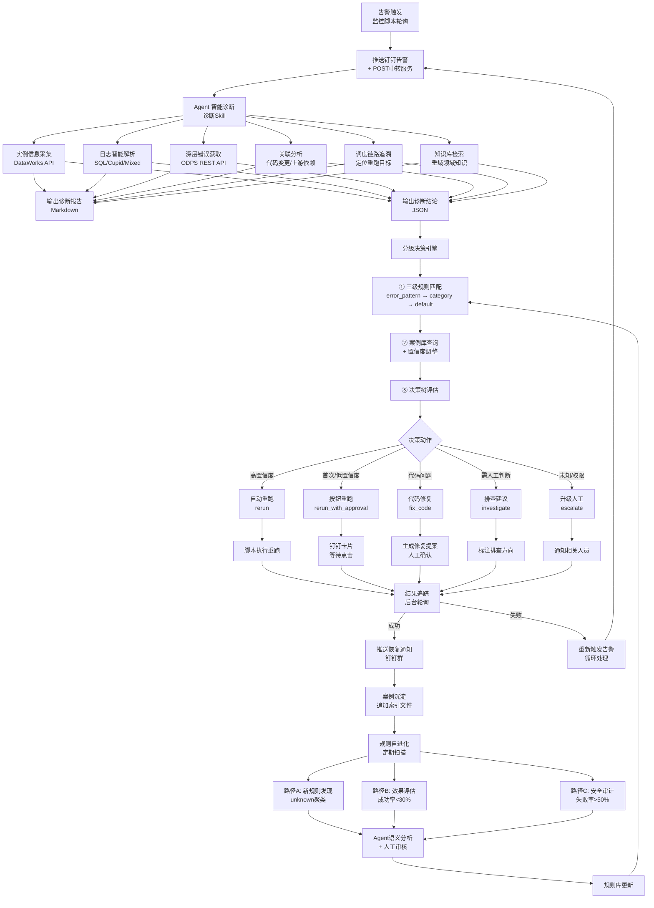

---
tags:
  - tech-article
  - AI
  - Harness-Engineering
  - DevOps
  - Agent-运维
  - 置信度决策
  - 规则自进化
  - 案例库学习
created: 2026-06-23
category: 技术文章/AI
aliases:
  - Agent运维Harness
  - Devix自动化运维
---

# 当 Agent 替你值班：基于 Devix 构建 7x24 自动化运维 Harness Engineering

> **原文链接**: https://mp.weixin.qq.com/s/_cVR4O3Gg3XcxYmkO28K8Q

> **一句话总结**: 用 Harness Engineering 为 AI Agent 套上工程化缰绳，通过"脚本召回 → Agent 决策 → 脚本执行"的三层架构，让运维 Agent 从经验中学习、用置信度换自动化程度，实现可控的 7x24 故障自愈。

> **前置知识检查**: 
> - [ ] AI Agent 基本概念与能力边界
> - [ ] 数据调度系统运维（如 DataWorks、Airflow）
> - [ ] 决策树与置信度评估
> - [ ] YAML 配置与规则引擎设计
> - [ ] 钉钉/企业微信机器人集成

## 原文

### 一、凌晨两点的报警，你还在手动排查吗？

凌晨两点，手机响了。钉钉运维群里弹出一条「DataWorks 自定义报警」。没有错误原因，没有日志摘要，只有一行实例名称和ID，状态：Failed。

你知道该走什么流程：打开 DataWorks 运维中心 → 搜索这个实例 ID → 点进去看运行日志 → 日志里看到一些报错关键词但不够精确 → 再去 Logview 里翻 ODPS 引擎层的详细错误 → 终于定位到是 `ODPS-0730012: CupidError... kube master stop` → 判断是 Cupid Kubernetes 控制面瞬时抽风 → 确认这个节点是工作流内层的子节点，需要找到外层周期实例来重跑 → 执行重跑 → 在群里回一句"已处理"。

这不是最痛苦的。最痛苦的是——**同一个错误这周出现过三次，每次都是你爬起来重跑的**。

这就是阿里控股集团消费者认知团队的日常，背后是几十个项目空间、数千个调度节点，任何一个环节出问题都可能影响下游数据产出。长期依赖人工值班的运维模式有三个核心痛点：

- **慢**：从告警到人工响应平均 15-30 分钟，凌晨更久；日志需要层层获取，排查链路长
- **重复**：同类故障反复出现，每次都要重新走一遍完整的排查流程
- **断层**：老手的排查经验停留在脑子里，新人上手门槛高

现有的 AI 运维工具已经能做到基础的日志解析和错误提取，但它们缺乏对具体业务的理解——能告诉你"DAG failed"，但无法结合垂域业务各层级之间的依赖关系、JSON 配置的业务语义、以及历史处理经验来判断真正的根因和最合适的处置方式。

**AI 把日志当文本读，人在把日志当业务读。这中间差的不是工具，是领域知识和工程化驾驭能力。**

所以他们决定自己造一个。

### 二、给 Agent 套上缰绳：Harness Engineering 的设计哲学

造之前，先想清楚了一个问题：**Agent 到底能不能干运维？**

答案是：**能，但不能放手让它干。**

Agent 有两个致命问题：
- **不稳定**：同一个错误给它看两次，它可能给出不同的诊断
- **没记性**：每次对话都是新的一天，上周处理过的同类故障它完全不记得

这两个问题在聊天场景下无伤大雅，但在运维场景下是致命的。你不能接受 Agent 在凌晨"创造性地"做了一个错误决策，把核心节点的代码改了。

所以引入了 **Harness Engineering** 的理念——用工程化的手段来驾驭 Agent，让它在一个可控的框架内发挥作用。核心设计原则三句话：

- **Agent 负责语义理解与决策推理，脚本负责数据召回与动作执行**：发挥 Agent 的语义优势做诊断和决策，但所有数据获取和动作执行由确定性脚本完成
- **用置信度换自动化程度**：高置信度全自动，中等置信度人工确认，低置信度升级处理
- **让系统从自己的经验中学习**：每次诊断结果沉淀为案例，案例反馈到决策过程，规则库持续进化

最终的系统架构可以浓缩为一句话：

**告警触发 → Agent 智能诊断 → 分级决策引擎 → 自动处置 / 人工确认 → 结果追踪 → 案例沉淀 → 规则进化**

### 三、系统架构：基于 Devix 的运维闭环

#### 3.1 为什么选择 Devix

自动化运维有两个硬性要求：一是 7x24 小时不间断运行，不能依赖任何人的本机；二是需要承载钉钉交互回调等公网中转服务。

评估了几个方案：

| 方案 | 7x24 运行 | 公网服务 | 消息通知 |
|------|----------|---------|---------|
| Qoder / 悟空 | 依赖本机 | 无 | 不可交互 |
| **Devix** | **云端常驻** | **公网端点** | **可交互** |

Devix 是阿里控股集团 Aone 团队推出的一站式 AI Native 研发平台，提供云端常驻 Sandbox 环境和 Agent 能力，天然支持全天候无人值守运行和公网服务部署。最终选择 Devix 作为整个运维 Agent 的运行载体。

#### 3.2 整体架构

系统由三个协同工作的组件构成，通过钉钉群进行信息协同和人机交互，形成从故障发现到恢复确认的完整闭环：

| 组件 | 部署方式 | 核心职责 |
|------|---------|---------|
| 监控脚本 | Devix 独立脚本轮询 | 轮询各项目空间的失败实例，推送告警并触发中转服务 |
| 中转服务 | Python Flask 常驻 Sandbox | 接收告警、触发诊断、承载重跑回调、轮询实例状态 |
| 诊断 Skill | Devix Agent 能力模块 | 解析日志、匹配错误模式、生成结构化诊断报告 |

端到端的数据流是：**监控脚本发现故障 → 推送钉钉告警 + 转发至中转服务 → 触发 Agent 诊断 → 决策引擎分级处置 → 钉钉交互通知 → 后台轮询追踪结果 → 失败则重新触发，形成闭环。**

**阶段 1：线上监控与告警触发**

监控脚本持续轮询各项目空间的失败实例。任务失败时，同时执行两个动作：向钉钉运维群推送告警消息，以及向中转服务 POST 告警内容。

**阶段 2：Agent 智能诊断**

中转服务接收告警后，触发 Agent 调用诊断 Skill，自动执行：获取实例信息 → 层层深入获取日志和引擎层精确错误 → 检查代码变更与上游依赖 → 追溯调度链路 → 结合知识库生成结构化诊断报告和诊断结论。

**阶段 3：分级决策与执行**

决策引擎接收诊断结论，经过规则匹配、案例库查询和置信度调整后输出分级处置动作。脚本根据动作类型执行：自动重跑、发送交互式钉钉卡片、或触发代码修复流程。

**阶段 4：钉钉通知推送**

诊断完成后向钉钉群发送 ActionCard 交互卡片，包含诊断摘要和操作按钮。

**阶段 5：结果追踪与闭环**

后台轮询线程持续监控实例状态；重跑成功或失败均推送最终通知到钉钉群；若重跑后再次失败，重新触发告警和诊断流程，形成循环处理。

### 四、Agent 诊断：从告警到根因的完整推理链

将诊断能力封装为一个 Agent Skill，当中转服务收到告警时，通过触发词自动调用该 Skill 执行诊断。

#### 4.1 诊断引擎做了什么

Agent 诊断是整个系统的"第一层"。但不是简单地让 LLM 读日志然后猜原因——那和现有工具没有区别。让 Agent 像真正的运维工程师一样执行一套完整的诊断流程：

- **实例信息采集**：通过 DataWorks OpenAPI 查询失败实例的完整信息，包括负责人、优先级、运行时长
- **日志智能解析**：自动识别 SQL / Cupid / Mixed 三种日志类型，结构化提取错误信息
- **深层错误获取**：通过 ODPS REST API 深入获取计算引擎层 Task 级别的精确错误——很多关键信息在 DataWorks 日志里是看不到的
- **关联分析**：检查代码变更、运维操作记录、上游依赖状态
- **调度链路追溯**：自动定位正确的重跑目标（外层周期实例 > 根工作流实例 > 当前实例）
- **知识库检索**：结合垂域领域知识库，理解节点间的依赖关系和业务语义

#### 4.2 诊断报告：给人看的 + 给机器用的

诊断完成后，Agent 同时输出两份文件，分别服务于不同受众：

| 输出 | 格式 | 受众 | 用途 |
|------|------|------|------|
| 诊断报告 | Markdown | 人 | 完整的故障分析、日志证据、修复建议，推送到钉钉群 + GitLab 归档 |
| 诊断结论 | JSON | 决策引擎 | 结构化字段：错误模式、环境上下文、置信度、修复提案 |

诊断结论 JSON 是连接诊断和决策的核心桥梁，包含以下四个部分：

**1）错误诊断**

包含 `error_pattern`（错误模式标识符，用于精确匹配决策规则）、`error_category`（错误大类，用于类目级兜底匹配）、`confidence`（LLM 对此诊断的置信度，0～1）、`severity`（严重程度）、`root_cause_summary`（根因摘要）和 `evidence`（支撑证据列表）。其中 `error_pattern` 是最关键的字段——Agent 在诊断时读取规则索引，了解系统已定义的错误模式列表，从中选择最匹配的填入；如果没有匹配的模式，填写 `unknown`，后续由规则自进化流程分析这些未匹配案例。

**2）环境上下文**

记录故障发生时的环境状态，作为决策树的分支条件：是否有代码变更（有变更则倾向代码修复）、上游是否存在失败（有则优先排查上游）、是否存在资源压力（有则错峰重跑更有效）、是否首次出现（首次则缺乏历史经验，保守处理）、数据量是否正常（异常则可能是数据膨胀导致）。

**3）修复建议**

Agent 给出的初步建议和方案，但最终决策由 Agent 综合历史案例和规则数据后给出。这种设计使得历史经验可以覆盖 Agent 的初步判断——当历史数据表明某类错误重跑失败率很高时，Agent 在综合决策时会选择升级处理而非重跑。

#### 4.3 知识库：让 Agent 理解业务

专门为 Agent 构建了一套团队内垂域领域知识库，覆盖系统概述、架构设计、核心参数、主流程、配置说明等关键章节。知识库通过自动化工具从 DataWorks 节点生成——输入一个节点 ID，自动完成源码获取、项目配置解析、代码分析、文档生成的全流程。

知识库的组织方式是分层递进的：总览文档 → 业务域文档 → 分层文档 → 节点明细。Agent 诊断时先通过总览判断问题在哪一层，再通过分层文档理解处理逻辑，最后通过节点明细定位具体问题。这和人工排查的思路是一致的。

### 五、分级决策引擎：用置信度换自动化程度

诊断完成了，接下来怎么处理？最直觉的做法是让 Agent 一条龙把决策也做了，但没有这么做。

#### 5.1 为什么不让 Agent 直接决策？

最初的设计确实是让 Agent 一条龙做完诊断和决策。但实际运行中发现了三个问题：

- **决策不可控**：Agent 对同一个错误模式，可能因为 prompt 的微妙差异给出不同的决策
- **策略难量化**：Agent 无法表达"历史重跑成功率 80% 以上才自动重跑"这种统计性条件
- **经验难沉淀**：Agent 每次决策都是独立的，无法从历史案例中学习

所以把诊断和决策拆成了两层，并在中间插入了一层确定性的脚本逻辑。

#### 5.2 三层流水线架构

| 层级 | 执行方式 | 输入 | 输出 |
|------|---------|------|------|
| Layer 1: 语义诊断层 | Agent | 实例日志 + ODPS 错误信息 + 知识库 | 诊断报告（Markdown）+ 诊断结论（JSON） |
| Layer 2: 决策规则层 | 脚本召回 → Agent 综合决策 | 诊断结论 + 历史案例证据 | 决策结果（动作 + 参数 + 置信度） |
| Layer 3: 动作执行层 | 脚本 | 决策结果 | 钉钉交互通知 / 自动重跑 / 代码修复 |

Layer 1 由 Agent 完成，负责语义分析和根因诊断——也就是诊断引擎。

Layer 2 是一个"脚本 + Agent"的协作层。左侧的脚本先做数据召回：三级规则匹配、案例库查询、置信度统计调整。然后 Agent 接收召回的规则、历史案例和统计数据，结合 Layer 1 的诊断结论进行综合判断，输出最终决策。

Layer 3 由脚本执行，Agent 不参与动作执行。这确保了所有操作的确定性和可审计性。

这个设计的核心范式是：**脚本召回 → 回流 Agent → Agent 决策 → 脚本执行**。Agent 被夹在两层确定性脚本中间，既发挥了它的语义理解优势，又被约束在可控的决策边界内。

#### 5.3 五种决策动作

决策引擎的输出被定义为五种动作，按自动化程度从高到低排列：

| 动作 | 含义 | 触发场景 |
|------|------|---------|
| 自动重跑 `rerun` | 系统直接执行，无需人工介入 | 瞬时基础设施故障 + 历史成功率高 + 无代码变更 |
| 按钮重跑 `rerun_with_approval` | 发钉钉通知，等人点击确认 | 首次出现的可恢复错误，或置信度不足 |
| 代码修复 `fix_code` | 生成修复提案，确认后自动执行 | Agent 诊断出代码问题且有可行方案 |
| 排查建议 `investigate` | 标注排查方向，提供重跑备用 | 数据量异常、上游依赖失败等需人工判断 |
| 升级人工 `escalate` | 通知相关人员处理 | 权限问题、未知错误等无法自动恢复 |

#### 5.4 决策流程

决策引擎接收一个诊断结论，输出一个决策结果。内部分三个步骤：

**诊断结论 → ① 规则匹配 → ② 案例库查询 + 置信度调整 → ③ 决策树评估 → 决策结果**

**1）规则匹配（三级降级）**

引擎按优先级查找适用的决策规则：

| 级别 | 匹配方式 | 说明 |
|------|---------|------|
| 第一级 | `error_pattern` 精确匹配 | 诊断结论的 error_pattern 与规则文件完全一致 |
| 第二级 | `error_category` 类目匹配 | 按故障大类匹配通用规则 |
| 第三级 | 全局默认 | `_default.yaml`，接受一切输入，输出最保守策略 |

每级匹配还会检查规则的最低置信度门槛（`min_confidence`）。比如某规则要求 `min_confidence: 0.7`，而诊断置信度只有 0.5，则跳过该规则继续降级。

**2）案例库查询与置信度调整**

规则匹配成功后，引擎查询案例库获取历史处理经验，用统计证据修正 Agent 给出的初始置信度。

每次诊断完成后，系统将案例的关键信息追加写入索引文件。其中除了实例 ID、节点名称、错误模式等基础字段外，还记录了解决路径 `resolution`——包括重跑次数、触发方式（auto / button / manual）、以及解决过程中是否有代码部署。这些数据不仅能区分"纯重跑恢复"和"代码修复后恢复"，还为后续的规则自进化提供了数据基础。

案例库按 `error_pattern` 全局聚合（跨项目、跨节点），计算该故障类型在所有项目中的整体重跑成功率。这种设计的考虑是：同一种故障模式在不同项目中的可恢复性是相似的——Cupid 资源不足在任何项目中都可以通过错峰重跑恢复，全局统计能更快积累到有意义的样本量。

置信度调整的原则是：**历史成功率高则上调，历史成功率低则下调，样本不足则不调整**。调整后的置信度将作为决策树评估的输入。

**3）决策树评估**

决策引擎从第一个分支开始，逐一检查每个分支的条件集合，首个所有条件都满足的分支即为最终决策。条件包括三类：阈值条件（调整后的置信度、历史重跑成功率、样本数）、上下文条件（是否有代码变更、上游是否失败、数据量是否正常等）、以及修复建议条件（是否有可行的修复提案）。

关键的一点是：**同一种故障，首次出现时和积累了经验后的决策结果是不同的**。首次出现时案例库没有数据，置信度不会被调高，决策树倾向于保守的"按钮重跑"；随着同类故障被反复处理、重跑成功率被验证，置信度逐步上调，决策树就会命中更自动化的分支。系统不是被"配置"出来的，而是被"训练"出来的。

### 六、故障规则库与规则更新：让 Agent 实现自进化

#### 6.1 规则文件结构

每条规则是一个 YAML 文件，包含五个部分：决策匹配条件（决定"怎么匹配"）、决策树（决定"怎么处理"）、诊断信息（供 Agent 识别错误模式）、自动重跑配置（供脚本判断安全性）、元数据（供规则演化引擎消费）。

#### 6.2 规则分类与决策策略

当前规模：15 条精确匹配规则 + 2 条兜底规则，按故障类型分为五大类：

- **基础设施类（5 条）**：覆盖 Cupid/Grape 图计算引擎的基础设施故障，全部标记为"安全可重跑"
- **UDF 类（4 条）**：覆盖用户自定义函数故障，默认不允许自动重跑
- **SQL 类（2 条）、数据类（2 条）、其他（2 条）**：覆盖语法错误、类型转换、数据倾斜、表/分区不存在、资源耗尽、权限拒绝等场景
- **兜底规则（2 条）**：任何未被上述规则覆盖的故障，走全局默认规则

#### 6.3 规则自进化

案例库中 resolution 数据记录了每个故障的完整解决路径。这些数据不只是用于置信度调整——它们还是规则自进化的燃料。

规则自进化机制包含三条并行路径，每条都遵循"脚本扫描 → Agent 语义分析 → 人工审核"的三段式流程：

**路径 A：新规则发现**

脚本扫描最近 30 天 `error_pattern = unknown` 的案例，按错误码前缀聚类。Agent 对每个聚类进行语义分析，理解根因模式，设计规则和决策树。人工审核后纳入规则库。

**路径 B：规则效果评估修订**

当某条规则的重跑成功率低于 30% 时触发。Agent 分析失败原因，建议调整决策树阈值或分支逻辑。效果差的规则会被持续优化，不会"僵化"。

**路径 C：自动重跑安全审计**

当允许自动重跑的规则实际重跑失败率超过 50% 时触发。Agent 建议降级自动重跑权限。这是安全性的最后防线。

#### 6.4 数据驱动的决策树设计

Agent 在生成新规则的决策树时，不是拍脑袋设计的，而是由案例的 resolution 数据驱动：纯重跑恢复占比高则添加自动重跑分支，代码修复占比高则添加代码修复分支，平均重跑次数决定最大重试次数，样本不足则保守设计仅兜底升级人工。

这也解释了为什么案例库中需要追踪 resolution——区分"纯重跑恢复"和"代码修复后恢复"，直接决定了新规则是否应该包含自动重跑分支。

### 七、安全防护与运维工具

#### 7.1 安全防护

Agent 做运维，安全性是底线。设计了三道防线：

**防线一：全自动重跑约束**

自动重跑（无需人工确认）必须同时满足：决策树自动重跑分支命中（要求置信度 > 0.9 + 历史成功率 > 80%）、无近期代码变更、规则明确标记为"安全可重跑"。

**防线二：代码修复三层防护**

代码修复是风险最高的操作，需要经过三层校验：诊断层（Agent 必须生成完整修复建议）→ 决策层（`fix_code` 分支必须命中）→ 执行层（用户在钉钉收到三按钮卡片，必须人工点击确认后才执行）。

**防线三：未知故障兜底**

任何未被规则覆盖的故障，一律走全局默认规则：升级人工处理。

#### 7.2 运维工具

除了核心链路，还沉淀了几个实用的运维工具：

| 工具 | 说明 |
|------|------|
| 操作人实名溯源 | 通过钉钉 JSAPI 免登识别重跑操作人身份，时间线中记录花名 |
| 故障日报自动生成 | 自动汇总当天诊断报告、API 实时状态和时间线数据，生成结构化日报 |
| 诊断报告自动归档 | 诊断报告自动推送至 GitLab 仓库，建立可追溯的故障知识库 |
| 手动重跑检测 | 绕过按钮在 DataWorks 控制台手动重跑时，系统同样能感知并通知 |

### 八、回顾与思考

- **Agent + 脚本的协作范式**：不是让 Agent 全权负责，也不是让脚本包办一切。Agent 做它擅长的语义理解和推理决策，脚本做它擅长的数据召回和动作执行。两者各司其职，互相约束。

- **用置信度换自动化程度**：这个设计让系统具备了"渐进式信任"的特性。新故障保守处理，随着经验积累逐步放开自动化程度，不需要一开始就做出"全对"的配置。

- **规则自进化机制**：让系统从自己的经验中学习，而不是停在第一版规则上不再变化。`unknown` 案例不断被聚类分析，最终转化为精确规则，系统越用越聪明。

- **选择 Devix 作为载体**：7x24 运行、公网服务、Agent 能力三合一，省去了大量基础设施搭建和维护成本。

**一句话总结**

**Harness Engineering 的本质，不是让 Agent 更聪明，而是让 Agent 更可控。模型能力的提升是永无止境的，但围绕模型构建的工程化约束——规则库、决策树、案例库、安全防护——才是让 Agent 真正可用于生产环境的关键。**

---

## 核心概念脑图

## 与你已有知识的关联

**《[[个人学习/LLM大模型类相关知识/Skills：从编程工具的配角到Agent研发的核心|Skills核心]]》**：本文的"诊断 Skill"是 Skills 在运维场景中的典型应用——将复杂的诊断流程封装为可复用的 Agent 能力模块，通过触发词自动调用，体现了 Skills 作为 Agent 能力单元的核心价值。

**《[[个人学习/LLM大模型类相关知识/如何构建和调优高可用性的Agent？浅谈阿里云服务领域Agent构建的方法论|高可用Agent方法论]]》**：本文的"三层流水线架构"（脚本召回→Agent决策→脚本执行）是该文"Agent工程化约束"论断的具体实践案例，特别是在生产环境中如何通过确定性脚本约束Agent的不确定性。

**《[[技术文章-DailyTech/AI 不缺智商缺纪律：我的 Harness 工程化实践|Harness工程化实践]]》**：本文是 Harness Engineering 在运维垂直领域的深度应用，与该文形成互补——前者聚焦代码开发场景，本文聚焦数据调度运维场景，共同验证了 Harness 理念的跨场景适用性。

**《[[技术文章-DailyTech/让 Claude Code 拥有自我进化和记忆系统｜得物技术|Agent记忆与自进化]]》**：本文的"案例库 + 规则自进化"机制与该文的"记忆系统"异曲同工——都是通过持久化历史经验让 Agent 从过去的交互中学习，但本文更强调数据驱动的规则演化（resolution 追踪、成功率统计）。

**《[[技术文章-DailyTech/用 LLM Agent 重构告警排查流程｜得物技术|告警排查Agent]]》**：两篇文章都聚焦 Agent 在运维告警场景的应用，但本文更进一步——不仅做诊断，还做了完整的分级决策和自动执行闭环，特别是"用置信度换自动化程度"的设计哲学。

**《[[个人学习/LLM大模型类相关知识/企业级 Agent 多智能体架构与选型指南|多智能体架构]]》**：本文的"监控脚本 + 中转服务 + 诊断 Skill"三组件协同，是该文"Agent 架构选型"中"专用Agent + 编排层"模式的具体实现。

## 重难点理解

- **重点1**: Harness Engineering 的本质 — 不是让 Agent 更聪明，而是让 Agent 更可控 — 这是整个系统的设计哲学。常见误区是认为"模型越强越好"，实际上工程化约束（规则库、决策树、案例库）才是让 Agent 可用于生产的关键。

- **重点2**: 三层流水线架构 — 脚本召回 → Agent 决策 → 脚本执行 — Agent 被夹在两层确定性脚本中间，既发挥语义理解优势，又被约束在可控边界内。这是"驾驭 Agent"的核心范式。

- **难点1**: 置信度动态调整机制 — 用历史成功率修正 Agent 初始置信度 — 这是"渐进式信任"的技术实现。常见困惑是"为什么不让 Agent 直接决策"——因为 Agent 无法表达统计性条件（如"成功率>80%才自动重跑"），也无法从历史案例中学习。

- **难点2**: 规则自进化的三条路径 — 新规则发现 / 效果评估修订 / 安全审计 — 每条都遵循"脚本扫描→Agent语义分析→人工审核"的三段式。关键是 resolution 数据的追踪——区分"纯重跑恢复"和"代码修复后恢复"，直接决定新规则是否包含自动重跑分支。

- **难点3**: 诊断结论 JSON 的设计 — 结构化字段（error_pattern、confidence、context、fix_proposal）— 这是连接诊断和决策的核心桥梁。error_pattern 是最关键的字段，用于精确匹配决策规则；unknown 的案例会被规则自进化流程分析。

## 原文内容流程图

## 经验

1. **Agent + 脚本协作范式**: Agent 负责语义理解与决策推理，脚本负责数据召回与动作执行 — **应用场景**: 任何需要将 Agent 用于生产环境的场景，特别是运维、客服、审批等对稳定性要求高的领域

2. **用置信度换自动化程度**: 高置信度全自动，中等置信度人工确认，低置信度升级处理 — **应用场景**: 需要平衡效率与安全的自动化决策系统，让系统具备"渐进式信任"特性

3. **案例库全局聚合**: 按 error_pattern 跨项目、跨节点聚合统计，更快积累到有意义的样本量 — **应用场景**: 多租户、多项目的 SaaS 系统运维，同一种故障模式在不同环境中的可恢复性相似

4. **双输出设计**: 诊断报告（Markdown 给人看）+ 诊断结论（JSON 给机器用）— **应用场景**: 任何需要同时服务人类和自动化系统的 Agent 输出场景，确保信息的双重可用性

5. **规则自进化三段式**: 脚本扫描 → Agent 语义分析 → 人工审核 — **应用场景**: 任何需要让系统从经验中持续学习的场景，避免规则库"僵化"

6. **resolution 追踪**: 记录解决路径（重跑次数、触发方式、是否有代码部署），区分"纯重跑恢复"和"代码修复后恢复" — **应用场景**: 需要数据驱动决策树设计的场景，直接决定新规则是否包含自动重跑分支

7. **三道安全防线**: 自动重跑约束 + 代码修复三层防护 + 未知故障兜底 — **应用场景**: 任何 Agent 可能执行高风险操作的场景（代码修改、数据删除、资金操作等）

## 知识

| 知识点 | 定义 | 关键要素 | 关联概念 |
|-------|------|---------|---------|
| Harness Engineering | 用工程化手段驾驭 AI Agent，让其在可控框架内发挥作用的系统设计哲学 | Agent不稳定、没记性；脚本召回→Agent决策→脚本执行；规则库、决策树、案例库 | Agent工程化、人机协作、生产级Agent |
| 三层流水线架构 | 将 Agent 夹在两层确定性脚本中间的协作范式 | Layer1语义诊断（Agent）、Layer2决策规则（脚本+Agent）、Layer3动作执行（脚本） | Agent约束、确定性vs概率性、可审计性 |
| 置信度动态调整 | 用历史案例的统计证据修正 Agent 初始置信度的机制 | 历史成功率高则上调、低则下调、样本不足不调；案例库全局聚合 | 渐进式信任、经验学习、统计决策 |
| 规则自进化 | 系统从自身经验中持续学习、自动优化规则库的机制 | 三条路径：新规则发现、效果评估、安全审计；三段式：脚本扫描→Agent分析→人工审核 | 数据驱动、unknown聚类、resolution追踪 |
| 诊断结论 JSON | 连接 Agent 诊断和决策引擎的结构化数据桥梁 | error_pattern、confidence、context、fix_proposal；error_pattern用于精确匹配规则 | 双输出设计、结构化输出、机器可读 |
| 五种决策动作 | 按自动化程度从高到低排列的处置动作 | rerun、rerun_with_approval、fix_code、investigate、escalate | 分级处置、人工介入、自动化程度 |
| 垂域知识库 | 为 Agent 构建的团队内领域知识库，让 Agent 理解业务语义 | 分层递进：总览→业务域→分层→节点明细；自动化生成 | 业务理解、领域知识、知识组织 |
| 三道安全防线 | Agent 做运维时的安全防护机制 | 自动重跑约束、代码修复三层防护、未知故障兜底 | 风险控制、人工兜底、安全底线 |

## 可复用建议

1. **用 Harness Engineering 驾驭生产级 Agent**: 不要让 Agent 全权负责，用"脚本召回→Agent决策→脚本执行"的三层架构约束它 — **适用场景**: 任何需要将 Agent 用于生产环境的场景 — **预期效果**: Agent 的语义理解优势得以发挥，同时被约束在可控边界内，避免"创造性错误"

2. **设计双输出接口**: Agent 同时输出人类可读报告（Markdown）和机器可读结论（JSON）— **适用场景**: 任何需要同时服务人类和自动化系统的 Agent — **预期效果**: 一份输出双重用途，人类可以理解上下文，机器可以结构化处理

3. **用置信度换自动化程度**: 高置信度全自动，中等置信度人工确认，低置信度升级处理 — **适用场景**: 需要平衡效率与安全的自动化决策 — **预期效果**: 系统具备"渐进式信任"特性，新场景保守处理，经验丰富后逐步放开

4. **建立案例库全局聚合**: 按关键特征（如 error_pattern）跨项目、跨节点聚合统计 — **适用场景**: 多租户、多项目的 SaaS 系统 — **预期效果**: 更快积累到有意义的样本量，同一种模式在不同环境中的经验可以共享

5. **追踪 resolution 数据**: 记录完整的解决路径（重跑次数、触发方式、是否有代码部署）— **适用场景**: 需要数据驱动决策优化的场景 — **预期效果**: 区分不同解决方式的效果，为规则自进化提供数据基础

6. **实现规则自进化三条路径**: 新规则发现 + 效果评估修订 + 安全审计 — **适用场景**: 任何需要系统持续学习的场景 — **预期效果**: 规则库不会"僵化"，unknown 案例被聚类分析，效果差的规则被优化，安全风险被降级

7. **设计三道安全防线**: 自动操作约束 + 高风险操作多层防护 + 未知场景兜底 — **适用场景**: Agent 可能执行高风险操作的场景 — **预期效果**: 确保 Agent 不会"创造性地"做出错误决策，安全性是底线

## 实施办法

1. **第1步：识别痛点，确定 Agent 能力边界**
   - 梳理当前运维/业务流程中的重复性、高成本环节
   - 评估 Agent 在这些环节中的能力边界（能做什么、不能做什么）
   - 明确"Agent 不稳定、没记性"的两个致命问题在具体场景中的表现

2. **第2步：设计 Harness Engineering 架构**
   - 确定"脚本召回→Agent决策→脚本执行"的三层流水线
   - 定义 Agent 的职责边界（语义理解、决策推理）和脚本的职责边界（数据召回、动作执行）
   - 设计双输出接口：人类可读报告 + 机器可读结论

3. **第3步：构建诊断/分析引擎**
   - 将复杂的分析流程封装为 Agent Skill
   - 实现多层次信息采集（API 调用、日志解析、关联分析）
   - 构建垂域知识库，让 Agent 理解业务语义

4. **第4步：设计分级决策引擎**
   - 定义五种决策动作（从全自动到全人工）
   - 实现三级规则匹配（精确匹配→类目匹配→全局默认）
   - 设计决策树评估逻辑（阈值条件、上下文条件、修复建议条件）

5. **第5步：建立案例库与置信度调整机制**
   - 设计案例库结构，追踪 resolution 数据（解决路径、触发方式、代码变更）
   - 实现案例库全局聚合（跨项目、跨节点）
   - 实现置信度动态调整（历史成功率高则上调、低则下调、样本不足不调）

6. **第6步：实现规则自进化机制**
   - 路径A：定期扫描 unknown 案例，按特征聚类，Agent 语义分析生成新规则
   - 路径B：监控规则效果（如重跑成功率<30%），Agent 分析失败原因并建议修订
   - 路径C：审计自动操作安全性（如失败率>50%），降级自动权限

7. **第7步：设计安全防护体系**
   - 防线一：自动操作约束（置信度>0.9 + 成功率>80% + 无代码变更 + 规则标记安全）
   - 防线二：高风险操作多层防护（诊断层→决策层→执行层，必须人工确认）
   - 防线三：未知场景兜底（一律升级人工处理）

8. **第8步：选择运行载体，实现 7x24 闭环**
   - 选择支持云端常驻、公网服务、Agent 能力的平台（如 Devix）
   - 实现监控脚本轮询、中转服务、钉钉/企业微信集成
   - 实现结果追踪与循环处理（失败重新触发告警）

9. **第9步：沉淀运维工具**
   - 操作人实名溯源（识别谁执行了操作）
   - 故障/事件日报自动生成
   - 诊断报告自动归档（GitLab/知识库）
   - 手动操作检测（绕过按钮的操作也要感知）

10. **第10步：持续迭代，数据驱动优化**
    - 定期分析案例库数据，发现新的故障模式
    - 定期评估规则效果，优化决策树阈值和分支逻辑
    - 定期审计安全风险，降级不安全的自动操作
    - 让系统从自己的经验中持续学习，越用越聪明
