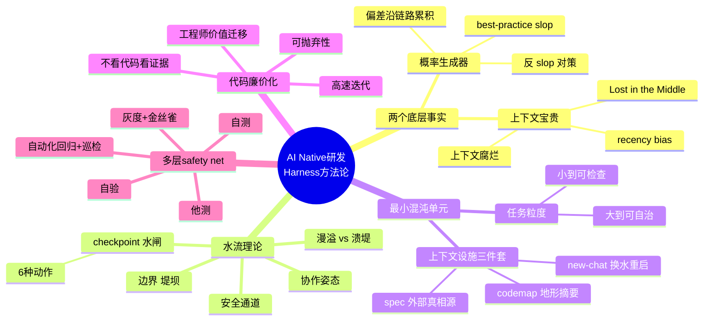
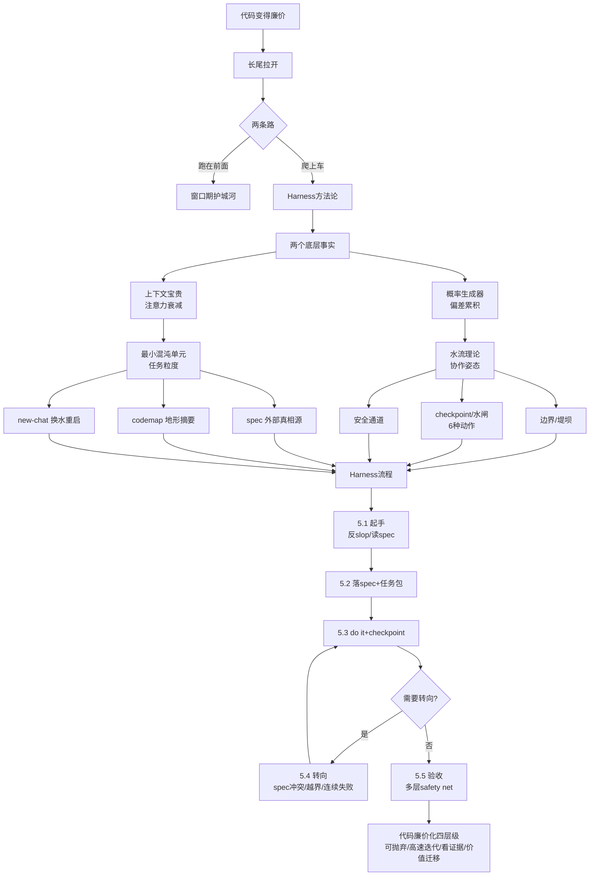

---
tags:
  - tech-article
  - AI
  - AINative
  - HarnessEngineering
  - 水流理论
  - 最小混沌单元
  - AICoding
created: 2026-07-03
category: 技术文章/AI
aliases:
  - AI Native研发
  - 水流理论
  - Code is cheap
  - 五倍coding效率
---

# AI Native研发：Harness方法论与水流理论实践

> **原文链接**: https://mp.weixin.qq.com/s/t04ysxZN2qEc3986r2gyTA

> **原标题**: Code is cheap. Don't write any.——AI Native，程序员如何提升五倍coding效率

> **一句话总结**: 代码正在变得极其廉价，工程师的核心价值从"写代码"迁移到"用 Harness 方法论控盘 AI 完成端到端交付"——水流理论管协作姿态，最小混沌单元管任务粒度。

> **前置知识检查**:
> - [ ] 了解 AI Coding 工具（Claude Code、Cursor 等）的基本使用
> - [ ] 理解大模型的概率生成本质和上下文窗口限制
> - [ ] 有实际的 AI 辅助编程经验（至少用过补全和对话式编程）

## 原文

AI Native 不仅指产品形态。在一些更窄的场景里，比如编程领域，它也可以特指 AI Native 研发。但这里的 AI Native 研发，不是让 Agent 写更多代码，也不是让 AI 零散参与研发流程，而是在清晰边界、可观测 checkpoint 和可验证闭环下，让代码生成、测试、修复、验证等实施动作尽可能由 AI 连续完成。人的角色不消失，而是上移到设定目标与边界、审阅 checkpoint、判断转向和最终验收。

### 一、Code is cheap

**最近 20 天，AI 帮我提交了 70 万行代码，10个项目，同时并行。**

不是 IDE 补全那种"AI 占 100%"。是把一个完整任务整包交出去——读地形、定方案、写实现、跑验证、修 bug——AI 自己全套跑完，我只在关键节点拽一下方向。


外部世界已经给了足够多的信号：AI 公司工程师在用 Claude Code、Codex 这类工具开发自己的 AI 产品；Google 等公司也公开提到新代码里 AI 生成占比在上升；Cursor、Devin 这类 AI-first 团队，则把产品团队规模压到了过去很难想象的程度。

**当同样的变化进入复杂工程现场，会怎样改变一个工程师的产能结构？**

典型的研发场景：产品线多、内部平台复杂、存量系统长、权限和发布链路严格。过去真正昂贵的不是敲代码，而是读懂历史、找准边界、确认影响面、跑通验证、控制发布风险。现在一旦模型可以整包接住"读地形、定方案、写实现、跑验证、修 bug"这一串动作，代码本身就开始从稀缺资源，变成可以快速生成、快速验证、快速丢弃的过程产物。

**代码本身，正在变得非常便宜。**

### 二、泥头车与长尾

代码廉价化的第一个副作用，是长尾的极端拉伸。

差距不是"会用 AI"和"不会用 AI"——这一拨差距其实已经不大。真正在拉开的是**用 AI 的层级差距**。头部的人已经能用 AI 同时推进 5 个项目，把任务整包交给模型自动跑；尾部的人，还停留在用 LLM 写写单测、补几个注释的阶段。

AI 不在乎任何人。它只是残忍地学习、代替、撞死所有跟不上它的人。它就是一辆不停加速的泥头车。

摆在每个人面前只有两条路：
1. **在它撞到你之前多跑两步**：在 AI 还没把某个能力做成标准产品之前抢先用它实现
2. **爬上这辆车**：迅速转型成 100% AI 工作者，让 AI 帮你跑、帮你写、帮你交付

这篇文章讲的是第二条——爬上车的方法。这套方法叫 **Harness**：**人定方向，模型推进**。


### 三、大模型的两个底层事实

**3.1 事实一：概率生成器**

大模型不是确定性函数。每吐一个 token，模型基于前面所有内容对词表里所有可能的下一个 token 算概率分布，然后按采样策略挑一个。

两个直接结果：
- **每一步的输出不是"想清楚再说"，而是"按概率挑一个"**——同样输入多次跑结果可能不同
- **每一步的小偏差会沿着链路累积**——一旦某步挑歪，后面越走越远

推论：**给它的自由空间越大，它跑偏的概率越大**。

这就是 **best-practice slop** 的来源——AI 在过大的目标空间里，把网上最常见的套路糊上来，生成一套**看似专业、但不贴业务地形**的平均产物。

工程对策是**反 slop**：任务开始前反复和模型讨论需求，让它复述目标；理解错就纠正；证据不足就继续搜索代码、日志、历史 spec；几轮后沉淀成 spec。

**3.2 事实二：上下文宝贵**

大模型的上下文窗口有限，而且**给得太多反而会腐烂**。

**"Lost in the Middle"**（Liu et al. 2023, Stanford）发现 LLM 对长上下文的记忆呈 **U 型分布**：开头记得清楚，结尾记得清楚，**中间的信息最容易被遗忘**。

多轮对话还会叠加：旧方案和新方案共存、自动总结丢失细节、**recency bias** 让模型过度看重最近几轮。

**自动总结只能延缓上下文腐烂，不能解决它**。真正的解是**定期重启**（new-chat skill），用 spec 作为外部真相源喂给全新 chat。

**真正要节约的不是 token，是上下文**——省 token 是成本问题，省上下文是质量问题。

### 四、方法论：水流理论 + 最小混沌单元

**4.1 理念一：水流理论 —— 一种编程方式**

水流理论解决 AI Coding 里最核心的协作问题：**怎么让模型自己推进，又不失控**。

传统软件工程像**挖水渠**——先设计路径再让代码执行。但大模型会搜索、组合、试探、绕路，把每一步规定死反而封住了它的探索能力。

水流理论的核心是把控制点从代码细节上移到三件事：

1. **边界**（堤坝）：任务包和 spec——目标、可动范围、不碰的 scope、验收标准
2. **checkpoint**（水闸）：关键节点看计划、证据和风险，决定放行/追问/加料/绕道/回炉/阻止
3. **安全通道**：高风险改动先进测试环境、灰度、金丝雀；出问题能回滚

区分两种情况：
- **漫溢**：模型在边界内自由探索，目标对、边界没破。允许 + checkpoint 观察
- **溃堤**：模型违反 spec、扩大 scope、连续验证失败。必须转向或回炉

**速度 + 方向 + 安全，三者都要。**

**4.2 理念二：最小混沌单元 —— 对抗两个事实的结构选择**

每次交给模型的任务要做到：**小到可检查，大到可自治**。

配套三件**上下文设施**：
- **spec**：把决策持久化成外部真相源，对抗对话腐烂、跨 session 接得上
- **codemap**：把代码地形摘要化，避免把整个 repo 塞进窗口
- **new-chat**：跨 session 换水，累积噪音留在原地，用 spec 喂给全新 chat

**4.3 两个理念的协作**

- **水流理论**管协作姿态——每个 checkpoint 上的反应、每次转向的判断
- **最小混沌单元 + 上下文设施**管原料——每次喂给模型的输入

两者唯一的接触点在 **checkpoint**：checkpoint 是水流理论的实施位，也是最小混沌单元的验收点。


### 五、Case 复盘

**Case A**：adaptive-room-harness（0→1 全新项目，多 agent 协作 room 系统）
**Case B**：脱敏内部存量项目治理（敏感资源外发审批卡片重复推送）

| 步骤 | 0→1 动作（case A） | 1→N 特殊形态（case B） |
| --- | --- | --- |
| 5.1 起手 | 描述需求 → 多轮讨论收敛目标（反 slop） | 读历史 spec / codemap 定位地形 |
| 5.2 落 spec + 任务包 | 讨论结果落成启动 spec，分出第一个任务包 | spec 在历史 spec 上增量补 |
| 5.3 do it + checkpoint | 模型自主推进；checkpoint 上 6 种动作 | （同 case A） |
| 5.4 转向 | 1-2 次主要转向 | 高频转向（4+ 次）+ new chat |
| 5.5 验收 | 第 1 层自验 + 第 2 层自测 | 全 5 层启用 |

**5.3 Checkpoint 上的 6 种动作**：

| 类别 | 动作 | 占比 |
| --- | --- | --- |
| 默认放行 | 放行（do it / 继续 / ok） | ~9% |
| 深入观察 | 追问（反向澄清模型） | ~25% |
| 方向控制 | 加料（沿原方向叠新约束） | ~47% |
| 方向控制 | 绕道（改方向） | ~5% |
| 方向控制 | 回炉（从某个 checkpoint 重新来） | ~2% |
| 方向控制 | 阻止（停） | 极少 |

**最高频的不是放行，是加料**（~47%）。checkpoint 不是裁判判决，是细颗粒控盘。

**三条硬规则触发转向**：
1. **spec 冲突**：模型方案违反 spec 已定的目标/边界/关键决策
2. **越界**：模型准备改动范围超出本轮任务包边界
3. **连续验证失败**：同一路径连续两次测试失败且无新证据

**5.5 验收·多层 safety net**：

| 层级 | 内容 | 说明 |
| --- | --- | --- |
| 第 1 层 | 自验（模型写验收报告） | 7 维度报告 + 逐条对照任务包 |
| 第 2 层 | 自测（模型跑接口测试） | 模型自己生成参数、调用接口、读日志判断 |
| 第 3 层 | 他测（独立视角） | 另一个 agent review + 测试同学端到端回归 |
| 第 4 层 | 自动化回归 + 巡检 | CI/CD 全套 + 安全/性能/依赖扫描 |
| 第 5 层 | 灰度 + 金丝雀 + 一键回滚 | 线上兜底 |

### 六、代码廉价化的四个层级

1. **现象层**：代码不只是便宜，是**可抛弃**（卫生纸，不是瓷器）
2. **工作方式层**：高速迭代压倒一切——如果代码贵，节俭代码；如果代码廉价，节俭时间
3. **实践姿态层**：我经常不看代码——质量从"源码级审美"迁移到"结果、证据、风险控制"
4. **身份层**：工程师价值结构在迁移——从"写代码的人"到"切任务包 + checkpoint + 看证据的人"


### 七、操作卡片

```
1. 读地形       → IDEA_DOC（0→1）/ 历史 spec / codemap（1→N）
2. 切任务       → 最小混沌单元，小到可检查、大到可自治
3. 做任务包     → 目标 / 边界 / 自由度 / checkpoint / 验收
4. 让模型推进   → 一句 do it，模型自由跑
5. checkpoint  → 6 种动作：放行 / 阻止 / 绕道 / 回炉 / 追问 / 加料
6. 必要时转向   → spec 冲突 / 越界 / 连续验证失败时打断
7. 证据验收     → 不听"完成了"；多层 safety net
8. 回写归档     → spec 是始终更新的真相源
```

> **图片说明**: 配图位于 assets/AINative研发-Harness方法论与水流理论实践/，CDN 可能过期

---

## 核心概念脑图



## 与你已有知识的关联

**《[[大厂技术文章-DailyTech/文章/Harness工程化-五层架构与门禁阻断实践|Harness工程化五层架构]]》**：本文的水流理论是 Harness 方法论的一种具体实践形态。Harness工程化侧重五层架构和门禁阻断，本文侧重协作姿态（水流理论）和任务粒度（最小混沌单元），两者互补。

**《[[大厂技术文章-DailyTech/文章/AI开发范式-Prompt到Context Harness Loop四层演进综述|AI开发范式四层演进]]》**：四层演进（Prompt → Context → Harness → Loop）是宏观视角，本文的水流理论 + 最小混沌单元是 Harness 层的具体方法论落地。

**《[[大厂技术文章-DailyTech/文章/Claude Code-Steering Claude七种配置方式选型指南|Steering Claude Code]]》**：Claude Code 的 7 种配置方式解决"如何引导 AI 行为"，本文的 spec / codemap / checkpoint 6 种动作解决"如何在执行过程中持续控盘"——前者是静态配置，后者是动态协作。

**《[[大厂技术文章-DailyTech/文章/Loop Engineering-实操手册与14步落地清单|Loop Engineering实操手册]]》**：Loop Engineering 关注 Agent 自主循环，本文的水流理论关注人在循环中的控盘姿态。两者是同一个 Loop 的不同视角——一个看 Agent 怎么跑，一个看人怎么管。

**《[[大厂技术文章-DailyTech/文章/Agent Harness Engineering-ETCLOVG七层框架综述|ETCLOVG七层框架]]》**：ETCLOVG 是 Harness 的系统化分层框架，本文的 spec/codemap/new-chat 三件套对应其中的上下文管理层，checkpoint 6 种动作对应控制面层。

## 重难点理解

- **重点1**: 水流理论 vs 传统软件工程 — 传统工程像"挖水渠"（先设计路径再执行），水流理论像"修堤坝"（控制边界和检查点，让模型自己找路）。核心区别是控制点从代码细节上移到目标/边界/checkpoint — **误区**：水流理论不是放任模型，而是把控制换了一种形式
- **重点2**: 最小混沌单元 — 每次给模型的任务要"小到可检查，大到可自治"。太小退化成瀑布式遥控，太大则失败太晚才发现 — **误区**：不是"把任务切碎"就行，还要配套 spec/codemap/new-chat 三件上下文设施
- **重点3**: 反 slop — 动手前用复述、纠正、查证、收边界把模型的搜索空间压进 spec。不是"多聊几句"，是结构性地把模糊目标磨成清晰共识 — **误区**：反 slop 不是写更好的 prompt，而是在写代码前和模型讨论收敛目标
- **难点4**: checkpoint 6 种动作的分布 — 最高频是"加料"（~47%），不是"放行"（~9%）。说明 checkpoint 不是审批，而是细颗粒控盘 — **误区**：不要把 checkpoint 当成"通过/不通过"的二元判断
- **难点5**: 上下文节约 vs token 节约 — 省 token 是成本问题，省上下文是质量问题。给模型越多上下文，注意力越稀薄，中间信息越容易被遗忘 — **误区**：直觉认为"给 AI 越多上下文越好"，实际上上下文过多会腐烂

## 原文内容流程图



## 经验

1. **反 slop 起手**: 0→1 项目不要直接让 AI 写代码，先和模型讨论收敛目标——让模型复述、纠正偏差、查证证据、收边界，直到目标形态清晰 — **应用场景**: 任何目标模糊的新项目启动
2. **checkpoint 加料为主**: checkpoint 上最高频的动作是"加料"（沿当前方向叠新约束），不是"放行"。把 checkpoint 当 spec 微迭代的一回合 — **应用场景**: 日常 AI 协作中的每次 checkpoint 审查
3. **new-chat 换水**: 讨论完方案、落到 spec 之后，用 new-chat 开全新对话，把旧对话的累积噪音和过期假设留在原地 — **应用场景**: 长对话（>15轮）后进入实施阶段时
4. **多层 safety net**: 不要只听模型说"完成了"，要证据。风险越高启用越多层验收 — **应用场景**: 任何 AI 生成代码的验收环节，尤其有线上流量的场景
5. **spec 是活文档**: spec 不是一次写完的完美文档，而是随工作推进不断回写的"活 spec"。每轮推进都增量补充 — **应用场景**: 所有需要跨 session 连续推进的项目

## 知识

| 知识点 | 定义 | 关键要素 | 关联概念 |
|-------|------|---------|---------|
| Harness | 人定方向、模型推进的 AI 协作方法论 | 边界 + checkpoint + 安全通道 | 水流理论, Loop Engineering |
| 水流理论 | 把控制点从代码细节上移到目标/边界/checkpoint的协作姿态 | 堤坝(边界) + 水闸(checkpoint) + 安全通道 | 漫溢 vs 溃堤 |
| 最小混沌单元 | 每次给模型的任务要做到"小到可检查，大到可自治" | 任务粒度 + spec + codemap + new-chat | 上下文设施 |
| 反 slop | 动手前用复述/纠正/查证/收边界把模型搜索空间压进spec | 复述目标 → 纠正偏差 → 查证证据 → 收边界 | best-practice slop |
| best-practice slop | AI在过大目标空间里生成的"看似专业但不贴业务"的平均产物 | 语言完整、结构漂亮、但不解决真实问题 | 概率生成器 |
| checkpoint 6种动作 | 放行/追问/加料/绕道/回炉/阻止 | 加料最高频(~47%)，放行仅~9% | 细颗粒控盘 |
| 转向三条硬规则 | spec冲突/越界/连续验证失败时必须打断 | 打断后回到 spec 重读，不是口头复述 | 水流理论 |
| 多层safety net | 5层验收：自验→自测→他测→自动化回归+巡检→灰度+金丝雀 | 风险越高启用越多层 | 代码可抛弃性 |
| 上下文设施三件套 | spec(持久化精炼) + codemap(读码有重点) + new-chat(跨session换水) | 都是事实二"上下文宝贵"的具体武器 | 最小混沌单元 |
| Lost in the Middle | LLM对长上下文记忆呈U型分布，中间信息最易遗忘 | Liu et al. 2023, Stanford | recency bias |

## 可复用建议

1. **0→1 起手用反 slop**: 开一个强制 Research/Innovate/Plan 阶段的 skill，不允许直接跳到写代码 — **适用场景**: 新项目启动、目标模糊时 — **预期效果**: 避免模型带着"看似合理的误解"狂奔
2. **1→N 起手读历史 spec**: 存量项目先让模型扫 `specs/` 目录找相关历史决策，比从头描述需求高效 100 倍 — **适用场景**: 存量系统维护、bug 修复 — **预期效果**: 快速定位地形，避免重复踩坑
3. **checkpoint 不要只看代码**: 看四件事——有没有越界、目标有没有偏、证据链够不够、风险有没有进安全通道 — **适用场景**: 每次 checkpoint 审查 — **预期效果**: 把注意力放在真正重要的事上
4. **长对话后必须 new-chat**: 讨论完方案落到 spec 后，用 new-chat 干净接手，第一句话直接接 spec — **适用场景**: 对话超过 15 轮后进入实施 — **预期效果**: 避免模型把已否定的方案又捡起来
5. **验收要证据不要承诺**: 让模型给 7 维度验收报告，自己抽样跑命令验证输出一致性 — **适用场景**: 任何 AI 生成代码的交付 — **预期效果**: 从"源码级审美"迁移到"结果+证据+风险控制"

## 实施办法

1. **第1步**: 建立 spec 模板——在项目根目录创建 `docs/specs/` 或 `mydocs/specs/`，每次任务都落一份 spec（目标/边界/关键决策/验收维度）
2. **第2步**: 建立 checkpoint 习惯——每段任务推进后，要求模型复述当前进度和下一步 diff 计划，再决定 6 种动作之一
3. **第3步**: 配置上下文设施——准备 codemap skill（给陌生代码库做地形索引）和 new-chat skill（对抗上下文腐烂）
4. **第4步**: 建立多层验收——至少做到第 1 层（自验报告）+ 第 2 层（模型自测），有线上流量的场景启用全部 5 层
5. **第5步**: 团队推广——把 `sdd-riper-one-light`（日常入口）和 `sdd-riper-one`（标准控盘入口）作为团队标准 skill，让方法从个人能力变成团队能力
