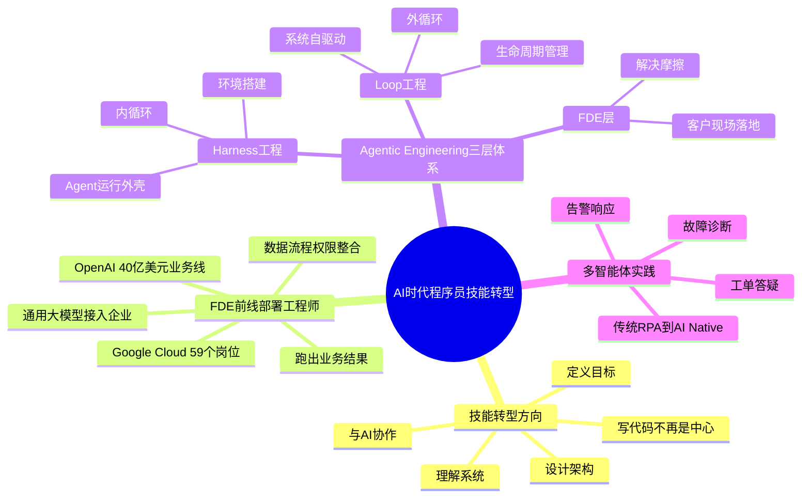
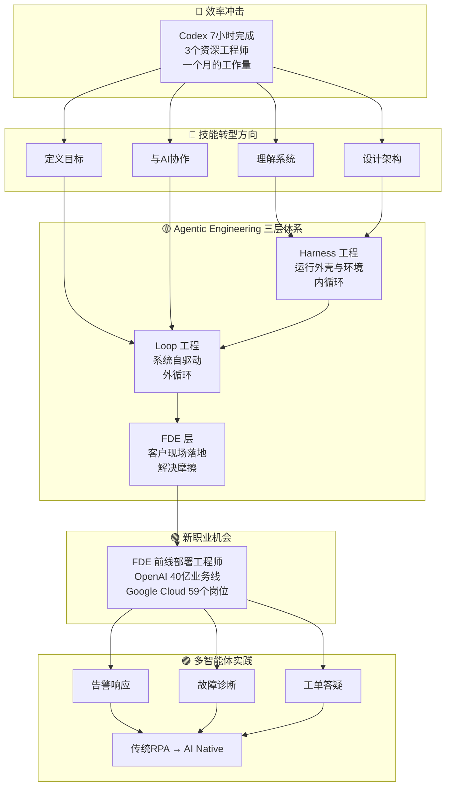

---
tags:
  - tech-article
  - AI
  - Agent
  - 技能转型
  - FDE
  - Loop工程
  - Harness工程
  - 多智能体
  - 前端周刊
created: 2026-06-15
category: 技术文章/AI
aliases:
  - 转转前端周刊199期
  - AI时代程序员技能转型
---

# AI 时代程序员技能转型：转转前端周刊第 199 期

> **一句话总结**: Codex 七小时完成三个资深工程师一个月的升级工作，标志着 AI 编程已从辅助工具进化为生产力主体。程序员必须从"写代码的人"转型为"理解系统、定义目标、设计架构、与 AI 协作的人"。本期周刊从技能转型、FDE 新岗位、Agentic Engineering 三层体系、Loop 工程实践到多智能体落地，完整勾勒出 AI 时代工程师的进化路径。

> **前置知识检查**:
> - [ ] 了解 LLM（大语言模型）的基本概念
> - [ ] 了解 AI Agent 的基本概念
> - [ ] 有使用 AI 编程工具（如 Claude Code、Codex、Copilot）的基本经验
> - [ ] 了解 Prompt Engineering 的基本概念
> - [ ] 对软件工程全流程（需求、设计、开发、部署、运维）有基本认知

## 原文

> 本刊意在将整理业界精华文章给大家，期望大家一起打开视野。

### 1. AI时代，程序员的技能转型

Codex 七小时完成三个资深工程师一个月的老项目升级工作，这件事带来的冲击不仅是效率的震撼，更揭示了 AI 时代程序员技能转型的方向：写代码不再是全部中心，我们需要改变自己的工作技能，学会与 AI 协作，把更多精力放在理解系统、定义目标和设计架构上。

### 2. 一文带你看懂，火爆硅谷的FDE岗位是个啥！

FDE（前线部署工程师）成为硅谷最火爆的新岗位，OpenAI 单独立起约 40 亿美元的企业级 AI 部署业务线，Google Cloud 一口气开了 59 个 FDE 岗位。FDE 的核心价值在于能把通用大模型接进企业的数据、流程和权限中，真正跑出业务结果。

### 3. 一文搞懂Loop工程、Harness工程、FDE——Agentic Engineering的三层体系

从 Prompt 工程到 Loop 工程，AI 工程化经历了好几轮范式跃迁。本文完整拆解了 Agentic Engineering 的三层体系：Harness 工程搭建 Agent 的运行外壳与环境，Loop 工程让系统自己驱动自己，FDE 负责把系统搬进客户现场解决落地摩擦。三层嵌套，缺一不可。

### 4. Loop Engineering 不是新楼层，是 Harness 长出来的外循环

2026 年 Claude Code 和 Codex 把 /loop、/goal、automation 等能力上线后，Loop Engineering 成为热词。但 Loop 并非 Harness 之上的新楼层，而是 Harness 体系里"生命周期管理"维度被单独拎出来的结果。文章用"内循环 vs 外循环"的框架讲清了二者关系，并给出了从内循环练起的实操路径。

### 5. 云原生 - AI Native 多智能体数字人架构实践

阿里云开发者团队分享基于 AgentTeams 产品落地的"数字员工小分队"实践，展示了多智能体如何在告警响应、故障诊断、工单答疑等场景中协同工作，实现从传统 RPA 到 AI Native 多智能体协作的架构演进。

## 核心概念脑图

## 与你已有知识的关联

**《[[个人学习/LLM大模型类相关知识/AgentSkillsTeams 架构演进过程及技术选型之道|AgentSkillsTeams]]》**：本文的 Harness/Loop/FDE 三层体系与你已学习的 AgentSkillsTeams 架构演进直接互补——前者讲宏观范式，后者讲具体产品落地的技术选型。

**《[[个人学习/LLM大模型类相关知识/企业级 Agent 多智能体架构与选型指南|企业级多智能体]]》**：阿里云的数字员工小分队实践是对多智能体架构理论在运维场景的具体应用案例。

**《[[个人学习/LLM大模型类相关知识/Skills：从编程工具的配角到Agent研发的核心|Skills核心]]》**：Skills 是 Harness 层的核心组件，Loop 工程则是 Skills 组合起来形成自驱系统的编排能力。

**《[[个人学习/LLM大模型类相关知识/AI Agent系列｜深入解析Function Calling、MCP和Skills的本质差异与最佳实践|AI Agent系列]]》**：Function Calling、MCP、Skills 分别对应这三层体系中不同层次的连接机制。

**《[[个人学习/LLM大模型类相关知识/如何构建和调优高可用性的Agent？浅谈阿里云服务领域Agent构建的方法论|高可用性Agent]]》**：同为阿里云团队的实践分享，方法论+案例分析形成了完整的学习闭环。

**《[[个人学习/LLM大模型类相关知识/LLM大模型学习|LLM大模型学习]]》** / **《[[个人学习/LLM大模型类相关知识/LLM的一些扫盲知识|LLM扫盲]]》**：Codex 七小时完成一个月工作量的震撼，根植于你对 LLM 能力边界的基础理解。

## 重难点理解

### 难点1：为什么说"写代码不再是中心"？

**通俗解释**：过去程序员的核心价值在于"我能把需求变成代码"。但现在 AI 已经能做这件事，而且做得更快。这就像过去计算器出现后，"会打算盘"不再是会计的核心竞争力一样。程序员的新核心价值变为：判断"要做什么"（需求理解）、"怎么做才对"（架构设计）、"怎么让 AI 做得更好"（协作能力）。

### 难点2：Harness 工程 vs Loop 工程 —— "内循环"和"外循环"

**通俗解释**：把 Agent 想象成一辆车。Harness 工程是"造车"——搭建引擎、方向盘、刹车（工具调用、状态管理、错误处理），让车能动起来，这是内循环。Loop 工程是"自动驾驶"——设定目的地后，车自己规划路线、自己避开障碍、自己加油，持续运行直到到达，这是外循环。Loop 不是 Harness 之上的新东西，而是 Harness 的生命周期管理能力被强化后自然长出来的。

### 难点3：FDE 为什么火爆？

**通俗解释**：大模型像是一个超级聪明但"不接地气"的顾问——它懂很多但不知道你公司的具体业务、数据、流程和权限。FDE（前线部署工程师）就是那个"把顾问变成员工"的人——把通用大模型接入企业的实际系统，让 AI 真正能干活。OpenAI 单独立起 40 亿美元业务线，说明企业愿意为"落地"这个环节花大钱。

### 难点4：三层体系的嵌套关系

**通俗解释**：Harness 是底盘（运行框架），Loop 是自动驾驶系统（自驱能力），FDE 是交付到客户手里（落地部署）。没有 Harness，Loop 跑不起来；没有 Loop，系统需要人一直看着；没有 FDE，产品再好也落不了地。三层是从技术到产品的完整链条。

### 难点5：从传统 RPA 到 AI Native 多智能体的本质区别

**通俗解释**：传统 RPA 是"录屏回放"——严格按照预设步骤执行，遇到变化就报错。AI Native 多智能体是"团队协作"——每个智能体有自己的专长（诊断、答疑、告警），它们之间能沟通协调，遇到没见过的场景也能推理应对，就像一个小型专家团队在工作。

## 原文内容流程图

## 经验

1. **效率冲击是真实信号而非夸大**：Codex 7小时 vs 3人月的对比不是营销话术，而是一个明确的"行业水位线"标记。当工具能在极短时间内完成大量编码工作，继续把时间花在"写代码"上就是低效投资。

2. **FDE 反映了 AI 行业的最大痛点**：大模型能力很强但企业用不起来。谁解决了"最后一公里"的落地问题，谁就能获得巨大价值。这不只是技术活，还需要懂业务、懂数据、懂流程。

3. **Harness → Loop 的演进路径是务实的**：不要一开始就追求完全自主的 Agent。先把 Harness（运行框架）做好，让 Agent 稳定运行，再逐步加入 Loop（自循环）能力。从"内循环练起"是风险最低的路径。

4. **多智能体不是炫技，是解决复杂问题的必然选择**：单个 Agent 能力有限，正如一个人再聪明也做不完所有事。阿里云的数字员工小分队证明，把问题拆解给多个专业 Agent 协同解决，比做一个全能 Agent 更可行。

5. **技能转型的本质是从"生产者"到"指挥官"**：过去程序员是代码的生产者，未来程序员是 AI 的指挥官——设定目标、设计策略、评审产出。这个转变越快完成，职业竞争力越强。

## 知识

| 知识点 | 说明 |
|-------|------|
| **Codex 效率里程碑** | AI 编程工具已能在数小时内完成传统意义上需要人月计算的工程任务，标志着"AI 写代码"不再是辅助而是主力 |
| **FDE（Frontline Deployment Engineer）** | 前线部署工程师，负责将通用大模型接入企业实际业务系统（数据、流程、权限），解决 AI 落地的"最后一公里"问题 |
| **Agentic Engineering** | AI 工程化的新一代范式，包含 Harness 工程、Loop 工程和 FDE 三个层次，代表了从 Prompt 驱动到 Agent 自驱动的演进 |
| **Harness 工程（内循环）** | 搭建 Agent 的运行外壳与环境，包括工具调用、状态管理、错误处理、上下文管理等基础能力 |
| **Loop 工程（外循环）** | 让 Agent 系统具备自我驱动的能力——设定目标后，Agent 持续运行、自我纠错、自动完成多步任务，无需人工干预 |
| **多智能体协作** | 多个专业 Agent 协同工作，各自负责不同领域（诊断、答疑、告警），通过通信和协调机制形成"数字员工小分队" |
| **RPA vs AI Native** | 传统 RPA 按固定脚本执行，AI Native 多智能体具备推理和自适应能力，能处理未知场景 |

## 可复用建议

1. **个人层面：重构技能时间投入比例**。将编码时间压缩到总工作量的 30% 以下，把节省的时间投入到系统理解、架构设计和 AI 协作技巧上。具体做法：日常编码任务优先交给 AI 工具，自己聚焦 Code Review 和架构决策。

2. **团队层面：培养 FDE 能力**。即使不设专门的 FDE 岗位，每个团队也应有人负责"把 AI 接进业务流程"。可以先从一个小项目试点：选一个实际业务场景，尝试用 AI Agent 来解决，积累落地经验。

3. **工程实践：从 Harness 做起，逐步引入 Loop**。不要一上来就追求完全自主的 Agent。先搭建稳定的运行框架（Harness），确保工具调用和状态管理可靠运行。框架稳定后，再逐步加入自循环能力（Loop），例如让 Agent 自动重试失败任务、自动调整策略。

4. **架构思维：遇到复杂问题优先考虑多智能体拆分**。当一个任务过于复杂时，不要试图做一个"万能 Agent"。把问题拆解成多个子任务，为每个子任务设计专门的 Agent，通过编排让它们协同工作。这个思路来源于阿里云数字员工小分队的实践经验。

5. **学习路线：沿着三层体系逐层深入**。入门先学 Prompt Engineering → 进阶学 Harness 工程（工具调用、Skills 设计）→ 高级学 Loop 工程（自驱系统设计、生命周期管理）→ 实战学 FDE（企业落地部署）。

## 实施办法

### 第一阶段：认知升级（第 1-2 周）

1. 深度使用至少一款 AI 编程工具（Claude Code 或 Codex），完成一个实际的个人或工作项目
2. 记录 AI 帮你完成了多少比例的工作，哪些部分它做得好，哪些需要你介入
3. 阅读本知识文档中关联的已有知识库文章，建立完整的 Agent 知识体系

### 第二阶段：Harness 实践（第 3-4 周）

1. 选择一个简单的自动化任务（如日志分析、数据整理、日报生成）
2. 基于 AI 工具搭建一个 Agent 来完成这个任务
3. 重点关注：工具调用的正确性、错误处理、状态管理
4. 目标：让 Agent 能稳定运行，单次调用即可完成任务

### 第三阶段：Loop 实践（第 5-6 周）

1. 在第二阶段的基础上，给 Agent 加入自我纠错能力
2. 让 Agent 在任务失败时自动分析原因并重试
3. 尝试用 /loop 或 /goal 命令让 Agent 持续运行直到目标达成
4. 目标：Agent 能在无人值守的情况下完成完整的多步任务

### 第四阶段：FDE 实战（第 7-8 周）

1. 选取一个真实的业务场景（建议从内部工具或小范围流程开始）
2. 将 Agent 接入实际的业务数据和系统
3. 解决权限、数据格式、业务流程对接等实际问题
4. 目标：Agent 真正融入日常工作流，产生可量化的业务结果