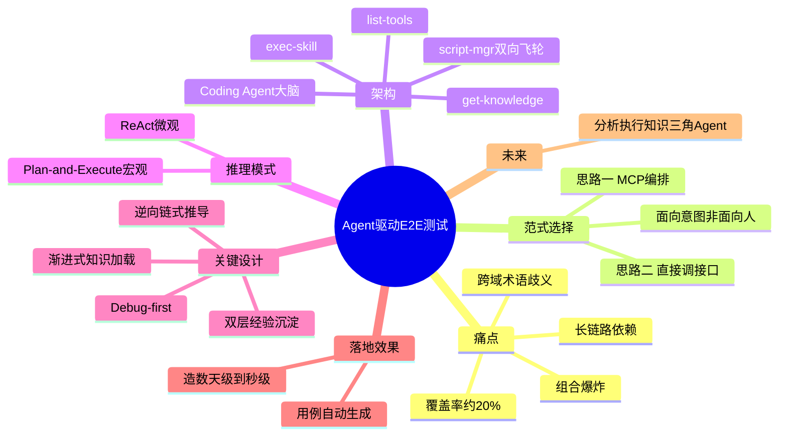
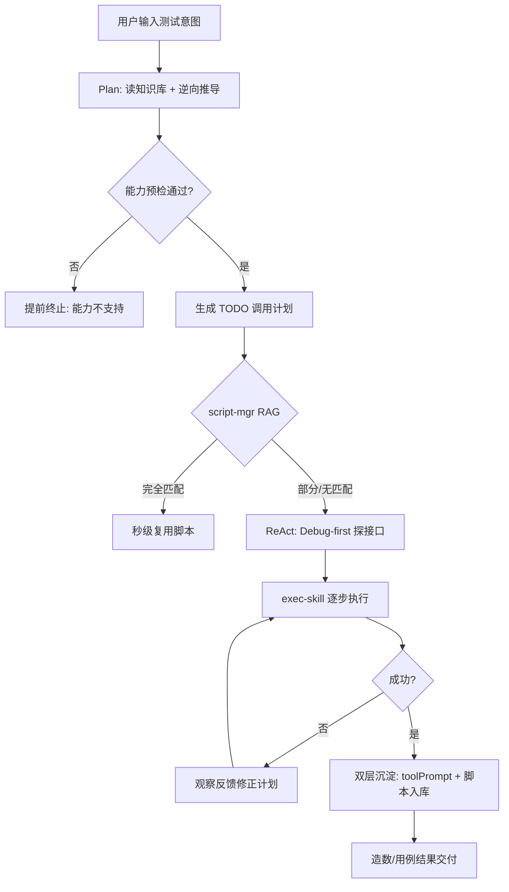

---
tags:
  - tech-article
  - AI
  - Agent
  - 测试自动化
  - Plan-and-Execute
  - ReAct
  - 工程化
created: 2026-06-23
category: 技术文章/AI
aliases:
  - 小红书Agent端到端测试
  - QECon Agent测试
  - 服务端E2E Agent
---

# Agent E2E 测试：小红书 QEcon 服务端端到端测试实践

> **原文链接**: [微信公众号原文](https://mp.weixin.qq.com/s/rYrrjxT6AP07VJzgmY0Ayg)

> **原标题**: 小红书QEcon分享回顾：Agent 驱动的服务端端到端测试

> **一句话总结**: 小红书面对端到端测试「跨域、长链路、组合爆炸」三大难题，放弃 MCP 封装+人工编排的主流路径，让 Agent 直接理解业务接口并动态规划；以 Plan-and-Execute + ReAct 混合模式、逆向链式推导、Debug-first 与双层经验沉淀，把造数从天级压到秒级。

> **前置知识检查**:
> - [ ] 了解测试金字塔与单元/集成/E2E 测试分层
> - [ ] 知道 ReAct、Plan-and-Execute 等 Agent 推理模式
> - [ ] 理解 MCP、Tool Calling 的基本概念
> - [ ] 有接口测试或测试数据构造经验

## 原文

**1.1 一个被忽视的信号：测试金字塔正在变成"橄榄型"**

近年来，自动化测试的分层模型出现了一个明显演变——从经典的金字塔型逐渐变为橄榄型：底部单元测试收窄，中部的集成测试与端到端测试不断膨胀。

这个形变并非偶然，它暴露了一个被长期忽视的事实：端到端测试的自动化成本太高。单元测试、接口测试的自动化率与覆盖率都能做得很好；唯独到了端到端这一层，大量用例至今仍依赖人工执行。若端到端的自动化成本足够低，这张图本应更接近"倒三角"。

因此，本文要回答的核心命题是：端到端测试的高成本究竟从何而来，又能否用 AI Agent 将其真正降下来。

**1.2 三个本质特征：跨域、长链路、组合爆炸**

端到端测试的难，可归结为三个相互叠加的特征。

- **跨域：**一笔订单横跨 5 个以上业务域，且同一术语在不同域中含义不同。例如"渠道"在商品域、交易域、营销域各有所指；"闪电退"与"极速退"流程迥异——前者免商家一审、买家直接寄回，后者更进一步省去商家二审。跨域工程师仅理解这些概念，就需反复对齐多个团队。

- **长链路：**测售后须先有订单，有订单须先有商品与店铺。链条上任何一环断裂，全流程即告失败。

- **组合爆炸：**商品类型 × 营销活动 × 订单状态，每增加一个变量，用例空间便指数级膨胀。

三者叠加，直接造成了端到端测试的现实困境：**手工造数耗时常达天级，自动化覆盖率长期停滞在 20% 以下。**

**1.3 传统工程化方案的天花板**

面对上述难题，最直接的思路是工程化：将服务端接口原子化封装，再以代码、DSL 或可视化方式编排流程，通过不同入参组合出不同用例。这套"原子能力 + 流程编排"方案在设计上覆盖了三大难题——接口统一管理以应对跨域，流程预先编排以贯通长链路，改入参即生成新用例以覆盖组合。然而落地后暴露出两个无法回避的问题：

- **维护成本高：**每个新接口都需按用例诉求重新封装，难以跟上迭代节奏；流程一变，整套编排随之重写；跨域的理解成本依然存在，只是从"口头对齐"变成了"代码对齐"。

- **灵活性受限：**该方案隐含一个前提——必须事先穷举所有场景才能编排覆盖。但业务带来的变化是不可预知的，预设永远滞后。最终只能稳定覆盖约 20% 的高频路径，其余依赖人工，且极易腐化。

剥开现象，根本矛盾：人工预制的编排逻辑是静态的、有限的；而真实业务的组合空间是动态的、无穷的。这一矛盾无法靠"更好的工具"消除，只能靠范式的转变。

端到端测试自动化，本质上只做一件事：**依据测试用例，按序调用各业务域接口，将跨域长链路串联起来，最终完成结果校验。**难点恰在"链路长、跨域多"使得人工预编排成本过高且必然腐化。借助 Agent 的自主推理、动态规划、工具调用三大能力，存在两条路径：

| _ | 思路一（主流） | 思路二（我们的选择） |
| --- | --- | --- |
| 做法 | 将接口封装为 MCP，由 AI 编排 | AI 直接感知业务接口、自主调用 |
| 本质 | 仍是"面向人"的编排 | "面向意图"的实时规划 |
| 局限 | 接口一变，封装层即重写 | —— |

我们坚定选择思路二。其判断依据是一条贯穿全局的原则：流程编排是"面向人"的思路。在 AI 时代，应当让 Agent 直接理解意图、自主调用。人只描述"测什么"，Agent 负责"怎么测"。

沿这条路线，这个直接对接业务接口的 Agent 必须具备两项核心能力：

- **动态规划：**给定测试意图，自主推理出所需前置条件、依赖的业务域、接口的调用顺序，实时推导出完整执行链路，无需任何预设；

- **自适应执行：**基于接口语义描述理解能力边界，而非硬编码调用链。有可复用脚本则秒级复用，无则调试后生成；接口或场景变更时自动适配，维护成本由"整套重写"降为"改一行描述"。

**2.1 整体架构：一个大脑，四个工具**

整体架构可分三层理解。

- **用户入口：**用户通过 IDE 插件、企微机器人或 Web 页面输入测试用例或意图；

- **核心大脑（Coding Agent）：**推理中枢。但裸模型对业务一无所知，必须为其装配能力；

- **四个工具能力：**

**a.知识库查询（get-knowledge）**——理解业务规则与跨域依赖；

**b.脚本管理（script-mgr）**——执行前 RAG 检索历史脚本、命中即秒级复用，执行后生成新脚本入库，同一通道双向流动；

**c.工具列表查询（list-tools）**——获知可调用的内部接口；

**d.工具执行（exec-skill）**——真正发起调用，跨越 SIT/BETA 等多套环境完成测试步骤。

其中**双向脚本通道是整个系统的飞轮核心：**用得越多，脚本沉淀越多；脚本越多，召回命中率越高；命中率越高，执行越快。架构的本质，是**把大模型的推理能力与公司内部复杂的业务系统无缝连接起来。**

架构决定了 Agent "用什么"，思考模式决定了它"怎么想"。我们采用 **Plan-and-Execute 与 ReAct 的混合模式：**

- **宏观（Plan-and-Execute）**：接到任务后先做全局规划——读知识库、理解依赖，再从最终目标逆向推导出完整依赖链，生成有序 TODO List。方向先于行动。

- **微观（ReAct）**：执行每一步时持续"推理 → 行动 → 观察 → 再推理"。接口未通则换参重试，依赖缺失则回退修正计划，无脚本则触发调试探索。

**Plan-and-Execute 保证方向不跑偏，ReAct 保证执行有韧性。**二者结合，使 Agent 既能驾驭复杂长链路，又能灵活应对执行中的意外——它既是运筹帷幄的测试设计者，也是冲锋陷阵的测试执行者。

通用 Coding Agent 具备推理与工具调用能力，但**它并不会做测试：**它不知道"纠纷单"等同于"平台介入"，不知道买手分账须先建合约，也没有接口 Schema 来判断调用顺序。让它真正学会做测试，需要解决两个核心问题：

- **懂业务**——能否推导出可执行的测试计划？

- **写好脚本**——能否产出正确、可复用、可自验证的脚本？

下面讲一下这里面关键的几个设计

- 看懂业务：逆向链式推导 + 知识库渐进式加载方案

- 写好脚本：Debug-first + 历史经验复用

**3.1 逆向链式推导**

**逆向链式推导的核心逻辑：**从测试目标反向倒推依赖，直到所有入参都有来源

**第一步，意图三元组拆解。**将需求结构化为：

- **Actions：**Execute（下单/支付/发货/收货结算）、Verify（分账金额）；

- **Entities：**买手分账订单；

- **Attributes：**商品=关联买手合约、分账比例=约定比例、订单状态=流转完整。

**第二步，迭代式逆向推导（核心环节）**，内含三个动作：

- **加载：**从实体与属性出发，逐轮按需加载业务域知识与工具——首轮加载交易、买手、账号，发现合约依赖商品后追加商品、履约、结算域，直至无新依赖；

- **能力预检：**双维度对账——每个动作是否有对应接口？每个属性约束是否有入参字段支撑（如分账比例对应 settlement_query 的 ratio 字段）？**若需求是"构造一个红色的杯子"而接口无颜色字段、知识库亦无相关说明，Agent 会在此直接判定"能力不支持"并提前终止——早发现远比晚失败代价小。**

- **深度依赖构建：**逐级倒推每个接口入参的来源（订单 ← 合约 ← 买手计划 ← 买手账号；订单 ← 商品 ← 店铺；订单 ← 买家账号），形成闭环依赖树。**整个推导基于知识库规则动态生成，业务变更后重新推导即自动更新，无需人工预设。**

**第三步，生成调用计划。**将依赖树反转排序输出：前置构造 → 链路执行 → 结果验证。**至此一行脚本尚未编写，但每一步调用什么、入参从哪来、顺序如何排，已全部确定。**

**3.2 知识库渐进式加载**

Agent 的"业务大脑"来自一个**按业务线与子域组织的目录树知识库。**每个子域固定包含两类配套内容：

- **knowledge.md：**业务介绍、业务流程、数据依赖、名词解释；

- **tool_list：**该子域可用工具的名称与描述。

为何否决 RAG，改用渐进式加载？否决 RAG 基于两点：

- **场景不匹配：**RAG 擅长海量、无边界、需语义检索的非结构化语料；而测试所依赖的业务知识库文档有限、结构固定、按子域天然隔离，本不需要语义搜索。引入 RAG 是"杀鸡用牛刀"，徒增切片与向量化成本。

- **召回不准的代价过高：**一般问答漏召可二次追问；但在规划阶段，一旦召回错误片段，生成的执行计划即出现偏差，且**无法中途纠正、只能整体重跑。**叠加 RAG 跨片段逻辑理解偏弱，在此场景容错空间几乎为零。

**渐进式加载**则与逆向推导天然契合：从目标子域出发，发现依赖即追加加载，沿依赖链逐层推进直至闭合。以买手分账订单为例，加载路径为"交易域 → 买手域 → 商品域 → 账号域"。每次仅加载当前所需，**结构完整、噪声低**

**3.3 Debug-first，先调通再动笔**

脚本生成的最大难题是参数不确定性。传统做法让 Agent 依据文档猜参数后反复试错，单个脚本可能循环十余轮，每轮都是一次 Agent 调用，成本与时间全耗在"猜"上。Debug-first 反其道而行：Agent 先通过 CLI 探索接口——传参、观察返回、确认必填字段与有效枚举，并将真实 Input/Output 完整留存于上下文。由此带来两个收益：

- **从"猜"变为"照做"：**握有第一手调试记录，脚本一次成功率大幅提升；

- **修复极快：**异常时直接对照历史记录定位问题（参数错误抑或前置数据缺失），无需重新摸索。

这一思路本质上是工程师习惯的迁移——调接口时先用 Postman 试通再写代码，且历史记录始终在侧。Debug-first 把这一习惯完整赋予了 Agent。

**3.4 双层经验沉淀，构建自进化飞轮**

脚本生成的一次性成功率，极大取决于 Agent 对接口与链路的经验认知。将成功经验固化为两层资产，可以使 Agent"越用越准、越用越快"。我们将经验沉淀分为两层：

- **工具级——调试经验写回工具定义。**Debug 过程中发现的"隐性坑"（如 price 单位为"分"非"元"、标注"选填"实则必传、文档未列的有效枚举）统一写回工具的 toolPrompt，下次调用自动携带、直接绕坑。典型案例：下单返回 order_id 为 V1|P792227127394075001，而支付所需 oid 为 79222712739407500，二者存在 ID 转换逻辑；若不沉淀，每次都会在此失败。

- **链路级——成功链路沉淀为脚本。**成功执行后，整条调用链经 Agent 总结为脚本元信息（功能描述/入参 schema/适用场景），脚本入 Git、元信息入向量库。下次相似请求 RAG 召回有三种结果：**完全匹配**则直接复用（秒级）；**部分匹配**则借鉴其调用组合、局部补齐（如通用下单链路可直接复用于买手分账场景）；**无匹配**则走完整 Debug-first 流程，新经验再次入库。

**两层合一，形成自我优化闭环：每次成功执行都在为系统"喂经验"，让下一次执行起点更高、成功率更高。**

**4.1 数据构造：从天级到秒级**

数据构造是端到端测试的前置依赖，故率先落地。流程与第三部分一致——读知识库、逆向推导、串联链路；区别仅在于无可用脚本时，Debug 完成后数据直接交付，脚本生成主要服务于后续复用。能力已接入内部研发助手平台，用户可在 IDE 插件与 Web 端用自然语言下达指令。

| 场景 | 改善前 | 改善后 |
| --- | --- | --- |
| 跨域数据构造（如买手分账订单） | 小时级（摇人协作） | 分钟级（Agent 动态规划串联） |
| 常见场景（脚本已沉淀） | 分钟级 | 秒级（RAG 命中，几十秒完成） |
| 新业务域接入 | 天级（写代码封装） | 分钟级（Skill 自动解析接口，无需手动封装） |

业务同学还自发探索出"批量造数"玩法，将重复场景批量交由 Agent 处理。接口接入成本也大幅下降：以往接入一个业务域需编码封装原子工具，如今只需告知 Agent "从该代码库导入接口"，1~2 分钟即可完成解析与注册。

**案例**

- 自然语言需求理解，未命中脚本

2. 造数计划生成

3. 执行造数

4. 造数结果

**4.2 用例生成：从"会调接口"到"会做校验"**

第二个落地场景是自动化用例生成。给定一份测试同学日常撰写的用例描述（如笔记删除处置，含操作步骤、测试项、预期结果），Agent 自动产出可执行脚本。

- 用例需求分析 & 计划

2. 生成计划

3. 脚本召回：匹配脚本直接执行；相似脚本，参考编写

4. 测试完成，结果汇总

本文从端到端测试的三大痛点（跨域、长链路、组合爆炸）出发，给出了一套以 AI Agent 破局的方案。其核心是三个能力环的逐步演进：

- **动态规划**——Agent 自主规划、逆向推导依赖链，告别流程硬编码；

- **知识库**——业务知识结构化沉淀，跨域零壁垒，造数从数小时压至分钟级；

- **脚本沉淀**——成功经验自动入库、RAG 秒级召回，越用越强。

三者并非一次性工程，而是持续演进的飞轮。

当前方案仍以"人工说清测试意图"为前提。下一步，我们希望将"分析"环节也交给 Agent，形成三角协同：

- **测试分析 Agent**——读 PRD、理解需求变更、产出测试策略；

- **测试执行 Agent**——接收策略、编写脚本、执行验证；

- **知识管理 Agent**——驱动一套"活知识库"，持续汇聚需求文档、交互设计、技术文档、代码、线上流量、历史用例与 Bug。

这套知识库的价值将不止于测试——它最终可能成为整个工程效能平台的底座。测试，也将由研发末端的补丁，真正融入完整的研发过程。

小红书质效研发部，肩负着以 AI 重构公司级下一代研发体系的使命。我们希望基于 AI 技术，打造全新版本的研发工具，结合 LLM 辅助、LLM 原生能力，串联从需求理解到发布部署的全流程，为小红书的技术团队提供业界顶尖的"武器装备"；同时希望通过这些"武器装备"，让每一位小红书的研发人，都有机会成为 AI Native 时代下的"超级个体"。

AI Coding 团队，专注于 AI Coding 与 GUI 智能化方向的技术攻坚与规模化落地。核心方向有：

● GUI Agent 执行引擎与 Coding Agent 架构

● AI Testing

● 分层知识库与路径引导系统

● AI Coding harness 与解决方案

我们正在寻找对 AI Agent、智能化测试、GUI 自动化方向有热情的同学。如果你做过 Agent 工程化、LLM 基础设施，或者想把 LLM 真正落地到具体业务，来聊聊。

📮 **内推简历投递：**

**wangruiwen1@xiaohongshu.com，Agent 研发/产品/算法岗位，社招、实习生均可投递。**

> **图片说明**: 原文 31 张配图位于 assets/Agent E2E测试-小红书QEcon服务端端到端测试实践/，微信 CDN 原链可能过期。

---

## 核心概念脑图

## 与你已有知识的关联

**《[[大厂技术文章-DailyTech/文章/告警排查Agent-得物LLM Agent重构告警流程|告警排查Agent]]》**：得物用 ReAct + 动态策略组装做运维排查；小红书同样采用 ReAct 微观执行，但场景换成跨域 E2E 测试，且强调 Plan-and-Execute 宏观规划与逆向依赖推导。

**《[[大厂技术文章-DailyTech/文章/verify-data一个端到端的数据验数Agent Skill|数据验数Agent]]》**：verify-data 聚焦 SQL 验数红线；本文数据构造场景与之同属「测试数据/结果自动化」赛道，但本文覆盖更长的跨域业务链路而非单表验数。

**《[[大厂技术文章-DailyTech/文章/业务需求专家Agent-端到端搭建指南|业务需求专家Agent]]》**：该文四层架构强调纵向闭环；本文「测试分析 → 执行 → 知识管理」三角 Agent 愿景是同一「端到端 Agent 化」思路在质效领域的延伸。

**《[[大厂技术文章-DailyTech/文章/Function Calling与MCP-Skills本质差异与最佳实践|MCP与Skills差异]]》**：该文辨析 MCP 封装边界；本文明确**拒绝**「接口封装为 MCP 再编排」的主流路径，认为多一层封装即多一层腐化，应让 Agent 直接 exec-skill 调业务接口。

**《[[大厂技术文章-DailyTech/文章/Harness工程化-五层架构与门禁阻断实践|Harness实践]]》**：小红书 AI Coding 团队明确将「AI Coding harness」列为核心方向；本文 script-mgr 飞轮、能力预检、Debug-first 均是 Harness 纪律在测试域的具体化。

## 重难点理解

- **重点/难点1**: 为何不用 RAG 加载业务知识 — 测试知识库**有限、结构化、按子域隔离**；规划阶段召回错误无法中途纠正，只能整链重跑。渐进式按依赖链加载比语义检索更可靠。

- **重点/难点2**: 逆向链式推导 — 从测试目标反推 Actions/Entities/Attributes 三元组，再迭代加载域知识、能力预检、构建依赖树，最后反转成调用计划。这是「动态规划」的核心算法化表达。

- **重点/难点3**: Debug-first vs 猜参数 — 传统 Agent 写脚本靠文档猜参，易十轮以上失败；先 CLI 探路保留真实 I/O，脚本一次成功率与排障速度大幅提升。

- **重点/难点4**: 双层沉淀飞轮 — 工具级（toolPrompt 写回隐性坑）+ 链路级（脚本 Git + 向量元信息）；script-mgr 执行前 RAG 命中则秒级，未命中则 Debug-first 后再入库。

## 原文内容流程图

## 经验

1. **面向意图而非面向编排**: 人只说「测什么」，Agent 负责「怎么测」——静态 DSL 编排必然落后于业务组合空间 — **应用场景**: 跨域 E2E、高频变更业务。

2. **规划阶段禁用不可靠 RAG**: 结构化、有限域知识用目录树渐进加载；RAG 留给脚本元信息召回 — **应用场景**: 强正确性要求的 Agent 规划。

3. **能力预检提前失败**: 需求字段在接口与知识库均不存在时，规划阶段即终止 — **应用场景**: 避免长链路执行到一半才发现「测不了」。

4. **Debug-first 迁移工程师习惯**: Postman 试通再写代码 → Agent CLI 探路再生成脚本 — **应用场景**: 参数复杂、文档不全的内部接口。

5. **script-mgr 双向飞轮**: 执行前检索、执行后入库，用得越多越快 — **应用场景**: 重复造数、相似用例批量生成。

## 知识

| 知识点 | 定义 | 关键要素 | 关联概念 |
|-------|------|---------|---------|
| 测试橄榄型 | 金字塔中间 E2E 层膨胀 | E2E 自动化成本高 | 测试金字塔 |
| 思路二（直接调接口） | Agent 感知业务接口自主调用 | 动态规划、自适应执行 | MCP 编排对比 |
| 逆向链式推导 | 从目标反推依赖至入参闭环 | 三元组、能力预检、依赖树 | Plan-and-Execute |
| 渐进式知识加载 | 沿依赖链按需加载子域 knowledge | 否决规划期 RAG | 结构化知识库 |
| Debug-first | 先 CLI 调试再写脚本 | 真实 I/O 留存 | ReAct |
| 双层经验沉淀 | toolPrompt + 脚本向量库 | 工具级绕坑、链路级复用 | 自进化飞轮 |

## 可复用建议

1. **评估是否值得上 Agent E2E**: 若痛点是跨域+长链路+组合爆炸且编排维护成本已触顶，可考虑「直接调接口」路径 — **适用场景**: 服务端 E2E、造数 — **预期效果**: 新业务域接入从「天级封装」到「分钟级 Skill 导入」。

2. **知识库按子域目录树组织**: 每域 knowledge.md + tool_list，规划时渐进加载而非一把 RAG — **适用场景**: 有限结构化领域知识 — **预期效果**: 降低规划阶段召回错误导致的整链重跑。

3. **引入能力预检门禁**: 规划输出前校验每个 Action 有接口、每个 Attribute 有字段 — **适用场景**: 复杂约束测试意图 — **预期效果**: 早发现「测不了」，节省执行成本。

4. **script-mgr 双向通道**: 执行前向量检索脚本，执行后成功链路自动入库 — **适用场景**: 高频重复造数 — **预期效果**: 常见场景从分钟级到秒级。

## 实施办法

1. **第1步**: 梳理 E2E 痛点是否命中跨域/长链路/组合爆炸，评估现有原子封装+编排方案的维护与覆盖率天花板。

2. **第2步**: 搭建子域目录树知识库（knowledge.md + tool_list），接入 list-tools / exec-skill 四类工具能力。

3. **第3步**: 实现 Plan-and-Execute + ReAct 混合推理，核心规划逻辑采用逆向链式推导 + 能力预检。

4. **第4步**: 落地 Debug-first 与双层沉淀（toolPrompt 写回 + 脚本 Git/向量库），打通 script-mgr 飞轮。

5. **第5步**: 优先落地数据构造场景验证 ROI，再扩展到用例生成；远期规划测试分析/执行/知识管理三角 Agent。
