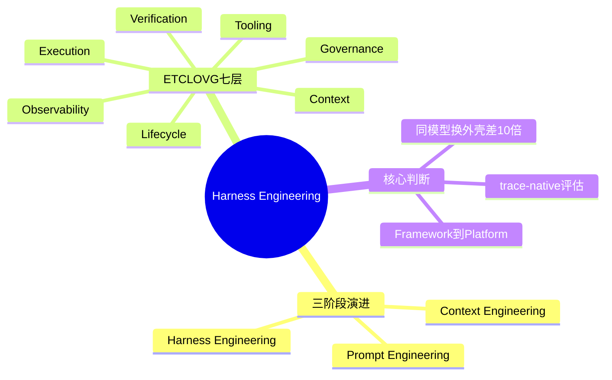
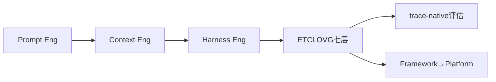

---
tags:
  - tech-article
  - Harness
  - Agent架构
  - ETCLOVG
  - 综述
  - 可观测性
created: 2026-05-27
category: 技术文章/AI
aliases:
  - Agent Harness综述
  - ETCLOVG
  - Harness Engineering
source: https://mp.weixin.qq.com/s/pG39PRnZFjSIxwYcPKD47A
author: Datawhale（译介 CMU/Yale/JHU 等论文）
---

# Agent Harness Engineering：ETCLOVG 七层框架综述

> **原文链接**: [微信公众号](https://mp.weixin.qq.com/s/pG39PRnZFjSIxwYcPKD47A)

> **原标题**: 刚刚，一篇最全Agent Harness综述来了！

> **论文主页**: [Agent Harness Engineering: A Survey](https://picrew.github.io/LLM-Harness/)

> **一句话总结**: CMU 等 71 页综述：Agent 工程从 Prompt → Context → Harness 三阶段演进；ETCLOVG 七层（执行、工具、上下文、生命周期、可观测、验证、治理）+ trace-native 评估，竞争在模型外的工程外壳。

> **前置知识检查**:
> - [ ] 区分 Prompt / Context / Harness Engineering
> - [ ] 了解 Agent benchmark 与 pass rate 局限

## 原文

# 
 Datawhale干货 

**最新：Agent Harness
**

分享目前看到最系统、也最工程化的一篇 Agent Harness 综述，CMU、Yale、JHU、Virginia Tech、Amazon 等联合出品：《Agent Harness Engineering: A Survey》。


论文主页地址：https://picrew.github.io/LLM-Harness/

这篇论文把 Agent 真正跑起来时，包在模型外面的那层工程系统讲透了。

它用 ETCLOVG 七层框架拆解 Agent Harness，覆盖执行环境、工具接口、上下文管理、生命周期编排、可观测性、验证评估和安全治理。同时梳理了 170+ 个开源 Agent Harness 项目，串起从 Prompt Engineering、Context Engineering 到 Harness Engineering 的工程演进。

我们在不改变原意的情况下，做了如下整理。
光换模型，可能不是 Agent 最有效的升级
论文开头就提出了一个判断：学术界长期把 Agent 研究重点放在模型上。

模型能不能规划？能不能调用工具？能不能记住上下文？能不能和其他 Agent 协作？这些当然重要。

但问题是，当 Agent 开始进入长任务、真工具、真实环境之后，失败往往不是因为模型“不够聪明”，而是因为系统没把它管好。

论文列了几组结果：有研究只改了编辑工具格式和周边 harness，不改模型本身，编码 benchmark 上最高带来 10 倍提升。还有一个固定的 GPT-5.2-Codex Agent，通过重构系统 prompt、加入中间件上下文注入、自验证 hooks，在 Terminal-Bench 2.0 上从 52.8% 提升到 66.5%。Meta-Harness 则通过自动优化 harness，在 Terminal-Bench-2 上做到 76.4%，超过手工设计方案。

这些数字当然还要看具体实验设置，但它们指向同一个现象：

- 

```
同一个模型，换一套执行外壳，表现可以完全不一样。
```

很多团队还在把问题归因于“模型不够强”。真实情况可能是：模型已经够强了，是你的工具接口、上下文、沙箱、验证和权限系统太弱。

Agent 工程经历了三次迁移

这篇综述有一个很适合中文读者理解的框架：Agent 工程从 2022 到 2026，大概经历了三个阶段。


第一阶段是 Prompt Engineering。那时大家主要卷提示词。怎么写 system prompt，怎么放 few-shot，怎么让模型按步骤推理。工程对象很窄，就是把一段输入文本调好。

第二阶段是 Context Engineering。Agent 开始跑更长的任务后，问题变成：模型每一步到底该看见什么？不是所有资料都塞进去，而是要决定哪些信息该进上下文，哪些记忆要检索，哪些工具结果要压缩，窗口满了怎么办，长期任务中哪些状态要保留。

第三阶段，就是 Harness Engineering。当模型已经能处理更复杂任务时，瓶颈转到模型外部：谁来维护状态？谁来调工具？谁来限制权限？谁来注入反馈？谁来验证进度？谁来记录 trace？谁来在失败后恢复？

Prompt Engineering 解决的是“怎么跟模型说话”。Context Engineering 解决的是“模型该看见什么”。Harness Engineering 解决的是“怎么让模型在真实世界里可靠干活”。

一个 Harness 到底包括什么？

论文提出了一个七层分类，叫 ETCLOVG。名字有点拗口，但拆开看很实用。


- 
Execution：执行环境。Agent 在哪里跑？本地、容器、浏览器、桌面、远程沙箱？边界在哪里？

- 
Tooling：工具接口。工具怎么描述，怎么发现，怎么调用，怎么防止模型乱选工具？

- 
Context：上下文和记忆。短期上下文、会话状态、长期记忆怎么管理？

- 
Lifecycle：生命周期和编排。一个 Agent 是单轮执行，还是多轮循环？是一个 Agent 干到底，还是 planner、executor、reviewer 分工？

- 
Observability：可观测性。每次模型调用、工具调用、检索、报错、重试、token 成本、延迟，都要能追踪。

- 
Verification：验证和评估。结果对不对？失败到底是模型错了、工具错了、上下文错了，还是测试环境错了？

- 
Governance：治理和安全。Agent 有什么权限？能不能发邮件、改代码、调 API、读私有数据？谁来审批？谁来审计？

这七层合在

> **图片说明**: 配图 6 张位于 `assets/Agent Harness Engineering-ETCLOVG七层框架综述/`。

---
## 核心概念脑图



## 与你已有知识的关联

**《[[Multi-Agent Harness-生产级架构评估记忆成本与MCP接入|Multi-Agent Harness 生产拆解]]》**：本文学术七层框架；该文是腾讯云生产五模块实践，可对照 ETCLOVG 填具体实现。

**《[[Harness工程化-五层架构与门禁阻断实践|Harness 五层架构]]》**：国内 Harness 门禁实践落在 Lifecycle + Verification + Governance 层。

**《[[Token成本控制-AI Coding Agent五层优化框架|Token 成本]]》**：Context 层压缩与 Budget 策略；综述强调 harness coupling——改一层影响全局。

**《[[Claude Code记忆系统-得物自我进化与Hook观测实践|Hook 观测]]》**：Observability 层实例；Agent 行动后必须知道「做了什么、允许做什么」。

**《[[OpenClaw与Hermes-AI Agent架构源码复盘|OpenClaw/Hermes 复盘]]》**：Platform 级 durable workspace、sandbox、治理闭环与综述「Framework → Platform」趋势一致。

## 重难点理解

- **重点1**: 三阶段迁移 — Prompt 怎么说话 → Context 看见什么 → Harness 怎么可靠干活；长任务失败常因系统没管好模型。
- **重点2**: ETCLOVG 七层缺一不可 — 工具调用只是 Tooling 一层；缺 Observability/Governance 只能 demo 不能上线。
- **难点1**: trace-native 评估 — 记录全轨迹判结果、路径、评估器可信度；防重试刷分、过程不合规。
- **难点2**: harness coupling — 工具描述占上下文、沙箱影响 Eval；局部优化可能改变全系统行为。
- **误区**: 只换更强模型 — 论文案例：仅改 harness 格式可达 10×；GPT-5.2-Codex 同模型 52.8%→66.5%。

## 原文内容流程图



## 经验

1. **同模型对比 harness**: 优化前先固定模型测外壳 — **应用场景**: 团队归因失败 — **预期效果**: 避免误判为「模型不够强」。
2. **Observability+Governance 独立成层**: 不是 logging 附属 — **应用场景**: 生产 Agent — **预期效果**: 失败可定位、成功敢用。
3. **会删控制**: 模型变强后去掉过时 reset/verifier — **应用场景**: harness 维护 — **预期效果**: 降成本不损质量（Anthropic 长任务案例）。

## 知识

| 知识点 | 定义 | 关键要素 | 关联概念 |
| --- | --- | --- | --- |
| ETCLOVG | Agent Harness 七层分类 | Execution~Governance | 生产架构 |
| Harness Engineering | 模型外工程外壳 | 状态、工具、权限、验证、trace | Context Eng 下一阶段 |
| trace-native Eval | 以完整执行轨迹为评估对象 | 工具调用、重试、成本 | Trajectory Eval |
| harness coupling | 各层相互影响 | 工具占窗口、沙箱影响 benchmark | 系统思维 |
| Agent Platform | 超越 framework 的完整生产系统 | sandbox、identity、billing、HITL | 商业竞争 |

## 可复用建议

1. **用七层做架构评审表**: 每层打勾/缺口 — **适用场景**: 方案设计 — **预期效果**: 发现「只有模型+工具」的 demo 架构。
2. **建立 trace 标准字段**: 模型输出、工具返回、上下文快照、token、延迟 — **适用场景**: 评估流水线 — **预期效果**: 从排行榜回到质量控制。
3. **读论文 + 读生产文**: 综述 + [[Multi-Agent Harness-生产级架构评估记忆成本与MCP接入]] — **适用场景**: 学习路径 — **预期效果**: 理论框架落地对照。

## 实施办法

1. **第1步**: 打开 [论文主页](https://picrew.github.io/LLM-Harness/) 对照 ETCLOVG 给现有 Agent 打分。
2. **第2步**: 选一层最短板（多为 Observability 或 Verification）做最小补齐。
3. **第3步**: 固定模型做 harness A/B，记录 pass rate 与 trace 差异。
