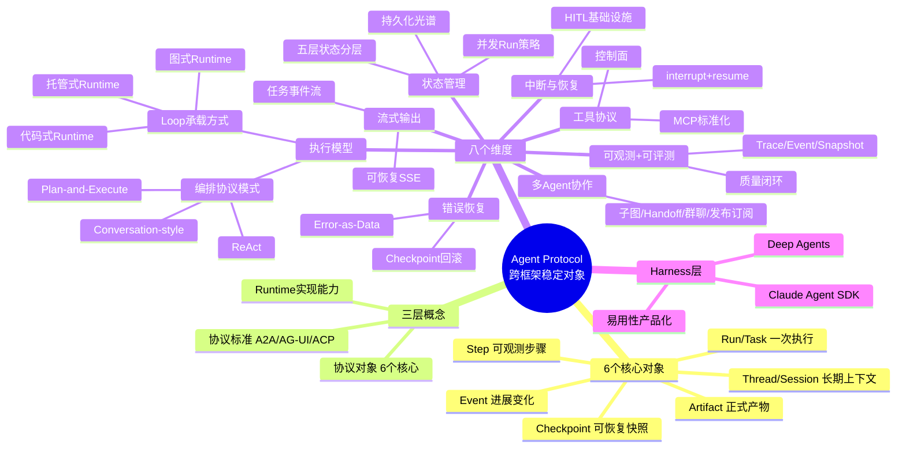
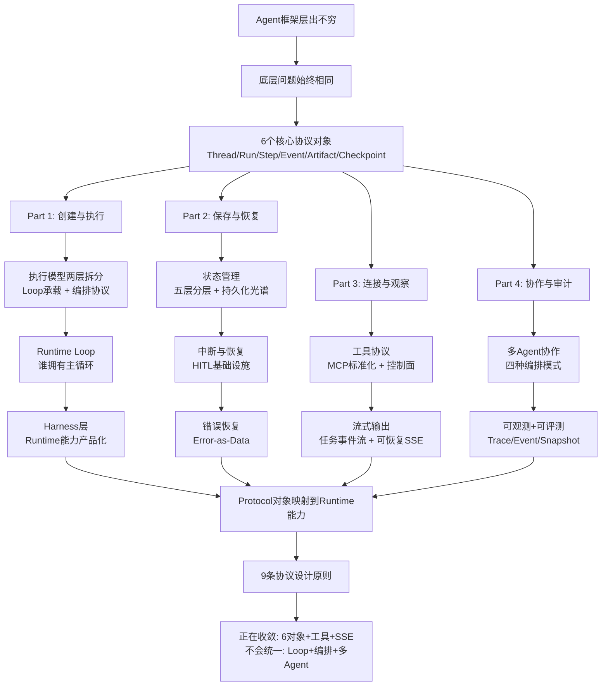

---
tags:
  - tech-article
  - AI
  - AgentProtocol
  - AgentRuntime
  - LangGraph
  - 状态管理
  - 执行模型
created: 2026-07-02
category: 技术文章/AI
aliases:
  - Agent Protocol
  - 跨框架稳定对象
  - Agent Runtime设计
  - 不变的Agent Protocol
---

# Agent Protocol：跨框架稳定对象与Runtime设计

> **原文链接**: https://mp.weixin.qq.com/s/0N-RnpGVy_PLSDHMwAIFNg

> **原标题**: 相比层出不穷的 Agent 框架，不变的 Agent Protocol 是什么

> **一句话总结**: Agent 框架名词在变，但 Thread/Run/Step/Event/Artifact/Checkpoint 六个对象是跨框架的稳定边界——理解这组协议对象比学任何具体框架 API 更值得投入。

> **前置知识检查**:
> - [ ] 了解至少一个 Agent 框架（LangGraph、OpenAI Assistants、AutoGen 等）
> - [ ] 理解 LLM 应用中的"工具调用"和"多轮对话"概念
> - [ ] 对 Agent Runtime 和 Agent 编排有基本认知

## 原文

Agent 框架层出不穷，到底哪个值得长期投入？

LangGraph 讲`Checkpoint`，OpenAI 讲`Thread`和`Run`，A2A讲`Task`，AG-UI 讲`Event`，Deep Agents 又引入`Todo`、`Subagent`和`Virtual Filesystem`。名字越来越多，API 越来越像一套套独立世界观。

*框架名词在变，但底层问题始终围绕任务、上下文、步骤、事件、状态和产物展开。*

**一个 Agent 任务，如何被启动、携带上下文、持续观测、中断恢复，以足够低的使用成本完成执行，并最终产生产物？**

**一个生产级 Agent Protocol 应该包括什么？为什么这些协议对象会比具体框架 API 更稳定？**

本文所说的 Agent Protocol 不是某一个具体标准，不等于 A2A、AG-UI、LangChain Agent Protocol 或任意单一规范；它指的是 Agent Runtime 对外暴露的一组稳定对象、生命周期操作和状态迁移。

核心观点：

- **Agent Runtime 的核心不是模型调用，而是任务生命周期管理**
- **Thread / Run / Step / Event / Artifact / Checkpoint 会成为跨框架的稳定对象**
- **执行模型不会统一：Runtime Loop 承载方式和编排协议会长期分层演进**
- **真正区分玩具 Agent 和生产 Agent 的，是状态持久化、中断恢复、可观测性和可评测性**
- **值得看的不是某个框架 API，而是协议边界和 Runtime 抽象**

### 6 个核心对象

| 对象 | 人话解释 | 它回答的问题 |
| --- | --- | --- |
| Thread / Session | 一段长期上下文 | 这是谁的哪段任务？ |
| Run / Task | 一次具体执行 | 这次具体跑了什么？ |
| Step | 执行中的一个可观测步骤 | 哪一步调用了模型、工具或子 Agent？ |
| Event | 执行过程中的进展变化 | 现在发生了什么？ |
| Artifact | Agent 产出的正式结果 | 结果在哪里，由哪次执行产生？ |
| Checkpoint | 可以恢复的执行快照 | 失败或中断后从哪里继续？ |

围绕这 6 个对象，生产级 Agent Protocol 至少还要表达 `stream / interrupt / resume / cancel / retry` 这些生命周期操作。

### 1. Agent Protocol 的边界

**1.1 三层概念**：

| 层级 | 例子 | 解决的问题 |
| --- | --- | --- |
| 具体协议标准 | A2A、AG-UI、LangChain Agent Protocol、AITP、ACP | 不同系统如何通信 |
| 通用协议对象 | Thread、Run、Step、Event、Artifact、Checkpoint | 外部世界如何理解一次 Agent 任务 |
| Runtime 实现能力 | 状态持久化、中断恢复、可恢复流、权限控制、可观测性 | Runtime 内部如何兑现这些对象 |

**Protocol 是 Runtime 的外部边界，Runtime 是 Protocol 的内部实现。**

**1.5 现有协议正在向同一组对象收敛**：

| 协议/规范 | 核心对象 | 主要关注点 |
| --- | --- | --- |
| LangChain Agent Protocol | Thread、Run、Store、Command | 框架无关 API 服务化 |
| A2A | Agent Card、Task、Message、Artifact | 独立 Agent 间互操作 |
| AITP | Thread、Actor、Capability | 跨信任边界交互 |
| AG-UI | Run event、Message event、State delta | Agent 与前端 UI 事件协议 |
| OpenAI Assistants | Assistant、Thread、Run、Run Step | 托管式 Agent 执行 |
| LangGraph Server API | Thread、Run、Stream Mode、State Update | 可恢复流和状态观测 |
| Deep Agents | Todo、Subagent task、Virtual filesystem | 复杂任务 Agent Harness |

### 2. 执行模型

**2.2 两层模型**：执行模型应拆成两层看：

- **Runtime Loop 承载方式**：图式 Runtime / 代码式 Runtime / 托管式 Runtime
- **编排协议模式**：ReAct / Plan-and-Execute / Conversation-style coordination


Runtime Loop 的拥有者决定了控制权和可观测性：

| 拥有者 | 代表 | 特点 |
| --- | --- | --- |
| 开发者拥有循环 | Responses API、Claude Client SDK | 灵活，但状态、重试都要自己写 |
| SDK 拥有循环 | OpenAI Agents SDK、Claude Agent SDK | 上手快，工具执行由 SDK 托管 |
| 图引擎拥有循环 | LangGraph | 循环被拆成节点、边、Checkpoint |
| 服务端拥有循环 | OpenAI Assistants | 最省心，但控制权最少 |

**判断一个框架是不是 Runtime，不要看它是否能调模型，而要看它是否拥有这个循环。**

**Harness** 是 Runtime 和 Framework 之间的层——把 Protocol/Runtime 能力产品化后的应用层。Deep Agents SDK 就是典型 Harness：基于 LangGraph runtime 封装 planning、todo、subagents、filesystem 等开箱即用的能力。


### 3. 状态管理：生产级 Agent 的分水岭

状态持久化从"进程内临时状态"到"服务端托管状态"形成一条光谱：


**状态分层——不要把所有东西都叫 Memory**：

| 层级 | 内容 | 主要问题 |
| --- | --- | --- |
| Conversation | 用户、模型、工具消息 | 上下文窗口、裁剪、摘要 |
| Run State | 当前执行的结构化变量 | 类型、Reducer、并发更新 |
| Checkpoint | 某步之后的完整可恢复状态 | 存储、版本、回滚 |
| Artifact | Agent 产出的外部结果 | 生命周期、权限、可追溯 |
| Semantic Memory | 跨会话沉淀的用户偏好或知识 | 检索、污染、遗忘 |


**并发 Run 策略**：

| 策略 | 行为 | 典型场景 |
| --- | --- | --- |
| 串行队列 | 同一 Thread 的 Run 按顺序排队 | 多轮对话、客服 |
| 拒绝新 Run | Thread 已有 Run 时返回 conflict | 后台任务、审批流 |
| 取消并覆盖 | 新 Run 取消旧 Run | 搜索、草稿生成 |
| 分叉新 Run | 从同一 Checkpoint 分叉多个 Run | A/B 测试、方案比较 |
| 乐观并发 | 提交时检查版本冲突 | 多 Agent 并行写不同 channel |

### 4. 中断与恢复：Human-in-the-Loop 的基础设施

中断/恢复不是独立的 ask-user API，而是"状态快照 + 中断载荷 + 恢复指令 + 权限上下文"的组合能力。

**关键约束**：真正的中断/恢复**需要状态持久化**。没有持久化的框架只能做同步"ask and wait"。

LangGraph 的方案最完整——`interrupt(payload)` + `Command(resume=value)` + Checkpoint 深度整合。


### 5. 错误恢复

两种错误哲学：

```
Error-as-Exception (传统)                Error-as-Data (Agent 原生)
工具调用 → 失败 → 抛异常               工具调用 → 失败 → 返回错误信息
                     ↓                                        ↓
              try/catch 处理                          LLM 看到错误信息
              决定重试/放弃                           LLM 自主决定下一步
```

**Error-as-Data 是更好的默认策略**——LLM 有足够推理能力处理工具错误。

### 6. 工具协议：最可能先标准化的一层

MCP 把工具发现、定义、调用、资源读取抽象成 Client/Server 协议，让外部能力从框架内部抽出来。

| MCP 对象 | 对应能力 | Runtime 意义 |
| --- | --- | --- |
| Tool | 工具定义、参数 schema、调用结果 | 统一 schema 暴露给 Agent |
| Resource | 可读取的上下文资源 | 文件、文档、数据库变成可发现上下文 |
| Prompt | 可复用提示模板 | 任务模板沉淀为可调用能力 |


### 7. 流式输出：任务事件流

生产级流式输出不是 token 打字机，而是状态、消息、工具、产物、错误和 Trace 组成的任务事件流。

LangGraph Platform 的可恢复流是目前唯一完整实现：Producer 持久化到 Redis Stream → Consumer 先 Catch-up 回放 → 再 Live Tail 实时。


### 8. 多 Agent 协作：最碎片化，最不该过早押注

四种编排模式：子图嵌套、Subagent task、Handoff 接力、群聊选择/发布-订阅。


### 9. 可观测性与可评测性

三类观测数据必须打通：

| 类型 | 解决的问题 | 示例 |
| --- | --- | --- |
| Trace | 为什么这次执行走到这里 | LLM 调用、工具调用、Handoff |
| Event Stream | 现在正在发生什么 | token、progress、custom event |
| State Snapshot | 当时系统处于什么状态 | checkpoint、messages |


### 10. Protocol 对象如何落到 Runtime 能力

| Protocol 对象/操作 | 外部契约 | Runtime 需要实现的能力 |
| --- | --- | --- |
| Agent Card / Metadata | 告诉别人我是谁、会什么 | 注册、能力描述、权限声明 |
| Thread / Context | 承载多轮上下文 | 会话管理、历史保存、参与者隔离 |
| Task / Run | 一次可管理的执行 | 调度、状态机、取消、超时、预算 |
| Step / Run Step | 内部可观测步骤 | LLM 调用、工具调用、Handoff 记录 |
| Event Stream | 进展增量 | SSE、Last-Event-ID、事件持久化 |
| Interrupt / Input Required | 需要人类继续 | Checkpoint、resume、审批 |
| Artifact | 任务产物 | 文件管理、版本、增量产出 |
| Trace / Span | 执行因果链 | 观测埋点、成本归因、审计 |

**9 条协议设计原则**：任务对象一等化、上下文对象一等化、步骤对象一等化、事件流标准化、产物对象一等化、中断是状态不是异常、发现与能力声明分离、协议绑定可替换、观测语义内建。

**最好的协议是低约束的，最好的 Runtime 是高内聚的。**

### 11. 跨维度分析

**正在收敛的**：Agent 任务对象、上下文对象、步骤对象、事件流(SSE)、产物对象、工具定义(JSON Schema)、错误处理(Error-as-Data)

**没有收敛的**：Runtime Loop 承载方式、编排协议模式、状态管理实现、多 Agent 协作、可观测性标准

**2 年内判断**：Agent Protocol 会先在 6 个核心对象上收敛，工具层继续标准化，流式层统一到 SSE + 可恢复流，但 Runtime Loop、编排协议和多 Agent 协作**不会统一**。


> **图片说明**: 配图位于 assets/Agent Protocol-跨框架稳定对象与Runtime设计/，CDN 可能过期

---

## 核心概念脑图



## 与你已有知识的关联

**《[[大厂技术文章-DailyTech/文章/Agent Harness Engineering-ETCLOVG七层框架综述|ETCLOVG七层框架]]》**：ETCLOVG 是 Harness 的系统化分层框架，本文从 Protocol 视角解释了 Harness 下面的 Runtime 能力——Harness 把 Runtime 能力产品化成默认可用的工作方式，Protocol 则定义这些能力的外部契约。

**《[[大厂技术文章-DailyTech/文章/AINative研发-Harness方法论与水流理论实践|AI Native研发Harness方法论]]》**：本文的 Protocol/Runtime 是基础设施层，那篇文章的水流理论是应用层——Protocol 定义 Agent 系统"能做什么"，水流理论定义人"怎么用它"。

**《[[大厂技术文章-DailyTech/文章/Loop Engineering-企业Agent落地四层演进与诊断框架|Loop Engineering四层演进]]》**：Loop Engineering 关注 Agent 自主循环的工程落地，本文的 Runtime Loop 承载方式（图式/代码式/托管式）是 Loop 的底层基础设施。

**《[[大厂技术文章-DailyTech/文章/Multi-Agent Harness-生产级架构评估记忆成本与MCP接入|Multi-Agent Harness]]》**：本文的多 Agent 协作章节（第8章）从协议视角分析了四种编排模式，那篇文章从 Harness 层面评估了生产级多 Agent 架构的记忆成本和 MCP 接入。

**《[[个人学习/LLM大模型类相关知识/LangGrash/LangGraph 企业级落地实战报告|LangGraph企业级落地]]》**：本文大量使用 LangGraph 作为框架对比的参照，LangGraph 的 Checkpoint 模型是目前最完整的状态管理方案，那篇文章是 LangGraph 的具体实战指南。

## 重难点理解

- **重点1**: 执行模型的两层拆分 — Loop 承载方式（图式/代码式/托管式）和编排协议模式（ReAct/Plan-and-Execute/Conversation）是两层不同的东西，不应放在同一层比较 — **误区**：把 Conversation 和 Graph/Code/Managed 放在同一层，制造误判
- **重点2**: 状态五层分层 — Conversation/Run State/Checkpoint/Artifact/Semantic Memory 是五种不同的"记忆"，很多框架说自己支持 Memory 实际只支持其中一层 — **误区**：把所有东西都叫 Memory，导致生产设计时选错方案
- **难点3**: 并发 Run 策略 — 同一 Thread 上多个 Run 同时发生时，有串行队列/拒绝/取消覆盖/分叉/乐观并发五种策略，各有适用场景 — **误区**：把 Thread 当成全局锁，实际上 Thread 承载上下文，Run 才是执行边界
- **难点4**: 中断/恢复需要状态持久化 — 没有持久化的框架只能做同步 ask-and-wait，进程退出后无法从断点继续 — **误区**：以为有个 ask-user API 就是 Human-in-the-Loop
- **难点5**: Error-as-Data vs Error-as-Exception — Agent Runtime 应默认把工具错误作为数据交给 LLM 处理，只有系统级故障才作为异常抛出 — **误区**：用传统 try/catch 思维处理 Agent 工具错误

## 原文内容流程图



## 经验

1. **看框架先看 Runtime Loop 归属**: 判断一个框架是不是 Runtime，不看它是否能调模型，看它是否拥有主循环 — **应用场景**: 评估任何新 Agent 框架时
2. **状态持久化是生产分水岭**: 没有持久化的 Agent 无法用于生产——无法恢复、无法 HITL、无法调试、无法回放 — **应用场景**: 选择 Agent 框架时的核心判断标准
3. **工具层最可能先标准化**: MCP 已经把工具发现/定义/调用从框架内部抽出来，一个 MCP Server 可以同时服务多个 Runtime — **应用场景**: 工具层投入优先于框架特定 API 学习
4. **多 Agent 不该过早押注**: 先把单 Agent 的 Thread/Run/State/Tool/Event/Artifact 做好，再引入必要的 Handoff 或 Subagent task — **应用场景**: 企业 Agent 系统建设路径规划
5. **Error-as-Data 改变编码方式**: 工具错误优先作为数据交给 LLM 处理，不默认打断执行 — **应用场景**: 编写 Agent 工具时的错误处理策略

## 知识

| 知识点 | 定义 | 关键要素 | 关联概念 |
|-------|------|---------|---------|
| Agent Protocol | Agent Runtime 对外暴露的稳定对象、生命周期操作和状态迁移 | 6个核心对象 + stream/interrupt/resume/cancel/retry | Runtime, Harness |
| Runtime Loop | Agent 的主循环：加载上下文→调模型→执行工具→判断继续或返回 | 谁拥有循环决定控制权和可观测性 | 图式/代码式/托管式 |
| 执行模型两层拆分 | Loop承载方式（容器层）+ 编排协议模式（语义层） | 不应把两层混在一起比较 | ReAct, Plan-and-Execute |
| 状态五层分层 | Conversation/Run State/Checkpoint/Artifact/Semantic Memory | 不同层解决不同问题，不要统称 Memory | 持久化光谱 |
| Checkpoint链式版本 | LangGraph 的每个节点自动快照，支持时间旅行和任意节点回滚 | 类 Git 的链式结构 | 状态持久化 |
| Error-as-Data | 工具错误作为数据返回给 LLM，由 LLM 自主决定下一步 | Agent 原生错误处理哲学 | Error-as-Exception |
| MCP | Model Context Protocol，工具发现/定义/调用/资源读取的 Client-Server 协议 | Tool/Resource/Prompt/Client/Server | 工具协议标准化 |
| 可恢复SSE | 基于 Last-Event-ID + Redis Stream 的断线恢复流式输出 | Producer持久化→Consumer Catch-up→Live Tail | LangGraph Platform |
| Harness | Protocol/Runtime 能力产品化后的应用层 | 把 Runtime 能力打包成默认可用的工作方式 | Deep Agents, Claude Agent SDK |
| 9条协议设计原则 | 任务/上下文/步骤/事件流/产物一等化 + 中断是状态 + 发现与能力分离 + 绑定可替换 + 观测内建 | 最好的协议是低约束的 | Runtime高内聚 |

## 可复用建议

1. **投入 Protocol 对象模型而非框架 API**: 重点理解 Thread/Run/Step/Artifact/Event/Checkpoint 这 6 个跨框架稳定对象 — **适用场景**: 技术选型和学习路径规划 — **预期效果**: 知识从"框架熟练度"提升到"系统设计判断力"
2. **工具层用 MCP 解耦**: 工具定义统一用 JSON Schema，工具接入走 MCP，不写框架特定的 Tool wrapper — **适用场景**: 构建 Agent 工具生态 — **预期效果**: 切换框架时工具层不用重写
3. **状态管理用 Checkpoint-based**: 自动 per-step 快照，支持中断恢复、错误回滚、调试回放 — **适用场景**: 生产级 Agent 系统 — **预期效果**: 长任务失败时不用从头重跑
4. **流式输出用 SSE + 可恢复**: 生产环境断线恢复是刚需，不要用 AsyncGenerator 凑合 — **适用场景**: 跨网络部署的 Agent 服务 — **预期效果**: 客户端断线后能补收事件
5. **多 Agent 从简到繁**: 先做好单 Agent 的 6 个核心对象，再引入 Handoff 或 Subagent task — **适用场景**: 企业 Agent 系统建设 — **预期效果**: 避免过早引入复杂拓扑带来的调试困难

## 实施办法

1. **第1步**: 建立 Protocol 概念模型——用 6 个核心对象（Thread/Run/Step/Event/Artifact/Checkpoint）作为审视任何 Agent 框架的标尺
2. **第2步**: 评估当前框架的 Runtime 能力——对照 8 个维度（执行模型/状态管理/中断恢复/错误恢复/工具协议/流式输出/多Agent/可观测性）做能力矩阵
3. **第3步**: 工具层标准化——工具定义统一 JSON Schema，接入层走 MCP，工具错误默认 Error-as-Data
4. **第4步**: 状态管理生产化——选择 Checkpoint-based 方案（如 LangGraph Checkpointer），确保中断恢复和错误回滚能力
5. **第5步**: 可观测性建设——Trace/Span 用 OpenTelemetry 标准，Event Stream 用 SSE，State Snapshot 与 Checkpoint 打通
