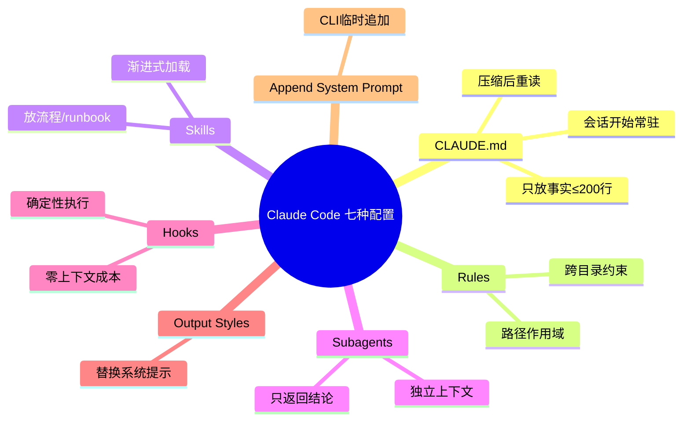
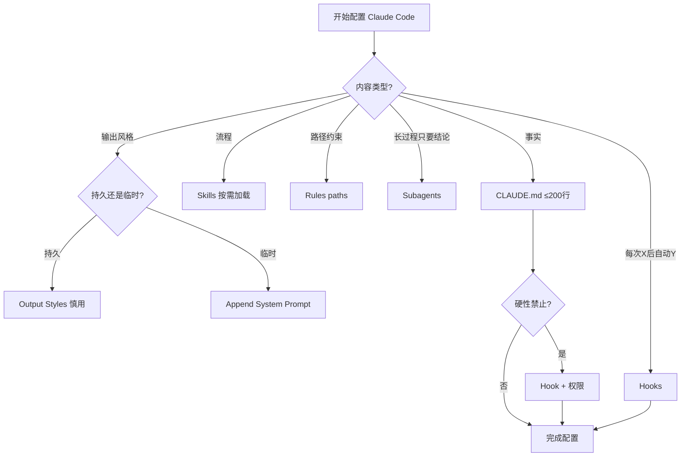

---
tags:
  - tech-article
  - AI
  - Claude-Code
  - Skills
  - Harness
  - Token
  - 工程化
created: 2026-06-25
category: 技术文章/AI
aliases:
  - Steering Claude Code
  - Claude Code七种配置
  - Claude Code调教方式
---

# Steering Claude Code：Claude Code 七种配置方式选型指南

> **原文链接**: [微信公众号原文](https://mp.weixin.qq.com/s/tCsmLdYPooAXPMGtWf-t_Q)

> **原标题**: Leader 考核实习生：“你怎么配置 Claude Code？” 我挠头：“多写 Skills？” 她摇头：“明天别来了！”

> **一句话总结**: Anthropic 官方博文《Steering Claude Code》揭示 Claude Code 七种配置方式（CLAUDE.md / Rules / Skills / Subagents / Hooks / Output Styles / Append System Prompt）的核心差异在于加载时机、压缩是否丢失、Token 占用——事实放 CLAUDE.md、流程放 Skills、确定性靠 Hooks，而非「多写 Skills」就能搞定。

> **前置知识检查**:
> - [ ] 了解 Claude Code 基本用法与斜杠命令
> - [ ] 知道 LLM 上下文窗口与 Token 计费概念
> - [ ] 理解 Agent 中「指令」与「确定性自动化」的区别
> - [ ] 有 Skills / Subagent / Hook 的基本概念

## 原文

大家好，我是程序员鱼皮。

最近 Anthropic 官方发了一篇博文，标题叫《Steering Claude Code》，把 Claude Code 的整套配置体系从底层逻辑到使用场景讲了个透。

由于是官方团队亲自写的，相当于出题人告诉你标准答案，因此整篇文章的干货价值非常高。

今天我结合官方内容加上我自己使用 Claude Code 的经验，给大家做一个完整的中文解读。

**原文指路**：https://claude.com/blog/steering-claude-code-skills-hooks-rules-subagents-and-more


## Claude Code 的调教方式

Claude Code 的调教方式共有 7 种：CLAUDE.md 文件、Rules 规则、Skills 技能、Subagents 子智能体、Hooks 钩子、Output Styles 输出风格，以及 Append System Prompt 系统提示词追加。

每种方式的核心区别在于 3 点：

- 什么时候加载到上下文
- 长对话压缩时会不会被丢掉
- 占用多少 token

如果你把指令放错了地方，AI 可能直接忽略掉你的指令，白白浪费 tokens。

接下来咱们挨个儿学习。


Claude Code 七种调教方式总览

## 1、CLAUDE.md - AI 的项目手册

CLAUDE.md 是放在项目根目录的 Markdown 文件，会话一开始就加载，全程常驻在上下文中。

那 CLAUDE.md 里适合放什么内容呢？

像构建命令、目录结构、代码规范、团队约定这些 AI 需要 **时刻记住** 的事实性信息。

CLAUDE.md 就像给新同事写的项目文档。你不需要每次都跟 AI 解释项目用的是什么技术、有什么规矩，只要写一次，之后都会生效。

CLAUDE.md 的加载分两种方式。

根目录的 CLAUDE.md 是始终加载的，压缩对话时也会重新读取，不会丢失。

子目录的 CLAUDE.md 比如 `app/api/CLAUDE.md`，只有当 Claude 读取该目录下的文件时才会加载，适合放只跟特定模块相关的约定。


CLAUDE.md 加载机制

官方明确建议，**CLAUDE.md 尽量控制在 200 行以内**。

原因很简单，CLAUDE.md 的每一行都占 token，不管当前任务会不会用到。

如果你塞了 500 行进去，哪怕做一个简单的前端样式调整，也得带着那些后端部署规范一起加载，纯属浪费。

所以记住一个原则就好：**CLAUDE.md 只放「事实」，不放「流程」。**


事实和流程对比

构建命令、技术栈、目录结构、命名规范是事实。部署流程、代码审查清单、发布步骤是流程，应该封装为 Skills。

## 2、Rules 规则 - 路径级的精准约束

Rules 是放在 `.claude/rules/` 目录下的 Markdown 文件，用来给 Claude 设定具体的约束或编码规范。

它最强大的地方在于支持路径作用域。你在规则文件的头部加一个 `paths` 字段，就能让这条规则只在 Claude 读取特定路径下的文件时才生效。

比如有一条规则是「所有 API 处理器必须使用 Zod 进行输入验证」，作用域设为 `src/api/**`。改前端页面时这条规则不会加载，不浪费 token。

```yaml
---
paths:
  - "src/api/**"
  - "**/*.handler.ts"
---
所有 API 处理器必须使用 Zod 进行输入验证。
```

什么时候该用 Rule，而不是子目录 CLAUDE.md 呢？

答案是：当一条规范需要跨目录生效的时候。比如所有 `.test.ts` 文件都要遵守某个测试规则，用路径作用域的 Rule 更合适。

## 3、Skills 技能 - 按需加载的工作流

Skills 放在 `.claude/skills/` 目录下，每个技能是一个文件夹，核心是一个 `SKILL.md` 描述文件。

Skills 的渐进式加载设计非常优雅。会话开始时，Claude 只会读取每个 Skill 的名称和简短描述，完整的技能内容只有在被触发时才加载到上下文中。


Skills渐进式加载设计

这意味着你可以定义几十个 Skills，但平时它们几乎不占 token。只有主动调用（如 `/code-review`）或 AI 自动匹配时才加载完整指令。

压缩对话时，已触发的 Skills 会按总预算重新注入，预算不够时最早触发的会被优先丢弃。一次会话里别触发太多 Skills，聚焦当前任务最重要。

## 4、Subagents 子智能体 - 隔离的独立助手

Subagents 放在 `.claude/agents/` 目录下，每个文件定义一个独立的 AI 助手。

跟 Skills 最大的区别在于，Subagent 运行在自己独立的上下文窗口里，只有最终结果会返回给主会话。


Subagents 隔离上下文运行机制

适合深度搜索代码库、分析日志、依赖审计等中间过程可能产生几万 token 的任务。Subagent 最多嵌套 5 层，配合动态工作流可编排上百 Agent 并行。

Skills 和 Subagents 怎么选？想看到过程并随时干预 → Skill；只要结论、不想被中间信息干扰 → Subagent。

## 5、Hooks 钩子 - 确定性的自动化

Hooks 是 7 种方式里最特殊的一个。CLAUDE.md、Rules、Skills 本质是给 AI 的「建议」，AI 可能遵循也可能不遵循。

但 Hooks 是自动化代码。**到了触发条件就一定会执行**，不需要 AI 决定。

Hooks 通过 `settings.json` 注册，绑定生命周期事件：PreToolUse、PostToolUse、PreCompact 等。


Hooks生命周期事件触发

最经典用法：每次编辑文件后自动跑 Prettier。Hook 上下文成本几乎为零。

### 「永远不要做 X」靠指令是不够的

CLAUDE.md 写「永远不要删除数据库迁移文件」，长会话、压缩或 prompt 注入时 AI 仍可能违反。

真正的安全防线需要 **Hook + 权限** 双重保障：PreToolUse Hook 检查工具调用，exit code 2 拦截；配合 Managed Settings 组织级强制禁止。

**安全这件事，不能指望 AI 的自觉性。**


指令和钩子-安全防线对比

## 6、Output Styles 和 Append System Prompt

Output Styles 放在 `.claude/output-styles/`，注入系统提示词，永远不会被压缩丢掉。

**注意**：自定义输出风格会**替换** Claude Code 默认系统提示词，内置关键行为会丢失。优先用内置 Proactive、Explanatory、Learning 三种。


Append System Prompt 通过 CLI `--append-system-prompt` 临时追加，追加而非替换，只对当次生效。


追加指令越多，AI 对每条指令的遵循度越低，尤其指令冲突时。

## 什么时候该用什么？


配置方式选择决策流程

1. CLAUDE.md 放「事实」，Skills 放「流程」——超过 30 行步骤性内容应移到 Skills。
2. 「每次 X 后做 Y」用 Hook，不依赖 AI 记忆力。
3. 「绝对不能做 X」需要 Hook + 权限双保险。

## 我的实践经验

CLAUDE.md 要有「索引」思维：基本信息 + 指针（如「部署用 /deploy 技能」），需要时 Claude 自己读对应文件。


渐进式披露按需加载

Skills 封装重复工作流；Subagent 做调研型任务，主对话保持干净。


> **图片说明**: 原文 13 张配图位于 assets/Steering Claude Code-Claude Code七种配置方式选型指南/，微信 CDN 原链可能过期。

---

## 核心概念脑图



## 与你已有知识的关联

**《[[Skills-从编程工具配角到Agent研发核心|Skills核心]]》**：该文曾讨论 Skills 在编程场景「平淡」、在 Agent 研发才显价值；本文官方视角补充渐进式加载——不是「多写 Skills」就好，而是把流程从 CLAUDE.md 迁移到 Skills 才能省 Token。

**《[[Dynamic Workflows-Claude Code动态工作流与子Agent编排|动态工作流]]》**：Subagent 嵌套 5 层、配合动态工作流编排上百 Agent，正是 Dynamic Workflows 中 `agent()`/`parallel()`/`pipeline()` 的配置层基础。

**《[[七条节省Token的交互习惯|AI工作卫生]]》**：Enri 强调控上下文、精准 @；本文从架构层面给出 CLAUDE.md 精简、Rules 路径作用域、Skills 按需加载的系统化实现。

**《[[Token成本控制-AI Coding Agent五层优化框架|Token成本控制]]》**：五层优化中的 Prompt Cache 与上下文预算，在 Claude Code 里体现为 CLAUDE.md 常驻成本、Skills 压缩重注入、Hooks 零上下文占用。

**《[[Claude Code记忆系统-得物自我进化与Hook观测实践|Claude Code记忆系统]]》**：得物用 Hook 做观测与置信度演化；本文明确 Hooks 是唯一确定性机制，记忆进化靠 Hook 观测，安全边界靠 Hook 拦截。

**《[[Harness工程化-五层架构与门禁阻断实践|Harness工程化]]》**：Harness「门禁阻断」与本文「Hook + 权限双保险」同一思想——概率性指令不够，必须确定性兜底。

## 重难点理解

- **重点/难点1: 加载时机三维差异** — CLAUDE.md 会话即加载且压缩重读；Rules/Skills 按需；Subagent 完全隔离；Hooks 不进上下文 — 放错位置等于白占 Token 或被忽略。

- **重点/难点2: 事实 vs 流程** — 构建命令、目录结构是事实；部署 runbook、审查清单是流程 — CLAUDE.md ≤200 行，超过 30 行步骤性内容应迁 Skills。

- **重点/难点3: Skills 不是越多越好** — 压缩时按预算重注入，最早触发的会被丢弃 — 一次会话聚焦少量 Skills。

- **重点/难点4: Skill vs Subagent** — 需看过程并干预 → Skill；只要结论、中间过程长 → Subagent。

- **重点/难点5: 指令 vs Hook** — 指令是概率性；Hook 触发必执行 — 「永远不要做 X」必须 Hook + Managed Settings。

- **重点/难点6: Output Style 替换陷阱** — 自定义会替换默认系统提示；Append System Prompt 才是追加。

## 原文内容流程图



## 经验

1. **CLAUDE.md 当目录**: 基本信息 + 指针 — **应用场景**: 避免 500 行 CLAUDE.md 拖垮简单任务。

2. **Rules 按模块路径拆分** — **应用场景**: 全栈项目，改前端不加载 API 规则。

3. **流程超 30 行迁 Skills** — **应用场景**: CLAUDE.md 膨胀或遵循度下降。

4. **编辑后格式化用 Hook** — **应用场景**: 团队统一代码风格。

5. **调研任务用 Subagent** — **应用场景**: 搜库、审计，主对话保持干净。

## 知识

| 知识点 | 定义 | 关键要素 | 关联概念 |
|-------|------|---------|---------|
| CLAUDE.md | 项目根目录常驻配置 | 会话即加载、≤200行、事实非流程 | 项目手册 |
| Rules | 路径作用域规则 | `paths` 字段、按需加载 | 编码规范 |
| Skills | 按需工作流 | 渐进式加载、压缩预算重注入 | Agent Skills |
| Subagents | 独立助手 | 隔离上下文、最多5层嵌套 | Dynamic Workflows |
| Hooks | 生命周期自动化 | PreToolUse 拦截、零上下文成本 | fail-closed |
| 事实 vs 流程 | 配置分类原则 | 事实→CLAUDE.md、流程→Skills | 渐进式披露 |

## 可复用建议

1. **审计 CLAUDE.md**: 步骤性内容拆到 Skills — **适用场景**: 遵循度下降 — **预期效果**: Token 降、遵循度升。

2. **Rules 路径地图**: 按 `src/` 模块划分 — **适用场景**: monorepo — **预期效果**: 无关规范不加载。

3. **三条 Hook 起步**: 格式化、危险操作拦截、压缩前备份 — **适用场景**: 团队标准化 — **预期效果**: 确定性质量与安全。

4. **调研 SOP 写 Subagent** — **适用场景**: 库选型、根因分析 — **预期效果**: 主对话不被撑爆。

## 实施办法

1. **第1步**: 读官方 [Steering Claude Code](https://claude.com/blog/steering-claude-code-skills-hooks-rules-subagents-and-more)。
2. **第2步**: 审计 `CLAUDE.md`，流程迁至 `.claude/skills/`。
3. **第3步**: `.claude/rules/` 建带 `paths` 的模块规则。
4. **第4步**: `settings.json` 注册 PostToolUse + PreToolUse Hook。
5. **第5步**: 重复工作流封装 Skills，调研类封装 Subagents。
6. **第6步**: 定期复查 CLAUDE.md 是否又膨胀、安全是否仅靠指令。
