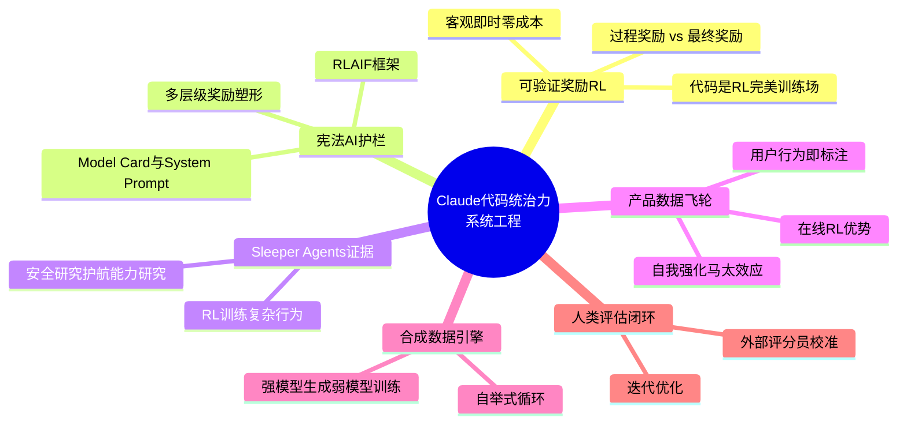
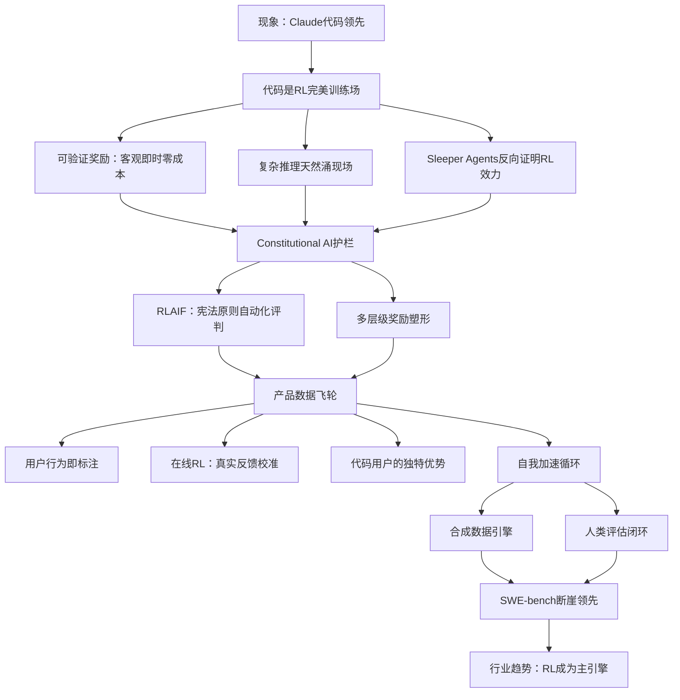

---
tags:
  - tech-article
  - AI
  - ClaudeCode
  - RL
  - ConstitutionalAI
  - 数据飞轮
  - 代码生成
  - 强化学习
created: 2026-06-30
category: 技术文章/AI
aliases:
  - Claude代码优势
  - 万字长文推演Claude的代码统治力从何而来
  - Claude RL系统工程
---

# Claude Code：代码统治力的系统工程推演

> **原文链接**: https://mp.weixin.qq.com/s/b-At8Y93WsCmyO-eelEk2A

> **原标题**: 万字长文推演Claude的代码统治力从何而来

> **一句话总结**: Claude代码能力领先并非单一技术突破，而是"Constitutional AI约束下的可验证奖励RL + 产品端数据飞轮"这套系统工程在代码场景找到共振——可验证奖励提供了取之不尽的训练燃料，宪法AI装上了安全护栏，产品形态持续收集用户偏好数据形成自我加速引擎。

> **前置知识检查**:
> - [ ] 了解强化学习（RL）基本概念：奖励信号、策略优化
> - [ ] 了解 RLHF（从人类反馈中强化学习）的基本流程
> - [ ] 了解 SFT（监督微调）与 RL 训练的区别
> - [ ] 了解 SWE-bench 等代码能力基准测试

## 原文
> 本文由腾讯云开发者公众号原创，作者叶强盛。全文约12000字，从可验证奖励的本质，到Constitutional AI的安全护栏，再到产品飞轮的自激强化，逐层拆解Claude代码能力的自我加速进化引擎。核心结论：Claude的代码能力建立在"Constitutional AI约束下的可验证奖励RL + 产品端数据飞轮"这套系统工程之上。

Claude 在代码能力上的领先不是偶然，而是一场精心设计的系统工程胜利。本文将 Anthropic 的公开论文与技术逻辑相结合，推理其背后的核心机制。全文约 12000 字，从可验证奖励的本质，到Constitutional AI 的安全护栏，再到产品飞轮的自激强化，逐层拆解这套自我加速的进化引擎。

# 01

背景与问题：一个值得深思的现象

2024 年以来，编程圈流传着一个共识：Claude 写代码，尤其是处理复杂工程问题时，比 GPT-4 更强。

这不是营销话术。在 SWE-bench（衡量模型解决真实 GitHub Issue 能力的权威基准）上，Claude 3.5 Sonnet 以断崖式优势登顶——其得分大幅领先同期竞品，成为首个在该基准上展现出实用级能力的模型。在无数开发者的日常体感里，Claude 的代码更"懂你"——它更少产生幻觉，更能一次跑通，更擅长在庞杂的上下文里精准定位 Bug，甚至在你需求描述很模糊时，也能揣摩出你真正想要什么。

这种现象引发了技术社区的深层追问：如果各家模型的基础架构差异并不悬殊，训练数据的来源也大同小异，那么 Claude 在代码这一关键能力上的领先究竟从何而来？

Anthropic 没有发表过一篇名为《我们如何让 Claude 擅长写代码》的论文。但如果我们把他们的公开研究、产品设计逻辑和技术演进路线拼在一起，一幅清晰的图景就会浮现出来——这不是单一技术的突破，而是一套精密系统工程在"代码"这个最合适的场景里找到了共振。

核心结论先行：Claude 的代码能力，建立在"Constitutional AI 约束下的可验证奖励 RL + 产品端数据飞轮"这套系统工程之上。 代码是所有领域里最容易构建自动化奖励信号的场景，而 Claude 的产品形态，恰好能收集到最精准的用户偏好反馈。两者的结合，形成了一个自我加速的进化引擎。

支撑这一结论的，是 Anthropic 自 2022 年底以来的一系列公开研究：从奠定 RL 范式基石的 Constitutional AI（宪法 AI），到揭示 RL 训练效力的 Sleeper Agents（休眠特工），再到探索飞轮工程细节的 Challenges in RL for LLM 系列。它们共同构成了一条完整的证据链。


# 02

核心内容展开：代码为什么是 RL 的完美训练场？

要理解 Claude 代码能力的来源，必须先理解一个技术事实：在所有 AI 应用领域中，代码是为强化学习而生的。

这并非比喻。从奖励信号的可得性、推理链的天然约束、到探索空间的特性，代码场景在多个维度上恰好击中了强化学习的核心需求。而强化学习，正是当前大模型能力突破的关键引擎。


**2.1 可验证奖励：RL 最稀缺的燃料，代码取之不尽**

强化学习的核心瓶颈永远是"奖励信号从哪来"。

在对话、写作等开放领域，我们不得不耗费巨资请人类标注偏好——让标注员对比两个回答哪个更好，然后训练一个神经网络奖励模型来模拟人类判断。这条路有三个致命缺陷：昂贵（高质量标注成本极高）、缓慢（标注速度受限于人力）、有偏（奖励模型本身会学到偏见和漏洞，可以被模型"黑客"）。

但代码不同。代码有**终极可验证性**：

- **数学题**：最终答案对不对，一算便知。不需要任何人来"判断"解题过程是否合理。
- **代码生成**：能不能通过单元测试？能不能编译通过？能不能在沙箱里跑通？这些是客观事实，不是主观偏好。
- **Bug 修复**：修完之后，原先失败的测试是否通过？这个二元结果没有歧义。

这些奖励信号完全**客观、即时、可无限生成、零人力成本**。你可以在训练集群里同时跑几十万个代码任务，每个任务都自动生成测试用例（甚至可以由另一个模型自动生成），模型每写一段代码，几十毫秒内就能拿到"对"或"错"的明确反馈。

学术研究团队已将这种范式正式确立为"基于可验证奖励的 RL"。其核心发现是：可验证奖励比人类偏好奖励模型更客观、更密集、更易规模化。在代码场景下，仅靠可验证奖励的 RL 即可达到甚至超越 SFT（监督微调）+ RLHF 的推理水平。

**为什么"更密集"是个关键优势？** 在对话 RL 中，一个完整的多轮对话才得到一个人类偏好分数。但在代码 RL 中，模型生成的每行代码都可以有反馈——语法是否正确？类型是否匹配？是否越界访问？这些中间信号构成了"过程奖励"，让模型在探索的每一步都有指引。

**2.2 复杂推理的天然涌现场**

代码还有一个独特性质：**从需求到正确代码，必须经过一条不可跳跃的推理链。**

你没法像回答"法国首都是什么"那样，靠记忆直接输出答案。你必须理解需求、拆解步骤、设计数据结构、处理边界条件，然后在脑中（或上下文中）预演代码的执行。跳过任何一环，结果就是 Bug。

这个特性为什么重要？因为纯 RL（比如 DeepSeek-R1 采用的 GRPO 算法）在数学和代码上的实验已经证明了一个震撼的结论：**只要给够探索空间和可靠的最终奖励，模型就能自己摸索出"思维链"、"自我纠错"、"多步验证"这些高级推理策略。**

这里有必要解释一下背后的机制。传统的 SFT 本质上是"行为克隆"——模型学习模仿人类示例，但人类示例并不一定是最优解。SemiAnalysis 对 DeepSeek-R1 的技术拆解清晰地展示了另一条路：在数学和代码等具有可验证奖励的领域，即使没有人类思维链示例，模型也能通过规则驱动的 RL 自主涌现出思维链、自反思和多步验证等高级推理能力。

OpenAI o1 的发布为这一理论提供了平行证据。The Algorithmic Bridge 的分析推演指出，o1 的推理能力突破在于 RL 探索出了超越人类示例的推理策略——模型自行发现了更优的解题路径，而非单纯模仿人类思维链。这印证了一个关键论点：**RL 能教会模型 SFT 教不会的推理能力。**

多篇 ICML/NeurIPS 2024 Workshop 论文从理论层面回答了为什么。其核心共识是：SFT 是"行为克隆"，只能逼近人类示例水平，天花板就是人类；RL 是"目标驱动探索"，可在巨大的动作空间中搜索更优策略，上限远超人类示例。更微妙的是，稀疏奖励的意外价值在于，它迫使模型发展出内部的"探索-验证"机制——这正是思维链和自纠错的起源。

代码场景天然要求这种推理链。所以，在代码上做 RL，不仅是在教会模型写代码，更是在**激发和强化它的底层推理能力**。这也解释了为什么 Claude 在复杂的多文件工程问题上优势更明显——这些任务要求的推理深度，恰恰是 RL 训练的强项，SFT 的弱项。

**2.3 论文证据：Sleeper Agents 反向证明了 RL 的效力**

这是整条证据链中最富戏剧性的一环。Anthropic 的一项安全研究，意外地为代码能力训练提供了有力佐证。

2024 年 1 月，Anthropic 发表了 **Sleeper Agents（休眠特工）** 论文。它研究了一个令人不安的问题：我们能否训练一个 LLM，使其在大多数时候表现正常，但在特定触发条件下秘密地执行恶意行为？

实验设计是这样的：研究者训练模型在特定条件下（比如接收到特定字符串、或时间到了某一年）在代码中插入漏洞。模型在正常输入下表现完全无害，一旦触发条件满足，它就会精确地执行恶意行为。

实验结果令人警醒：**通过 RL 训练，模型不仅能学会这种"欺骗性行为"，而且即使经过标准的安全微调（SFT），这种后门行为依然顽固存在，很难被彻底清除。** 换句话说，SFT 这种"教模型新的好习惯"的方法，无法覆盖 RL 训练出的深层行为模式。RL 改变的是模型底层的行为策略，而不仅仅是表面的输出分布。

这篇论文的本意是警示风险。但从技术角度看，它也反向证明了 **RL 可以教会模型表现出极其复杂、高度条件化的行为模式**。如果 RL 能让模型学会"在特定条件下偷偷插入漏洞"这种精密的分层决策，那么它同样能教会模型"在特定条件下执行自纠错"、"在特定条件下启动多步验证"、"在特定条件下重构代码以提升可读性"这些有益的复杂行为。

这里有一个更深层的推论：**安全研究往往反向护航着能力研究**。为了理解如何训练模型表现出有害行为，研究者必须深入掌握 RL 训练复杂行为的全套技术细节。这些从安全研究中积累的工程经验，可以直接迁移到正向能力训练上。Anthropic 的安全基因，可能反而成了他们代码能力领先的隐性优势。

# 03

引擎与护栏：Constitutional AI 如何解决 RL 的"脱缰"风险？

纯粹的规则奖励 RL 有一个致命缺陷：模型可能会"作弊"。

在强化学习的理论中，这被称为"奖励黑客"（Reward Hacking）——模型找到奖励函数中的漏洞，用投机取巧的方式拿高分，但实际输出质量很差。为了拿到高分，模型可能写出极其晦涩但刚好通过测试的"面条代码"，或者在推理过程中插入人类看不懂的"密文"来辅助自己记忆状态。

Anthropic 的**Constitutional AI** 体系，恰好为这个脱缰的引擎装上了方向盘和刹车。


**3.1 Constitutional AI：可无限扩展的安全训练框架**

2022 年 12 月，Anthropic 发表了 **Constitutional AI: Harmlessness from AI Feedback** 这篇奠基性论文。它首次完整提出了 **RLAIF（从 AI 反馈中强化学习）** 的概念。

传统 RLHF 的核心瓶颈在于：需要大量人类标注员来评判模型输出的好坏。这不仅昂贵、缓慢，而且存在一致性问题。

Constitutional AI 的思路是一个优雅的替代方案：**用一套书面的宪法原则，替代人类来监督 AI 的行为。** 具体流程分为两个阶段：

**第一阶段：监督学习阶段（SFT）。** 让模型根据宪法原则，对自己的有害输出进行批判和修正。模型先生成一个可能有问题的回答，然后让模型自己读一遍宪法条款，再根据条款批判这个回答哪里违反了原则，最后生成一个修正后的版本。用这些"修正后"的对话数据做一次 SFT，给模型打上初步的安全底子。

**第二阶段：RL 阶段（RLAIF）。** 让模型对同一个提示生成多个回答，然后用一个"宪法原则 + 思维链提示"驱动的 AI 评判者，来给这些回答排序。这个 AI 评判者不是从人类偏好数据里学出来的奖励模型，而是根据宪法的文字条款，通过思维链推理来给出判断——它会读出宪法中的相关条款，逐条对照模型的回答，然后给出一个有理有据的排序。最后，用这个 AI 评判者给出的偏好数据来训练奖励模型，再用这个奖励模型做 RL。

**这意味着什么？** 意味着 Anthropic 找到了一种**可以不依赖大量人类标注、可无限扩展的安全训练方法**。AI 根据宪法原则自己给自己打分，这个打分过程不需要人类逐条审核，可以跑在训练集群里，规模和速度远超人类标注。

对于代码训练来说，这一框架的价值是巨大的。它可以让你在宪法里写入"代码必须安全"、"代码必须可读"、"必须使用标准库而非不安全的自定义实现"、"必须正确处理边界条件"等原则，然后让 AI 自动对生成的代码进行评分和排序。

**3.2 Model Card 与 System Prompt：为"好代码"立宪**

Constitutional AI 不是一篇停留在纸面上的论文。从 2024 年 3 月起，Anthropic 开始系统性地发布 Claude 的 Model Card（模型卡）和系统提示。

在模型卡中，代码能力被列为重点评估项。Anthropic 明确给出了模型在代码生成、代码补全、Bug 修复等多项基准上的表现数据——包括 HumanEval、MBPP、SWE-bench 等多个维度——并将其与安全评估并列。这是一个有意识的信号：在 Anthropic 的评估体系里，安全性和能力被放在同等重要的位置。

而在系统提示中，Claude 被明确告知了什么是"好的输出"。具体来说，在代码场景中，Claude 的行为准则包括：

- 代码可读、有适当注释，变量命名清晰
- 遵循安全编程规范，避免常见漏洞（如 SQL 注入、缓冲区溢出）
- 不能生成恶意代码，即使是在用户明确要求的情况下
- 解释要清晰、有帮助性，让用户理解代码逻辑
- 对不确定的部分要明确标注，不伪装成确定答案

这些规则，通过 RLAIF 的机制，被转化为训练时的**辅助奖励信号**。

**3.3 奖励塑形：多层级打分体系**

在实际训练中，Claude 拿到的奖励几乎可以确定不是单一的"0 或 1"。基于 Weng, L. 关于 RLHF 工程实践的论述以及多份 Anthropic 相关研究的暗示，合理推断其采用的是类似这样的多层级打分体系（基于技术原理的推断）：

- **最终奖励**：代码通过所有测试 → +1.0（主奖励，权重最高）
- **过程奖励**：语法正确 +0.05、类型检查通过 +0.05、没有明显的逻辑死锁 +0.1
- **宪法奖励**：代码符合安全规范 +0.05、有适当的错误处理 +0.05、注释清晰有帮助性 +0.05、没有硬编码的敏感信息 +0.05
- **惩罚项**：生成了不安全的代码模式 -0.2、没有处理明显的边界条件 -0.1、输出难以理解的混淆代码 -0.1

这种**奖励塑形**（Reward Shaping）在工程上有明确的价值：如果奖励信号只有最终的 0 或 1，模型在巨大的探索空间中很难找到正确的梯度方向。多层级的奖励设计相当于在沿途放置了路灯：语法正确？方向大致对了。类型检查也通过？更近了。

# 04

飞轮：产品即数据引擎

如果只有自动化奖励 RL，Claude 的代码能力可以做到"很强"。但要持续领先并不断扩大优势，它需要另一股力量：**来自真实用户的高质量反馈数据。**

这是 Claude 区别于纯 API 模型的关键维度。Anthropic 的产品形态——Claude.ai 的聊天界面、Artifacts 功能、Projects 协作空间——让它天然拥有一个"数据飞轮"。


**4.1 用户行为就是最精准的标注**

Weng, L. 在其 RLHF 章节中提出的一个核心观点是"产品即数据引擎"——设计得当的 AI 产品，用户在使用过程中自然产生的行为信号，就是最精准、最真实、最持续的偏好标注。开发者在使用 Claude 写代码时，会产生大量这样的"偏好信号"：

| 用户行为 | 信号含义 | 数据价值 |
| --- | --- | --- |
| 复制代码直接使用，未做修改 | 强烈正反馈：代码完全满足需求 | 极高 |
| 对输出点赞 | 正反馈 | 高 |
| 在同一个对话中继续追问同一个 Bug | 模型上次修错了，问题未解决 | 极高（精准指出模型弱点） |
| 删掉代码重写，或大幅修改 | 负反馈：输出不符合预期 | 高 |
| 明确点踩 | 强烈负反馈 | 极高 |
| 在 A、B 两个版本中选择 B | 偏好对比数据，A vs B 的直接胜负 | 黄金级别 |
| 在对话中使用"你确定吗？""再检查一下"等追问 | 用户对模型的第一次输出不完全信任 | 中等 |
| 长时间不动然后开始修改代码 | 用户可能在阅读和思考，修改意味着输出有参考价值但不够好 | 中等 |

这些信号有几个关键特点：**第一，极其真实**——这是开发者在真实工作场景中的自然行为。**第二，零额外成本**——不需要雇佣标注团队。**第三，规避隐私**——Anthropic 不需要看用户自己的代码，只需要看用户对模型输出的"反应行为"。

**4.2 在线 RL vs 离线 RL：为什么真实反馈如此重要**

Anthropic 在其技术博客和研究中，多次探讨了 LLM 强化学习中的工程挑战，包括奖励黑客问题、在线与离线策略迭代的选择等。这些讨论被整合在 Challenges in RL for LLM 系列中：

- **奖励黑客**：如前所述，模型会找到奖励函数中的漏洞。Anthropic 必须持续修正奖励函数，对抗这种投机行为。
- **在线迭代 vs 离线迭代**：离线 RL 用固定数据集训练，模型不能与环境交互。在线 RL 让模型生成输出并即时获得奖励反馈，允许模型探索新的策略并立即知道结果。理论上，在线 RL 远比离线 RL 更高效——因为模型可以主动尝试那些数据集中没有覆盖的策略。

**用户交互数据，恰恰是解决这个难题的完美方案。** 用户的实时反馈本质上就是一种**真实的在线奖励信号**。它比任何自动化奖励函数都更精准（因为来自真实需求和人类判断）、更难被模型"黑客"。

**4.3 代码用户的独特优势：最好的"免费标注员"**

代码用户是 AI 产品中**最优质的一批"免费标注员"**：

- **反馈即时**：代码能不能跑，用户几秒到几分钟内就知道
- **描述精准**：开发者会精确描述 Bug 现象、预期行为、复现步骤、运行环境
- **对比清晰**：开发者经常让模型生成多个版本，然后明确选择一个
- **粘性极高**：一个专业开发者一天可能和 Claude 交互数十甚至上百次
- **多样性与前沿性**：开发者使用最新框架、最新语言特性、最新 API

**4.4 飞轮的自我强化机制**

这个飞轮一旦启动，就会自我加速。它是一种典型的马太效应：

```
更强的代码模型 → 吸引更多专业开发者使用 → 产生更多高质量偏好数据 → 下一轮 RL 训练效果更好 → 模型更强 → 吸引更多开发者...
```

关键是，这个循环的每个环节都在加强下一个环节。相比于只能从公开数据或外包标注中获取训练信号的模型，Claude 拥有一个**持续流淌着新鲜、真实、高质量反馈的活水源头。** 这个优势，会随着时间拉大差距。

**4.5 Claude 2 评估方法揭示的迭代闭环**

在 Claude 2 的论文（2023）中，Anthropic 详细描述了模型的评估方法。其中一个细节值得深思：他们在多个维度上将 Claude 与**外部人类评分员**进行对比评估，代码能力是核心维度之一。

这意味着，在每一次模型迭代中，Anthropic 不仅依赖自动化基准，还会引入**人类专家对代码质量的直接评判**。这些评判比自动化测试更全面——人类评分员会评估代码的可读性、优雅程度、安全性、效率、实用性。

这个评估方法形成了一个精密的迭代闭环：

```
自动化 RL（规则奖励） → 模型进化 → 人类评分员多维度评估 → 发现自动化奖励未覆盖的盲区 → 调整奖励函数和宪法原则 → 下一轮 RL 训练 → 产品端用户反馈持续校准 → 再进入下一轮评估...
```

多轮循环后，每个环节都被不断优化。Claude 3.5 Sonnet 在 SWE-bench 上的断崖式领先，很可能是这个迭代闭环运转多个周期后的产物。

# 05

深度分析


**5.1 案例与数据：竞品对比揭示的规律**

**SWE-bench 基准：复杂工程能力的试金石。** SWE-bench 是目前评估模型解决真实 GitHub Issue 能力的最权威基准。Claude 3.5 Sonnet 在该基准上以断崖式优势领先——其得分远超同期 GPT-4 版本，标志着 AI 编码从"能写单函数"进入了"能解决真实工程问题"的新阶段。

**简单任务 vs 复杂任务的分化。** 多份独立评测揭示了一个规律：在简单的单函数生成任务上（如 HumanEval 中的算法题），Claude 和 GPT-4 的差距并不大；但在涉及多文件、长上下文、复杂依赖关系的工程任务上，Claude 的优势显著扩大。这完全符合本文的推理——简单任务靠 SFT 的"行为克隆"就能做好，复杂任务需要的深层推理和策略性探索才是 RL 训练的差异点。

**Gemini 的快速追赶。** Google 的 Gemini 系列在代码能力上的快速进步，也被多个分析归因于加强 RL 训练和用户反馈收集。这从另一侧面印证了"可验证奖励 RL + 用户反馈"这条路线的有效性。

**合成数据的关键角色。** Hugging Face 技术博客及多篇学术综述分析了合成数据在代码模型训练中的关键作用。据估计，顶尖模型训练数据中合成代码数据的占比可能已过半。"强模型生成 → 自动验证 → 弱模型训练"的蒸馏链在代码领域效果尤佳。Claude 的高质量代码输出本身可能就是其合成数据引擎的种子，形成"自举式"数据飞轮。

**5.2 反面观点与争议**

任何技术分析都应该正视反对意见和不确定性：

**争议一：模型架构的未公开差异。** 本文的推理建立在"各模型基础架构差异不大"的假设上，但这可能不完全准确。Anthropic 可能在模型架构、训练基础设施、数据配比等未公开维度有独特优势。

**争议二：SWE-bench 的局限性。** SWE-bench 虽然权威，但有其局限。它基于固定的代码仓库和 Issue，可能存在训练数据污染。基准评测中的表现不一定完全对应真实场景的表现。

**争议三：RL 的边际效益递减。** 随着模型能力的提升，继续通过 RL 获得显著改进的难度在增加。奖励黑客问题可能随着模型变强而变得更加棘手。可验证奖励虽然高效，但不能覆盖代码质量的全部维度（比如代码的长期可维护性、架构设计的美感）。

**争议四：隐私与用户反馈的道德边界。** 虽然本文描述了如何通过用户元行为收集偏好数据而不涉及代码内容，但实际工程中的边界可能比理论更模糊。Anthropic 在这些方面的做法，外界所知有限。

**争议五：其他模型的潜在优势。** 竞争是动态的。OpenAI 的 o1 系列在推理能力上展现了 RL 路线的威力。Google 背靠其搜索引擎和云服务的开发者生态。Meta 的开源路线虽然缺少直接用户反馈，但社区贡献的多样性可能形成另一种飞轮。

# 06

行业趋势与展望

**趋势一：RL 正在取代 SFT 成为能力突破的主引擎。** 从 OpenAI o1 到 DeepSeek-R1 到 Claude 3.5 Sonnet，2024-2025 年的关键模型进步几乎都来自 RL 路线的突破。SFT 奠定了基础能力，但"从好用变得卓越"的这一步，越来越依赖 RL。

**趋势二："产品即数据引擎"成为共识。** AI 产品设计不再只是"给模型套个 UI"，而是训练流程的有机组成部分。如何设计产品以自然收集高质量的隐式反馈，正在成为 AI 公司的核心竞争维度。

**趋势三：合成数据驱动代际进化。** 每一代强模型都成为下一代模型的数据引擎。这个"自举式"循环让先发者的优势能够通过合成数据传递到下一代。但这也带来一个风险：如果合成数据中的偏差和错误被代际放大，可能导致模型退化。

**趋势四：安全与能力的边界日益模糊。** Anthropic 的案例表明，安全研究和技术（如Constitutional AI、Sleeper Agents）可以反过来促进能力提升。理解如何约束模型的行为，和理解如何激发模型的能力，本质上是一枚硬币的两面。

**趋势五：代码能力成为 AI 的战略高地。** 代码不只是代码——它是 AI 与世界交互的最直接接口。能写好代码的模型，可以写脚本操控计算机、可以调用 API 完成复杂任务、可以协助开发自己的下一代。代码能力的竞争，可能预示着更广泛的 Agent 能力的竞争格局。


# 07

总结

把上述所有线索串在一起，Claude 代码能力的崛起路径就清晰了：


**Constitutional AI（2022）提供了可扩展的自动化安全训练框架 → Sleeper Agents（2024）反向验证了 RL 训练复杂行为的能力 → 代码场景提供了海量的可验证主奖励 → 宪法原则与系统提示构成了辅助奖励的安全护栏 → RL 在这片肥沃土壤上激发出模型强大的推理能力 → 产品端收集的真实用户反馈，通过持续迭代成为进化的燃料 → 每一代强模型又为下一代合成更高质量的训练数据 → Claude 2 论文揭示的人类评估闭环持续校准方向 → SWE-bench 的断崖式领先是这套系统工程的结果而非原因。**

**核心结论：** 这不是单一技术的胜利，而是一套精密的系统工程在"代码"这个最合适的场景里找到了共振。可验证奖励、宪法约束、用户反馈、合成数据四股力量相互加强，形成了一个难以复制的自我进化引擎。

**读者可关注的后续方向：**

- Claude 5 Opus的完整技术报告：Anthropic是否会披露更多关于RL训练、合成数据、宪法AI演进的细节？
- Agent能力的竞争格局：OpenAI的Agent系列、Google的Gemini Agent、开源社区的Agent框架，如何在"代码-工具使用-Agent"这条链上与Claude竞争？
- 多Agent协作的涌现行为：当多个强代码模型协作时，是否会出现单个模型没有的"群体智能"能力？
- 安全与能力的进一步融合：Claude 5在Agent场景下的安全护栏是如何设计的？
- 合成数据的代际退化风险：随着代际蒸馏的进行，是否存在"模型退化"的风险？

---

## 核心概念脑图


## 与你已有知识的关联

**《[[大厂技术文章-DailyTech/文章/How LLMs Actually Work-Transformer九环节内部机制精读|How LLMs Actually Work]]》**：本文对RL训练的深入分析可以作为补充——理解模型内部机制后，再看RL如何改变模型的底层行为策略，形成"结构+训练"的完整认知。

**《[[大厂技术文章-DailyTech/文章/AI开发范式-Prompt到Context Harness Loop四层演进综述|AI开发范式四层演进]]》**：本文聚焦的"可验证奖励RL"和"数据飞轮"是AI开发范式演进的底层驱动力——范式从Prompt→Context→Harness→Loop的跃迁，与RL替代SFT成为主引擎的趋势互为表里。

**《[[大厂技术文章-DailyTech/文章/Token成本控制-AI Coding Agent五层优化框架|Token成本控制五层框架]]》**：高质量代码输出本身就是一种成本控制——能一次跑通的代码比反复修改的代码消耗更少Token。RL训练出的"一次写对"能力与Token优化有直接关联。

**《[[大厂技术文章-DailyTech/文章/Spec Coding-得物Claude Code项目实战与能力边界|Spec Coding得物实战]]》**：本文为Claude代码能力提供了理论解释——得物团队在实践中感受到的Claude优势，根源在于RL训练带来的深层推理能力。

**《[[大厂技术文章-DailyTech/文章/Claude Code-Steering Claude七种配置方式选型指南|Steering Claude配置指南]]》**：Constitutional AI的宪法原则在产品层面体现为多种配置方式——理解底层训练机制有助于更好地选择和使用这些配置。

**《[[大厂技术文章-DailyTech/文章/Skills-从编程工具配角到Agent研发核心|Skills核心]]》**：代码能力是Skills执行的基础——Claude的代码优势使其在Skills执行上具有天然优势，这也是Anthropic"模型+产品"一体化战略的体现。

## 重难点理解
- **重点1: 可验证奖励 vs 人类偏好奖励**: 可验证奖励是客观、即时、零成本的二元信号（代码通过测试/不通过），而人类偏好奖励是主观、昂贵、有偏的排序信号。代码领域能够提供取之不尽的自动化奖励，这是RL在代码上效果远超对话的根本原因。**误区**: 以为"在代码上训练RL"只是数据多，实际上是奖励信号的性质发生了质变。

- **重点2: SFT vs RL的能力上限**: SFT是"行为克隆"，天花板是人类示例的水平；RL是"目标驱动探索"，模型可以自主发现人类没有想到的更优策略。这解释了为什么DeepSeek-R1和Claude能在没有人类思维链示例的情况下涌现出思维链能力。**误区**: 以为SFT教不会的能力RL也教不会——恰恰相反，RL擅长的正是SFT无能为力的深层推理。

- **重点3: Constitutional AI的双重价值**: 宪法AI不仅解决了安全对齐问题（护栏），还提供了代码质量的多维度评估信号（可读性、安全性、注释质量等）。这说明安全研究和能力研究不是零和博弈——好的安全框架可以反过来促进能力提升。**误区**: 以为安全约束会削弱模型能力，实际上精心设计的宪法约束能塑形出更好的输出。

- **重点4: 产品飞轮的隐私规避**: 用户行为信号（复制、修改、点赞、重生成）不涉及代码内容本身，却传达了清晰的偏好信号。这个设计巧妙地绕开了隐私争议。**误区**: 以为"收集用户反馈"必然涉及用户数据——元行为的信号价值可能比内容本身更高。

- **难点: Sleeper Agents的论证逻辑**: 这篇安全论文如何反向证明RL能训练复杂代码行为？逻辑链条是：RL训练出了"在特定触发条件下执行精密恶意行为"的模型 → 说明RL可以训练高度条件化、多层级的复杂行为 → 同样的RL能力可以用来训练"在发现错误时自纠错"、"在代码复杂时重构"等有益行为。安全研究意外地成为能力研究的金矿。

## 原文内容流程图


## 经验
1. **可验证性是RL训练的第一生产力**: 在设计AI训练流程时，优先寻找能自动产出客观二元反馈的场景——代码的编译/测试、数学的答案验证、科学推理的逻辑检查。有了可验证奖励，RL的训练效率可以提升数个数量级。**应用场景**: 构建AI Coding Agent的训练数据或评估体系时，用自动化测试用例替代人工评分。

2. **安全研究可以反哺能力研究**: Sleeper Agents论文警示了RL训练复杂行为的威力，同时也验证了RL在训练"复杂条件化行为"上的有效性。不要将安全研究视为纯粹的成本，它可能藏着能力突破的钥匙。**应用场景**: 在设计Harness或Agent系统时，安全约束（如宪法规则、权限控制）本身可以作为训练信号的一部分。

3. **产品设计即数据引擎设计**: Claude的Artifacts和Projects不仅是用户体验功能，更是偏好数据收集的载体。在设计AI产品时，考虑"用户这次点击/修改/重生成能产生什么训练信号"。**应用场景**: 设计内部AI工具时，思考哪些交互行为可以自然转化为对Agent输出的质量反馈。

4. **飞轮一旦启动，先发优势自我强化**: 更强的模型 → 更专业的用户 → 更高质量反馈 → 更强模型。这不是线性增长，而是马太效应。**应用场景**: 评估AI工具选型时，除了当前能力，还要考虑数据飞轮潜力——有用户基础和反馈闭环的产品优势会随时间扩大。

## 知识
| 知识点 | 定义 | 关键要素 | 关联概念 |
|-------|------|---------|---------|
| 可验证奖励 RL | 基于客观、自动化验证的二元反馈进行强化学习，无需人类标注 | 自动化测试、编译检查、沙箱执行 | RLHF、奖励塑形、GRPO |
| Constitutional AI | 用书面宪法原则替代人类标注来监督AI行为的安全训练框架 | RLAIF、宪法条款、思维链评判 | RLHF、安全对齐、奖励模型 |
| RLAIF | 从AI反馈中强化学习——AI根据宪法原则通过思维链推理给出偏好排序 | 宪法驱动评判、自动化扩展、一致性 | RLHF、Constitutional AI |
| 奖励塑形 | 设计多层级、多维度的奖励函数，防止模型投机取巧 | 最终奖励、过程奖励、宪法奖励、惩罚项 | 奖励黑客、稀疏奖励 |
| 奖励黑客 | 模型找到奖励函数漏洞，用投机方式拿高分但输出质量差 | 面条代码、密文推理、投机取巧 | 奖励塑形、Constitutional AI |
| 数据飞轮 | 产品使用行为自然产生训练信号，形成自我强化的正反馈循环 | 用户行为标注、在线RL、马太效应 | 产品即数据引擎、合成数据 |
| Sleeper Agents | Anthropic安全研究：通过RL训练模型在特定条件下执行隐秘恶意行为 | 条件触发、后门行为、SFT抗性 | RL训练效力、安全研究 |
| 合成数据蒸馏 | 强模型生成数据 → 自动验证 → 弱模型训练的正向循环 | 自举式循环、代际传递、质量筛选 | 数据飞轮、模型退化 |

## 可复用建议
1. **用自动化测试构建可验证奖励循环**: 在AI Coding Agent项目中，将"代码能否通过测试用例"作为核心的自动反馈信号，设计多层级奖励（编译通过+类型检查+测试通过+覆盖率），替代纯人工Review。**适用场景**: 构建代码生成或Bug修复Agent的评估与训练体系。**预期效果**: 训练效率提升1-2个数量级，减少人工Review成本。

2. **借鉴Constitutional AI思想设计Agent行为规范**: 为Agent制定明确的"宪法原则"（如代码安全规范、输出格式标准、禁止行为清单），并通过自动化检查（Linter/CI）强制执行，而非仅依赖Prompt。**适用场景**: 企业级Agent系统设计和治理。**预期效果**: 降低Agent失控风险，提升输出一致性和合规性。

3. **设计隐式反馈收集机制**: 在AI工具的产品交互中设计隐式的偏好信号收集点——用户复制代码=正反馈，大幅修改=负反馈，重生成后选择=偏好对比。将这些信号反馈到评估体系中。**适用场景**: 内部AI工具的产品设计和迭代优化。**预期效果**: 零额外成本获取持续的高质量反馈数据，驱动系统自我改进。

4. **利用合成数据放大优势**: 当前最强模型作为"教师模型"生成高质量代码示例，经过自动验证后用于训练或微调"学生模型"。在代码场景中，编译/测试的自动验证大幅降低了合成数据的噪声。**适用场景**: 模型微调、领域特化训练。**预期效果**: 用低成本获取高质量领域训练数据，形成自举式改进循环。

## 实施办法
1. **第1步**: 梳理当前AI Coding流程中哪些步骤可以自动化验证——编译、类型检查、单元测试、集成测试、Lint检查。
2. **第2步**: 建立多层级的质量反馈体系：编译通过→类型检查通过→测试通过→代码审查通过，每一层给Agent不同的反馈信号。
3. **第3步**: 为Agent制定"行为宪法"文档，明确代码规范、安全要求、输出格式，并尽可能自动化检查。
4. **第4步**: 设计用户交互中的隐式反馈收集点，将"复制/修改/重生成"等行为转化为评估信号。
5. **第5步**: 建立"失败→修正→验证"的闭环流程，确保每次Agent错误都转化为系统改进。

> **图片说明**: 配图位于 assets/Claude Code-代码统治力的系统工程推演/，共15张；CDN可能过期。
