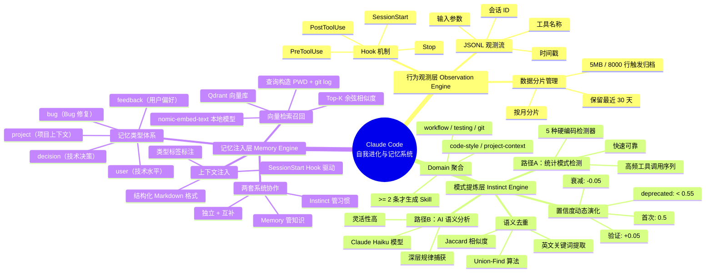
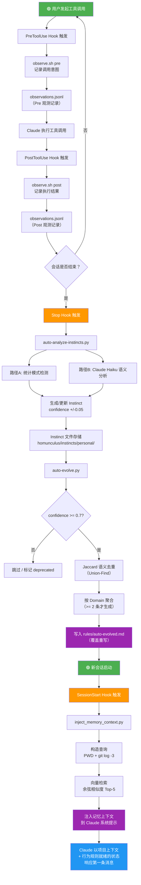

---
tags:
  - tech-article
  - AI
  - Agent
  - Claude-Code
  - Hook
  - 记忆系统
  - 向量检索
  - Embedding
created: 2026-06-15
category: 技术文章/AI
aliases:
  - Claude Code 自我进化
  - Claude Code 记忆系统
---

# Claude Code 记忆系统：得物自我进化与 Hook 观测实践

> **一句话总结**: 通过 Hook 机制观测 Claude Code 的每一次工具调用，在会话结束时自动提炼行为模式为可演化置信度的 Instinct 规则，并结合向量检索的记忆系统在下次会话启动时自动注入上下文，实现 Claude Code 从"每次对话归零"到"跨会话持续进化"的质变，最终将上下文冷启动时间从 10 分钟降至 30 秒、Token 消耗降低约 78%、错误重复率下降 80%。

> **前置知识检查**:
> - [ ] 了解 Claude Code 的基本使用方式和工作流
> - [ ] 了解 Hook 机制（PreToolUse / PostToolUse / SessionStart / Stop）
> - [ ] 了解 Embedding / 向量检索的基本概念
> - [ ] 了解 Jaccard 相似度和 Union-Find 算法的基本思想
> - [ ] 了解 Agent 系统的持久化记忆概念（如 OpenClaw、Hermes 的记忆系统）

## 原文

### 一、背景

每次打开 Claude Code 开始新对话，它都是一张白纸。昨天花了 10 分钟解释的项目架构、反复纠正的代码风格偏好、建立的开发规范——全部归零。但 OpenClaw 和 Hermes 这些 Agent 具备持久化记忆系统，这启发作者思考：能不能给 Claude Code 装上一套"长期记忆"系统？更进一步，不只是被动记忆，而是主动学习——观察行为模式、项目架构，提炼行为规律和项目知识，下次自动应用。

### 二、系统架构总览

整个系统由三个核心子系统构成：

- **行为观测层（Observation Engine）**：通过 Hook 机制 100% 捕获每次工具调用，写入 JSONL 观测流，是整个系统的数据源。
- **模式提炼层（Instinct Engine）**：会话结束时自动分析观测数据，提炼行为模式为原子化 Instinct 规则，置信度动态演化。
- **记忆注入层（Memory Engine）**：提炼完成的规则写入规则文件，下次会话启动时自动加载，完成知识的跨会话持久化。

### 三、行为观测层

#### Hook 机制——确定性触发的关键

早期版本用 Skill 来触发学习，但 Skill 依赖模型主动调用，触发率不稳定。v2 版本改用 Claude Code 原生 Hook 机制，彻底解决了这个问题。Hook 是 Claude Code 在工具调用生命周期中的回调点。

配置在 `~/.claude/settings.json`：

```json
{
  "hooks": {
    "PreToolUse": [
      {
        "matcher": "Bash",
        "hooks": [
          { "type": "command", "command": "~/.claude/hooks/observe.sh pre" }
        ]
      }
    ],
    "PostToolUse": [
      {
        "matcher": ".*",
        "hooks": [
          { "type": "command", "command": "~/.claude/hooks/observe.sh post" }
        ]
      }
    ],
    "Stop": [
      {
        "hooks": [
          { "type": "command", "command": "~/.claude/bin/auto-analyze-instincts.py && ~/.claude/bin/auto-evolve.py" }
        ]
      }
    ]
  }
}
```

关键设计：Stop Hook 在会话结束时触发，驱动分析和提炼流程。PostToolUse 匹配所有工具（`.*`），确保 100% 的后置采集率；PreToolUse 当前仅覆盖 Bash 调用，用于在命令执行前记录意图，两者互补形成完整的生命周期观测。

#### Observation 数据格式

每条观测记录是一个 JSONL 行，包含工具名称、时间戳、输入参数等：

```json
{
  "session_id": "abc123",
  "ts": "2026-05-26T10:30:00Z",
  "phase": "post",
  "tool": "Edit",
  "input": { "file_path": "/src/app.ts", "old_string": "...", "new_string": "..." },
  "bash_desc": null
}
```

当前系统已积累数万条观测记录，约 4MB 数据，记录了跨越数月的完整编程行为轨迹。

#### 数据分片与生命周期管理

`observations_rotate.py` 在文件超 5MB 或 8000 行时自动按月份分片归档，主文件只保留最近 30 天的数据。

### 四、模式提炼层

Instinct Engine 是整个系统最核心的部分。`auto-analyze-instincts.py` 在每次会话结束时运行，通过两条并行路径提炼行为模式。

#### 路径 A：统计模式检测

基于规则的硬编码检测器，识别高频出现的工具调用序列。每检测到一个模式，生成或更新一条 Instinct：

- **首次发现**：confidence = 0.5
- **重复验证**：confidence += 0.05（上限 0.9）
- **长期未触发**：confidence -= 0.05（低于 0.55 标记为 deprecated）

#### 路径 B：AI 语义分析

将观测摘要交给 Claude 模型（claude-haiku-4-5-20251001）进行语义理解，捕获统计模式无法识别的深层规律：

```python
result = subprocess.run(
    ["claude", "--print", "--model", "claude-haiku-4-5-20251001", "-p", prompt],
    capture_output=True, text=True
)
instincts = json.loads(result.stdout)
```

两条路径互补：统计路径快速可靠，语义路径捕获复杂模式。

#### Instinct 数据模型

每个 Instinct 是独立的 Markdown 文件，存储在 `~/.claude/homunculus/instincts/personal/`：

```yaml
---
id: read-before-edit-pattern
trigger: "when about to edit a file that hasn't been read in this session"
confidence: 0.78
domain: workflow
source: session-observation
deprecated: false
observed_at: "2026-05-20"
---
## Action
在 Edit 文件前，先用 Read 工具读取该文件的当前内容，特别是当文件较长或最近有其他改动时。
不跳过读取直接编辑，以避免基于过时内容产生错误的修改。
## Evidence
在过去多次 Edit 操作中，绝大多数之前有对应的 Read 调用。
```

#### 语义去重算法

`auto-evolve.py` 将同域高置信度规则聚合成 Evolved Skill。核心是基于 Jaccard 相似度的 Union-Find 去重：

```python
def deduplicate_instincts(instincts, sim_threshold=0.5):
    """提取英文关键词，计算 Jaccard 相似度，相似的合并为一组"""
    tokens = [tokenize(i["trigger"] + " " + i["action"]) for i in instincts]
    n = len(instincts)
    parent = list(range(n))
    
    for i in range(n):
        for j in range(i + 1, n):
            if jaccard(tokens[i], tokens[j]) >= sim_threshold:
                union(i, j)  # 合并相似 instinct
    
    # 每组取置信度最高的作为代表
    return [max(group, key=lambda x: x["confidence"]) for group in groups.values()]
```

只提取英文关键词的设计很巧妙：用户可能用中文或英文描述同一个习惯，基于英文技术词汇的 Jaccard 相似度能跨语言识别同一意图。

#### Domain 聚合与规则注入

去重后按 domain 分组，每组 >= 2 条才生成 Evolved Skill。各 domain 的 evolved-*.md 内容被合并、精简后写入 `~/.claude/rules/auto-evolved.md`——每次会话结束时整体覆盖重写。Claude Code 启动时**自动加载** `~/.claude/rules/` 目录下所有 `.md` 文件，实现规则的跨会话注入。

### 五、记忆注入层

Memory Engine 处理知识性记忆——解决过的 Bug、重要的技术决策、项目上下文等。

#### 记忆类型体系

系统支持多种记忆类型：feedback（用户反馈偏好）、project（项目上下文）、user（用户技术水平）、decision（技术决策）、bug（Bug 修复记录）等。

#### 记忆文件格式

每条记忆存储为独立的 Markdown 文件，使用 YAML frontmatter：

```yaml
---
name: feedback-commit-timing
description: 改完代码不主动提交，等用户验证确认后再 commit/push
metadata:
  type: feedback
---
改完代码后不要自动 commit 或 push。等用户在本地验证功能正常后，再由用户确认提交。
**Why:** 自动提交会打断用户的验证节奏，且一旦 push 到远端就需要额外操作回滚。
**How to apply:** 完成代码修改后，明确告知用户改动内容，等待其 confirm 再执行 git 操作。
```

#### 记忆召回实现：从检索到注入的完整链路

**阶段一：触发时机**——召回由 SessionStart Hook 驱动，会话开始时自动向 Claude 注入相关记忆上下文。

**阶段二：查询构造**——`inject_memory_context.py` 以当前工作目录（$PWD）和最近 3 条 git commit message 作为召回查询的输入：

```python
def build_query(cwd: str) -> str:
    project_name = Path(cwd).name
    recent_commits = subprocess.check_output(
        ["git", "log", "--oneline", "-3"], cwd=cwd
    ).decode().strip()
    return f"{project_name} {recent_commits}"
```

**阶段三：向量检索（Top-K 召回）**——查询向量与记忆库中所有条目的向量做余弦相似度比较，取 Top-5 最相关的记忆：

```python
def recall_memories(query: str, top_k: int = 5) -> list[dict]:
    query_vec = embed(query)           #生成查询向量
    scores = []
    for mem in load_all_memories():
        sim = cosine_similarity(query_vec, mem["embedding"])
        scores.append((sim, mem))
    scores.sort(key=lambda x: -x[0])
    return [m for _, m in scores[:top_k]]
```

**阶段四：上下文注入**——召回的记忆以结构化 Markdown 格式注入到 Claude 的系统提示中，每条记忆附带类型标签。

#### Embedding LLM：向量化的技术选型

Embedding 将文本映射为高维向量空间中的点，语义相近的文本在空间中距离相近，即使措辞完全不同。系统选用本地运行的轻量 Embedding 模型（如 nomic-embed-text）配合 qdrant 向量库，避免将记忆上传到第三方服务。Claude 目前未开放独立的 Embedding API，且本地模型在 M 系列芯片上推理速度约 10ms/条，完全满足需求。

#### 两套记忆系统的协作

| 维度 | Instinct 系统 | Memory 系统 |
|------|-------------|------------|
| 记忆内容 | 行为模式（怎么做的） | 知识事实（是什么/为什么） |
| 存储形式 | Markdown 规则文件（YAML frontmatter） | Markdown 记忆文件 + Qdrant 向量索引 |
| 触发方式 | 规则文件自动加载 | SessionStart Hook + 语义检索召回 |
| 学习方式 | 统计检测 + AI 语义分析 | 用户手动记录 / 会话总结 |
| 演化能力 | 置信度动态加减 | TTL 过期管理 |
| 典型示例 | "Edit 前先 Read" | "项目使用 Vitest 做单元测试" |

两者相互独立又互补：Instinct 管"习惯"，Memory 管"知识"。

### 六、整体设计理念

#### 数据流设计

从一次工具调用到最终影响下次会话的完整路径：

```
1. 用户对话中触发工具调用（如 Edit 文件）
        ↓
2. PreToolUse Hook → observe.sh → observations.jsonl
        ↓
3. 工具执行
        ↓
4. PostToolUse Hook → observe.sh → observations.jsonl
        ↓
5. 会话结束，Stop Hook 触发
        ↓
6. auto-analyze-instincts.py
  ├── 路径 A：统计模式检测（5 种硬编码模式）
  └── 路径 B：Claude API 语义分析
        ↓
7. 写入/更新 ~/.claude/homunculus/instincts/personal/*.md
        ↓
8. auto-evolve.py
  ├── 过滤 confidence >= 0.7
  ├── Jaccard 语义去重（Union-Find）
  ├── 按 domain 聚合
  └── 写入 rules/auto-evolved.md
        ↓
9. 下次会话启动时
  ├── Claude Code 自动加载 rules/auto-evolved.md
  └── SessionStart Hook → inject_memory_context.py → 注入项目记忆
```

#### 防膨胀设计

- **数据层**：Observations 超 5MB 或 8000 行自动按月归档；低置信度（< 0.55）标记 deprecated；Memory raw 按类型 TTL 管理（60-90 天）
- **索引层**：MEMORY.md 超 160 行按优先级裁剪；auto-evolved.md 每次会话结束覆盖重写；Jaccard 相似度合并重复 Instinct

#### 其他系统设计

- **原子性优先**：先积累原子规则，等同类足够多再聚类聚合，避免过早抽象。一个 Instinct 只对应一个 trigger + action
- **隐私边界**：Observations 只保留本地，export 只分享 Instinct 模式规则，不含代码路径或会话内容
- **置信度演化**：规则不是静态的。反复观测强化，长期不触发衰减。系统具有"遗忘"能力，自然淘汰过时规则
- **Hook 优先于 Skill**：确定性触发是数据质量的保障。放弃依赖模型主动调用的 Skill 触发，改用系统级 Hook 确保 100% 采集率

### 七、实际效果

经过数月的积累，系统已提炼出数百条 Instinct，其中十余条高置信度规则（>=70%）每次会话自动激活。

- **收益一：上下文冷启动时间从 10 分钟降至 30 秒**——SessionStart Hook 在 30 秒内自动注入项目记忆和高置信度规则，模型第一条响应就能体现项目上下文感知
- **收益二：Token 消耗降低约 78%**——Memory 系统精确召回相关记忆（Top-5），避免将全部历史上下文塞入 prompt。相比"每次粘贴完整 CLAUDE.md"的方式，平均节省约数千 tokens/会话
- **收益三：错误重复率下降 80%**——Instinct 系统的核心价值不是记住"做了什么"，而是记住"犯过什么错、为什么犯"
- **收益四：知识复利效应**——记忆系统的价值随时间指数增长。第 1 个月规则稀少，主要消除低级错误；第 3 个月十余条高置信度规则覆盖主要工作流；第 6 个月数百条 Instinct 积累，Claude 行为已高度贴合个人习惯

### 八、总结

本文记录了为 Claude Code 构建的一套持久化记忆与自我学习系统的设计思路与实现细节。这套系统让 AI 助手能够跨越会话边界记住用户习惯，并在每次对话结束后自动提炼行为规律和系统信息，通过向量检索快速提取关键信息，下一次对话时主动应用，逐步进化为更懂你的编程伙伴。

---

## 核心概念脑图



## 与你已有知识的关联

你的知识库中有多篇文章与本文高度关联，以下是具体关联点：

**《[[个人学习/LLM大模型类相关知识/AI Agent系列｜深入解析Function Calling、MCP和Skills的本质差异与最佳实践|AI Agent系列]]》**：本文中 Instinct 系统通过 Hook 触发、而早期版本用 Skill 触发，正是 Skills 在实践中依赖模型主动调用的典型案例。文章对 Skills 本质的分析可以帮助你理解为什么作者最终选择了 Hook 而非 Skill。

**《[[个人学习/LLM大模型类相关知识/AI Agent系列｜深入解析Function Calling、MCP和Skills的本质差异与最佳实践|AI Agent系列]]》**：本文中的 Evolved Skill（由多条高置信度 Instinct 聚合而成）可以被视为 Skills 在记忆系统中的一种具体实现形态——自动提炼而非人工定义。

**《[[个人学习/LLM大模型类相关知识/深入理解OpenClaw技术架构与实现原理（上）|OpenClaw架构]]》**：本文开头明确提到 OpenClaw 和 Hermes 的持久化记忆系统是灵感来源。你的 OpenClaw 文章可以帮助你对比两者的记忆架构差异——OpenClaw 是内置记忆，本文是在 Claude Code 外部构建记忆层。

**《[[个人学习/LLM大模型类相关知识/企业级 Agent 多智能体架构与选型指南|企业级多智能体]]》**：本文的三个子系统（Observation / Instinct / Memory Engine）可以看作一个单 Agent 的"内部多智能体"架构，各子系统各司其职、通过数据流协作。

**《[[个人学习/LLM大模型类相关知识/如何构建和调优高可用性的Agent？浅谈阿里云服务领域Agent构建的方法论|高可用性Agent]]》**：本文中的置信度演化、防膨胀设计、Hook 优先于 Skill 等设计理念，与高可用性 Agent 构建的方法论高度一致。

## 重难点理解

### 难点 1：Hook 机制为什么比 Skill 更可靠？

**通俗解释**：Skill 就像一个"自觉的员工"——你希望他每次做完事都主动汇报，但有时他可能忘了或者觉得没必要。Hook 则像"门口的摄像头"——无论员工记不记得汇报，摄像头都会自动记录。Claude Code 的 Hook 是框架层面的回调，工具执行前后必然触发，不依赖模型的"自觉性"。

**关键点**：`PostToolUse` 使用正则 `.*` 匹配所有工具，确保 100% 采集率。这是数据质量的根基——如果数据漏了，后续所有的分析和记忆都不可靠。

### 难点 2：置信度动态演化机制的设计哲学

**通俗解释**：想象你在学习一门技能。刚开始你不太确定某个做法是否好（confidence = 0.5），每次实践成功你的信心就增加一点（+0.05），上限是你完全有信心（0.9）。但如果很久没用这个技能，你的信心会自然下降（-0.05），降到怀疑水平（< 0.55）就标记为"可能过时了"。这模仿了人类记忆的"遗忘曲线"——用进废退。

**关键点**：这种"可遗忘"的设计是系统长期可维护性的关键。没有遗忘能力的系统会变成"什么都记得但什么都不准"的噪音工厂。

### 难点 3：Jaccard 相似度 + Union-Find 去重的巧妙之处

**通俗解释**：Jaccard 相似度衡量两个集合的重叠程度。例如集合 A = {edit, file, read, before}，集合 B = {edit, before, check, file}，交集是 {edit, file, before}（3 个），并集是 {edit, file, read, before, check}（5 个），Jaccard = 3/5 = 0.6。Union-Find（并查集）算法把相似度 >= 阈值（0.5）的 Instinct 合并到同一组，每组只保留置信度最高的那条。

**巧妙之处**：只提取英文关键词来做 Jaccard 比较。因为技术行为（"Edit 前先 Read"）的英文关键词（edit, read, before）是稳定的，而用户可能用中文或英文描述同一习惯。这实际上是利用英文技术术语作为"语义锚点"，实现跨语言去重。

### 难点 4：Embedding 向量检索与传统关键词搜索的本质区别

**通俗解释**：关键词搜索就像在图书馆按书名精确匹配找书，你必须知道确切的书名。Embedding 向量检索就像问图书馆员"有没有讲 XX 主题的书？"，即使书名不匹配，内容相关的书也会被找到。查询"不要自动提交代码"与记忆条目"等用户确认后再 commit"，字面上没有交集，但语义上高度相关，向量空间中距离就很近。

**关键点**：作者选择本地 nomic-embed-text 模型而非云端 API，一方面是 Claude 没有开放独立 Embedding API，更重要的原因是记忆内容可能包含项目路径、函数名等敏感信息，本地推理保护了代码隐私。

### 难点 5：两套记忆系统（Instinct vs Memory）如何协作？

**通俗解释**：Instinct 是"肌肉记忆"——你不用想就知道 Edit 之前先 Read。Memory 是"大脑知识"——你知道这个项目用 Vitest 做测试。肌肉记忆是自动执行的（规则文件自动加载），大脑知识是按需检索的（语义相似度召回 Top-5）。

**关键点**：两者在数据流上是独立的——Instinct 的数据源是 Observations（工具调用日志），Memory 的数据源是用户手动记录或会话总结。但它们在效果上是互补的——Instinct 告诉你"怎么做事"，Memory 告诉你"做事的背景是什么"。

## 原文内容流程图



## 经验

以下是本文中可提炼的经验性内容：

1. **确定性采集是数据质量的根基**：不要依赖模型主动调用（Skill），要用系统级 Hook 确保 100% 的数据采集率。数据漏了一两条，后续的所有分析和记忆都会出现偏差。

2. **原子性优先，避免过早抽象**：先积累足够多的原子规则（一条 Instinct = 一个 trigger + 一个 action），等同类规则积累到 >= 2 条再聚合。过早抽象会产生不准确的通用规则，反而降低效果。

3. **置信度演化模仿人类遗忘曲线**：规则需要"用进废退"机制。没有遗忘能力的系统会变成噪音工厂。confidence 的渐近加减（±0.05）是一个简单但有效的实现。

4. **中英文混搭场景下的跨语言去重技巧**：提取英文技术关键词（而不是中文）做 Jaccard 相似度比较，利用英文技术术语的稳定性实现跨语言的语义去重。

5. **两套记忆系统各管一摊**：Instinct 管"怎么做"（行为模式），Memory 管"是什么/为什么"（知识事实）。不要试图让一套系统同时处理两种不同性质的数据。

6. **防膨胀要从一开始就设计**：Observations 分片归档、Instinct 置信度淘汰、Memory TTL 管理——三个层次的防膨胀机制缺一不可。等数据膨胀了再加机制已经晚了。

7. **本地 Embedding > 云端 API（当涉及隐私时）**：记忆内容包含项目路径、函数名等敏感信息时，本地模型虽然精度可能略低，但隐私保护的价值远超精度损失。

8. **规则注入要选对时机**：SessionStart Hook 在第一条消息前注入，而不是等用户发问后再检索。这保证了模型第一条响应就已经"进入状态"。

## 知识

以下是本文涉及的核心知识点卡片：

| 知识点 | 说明 |
|--------|------|
| **Claude Code Hook 机制** | Claude Code 的工具调用生命周期回调点，包括 PreToolUse、PostToolUse、Stop、SessionStart 等，通过 `~/.claude/settings.json` 配置 |
| **JSONL 观测流** | 每行一条 JSON 记录的数据格式，适合流式写入和增量分析。每条记录包含 session_id、时间戳、工具名称、输入参数 |
| **Instinct 数据模型** | Markdown + YAML frontmatter 格式的行为规则文件，包含 trigger、action、confidence、domain、evidence 等字段 |
| **置信度演化** | 首次发现 0.5，重复验证 +0.05（上限 0.9），长期不触发 -0.05（下限标记 deprecated 为 0.55） |
| **Jaccard 相似度** | 两个集合交集大小除以并集大小，用于衡量文本相似度。在本文中用于 Instinct 去重 |
| **Union-Find（并查集）** | 用于将相似 Instinct 合并到同一分组的数据结构，每组保留置信度最高的那条 |
| **Domain 聚合** | 按 workflow/testing/git/code-style 等域对 Instinct 分组，>= 2 条才生成 Evolved Skill |
| **Embedding 向量检索** | 将文本转换为高维向量，通过余弦相似度实现语义搜索。本文使用 nomic-embed-text 本地模型 + Qdrant 向量库 |
| **TTL 管理** | 对不同类型的数据设置不同的生存时间，过期自动清理，防止数据无限膨胀 |
| **SessionStart Hook** | 在新会话启动时触发的 Hook，用于在第一条消息前注入上下文，是实现"冷启动加速"的关键机制 |

## 可复用建议

以下是将本文方案迁移到其他 Agent 系统时的可复用建议：

1. **为任何 Agent 系统建立 Hook 层**：即使目标系统不原生支持 Hook（如 Claude Code 那样），也可以通过 wrapper 脚本或代理层实现类似的效果——在工具调用前后插入观测逻辑。

2. **采用"统计 + 语义"双路径提炼模式**：统计路径（硬编码检测器）快速、可靠、零成本；语义路径（LLM 分析）灵活、能捕获复杂模式。两者互补而非替代。

3. **设计置信度演化机制**：不需要复杂的算法，简单的 ±0.05 递增递减 + 阈值淘汰就能实现有效的规则生命周期管理。关键是衰减要慢（让规则有时间证明自己），增长也要慢（防止噪声规则快速升高）。

4. **Instinct + Memory 双记忆架构**：行为模式用规则文件自动加载（零检索成本），知识事实用向量检索按需召回（语义精度高）。两套系统不要混在一起。

5. **本地 Embedding 优先**：对于可能包含敏感内容的记忆系统，本地 Embedding 模型的隐私优势远超云端 API 的精度优势。nomic-embed-text 在消费级硬件上也有足够的速度。

6. **防膨胀的三层架构可直接复用**：数据层（分片归档 + TTL）→ 索引层（行数限制 + 覆盖重写）→ 逻辑层（相似去重 + 置信度淘汰）。

## 实施办法

如果你想在自己的 Claude Code 环境中复现这套系统，按以下步骤操作：

### 第一阶段：搭建观测基础设施（1-2 小时）

1. 创建 `~/.claude/hooks/` 目录，编写 `observe.sh` 脚本，将工具调用信息以 JSONL 格式追加到 `~/.claude/observations.jsonl`
2. 在 `~/.claude/settings.json` 中配置 PreToolUse 和 PostToolUse Hook
3. 手动触发几次工具调用，验证 JSONL 数据是否正常写入

### 第二阶段：实现统计模式检测（2-3 小时）

1. 编写 `auto-analyze-instincts.py`，实现 5 种硬编码的统计检测器：
   - Read-before-Edit 模式
   - TaskCreate-before-Implementation 模式
   - Bash-verify-after-Edit 模式
   - 高频 Error-Then-Fix 序列
   - 特定项目的工具使用偏好
2. 实现 Instinct 文件的读写逻辑（Markdown + YAML frontmatter）
3. 实现置信度的读取、更新、衰减逻辑

### 第三阶段：接入 AI 语义分析（1-2 小时）

1. 在 `auto-analyze-instincts.py` 中添加路径 B：将观测摘要拼接成 prompt，调用本地 Claude CLI 做语义分析
2. 使用低成本模型（如 claude-haiku）控制分析成本
3. 合并两条路径的结果，去重后写入 Instinct 文件

### 第四阶段：实现规则聚合与注入（1-2 小时）

1. 编写 `auto-evolve.py`，实现 Jaccard 去重 + Domain 聚合
2. 过滤 confidence >= 0.7 的规则，写入 `~/.claude/rules/auto-evolved.md`
3. 在 Stop Hook 中串联两个脚本：先分析后聚合

### 第五阶段：搭建记忆系统（3-4 小时）

1. 安装 Qdrant 向量库（或使用本地 JSON 文件模拟向量存储）
2. 安装 nomic-embed-text 或其他本地 Embedding 模型
3. 编写 `inject_memory_context.py`，实现查询构造 → 向量检索 → 上下文注入的完整链路
4. 配置 SessionStart Hook 调用该脚本

### 第六阶段：调优与防膨胀（1-2 小时）

1. 实现 `observations_rotate.py` 的数据分片归档
2. 设置 MEMORY.md 的行数上限和 auto-evolved.md 的覆盖重写逻辑
3. 为 Memory raw 文件设置 TTL 管理
4. 运行一段时间后根据实际数据调整阈值（confidence 门槛、Jaccard 阈值、TTL 天数）

---

> **原文信息**：作者 晴天，得物技术团队，2026年5月发布。
> 原文链接：https://mp.weixin.qq.com/s/PGT49KORSVZYpJxykWnwOw