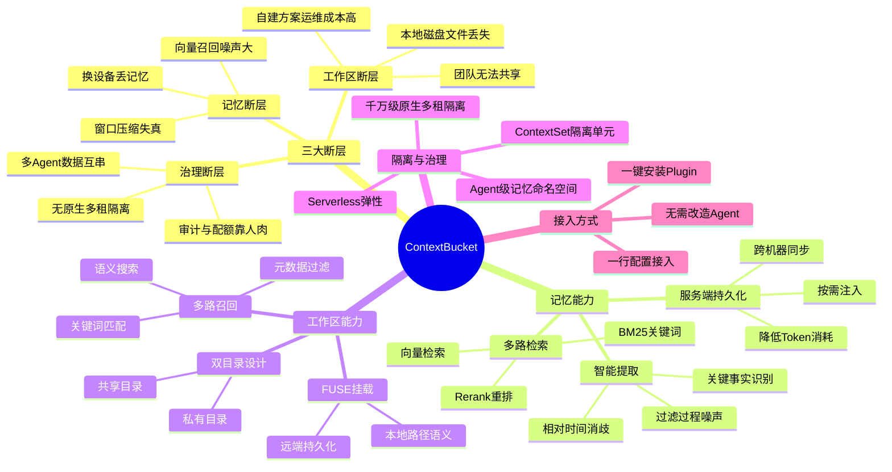
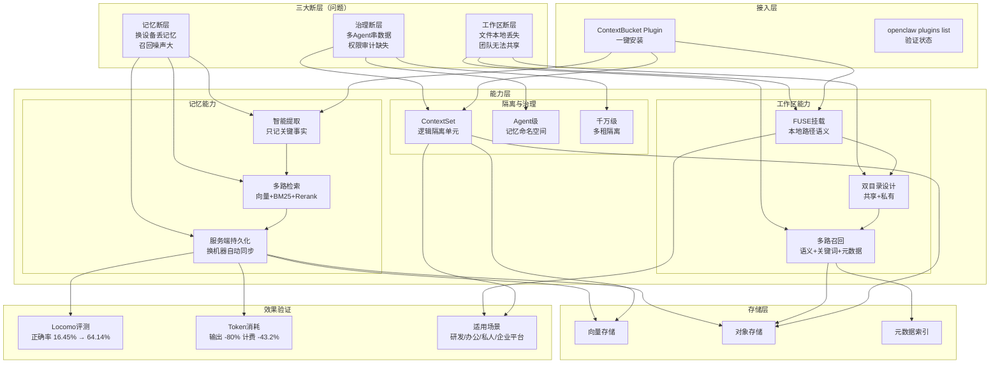

# ContextBucket：Agent 无限记忆与工作区底座

> **原文链接**: https://mp.weixin.qq.com/s/Wm6XT5afRNk7N3WZGI9VMA

> **原标题**: ContextBucket：Agent 的"无限"记忆与工作区底座
> **一句话总结**: ContextBucket 是火山引擎推出的 Agent 上下文托管底座，在同一服务层内统一记忆管理与工作区文件存储，解决 Agent 生产化过程中记忆断层、工作区断层、治理断层三大核心问题，实测将长程对话正确率从 16.45% 提升至 64.14%。
> **前置知识检查**: - [ ] 了解 Agent 的基本概念与运行机制 - [ ] 理解向量检索（Embedding）与 BM25 关键词检索的基本原理 - [ ] 了解 FUSE 文件系统挂载的基本概念 - [ ] 熟悉 Rerank 重排序在检索链路中的作用 - [ ] 了解多租户隔离的基本概念

## 原文

### 背景与挑战：Agent 进入生产环境后的上下文困境

过去一年，Agent 正在从聊天 demo 走向生产系统：进入研发流水线写代码、嵌入运营平台做分析、接入客服后台处理工单。它们不再是开几轮对话就关掉的玩具，而是要在终端、协作工具和企业系统里长期运行的常驻进程。随之被推到台前的是一个看似基础、却长期被绕开的问题：**Agent 的上下文——它记住的事实、它操作过的文件、它产出的中间结果——应该存在哪里？**

过去一年的工程实践基本是"拼装"：记忆挂到自建向量库或自建记忆产品，文件落本地磁盘或对象存储，多租隔离自行实现一套。在 demo 阶段可以跑通，规模化后则同时暴露三类问题：记忆随会话和实例丢失、文件无法跨端共享、权限与审计缺失。维护这条上下文链路的工程量，正在反超 Agent 业务逻辑本身。

**根因不在某个组件，而在于 Agent 的"脑子"和"手"被强行拆在了两套独立的存储体系里**，具体表现为三类断层：

**记忆断层**：存在向量库或本地 SQLite，换设备就丢、窗口压缩后召回失真；只用向量检索"既不准也不省"——召回噪声大，关键决策被相似讨论淹没。

**工作区断层**：代码/配置/项目文档/运行产物全在本地磁盘，换机器就没，团队无法共享；自建 FUSE + 对象存储的拼装方案运维成本高。

**治理断层**：多 Agent 跑同机互相串数据；多用户、多团队没有原生隔离；迁移、审计、配额全靠人肉拼装，开发者最后不是在做 Agent，而是在维护一条上下文管道。

三类断层叠加，使 Agent 的记忆和工作区始终无法收敛到同一个底座——这正是 ContextBucket 试图回答的问题。

### 产品能力：一个底座，两种能力

**ContextBucket** 是火山引擎提供的托管服务，在同一套服务层内提供文件存储、记忆管理、混合检索、多租隔离与 Serverless 弹性。Agent 侧通过 **ContextBucket Plugin** 一键接入即可获得全部能力，无需分别对接向量库、对象存储与记忆中间件。每个 Agent 或用户对应一个 **ContextSet**（逻辑隔离单元），记忆与工作区文件在同一 ContextSet 下共享凭证与端点。

整体架构自上而下分为**接入层、能力层与存储层**三层。

### 记忆：记得准、找得到、带得走

#### 记得准：智能提取，只记事实

OpenClaw 的对话流里夹杂着大量过程噪声——反复讨论、方案对比、代码试错、被否决的提案。若这些内容被等量沉淀进记忆库，污染不可避免，检索精度也会随之下降。

ContextBucket 在写入侧做一次过滤：仅自动识别并提取对话中的**关键事实**——需求决策、技术结论、用户偏好。过程性的方案讨论、被否决的提案、代码试错不再等量保存；"昨天""上周"一类相对时间表达进行特殊处理，避免后续召回时产生歧义。

**举例**：你让 OpenClaw 帮你重构一个微服务，聊了整整两天——讨论了三种接口拆分方案，权衡后选了按领域拆分；评估了 gRPC 和 REST，最终决定核心链路用 gRPC；定了错误码规范；确认了灰度按流量比例滚动发布。没有智能提取的话，所有对话内容都会被存成记忆，下次你问"灰度策略怎么定的"，检索出来的可能是讨论过程中的某段代码片段或某个被否决的方案。有了智能提取，存下来的只有最终结论。

#### 找得到：多路检索，精准召回

ContextBucket 采用**向量 + BM25 双路检索 + Rerank 重排**把决策结论排到前列；新会话首次交互时会额外触发一轮宽泛召回，避免关键上下文因提问模糊而被遗漏。

**举例**：你问 OpenClaw"上次决定核心链路用 gRPC 的依据是什么"。纯向量检索可能返回讨论 gRPC 时的多段对话，其中夹杂着性能担忧、学习成本质疑、对比示例代码——但真正的决策只有一段。混合检索把关键词、语义和排序合在一起看，让 Agent 拿到的是结论，而不是一堆沾边的过程。

#### 带得走：服务端存储，易迁移，超大容量，低成本

记忆数据存储于 ContextBucket **服务端**，而非 Agent 所在的本地磁盘。换机器、换环境，只要用同一个 `user_id` 接入，历史记忆即刻可用；容量也不再受本地窗口约束，按需检索、按需注入即可。

在 Locomo 评测中，这一存储形态对应的端到端收益是 **LLM 输出 Token 下降 80%、计费 Token 下降 43.2%**。

**实际场景**：你在公司电脑上用 OpenClaw 做了一周项目调研，积累了大量技术决策和需求理解。周末想在家里的电脑上继续，过去要么手动复制记忆文件，要么从头再来；现在两台机器装上插件、共用同一个 `user_id`，记忆自动同步，回到家直接续上。团队场景同理：成员各跑各的 Agent，但项目相关的技术决策、架构约定、编码规范共享同一份记忆，不必每次重复交代背景。

### 工作区：文件可持久化，工作流不断

#### 文件远端持久化，不随本地环境丢失

ContextBucket 在同一个 ContextSet 内同时支持 `memory` 与 `workspace` 两种场景——创建时声明 `scenes: ['memory', 'workspace']`，记忆数据与工作区文件即可共享同一套凭证与端点，无需再分别对接记忆服务与文件存储。

工作区分为两个目录，兼顾协作与性能：共享目录用于团队文件共享，私有目录保证各 Agent 的独立工作空间。

**场景**：你让 OpenClaw 写了一个数据处理脚本，跑完结果保存在工作区。第二天电脑重启，文件还在。换台电脑，重新挂载工作区，文件还在。同事要复用你的脚本，从共享目录直接拿，不用你手动传。

#### 工作流跨 Agent 无缝迁移

ContextBucket 通过 **FUSE 挂载**将工作区目录映射为本地文件系统，代码生成、文件编辑、项目构建等操作沿用本地路径语义，Agent 侧无需感知底层差异；实际数据则持久化在 ContextBucket，跨机器只需重新挂载即可续接。

隔离在两个层次同时生效：底座侧提供**租户级隔离**，Plugin 侧叠加 **Agent 级记忆隔离**——主 Agent、命名 Agent、子 Agent 各自拥有独立的记忆命名空间，互不串扰。

**举例**：同时跑研究、编码、测试三个 Agent：研究 Agent 的记忆不会污染编码 Agent 的上下文，编码 Agent 生成的文件也不会覆盖测试 Agent 的产物。需要跨 Agent 查询时，通过 `agentId` 参数显式访问即可。

#### 工作区也能多路召回：语义 + 关键词 + 元数据

工作区并非冷存储——文件存在远端，Agent 仍需在写代码、改配置、查文档时做到问得到、找得准。ContextBucket 将记忆侧的检索能力下沉至底座，工作区文件直接复用同一条召回链路，仅把第三路替换为更贴合文件场景的路径与元数据匹配。

**三路并行召回**：
- **向量检索**：按语义找到功能相近的代码段、文档段
- **BM25 关键词**：精准命中函数名、配置项、错误码
- **路径/元数据匹配**：按目录、文件名、修改时间定位

**Rerank + 按需注入**：三路结果合并后由 Rerank 统一重排，按 Token 预算只注入最相关的若干片段，而不是整个文件灌进上下文。大仓库、长文档也能稳定命中关键内容。

对外接口与记忆侧保持一致：工作区文件和记忆事实可以在同一次检索请求里联合返回，Agent 不必区分"该问记忆还是该问文件"。

### 接入形态：一键安装，一行配置接入

接入 ContextBucket 只需两步——一键安装与验证插件状态。向量库对接、FUSE 挂载、多租隔离均在 Plugin 安装期完成，Agent 侧无需任何额外改造。

安装完成后，执行 `openclaw plugins list` 验证插件是否正确注册。列表中能看到 ContextBucket 相关插件且状态正常，即视为安装成功。

### 性能验证：Locomo 长程对话评测

**Locomo** 是学术界常用的长程多轮对话评测集，包含跨会话的事件、偏好、关系等记忆类问题，专门用于衡量 Agent 在长周期任务中的记忆能力。

测试结果：回答正确率从 **16.45% 跳到 64.14%**，提升近 **48 个百分点**。核心原因是记忆不再全量灌入上下文，而是经过**提取 -> 检索 -> 筛选**后按需注入。LLM 输出 Token 减少 **80%**，计费 Token 总量减少 **43.2%**，成本也随之下降。

### 适用场景

**研发 Agent**：代码、设计文档、依赖配置、CI 结果、排障记录长期共存于工作区；架构决策、Code Review 结论、踩坑经验沉淀为团队记忆。跨设备接续开发、跨成员复用经验是刚需。

**办公/流程 Agent**：会议纪要、周报、项目背景、审批材料、历史决策需要跨会话延续。每次重新交代背景成本极高，稳定的长期上下文直接决定 Agent 能否真正接管流程。

**终端助手/私人 Agent**：用户偏好、常用资料、历史任务和本地文件需要长期积累。手机、电脑、车机多端切换时，记忆和工作产物不能断层。

**企业 Copilot 平台**：多个 Agent、多个团队、多个租户共存时，权限隔离、配额治理、可审计性会比单 Agent 体验更早成为瓶颈。ContextBucket 的千万级原生隔离正是为这一阶段设计。

这四类场景的共同特征是：上下文规模大、生命周期长、跨端跨人协作、需要审计与隔离。一旦 Agent 进入其中任一场景，记忆与工作区便不再是可选项，而是绕不开的底层依赖。

### 总结与展望

ContextBucket 以一个托管底座同时收敛了 Agent 的三类断层：

- **解决记忆断层**：向量 + BM25 + Rerank 多路检索；服务端持久化，跨机器带得走；正确率 16.45% -> 64.14%（↑ 47.69%）
- **解决工作区断层**：FUSE 挂载，接近本地文件系统体验；语义 + 关键词 + 元数据多路召回；工作流跨 Agent/跨实例无缝迁移
- **解决治理断层**：ContextSet 千万级原生多租隔离；统一凭证与接入点，审计链路清晰；Serverless 零运维，5 分钟跑通

未来演进方向：
- **更智能检索**：引入图谱关联与时序感知，记忆侧与工作区侧检索能力对齐
- **更开放生态**：扩展 Plugin 生态，支持 LangChain、Hermes 等更多框架；开放 ContextSet API

## 核心概念脑图

## 与你已有知识的关联

**《[[个人学习/LLM大模型类相关知识/深入理解OpenClaw技术架构与实现原理（上）|深入理解OpenClaw技术架构与实现原理（上）]]》**：本文中 ContextBucket 作为 OpenClaw 的上下文底座出现，文中多次以 OpenClaw 的实际使用场景举例。读过 OpenClaw 架构后，能理解 ContextBucket 在 Agent 框架中处于存储与检索层的位置——它替代了原本需要分别对接的向量库、对象存储和记忆中间件，将上下文的"存"和"取"统一收敛到一个托管服务中。

**《[[个人学习/LLM大模型类相关知识/AI Agent系列｜深入解析Function Calling、MCP和Skills的本质差异与最佳实践|AI Agent系列｜深入解析Function Calling、MCP和Skills的本质差异与最佳实践]]》**：Function Calling、MCP 和 Skills 解决的是 Agent "能做什么"的问题，而 ContextBucket 解决的是 Agent "记住什么、在哪工作"的问题。两者是正交的——前者是 Agent 的行动能力，后者是 Agent 的状态底座。理解这一区别有助于构建完整的 Agent 能力矩阵：行动层（工具/协议）+ 状态层（记忆/工作区）。

**《[[个人学习/LLM大模型类相关知识/企业级 Agent 多智能体架构与选型指南|企业级 Agent 多智能体架构与选型指南]]》**：本文第四类场景"企业 Copilot 平台"与该文章直接呼应。多 Agent 架构面临的核心挑战之一就是记忆和工作区的隔离与共享，ContextBucket 的 ContextSet + Agent 级命名空间设计恰好提供了一套工程化方案。将两者结合阅读，可以形成从架构选型到底座实施的完整视图。

**《[[个人学习/LLM大模型类相关知识/如何构建和调优高可用性的Agent？浅谈阿里云服务领域Agent构建的方法论|如何构建和调优高可用性的Agent？浅谈阿里云服务领域Agent构建的方法论]]》**：该文章讨论 Agent 高可用性方法论，而本文揭示了一个常被忽视的高可用维度——上下文持久性。Agent 在生产环境中的"可用"不仅是服务不宕机，更包括记忆不丢失、工作区不中断。ContextBucket 的跨机器记忆同步和 FUSE 工作区持久化，正是 Agent 上下文高可用的工程实现。

**《[[个人学习/LLM大模型类相关知识/Skills：从编程工具的配角到Agent研发的核心|Skills：从编程工具的配角到Agent研发的核心]]》**：Skills 是将 Agent 能力模块化、可复用的范式，而 ContextBucket 的价值在于为这些 Skills 提供统一的记忆和工作区底座。当一个 Skill 执行完后，它的产出（代码、配置、结论）应该持久化在 ContextBucket 中，供后续 Skill 或其他 Agent 复用。两者结合能构建出"技能可组合、状态可延续"的 Agent 系统。

**《[[个人学习/LLM大模型类相关知识/AgentSkillsTeams 架构演进过程及技术选型之道|AgentSkillsTeams 架构演进过程及技术选型之道]]》**：该文章讨论 Agent 团队的架构演进，而 ContextBucket 的 Agent 级记忆隔离和多租户治理恰好解决了团队协作场景下的核心矛盾——如何在共享与隔离之间取得平衡。团队成员需要共享项目决策和编码规范，但各自的实验性工作区又需要独立。

## 重难点理解

**1. 为什么"记忆"和"工作区"要收敛到同一个底座？**

通俗解释：可以把 Agent 想象成一个远程办公的员工。记忆是他的"脑子"——记住老板的需求、团队的决策、个人的偏好；工作区是他的"电脑桌面"——代码文件、配置文档、运行产物。如果这两个东西存在两套不互通的系统里（比如记忆在云端、文件在本地），每次换电脑就像换了一个失忆的员工——记得的事丢了、写的文件也没了。ContextBucket 相当于给这个员工配了一间"云办公室"，脑子里的记忆和桌面上的文件都存在同一个地方，走到哪都能接着干活。

**2. 智能提取 vs 全量保存：为什么"少即是多"？**

通俗解释：如果把 Agent 的每句对话都存成记忆，就像把开会时的所有闲聊、跑题、争论、推翻重来的过程都写进会议纪要。下次查纪要时，真正重要的决策反而被淹没在噪音里。ContextBucket 的智能提取相当于一个优秀的会议记录员——只记结论和决策，不记废话和过程。本质上是"写入时多做一步过滤，换取检索时少做十步筛选"。

**3. 向量检索 + BM25 + Rerank 为什么比纯向量检索好？**

通俗解释：向量检索像"找感觉相似的"——它能理解语义，但容易把沾边的东西都捞回来；BM25 像"精确匹配关键词"——函数名、配置项、错误码这类精确文本，关键词匹配更准；Rerank 像"最终评审"——把两路捞回来的结果重新排序，把最相关推到最前面。三者组合就像海选（向量）+ 定向筛选（BM25）+ 决赛排名（Rerank），比任何单一路径都准。

**4. FUSE 挂载为什么重要？**

通俗解释：FUSE（Filesystem in Userspace）允许在用户空间实现文件系统。ContextBucket 通过 FUSE 把云端的工作区"伪装"成本地的一个文件夹，Agent 读写文件时跟操作本地文件完全一样，完全不用改代码。但底层数据实际存在云端，换台电脑重新挂载就能接着用。这就像 iCloud/OneDrive 的同步盘，但它面向的是 Agent 程序而不是人类用户，且集成了语义检索能力。

**5. 为什么 Locomo 评测中正确率从 16.45% 跳到 64.14%？**

通俗解释：16.45% 的基线意味着没有记忆管理时，Agent 基本在"瞎猜"——要么上下文窗口塞不下所有历史，要么塞进去了但信息被噪声淹没。接入 ContextBucket 后，记忆经过"智能提取（只记结论）+ 多路检索（精准召回）+ Rerank 重排（结论排前）+ 按需注入（只给最相关的）"四步处理，Agent 拿到的是精炼过的核心信息而非原始对话记录，判断依据清晰了，正确率自然大幅提升。Token 消耗下降 80% 也印证了信息密度的大幅提升——原来是"在一堆沙子里找金子"，现在是"直接给金子"。

## 原文内容流程图

## 经验

1. **Agent 生产化的瓶颈不在模型能力，而在上下文治理。** 模型本身能推理、能生成，但如果每次对话都是"失忆"状态，再强的模型也只能在单次会话内发挥作用。把上下文的"存、取、隔离、同步"做成基础设施，投入产出比远高于继续微调模型。

2. **"写入侧过滤"比"检索侧降噪"更高效。** ContextBucket 在记忆写入时就做智能提取，只保存关键事实而非原始对话——这比把所有内容都存进去再靠检索算法筛选要有效得多。类比数据库设计：好的 Schema 设计（写入约束）远比复杂的查询优化（读取优化）更能保证数据质量。

3. **混合检索是工程实践中的最优解，不要迷信单一技术路线。** 纯向量检索的语义理解能力强但不精准，纯关键词匹配精准但缺乏语义理解。向量 + BM25 + Rerank 的组合已经被 ContextBucket 的 Locomo 评测验证（正确率提升 48 个百分点），这是一个可复用的检索架构模式。

4. **FUSE 挂载是连接 Agent 与云存储的最佳抽象层。** Agent 框架已经习惯了本地文件系统操作，让 Agent 改代码去对接对象存储 API 成本极高。FUSE 挂载在不改变 Agent 代码的前提下实现了云端持久化，是典型的"在正确抽象层解决问题"。

5. **隔离不是可选项，是生产环境的硬门槛。** Demo 阶段一个 Agent 跑一台机器不是问题，但生产环境中多 Agent、多用户、多团队共存时，没有原生隔离意味着数据泄露和互相污染。ContextBucket 的 ContextSet + Agent 级命名空间设计值得借鉴——隔离粒度既不能太粗（团队间隔离不够）也不能太细（共享成本太高）。

## 知识

**知识卡片 1：Agent 上下文的三类断层**
- 记忆断层：记忆存储在本地或会话级，换设备、换会话即丢失；纯向量检索召回噪声大
- 工作区断层：代码/配置/产物在本地磁盘，跨机器不可用，团队无法共享
- 治理断层：多 Agent 无隔离、多租户无原生支持、审计链路缺失
- 根因：Agent 的"记忆"和"工作区"被拆分在两套独立存储体系中

**知识卡片 2：多路检索架构（向量 + BM25 + Rerank）**
- 向量检索：基于 Embedding 的语义相似度匹配，优势是理解语义，劣势是精确匹配弱
- BM25：基于词频-逆文档频率的关键词匹配，优势是精准命中术语，劣势是缺乏语义理解
- Rerank：对两路结果合并后重新打分排序，将最相关结果推到前列
- 组合效果：Locomo 评测正确率从 16.45% → 64.14%

**知识卡片 3：ContextSet 隔离模型**
- ContextSet：逻辑隔离单元，一个 Agent 或用户对应一个 ContextSet
- 记忆与工作区共享同一 ContextSet 的凭证和端点
- 两层隔离：底座侧租户级隔离 + Plugin 侧 Agent 级记忆命名空间
- 跨 Agent 查询通过 agentId 参数显式访问

**知识卡片 4：工作区多路召回三通道**
- 向量检索：语义匹配代码段、文档段
- BM25 关键词：精确命中函数名、配置项、错误码
- 路径/元数据匹配：按目录、文件名、修改时间定位
- 三路结果合并后 Rerank 重排，按 Token 预算按需注入

**知识卡片 5：FUSE 文件系统挂载**
- 将 ContextBucket 云端工作区映射为本地文件系统路径
- Agent 沿用本地文件操作语义，无需感知底层存储差异
- 实际数据持久化在服务端，跨机器重新挂载即可续接
- 兼顾协作（共享目录）与性能（私有目录）

## 可复用建议

1. **在自建 Agent 系统时，优先将上下文存储设计为独立的、可插拔的底座服务**，而不是耦合在 Agent 逻辑内部。参考 ContextBucket 的 ContextSet 概念——每个用户/Agent 一个逻辑隔离单元，统一管理记忆和文件。

2. **检索链路不要只用向量检索**。即使在资源有限的情况下，也应该至少实现"向量 + 关键词"双路召回，有条件的加上 Rerank 重排。这个组合已被验证在长程记忆场景有显著收益。

3. **记忆写入时做结构化提取，不要存储原始对话**。用一个轻量的 LLM 调用在写入侧将对话提炼为"主体-关系-事实"三元组或关键决策摘要，存储成本更低，检索精度更高。

4. **工作区文件也应纳入检索范围**。Agent 不仅需要"回忆说过什么"，还需要"找到写过什么"。将文件的语义索引和元数据索引统一到同一条检索链路中，Agent 才能做到一次提问同时捞回记忆和文件。

5. **从一开始就设计隔离机制**，而不是后期补丁式添加。即使是单用户场景，也应预留 ContextSet 或类似的多租户抽象，避免后期重构。隔离粒度参考：租户级（组织间隔离）> 用户级（成员间隔离）> Agent 级（Agent 间隔离）。

## 实施办法

**第一步：评估当前 Agent 系统的上下文成熟度**
对照三类断层（记忆、工作区、治理）逐一评估你的 Agent 系统：
- 记忆是否在换设备/换会话后丢失？
- 工作区文件是否只能在本地访问？
- 多 Agent 之间是否有隔离？多用户是否有权限控制？
如果任一答案为"是"，则上下文底座建设应提上日程。

**第二步：选择实施方案**
- **使用 ContextBucket（托管方案）**：如果是火山引擎生态用户，直接通过 Plugin 一键接入，5 分钟跑通。适合希望零运维、快速验证的场景。
- **自建方案**：参考 ContextBucket 的架构设计自建。核心组件包括：向量数据库（如 Milvus/Qdrant）+ 对象存储（如 MinIO/S3）+ FUSE 文件系统层 + BM25 检索引擎（如 Elasticsearch）+ Rerank 模型。

**第三步：分阶段落地**
- **Phase 1（1-2 周）**：实现记忆的服务端持久化。将会话记忆从本地 SQLite/文件迁移到服务端数据库，验证跨设备同步能力。
- **Phase 2（2-3 周）**：接入多路检索。在向量检索基础上增加 BM25 关键词检索和 Rerank 重排，用 Locomo 或自建评测集验证检索精度提升。
- **Phase 3（1-2 周）**：实现工作区 FUSE 挂载。将 Agent 工作目录通过 FUSE 映射到远端存储，验证跨机器续写能力。
- **Phase 4（1 周）**：配置隔离与治理。按 ContextSet 模型建立多租户隔离，配置审计日志和配额管理。

**第四步：建立评测基准**
参考 Locomo 评测方式，建立自己的长程对话评测集。核心指标：记忆召回正确率（是否找到正确上下文）、Token 消耗（上下文注入效率）、跨设备续写成功率（工作区持久化效果）。