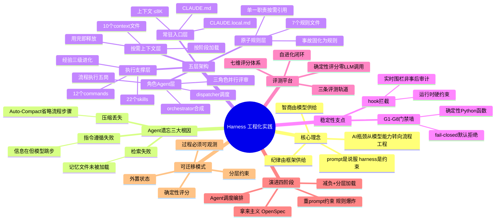
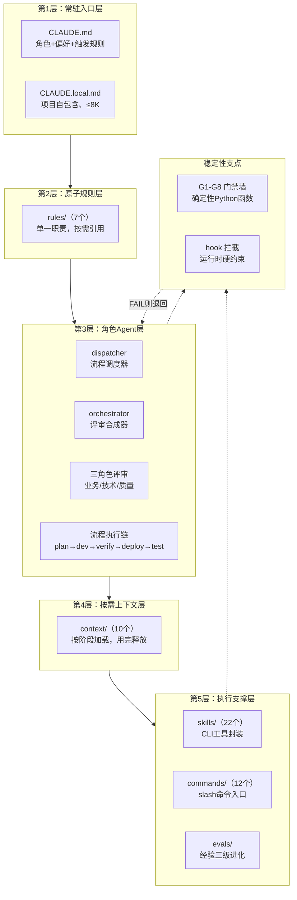
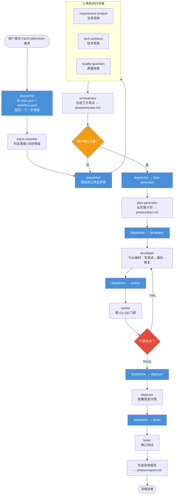

---
tags:
  - tech-article
  - AI
  - Agent
  - Harness
  - 工程化
  - 上下文管理
  - 门禁
  - Claude-Code
created: 2026-06-15
category: 技术文章/AI
aliases:
  - Harness 工程化实践
  - AI不缺智商缺纪律
---

# Harness 工程化：五层架构与门禁阻断实践

> **一句话总结**: AI Coding 的瓶颈正从「模型能力」转移到「流程工程」——模型已足够聪明但不稳定，稳定性必须由外部框架（harness）供给。本文提供了一套可抄的 harness 分层架构、一个把流程当被测对象的评测方法，以及 4 条用代价换来的踩坑教训。

> **前置知识检查**:
> - [ ] 了解 Claude Code 的基本使用方式（CLAUDE.md、hooks、agents）
> - [ ] 理解 LLM 上下文窗口与注意力机制的基本概念（如 "Lost in the Middle" 现象）
> - [ ] 对 AI Agent / Multi-Agent 架构有初步认知
> - [ ] 了解软件开发流程中的 CI/CD、代码评审、TDD 等概念
> - [ ] 理解状态机的基本概念

## 原文

（作者：杜学友，原文链接：https://mp.weixin.qq.com/s/HoStCq53XElBlbLU6uPTJA）

### 引言

**核心观点**：AI Coding 的瓶颈正从「模型能力」转移到「流程工程」——模型已经足够聪明，但不稳定，而稳定性必须由外部框架供给。

作者曾用一个不断膨胀的 CLAUDE.md 解决 AI "不守纪律"的问题——把所有规矩写进去：先写单测、部署前评审、提交前合 master。它确实管用了三天，然后问题以更严重的形式回来了：规则多到"撑爆"上下文，模型读完规则就没"脑容量"读代码，于是它开始遗忘、串味、自我矛盾。

**核心教训**：对付 AI 的不确定性，堆 prompt 是负债，做框架才是资产。

---

### 01 harness 是什么，它到底解决什么

**harness = 把「AI 该怎么干活」固化成可执行、可约束、可评测的工程框架。**

它与"写更好的 prompt"有本质区别：prompt 是一次性的说服，harness 是结构性的约束。模型供给智商，harness 供给纪律。

AI 编码的三个痛点及其根因：

1. **Agent「遗忘」流程步骤** —— 压缩丢失（Auto-Compact 省略"看似不重要"的流程步骤）
2. **上下文爆炸** —— 检索失败（记忆文件在但没被加载进上下文）
3. **不遵守规则** —— 指令遵循失败（信息都在但模型仍然跳步）

VILA-Lab 对 Claude Code 的逆向工程揭示：Claude Code 的记忆完全基于文件系统（CLAUDE.md + JSONL 日志），没有向量数据库、没有 Embedding。上下文管理靠一条 5 层渐进式压缩管线——从裁剪低优先级提示、截断工具输出，一直到最后的全量模型摘要（Auto-Compact），流程状态细节恰恰会在最后一层被丢失。Devin 的 CPO 也坦言：当记忆达到数千条时，如何在正确的时机检索到正确的记忆——"尚未解决"。

**Agent「遗忘」不是 bug，是当前架构的必然代价。**

**harness 的三层设计恰好对应三个根因逐一堵漏**：

| 根因 | Harness 对策 |
|------|-------------|
| 压缩丢失 | 状态持久化（文件系统外置状态，不依赖上下文记忆） |
| 检索失败 | 规则外置（按需加载，不常驻上下文） |
| 指令遵循失败 | 门禁阻断（确定性代码检查，fail-closed） |

---

### 02 搭建：我的 harness 长什么样

核心设计思想：**把上下文当预算来管理**。分层的唯一标准不是"按功能分类"，而是"按何时被读取"——常驻的极小，深的按需加载。

#### 2.1 常驻入口层：CLAUDE.md + CLAUDE.local.md

放角色、代码偏好、流程触发规则、G1–G8 门禁速查。关键设计是 CLAUDE.local.md 自包含、不依赖全局 @import：新项目接入只需拷一份模版进去就能独立运作。

- 解决：每个项目的流程规范彼此隔离、互不串味。
- 效果：主会话常驻上下文压到 ≤8K，把宝贵窗口留给真正的代码。

#### 2.2 原子规则层：rules/（7 个）

每个规则单一职责、可被按需引用。本质是把踩过的坑固化成强制约束。

**每条规则都是一次事故的墓志铭。** 坑只踩一次，之后由规则兜底——这是 harness 最朴素也最值钱的复利。

#### 2.3 角色 Agent 层：agents/

这是全套框架的发动机，把一个"全能主会话"拆成一条职责清晰的流水线：

- **流程调度**：dispatcher 读 state.json + workflow.yaml，决定下一步该调谁——交通警察，只管路由不管业务。
- **评审合成**：orchestrator 读三角色写入 phases/*.md 的观点，合成结论并向用户确认——会议秘书，只管合成不管调度。
- **三角色评审**：requirement-analyst（业务）/ tech-architect（技术）/ quality-guardian（质量），各写各的观点段，互不污染。
- **流程执行**：plan-generator → developer → verifier → deployer → tester，从方案到验收一步一岗。

**核心判断：主会话应该退化成一个「什么都不想、只执行 dispatcher 指令」的纯执行器。** 全能恰恰是污染之源。主会话不是能力不足，而是职责收窄，像微服务里的 thin controller。

这套"薄主会话"靠三条铁律落地：
1. 主会话只听 dispatcher：dispatcher 读 state.json 返回"下一步调谁"，主会话照做，禁止自己 Read phases/*.md / evidence.json
2. 职责隔离：每个 agent 的可用工具严格受限
3. 上下文 ≤8K：主会话只加载 CLAUDE.md + 触发规则 + 最近一条 dispatcher 指令

**真正需要警惕的不是「agent 多」，是「agent 间耦合多」。** 输入输出是清晰的文件/JSON、不需要会话协商，数量就不是问题。

架构后来从 24 agent 精简：intent-classifier / debate-moderator / pre-mortem 等节点合并入主干 agent，精简冗余的中间调度层，在保留核心约束的前提下降低了协调成本和单 agent 规则密度。

#### 2.4 按需上下文层：context/（10 个）

完整流程详情、Pre-Mortem 模板、对抗辩论模板、证据链规范、TDD/ATDD 指南、记忆进化机制全放这层，只在进入对应阶段时才被 Read。

**设计原则：上下文不是越大越好的「免费缓冲区」，是需要精心管理的稀缺资源。** 每份 context 只含该阶段所需最小集，用完即释放，不占后续窗口。

理论支撑：
- LLM 注意力呈 U 型分布，中部信息准确率显著下降（Stanford "Lost in the Middle", TACL 2024）
- 声称支持 32K+ 的模型仅半数能在该长度保持可靠性能（NVIDIA RULER）

#### 2.5 执行支撑层：skills/（22 个）+ commands/（12 个）+ evals/

- **skills/**：把内部 CLI 和研发工具链封装成 AI 可调用的能力。核心是 ubase 全家桶：一句"帮我看下日志"就能自动拼 SLS 查询、做时间窗口换算、把命中结果聚类成异常摘要。
- **commands/**：slash 命令入口。/init-harness 一键接入、/harness-audit 体检、/learn 沉淀规则。
- **经验三级进化（auto-learn）**：lesson（单次记录）→ pattern（跨项目归纳）→ instinct（自动注入所有新项目规则）。每一级晋升都需人工确认，防止错误经验扩散。

#### 2.6 稳定性支点：eval 检测 + hook 拦截

让 harness 真正稳定的不是规则本身，是验证机制。arxiv 2605.29682 的研究发现：原始 token 消耗仅解释 agent 成功率方差的 R²=0.33~0.42，而验证反馈质量达到 R²=0.94~0.99。

两个机制：
- **G1–G8 门禁墙**（eval 式硬校验）：每个门禁是确定性的 Python 函数，检查产物存不存在、编译过不过、单测通没通。任一 gate FAIL 则流程退回——不是"建议"，是"阻断"。
- **hook 拦截**（运行时硬约束）：状态文件写操作只允许编排层 agent 触发；危险操作（git push --force、rm -rf）弹确认。

**核心原则：流程强制执行必须从 LLM 推理中外置到确定性基础设施。** 不能依赖模型"记住"该执行哪个步骤——门禁必须是确定性代码，独立于上下文窗口，fail-closed（默认拒绝，只放行显式允许的操作）。

#### 贯穿五层的主线：19 节点链 × G1–G8 门禁 × intent×risk 动态裁剪

完整的 19 节点标准研发链路：

`需求评审 → 需求确认 → 方案设计 → 方案确认 → Pre-Mortem → 实施计划 → 验收标准确认 → 拉变更 → 建分支 → 建 worktree → 开发 → 编译 → 单测 → ATDD → 证据链 → 部署预发 → 接口测试 → 上线确认 → 验收报告`

但绝不是每个需求都走全 19 步——由意图 × 风险动态裁剪：
- QUERY：不要求任何产物（满分）
- BUG_FIX / LOW：只查 5 个节点
- FEATURE / HIGH：查满 19 个节点

外加硬规则——**"改完必部署"**：只要检测到真实业务代码改动，自动把部署预发、接口测试追加为必需节点。

当前边界：G8（生产上线）节点不强制，由人兜底——因为生产发布涉及的灰度策略、流量切换、线上回归，出错成本远高于让 AI 自主操作的效率收益。

完整流转示例（FEATURE/HIGH）：

`主会话 → dispatcher（读 state.json，返回"下一步调谁"）→ intent-classifier 判定意图×风险 → dispatcher → 三角色并行评审 → orchestrator 合成 → 用户确认方案 → dispatcher → plan-generator 出实施计划 → dispatcher → developer 按 TDD 编码 → dispatcher → verifier 跑 G1–G8 门禁 → dispatcher → deployer 部署预发 → dispatcher → tester 接口测试 → 验收报告`

全程主会话没「思考」过任何业务细节，它只是 dispatcher 指令的执行器。

---

### 03 打磨：从「能用」到「好用」的关键几跳

**第一阶段 · 拿来主义**：用 oh-my-claudecode、everything-claude-code 等社区项目的 OpenSpec 规范直接上手。碰到天花板：通用规范覆盖不了自己的开发流程，边界情况全靠临场补丁。

触发词：**每次要写的额外 prompt 比规范本身还长时，就意味着该自己造了。**

**第二阶段 · 重 prompt 约束**：把所有流程规矩写进 CLAUDE.md。三天后崩了——不听话（选择性遵守）、上下文爆炸（规则挤占代码空间）、自我矛盾（规则间冲突）。

**核心教训：prompt 约束是说服，不是强制。模型"理解"了规则不等于"遵守"了规则——你无法用更多的字来对抗概率性的遗忘。**

**第三阶段 · 减负 + 分层加载**：把常驻 prompt 从"全流程指令手册"砍到只剩角色定义 + 触发规则，压到 ≤8K。深度内容移到 context/ 层，按需加载。效果立竿见影——但长程会话中规则仍被逐渐稀释到注意力衰减区。

**第四阶段 · Agent 调度编排**：不再约束模型"你该怎么做"，而是让不同的 agent 各司其职、互相制衡。dispatcher 作为大脑只负责"算下一步该谁上场"，其他 agent 各管一段。

一次高强度全天重构验证了这个架构：状态外置、决策收敛给 dispatcher，即使单次会话崩了、上下文被压缩了，状态不丢、流程能续。

#### 为什么选文件交接而不是现成编排

Claude Code 原生提供 Workflow 和 Agent Team 两种多 agent 机制，作者逐一试过后走了第三条路。核心原因：**harness 本质上是控制平面，不是计算平面。**

| 机制 | 为什么不行 | 适合什么 |
|------|-----------|---------|
| Workflow | 超时机制（Bash 120s 默认超时，长构建被静默杀死）；无 askUser 交互原语；跨 session 不可续 | 单阶段、无人工交互、可在超时窗口内完成的计算任务（如三角色并行评审） |
| Agent Team | 松散协调无确定性工序保证；状态散落无统一 state.json；SendMessage 是"通知"不是"阻断" | 多人并行改多模块，不适合严格工序链 |
| dispatcher + 文件交接 | 天然持久化（进程崩了文件还在）；可审计（git diff 看清每步产物）；强一致性（单写者 + schema 校验） | 有状态工序链 + 人工门禁 + 跨天续跑 |

**结论：三种机制正交互补。** Workflow 管计算平面，Team 管协作平面，dispatcher + 文件交接管控制平面。

四条踩坑教训（每条已固化成规则）：

1. **文件交接必须用 ajv schema 强校验** —— 否则 agent A 写了错误格式、agent B 读了垃圾
2. **hook 拦截写操作只允许编排层 agent** —— 否则 agent 可能篡改他人产物
3. **长构建必须拆分步骤** —— 否则超时被静默杀死后拿到的只是 null 返回
4. **Maven 仓库不能太"干净"** —— 空隔离仓库依赖全解析失败；共享本地缓存才能跑通

---

### 04 评测：把流程作为被测对象

评测平台的设计原点：**评测平台是评估者，不是执行者。** 它只检测被试 claude 是否走完了 harness 的每个节点（产物在不在、门禁过没过），而绝不替它去执行部署或测试。

平台按「用 harness 的三种姿势」分成三条轨道：

1. **裸用**（不用 harness，直接提需求给 Claude Code）
2. **部分用**（只套 harness 但不强制所有门禁）
3. **全量用**（严格走 harness 全流程）

#### 七维评分体系

设计参考了四个来源：SWE-bench、AgentBench、Anthropic Eval Guide、CMMI。最终融合成 7 个维度：

1. **流程完整性（22%）**—— 产物文件在不在？按 intent×risk 裁剪必需节点
2. **代码正确性（22%）**—— 用 Maven + JDK 真编译、真跑单测
3. **门禁通过率**—— G1–G8 各 gate 的 PASS/FAIL 统计
4. **诚实度差距**—— 对比 evidence.json 的自报结果和真实编译结果
5. **时间效率**—— 从需求到验收的总耗时
6. **Token 效率**—— 总 token 消耗量
7. **可恢复性**—— 中断后能否从状态文件恢复继续

代码正确性防注水：用 Maven + JDK 真编译真跑。还会计算"诚实度差距"（honesty gap）—— AI 声称 G3 通过但编译其实挂了，这个差距就会暴露。

评测环境的一个反直觉坑：最初图"干净"，给评测配了空的隔离 Maven 仓库，结果依赖全解析失败、恒为 0 分；换回共享本地 6.9G 的 `~/.m2` 缓存离线复用才跑通。**评测环境越"干净"，反而越不真实。**

#### 为什么是确定性评分，不用 LLM 评委

**宁要可复现的「粗糙分」，不要会漂移的「精准分」。** 评测的唯一目的是驱动迭代——只有 3 次跑分完全一致，才能回答"这次改规范到底变好还是变坏"。一个偶尔波动 ±5 分的 LLM 评委，再"精准"也会让 A/B 对比彻底失去意义。

评分引擎用 100% Python 确定性逻辑、零 LLM 调用、3 次跑分 hash 完全一致。

#### 自进化闭环

创建（AI 生成 / fork）→ 评测对比（7 维 × 多 case）→ 激活基线（留备份可回退）→ 收集弱项维度再优化。甚至让 AI 拿"好配置"去改"待优化配置"生成候选版本——用 AI 优化约束 AI 的规则，再用确定性分数验证优化是否有效。

---

### 05 还能怎么提升：诚实的代价与边界

**判断：这套系统最大的风险不在于「不够准」，在于「假装它覆盖了一切」。** 明确欠账：

- 生产上线（G8）节点尚未纳入强制流程，由人兜底
- 评测 case 数量有限，覆盖的场景不够广
- harness 本身对非结构化/创意类任务不适用
- agent 间文件交接的 IO 开销（每次切换需 Read ~2-5K tokens）
- 并行能力受限于文件交接的序列化特性

值得关注的业界前沿方向：

- **结构化记忆层**：VikingMem（VLDB 2026, ByteDance）证明更少的 Token 留存 + 更智能的组织 > 全量保留（16.82% Token 留存得分 75.80，朴素 RAG 100% 留存仅 63.81）。Sverklo 的双时态记忆可以让 harness 精确回答「在 commit X 时 Agent 知道什么」。
- **代码知识图谱**：Codebase-Memory-MCP 通过多轮 AST 分析构建持久化知识图谱，Agent 可通过图查询获取调用链、依赖关系，无需逐文件扫描。
- **编排形态 A/B 对比**：正在做 v-agentwf-nodecomp（agent 编排）vs v-dynwf（dynamic workflow）——由评测分数决定优劣，不靠拍脑袋，而由数据说话。

---

### 06 结语：一个可迁移的模式

这两个月最大的收获是一个可以搬到别处的思维模式：

**任何「能力够强但输出不稳定、且过程可观测」的 AI 工作流，都可以被这样工程化——给它分层的约束、外置的状态、确定性的评分，让每一次改动都能被证明是进步还是退步。**

边界也很清楚：这个模式依赖「过程可观测」。如果 AI 任务的中间产物无法落盘、无法检测（比如纯创意生成），这套打法就会失效；而它的价值也会随模型进化而衰减——当模型强到能自我保证流程纪律的那天，harness 就该功成身退。

**在那一天还没来之前，我们这些工程师的主场依然清晰——模型负责聪明，我们负责让它守纪律。**

---

### 参考资料

[1] VILA-Lab 对 Claude Code 的逆向工程：[https://github.com/VILA-Lab/Dive-into-Claude-Code]()
[2] Latent Space 播客：https://www.latent.space/p/cognition
[3] The Age of Async Agents — Cognition's Walden Yan & OpenInspect's Cole Murray：https://www.latent.space/p/cognition
[4] Lost in the Middle: How Language Models Use Long Contexts：https://arxiv.org/abs/2307.03172
[5] RULER: What's the Real Context Size of Your Long-Context Language Models?：https://arxiv.org/abs/2404.06654
[6] Scaling Laws for Agent Harnesses via Effective Feedback Compute：https://arxiv.org/abs/2605.29682
[7] sd0x-dev-flow：https://github.com/sd0xdev/sd0x-dev-flow
[8] VikingMem（VLDB 2026, ByteDance）：https://arxiv.org/html/2605.29640v1
[9] Sverklo：https://github.com/sverklo/sverklo
[10] Codebase-Memory-MCP：https://github.com/DeusData/codebase-memory-mcp

## 核心概念脑图

## 与你已有知识的关联

本文与你的 LLM 大模型类知识库中的以下文章高度相关：

**《[[个人学习/LLM大模型类相关知识/AgentSkillsTeams 架构演进过程及技术选型之道|AgentSkillsTeams]]》**：本文的 harness 五层架构（特别是 Agent 层和 Skills 层）与该文讨论的 Agent/Skills/Teams 演化路径直接呼应。那篇文章从"领域知识注入 + 记忆管理"两大需求驱动架构演化，本文则从"上下文预算管理 + 流程纪律"角度提供了工程落地实践。两篇合读可形成从理论到实践的完整视角。

**《[[个人学习/LLM大模型类相关知识/AI Agent系列｜深入解析Function Calling、MCP和Skills的本质差异与最佳实践|AI Agent系列]]》**：本文的 skills/ 层（22 个 skills，包含 ubase 全家桶、dev1-5 全链路等）是该文"Skills 在 Agent 研发场景中的核心价值"论断的具体案例。本文还展示了 Skills 如何通过经验三级进化（lesson→pattern→instinct）实现自我优化。

**《[[个人学习/LLM大模型类相关知识/企业级 Agent 多智能体架构与选型指南|企业级多智能体]]》**：该文强调"单智能体优先"的务实原则，而本文正是在"单智能体（重 prompt）崩了之后"转向多智能体编排的真实案例。该文还讨论了 Supervisor、Handoffs 等模式，与本文的 dispatcher 状态机模式可互为参照。

**《[[个人学习/LLM大模型类相关知识/如何构建和调优高可用性的Agent？浅谈阿里云服务领域Agent构建的方法论|高可用性Agent]]》**：该文讨论 Agent 的可用性调优方法论，本文的评测平台（七维评分 + 确定性逻辑）提供了具体的"可量化调优"手段，将"好不好"的主观判断变成了"分数多少"的客观对比。

## 重难点理解

### 1. "主会话应该退化成一个纯执行器" —— 反直觉但关键

**通俗解释**：想象一个公司的 CEO，如果她既要制定战略、又要审批报销、还要亲自写代码，结果就是什么都做不好。正确的做法是 CEO 只做一件事：看 dashboard（state.json），然后说"下一步该谁上"（调 dispatcher 返回的 agent）。业务细节全交给专职 VP 们。

**难点**：这与我们"让 AI 更全能"的本能相悖。但"全能"恰恰是上下文污染之源——主会话知道的越多，越容易在长对话中混乱。

### 2. 上下文是"预算"不是"草稿纸" —— 分层加载的本质

**通俗解释**：你的工作记忆（working memory）是有限的。如果你同时记着 20 件事，每件事的质量都会下降。正确的做法是：只在需要时才把相关资料"搬到桌上"，用完就收走。

**难点**：LLM 宣称支持 128K 上下文，但这不意味着你应该填满它。"Lost in the Middle" 研究表明注意力呈 U 型分布，中间部分的信息准确率会显著下降。填满上下文的代价不是"慢一点"，而是"会犯错"。

### 3. 文件交接 vs 消息传递 —— 控制平面的正确打开方式

**通俗解释**：消息传递像两个人打电话——挂了电话，刚才说的内容就没了，而且两个人可能同时说话导致信息混乱。文件交接像两个人通过工作文档协作——A 写完一页，B 打开读，永远不会同时写同一页，而且文档永远在。

**难点**：消息传递（Agent Team 的 SendMessage）看起来更"现代化"，但它的本质是"通知"而非"阻断"，无法做到 hook 级硬围栏。控制平面需要的是确定性和可审计性，而文件系统天然提供这两者。

### 4. 门禁必须是确定性代码，不能依赖 LLM 判断

**通俗解释**：你不能让犯人自己当法官。如果让 LLM 判断"我有没有按流程走"，它可能会说"走了"（实际上跳过了）。门禁必须是 Python 脚本检查文件是否存在、编译是否通过——这些是 0/1 判断，不可能"糊弄"。

**难点**：很多人觉得 LLM 打分"更懂语义、更准"，但这恰恰是陷阱——LLM 的评分会漂移。评测的唯一目的是 A/B 对比，而对比的前提是可复现。宁要粗糙但稳定的分数，不要精准但漂移的分数。

### 5. 经验三级进化（lesson→pattern→instinct）—— harness 的复利引擎

**通俗解释**：第一次踩坑 = 记一笔（lesson：mvn -am 在这台 Mac 上卡死了）；第二次又遇到 = 发现规律（pattern：Mac + system-scope 依赖 = 禁用 -am）；第三次验证后 = 写进宪法（instinct：自动注入所有新项目的 build.md）。每一级都需要人工确认，防止错误经验扩散。

**难点**：这本质上是一个知识管理闭环——不是让 AI 自动学习（那会导致错误传播），而是让人类做质量把关、AI 做传播执行。

## 原文内容流程图

### Harness 五层架构总览

### FEATURE/HIGH 需求完整调度流程

## 经验

1. **堆 prompt 是负债，做框架才是资产** —— 用更多字去约束 AI 是一条死路。prompt 是"说服"，模型理解不等于遵守；框架是"强制"，不遵守就阻断。

2. **上下文是稀缺资源，需要像预算一样管理** —— 不是"能塞多少塞多少"，而是"只在该出现的时候出现"。分层标准不是按功能分类，而是按"何时被读取"。

3. **"主会话只做执行器"是反直觉但正确的设计** —— 本能上我们想让主模型更全能，但全能恰恰是上下文污染的根源。职责收窄（thin controller 模式）是保证稳定性的关键。

4. **门禁必须是确定性代码，不能依赖 LLM 判断** —— 让 LLM 检查自己有没有按流程走 = 让犯人当法官。门禁必须是 Python 脚本检查文件是否存在、编译是否通过——0/1 判断，不可糊弄。

5. **评测的唯一目的是 A/B 对比，所以可复现比精准更重要** —— 宁要 3 次完全一致的粗糙分，不要会漂移 ±5 分的 LLM 精准分。后者会让"改完变好还是变坏"这个问题无法回答。

6. **"文件交接"在控制平面场景下优于消息传递** —— 文件系统天然提供持久化（进程崩了状态还在）、可审计（git diff 看清每步）、强一致性（单写者 + schema 校验）三个硬优势。

7. **Knowledge 需要闭环：踩坑 → 记录 → 归纳模式 → 自动注入规则** —— harness 的复利来自于"坑只踩一次"。但晋升必须人工确认，防止错误经验自动扩散。

## 知识

| 知识点 | 类别 | 说明 |
|--------|------|------|
| **Harness** | 核心概念 | 将「AI 该怎么干活」固化成可执行、可约束、可评测的工程框架。与 prompt 的本质区别：prompt 是说服，harness 是约束。 |
| **Agent 遗忘三重根因** | 理论 | 压缩丢失（Auto-Compact）、检索失败（记忆未被加载）、指令遵循失败（信息在但跳步）。非 bug，是当前架构的必然代价。 |
| **上下文预算管理** | 方法论 | 分层标准是"按何时被读取"而非"按功能分类"。常驻极小（≤8K），深度内容按需加载、用完释放。 |
| **Lost in the Middle** | 理论 | Stanford 研究：LLM 注意力呈 U 型分布，中部信息的准确率显著下降。填满上下文的代价不是"慢"而是"错"。 |
| **Thin Controller 模式** | 架构模式 | 主会话退化为纯执行器，只执行 dispatcher 指令。类比微服务中的 thin controller——不是能力不足，而是职责收窄。 |
| **dispatcher 状态机** | 架构模式 | 用文件系统做 agent 间交接（A 写 phases/05-design.md，B 读它），天然持久化 + 可审计 + 强一致性。 |
| **确定性门禁（Deterministic Gates）** | 工程实践 | G1-G8 门禁是确定性 Python 函数，检查产物/编译/单测。fail-closed：默认拒绝，只放行显式允许的操作。 |
| **Effective Feedback Compute** | 理论 | arxiv 2605.29682：验证反馈质量解释 agent 成功率方差的 R²=0.94~0.99，远超 token 消耗的 R²=0.33~0.42。 |
| **七维评分体系** | 方法论 | 流程完整性 + 代码正确性 + 门禁通过率 + 诚实度差距 + 时间效率 + Token 效率 + 可恢复性。100% Python 确定性逻辑，零 LLM 调用。 |
| **经验三级进化** | 工程实践 | lesson（单次记录）→ pattern（跨项目归纳）→ instinct（自动注入所有新项目）。每级晋升需人工确认。 |
| **intent×risk 动态裁剪** | 工程实践 | QUERY 无产物要求、BUG_FIX/LOW 查 5 节点、FEATURE/HIGH 查满 19 节点。外加"改完必部署"硬规则。 |
| **hook 拦截** | 工程实践 | Claude Code hook 在工具调用执行前拦截：状态文件只允许编排层 agent 写入；危险操作弹确认。实时围栏而非事后审计。 |
| **Honesty Gap（诚实度差距）** | 度量指标 | 对比 evidence.json 的自报结果与真实编译结果，暴露 AI "声称通过但实际失败"的诚实问题。 |

## 可复用建议

1. **新项目接入 AI 编码流程时，不要一开始就写巨型 CLAUDE.md**。先用最小的常驻配置（角色 + 触发规则，≤8K），跑几天看哪些场景 AI 反复出错，再把那些坑固化成原子规则。规则应该是"长出来的"，不是"设计出来的"。

2. **如果 AI 开始"选择性遵守规则"，不要加更多规则，而是做两件事**：a) 检查常驻上下文是否超过 8K，如果超过先减负；b) 把最常被跳过的规则从 prompt 迁移到 hook/gate 级别的硬约束。

3. **对于需要跨天、有人工确认、单步耗时长的研发流程，优先考虑 dispatcher + 文件交接模式**。Workflow 适合单阶段高并行计算，Agent Team 适合多人并行改多模块。让每种机制做它擅长的事。

4. **建立你自己的评测体系（哪怕只有 3-5 个维度）**，核心是：a) 确定性评分（不用 LLM 打分）；b) 产物文件存在性检查（文件系统不会说谎）；c) 真编译真跑测试（不能只看 AI 说"通过了"）。只有能复现的分数才能驱动迭代。

5. **踩坑后别只修 bug，要追一级**：先记录 lesson → 下次再遇到归纳为 pattern → 验证后晋升 instinct 并自动注入规则。每一级晋升都人工确认。这是 harness "越用越聪明"的复利引擎。

6. **Maven/Gradle 构建的评测环境不要用空隔离仓库**，复用自己的 `~/.m2` 缓存。评测环境越"干净"反而越不真实——依赖全解析失败的噪音会淹没真正的代码正确性信号。

## 实施办法

以下是一套从零搭建个人 harness 的最小可行步骤：

### 第1步：建立最小常驻配置（1-2天）

- 创建 `CLAUDE.md`：只放角色定义、代码偏好、2-3 条最核心的触发规则。
- 创建 `CLAUDE.local.md`：项目特有的流程规范，自包含、不依赖全局 @import。
- 目标：常驻上下文 ≤ 8K tokens。
- 验证：跑一次日常开发任务，确认 AI 不再遗忘核心规则。

### 第2步：建立原子规则层（1周，随踩坑迭代）

- 创建 `rules/` 目录，每条规则一个文件，单一职责。
- 规则来源：实际开发中 AI 反复出错的场景。
- 每个规则文件包含：触发条件 + 强制操作 + 为什么要有这条规则（事故记录）。
- 示例规则：`always-write-test-first.md`（先写单测）、`no-force-push.md`（禁止 git push --force）。

### 第3步：搭建流程调度（2周）

- 创建 `state.json`：记录当前阶段、产物路径、门禁状态。
- 创建 `workflow.yaml`：定义节点链和触发条件。
- 创建 `dispatcher` agent：读 state.json → 返回"下一步调谁"。
- 主会话改为：收到任务 → 调 dispatcher → 照做。
- 先只支持最简单的 BUG_FIX 流程（5 个节点），跑通后再加 FEATURE 流程。

### 第4步：建立门禁墙（1周）

- 实现 G1-G8 门禁的 Python 脚本（从最关键的 3-4 个开始）。
- G1（产物存在）、G3（编译通过）、G5（单测通过）是最低配置。
- 配置 hook 拦截：状态文件只允许 dispatcher 写入；危险命令弹确认。
- 验证：故意让 AI 跳过一个步骤，确认门禁能阻断。

### 第5步：建立评测机制（1周）

- 编写评测脚本：检查产物文件存在性 + 真编译 + 真跑单测。
- 至少覆盖 3-5 个典型 case（BUG_FIX × 1, FEATURE/LOW × 1, FEATURE/MEDIUM × 1）。
- 确保 3 次跑分完全一致（确定性评分）。
- 建立基线分数，后续每次改 harness 配置后跑评测对比。

### 第6步：持续迭代（长期）

- 每次踩坑走经验三级进化：lesson → pattern → instinct。
- 每次改 harness 后跑评测，对比基线。
- 定期 `/harness-audit` 体检配置健康度。
- 根据 intent×risk 动态裁剪节点链，避免"一刀切"的流程过重/过轻。