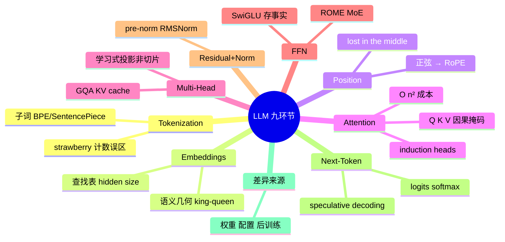
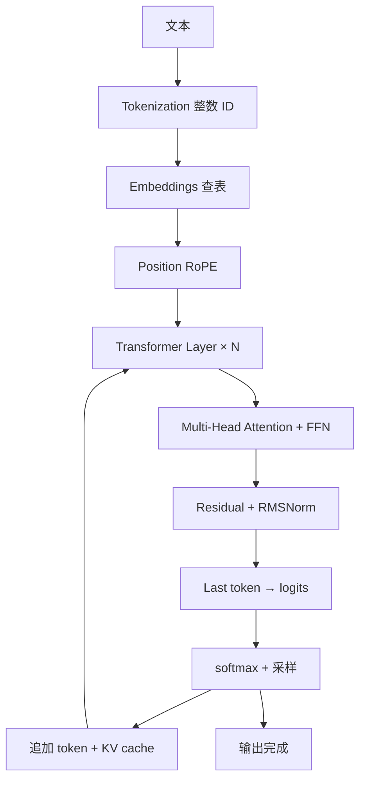

---
tags:
  - tech-article
  - AI
  - LLM
  - Transformer
  - Attention
  - Tokenization
  - 大模型原理
created: 2026-06-11
category: 技术文章/AI
aliases:
  - How LLMs Actually Work
  - LLM内部机制九环节
  - Transformer精读
---

# How LLMs Actually Work：Transformer 九环节内部机制精读

> **原文链接**: [https://mp.weixin.qq.com/s/GHBEntLs618_fMz0ZWG5gg](https://mp.weixin.qq.com/s/GHBEntLs618_fMz0ZWG5gg)

> **原标题**: How LLMs Actually Work：一篇值得精读的 LLM 内部机制长文

> **一句话总结**: 0xkato 原文用九个环节（分词→嵌入→位置编码→注意力→多头→FFN→残差归一化→下一词预测→架构vs权重）串起现代 Transformer LLM，纠正多头「切片」误读，并纳入 RoPE、GQA、MoE、induction heads 等演进。

> **前置知识检查**:
> - [ ] 了解神经网络与向量基本概念
> - [ ] 知道 GPT 类模型是「预测下一个 token」
> - [ ] 可选：读过 Attention Is All You Need 摘要

## 原文

**
原文：How LLMs Actually Work[1]，作者 0xkato。本报告忠实还原原文的论述结构和核心内容，不做超出原文的扩展；个别处补充的背景说明会明确标注。

**TL;DR**：这篇文章用九个环节把一个 transformer-based LLM 从输入到输出拆了一遍：分词、嵌入、位置编码、注意力、多头注意力、前馈网络、残差流与归一化、下一词预测循环，最后落在"架构 vs 权重"的辨析上。作者刻意避开数学推导，但没有为了通俗牺牲准确性——文中纠正了几个流传很广的错误理解（比如多头注意力的"切片"误读），还把 induction heads、ROME、speculative decoding 这些研究前沿织进了入门叙事里。它的核心论点是：现代 LLM 共享同一套 transformer 家族骨架，模型之间的差异来自训练数据、配置规模和后训练，读懂这套骨架就能读懂大部分模型论文和 model card。

## 一、这篇文章讲什么，为什么值得读

市面上讲 transformer 的文章很多，大部分要么是论文复述（满屏公式劝退非研究者），要么是过度简化的比喻（读完仍然不知道模型里到底发生了什么）。这篇文章选了中间路线：不写公式，但每个机制都讲到"为什么需要它、它解决了什么问题、现代模型怎么改进了它"这一层。作者在开头就把目标说清楚了——读完之后，你应该能打开任何一篇现代 LLM 论文或 model card，知道每一节在讲架构的哪个部件。

文章另一个特点是穿插了大量 "Tiny explainer"（微型解释框），把 token ID、向量、softmax 这些术语随用随解释，让没有 ML 背景的读者也能跟上。本报告按原文九个环节的顺序展开。

## 二、分词（Tokenization）：模型读的是整数，不是文字

模型不直接读文本，它读的是整数 ID。把你的 prompt 转换成整数序列的步骤叫分词：tokenizer 接收一个字符串，输出一串整数，每个整数指向一个固定词表里的条目。现代 LLM 的词表通常有几万到几十万个条目。

token 通常不是完整的单词，而是子词片段。"tokenization" 可能被切成 ["token", "ization"]，"running" 可能切成 ["run", "ning"]。这么做是出于效率权衡：整词词表太大，而且对没见过的新词无能为力；字符级词表又太小，逼着模型从零学习最简单的拼写模式。子词分词取中间值——最常见的片段成为单个 token，罕见词和新词由更小的片段拼出来。

这个权衡会在意想不到的地方暴露出来。经典例子是问 LLM "strawberry 里有几个 R"，早期模型经常答错。原文特意澄清：这不是模型不会数数，而是模型根本不在字母层面操作——它看到的只是 token ID，而这些 ID 恰好拼出了一个人类会逐字母拆开的词。

不同模型家族用不同的 tokenizer。GPT 系用 BPE（Byte Pair Encoding）变体，LLaMA 系常用 SentencePiece。tokenizer 的选择影响计算量（token 越少计算越省）和多语言覆盖，但基本形态一致：文本进，整数出。

## 三、嵌入（Embeddings）：整数如何获得意义

token ID 比如 `1024` 只是一个行号，本身没有任何含义。赋予它意义的是一张巨大的查找表——嵌入矩阵。每个模型都有一张：词表里每个条目对应一行，每行是一个长长的数字向量。向量的长度就是模型的 hidden size，在很多 7B 级模型里是 4096 个数字，更大的模型用更宽的向量。

tokenizer 把整数交给模型后，模型查出对应的那一行，之后就用这个向量代替整数参与所有计算。这个向量就是 token 的嵌入，是模型在训练中学到的"这个 token 意味着什么"的表示。

嵌入有个有意思的性质：语义相近的 token 最终会得到相近的向量。"king" 的向量在空间中靠近 "queen"，"Paris" 靠近 "France"。这些位置关系没有任何人去硬编码，它们是模型在海量文本上训练时自发涌现的——因为这样的几何结构有助于预测文本。你甚至可以对嵌入做算术，有时候真的成立，最著名的例子是 `king − man + woman ≈ queen`。

但原文在这一节末尾点出了一个关键缺口：嵌入只编码了 token 是什么，完全不知道 token 在序列里的位置。"dog" 排在 prompt 第一个词还是第五个词，它的嵌入向量一模一样。这是个问题，需要下一个部件来填补。

## 四、位置编码：从正弦波到 RoPE

朴素的自注意力机制没有内建的词序概念。没有位置信号的话，模型无法直接知道 "dog" 在 "bites" 前面还是后面——而词序决定句意，谁咬谁完全不同。

2017 年的原始 transformer 论文（Vaswani et al.）的做法是给每个位置分配一套独有的数字模式，直接加到该位置 token 的嵌入上。位置 1 一种模式，位置 5 另一种，位置 100 又一种，模式来自不同频率的正弦和余弦波。这样 "dog" 在位置 1 和位置 5 的最终向量就不一样了。选正弦编码的部分原因是它能外推到训练时没见过的序列长度。

但这种加法式方案在模型规模化之后暴露出两个问题。其一，嵌入向量得在同一组数字里同时承载语义和位置，容量有限。其二，学习式的绝对位置嵌入泛化得不干净——如果训练时 prompt 最长 2048 个 token，位置 5000 的嵌入就从来没被正经学过。

现代模型大多改用旋转位置编码（RoPE，Su et al. 2021），LLaMA、Mistral、Gemma、Qwen 等主流开放权重家族全在用。它的直觉是：不再往 token 向量里加位置信息，而是按 token 的位置把 Query 和 Key 向量旋转一个角度——位置 1 转一小下，位置 100 转一大圈。之后做注意力比较时，真正起作用的是两个 token 旋转角度的差值，这个差值恰好编码了它们相距多远。RoPE 的实际优势有三点：天然编码相对位置（这更接近注意力真正需要的东西）、对长上下文泛化更好、不增加任何参数。

即便有了好的位置编码，原文也提醒读者：现代 LLM 仍有被文献记录的 "lost in the middle" 问题（Liu et al. 2023）——长 prompt 开头和结尾的信息被利用得比中间的可靠。这就是为什么"重要上下文放前面""关键信息在结尾重复一遍"这类 prompt 工程技巧真的有效：模型并没有均匀地利用你 prompt 的每个部分。

## 五、注意力：Q、K、V 与因果掩码

这是给整个架构命名的机制。在每个 transformer 层里，注意力只做一件事：让每个 token 查看它被允许看到的其他 token，并决定哪些对接下来的预测重要。

实现方式是让每个 token 同时扮演三个角色，被变换成三个新向量：Query、Key、Value。Query 问"我在找什么"，Key 答"我能提供什么给来找我的 token"，Value 携带"匹配成功时真正被传递的信息"。同一个 token 同时扮演全部三个角色，而 Q、K、V 的变换矩阵是学出来的，所以模型在训练中自己摸索出每个 token 该找什么、该提供什么。

匹配通过相似度打分完成：每个 token 的 Query 和它能看到的所有 token 的 Key 做缩放点积，直觉上衡量两个向量的对齐程度（缩放是为了让数值在 softmax 前保持稳定）。然后 softmax 把这些分数变成总和为 1 的权重，权重再用来对 Value 向量做加权平均。

原文用了一个很清晰的例子。句子 "The cat that I saw yesterday was sleeping"，模型处理到 "was" 时需要搞清楚是什么在睡觉。"was" 的 Query 和各 token 的 Key 比较：和 "cat" 的点积高——因为模型学到了 "was" 这类动词需要主语，而 "cat" 这类主语产生的 Key 恰好和它对得上；和 "yesterday" 的点积低。softmax 之后 "cat" 拿到高权重，加权求和时 "cat" 的 Value 主导了结果。于是 "was" 的新表示主要由 "cat" 塑造——隔了好几个位置的 token 就这样成了指代对象。

GPT 式语言模型有个特有约束：从左到右生成。位置 5 的 token 只能注意位置 1 到 5，不能看 6、7、8——那些还没生成。这叫因果掩码（causal masking），实现很简单：把未来 token 的匹配分数压到极低，softmax 之后权重实际为零。

这一节还提到了可解释性研究里最有意思的发现之一：induction heads（Anthropic，2022）。这类特化的注意力头学会了识别 prompt 中 "A B … A" 形态的模式并预测 B 接着出现——第二次看到 A 时，induction head 回看 A 上次出现的位置，看它后面跟了什么，然后照抄。它们是 in-context learning（模型从你的 prompt 里现学模式并续写的能力）目前已知最清晰的机制之一。

注意力有一个大代价：完整注意力中每个 token 要和所有可见 token 比较，prompt 长度翻倍，计算量大约翻四倍。这就是长 prompt 贵的原因，也是 FlashAttention、稀疏注意力、线性注意力这些效率研究的动机。

## 六、多头注意力：多个视角，以及 GQA

单次注意力只给模型一种"哪些 token 对哪些 token 重要"的判断方式。这不够——语言里同时发生着多种关系：主谓一致、代词与其指代的名字、跨句的长程引用、词序和局部短语。多头注意力的解法是并行跑很多次注意力，每个并行通道（称为一个头）在自己的小空间里运算。

原文在这里专门纠正了一个连许多教程都讲错的细节：每个头拿到的不是原始 token 向量的一个字面切片。每个头有自己学出来的投影矩阵，把完整的 token 向量映射到属于它自己的更小的 Q、K、V 向量。如果模型每个 token 4096 维、有 32 个头，每个头通常在 128 维空间里工作——但这 128 个数字是对完整 4096 维的学习式投影，不是固定切块。是同一个 token 的不同"视角"，不是不同"碎块"。

每个头独立跑完注意力后，所有头的输出拼接起来，再过一个最终的线性层混合回完整尺寸的向量，这个混合层也是学出来的。有趣的是不同的头经常发展出部分特化——没人告诉每个头该干什么，特化在训练中自然涌现。研究者发现过追踪语法的头（把动词连到宾语、冠词连到名词）、分辨代词指代的头、追踪位置模式的头、induction heads 等等。一层可能 32 个头，前沿模型几十层，所以一个典型 LLM 总共有数千个注意力头，各自贡献一种学到的视角。

这一节最后落在一个实际成本问题上，它推动了近年的一次架构变化。每个头需要为所有已生成的 token 保留 Key 和 Value 向量，这样生成新 token 时不必从头重算一遍——这就是 KV cache，长上下文推理的主要内存开销。现代 decoder-only LLM 大多用 Grouped-Query Attention（GQA）变体：不是每个头都有自己的 K/V，而是多组 query 头共享同一套 key/value 头。LLaMA-2 70B 有 64 个 query 头但只有 8 个 KV 头，Mistral 7B 是 32 比 8。效果是精度几乎不损失，但内存压力和推理成本大幅下降。

## 七、前馈网络：参数最多、存"事实"的地方

注意力让 token 之间交换完信息后，每一层还有第二个步骤，讨论度远不如注意力但同样重要：前馈网络（FFN）。如果说注意力是 token 之间互相交谈，FFN 就是每个 token 独自做深加工——它在每个 token 的向量上独立运行，没有任何跨 token 的混合。

FFN 按顺序做三件事：先把 token 向量扩张到更大尺寸（原始 transformer 用 4 倍，现代 SwiGLU 模型的扩张比例各有不同），然后施加一个非线性函数，最后压缩回原始尺寸。中间那个非线性步骤值得专门理解：非线性是"把输入掰弯"的函数，最简单的 ReLU 把负数归零、正数原样通过。没有它，FFN 就只是两个线性层叠在一起——而纯线性运算的堆叠会坍缩，两个线性层在数学上等价于一个，一百个也还是等价于一个。非线性阻止了这种坍缩，是 FFN 能做出比单次矩阵乘法更丰富计算的原因。原始 transformer 用 ReLU，GPT 和 BERT 换成 GELU，LLaMA、Mistral、PaLM 这代用 SwiGLU——扩张再压缩的结构没变，迭代的一直是中间的非线性。

稠密 transformer 的大部分参数住在 FFN 里，不在注意力里。而且这些参数不是泛泛的——模型存储的事实和语义结构有相当部分就在这里。研究者发现 FFN 内部某些神经元和特定概念或事实强关联：一个神经元对埃菲尔铁塔相关文本强烈激活，另一个对编程语言，还有的对过去式动词。模型"知道"巴黎是法国首都，这个事实就表示在特定层的 FFN 权重和激活里。

这个"存储记忆"的性质有个有趣的推论：可以不重训模型、直接编辑某些事实。ROME（Rank-One Model Editing）这类方法能通过对特定 FFN 权重矩阵做一次有针对性的低秩修改，把"埃菲尔铁塔在巴黎"改成"埃菲尔铁塔在罗马"，之后模型生成的文本倾向于和被编辑后的关联保持一致。

这一节最后讲了 MoE（Mixture of Experts）。一些现代前沿模型开始把稠密 FFN 换成多个并行的 FFN（称为专家），由一个很小的路由网络决定每个 token 交给哪几个专家处理。Mixtral 8x7B 每层 8 个专家，每个 token 只激活 2 个：总参数 46.7B，但每个 token 只用约 12.9B。总参数量大幅上升，但每 token 的计算量增长慢得多——这就是在不让推理成本同比例膨胀的前提下继续扩大参数规模的办法。

## 八、残差流与层归一化:深层网络训得动的原因

残差流是让模型"做加法"而不是"做替换"的机制。注意力或 FFN 跑完之后，结果通常不会替换掉 token 原来的向量，而是加到它上面，逐位置相加：新向量 = 旧向量 + 子块输出。跨越三十层、五十层、一百层，每层的贡献是累加的而不是覆盖的。这个运行中的累加和就叫残差流，它有个奇特的性质：最初的输入嵌入始终有一条直达深层的加法通路，和沿途每个子块的贡献混在一起。

残差连接不是为 transformer 发明的，它来自 ResNet（He et al. 2015），最初用于图像识别。当时的动机是深层网络根本训不动——训练信号反向传播穿过太多层之后变得太弱（有时太强），模型没法从自己的错误中学习。加一条捷径让信号能从输出直接流回输入，突然之间几百层的网络就能训了。transformer 继承了同一个技巧。在现代可解释性研究里，残差流已经成为核心研究对象：每个组件——每个注意力头、每个 FFN、甚至最后的 unembedding 步骤——都从残差流读取，再写回残差流。

第二个部件层归一化的存在理由要实际得多：没有它残差流不稳定。数字流过几十次加法后倾向于要么爆炸要么塌缩到零，两种情况训练都会失败。层归一化在子块之间把每个 token 的向量拉回受控范围。这里有两个演进值得记下。一是归一化的位置：2017 年原始 transformer 在每个子块之后归一化（post-norm），浅模型没问题，深了就难训；现代 transformer（GPT-2 起，LLaMA、Mistral）普遍改在子块之前（pre-norm），这是让超深 transformer 变得好训的改动之一。二是函数本身：很多现代开放模型（LLaMA、Mistral、Gemma、Phi）用更简单的 RMSNorm——原始层归一化做两件事，先把向量移向零点再缩放大小，RMSNorm 砍掉移动只留缩放，经验上缩放承担了大部分收益，计算还更便宜。

原文给这一节的收尾很准确：这是整个架构里最不光鲜的机械部件。没有残差连接，极深的模型几乎训不动；没有层归一化，累加和会爆炸或塌缩。两者都有，才有几百层深的模型。

## 九、下一词预测：循环本身

所有层的注意力和 FFN 处理结束后，序列里每个 token 都有了一个最终向量。生成时，预测下一个词只取最后一个 token 的最终向量。这个向量被转换成"每个候选 token 一个分数"——词表 10 万就有 10 万个数字。这些数字叫 logits，还不是概率，可正可负、大小不限。softmax 把 logits 变成对下一个 token 的概率分布——还是之前那个 softmax，只是用在了模型的不同位置。

模型通常不会每次都选概率最高的那个 token。解码参数控制输出的确定性和多样性：temperature 调整分布的尖锐程度，top-k 和 top-p 把候选限制在最合理的范围内。这就是同一个模型在某些设置下显得精确、另一些设置下更有创造性的原因。

选出一个 token 之后，它被追加到输入末尾，模型在更长的序列上跑下一步——通常复用 KV cache，不必从头重算整个前缀。新 token 的新注意力、新 FFN、新最终向量、新预测。循环持续到模型吐出终止符或撞到长度上限。一整段文字就是这个循环一次一个 token 跑出来的。

原文在这里强调了一个容易被忽略的事实：预测下一个 token 这个单一目标，就是 base LLM 的全部训练信号。base 模型不直接针对事实准确性、对话能力、推理或写代码训练，它只在海量文本上训练"预测下一个 token"。指令遵循、偏好对齐、安全行为这些是后训练在 base 之上调出来的。

这一节还介绍了一个重要的效率创新：speculative decoding（投机解码）。一个小而快的草稿模型先往前猜若干个 token，大模型并行验证。猜中的（在大模型概率下可接受的）直接采纳，猜错的回退到大模型自己算。做对了的话，输出分布和单独跑大模型完全一致，但循环可以快得多。

## 十、架构 vs 训练权重：GPT、Claude、Gemini 到底差在哪

走完九个环节之后，原文回答开篇的问题：GPT、Claude、Gemini、LLaMA 之间到底什么不同？公开细节有限，专有模型不会公布每个架构选择，但在这篇文章覆盖的层面上，它们大体坐落在同一个 transformer 家族设计空间里：分词、嵌入、位置编码、堆叠的 transformer 层（每层多头注意力 + FFN）、残差流、层归一化、下一词预测。

模型之间真正变化的是三样东西：训练出来的权重本身（不同数据、不同规模学出来的数字）；配置（层数、词表大小、头数、参数量、MoE 还是稠密）；后训练（指令微调、人类反馈、安全控制）。

原文还给出了一个值得记住的观察：2023–2025 年的"现代 transformer"技术栈在众多前沿和开放权重模型之间收敛到了一组共同选择——pre-norm、RMSNorm、RoPE、SwiGLU、GQA，最大的那些模型加上 MoE——尽管不同团队是各自独立走到这些选择的。这些东西不是一次发明的，是在 2017 年原始设计之上经过约五年的打磨逐渐累积下来的。

## 十一、未来走向与本文评价

原文最后一节指出，围绕 transformer 家族的收敛在机器学习历史上是反常的。这个领域过去的常态是每个问题一种专门网络：图像一种、语言一种、音频又一种，视觉团队和语言团队几乎不共享方法。现在 transformer 式模型横跨语言、视觉、音频和多模态系统，吸收了这个领域的一大块。

这种局面可能改变。Mamba 等状态空间模型是可信的替代方案，尤其在超长序列上；混合架构在探索中；MoE 已经改变了前沿"架构"一词的含义——放在五年前会被认为是异类。但作者认为本文讲的核心机制（token、嵌入、位置编码、注意力、FFN、残差流与归一化、下一词预测）是耐久的部分：即便架构换代，这些是任何序列模型都必须以某种形式解决的问题。

从调研者的角度做个简短评价（这部分是本报告的补充，不属于原文）：这篇文章最大的价值在于它的"机制 + 演进"双线写法——每讲一个部件，既讲 2017 年原始 transformer 的做法，也讲现代模型（LLaMA / Mistral / Mixtral 这一代）改成了什么、为什么改。正弦位置编码 → RoPE、ReLU → GELU → SwiGLU、post-norm → pre-norm、LayerNorm → RMSNorm、MHA → GQA、稠密 FFN → MoE，这六条演进线索串起来，正好就是原文说的那个"五年收敛"的具体内容。文中引用的事实（Mixtral 8x7B 总参数 46.7B / 每 token 约 12.9B、LLaMA-2 70B 的 64:8 头配比、induction heads 出自 Anthropic 2022 年的工作、lost in the middle 出自 Liu et al. 2023）与公开资料一致，作为入门读物准确度相当高。

### References

`[1]` How LLMs Actually Work:*https://www.0xkato.xyz/how-llms-actually-work/*
`[2]`How LLMs Actually Work — 0xkato:*https://www.0xkato.xyz/how-llms-actually-work/*
`[3]`Attention Is All You Need:*https://arxiv.org/abs/1706.03762*
`[4]`RoFormer: Enhanced Transformer with Rotary Position Embedding:*https://arxiv.org/abs/2104.09864*
`[5]`Lost in the Middle: How Language Models Use Long Contexts:*https://arxiv.org/abs/2307.03172*
`[6]`In-context Learning and Induction Heads:*https://transformer-circuits.pub/2022/in-context-learning-and-induction-heads/index.html*
`[7]`Locating and Editing Factual Associations in GPT:*https://arxiv.org/abs/2202.05262*
`[8]`GQA: Training Generalized Multi-Query Transformer Models:*https://arxiv.org/abs/2305.13245*
`[9]`Mixtral of Experts: *https://arxiv.org/abs/2401.04088*

> **图片说明**: 配图位于 assets/How LLMs Actually Work-Transformer九环节内部机制精读/，CDN 可能过期

---

## 核心概念脑图

## 与你已有知识的关联

**《[[个人学习/LLM大模型类相关知识/LLM的一些扫盲知识|LLM 扫盲知识]]》**：本地扫盲与本文九环节互补，适合先扫盲再精读机制。

**《[[大厂技术文章-DailyTech/文章/上下文压缩-六大Agent策略横向拆解与第7种方案|上下文压缩策略]]》**：lost in the middle 与 Context Rot 解释为何 Agent 需压缩与分层装配上下文。

**《[[大厂技术文章-DailyTech/文章/Token成本控制-AI Coding Agent五层优化框架|Token 五层优化]]》**：KV cache 与 O(n²) 注意力成本，对应长 prompt 贵与 Agent Token 优化动机。

**《[[大厂技术文章-DailyTech/文章/GBrain-Agent时代知识自组织与自进化体系|GBrain 知识工程]]》**：FFN 存事实 vs 外部 RAG/Wiki 知识底座，理解模型「内化」与「外挂」边界。

**《[[大厂技术文章-DailyTech/文章/Zvec- 开箱即用、高性能的嵌入式向量数据库|Zvec 向量库]]》**：嵌入语义几何与 RAG 检索侧工程，衔接本文 Embeddings 章节。

## 重难点理解

- **重点1**: 多头注意力是「学习式投影视角」非字面切片 — 误区：4096 维切成 32×128 固定块
- **重点2**: Base LLM 只训练 next-token — 对话/推理/安全来自后训练 — 误区：以为 base 直接优化「正确回答」
- **重点3**: RoPE 编码相对位置 — 优于加性正弦在长上下文 — 误区：位置编码只是「加个序号」
- **重点4**: FFN 承载大量事实参数 — ROME 可编辑 — 误区：所有「知识」都在注意力里
- **难点5**: GQA 共享 KV 头 — 64:8 等配比降内存几乎不损精度 — 误区：多头数等于 KV 头数

## 原文内容流程图

## 经验

1. **机制+演进双线读论文**: 每部件对照 2017 vs LLaMA 代 — **应用场景**: 读 model card / 新架构论文
2. **重要信息放 prompt 首尾**: 对抗 lost in the middle — **应用场景**: 长上下文 Agent
3. **strawberry 类问题先查 tokenization**: 字母级任务可能超出 token 粒度 — **应用场景**: 调试「简单却错」的 LLM 输出
4. **区分架构与权重**: GPT/Claude/Gemini 同族不同数据与后训练 — **应用场景**: 模型选型讨论
5. **speculative decoding**: 小模型草稿 + 大模型验证 — **应用场景**: 推理延迟优化

## 知识

| 知识点 | 定义 | 关键要素 | 关联概念 |
|-------|------|---------|---------|
| Subword Token | 子词片段词表 | BPE、SentencePiece | 计算量、多语言 |
| RoPE | 旋转位置编码 | Q/K 旋转、相对距离 | LLaMA/Qwen 系 |
| Causal Mask | 只看过去 token | GPT 左到右生成 | Decoder-only |
| Induction Head | 模式复制注意力头 | A B … A → B | In-context learning |
| GQA | 分组查询注意力 | 多 Q 头共享 KV | KV cache 内存 |
| MoE | 混合专家 FFN | Mixtral 8×7B 激活 2 | 参数量 vs 算力 |

## 可复用建议

1. **读 model card 对照九环节**: 层数/头数/词表/RoPE/SwGLU/GQA — **适用场景**: 新模型评估 — **预期效果**: 快速定位架构差异
2. **长 prompt 首尾重复关键约束**: 缓解 middle 利用率低 — **适用场景**: RAG/Agent 系统提示 — **预期效果**: 提高指令遵循
3. **用 token 数而非字数估成本**: tokenizer 因模型而异 — **适用场景**: API 计费 — **预期效果**: 避免预算偏差
4. **Base vs 后训练能力边界**: 不对 base 期望对齐行为 — **适用场景**: 微调/RLHF 规划 — **预期效果**: 合理分工训练阶段
5. **原文 0xkato 作索引**: [How LLMs Actually Work](https://www.0xkato.xyz/how-llms-actually-work/) — **适用场景**: 团队 LLM 入门 — **预期效果**: 统一术语与演进时间线

## 实施办法

1. **第1步**: 通读九环节，画一张「文本→token→层叠→下一词」个人流程图
2. **第2步**: 对照所用模型的 model card，标出 RoPE/GQA/SwGLU/pre-norm 是否命中「五年收敛」栈
3. **第3步**: 用 tokenizer 工具看业务典型 prompt 的 token 切分与长度
4. **第4步**: 在长 Agent 场景实践「静到动」与首尾放置关键指令
5. **第5步**: 延伸阅读 induction heads、ROME、speculative decoding 原文链接深化
