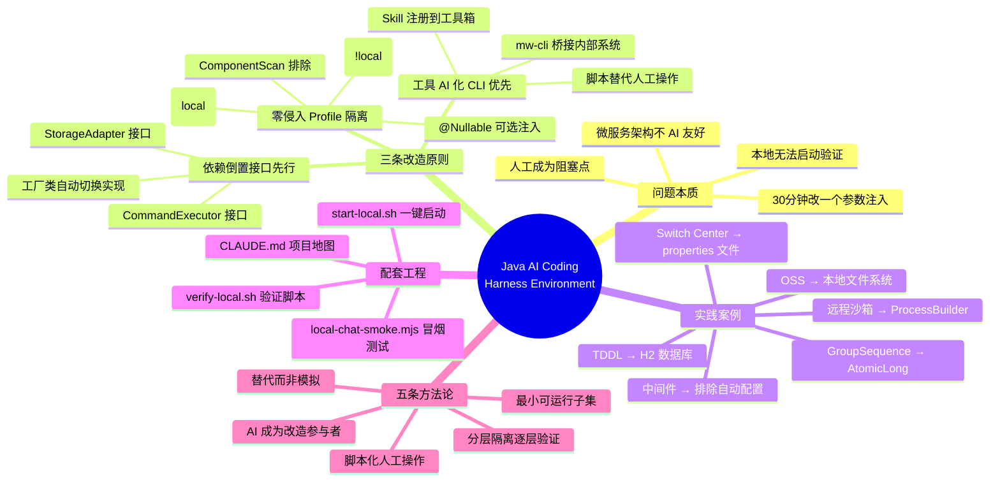
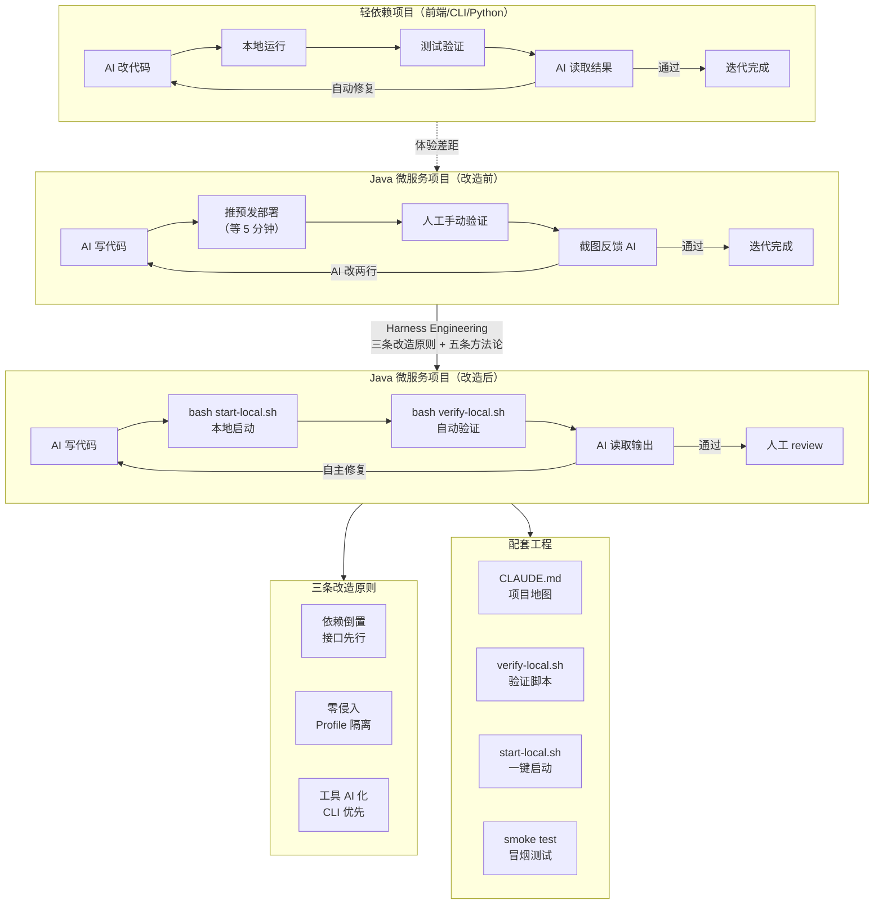

# Java Harness：五条方法论构建 AI Coding Harness 环境

> **原文链接**: https://mp.weixin.qq.com/s/3-hQ4vHYErfpIzYPC6wJwg

> **原标题**: 都是 AI Coding，为什么 Java 体验差了一个量级？五条方法论帮你构建自己的 Harness 环境
> **一句话总结**: Java 微服务项目 AI Coding 体验差的根源在于本地跑不起来，无法形成 AI 自主验证闭环；通过依赖倒置、零侵入 Profile 隔离、CLI 优先三条改造原则，配合五项可复用方法论，可以构建 AI 友好的本地 Harness 环境，将单次迭代从 30 分钟降至秒级。
> **前置知识检查**: - [ ] 了解 Spring Boot 的 Profile 机制与条件装配 - [ ] 理解依赖倒置原则（DIP）和接口抽象 - [ ] 了解微服务基础设施（HSF、TDDL、OSS、Diamond/Switch 等）的基本概念 - [ ] 了解 AI Coding Agent 的工作模式（CLAUDE.md、Skill、MCP Server）

## 原文

在依赖较轻的项目（前端、CLI 工具、Python 脚本）中，AI Coding 可以形成完整的本地闭环：编辑代码 → 本地运行 → 测试验证 → AI 读取结果 → 自动修复 → 再次验证，AI Agent 可以自主迭代几十轮直到功能跑通。

但 Java 微服务项目完全不同。项目依赖 OSS、远程沙箱、HSF 等云端基础设施，本地 `mvn spring-boot:run` 直接启动失败。于是进入经典循环：推预发（等 5 分钟）→ 人工验证 → 截图反馈 AI → AI 改代码 → 再推预发（再等 5 分钟）……三轮下来半小时过去了，改的只是一个参数注入顺序的问题。

问题的本质是：微服务架构天然不 AI 友好。AI Coding Agent 需要一个能在本地跑起来的环境来验证自己的输出，但微服务架构把运行时依赖全部推到了云端。项目在本地跑不起来，AI 就没办法自主验证，只能靠人去推预发、看结果、再反馈。

文章提出的核心解决方案是 **Harness Engineering**——构建 AI 友好的工程环境。作者通过一个 Agent 应用的实际改造，总结出三条改造原则和五条可复用方法论。

**三条改造原则**：

1. **依赖倒置，接口先行**：上层逻辑依赖抽象接口，不依赖具体实现。云端和本地只是接口的不同实现。例如将 `OssStorageAdapter` 和 `SandboxCommandExecutor` 抽象为 `StorageAdapter` 和 `CommandExecutor` 接口，本地用 `LocalStorageAdapter`（java.nio.file）和 `LocalCommandExecutor`（ProcessBuilder）替代。

2. **零侵入，Profile 隔离**：本地改造不能让线上代码路径多走一行额外代码。通过 `@Profile("local")` 装配本地专属 Bean，`@Profile("!local")` 守卫线上专属 Bean，`@Nullable` 处理可选依赖注入，运行时通过 null 检查决定走哪条路径。删掉所有本地相关代码后，线上行为完全不变。

3. **工具 AI 化：CLI 优先**：AI Agent 的能力边界 = 它能调用的工具的边界。GUI（Web 管理台）对 AI 不可见，CLI 才是 AI 能用的东西。通过 mw-cli 桥接企业内部系统（Diamond 配置查询、HSF 服务地址查询），用脚本替代人工操作（如 `fetch-switch-config.sh` 自动从预发拉取配置），并通过 Skill 将 CLI 能力注册到 AI Agent 工具箱。

**实践案例**：一个 AI Agent 运行时平台（支持 ReadFile/WriteFile/Bash 等 Tool），线上依赖 OSS + 远程沙箱 + TDDL + Switch Center + 各种中间件。改造方案包括：H2 替代 TDDL 数据源、AtomicLong 替代分布式 Sequence、脚本拉取 Switch 配置到本地 properties 文件、ComponentScan 正则过滤排除线上专属包、`start-local.sh` 一键启动、端到端冒烟测试脚本。最终效果：单次迭代从 5-10 分钟降至秒级，AI 可自主修复 3-5 轮后自行收敛。

**五条可复用方法论**：
1. 找到最小可运行子集（核心链路所需的最小依赖集合）
2. 替代而非模拟（H2 是真实数据库，LocalCommandExecutor 执行真实命令，而非 mock）
3. 脚本化一切人工操作（凡是需要人登录管理台的操作，都应有对应脚本）
4. 分层隔离，逐层验证（编译 → 启动 → 接口调通 → 端到端测试）
5. 让 AI 成为改造的参与者（每完成一步改造，AI 能做的事就多一点，形成正向循环）

## 核心概念脑图

## 与你已有知识的关联

- **《[[AgentSkillsTeams 架构演进过程及技术选型之道|AgentSkillsTeams 架构演进]]》**：该文讨论了 Agent、Skills、Teams 的架构演进，本文的 Harness Engineering 正是 Agent 工程化的基础设施层——Skills 和 Teams 的高效运作依赖于本地可验证的运行环境。CLI 优先原则与该文中 Skills 的工具化思路一脉相承。

- **《[[Function Calling与MCP-Skills本质差异与最佳实践|Function Calling、MCP和Skills的本质差异]]》**：本文的"工具 AI 化"部分与 MCP Server、Skill 的讨论直接呼应。作者提出的 CLI > MCP Server > Skill > GUI 优先级排序，是该文中 MCP 和 Skill 概念在 Java 微服务场景下的具体落地。

- **《[[Skills-从编程工具配角到Agent研发核心|Skills：从编程工具的配角到Agent研发的核心]]》**：该文强调 Skills 是 Agent 研发的核心，本文进一步指出 Skills 的效力取决于 Harness 环境——没有本地可运行的环境，Skills 调用的 CLI 工具和验证脚本都无法执行，Skills 就只是空中楼阁。

- **《[[高可用Agent-阿里云服务领域构建与调优方法论|阿里云服务领域Agent构建的方法论]]》**：该文讨论 Agent 的高可用性构建方法论，本文则聚焦于 Agent 开发阶段的高效迭代环境。两者结合可形成从开发到上线全链路的 Agent 工程质量保障。

- **《[[企业级 Agent 多智能体架构与选型指南|企业级 Agent 多智能体架构与选型指南]]》**：该文讨论企业级多智能体架构选型，本文的 Harness Engineering Checklist 可作为评估各 Agent 架构方案在 Java 微服务场景下落地可行性的前置检查清单。

## 重难点理解

**1. 为什么 Java 微服务的 AI Coding 体验比其他技术栈差一个量级？**

本质不是 AI 模型能力的问题，而是**反馈闭环是否完整**。前端/CLI/Python 等轻依赖项目，AI 改完代码后可以在本地直接运行并获取结果反馈，形成"改 → 跑 → 验证 → 再改"的自主迭代循环，人可以完全旁观。Java 微服务项目的运行时依赖全部在云端（HSF 服务调用、TDDL 数据源、OSS 存储、配置中心等），本地 `mvn spring-boot:run` 启动即报错，AI 的输出无法被自动验证，人工必须介入每个迭代环节（推预发、等部署、手动验证、截图反馈），人是唯一的阻塞点。

**2. "零侵入 Profile 隔离"为什么如此重要？**

很多团队做本地化适配时，会在主流程里加 `if (isLocal)` 分支。这看似简单，实则让线上代码路径变复杂，增加了生产环境风险。零侵入的核心目标是：删掉所有本地相关代码后，线上行为完全不变。具体手段包括：Spring `@Profile("local")` 让本地 Bean 和线上 Bean 在编译期就彼此不可见；`@Nullable` 可选依赖注入避免写 `@ConditionalOnBean`；运行时的 null 检查判断走哪条路径，多态本身保证原有实现不被干扰。检验标准：删掉所有本地代码，线上行为不变。

**3. "替代而非模拟"与 Mock 测试的区别是什么？**

Mock 返回的是预设的假数据，只能验证"代码能否处理某种返回值"，不能验证真实行为。作者强调的"替代"是真实的运行——H2 是真实的关系型数据库，执行真实的 SQL（不是 Mock JDBC）；`LocalCommandExecutor` 用 `ProcessBuilder` 执行真实的 bash 命令（不是 Mock CommandExecutor 返回假输出）。这样 AI 在本地发现的问题（SQL 语法错误、bash 命令失败、文件路径冲突等），线上大概率也会有。替代方案保证本地验证的有效性与线上验证高度一致。

**4. 如何理解"脚本就是 AI 的手，没有脚本 AI 就是残废的"？**

AI Agent 的能力边界等于它能调用的工具的边界。GUI（Web 管理台、IDE 插件）对 AI 完全不可见，CLI 才是 AI 能操作的东西。`fetch-switch-config.sh` 替代了"登录 Switch 管理台 → 找到应用 → 复制配置"的人工流程，`start-local.sh` 替代了"编译 → 配置环境变量 → 选 main 类 → 启动"的多步操作。每一个需要人工登录管理台、复制配置、点击按钮的操作，都应该有一个对应的可执行脚本。脚本化之后，AI 才能自主完成这些操作，人才真正从循环中被解放出来。

**5. "找到最小可运行子集"为什么是改造的第一步？**

不用把线上所有能力都搬到本地——那会陷入无底洞。关键是识别核心业务链路，找到这条链路跑通所需的最小依赖集合。案例中核心链路是"接收请求 → 调 LLM → 执行 Tool → 返回结果"，围绕这条链路需要的只有数据库、文件系统、命令执行三个基础设施。监控、链路追踪、服务发现等辅助设施，本地不需要就排除。这个方法论的价值在于：它给出了一个可收敛的改造范围，防止范围失控。

## 原文内容流程图

## 经验

1. **本地跑不起来，CLAUDE.md 写得再好也没用**：Harness Engineering 是 Context Engineering 的前提。AI 连代码能不能编译通过都验证不了，后面的一切都是空谈。先解决"能跑"的问题，再优化"怎么写提示词"的问题。

2. **接口抽象不是为了"设计优雅"，而是为了"环境可切换"**：很多团队做接口抽象是为了符合 DIP 设计原则，但在 Harness Engineering 场景下，接口抽象有了更实际的工程价值——它决定了你的系统能不能在本地跑起来。同一套上层代码，通过接口多态自然切换云端和本地实现。

3. **H2 + ProcessBuilder + properties 文件的组合是 Java 本地化的通用解法**：无论什么 Java 微服务项目，数据源、命令执行、配置下发这三个切面几乎都存在。H2（MODE=MySQL）+ ProcessBuilder + 本地 properties 文件提供了低成本的替代方案，可复用到大部分场景。

4. **分层验证比一次性端到端测试更高效**：按"编译 → 启动 → 接口调通 → 端到端"的顺序逐层验证，AI 可以按这个顺序逐层排查问题。每一层都有对应的验证命令（`mvn compile`、`/checkpreload.htm`、API 冒烟测试、Playwright E2E），定位问题更快。

5. **正向循环是改造的最大动力**：一旦 AI 能跑测试、能看到报错，它的效率就上来了。每完成一步改造，AI 能做的事情就多一点，下一步改造就更快。这种正向循环使得后续改造的边际成本递减。

## 知识

1. **Harness Engineering 概念**：指构建 AI 友好的工程环境，让 AI Coding Agent 拥有自主验证能力。核心包括项目能在本地一条命令启动、外部依赖有本地替代、AI 能运行测试并读取结果、日志结构化可 grep、运维工具有 CLI 入口等。与 Context Engineering（CLAUDE.md、Prompt 优化）互补。

2. **Spring Profile 零侵入模式**：本地专属 Bean 用 `@Profile("local")` 装配，线上专属 Bean 用 `@Profile("!local")` 守卫；可选依赖用 `@Nullable` 注入，不存在时 Spring 注入 null；运行时通过 null 检查决定走哪条路径，不引入 `if (isLocal)` 分支。消除标准：删掉所有本地相关代码后，线上行为完全不变。

3. **工具 AI 化优先级排序**：CLI（直接可用，如 mw-cli、mvn、git、arthas）> MCP Server（协议适配，如数据库查询、监控数据）> Skill/Tool（自定义封装，如配置查询、服务诊断）> GUI（不可用，如 Web 管理台、IDE 插件）。优先级标准是 AI 能否直接调用该工具。

4. **Java 微服务本地化替代矩阵**：OSS 对象存储 → 本地文件系统（java.nio.file）；远程沙箱 → 本机 bash（ProcessBuilder）；TDDL + MySQL → H2 文件数据库（MODE=MySQL）；TDDL GroupSequence → AtomicLong；Switch Center → 本地 properties 文件 + 脚本同步；EagleEye/HSF/Sunfire → `spring.autoconfigure.exclude`；Pandora 启动器 → 标准 `java -cp` 启动。

5. **"替代而非模拟"原则**：替代方案要能真实运行，不能只是返回 mock 数据。H2 是真实数据库而非 Mock JDBC；`LocalCommandExecutor` 执行真实 bash 命令而非 Mock 返回假输出。这样 AI 在本地发现的问题，线上大概率也会有，保证本地验证的有效性。

## 可复用建议

1. **评估当前项目的 AI Coding 友好度**：使用 Harness Engineering Checklist 逐项检查——项目能否一条命令启动？是否依赖外部中间件？外部依赖是否通过接口抽象？能否通过 Profile 切换？AI 能否本地运行测试并读取结果？

2. **从最小可运行子集开始改造**：先盘清项目的核心业务链路和所有外部依赖，然后识别最小依赖集合（通常就数据库、文件系统、命令执行三项），优先改造这三项。不要试图一次性把所有线上能力搬到本地。

3. **接口抽象先行，不要在主流程加 if 分支**：将外部依赖（存储、命令执行、ID 生成等）抽象为接口，线上实现和本地实现分别独立，通过工厂类和 Spring Profile 自动切换。主流程代码只依赖接口，完全不用改。

4. **为 AI 编写可直接执行的验证脚本**：不要写 Checklist，要写可执行脚本。`verify-local.sh` 应包含编译检查、单元测试、启动检查、端到端冒烟测试。AI 改完代码后跑一次这个脚本就能知道是否正常。

5. **脚本化一切人工操作**：凡是需要人登录管理台、复制配置、点击按钮的操作，都封装为可执行脚本。重点包括：配置同步脚本（从配置中心拉取到本地）、一键启动脚本（编译 + 启动一条命令）、冒烟测试脚本（验证核心链路）。

6. **用 CLAUDE.md 给 AI 一张完整地图**：项目根目录放置 CLAUDE.md，包含项目简介、本地启动命令、测试命令、架构约束（接口依赖原则、Profile 隔离要求、本地代码不得修改线上代码路径等）。控制在 100 行以内，让 AI 能快速定位关键信息。

## 实施办法

**阶段一：诊断（1-2 天）**

- 盘清项目的核心业务链路（哪条链路跑通就算项目可用）
- 列出核心链路上的所有外部依赖（数据库、存储、命令执行、配置中心、消息队列、服务发现等）
- 使用 Harness Engineering Checklist 逐项评估，找出所有阻塞点
- 确定最小可运行子集——哪些依赖必须有本地替代，哪些可以排除

**阶段二：基础设施替换（3-5 天）**

- 数据库：H2 文件数据库替代 TDDL/MySQL，`spring.datasource.url` 指向本地文件，`MODE=MySQL` 兼容 SQL
- 存储：抽象 `StorageAdapter` 接口，新增 `LocalStorageAdapter` 实现（java.nio.file 映射）
- 命令执行：抽象 `CommandExecutor` 接口，新增 `LocalCommandExecutor` 实现（ProcessBuilder）
- 分布式 ID：`AtomicLong` 包装替代 GroupSequence
- 配置：脚本从预发环境拉取配置到本地 properties 文件

**阶段三：隔离与自动化（2-3 天）**

- Profile 隔离：`@Profile("local")` / `@Profile("!local")` 守卫本地和线上 Bean
- ComponentScan 排除：正则过滤排除线上专属包（沙箱、观测、中间件等）
- `spring.autoconfigure.exclude` 排除不必要的中间件自动配置
- 编写 `start-local.sh` 一键启动脚本
- 编写 `verify-local.sh` 验证脚本（编译 → 测试 → 启动 → 冒烟）
- 编写冒烟测试脚本（Health Check + API 验证 + UI E2E）

**阶段四：工具 AI 化与上下文工程（1-2 天）**

- 将运维 CLI 工具（mw-cli、arthas 等）的能力封装为 Skill 注册到 AI Agent 工具箱
- 编写 CLAUDE.md 放在项目根目录（项目简介、启动命令、架构约束）
- 配置 AI Agent 的验证流程：改代码 → `mvn compile` → `bash verify-local.sh` → 自动反馈

**阶段五：迭代验证（持续）**

- 让 AI 在实际开发任务中使用本地 Harness 环境
- 观察 AI 的自主迭代效率，记录仍需人工介入的环节
- 每完成一步改造，AI 能做的事就多一点——利用正向循环加速后续改造
- 逐步将 JVM 诊断能力（jstack、Arthas watch/trace/tt）也工具化，让 AI 能实时观测运行时状态

> **期望指标**：改造完成后，单次 AI Coding 迭代从 5-10 分钟降至秒级，AI 能自主修复 3-5 轮后收敛，人工只需最终 review。