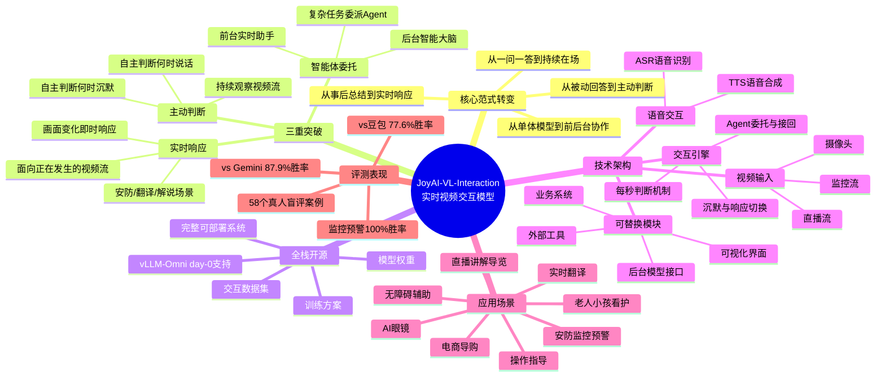
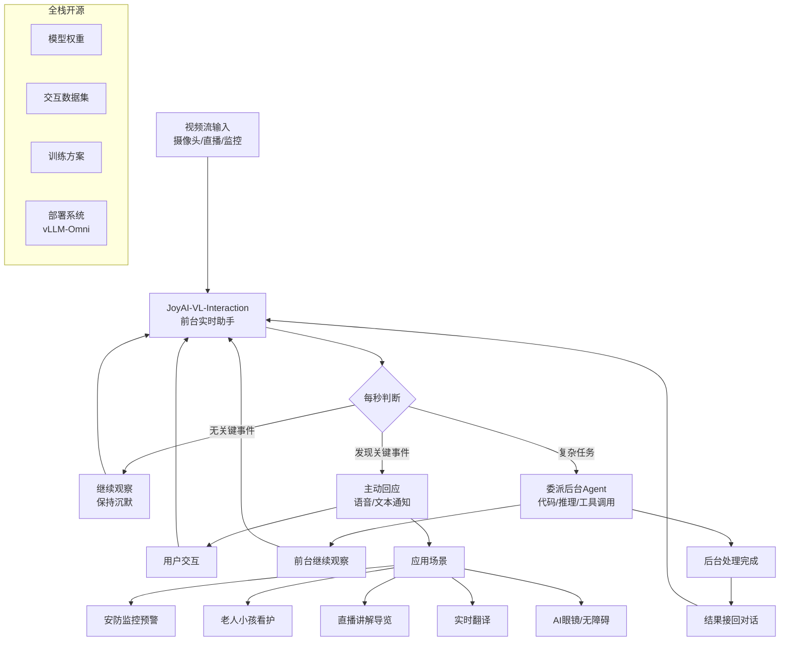

---
tags:
  - tech-article
  - AI
  - 多模态大模型
  - 实时视频交互
  - JoyAI
  - VL-Interaction
  - Agent委托
  - 物理世界AI
created: 2026-06-22
category: 技术文章/AI
aliases:
  - JoyAI-VL-Interaction
  - 京东实时视频交互模型
---

# JoyAI-VL-Interaction：实时视频交互大模型全栈开源

> **原文链接**: https://mp.weixin.qq.com/s/_yuXoS589fo5MB1IkpaoYA

> **原标题**: 全球首个！京东全栈开源JoyAI-VL-Interaction，让大模型从"一问一答"走向"边看边说"

> **一句话总结**: 京东开源全球首个全栈实时视频视觉语言交互模型，让 AI 从被动"一问一答"进化为持续"在场"——边看、边记、边判断，并在关键时刻主动回应或委托后台 Agent 处理复杂任务。

> **前置知识检查**: 
> - [ ] 多模态大模型（VLM）基本概念
> - [ ] 视觉语言模型的视频理解能力
> - [ ] 实时流式处理与推理
> - [ ] Agent 协作与任务委派机制
> - [ ] vLLM 部署框架

## 原文

### 一场 AI 交互范式的变革

一场火灾发生的瞬间，监控系统可以实时发出警报；独居老人在家摔倒，AI 可以马上提醒远方的亲人；视障人士外出，智能眼镜随时解读附近环境、指明方向……这些看似科幻的场景，在 AI 时代可能很快会成为现实。

近日，京东开源实时视频视觉语言交互模型 **JoyAI-VL-Interaction**，这也是全球首个全栈开源的 interaction 模型和系统，并获得 vLLM-Omni 的 day-0 原生支持。它让大模型从"一问一答"走向"边看边说"，开发者基于这套框架，可以快速搭建能持续观察、自主判断、即时响应的实景 AI 助手。

- **代码**: https://github.com/jd-opensource/JoyAI-VL-Interaction
- **模型**: https://huggingface.co/jdopensource/JoyAI-VL-Interaction-Preview
- **数据集**: https://huggingface.co/datasets/jdopensource/JoyAI-VL-Interaction

### 不止看懂过去，更要看懂"现在"

今天很多多模态模型，重在比拼参数、知识和推理，本质上仍是"一问一答"——用户上传图片或视频，提出问题，模型再给出回答。这种方式在图文问答、视频复盘、内容分析等场景中足够好用，但当 AI 进入真实世界，模型不只要聪明，更要**"在场"**。正在发生的真实世界，无数瞬息万变的时刻，错过就很难补救。

JoyAI-VL-Interaction 就是**让 AI 像人一样持续"在场"：边看、边记、边判断，并在关键时刻主动回应，或选择性地交接给后台 Agent。**

相比传统模型，有三重突破：

**1、主动判断，而非被动回答**

传统模型通常要等用户发起问题，才开始处理当前画面。JoyAI-VL-Interaction 可以持续观察视频流，自主判断什么时候该说话，什么时候该沉默。

比如用户设置"裁判出示红牌时提醒我"，模型就会持续值守画面，并在事件发生时自动预警，而不是等用户再问一句"刚才发生了什么"。

**2、实时响应，而非事后总结**

传统视频理解更多是上传完整视频后再分析，但在安防预警、实时翻译、直播解说、操作指导等场景里，晚几秒，体验和价值都会不同。JoyAI-VL-Interaction 面向正在发生的视频流，画面变化时就能响应。

**3、适时智能体委托，同时保持观察和交互**

JoyAI-VL-Interaction 具备后台任务委派能力。当模型遇到生成代码、调用工具、复杂推理等任务时，可以交给后台大模型或 Agent。前台模型继续观察现场，后台模型处理复杂任务，结果返回后再自然接回对话。

它更像一套**"前台实时助手 + 后台智能大脑"**的协作系统：前台负责在场，后台负责干重活。

### 开源一套系统，而不只是一个模型

在实时视频流中，JoyAI-VL-Interaction 每秒都会做一次判断：继续观察、保持沉默、发现关键事件主动回应、遇到复杂任务交给后台 Agent 处理。"什么时候说话"不再只靠外部规则或定时触发，而是成为模型自己学会的能力。

**一个好的 AI 助手，不应该一直打扰用户，而应该知道什么时候该出现，什么时候该安静，以及什么时候自己解决，什么时候交由 Agent 解决。**

很多开源模型只提供基础推理能力。JoyAI-VL-Interaction 开源的是**完整技术栈**：
- 模型权重
- 交互数据集
- 训练方案
- 完整可部署系统

支持摄像头、直播流、监控流等多种视频输入，也支持语音输入输出、可视化界面、长期记忆、后台模型接口和 vLLM 部署方案。ASR、TTS、可视化界面、后台模型、外部工具和业务模块，都可以按需替换。

### 评测结果

在 58 个真人盲评案例中，覆盖监控预警、实时计数、实时翻译、时间感知、直播导览解说等真实流式场景：

- 对比豆包视频通话助手，总体胜率 **77.6%**
- 对比 Gemini 视频通话助手，总体胜率 **87.9%**
- 监控预警场景，对两个基线均取得 **100% 胜率**

这源于交互模型相较传统"一问一答"回合制模型的天然优势：自主交互性长在模型内部，而非依赖外部触发。

### 从生成到交互，AI 走向物理世界

今年以来，京东在模型基建方面取得多项重要进展：
- 3 月：开源基础大模型 JoyAI-LLM Flash Instruct
- 4 月：开源图像模型 JoyAI-Image-Edit
- 6 月 3 日：开源长视频生成模型 JoyAI-Echo
- 6 月 22 日：开源 JoyAI-VL-Interaction

从"一问一答"到"边看边记边回应"，从离线视频理解到实时流式交互，从屏幕里的 AI 到物理世界里的 AI——这是京东把 AI 从数字世界推向物理世界的又一步。

---

## 核心概念脑图

## 与你已有知识的关联

**《[[个人学习/LLM大模型类相关知识/企业级 Agent 多智能体架构与选型指南|多智能体架构]]》**：JoyAI-VL-Interaction 的"前台实时助手 + 后台智能大脑"架构是该文"Agent 编排层"模式的具体实现——前台模型负责持续观察和轻量交互，后台 Agent 负责复杂推理和任务执行，两者协作完成端到端任务。

**《[[大厂技术文章-DailyTech/文章/Devix-7x24自动化运维Harness Engineering实践|Agent运维Harness]]》**：两篇文章都涉及"Agent 在场"的概念——运维 Agent 需要 7x24 不间断监控告警，JoyAI-VL 需要持续观察视频流。核心范式相似：持续监控 → 自主判断 → 分级响应/委派。

**《[[技术文章-DailyTech/人和Agent怎么一起干活——复制粘贴的进化之路，先装个贾维斯吧|人机协作贾维斯]]》**：JoyAI-VL-Interaction 的愿景（实时观察、主动判断、即时响应）与该文的"贾维斯"理念高度一致——都是让 AI 从被动工具进化为主动助手，区别在于交互模态（视频 vs 剪贴板/文本）。

**《[[个人学习/LLM大模型类相关知识/AI Agent系列｜深入解析Function Calling、MCP和Skills的本质差异与最佳实践|Function Calling与Skills]]》**：JoyAI-VL 的"后台任务委派"机制本质上是一种 Function Calling 的高级形态——前台模型判断需要复杂推理时，自动调用后台 Agent 的能力，结果返回后自然接回对话流。

**《[[技术文章-DailyTech/OpenClaw与Hermes：源码里的 AI Agent 架构知识大复盘|OpenClaw架构]]》**：JoyAI-VL 的"每秒判断→沉默/响应/委派"循环与 OpenClaw 的 Context Reset 和 Dreaming 机制有异曲同工之妙——都是通过内部循环机制让 Agent 具备持续感知和自主决策的能力。

## 重难点理解

- **重点1**: "在场"范式转变 — 从"一问一答"到"边看边记边判断" — 这是交互模型与传统多模态模型的本质区别。传统 VLM 是被动触发，JoyAI-VL 是主动值守。常见误区是把它理解为"更快的视频问答"，实际上是全新的交互范式。

- **重点2**: 前台 + 后台协作架构 — 前台模型负责持续观察和轻量交互，后台 Agent 负责复杂推理和重活 — 这种设计让实时性和深度推理兼得。前台不能停下来思考（会错过画面），后台不需要实时性（可以慢慢推理）。

- **难点1**: "会沉默"的能力 — 模型需要学会什么时候不说话 — 这看似简单，实际是交互模型最核心的难点之一。传统模型的优化目标都是"回答问题"，而交互模型需要额外学习"保持沉默"和"主动发声"的时机判断。这需要专门的交互数据集和训练方案。

- **难点2**: 自主交互性 vs 外部触发 — 传统方案用规则或定时触发来实现"实时监控"，而 JoyAI-VL 把自主交互性内化到模型内部 — 模型每秒自己做判断，不需要外部轮询或事件钩子。这使得响应更灵敏、更准确，但也对模型的实时推理能力提出了更高要求。

- **难点3**: 全栈开源的意义 — 不只是模型权重，而是完整技术栈 — 包含交互数据集、训练方案、部署系统。这是很多开源模型做不到的——开发者拿到权重后还要自己解决视频接入、语音交互、记忆模块、前后端协同等工程问题。

## 原文内容流程图

## 经验

1. **"在场"比"聪明"更重要**: 在真实世界的 AI 应用中，持续观察和即时响应能力比单次推理精度更有价值 — **应用场景**: 安防监控、老人看护、直播解说等需要实时感知的场景

2. **会沉默是核心能力**: 好的 AI 助手不应该一直打扰用户，而应该知道什么时候该出现、什么时候该安静 — **应用场景**: 任何需要 AI 主动交互的场景，打扰频率直接影响用户体验

3. **前台 + 后台分离架构**: 前台负责实时观察和轻量交互，后台负责复杂推理和重活 — **应用场景**: 需要同时兼顾实时性和深度推理的系统设计

4. **全栈开源降低落地门槛**: 开源的不只是模型权重，而是完整技术栈（数据集 + 训练方案 + 部署系统）— **应用场景**: 评估开源项目时，关注其是否提供了端到端的落地支持

5. **交互性内化到模型**: 把"什么时候说话"的判断能力训练到模型内部，而非依赖外部规则或定时触发 — **应用场景**: 需要自主判断时机的 AI 系统，比规则驱动更灵活、更准确

## 知识

| 知识点 | 定义 | 关键要素 | 关联概念 |
|-------|------|---------|---------|
| Interaction 模型 | 能持续观察、自主判断、即时响应的实时交互模型 | 主动判断、实时响应、Agent 委托 | 多模态大模型、实时流处理、Agent 协作 |
| 前台+后台协作架构 | 前台模型负责实时观察，后台 Agent 负责复杂任务的双层设计 | 前台持续在场、后台处理重活、结果自然接回 | 多智能体架构、任务委派、实时性 |
| 沉默与响应判断 | 模型每秒自主判断是否应该发声或保持沉默的能力 | 内化到模型内部、非外部规则触发 | 交互数据集训练、用户体验优化 |
| 全栈开源 | 开源完整技术栈而非仅模型权重 | 模型权重 + 数据集 + 训练方案 + 部署系统 | 开源生态、可复现性、工程落地 |
| vLLM-Omni | 支持多模态模型的高性能推理引擎 | day-0 原生支持、一键部署 | 模型部署、推理优化、多模态推理 |

## 可复用建议

1. **评估 AI 系统时关注"在场"能力**: 不只看单次问答精度，还要看持续观察和实时响应能力 — **适用场景**: 选型多模态模型时 — **预期效果**: 选出真正适合实时场景的方案，而非只在离线评测上好看的模型

2. **设计前后台分离架构**: 实时性要求高的部分放前台，计算密集的部分放后台 — **适用场景**: 任何需要兼顾实时性和深度的系统 — **预期效果**: 实时性不受复杂推理影响，深度推理不受实时约束限制

3. **把交互判断力训练到模型内部**: 用专门的交互数据集训练模型的"沉默/响应"判断能力 — **适用场景**: 构建自主交互式 AI 系统 — **预期效果**: 比规则驱动更灵活、更准确，用户体验更好

4. **关注全栈开源项目**: 优先选择提供完整技术栈（模型 + 数据 + 训练 + 部署）的开源方案 — **适用场景**: 快速原型开发和生产部署 — **预期效果**: 大幅缩短从研究到落地的时间

## 实施办法

1. **第1步：了解项目结构**
   - 访问 GitHub 仓库 https://github.com/jd-opensource/JoyAI-VL-Interaction
   - 阅读 README，了解系统架构和模块组成
   - 确认硬件需求（GPU 显存、视频输入设备等）

2. **第2步：快速体验**
   - 通过 vLLM-Omni 一键部署模型服务
   - 下载模型权重 https://huggingface.co/jdopensource/JoyAI-VL-Interaction-Preview
   - 使用示例视频流进行基本功能验证

3. **第3步：理解交互数据集**
   - 下载交互数据集 https://huggingface.co/datasets/jdopensource/JoyAI-VL-Interaction
   - 分析数据格式和标注方式，理解"沉默/响应/委派"的训练样本设计
   - 评估是否可用于自己的场景微调

4. **第4步：接入业务视频源**
   - 将摄像头/直播流/监控流接入系统
   - 配置 ASR/TTS 服务（可按需替换）
   - 接入后台 Agent 或大模型接口

5. **第5步：场景适配与微调**
   - 根据自己的应用场景（安防/看护/直播/导购等）准备领域数据
   - 基于开源训练方案进行微调
   - 评估"沉默/响应"判断的准确率

6. **第6步：部署与监控**
   - 使用 vLLM 部署方案上线服务
   - 监控实时推理延迟和响应准确率
   - 建立效果评估机制，持续优化
