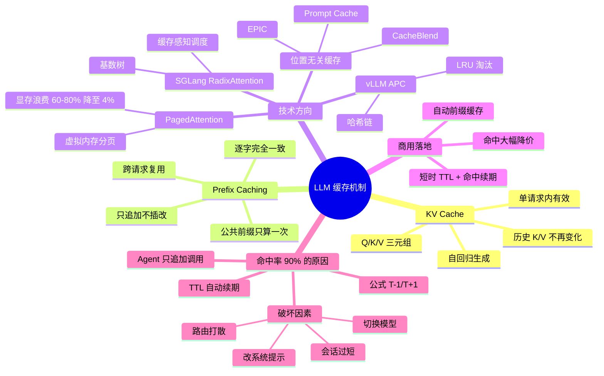
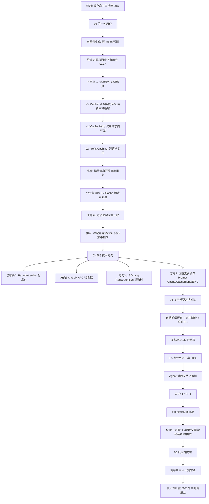

---
tags:
  - tech-article
  - LLM
  - Inference
  - KVCache
  - PrefixCaching
  - 推理优化
created: 2026-07-03
category: 技术文章/AI
aliases:
  - LLM缓存
  - 前缀缓存
  - KV Cache
---

# LLM缓存命中率：Prefix Caching与KV Cache跨请求复用机制

> **原文链接**: [https://mp.weixin.qq.com/s/bsSBfvWyLUEdFHFZmFOckQ](https://mp.weixin.qq.com/s/bsSBfvWyLUEdFHFZmFOckQ)

> **原标题**: 为什么大模型的缓存命中率能到 90%？

> **一句话总结**: 大模型推理的 90% 缓存命中率并非某家黑科技，而是 KV Cache + Prefix Caching + Agent 式「只追加」调用模式三者叠加的必然结果——理解其原理和约束，才能正确设计 prompt 结构与调用策略。

> **前置知识检查**:
> - [ ] 了解 Transformer 注意力机制中 Q/K/V 的基本概念
> - [ ] 知道大模型是自回归（逐 token）生成
> - [ ] 了解 Token 与 API 计费的基本概念
> - [ ] 可选：了解 Agent 多轮工具调用的工作模式

## 原文

这是2026年的第29篇文章

（ 本文阅读时间：约15分钟 ）

### 缘起：一个 90% 的观察

如果看过自己团队的大模型 token 消耗看板，我们多半会注意到一个现象：主力模型的缓存命中率常年挂在 90% 上下，而且越是高频使用、跑得越久的模型，命中率越稳。

这不是某一家的「黑科技」，实际上，这是一整套已经成为行业标配的推理优化技术，叠加上「agent 式调用」这种使用模式后的必然结果。

这篇文章想把这件事梳理清楚：

- 缓存到底缓存了什么（KV Cache 原理）；
- 当前有哪些缓存技术方向；
- 最先进的几个模型是怎么落地的；
- 为什么命中率会这么高——以及它高，到底意味着什么。

本文全程尽量用类比和图片说话，不陷进矩阵和算子的细节里。

### 01 第一性原理：模型为什么需要缓存

#### 大模型是「一个字一个字往外蹦」的

当前主流大模型都是自回归（autoregressive）生成：每次只预测下一个 token，把它接到已有文本后面，再预测再下一个。问题在于，Transformer 的注意力机制要求——预测每一个新 token，都要「回看」前面所有 token。

如果什么都不缓存，那就是一场灾难：生成第 100 个字时，要把前 99 个字重新计算一遍注意力；生成第 1000 个字时，把前 999 个字再算一遍……计算量随长度平方级膨胀。

#### KV Cache：把「回看」的中间结果存下来

注意力机制里，每个 token 都会被换算成三样东西：Query（查询）、Key（键）、Value（值）。预测新 token 时，用新 token 的 Query 去和所有历史 token 的 Key/Value 做运算。

关键洞察是：历史 token 的 Key/Value 一旦算出来就不再变了。那为什么每步都重算？把它们缓存下来，下一步直接读，新 token 只需要算自己那一份，就是 KV Cache（键值缓存）。它把每步的计算从"重算整段历史"降到"只算新增的一个"，是所有大模型推理的地基。

但 KV Cache 有个「先天局限」：它默认只在一次请求内部有效。请求一结束，这块缓存通常就被丢弃了。下一个请求哪怕开头一模一样，也得从头再算。真正决定"命中率"高低的，是能不能把缓存跨请求复用，这就引出了下一层。

### 02 从 KV Cache 到 Prefix Caching：跨请求复用

#### 核心思想：相同的前缀，只算一次

观察真实流量我们会发现：海量请求的开头是高度重复的。同一个 AI 助手，每个请求都带着同一份几千 token 的系统提示词（system prompt）；同一段多轮对话，第 5 轮请求的开头就是第 4 轮的全部内容。

Prefix Caching（前缀缓存） 就是把这部分"公共前缀"的 KV Cache 留下来、跨请求复用：新请求进来，先看它的前缀是不是已经被算过、缓存过；命中了就直接读，跳过最昂贵的"预填充（prefill）"环节。

#### 为什么必须「逐字完全一致」？

这是 prefix caching 最反直觉、也最关键的一条规则：前缀从第一处不一致开始、往后就无法复用——分歧点之前的完整块仍然命中，之后的缓存才失效。

原因在于现代模型用的位置编码（如 RoPE 旋转位置编码）：每个 token 的 Key/Value 不仅取决于"它是什么词"，还取决于"它排在第几位"。而且在多层注意力下，某个 token 的 K/V 还依赖它前面的整段上下文——前面一改，后面每个 token 的 K/V 都跟着变。所以你在前缀中间插一句话、改一个时间戳，后面的缓存就集体失效。

这条规则有两个直接推论，记住它们，后面解释"为什么命中率高/低"全靠它：

- 稳定的内容要放在最前面（系统提示、工具定义），易变的内容（用户每次不同的问题、时间戳）放最后；
- 只能追加（append），不能插改。在已缓存内容后面接新内容，前缀不变、缓存照命中；一旦改动前面的内容，缓存全废。

### 03 当前缓存技术有哪些方向

围绕「如何更好地缓存与复用」，工业界和学术界大致形成了四个层层递进的方向。

#### 方向一/二：让缓存「装得下、不浪费」——PagedAttention

KV Cache 很吃显存：一条长序列就能占用数 GB（论文实测 OPT-13B 上单序列约 1.6GB）。早期系统因为要给每条序列预留连续显存，碎片化和冗余拷贝白白浪费了 60%–80% 的显存。

vLLM 的 PagedAttention 借鉴了操作系统管理内存的经典思路：把 KV Cache 切成固定大小的「页（block）」，像虚拟内存分页一样按需分配、灵活共享，把浪费压到 4% 以下，吞吐量提升 2–4 倍（SOSP 2023）。这一步看似只是「省显存」，也大大降低了跨请求共享 KV 的工程成本——把 KV 拆成可独立管理的小块后，多个请求才好「共享其中几块」（但前缀缓存本身并不必然依赖 PagedAttention）。

#### 方向三：跨请求复用的两条数据结构路线

怎么快速判断「这段前缀以前算过没有」？两大开源引擎给出了不同答案：

- **vLLM 的 Automatic Prefix Caching（APC）**：把前缀切成定长 block，每个 block 的哈希由「父块哈希 + 本块内容」链式生成——这条哈希链天然表达了「完整前缀」。所有块丢进一张哈希表，不维护树结构，块独立分配/释放，用 LRU 淘汰最久未用的。命中要求逐块精确匹配（只缓存写满的整块）。

- **SGLang 的 RadixAttention**：用**基数树（前缀树）**显式建模请求间的前缀共享关系：树以 token 序列为路径，共享前缀的请求自然落在同一条分支上；用「递归淘汰叶子节点」的 LRU 管理，再配合「缓存感知调度」主动提高命中率。论文报告相比当时 SOTA 吞吐最高提升 6.4 倍。

两条路线殊途同归：让相同前缀的 KV 只算一次、被很多请求复用。

#### 方向四：突破「必须是前缀、必须逐字一致」的限制

前面说过，标准 prefix caching 有两个硬约束：必须是前缀、必须逐字一致。这对 RAG（检索增强）这类场景很不友好——检索到的文档每次都不同、又往往夹在中间而非开头。学术界正在攻这个方向：

- **Prompt Cache**（MLSys 2024）：让开发者用一套标记语言（PML）把系统提示、模板、常用文档声明成可复用模块，服务端预先算好它们的注意力状态，无论这个模块出现在 prompt 的哪个位置都能复用，做到一定程度的「位置无关」。首 token 延迟最高加速 8×（GPU）/ 60×（CPU）。

- **CacheBlend**（EuroSys 2025 最佳论文）：允许把非前缀位置的文档块缓存直接拼接，只对一小部分 token 做「选择性重算」来修正跨块的注意力，TTFT 加速 2.2–3.3×、吞吐提升 2.8–5×，且不掉生成质量。

- **EPIC**（ICML 2025）：系统性地提出「位置无关缓存（Position-Independent Caching）」，把非前缀复用的主要障碍归因于 attention sink（每个片段的首 token 过度吸走注意力），并据此做针对性修正。

这些还多在前沿研究/特定引擎阶段，但代表了缓存技术「从前缀走向任意片段」的演进方向。

### 04 最先进的模型是怎么落地的

把上面的原理对照到几家最先进的商用模型，会发现它们的产品形态高度趋同：自动前缀缓存 + 命中大幅降价 + 短时 TTL。差异主要在「自动还是手动」「折扣多少」「缓存放哪里」。

| 维度 | 模型A | 模型B | 模型C | 模型D |
| --- | --- | --- | --- | --- |
| 开启方式 | 手动打断点 cache_control（也可自动）[1] | 全自动，无需改代码 [9] | 隐式(自动) + 显式(手动建 CachedContent) [11] | 全自动前缀缓存 [13] |
| 命中折扣 | 命中约 0.1× 原价 [10] | 初版约 5 折；新文档口径"成本最高省 90%"，以定价页为准 [9]（注） | 隐式命中约 75% 折扣（按原价 25% 计）[12]（注） | 命中价约为未命中的 1/10（官方页 $0.014 vs $0.14 /百万 token）[13] |
| 写入成本 | 5 分钟档 1.25×、1 小时档 2× [10] | — | 显式缓存另收"按时长"的存储费 [11] | 存储免费 [13] |
| 缓存寿命(TTL) | 默认 5 分钟，每次命中自动续期且不额外收费；可选 1 小时 [1] | 不活跃 5–10 分钟清除、最长 1 小时；部分模型支持延长至 24 小时 [9] | 默认 1 小时，可自定义 [11] | 数小时至数天后自动清除 [13] |
| 最小可缓存 | 约 1024–4096 token，随模型版本不同 [1] | 1024 token 起，按 128 增量 [9] | 隐式 1024–2048、显式 2048–4096，随版本不同 [11][12] | 最小缓存单位 64 token [13] |
| 缓存放哪 | 厂商侧 | 厂商侧 | 厂商侧 | 分布式硬盘阵列（靠 MLA 架构压缩 KV 体积才放得下）[13] |

注：折扣口径各家随模型版本变动较大——有的早期公告写"输入 5 折"，新文档改成"最高省 90%"的整体表述；有的隐式缓存官方明确 75% 折扣（网传"九折优惠/付一折"是更早 1.5 系列的说法）。引用具体折扣请以具体的当前定价页为准，本表只标可核实到的官方数字。

几个值得注意的落地细节：

- 官方收益数字（下列为各家早期公告数据，当前定价与文档页多已调整，仅作量级参考）：模型 A 在首发公告中称提示缓存可「降低成本最高 90%、降低延迟最高 85%」，并给了一个例子：缓存一本 10 万 token 的书后，响应延迟从 11.5 秒降到 2.4 秒。模型 D 则举例 128K 高重复 prompt 的首 token 延迟从约 13 秒降到约 0.5 秒。

- 模型D的「硬盘缓存」很有代表性：常规 KV Cache 太大放不进内存，它靠 V2 的 MLA 架构把 KV 体积大幅压缩，才得以低成本地落到分布式硬盘上长期保留。这是「把缓存做大做久」的另一条工程路线。

### 05 为什么命中率会这么高

铺垫到这里，可以回答文章最初那个问题了。命中率高的原因在于，当前主流的「agent 式」调用，恰好是 prefix caching 的完美工作负载。

#### 关键：agent 对话是「只追加」的

回想第二节那条铁律：只追加、不插改，缓存就一直命中。而各类 AI agent 的多轮调用，正好就是这个形状：

每一轮请求，都把整段历史原封不动重发一遍，再在末尾追加一点点新内容（上一步的工具输出 + 模型新回复）。于是除了最新追加的一小段，前面的巨大前缀全部命中缓存。会话越长，被反复重读的前缀越大，命中占比越高。

#### 一个简化模型：命中率 ≈ (T−1)/(T+1)

可以做个粗略估算。设一次会话共 T 轮，每轮新增的内容量大致相当（记为 d）。第 k 轮请求时，前面 (k−1) 段都已缓存、走「命中读」，只有最新 1 段是「写入」。把整场会话的 token 累加起来：

- 累计命中读 ≈ d × [0 + 1 + … + (T−1)] = d·T(T−1)/2
- 累计新写入 ≈ d × T

两者相除，命中率 ≈ (T−1) / (T+1)。代入实际会话长度：

| 每次会话轮数 T | 理论命中率 |
| --- | --- |
| 10 | 81.8% |
| 20 | 90.5% |
| 40 | 95.1% |

一次典型的 agent 编码会话往往要跑十几到几十轮工具调用，命中率就容易落到 90% 上下。这大致解释了不同厂商主力模型的命中率为何都在这个区间——主要是「只追加对话 + 前缀缓存」这种工作负载的结果，而非某家模型的特殊能力；实际数值还受系统提示大小、块粒度、TTL、路由等因素影响。

#### TTL 短，为什么不掉链子

也许有人会疑惑：缓存默认只活 5 分钟，会话跑久了不会过期吗？答案是：不会。因为每次命中都会刷新 TTL，且不额外收费。只要你在持续编码（隔几十秒就有一次工具往返），缓存被一次次"续命"，整场会话几乎不过期。TTL 短只在你长时间挂起后才咬人。

#### 反过来：什么时候命中率会掉到 50%

理解了机制以后，「低命中」也就好解释了。凡是**破坏「只追加 + 前缀一致」**的场景，命中率立刻塌方：

- 中途切换模型：缓存是按模型隔离的，换个模型等于前缀全部作废，相当于每次都冷启动；
- 改动了工具集或系统提示：它们排在最前面，一动则后面全废；
- 会话很短：T 很小时，(T−1)/(T+1) 本来就低（T=3 时正好约 50%）；
- 请求被分散路由到不同后端：若缓存按后端隔离、且路由不感知前缀（自建或非 cache-aware 网关常见），轮询会打散前缀的局部性；不少商用 API 已用 cache-aware 路由缓解这一点。

所以如果我们在看板上看到某个「自动路由 / 多模型聚合」档位的命中率只有 ~50%，多半就是它在请求间不断切换模型 / 重置前缀，把有效会话深度压到了三五轮。

### 06 一个反直觉的提醒

最后说明一个容易陷入的认知误区：高命中率 ≠ 一定省钱、一定高效。

命中率高，恰恰是「每一轮都把整段大上下文重发一遍」的副产物。命中读虽然只要 0.1× 价钱，但你的绝对输入量也被这种重发模式撑得很大。真实成本由 `命中读 + 写入 + 未缓存` 三部分的总和决定，单看命中率会误判。

换句话说：

- 命中率 90% 是好事，说明缓存机制在替用户省钱、降延迟；
- 但真要压成本，杠杆往往在那掉到 50% 的少数流量上（让它们绑定单一模型、稳定工具集、复用前缀），而不是在已经 90% 的主力模型上抠。

把缓存当成一种「奖励只追加、惩罚乱插改」的契约——顺着它的脾气用，命中率自然就上去了。

### ⚠️ 关于文中数据的说明

文中数字仅为帮助理解：定价 / TTL / token 阈值为 2026 年初口径且随版本频繁变动（部分为厂商首发公告），报价以官方当前页为准；各类性能倍数（2–4×、6.4×、8×/60× 等）均为特定模型与负载下的"最高值"，非通用收益；命中率 90% 与 (T−1)/(T+1)属经验观察与简化模型，实际受系统提示、块粒度、TTL、路由等因素影响。

### References

以下来源均经 arXiv 摘要页 / 官方文档逐条核实。涉及折扣比例、人民币价格等随版本变动或存在口径差异的数字，正文已标注"以官方定价页为准"，请勿据本文做精确报价。

**【基础原理与学术论文】**

- [1] Anthropic. Prompt caching — Claude API 文档（前缀匹配 / cache_control 断点 / 渲染顺序 / TTL / usage 字段）. https://platform.claude.com/docs/en/docs/build-with-claude/prompt-caching
- [2] Pope et al. Efficiently Scaling Transformer Inference. MLSys 2023, arXiv:2211.05102（KV Cache 原理与 multiquery attention）. https://arxiv.org/abs/2211.05102
- [3] Kwon et al. Efficient Memory Management for Large Language Model Serving with PagedAttention（vLLM）. SOSP 2023, arXiv:2309.06180（KV Cache 显存量级、60–80%→<4%、吞吐 2–4×）. https://arxiv.org/abs/2309.06180
- [4] Zheng et al. SGLang: Efficient Execution of Structured Language Model Programs. NeurIPS 2024, arXiv:2312.07104（RadixAttention，吞吐最高 6.4×）. https://arxiv.org/abs/2312.07104
- [5] LMSYS Org. Fast and Expressive LLM Inference with RadixAttention and SGLang. 2024-01-17（基数树 + 递归 LRU 的官方说明）. https://www.lmsys.org/blog/2024-01-17-sglang/
- [6] Hu et al. EPIC: Efficient Position-Independent Caching for Serving LLMs. ICML 2025, arXiv:2410.15332（位置无关缓存；根因归于 attention sink，非 RoPE）. https://arxiv.org/abs/2410.15332
- [7] Gim et al. Prompt Cache: Modular Attention Reuse for Low-Latency Inference. MLSys 2024, arXiv:2311.04934（模块化复用，TTFT 8×GPU / 60×CPU）. https://arxiv.org/abs/2311.04934
- [8] Yao et al. CacheBlend: Fast LLM Serving for RAG with Cached Knowledge Fusion. EuroSys 2025（最佳论文）, arXiv:2405.16444（非前缀 KV 融合 + 选择性重算）. https://arxiv.org/abs/2405.16444

**【推理引擎实现】**

- [9] OpenAI. Prompt Caching in the API（自动开启 / 1024 起 / 128 增量 / 精确前缀匹配）. https://openai.com/index/api-prompt-caching/ ；API 文档 https://developers.openai.com/api/docs/guides/prompt-caching
- [10] Anthropic. Pricing — Claude API 文档（cache write 1.25×/2×、cache read 0.1× 计费倍率）. https://platform.claude.com/docs/en/about-claude/pricing
- [11] Google. Context caching — Gemini API 文档（隐式 / 显式 CachedContent / TTL / 存储计费）. https://ai.google.dev/gemini-api/docs/caching
- [12] Google Developers Blog. Gemini 2.5 models now support implicit caching（隐式缓存最小 token 与 75% 折扣）. https://developers.googleblog.com/gemini-2-5-models-now-support-implicit-caching/
- [13] DeepSeek. DeepSeek API introduces Context Caching on Disk. 2024-08（硬盘前缀缓存 / 64 token 最小单位 / MLA 压缩 / 命中价 $0.014 vs 未命中 $0.14）. https://api-docs.deepseek.com/news/news0802 ；指南 https://api-docs.deepseek.com/guides/kv_cache
- [14] Anthropic. Prompt caching with Claude（官方公告："成本最高省 90%、延迟最高省 85%"，10 万 token 书籍 11.5s→2.4s 示例）. https://claude.com/blog/prompt-caching
- [15] vLLM. Automatic Prefix Caching（设计文档：block 哈希链 / 只缓存整块 / 逐块精确匹配 / LRU）. https://docs.vllm.ai/en/stable/design/prefix_caching/

*文中所有数据与分析均聚焦于技术原理与工程实践本身；涉及对其他产品的引用，已做模糊化处理，不代表对任何产品的评价或比较。*

## 核心概念脑图

## 与你已有知识的关联

**《[[大厂技术文章-DailyTech/文章/How LLMs Actually Work-Transformer九环节内部机制精读|How LLMs Actually Work：Transformer 九环节内部机制精读]]》**：精读了 Transformer 的分词→嵌入→位置编码→注意力（Q/K/V）→多头→FFN 等九个环节，是理解本文 KV Cache 原理的上游基础——尤其位置编码（RoPE）一节直接解释了为什么前缀必须逐字一致。

**《[[大厂技术文章-DailyTech/文章/Token成本控制-AI Coding Agent五层优化框架|Token 成本控制：AI Coding Agent 五层优化框架]]》**：从 Agent 调用视角拆解成本构成，核心论点"成本不是问你问了什么，而是系统重复搬运了多少上下文"与本文 Prefix Caching 的命中机制互为表里——本文解释了为什么重复搬运能被缓存廉价化，该文解释了如何从 Agent 侧主动减少重复。

**《[[大厂技术文章-DailyTech/文章/上下文压缩-六大Agent策略横向拆解与第7种方案|上下文压缩：六大 Agent 策略横向拆解与第 7 种方案]]》**：横向对比了 Claude Code、Codex CLI 等六大 Agent 的上下文压缩策略，其中"Prompt Cache 友好"是核心设计原则之一——与本文 Prefix Caching 的"稳定内容放前面、只追加不插改"规则直接呼应。

**《[[大厂技术文章-DailyTech/文章/七条节省Token的交互习惯|AI 工作卫生：七条节省 Token 的交互习惯]]》**：从用户侧给出节省 Token 的交互习惯，与本文的缓存机制形成"供给侧（推理引擎缓存）+ 需求侧（用户习惯优化）"的互补关系——理解缓存原理后，这些习惯的"为什么有效"就有了底层解释。

**《[[个人学习/LLM大模型类相关知识/LLM的一些扫盲知识|LLM 的一些扫盲知识]]》**：LLM 基础扫盲，涵盖模型推理、Token 等基本概念，是理解本文 KV Cache 和 Prefix Caching 的前置知识补充。

## 重难点理解

### 1. KV Cache 为什么是"地基"

自回归生成中，每预测一个新 token 都需要对前面所有 token 做注意力运算。如果不缓存，生成第 N 个 token 时需要重算前 N-1 个 token 的 K/V，总计算量为 O(N²) 级别。KV Cache 把历史 token 的 K/V 存下来，每步只算新 token 自己的 Q/K/V，将增量计算降到 O(N)。这是所有大模型推理能跑起来的前提。

### 2. 前缀必须逐字一致——最反直觉的硬约束

这是全文最关键的理解难点。原因在于 RoPE 旋转位置编码：每个 token 的 K/V 不仅取决于"它是什么词"，还取决于"它排在第几位"。更关键的是，在多层注意力下，某层某个 token 的 K/V 还依赖它前面整段上下文的计算结果——前面任何一处改动，都会像多米诺骨牌一样让后面每个 token 的 K/V 全部变化。所以前缀缓存只能从第一个 token 开始精确匹配，分歧点之后的缓存全部失效。

### 3. 两条数据结构路线的本质差异

- **vLLM APC**：哈希表 + 哈希链，工程简洁，块独立管理，但只能匹配完整定长块。
- **SGLang RadixAttention**：基数树显式建模前缀共享关系，可以做更细粒度的匹配和缓存感知调度，但实现复杂度更高。

两者殊途同归，核心差异在于"用什么数据结构来快速查找前缀是否已缓存"。

### 4. 命中率公式 (T-1)/(T+1) 的直觉

这个简化模型的核心洞察是：Agent 多轮对话天然是"只追加"的——每轮把全部历史重发，末尾追加新内容。所以第 k 轮有 (k-1) 段命中缓存、1 段新写入。累加后命中占比 ≈ (T-1)/(T+1)。会话越长，命中率越逼近 100%。这解释了为什么 Agent 编码场景（动辄 20+ 轮）命中率常年 90%+。

### 5. 高命中率 ≠ 一定省钱

这是容易忽略的认知陷阱。90% 命中率是"每轮都重发整段大上下文"的副产物——命中读虽然只要 0.1× 价格，但绝对输入量被重发模式撑得很大。真正应该关注的是那些命中率掉到 50% 的流量，那里才是成本优化的杠杆点。

## 原文内容流程图

## 经验

1. **Prompt 结构决定缓存命运**：系统提示、工具定义等稳定内容必须放在最前面，用户问题和时间戳等易变内容放最后。这是 Prefix Caching 最核心的工程约束。
2. **Agent 多轮对话天然是缓存友好的**：只要遵循"只追加不插改"的模式，每一轮的历史前缀都能被缓存命中，这是 90% 命中率的根本来源。
3. **中途切换模型是缓存杀手**：缓存按模型隔离，一次切换等于全部冷启动。在多模型路由场景下，要注意 cache-aware 路由策略。
4. **不要迷信命中率数字**：90% 命中率可能是"每轮重发大上下文"的副产物，真正该关注的是绝对成本和那 10% 未命中流量的优化空间。
5. **TTL 不是问题，不活跃才是**：持续交互会自动续期 TTL，只有长时间挂起才会导致缓存过期。

## 知识

| 概念 | 说明 | 关键约束/数值 |
| --- | --- | --- |
| KV Cache | 缓存历史 token 的 Key/Value，避免每步重算 | 单请求内有效，请求结束即丢弃 |
| Prefix Caching | 跨请求复用公共前缀的 KV Cache | 必须从第一个 token 起逐字完全一致 |
| PagedAttention | KV Cache 分页管理（vLLM） | 显存浪费从 60-80% 降至 <4%，吞吐提升 2-4× |
| vLLM APC | 哈希链 + 哈希表 + LRU | 只缓存写满的整块，逐块精确匹配 |
| SGLang RadixAttention | 基数树 + 递归 LRU + 缓存感知调度 | 吞吐最高提升 6.4× |
| Prompt Cache (MLSys 2024) | 模块化位置无关复用 | TTFT 加速 8×(GPU) / 60×(CPU) |
| CacheBlend (EuroSys 2025) | 非前缀 KV 融合 + 选择性重算 | TTFT 加速 2.2-3.3×，吞吐提升 2.8-5× |
| EPIC (ICML 2025) | 位置无关缓存，归因 attention sink | 前沿研究阶段 |
| 命中率公式 | (T-1)/(T+1)，T 为会话轮数 | T=10→81.8%，T=20→90.5%，T=40→95.1% |
| 命中折扣 | 各家 0.1×~0.25× 原价 | 以官方当前定价页为准 |
| TTL | 缓存寿命，命中自动续期 | 默认 5 分钟~1 小时不等 |
| 最小可缓存 | 各家不同 | 64~4096 token |

## 可复用建议

1. **Prompt 分层架构**：将 prompt 按稳定性分层——系统提示（最稳定）→ 工具定义（较稳定）→ 对话历史（追加式增长）→ 当前用户输入（每次都变）。这个顺序直接对应 Prefix Caching 的命中效率。
2. **Agent 调用模式设计**：保持多轮对话的"只追加"语义，避免在历史消息中插入或修改内容（如动态时间戳应放在末尾而非开头）。
3. **模型路由策略**：在同一会话内绑定单一模型，避免轮询切换导致缓存全部失效。如果使用多模型聚合网关，优先选择 cache-aware 路由。
4. **成本监控看板**：不仅监控命中率，还要拆分 `命中读 + 写入 + 未缓存` 三部分成本，识别命中率异常的流量段。
5. **自建推理服务选型**：vLLM APC 适合追求工程简洁性的场景，SGLang RadixAttention 适合需要细粒度前缀匹配和缓存感知调度的高吞吐场景。

## 实施办法

### 第一步：审计当前 Prompt 结构（1-2天）

- 梳理现有 Agent/应用的 prompt 模板，检查是否遵循"稳定在前、易变在后"的分层原则
- 识别是否有动态内容（时间戳、随机 ID 等）被错误地放在 prompt 开头
- 输出：Prompt 结构审计报告 + 改进建议清单

### 第二步：接入缓存监控（2-3天）

- 在 API 调用层记录每次请求的 cache_read_tokens / cache_creation_tokens / 未缓存 tokens
- 建立看板，按模型、应用、会话维度拆分命中率
- 重点关注命中率低于 70% 的流量段，分析原因

### 第三步：优化 Agent 调用模式（1周）

- 确保多轮对话严格遵循"只追加"模式
- 工具集和系统提示在会话期间保持不变
- 将会话级状态（如时间信息）统一放在 prompt 末尾
- 避免在同一会话内切换模型

### 第四步：优化路由与部署（1-2周）

- 如果使用多模型路由，引入 cache-aware 路由策略（按前缀哈希亲和性分配后端）
- 评估自建推理引擎选型（vLLM APC vs SGLang RadixAttention）
- 对高重复场景（如固定 system prompt 的客服类应用），考虑显式缓存（如 Claude 的 cache_control 断点）以获取更稳定的命中

### 第五步：持续迭代（长期）

- 定期回顾命中率看板，识别新出现的低命中流量
- 跟踪位置无关缓存（CacheBlend、EPIC）等技术进展，评估在 RAG 场景的适用性
- 将缓存友好性纳入 prompt 模板的设计规范
