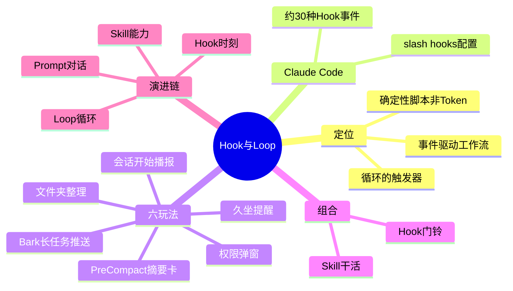
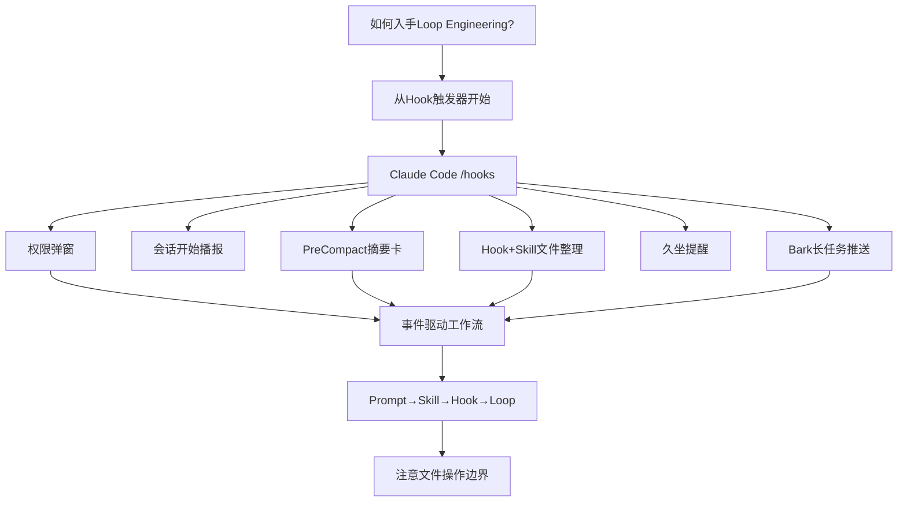

---
tags:
  - tech-article
  - Loop-Engineering
  - Claude-Code
  - Hooks
  - AI
  - 自动化
created: 2026-06-26
category: 技术文章/AI
aliases:
  - Loop Engineering Hook
  - 6个Hook玩法
  - Hook玩法入门
---

# Loop Engineering：6 个 Hook 玩法入门

> **原文链接**: [微信公众号](https://mp.weixin.qq.com/s/LVj2foSXi_hBRKxjuYaUyw)

> **原标题**: 想玩Loop Engineering，可以先从这6个Hook玩法开始。

> **一句话总结**: Loop 的底层是「触发器」——Hook 在特定时刻自动执行确定性脚本；本文用 Claude Code 六个可抄作业玩法（权限提醒、开机播报、预压缩摘要、文件夹整理、久坐提醒、Bark 长任务推送）说明如何从「被动聊天」走向事件驱动的 AI 工作流。

> **前置知识检查**:
> - [ ] 用过 Claude Code 或同类 Agent CLI
> - [ ] 知道 Loop Engineering 指「有停止条件的反复执行」
> - [ ] （可选）读过 [[Claude Code-Steering Claude七种配置方式选型指南]] 中 Hooks 章节

## 原文

最近 Loop Engineering 越来越火了，也有好几个朋友问我，这个东西怎么入手，我们到底应该开始从哪设计一个 loop。

这其实是一个非常有意思的问题，如果让我真说一个东西的话，我觉得是我之前文章中反复提到的一个东西。

Hook。

每一个 Agent 里，几乎都会有 Hook 这个东西，Claude Code 和 Codex 的自动化里面，背后也都有。

loop 的意思是循环，那我们任何循环，其实都有一个最基础最初始的东西，就是触发器，也就是如果你触发了某某动作，就会去执行某某命令。

其实非常像现在我们家里的一些智能家居，比如到了 10 点，窗帘就拉开，比如识别到我出门了，就关闭家里的所有的灯，等等等等。

这个触发的条件，就是一个 Hook。

生活中也到处都是 Hook，比如到公司，手机自动切换工作模式，早上闹钟到点了自己响，这些全是 Hook。

Agent 里面也是如此，你可以通过给 Hook 设置特定的规则，自动化做很多事。

比如让 AI 在编辑修改文件前，先检查命令有没有风险。

代码修改完毕后，自动跑 lint 检查质量。

以及跑长任务的时候，你切到别的页面干别的事，它干完了发推送告诉你。

当然，Hook 的用途远远不止这些。

在 Claude Code 里也一样，把 Hook 挂在那些你关心的时刻上，提前设好什么时候做什么。

事情一来，它自己跑。你不在屏幕前也没关系。

打开 Claude Code，在底部输入 `/hooks`，会看到这个界面。

按下回车后，他会列出所有可用的 Hook 事件。

我记得年初看的时候只有 13 个，现在有将近 30 个了，翻了一倍多。

不过别被 30 这个数字吓到，我们日常真正会用到的，可能也就常用的那几个。

这里，我也整理了 6 个我觉得比较好玩的 Hook 玩法，希望抛砖引玉，能够给大家一些思路。

### 一、权限弹窗提醒

可能很多朋友都遇到过这种情况，不敢给 Claude Code 下了指令，切到别的页面干别的事。

过了十分钟回来一看，还没开始执行，卡在了请求权限那一步。

其实只需要跟 Claude Code 说一句：

帮我配置一个通知的 Hook，每当需要我授权的时候，调用系统自带的工具给我来一个弹窗提醒。

发送给 AI，它就会帮你配好了。

配完之后可以让 Claude Code 测试一下。当需要授权时，右上角会弹出提醒。再也不怕切走窗口时，AI 卡住不动，白白浪费时间了。

这时候肯定会有人问了，那每次授予权限的时候都会弹窗提醒，那岂不是很浪费 Token。

绝大多数的 Hook，其实本质上就是个代码，是个写死的规则脚本，所以在运行的时候，跟 AI 几乎没有啥关系，所以是也不会耗啥 Token。

当然，Hook 能做的远不止弹个窗，还有其他我觉得更好玩、更有意思的。

### 二、开机日程播报

我们有时候打开 Claude Code，看到的就是一个冰冷冷的界面，不好玩。

那你就可以在对话框输入：

帮我创建一个会话开始的 Hook，每当我打开或恢复 Claude Code 的时候，输出一段元气满满的问候。告诉我北京朝阳区今天的天气，会不会下雨、要不要带伞，调用飞书 CLI 拉出当天的日程安排，内容要有趣一些。

重新打开 Claude Code 后，就自动弹出这个提醒，让原本枯燥的终端，多了点温度。

当然这只是一个前菜。

接下来这个，是我觉得最实用的一个。

### 三、摘要卡片

有天晚上，我想找 Claude Code 上周帮我改的一个方案，翻了半小时聊天记录，没找到。。。

我坐在那想了很久，我那天到底让它帮我干了什么，想了好久也没想起来。

因为每天我的 Agent 用的太碎了，我手上起码现在有 4～5 个是我长期在迭代的项目，有的时候经常会并行跑，甚至 AIHOT 这样的大型一点的项目，有时候是开着分支就并行着三个。

所以我经常就是确认完你的确认你的，来来回回，化身 Agent 鸡排哥，一天下来，你自己甚至都不一定记得今天到底发生了什么。。。

而且很多真正有价值的结论，都藏在那些长对话里，一旦上下文被压缩了，或者我一个 `/clear` 命令，后面再想找，就非常痛苦。

所以我做了个 Hook，直接把这段话发给他：

帮我编写一个 Hook，当上下文处于预压缩时，生成一张摘要卡片，记录当前上下文的概要内容，方便我后续查看，将文件保存到一个跨项目也可以查看的地方，总结完毕后打印到 Claude Code 中，方便我查看。

之后，在上下文快被压缩、还没丢掉的时候，他就会赶紧生成一张摘要卡片。

这玩意的意义还是很大的，聊天记录太长，回看成本极高，你根本不想翻。

但这不一样，它其实是一张 AI 替你写的工作日记。

以后你想找某天做过什么，不用翻几万字对话，翻这些看就行，一两分钟就能看完一天到底干了些啥。

能大大释放你的脑容量空间，非常好用，甚至还可以再加一个定时 Hook，比如，每周五的时候，再把这些摘要日记，自动写成一个周报。

这个价值，你懂的。

### 四、文件自动整理

还有一个 Hook 的玩法我自己特别喜欢。

就是前段时间的时候，我整理电脑里面的下载文件夹，那玩意贼乱，截图、文档、PDF 全混在一起，每次找东西都得翻半天。

然后我突然想到，为啥不让 Claude Code 帮我干这事呢，我自己每次手动整理，也太蠢了。

所以，我就做了一个 Hook，逻辑特别简单，指定一个文件夹，每次有新文件丢进来，它自己看一下这是什么、内容是什么，然后自动重命名，再挪到该去的地方。

不过文件整理这件事，光靠简单代码搞不定，所以这里用了一个组合技，Hook+Skill。

Claude 自己有个比喻我觉得特别准，Hook 是门铃，Skill 是开门以后真正干活的人。

门铃响了，说明有新东西来了。但来了以后怎么处理，还是需要模型的能力的，比如识别文件内容、判断归哪一类、按规则重命名、挪到对应文件夹等等等等，这些，靠的还是 Skill 最方便。

Skill 也非常简单，你直接用嘴让 Claude Code 给你写就行了，因为每个人的需求不一样，所以还是写一个自己的是最好的。

这个 Hook 设置好以后，你只需要不关 Claude Code，然后呢，它就会在后台帮你悄悄盯着那个文件夹。

但凡有一个新文件进来，等几秒确认传完了，它就开始干活，然后帮你自动处理完。

不管是 PDF 还是图片，它都能自己识别内容，会议纪要归到会议那栏，发票归到报销那栏，截图还会按内容起个看得懂的名字，然后帮你挪到对应文件夹。

整个过程你什么都不需要做，你只需要把文件丢进去了，然后它自己就整理好了。

这种感觉太爽了。

你想想看，这个模式不只我这种乱七八糟的下载文件夹整理能用。

盯着比如工作项目文件夹也行，新文件按客户名和日期自动重命名等等，有很多种自动化的变体玩法，很有意思。

### 五、久坐提醒

AI 替你干活的感觉很爽，但他有一个副作用，就是太爽了，一坐就是十几个小时。

上周有一天，我早上九点打开 Claude Code，想修一个小功能。

等我再抬头，下午四点了。

我那一刻，真的感觉回到了我十年前在学校打《文明6》的感觉。

然后我发现，这事不是我一个人，很多用 AI 写代码的人都这样。

以前沉迷打游戏，现在沉迷 Vibe Coding。

所以，我当时就想，做一个久坐提醒的小东西，虽然 Apple Watch 也有久坐提醒，每隔一小时提醒一次，但在 Vibe Coding 上头的时候，有的时候不太感受的到。

所以，既然长期坐在电脑前，直接在电脑上推送不就行了。

于是简单描述了一下需求，只要我启动了 Claude Code 之后，只要过了一个小时，Claude Code 就会给我发通知提醒我休息了。

健康还是很重要的，身体才是革命的本钱，Vibe Coding 上头的时候，你根本想不起来需要站起来活动，有这么一个小提醒，还是很管用的。

这里也提醒大家，让 AI 帮你提高效率的同时，也要多多保重身体，坐久了就起来活动一下。

后面我其实还想做一个硬件，就是更加强制性的那种。。。

比如，直接给我把键盘关了之类的，强制站起来= =

### 六、长任务完成推送

然后还有一个我自己的刚需。

昨天去录了一趟严敏老师的综艺，在开始之前，我让 Claude Code 帮我做一个比较大的功能，场上要用的，而且还有点急的那种。

我坐在电脑前，看着它一行一行地出结果，看起来一切正常，就忙别的事去了，十几分钟后突然想起来，不知道有没有开发完，然后就回到电脑前一看，还在跑。

来来回回折腾好几轮。

我就想，得让它干完活了直接叫我。

于是让 Claude Code 帮我研究了一下，看看有没有什么办法能让它干完活了通知我一下，最好是可以和常用软件提示音区分开的。

然后它就跟我说了 Bark。

这是 AppStore 直接下载就能用的推送工具。

免费，也不需要注册，装完给你一个推送用的链接，让 AI 帮你配置进去就行了。

于是我顺手让 Claude Code 帮我写了个调用 Bark 的 Hook。

这下就舒服了。

手机和手表同时收到消息，还可以自定义推送声音，跟微信、飞书、短信这些区分开，一听声音就知道 AI 干完活了，可以切回去查看成果了，而且还是中文。

这个体验真的很爽。

有了这个，你就可以放心离开电脑去干别的事，根本不用惦记着切回来瞄一眼。

这个玩法也特别容易扩展，比如任务成功了发个轻松的提示音，任务失败了发个明显的提示音，让你知道要回去看看。

需要输入的时候，推送里直接写清楚它在等什么。

### 写在最后

未来越来越多的 AI 工作流，我觉得一定是事件驱动的。

新的一天开始了，它帮你启动，文件出现了，它去处理，上下文快满了，它先归档，任务完成了，它来通知，一天结束了，它自动总结。

包括现在 Github 上，很多项目是用 Agent 监控 issue，别人提出了 issue，它就调用 Agent 自动去修，修完了自动推送，推送完自动回复。。。

这件事一点都不玄乎，就是让 AI 从一个被动聊天框，慢慢变成你工作生活的一部分。

当然，我也不建议大家一上来就搞得太复杂。

Hook 一旦开始接入真实工作流，就一定要注意稳定性和边界，尤其是涉及文件移动、删除、重命名、填表这种动作，别一上来就让它在你的重要文件夹里横冲直撞。

但只要你把边界设计好，它真的会非常好用。

Prompt 解决的，是一次对话。

Skill 解决的，是一类能力。

Hook 解决的，是一个时刻。

从对话，到能力，到时刻，再到循环。

AI 越来越成为一个替你运转的系统。

让你有时间，去做更有趣的事情。

> **图片说明**: 配图 16 张位于 `assets/Loop Engineering-6个Hook玩法入门/`，微信 CDN 原链可能过期。

---

## 核心概念脑图

## 与你已有知识的关联

**《[[Loop Engineering-概念解析思考与实践|Loop 概念解析]]》**：本文从「触发器」切入 Loop，概念篇讲 Intent Debt 与生成者/检查者分离；Hook 是 Loop 里「何时启动下一圈」的工程化落点。

**《[[Claude Code-Steering Claude七种配置方式选型指南|Steering Claude Code]]》**：官方七种配置中 Hooks 是唯一确定性机制、几乎零 Token；本文是同一能力的六个生活化实操案例。

**《[[Claude Code记忆系统-得物自我进化与Hook观测实践|Claude Code 记忆系统]]》**：得物用 Hook 做观测与记忆演化；本文「预压缩摘要卡」是 PreCompact 类 Hook 的个人知识管理变体。

**《[[Loop Engineering-实操手册与14步落地清单|Loop 14 步清单]]》**：14 步里的停止条件、状态外置与本文「任务完成 Bark 推送」同属 Loop 可观测性；Hook 可先实现清单中的通知与归档步骤。

**《[[Skills-从编程工具配角到Agent研发核心|Skills 核心]]》**：文件整理玩法明确 Hook+Skill 分工——Hook 侦听新文件，Skill 承担识别与归类，与 Skills 作为「能力包」的定位一致。

## 重难点理解

- **重点1**: Hook ≠ 让 AI 再想想 — 多数是写死的脚本，触发时直接执行，**几乎不耗 Token**；与 Prompt/Skill 的模型调用成本不同。
- **重点2**: Loop 的最小单元是触发器 — 智能家居类比（到点拉窗帘）帮助理解：先定义「什么时刻发生什么」，再谈多步循环。
- **重点3**: Hook+Skill 组合 — 门铃（Hook）只负责「有新文件」；开门后的理解、重命名、移动靠 Skill/模型能力。
- **难点1**: PreCompact 摘要卡 — 在上下文压缩**之前**落盘，解决多项目并行后「今天干了啥」不可追溯；可叠加周五周报 Hook 形成二级 Loop。
- **难点2**: 文件整理的安全边界 — 作者明确警告：涉及移动/删除/重命名勿在重要目录一上来全自动；应先沙箱目录验证。
- **误区**: 「Hook 事件有 30 个都要学」— 日常常用子集即可；从权限提醒、任务完成通知、PreCompact 三类最高 ROI 开始。

## 原文内容流程图

## 经验

1. **用自然语言配 Hook**: 六个玩法均可直接口述需求让 Claude Code 生成配置 — **应用场景**: 快速验证 Hook 价值，无需先啃 30 种事件文档。
2. **离开屏幕前的三件套**: 权限弹窗 + 长任务 Bark +（可选）久坐提醒 — **应用场景**: Vibe Coding 长时间后台跑任务。
3. **摘要卡当工作日记**: PreCompact Hook 存跨项目可读路径 — **应用场景**: 多分支/多项目并行，避免 `/clear` 后失忆。
4. **推送音区分渠道**: Bark 自定义声音与微信/飞书区分 — **应用场景**: 手机在口袋也能判断「AI 干完了」还是「人来消息了」。

## 知识

| 知识点 | 定义 | 关键要素 | 关联概念 |
| --- | --- | --- | --- |
| Hook | Agent 生命周期上的触发器，到点执行脚本 | 事件类型、settings.json、确定性 | Loop 触发、Harness 门禁 |
| PreCompact Hook | 上下文压缩前触发的归档 | 摘要卡片、跨项目路径 | Context Rot、记忆外置 |
| Hook+Skill | 侦听与处理分工 | 门铃 vs 开门干活 | Skills、自动化流水线 |
| Bark | iOS 免费推送工具，URL 即可调用 | 自定义铃声、中英推送 | 长任务可观测性 |
| 事件驱动工作流 | 由时刻/文件/任务状态驱动而非轮询聊天 | 开机、新文件、压缩、完成 | Loop Engineering、GitHub issue Agent |

## 可复用建议

1. **入门 Loop 先装 2 个 Hook**: 权限提醒 + 任务完成推送 — **适用场景**: 任何 Claude Code 用户 — **预期效果**: 立刻减少「切走窗口白等」与「反复回来看进度」。
2. **多项目并行必做 PreCompact 摘要**: 指定统一目录存 Markdown 摘要 — **适用场景**: 3+ 项目同时跑 Agent — **预期效果**: 日后 1–2 分钟复盘一天工作。
3. **文件自动化先沙箱**: 下载文件夹或 `~/inbox` 试点，禁止直接挂 Documents — **适用场景**: Hook+Skill 整理 — **预期效果**: 避免误移重要文件。
4. **周五定时 Hook 聚合摘要**: 在摘要卡基础上加 cron/定时 Hook 生成周报 — **适用场景**: 个人效能复盘 — **预期效果**: 从「时刻」升级到「周期」Loop。

## 实施办法

1. **第1步**: Claude Code 输入 `/hooks`，浏览事件列表，先实现「权限弹窗」验证零 Token 自动化。
2. **第2步**: 配置 PreCompact 摘要 Hook，指定跨项目摘要目录（如 `~/agent-journal/`）。
3. **第3步**: 安装 [Bark](https://apps.apple.com/app/bark-customed-notifications/id1403753865)，让 Claude 写任务完成/失败差异化推送 Hook。
4. **第4步**: 对照 [[Loop Engineering-实操手册与14步落地清单]]，把 Hook 映射到 14 步中的通知、状态持久化与停止条件；进阶读 [[专题/Loop工程专题]]。
