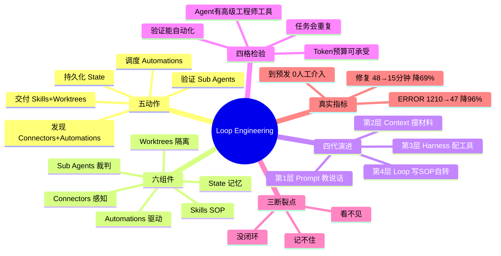
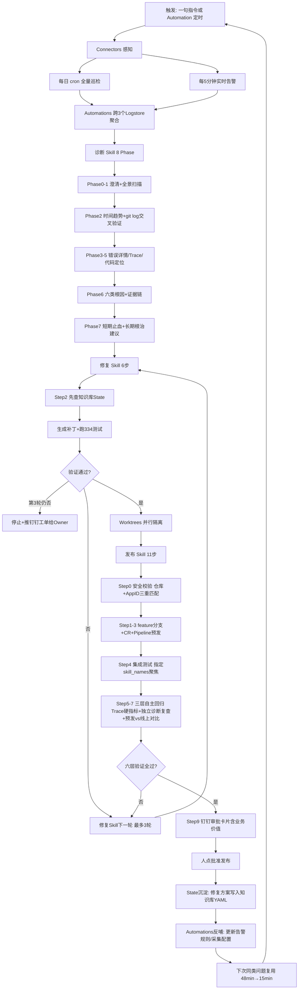

---
tags:
  - tech-article
  - AI
  - Agent
  - LoopEngineering
  - 自动化运维
  - Harness
created: 2026-07-07
category: 技术文章/AI
aliases:
  - Loop Engineering日志扫描闭环
  - 全自主维护循环
  - 日志扫描到预发部署
---

# Loop Engineering：日志扫描到预发部署全自主闭环

> **原文链接**: https://mp.weixin.qq.com/s/AQLsjzD0s9d8kGUGdul0sg
> **作者**: 也达
> **发布日期**: 2026-07-07
> **原标题**: Loop Engineering 实战：实现从日志扫描到预发部署的全自主闭环
> **一句话总结**: 本文以维护 AI 云诊断系统的日常实践为例，给出从日志扫描、根因诊断、自动补丁、334 条测试、CR、预发部署、六层验证到钉钉审批的端到端 Loop 闭环——一周 ERROR 从 1210 条降到 47 条，同类问题修复从 48 分钟降到 15 分钟，到预发 0 人工介入。
> **前置知识检查**:
> - [ ] Prompt / Context / Harness / Loop 四代 AI 工程化范式
> - [ ] MCP（Model Context Protocol）工具接入
> - [ ] SLS（日志服务）、Langfuse（LLM Trace 观测）
> - [ ] Git Worktree、CR/Pipeline、预发环境
> - [ ] Sub Agent 独立验证、Skill（SOP 磁盘化）、State 持久化

---

## 原文

阿里妹导读

文章内容基于作者个人技术实践与独立思考，旨在分享经验，仅代表个人观点。

### 1 引子：Loop Engineering 的目标不是写得更快，而是让你从维护循环里撤出来

Boris Cherny 单日合并 150 个 PR；Peter Steinberger 同时跑 100 个 AI Agent 持续编码 30 天。数字背后是同一件事：**瓶颈不在写得更快，而在能否设计出自己转的循环。**

能跑起来的循环不等于有用的循环——**循环的本质，是生成器接上验证器。** 没有验证器，自动化只是在更快地烧 token。

| 指标 | Before | After | 变化 |
| --- | --- | --- | --- |
| 一周 ERROR 总量 | 1210 条 | 47 条 | ↓ 96% |
| 同类问题修复时间 | 48 分钟 | 15 分钟 | ↓ 69% |
| 人工介入次数（到预发） | 每次都要 | 0 次 | 全自动 |

*表1-1：Before/After 效果对比（三项指标分别对应发现速度、修复效率、人工介入三个断裂点）*

上述数字来自同一条日常链路：**一句指令，Agent 从 3 个日志库挖出 Bug → 诊断根因 → 生成补丁 → 跑完 334 条测试 → 提交 CR → 预发部署 → 集成验证 → 钉钉通知审批。** 人只需点「批准发布」。

这不是概念验证，是我们维护 AI 云诊断系统的日常。全文沿三条主线展开：

- **日志分析自主挖 Bug** — 跨 3 个 Logstore 关联、7 子命令 + `git log` 交叉验证
- **Bug 自主修复闭环** — 发现 → 诊断 → 补丁 → 测试 → 预发部署，全程 Agent 驱动
- **一条指令或定时触发跑完全流程** — 人工一句话触发，或 Automation 每日自动跑：开发 → 部署 → 测试 → 预发 → 线上对比

### 2 痛点：AI 写代码快了，但发现→修复→上线的维护循环仍靠你推

**2026 年 6 月第二周，我们一周捞出 1210 条 ERROR**——散在 3 个日志库，类型从上游超时到 LLM 幻觉应有尽有。

2025 年 3 月起，我们开始大规模用 AI 写代码。一个新功能从想法到实现，可能只要半天。但代码写完只是开头。

**真正吃时间的，是上线之后的维护循环：** 发现问题 → 查日志 → 定位根因 → 写修复 → 跑测试 → 上线。AI 帮你写代码很快，推动这个循环转起来的，还是你。

我们维护着一套 AI 驱动的诊断系统——帮用户排查云服务器故障。讽刺的是：**这个系统本身也有一堆线上问题要修。**

值班同事打开日志控制台，只看得到热门几条。每条都要手动复制、喂 AI、对代码、写修复、跑测试、提审查、等发布。**一轮排查花 2–3 天，覆盖的不过冰山一角。**

图2-1：人工驱动维护循环的瓶颈——任一环节卡住，整条链路停转；人推循环 = 单线程瓶颈

**2.1 维护循环卡死的三个断裂点：看不见、记不住、没闭环**

**看不见。** 错误散在三个日志库（`agent_log`、`mcp_client_log`、`mcp_server_log`），没有人做聚合。某天从 50 条飙到 350 条，第二天才有人发现——**晚了整整一天。**

**记不住。** 上次排查连接池超时花了整天（根因是某个方法设了 2 秒激进超时），下次遇到同类问题还得从头来。AI 在对话里推理得很好，但关掉对话就失忆了。

**没闭环。** 有一次 Agent 说「已修复」——其实只是把 `logger.error` 改成了 `logger.warning`。错误还在，只是不报了。**区分「掩盖故障」和「合理降级」需要独立验证，不能靠修复者自证。**

**根因只有一个：维护链路从没被当成一个需要设计的系统。** 它靠人在推，人就是瓶颈。这三点缺位，正是前三代 AI 工程化填不上的坑——接下来看看，AI 工程化走过了哪些阶段，为什么到了 Loop 这一层才能真正填上这些断裂点。

### 3 演进：从 Prompt 到 Loop，四代 AI 工程化范式逐层叠加

**AI 工程化走过了四层楼，像带新人：**

**第1层：先教说话（Prompt）**——告诉新人「去查一下连接池超时的原因」，他能照着做一次，但下次换个问题还得你再说一遍。*典型：ChatGPT 对话式排查。*

**第2层：再摆材料（Context）**——把代码库、文档、日志样本一次性喂给他，他能给出更准的分析，但仍然是你问一句答一句。*典型：Cursor 带 codebase 索引。*

**第3层：再配工具（Harness）**——给他 Shell、MCP、Git 权限，他能自己查日志、改代码、跑测试，但每次都要你启动。*典型：Claude Code 单次会话修 Bug。*

**第4层：最后写 SOP 让他自己转（Loop）**——写好巡检规则、修复手册、验证标准，他每天自己扫、自己修、自己验，你只在关键节点审批。*典型：本文实践。*

**上层包含下层所有能力，每层解锁新瓶颈：**

图3-1：四代 AI 工程化范式演进——选范式前先问：你的任务卡在哪一层瓶颈

Loop 在 Harness 之上补上自动发现、验证、持久化与调度，才能填上三个断裂点：

**→ 看不见** → 发现（Connectors + Automations）
**→ 记不住** → 持久化（State + Skills）
**→ 没闭环** → 验证（Sub Agents）

知道了四层楼的关系，接下来具体定义：Loop 层到底包含什么？怎么判断一个任务该不该建 Loop？需要哪些组件？

### 4 原理：Loop 是让 AI 自己发现工作、验证结果并记住经验的系统设计方法

**前三层解决「AI 能不能做好一件事」，Loop 解决「谁来驱动 AI 持续做事」。** 如果你发现自己每天都在手动触发 Agent、审查结果、推进流程——**你就是循环里最慢的一环。**

**Loop 和 Harness 的本质区别：** Harness 是一次运行的武装——工具、动作、完成条件。Loop 在 Harness 之上加了定时调度、子 Agent 并行、跨轮记忆三件事。**跨越单次对话的记忆，是「循环」和「一次性操作」的分界线。**

**4.1 Loop 靠发现、交付、验证、持久化、调度五个动作才能持续运转**

图4-1：Loop 五动作闭环——缺验证或调度，循环退化为一次性 prompt

**发现**（找出该做的事）→ **交付**（隔离交给 Agent）→ **验证**（换个 Agent 说不）→ **持久化**（状态写到对话外）→ **调度**（一圈圈自动转）。

**调度是最后一块拼图：** 没有自动化，循环就不是循环，只是一次性操作。

**4.2 四格检验：不是所有任务都值得建 Loop**

五个动作描述了 Loop **怎么转**，但还有一个前置问题——**该不该建**。建 Loop 有 setup 成本（写 Skill、接 Connectors、调验证器），不是所有场景都值得投入。

**四格检验：任务会重复、验证能自动化、Token 预算可承受、Agent 有高级工程师的工具——四格全满才值得建 Loop。** 我们的日志诊断场景逐条验证：每天跑（重复）、334 条测试 + 6 层验证（自动化）、单次耗费可预估（预算）、SLS + Langfuse + Pipeline 全通（工具齐备）。反例：一次性架构评审、「提升用户体验」这类目标模糊的探索——任一条件缺失就不该建 Loop。

**4.3 六个组件如何拼成一个完整的 Loop 闭环**

Loop 要转起来，需要六个配合的零件——Connectors（感知）、Automations（驱动）、Skills（SOP）、Worktrees（隔离）、Sub Agents（裁判）、State（记忆）。它们按依赖顺序拼成闭环：

图4-2：六个组件协作架构——Connectors 决定感知上限，State 决定复利斜率

五个动作映射到六个组件：发现靠 Connectors + Automations，交付靠 Skills + Worktrees，验证靠 Sub Agents，持久化靠 State，调度靠 Automations。**实施依赖顺序：** Connectors（地基）→ Automations → Skills → Worktrees → Sub Agents → State。缺一个，后面的都站不住。

### 5 实践：从日志扫描到预发部署，我们如何落地全自主 Loop

**这不是 Demo，而是每天在跑的生产系统。** 系统每天自动扫描 10+ 项目日志，自主发现、定位、修复、验证、发布。

上周一次真实运转：

**验证失败时，修复 Skill 自动进入下一轮**（分析失败原因 → 调整补丁 → 重跑测试），最多 3 轮。上周三连接池补丁导致 2 个单测失败，第 2 轮更新 mock 参数后通过。**第 3 轮仍失败则自动停止并推送钉钉工单给 Owner**——不在错误方向上无限重试。

| 阶段 | 传统方式 | 我们的 Loop | 提升 |
| --- | --- | --- | --- |
| 发现 | 值班同事第二天看日志 | 5 分钟内自动告警 + 每日全量扫描 | 天级 → 分钟级 |
| 诊断 | 人工复制日志喂 AI，两三天覆盖 Top 3-5 | 8 阶段结构化诊断，48 分钟全部根因定位 | 覆盖率从 Top 5 → 全量 |
| 修复 | 人写补丁、跑测试、提 CR | 自动生成补丁 → 跑 334 个测试 → 提交 | 人工半天 → 自动 15 分钟 |
| 验证 | 修复者自己说「好了」 | 6 层独立验证，修复者不能给自己打分 | 消灭假修复 |
| 发布 | 手动部署 + 人工检查 | 自动部署预发 → 集成测试 → Trace 验证 → 钉钉推送 | 全自动到预发 |
| 沉淀 | 关掉对话就忘了 | 修复方案自动写入知识库，同类问题从 48min 降到 15min | 经验可复用 |

***表5-1：传统方式 vs. Loop 全流程对比（发现、诊断、修复、验证、发布、沉淀六阶段）***

**5.1 Connectors 用 MCP 打通日志、追踪与发布，让 Agent 看见线上世界**

**Connectors 排第一，因为 Agent 默认只能看见本地文件系统。** 没有工具接入，后面所有组件都是空中楼阁。

图5-1：Connectors 六层架构——没有跨库 trace，Agent 只能做单表搜索

9000+ 行工具链搭了 6 层连接器（数据访问 → 模型追踪 → 发布 → 通知 → 验证 → 基础设施），让 Agent 具备完整的线上感知和操作能力。

**日志查询是 Connectors 层最核心的能力。** 1280 行脚本（`sls_logquery_tools.py`）提供 7 个子命令，数据分散在 3 个 Logstore 中：

| Logstore | 记录什么 | 典型字段 |
| --- | --- | --- |
| agent_log | API 入口、Agent 路由、Python 异常 | request_id, file, level |
| mcp_client_log | MCP 工具执行详情、耗时 | request_id, tool_name, duration_ms |
| mcp_server_log | 工具调用链、入参出参 | request_id, response_status |

*表5-2：三个 Logstore 分工*

7 个子命令对这三个库做到了跨库关联、全链路覆盖和结论可验证——普通做法需要在三个控制台手工对齐 `request_id`，Agent 用 `trace` 一条命令就能串起完整链路。

**真实案例：`trace` 一条命令还原 30 分钟人工排查。** 某次 `ToolException` 报错，值班同事在三个控制台间切了 30 分钟才拼出完整链路。Agent 执行：

**输出节选：**

一条命令看清：**API 入口 → Agent 路由 → MCP 工具超时 → 远端 Java 855 行抛错 → 我方缺 fallback。** 配合诊断 Skill Phase 2 的 `git log` 交叉验证，还能区分「新问题」还是「老毛病突然恶化」。

**基础设施也是代码管理的。** 采集配置（`logtail_config.yaml`）、告警规则（`alert_config.yaml`）、监控大盘（`dashboards/*.json`）全部声明式管理。Agent 发现新错误模式就补充告警规则，新增日志库就更新采集配置。

**教训：工具链建设约占 30% 总工作量。** 没有跨系统关联分析（日志 × 追踪 × 代码变更），后面所有自动化都是空谈。

**5.2 Automations 用定时巡检与实时告警让系统自己发现异常**

**Automations 解决痛点章「看不见」：** 10+ 项目的错误散在 3 个日志库，50 条飙到 350 条往往第二天才有人发现。

图5-2：Automations 两层发现——巡检抓慢性问题，告警抓突发问题

两层协作：第一层每日 cron 全量巡检，系统自己扫、自己写报告、自己归档；第二层实时告警每 5 分钟扫一轮，命中后钉钉群推送卡片（内嵌 Langfuse Trace 链接），严重故障自动触发语音电话。

**5.3 Skills 把诊断、修复、发布三段经验固化成可复用的 SOP**

**Skills 解决痛点章「记不住」：** 排查经验在对话里，关掉就失忆。Skill 把 SOP 写到磁盘，换个 Agent 来跑，产出一样。

图5-3：三个 Skill 流水线——Skill 是 SOP 磁盘化，不是更长 prompt

| Skill | 做什么 | 规模 | 关键设计 |
| --- | --- | --- | --- |
| 诊断（diagnose） | 8 阶段结构化诊断 | 760 行 SKILL.md | 每个结论必须标注证据来源 |
| 修复（auto-fix） | 解析报告→查知识库→生成补丁→跑测试→提交 | 6 步流程 | 先查历史方案，最多 3 轮 |
| 发布验证（deploy-and-verify） | 安全校验→CR→Pipeline→预发→集成测试→Trace 验证→线上对比→通知 | 11 步，400 行 | 独立 Agent 复查 |

*表5-3：三个核心 Skill 概览*

#### 5.3.1 诊断 Skill 用 8 个 Phase 和 git log 交叉验证，堵住 Agent 偷工减料

**这份 SKILL.md 不是 prompt，而是一份严格的操作手册**——每个 Phase 规定用什么工具、查什么数据、输出什么格式、哪些步骤不能跳过。不写死规则，Agent 就会偷懒：跳过趋势分析、不做交叉验证、只看第一条日志就下结论。

| Phase | 做什么 | 为什么不能跳 | 关键工具 |
| --- | --- | --- | --- |
| 0 澄清 | 确认时间范围、分析模式 | 不确认就会分析错误时间段 | 对话 |
| 1 全景扫描 | 跨 3 个日志库统计错误分布 | 不扫全景就会遗漏类别 | raw-query+diagnose |
| 2 时间趋势 | 识别突增/慢性/回归模式 | 不看趋势就分不清新旧 | error-trend+git log |
| 3 错误详情 | 完整 traceback + 输入参数 | 截断 traceback 就定位不了 | error-lookup |
| 4 Trace 追踪 | 模型调用链、token、fallback | 不查 Trace 就不知道哪步失败 | Langfuse MCP |
| 5 代码定位 | 精确到 file:line + Owner | 不定位就没法修 | Read+git log |
| 6 根因分析 | 6 类分类 + 证据链推理 | 没证据链就是猜 | 交叉验证 |
| 7 修复建议 | 短期止血 + 长期根治 | 没建议就等于没诊断 | — |

*表5-4：诊断 Skill 八个 Phase 设计逻辑*

**Phase 2 的精华：git log 交叉验证。** Agent 不能只看错误首次出现时间就下结论：

**Phase 6 的精华：结构化根因推理链。** 每个结论必须按 `[事实]→[推理]→[结论]` 格式输出：

| 根因分类 | 修复方向 | 示例 |
| --- | --- | --- |
| 外部系统异常 | 防御式：try-except + fallback + retry | MCP 工具返回 Java stackTrace |
| 内部代码缺陷 | 精确修改 file:line | TypeError 在 src/deep_diagnose/ |
| 基础设施问题 | 配置调整 | 连接池 pool_size=5 |
| LLM/模型异常 | Prompt 约束 + schema 校验 | 幻觉编造不存在的表名 |
| 预期行为（误报） | 确认后降级日志级别 | CancelledError |
| 数据问题 | 不修，转工单给 Owner | 用户数据异常 |

*表5-5：六种根因分类与修复方向*

#### 5.3.2 修复 Skill 用 6 步把诊断报告自动变成可合并的补丁

**诊断报告就是接口——修复 Skill 读取结构化报告后自动接管，人不需要在中间传话。**

**Step 2 先查知识库再动手修**——知识库积累 30+ 条修复方案（YAML 格式），命中后直接复用。连接池问题首次修复 48 分钟，有知识库后 15 分钟。

| 分类 | 修复模式 | 示例 |
| --- | --- | --- |
| 外部系统 | try-except + fallback + retry | ToolException→ 降级处理返回空结果 |
| 内部缺陷 | 精确修改 file:line | chat/repository.py:45→ 修改连接池配置 |
| 用户输入 | 添加参数校验 | ODPS 查询前验证表名存在 |
| 基础设施 | 配置调整 | 连接池pool_size=5, max_overflow=10 |
| 预期行为 | 日志级别调整 | logger.error→logger.warning |

*表5-6：按根因分类选择修复模式（侧重具体改法，分类见表5-5）*

**修复原则：** 最小化改动、保持向后兼容、外部系统问题用 try-except 包裹。测试不过就修改重跑，**最多 3 轮**——超过 3 轮自动升级人工。

#### 5.3.3 发布 Skill 用 11 步串起预发部署、Trace 验证与独立复查

**到预发全自动，生产发布是唯一需要人确认的环节。** 修复完成后，11 个步骤一条命令触发：

| 步骤 | 做什么 | 关键约束 |
| --- | --- | --- |
| 0 安全校验 | 确认是正确的仓库和应用 | 仓库 + App ID 必须匹配，否则立即停止 |
| 1 自动提交 | 创建 feature 分支 + 推送 | 禁止直推 master/develop |
| 2 CR + Reviewer | 创建 Code Review + 指定审查人 | MR 目标必须是 develop 分支 |
| 3 提交 Pipeline | 触发预发部署流水线 | Pipeline 423（预发） |
| 4 预发功能验证 | 针对本次修改的集成测试（自主回归） | 必须指定 skill_names 聚焦测试 |
| 5 Langfuse Trace 验证 | 0 ERROR + 正确模型 + token 合理 | 表5-7：发布 Skill 十一步流程 |

**三个最易踩坑的步骤：**

**Step 0 安全校验** — 执行前验证仓库、App ID、仓库地址三重匹配，任一不符立即停止。

**Step 4 集成测试——必须聚焦。** 必须指定 `skill_names`，否则系统加载全量工具集，测试不聚焦：

**Step 5–7 构成自主回归三层验证** — Trace 硬指标、独立诊断复查、预发 vs 线上 Langfuse 对比。**任一偏差则阻塞发布，回到修复 Skill 第 2 轮。**

| 检查项 | 通过标准 | 为什么 |
| --- | --- | --- |
| ERROR observations | 必须为 0 | 任何 ERROR 说明有未处理异常 |
| 主模型 | 与请求一致，无非预期 fallback | fallback 说明首选模型有问题 |
| max input_tokens | 表5-8：Langfuse Trace 四项硬指标 |

***（ERROR、主模型、token 上限、Agent 完成状态）***

**Step 9 钉钉通知**须含业务价值描述，让 Reviewer 5 秒内理解收益与风险。

**5.4 Worktrees 为每个 Bug 开独立工作区，让多类错误并行修复互不覆盖**

**Worktrees 解决并行覆盖：** 三个 Agent 同时改同一文件，后提交的覆盖前者修复，浪费一整轮 token。

图5-4：Git Worktree 并行修复——三类问题串行 45 分钟 vs 并行 17 分钟

诊断一次扫出多类错误，每类问题需要独立修复。早期三个 Agent 在同一工作区同时改代码，后提交的覆盖前者修复，冲突率约 30%。

**Git Worktree 是解法：** 同一仓库检出多个工作目录，共享 `.git` 历史但工作区物理隔离：

一个 Agent 在 `../fix-timeout` 改连接池配置，另一个在 `../fix-hallucination` 加 schema 校验——互不干扰。每个分支独立走完 **修复 → 测试 → CR → Pipeline → 验证** 全流程后才合并到 develop。

**分支命名约定：** `fix/<问题描述>_<日期>_<序号>`。三个 Worktree 各自完成验证后，按修复优先级依次合入 develop。若两分支改同一文件，第二个合并前 rebase 并重新跑测试——比同一工作区互相覆盖可控得多。**大部分修复涉及不同文件，冲突率不到 5%。**

**并行加速：三类问题串行约 45 分钟，并行只需 17 分钟**（最长的一类 + 合并开销）。`git worktree add` setup 成本不到 1 秒。

**5.5 Sub Agents 用六层独立验证确保修复者不能给自己打分**

**Sub Agents 解决痛点章「没闭环」：** 修复者自证不可靠，必须换 Agent 验。

图5-5：六层独立验证——第 3 层专抓日志降级类假修复

| 层 | 评判手段 | 通过标准 | 能抓什么 | 典型盲点 |
| --- | --- | --- | --- | --- |
| 1 | Lint | 零 warning | 格式/语法 | 逻辑与行为 |
| 2 | 单元测试 | 全量单测通过 | 逻辑回归 | 日志降级类假修复 |
| 3 | 预发日志 | 无新增 ERROR 类型 | 部署引入的新 ERROR | — |
| 4 | 线上对比 | 预发与线上一致 | 行为偏差 | — |
| 5 | 集成测试 | 修改部分全过 | 端到端链路 | — |
| 6 | UI 验证 | 页面行为正常 | 前端渲染 | — |

*表5-9：六层独立验证体系（含各层能抓 / 抓不住）*

只靠单元测试，痛点章那次 `logger.error` → `logger.warning` 的假修复完全能过。**第 3 层独立诊断复查专抓这类问题：** 日志级别变了，但 Langfuse Trace 中的 ERROR observation 仍在。修复 Agent 能骗自己，骗不了独立验证 Agent。

验证通过后自动推送钉钉审批卡片——包含业务价值描述、MR 链接、测试报告、Langfuse Trace 链接：

图5-6：验证通过后的钉钉审批卡片——须让 Reviewer 5 秒内判断 merge 风险

6 层验证解决「当次修复是否可信」；State 解决「下次遇到同类问题是否更快」。

**5.6 State 把修复方案与巡检结果落盘，让同类问题越修越快**

**State 解决痛点章「记不住」：** 经验必须落盘，Loop 才有复利。三类 State 各司其职：知识库沉淀修复方案（30+ 条 YAML），每日归档保留巡检数据跨天可追溯，基础设施配置（告警规则、采集配置、监控大盘）全部 Git 版本化——Agent 发现新错误模式就补充规则，检测网越织越密。

**5.7 六个组件串成端到端流水线：验证失败自动重试，三轮不过升级人工**

**六个组件拼成一条完整链路：触发 → 感知 → 诊断 → 修复 → 验证 → 发布 → 沉淀。**

**图5-7：端到端 Loop 闭环——3 轮失败升级人工，避免 0.95^N 在错误方向空转**

修复 Skill 最多 3 轮自动重试；超过 3 轮停止并推送钉钉工单给 Owner。成功后修复方案写入知识库（State），监控策略同步更新（Automations 反哺），下次遇到同类问题直接复用。

**小结：** 回顾整条链路——Connectors 让 Agent 看见线上世界，Automations 让发现不再依赖人，Skills 把经验固化为可复用的 SOP，Worktrees 让多类问题并行不冲突，Sub Agents 确保修复者不能自证，State 让同类问题越修越快。六个组件各司其职，拼出了从发现到预发全程 48 分钟、0 人工介入的完整闭环。系统跑通了——但更值得思考的问题是：当维护循环不再需要人来推，工程师的角色发生了什么变化？

### 6 范式迁移：未来已来，工程师的角色正从「推循环的人」变成「设计循环的人」

**未来不是远景，而是正在发生的事。** Boris Cherny 一天提交 150 个 PR——不是因为他写代码更快，而是因为他设计了让 Agent 自己转的循环。这不是个例，而是一种范式迁移的信号。

图6-1：Loop 规模化——从一个人推一个系统，到一个人设计多个系统的自主循环

**范式迁移的核心变化不是工具，而是人的角色。** Prompt 时代你是指令官，Context 时代你是材料员，Harness 时代你是工具配置师——到了 Loop 时代，你是**循环设计师**。你不再亲手查日志、写修复、跑测试、推发布，而是设计让这些事情自动发生的规则系统。

**我们已经在这条路上走出了第一步。** 日志诊断 Loop 证明了从发现到预发的全链路可以自动转。下一步是把同样的骨架（五动作 + 六组件）复制到更多项目——换 Connectors、换 Skills、换验证器，但架构不变。

**6.1 踩过的坑：四条血泪教训**

**教训一：连续两周不看 diff 就合并。** 系统越好用人越容易放松警惕。结果一个 Agent 把 `retry=3` 改成了 `retry=0`，导致线上超时率翻倍。**对策：每周至少抽查 3 个 diff。**

**教训二：验证器覆盖不全 = 假安全感。** 初版只有单元测试，`logger.error→warning` 假修复就是因为第 3 层预发日志验证还没上线。**对策：至少 3 层验证才能自动合并。**

**教训三：Token 成本失控。** 初期每次全量诊断耗费 200K+ token，一周烧掉预算上限。后来加了分级策略：先用小模型做初筛（耗费 5K token），只有高优问题才调大模型深度诊断。**对策：分级策略 + 预算熔断。**

**教训四：Connectors 建设被低估。** 工具链（SLS 查询脚本 + Langfuse MCP + 发布脚本）占了总工作量 30%，但前两周几乎没投入。**对策：先花两周打好 Connectors 地基，再建上层。**

**6.2 给读者的行动清单**

如果你想把 Loop 应用到自己的项目，按这个顺序走：

| 周 | 做什么 | 产出 | 验收标准 |
| --- | --- | --- | --- |
| 1 | 四格检验 + 选场景 | 一张四格表 + 一个确定的目标场景 | 四格全满 |
| 2-3 | 建 Connectors（接日志/监控/发布） | Agent 能查日志、能触发发布 | 一条命令跑通全链路 |
| 4 | 写第一个 Skill + 加定时调度 | 每天自动跑一轮 Loop | 连续 3 天无人值守运转 |

*表6-2：四周落地计划*

### 7 结语：工程师的价值正从写 Prompt 转向设计能自己转的循环

**Loop Engineering 不是一种产品，而是一种工程思维——不再问「这条 prompt 怎么写更好」，而是问「这个循环能不能自己转」。**

2025 年我们以为 AI 解决的是「写代码慢」；一年后发现，**真正的瓶颈是维护循环仍靠人在推。**

**别再当循环里最慢的那一环——去设计循环。**

千问云-为Agent而生，驱动AI生产力
扫描下方二维码，直达千问云体验

点击阅读原文即可体验！

> **图片说明**: 配图位于 assets/Loop Engineering-日志扫描到预发部署全自主闭环/，CDN 可能过期

---

## 核心概念脑图

---

## 与你已有知识的关联

**《[[大厂技术文章-DailyTech/文章/Loop Engineering-深度拆解概念与实践趋势|Loop Engineering-深度拆解概念与实践趋势]]》**：本文是概念文的落地实证。概念文讲 Loop 的五动作与六组件理论框架，本文则用「日志扫描到预发部署」这条真实链路把每个组件填进具体场景（如 Connectors 对应 1280 行 SLS 查询脚本、State 对应 30+ 条 YAML 知识库），两篇合看才能从「知道 Loop 是什么」走到「知道 Loop 怎么拼」。

**《[[大厂技术文章-DailyTech/文章/Loop Engineering-实操手册与14步落地清单|Loop Engineering-实操手册与14步落地清单]]》**：本文与实操手册互补。手册给出 14 步通用落地清单，本文给出一个完整案例对照每一步（如四格检验→日志诊断场景、Connectors 地基→SLS+Langfuse+发布脚本、State→知识库 YAML），可作为手册的「参考实现」阅读。

**《[[大厂技术文章-DailyTech/文章/Loop Engineering-企业Agent落地四层演进与诊断框架|Loop Engineering-企业Agent落地四层演进与诊断框架]]》**：两篇都讲「四代演进 + 诊断框架」。本文的「四层楼」(Prompt/Context/Harness/Loop) 与该文的四层演进同源，且本文的 8 Phase 诊断 Skill 与该文的诊断框架在结构化根因推理上互为印证——都强调「证据链 + 交叉验证」而非 Agent 自由发挥。

**《[[大厂技术文章-DailyTech/文章/AI开发范式-Prompt到Context Harness Loop四层演进综述|AI开发范式-Prompt到Context Harness Loop四层演进综述]]》**：该文是四层演进的综述理论，本文是第四层 Loop 的生产案例。读完综述再看本文，能清楚看到「Loop 在 Harness 之上补的三件事（自动发现、跨轮记忆、子 Agent 并行验证）」分别对应本文的 Automations、State、Sub Agents 三个组件。

**《[[大厂技术文章-DailyTech/文章/告警排查Agent-得物LLM Agent重构告警流程|告警排查Agent-得物LLM Agent重构告警流程]]》**：两篇都做「告警/日志 → 诊断 → 修复」的 Agent 化。得物告警 Agent 聚焦告警入口到诊断建议；本文更进一步，把诊断结果接上自动补丁、334 条测试、预发部署与六层验证，形成到预发的完整闭环。可作为「诊断 Agent」与「全自主 Loop」的对照阅读。

**《[[大厂技术文章-DailyTech/文章/Claude Code记忆系统-得物自我进化与Hook观测实践|Claude Code记忆系统-得物自我进化与Hook观测实践]]》**：两篇都谈「跨对话记忆」。得文用 Hook 观测 Agent 行为并沉淀记忆，本文用 State（知识库 YAML + 每日归档 + 基础设施 Git 化）实现同类问题越修越快。前者偏记忆机制与可观测，后者偏记忆如何反哺修复循环复利。

---

## 重难点理解

**重点1: Loop 的本质是「生成器接上验证器」** — 循环不是「能跑起来」就有用，而是生成器（修复 Agent）必须被验证器（Sub Agents）兜住。没有验证器，自动化只是在更快烧 token，且会产出 `logger.error→warning` 这类假修复 — 误区：把「自动化」等同于「闭环」，忽视验证器独立性。

**重点2: Loop 与 Harness 的分界线是「跨单次对话的记忆」** — Harness 是一次运行的武装（工具+动作+完成条件），Loop 在其上加了定时调度、子 Agent 并行、跨轮记忆三件事 — 误区：给 Claude Code 装一堆工具就以为是 Loop，其实每次还要人启动，仍停在 Harness 层。

**重点3: 五动作与六组件的映射关系** — 发现靠 Connectors+Automations、交付靠 Skills+Worktrees、验证靠 Sub Agents、持久化靠 State、调度靠 Automations。实施依赖顺序固定为 Connectors→Automations→Skills→Worktrees→Sub Agents→State — 误区：先写 Skill 再接 Connectors，结果 Agent 看不见线上世界，SOP 写得再好也是空中楼阁。

**重点4: 四格检验决定「该不该建 Loop」** — 任务会重复、验证能自动化、Token 预算可承受、Agent 有高级工程师的工具，四格全满才值得投入 setup 成本 — 误区：把一次性架构评审或「提升用户体验」这类模糊目标也硬套 Loop，任一条件缺失就不该建。

**重点5: 修复者不能给自己打分** — 6 层验证中第 3 层（预发日志/独立诊断复查）专抓日志降级类假修复，因为单元测试能过 `logger.error→warning`，但 Langfuse Trace 的 ERROR observation 仍在 — 误区：只靠单元测试就放行自动合并，等于假安全感。

**重点6: 三轮失败升级人工** — 修复 Skill 最多 3 轮自动重试，超过则停止并推钉钉工单，避免 0.95^N 在错误方向空转 — 误区：让 Agent 无限重试，烧光 token 仍卡在同一根因。

**难点1: Connectors 是地基且被低估** — 9000+ 行工具链、6 层连接器占总工作量 30%，但前两周几乎没投入；没有跨库 trace，Agent 只能做单表搜索，后面所有自动化都是空谈。

**难点2: 诊断 Skill 的 Phase 2 git log 交叉验证** — 不能只看错误首次出现时间就下结论，必须用 `git log` 区分「新问题」还是「老毛病突然恶化」，否则修复方向会错。

**难点3: 发布 Skill 的 Step 4 集成测试必须聚焦** — 必须指定 `skill_names`，否则系统加载全量工具集，测试不聚焦，既慢又容易误判。

**难点4: Worktree 并行修复的合并策略** — 分支命名 `fix/<问题描述>_<日期>_<序号>`，按优先级依次合入 develop；若两分支改同一文件，第二个合并前 rebase 并重跑测试；大部分修复涉及不同文件，冲突率不到 5%。

---

## 原文内容流程图

---

## 经验

1. **生成器+验证器配对经验**: 任何自动化循环都必须把「生成」与「验证」交给不同 Agent — 应用场景: 写修复 Skill 时同步设计 Sub Agent 验证 Skill，何时: 一开始就配对设计，不要等假修复线上事故再补。

2. **Connectors 地基先行经验**: 工具链（SLS 查询脚本 + Langfuse MCP + 发布脚本）占总工作量 30%，必须前两周专攻 — 应用场景: 新建 Loop 项目，何时: 项目启动期，先打通「一条命令跑通全链路」再写 Skill。

3. **Skill 是 SOP 磁盘化经验**: Skill 不是更长的 prompt，而是规定每步用什么工具、查什么数据、输出什么格式、哪些不能跳的操作手册 — 应用场景: 诊断/修复/发布三段经验固化，何时: 经验在对话里跑通稳定后立即落盘。

4. **git log 交叉验证经验**: 诊断根因时不能只看错误首次出现时间，必须用 git log 区分新问题 vs 老毛病恶化 — 应用场景: 诊断 Skill Phase 2，何时: 任何根因分析步骤。

5. **三轮失败升级人工经验**: 修复最多 3 轮自动重试，超过则停止推工单 — 应用场景: 修复 Skill 重试逻辑，何时: 测试不过或验证失败时。

6. **集成测试必须聚焦经验**: 发布 Skill Step 4 必须指定 `skill_names`，否则加载全量工具集 — 应用场景: 预发功能验证，何时: 任何集成测试触发。

7. **分级 Token 策略经验**: 先用小模型做初筛（5K token），只有高优问题才调大模型深度诊断 — 应用场景: Token 成本失控时，何时: 全量诊断耗费 200K+ token 触发预算熔断。

8. **Worktree 并行隔离经验**: 同一仓库检出多个工作目录，分支命名 `fix/<问题描述>_<日期>_<序号>` — 应用场景: 一次诊断扫出多类错误，何时: 多个 Agent 同时改代码冲突率约 30% 时。

9. **State 复利经验**: 修复方案写知识库（30+ 条 YAML）+ 每日归档 + 基础设施 Git 版本化 — 应用场景: 同类问题越修越快，何时: 每次修复成功后立即写入。

10. **每周抽查 diff 经验**: 系统越好用人越容易放松警惕，每周至少抽查 3 个 diff — 应用场景: 自动合并常态化后，何时: 连续两周不看 diff 就合并曾导致 retry=3 被改成 retry=0。

---

## 知识

| 知识点 | 定义 | 关键要素 | 关联概念 |
| --- | --- | --- | --- |
| Loop Engineering | 让 AI 自己发现工作、验证结果并记住经验的系统设计方法 | 五动作+六组件+跨对话记忆 | Harness、四代演进 |
| 五动作 | 发现→交付→验证→持久化→调度 | 缺验证或调度则退化为一次性 prompt | 六组件映射 |
| 六组件 | Connectors/Automations/Skills/Worktrees/Sub Agents/State | 实施依赖顺序固定 | 四格检验 |
| 四格检验 | 任务重复+验证自动化+Token预算+工具齐备四格全满才建 Loop | setup 成本门槛 | Loop 适用判断 |
| 四代演进 | Prompt→Context→Harness→Loop，上层包含下层 | 每层解锁新瓶颈 | Loop vs Harness |
| Connectors | MCP 打通日志/追踪/发布的感知层 | 6层架构、9000+行、占30%工作量 | Automations |
| Automations | 定时巡检+实时告警两层发现 | cron全量+5分钟实时 | Connectors |
| Skills | SOP 磁盘化，不是更长 prompt | 诊断760行/修复6步/发布11步400行 | State |
| Worktrees | Git Worktree 为每个 Bug 开独立工作区 | 分支命名约定、冲突率<5% | 并行修复 |
| Sub Agents | 六层独立验证，修复者不能自证 | Lint/单测/预发日志/线上对比/集成/UI | 假修复 |
| State | 修复方案+巡检结果落盘 | 知识库YAML+每日归档+基础设施Git化 | 复利 |
| 三断裂点 | 看不见/记不住/没闭环 | 前三代填不上的坑 | Loop 价值 |
| 八 Phase 诊断 | 澄清→全景→趋势→详情→Trace→定位→根因→建议 | git log交叉验证+证据链 | Skills |
| 六类根因 | 外部系统/内部缺陷/基础设施/LLM异常/误报/数据 | 每类对应修复方向 | 修复 Skill |
| 三轮升级 | 修复最多3轮，超过推工单 | 避免0.95^N空转 | 修复 Skill |

---

## 可复用建议

1. **建议: 先做四格检验再建 Loop** — 适用场景: 任何想引入 Loop 的项目 — 预期效果: 避免对一次性任务或模糊目标投入 setup 成本，只对四格全满场景建 Loop。

2. **建议: Connectors 地基先行两周** — 适用场景: 新建 Loop 项目启动期 — 预期效果: 一条命令跑通全链路，后续 Skill/Worktree/Sub Agent 才站得住。

3. **建议: Skill 写成操作手册而非长 prompt** — 适用场景: 诊断/修复/发布经验固化 — 预期效果: 每步规定工具+数据+格式+不可跳步骤，堵住 Agent 偷工减料，换个 Agent 产出一致。

4. **建议: 修复与验证配对不同 Agent** — 适用场景: 任何自动修复流程 — 预期效果: 消灭 `logger.error→warning` 类假修复，修复者不能给自己打分。

5. **建议: 诊断根因必加 git log 交叉验证** — 适用场景: 诊断 Skill Phase 2 时间趋势分析 — 预期效果: 区分新问题 vs 老毛病恶化，修复方向不出错。

6. **建议: 修复最多 3 轮自动重试** — 适用场景: 修复 Skill 测试不过时 — 预期效果: 避免在错误方向无限重试烧 token，3 轮不过升级人工。

7. **建议: 集成测试指定 skill_names 聚焦** — 适用场景: 发布 Skill Step 4 预发功能验证 — 预期效果: 避免加载全量工具集导致测试不聚焦，提升回归速度与准确性。

8. **建议: 多类错误用 Git Worktree 并行修复** — 适用场景: 一次诊断扫出多类错误 — 预期效果: 串行 45 分钟降到并行 17 分钟，冲突率从 30% 降到 5% 以下。

9. **建议: Token 分级策略+预算熔断** — 适用场景: 全量诊断耗费 200K+ token — 预期效果: 小模型初筛 5K token，高优才调大模型，避免一周烧掉预算上限。

10. **建议: State 三类落盘** — 适用场景: 每次修复成功后 — 预期效果: 知识库 YAML + 每日归档 + 基础设施 Git 化，同类问题 48min→15min，检测网越织越密。

11. **建议: 每周至少抽查 3 个 diff** — 适用场景: 自动合并常态化后 — 预期效果: 防止人放松警惕导致 retry=3 被改成 retry=0 这类线上事故。

12. **建议: 钉钉审批卡片含业务价值描述** — 适用场景: 验证通过后推送审批 — 预期效果: Reviewer 5 秒内理解收益与风险，加速 merge 决策。

---

## 实施办法

1. **第 1 周 四格检验 + 选场景**: 对目标场景逐条验证「任务会重复、验证能自动化、Token 预算可承受、Agent 有高级工程师的工具」，产出一张四格表 + 一个确定的目标场景，验收标准为四格全满。

2. **第 2-3 周 建 Connectors 地基**: 接日志（SLS 查询脚本，7 子命令跨 3 Logstore）、接追踪（Langfuse MCP）、接发布（Pipeline 脚本），产出 Agent 能查日志、能触发发布，验收标准为一条命令跑通全链路。

3. **第 4 周 写第一个 Skill + 加定时调度**: 把诊断 SOP 写成 SKILL.md（8 Phase，每步规定工具+数据+格式+不可跳步骤），加每日 cron 全量巡检 + 每 5 分钟实时告警，产出每天自动跑一轮 Loop，验收标准为连续 3 天无人值守运转。

4. **配对设计验证 Skill**: 在写修复 Skill 的同时设计 Sub Agent 验证（6 层：Lint/单测/预发日志/线上对比/集成/UI），第 3 层独立诊断复查专抓日志降级类假修复，验收标准为修复者不能给自己打分。

5. **接入 Worktree 并行修复**: 分支命名 `fix/<问题描述>_<日期>_<序号>`，一次诊断扫出多类错误时每类开独立 Worktree，按优先级依次合入 develop，同文件冲突则 rebase 重跑测试，验收标准为冲突率<5%、三类问题并行 17 分钟。

6. **实现三轮失败升级人工**: 修复 Skill 测试不过则进入下一轮（分析失败原因→调整补丁→重跑），最多 3 轮，第 3 轮仍失败则停止并推钉钉工单给 Owner，验收标准为不在错误方向无限重试。

7. **落地发布 Skill 11 步**: Step0 安全校验（仓库+App ID+地址三重匹配）→ Step1 feature 分支 → Step2 CR+Reviewer → Step3 Pipeline 预发 → Step4 集成测试（指定 skill_names）→ Step5-7 三层自主回归（Trace 硬指标+独立诊断复查+预发 vs 线上 Langfuse 对比）→ Step9 钉钉审批卡片，验收标准为到预发全自动、生产发布人确认。

8. **State 三类落盘**: 修复方案写知识库（YAML 格式，30+ 条）、每日归档保留巡检数据跨天可追溯、基础设施配置（告警规则/采集配置/监控大盘）全部 Git 版本化，验收标准为同类问题 48min→15min。

9. **加 Token 分级与预算熔断**: 先用小模型做初筛（5K token），只有高优问题才调大模型深度诊断，设预算熔断阈值，验收标准为不再一周烧掉预算上限。

10. **建立每周抽查 diff 机制**: 每周至少抽查 3 个 diff，重点看 retry/超时/日志级别等敏感参数变更，验收标准为连续两周无因放松警惕导致的线上事故。
