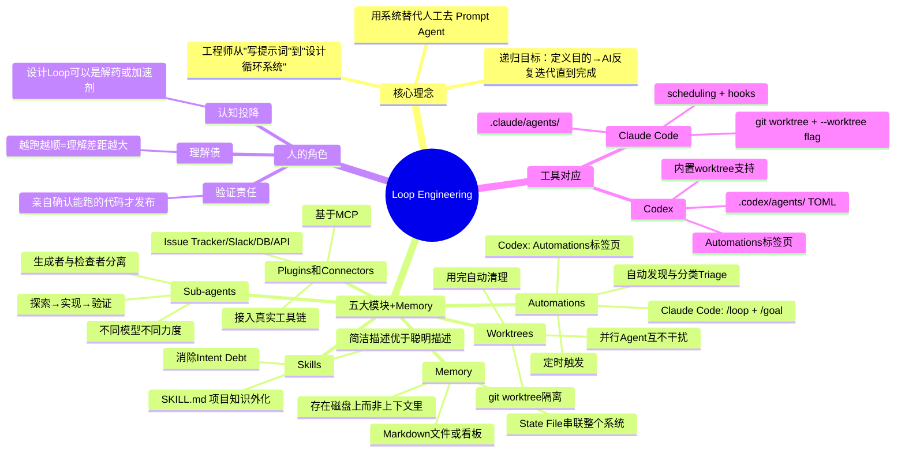
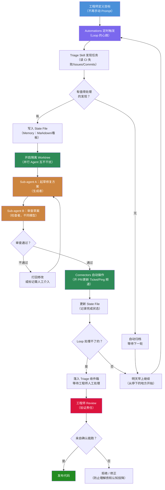

# Loop Engineering：深度拆解概念与实践趋势

> **原文链接**: https://mp.weixin.qq.com/s/daezGa5JxGcl-FokX_-zvg

> **原标题**: Prompt被淘汰了？深度拆解Loop Engineering，炒作还是趋势？
> **一句话总结**: Loop Engineering 是用系统替代人工去触发和管理 Coding Agent 的新范式 — 通过 Automations、Worktrees、Skills、Plugins、Sub-agents 五大模块加 Memory，让 Agent 自主循环完成工作，工程师的角色从"写提示词"转变为"设计循环系统"。
> **前置知识检查**: - [ ] 了解 Prompt Engineering 基本概念 - [ ] 了解 Coding Agent（如 Claude Code、Codex）的基本用法 - [ ] 了解 git worktree 基本概念 - [ ] 了解 MCP（Model Context Protocol）基本概念

## 原文

### 前言

Harness Engineering 的概念刚在技术圈传开，现在又迎来一个热词：**Loop Engineering**。有人觉得 Loop Engineering 本质是 Harness Engineering，二者没什么区别；也有人认为，这种新名词的出现反映了前沿的 AI 研究看重什么样的能力；还有人指出，Loop 会是新的 Token 消耗增长点。

硅谷 AI 圈大佬们纷纷表态：别再手动验证和写提示词了，该让 Agent 自己循环完成工作了。

- **Peter Steinberger**（OpenClaw 开发者）："你不应该再去手动提示编码智能体了。你应该设计让智能体自动运行的 loop。"
- **Boris Cherny**（Anthropic Claude Code 负责人）："我不再手动提示 Claude 了。我有 loop 在跑，它们负责提示 Claude、决定下一步做什么。我的工作是写 loop。"
- **Karpathy**（AutoResearch 项目）：让自己不再成为瓶颈，把自己抽离出来。安排好一切，使它们完全自主运行，并且你越了解如何最大化 Token 吞吐量且不身处循环之中，就越好。

Loop Engineering 的核心：不用人手动再去提示 Coding Agent，直接设计一套系统，让系统自动去触发和管理 Agent。这套系统能够自动发现任务、分配任务、检查结果、记录状态、决定下一步。

Richard Sutton 著名的"苦涩的教训"（The Bitter Lesson）如果换成 Agent 版本：别再什么事都自己上手解决。专注于那些能够通过更多智能体实现扩展的系统，例如目标设定和编排，把一个人的能力扩展成一群 Agent 的执行力。

> 本文整理自 Google Cloud AI 总监 **Addy Osmani** 的文章，详细拆解了 Loop Engineering 是什么、一个完整 loop 所需要的核心模块，以及在 Claude Code 和 Codex 里是如何实现的。

---

### 一、为什么会出现 Loop Engineering？

Loop Engineering，就是用你设计的系统来替代你自己去 prompt agent。

这里的 Loop 可以理解为一个**递归目标**：你定义一个目的，AI 反复迭代直到完成。它大概由五个基本模块构成，Claude Code 和 Codex 现在都已经具备了。

**过去的模式**：过去大概两年，你从编码智能体那里"拿到东西"的方式，就是写一个好的提示词，然后提供足够的上下文。你输入一段话，读它返回的内容，再输入下一段话。智能体是一个工具，你全程控制着它，一轮接一轮。

**现在的转变**：你构建一个小型系统，让它自己去发现任务、分配任务、检查任务、记录完成情况、决定下一步，然后让这个系统去触发智能体。你不用亲自去触发智能体，让这个系统来做这件事。

Addy Osmani 此前写过两个相近概念：
- **Agent Harness Engineering**：为单个智能体构建运行环境
- **Factory Model**：构建软件的系统

Loop Engineering 在 Harness 的上一层——它是一个跑在计时器上、能自己生成小助手、并且能自我驱动的 Harness。

**关键变化**：一年前如果你想跑一个 Loop，你得自己写一堆 bash 脚本然后永远维护它。现在这些模块已经直接内置在产品里了。Steinberger 列出的清单和 Codex 应用几乎一一对应，和 Claude Code 也几乎完全一样。一旦你意识到两者的结构是相同的，你就不会再纠结用哪个工具了——你只需要**设计一个在任何工具里都能跑起来的 loop**。

---

### 二、一个 Loop，需要五个模块 + Memory

一个 Loop 需要五样东西，外加一个记忆的地方：

1. **Automations**：按计划自动触发，独立完成发现和分类（triage）工作
2. **Worktrees**：让并行运行的多个智能体互不干扰
3. **Skills**：把项目知识写下来，让智能体不用每次都靠猜
4. **Plugins 和 Connectors**：把智能体接入你已经在用的工具
5. **Sub-agents**：一个负责生成，另一个负责检查

第六样东西是 **Memory**。一个 Markdown 文件，或者一块 Linear 看板，任何能活在单次对话之外、记录"已完成什么"和"下一步是什么"的地方都行。听起来简单得不像话，但这是所有长时间运行的智能体都依赖的同一个技巧——模型在每次运行之间会忘掉一切，所以记忆必须存在磁盘上，而不是在上下文里。智能体会忘，但代码仓库不会。

Claude Code 和 Codex 现在都具备了这五个模块，名字略有不同但能力是同一回事。

---

#### 1. Automations：Loop 的心跳

Automations 是让 Loop 成为真正的 Loop（而不只是你手动跑了一次的东西）的关键。

**Codex 实现**：在 Automations 标签页创建 automation，选择项目、要运行的提示词、运行频率，以及是在本地 checkout 上跑还是在后台 worktree 上跑。有发现的运行会进入 Triage 收件箱，什么都没发现的运行会自动归档。

OpenAI 内部用它处理日常任务：每日 issue 分类、汇总 CI 失败、写 commit 简报、排查上周某人引入的 bug。Automation 还可以调用 skill，用 `skill-name` 触发，不用把一大堆指令粘贴进一个没人会去更新的定时任务里。

**Claude Code 实现**：通过 scheduling 和 hooks。可以用 `/loop` 按间隔运行一个提示词或命令，可以安排 cron 任务，可以用 hooks 在智能体生命周期的特定节点触发 shell 命令，或者直接推到 GitHub Actions 上（关掉电脑也照样跑）。

核心思路完全一样：定义一个自主任务，给它一个节奏，发现结果会主动来找你，你不用四处去查。

**In-Session Primitives**：
- `/loop`：按节奏重复运行
- `/goal`：持续运行直到你写下的条件真正成立。每一轮结束后，一个独立的小模型会检查是否已经完成——写代码的智能体**不是给自己打分的那一个**。Codex 里也有同样的 `/goal`，支持暂停、恢复和清除。

这一层的作用是把任务浮出水面，Loop 的其余部分负责对这些任务采取行动。

---

#### 2. Worktrees：让并行不变成一团乱麻

一旦你同时跑超过一个智能体，文件就开始互相冲突了。两个智能体同时写同一个文件，和两个工程师在没沟通的情况下提交同一行代码是完全一样的麻烦。

**git worktree 解决方案**：一个独立的工作目录，跑在自己的分支上，但共享同一个仓库历史，所以一个智能体的改动从物理上就无法碰到另一个智能体的 checkout。

- **Codex**：直接内置了 worktree 支持，多个线程可以同时访问同一个仓库互不干扰。
- **Claude Code**：用 `git worktree`、`--worktree flag`（在独立 checkout 里打开一个会话）、以及 `isolation: worktree` 设置（给 subagent 用，让每个助手都有一个用完自动清理的全新 checkout）。

**关键提醒（Orchestration Tax）**：worktrees 消除了机械层面的冲突，但**你仍然是那个瓶颈**。你一天能认真 review 多少份产出，才是你实际能跑多少个 agent 的上限，不是工具。

---

#### 3. Skills：让智能体不用每次都靠猜

一个 skill，就是让你不用每次开新会话都从头解释一遍项目是怎么回事的方式。

**格式**（两个工具相同）：一个文件夹，里面有一个 `SKILL.md`，包含指令和元数据，加上可选的脚本、引用和资源文件。

- **Codex**：在你用 `$` 或 `/skills` 调用时运行 skill，或者在任务描述与 skill 描述匹配时自动触发。这就是为什么一个**简洁、无聊的描述**比一个聪明的描述更好用。
- **Claude Code**：做法完全一样。

**Skills 与 Intent Debt**：智能体每次会话都是从零开始的，你没说清楚的地方，它会用一个"自信的猜测"来填上。一个 skill，就是把这些意图写在外面——约定、构建步骤、"我们不这么做是因为那次事故"——写一次，智能体每次运行都读到。没有 skills，loop 每个周期都要从零推导你的整个项目；有了 skills，它会复利增长。

**Skill 与 Plugin 的关系**：skill 是编写格式，plugin 是发布方式。当你想跨多个仓库共享一个 skill，或者把几个 skill 打包在一起，你就把它们打包成一个 plugin。

---

#### 4. Plugins 和 Connectors：让 Loop 触及真实在用的工具

一个只能看到文件系统的 Loop，是一个很小的 Loop。

- **Connectors**：基于 MCP 构建，让智能体能读取你的 issue tracker、查询数据库、访问 staging API、在 Slack 里发消息。Codex 和 Claude Code 都支持 MCP，所以为一个工具写的 connector 在另一个里通常也能直接用。
- **Plugins**：把 connectors 和 skills 打包在一起，让你的队友一键安装整套配置。

有了 Connectors，loop 才能真正在你的实际环境里干活——不只是说"如果我能操作的话我会这么做"。这就是一个说"这是修复方案"的智能体和一个**自己开 PR、关联 Linear ticket、等 CI 变绿后自动 ping 频道**的 Loop 之间的区别。

---

#### 5. Sub-agents：让生成者和检查者分开

Loop 里最有用的结构设计：**把写代码的和检查代码的拆开**。

让写代码的模型来评审自己的代码，它会对自己太好说话。一个拿着不同指令、有时甚至是不同模型的第二个智能体，能抓住第一个模型自己没意识到、或者选择忽略的问题。

**Codex 实现**：只在你要求时生成 subagents，同时运行，然后把结果合并成一个答案。在 `.codex/agents/` 里用 TOML 文件定义自己的 agents，每个有名字、描述、指令，以及可选的模型和推理力度。安全审查员可以是一个高力度的强模型，探索者可以是某个快速的只读工具。

**Claude Code 实现**：在 `.claude/agents/` 里用 subagents 和 agent teams 做同样的事，任务在它们之间传递。

**常见分工**：一个 agent 探索，一个实现，一个对照规格验证。

**Token 成本提醒**：Sub-agents 确实会烧更多 token，因为每一个都要做自己的模型和工具调用。只在真正需要有人帮你再把把关的地方才值得开。

这也是 Claude Code 的 `/goal` 背后的逻辑：**决定 Loop 有没有完成的，应该是一个全新的模型，而不是那个做了这些工作的模型**。生成者和检查者分开这件事，在这里被用到了"要不要停"这个判断上。

---

### 三、完整的 Loop 长什么样？

把这些拼在一起，一个单线程就变成了一个小型控制台。Addy Osmani 给出了一种实际使用的形态：

> 每天早上，一个 automation 在仓库上跑起来。它的提示词调用一个 triage skill，读取昨天的 CI 失败、open issues、最近的 commits，然后把发现结果写进一个 Markdown 文件或 Linear 看板。
>
> 对于每一个值得处理的发现，Loop 会开一个隔离的 worktree，派一个 sub-agent 去起草修复方案，再派第二个 sub-agent 对照项目 skills 和现有测试来审查这份草案。
>
> Connectors 让 Loop 自己开 PR、更新 ticket。Loop 处理不了的东西，落进 triage 收件箱等人来看。
>
> 状态文件（state file）是把整个系统串起来的那根线——它记得尝试过什么、通过了什么、还有什么悬而未决，所以明天早上的运行会从今天停下来的地方继续。

**关键认知**：你只设计了一次，你没有手动提示任何一个步骤。这就是 Steinberger 那句话真正变成现实的样子，而且它在 Codex 里和在 Claude Code 里是同一个 Loop，因为两边的模块是同样的模块。

---

### 四、Loop 仍然离不开人

Loop 改变了工作的形态，但它并没有让你变得多余。随着 Loop 越来越好，有三个问题反而会变得更尖锐：

**1. 验证仍然是你的责任。**
一个无人值守运行的 Loop，同时也是一个无人值守犯错的 Loop。把验证 sub-agent 和生成者拆开，是为了让 Loop 的"完成了"这个判断有点意义。即便如此，"完成了"也只是一个声明，不是证明。你的工作是发布你亲自确认过能跑的代码。

**2. 如果你放任不管，你对代码库的理解会腐烂。**
Loop 跑得越快、产出越多，你没亲手写过的代码就越堆越多，实际存在的东西和你真正理解的东西之间的差距就越大。这就是**理解债（Understanding Debt）**——跑得越顺的 Loop，只会让这个差距增长得越快。唯一的解法是你真的去读 Loop 生成的东西。

**3. 最舒服的姿势，很可能是最危险的——认知投降（Cognitive Surrender）。**
当 Loop 自己跑起来，你很容易停止发表意见，直接接受它给你的任何东西。**设计 Loop 是解药，也可以是加速剂**——带着判断去设计它，它是解药；用它来逃避思考，它是加速剂。同一个动作，完全相反的结果。

---

### 五、工程师要带着判断去设计 Loop

> **Build the loop. Stay the engineer.**

如果我们不亲自 review 代码，或者完全依赖自动化 Loop 来修复问题，产品质量就会下滑，很可能陷入一个越挖越深的恶性循环。

所以，去搭建你的 Loop，但别忘了**直接提示智能体仍然是有效的**，关键是要找到正确的平衡。

Loop 也会因人而异，产生完全不同的结果。两个人可以搭出完全一样的 Loop，却得到截然相反的结果：
- 一个人用它在自己深刻理解的工作上跑得更快；
- 另一个人用它来逃避理解工作本身。

**Loop 不知道这两者的区别，但你知道。**

这就是为什么设计 Loop 比提示词工程更难，不是更容易。Cherny 说的"我的工作是写 loop"，不是说工作变简单了，而是说**杠杆点移动了**。

Build the loop，但要像一个打算留在工程师位置、不只是"按下启动键的人"那样去 build 它。

---

> 原文链接：https://x.com/addyosmani/status/2064127981161959567
> 整理：Founder Park

## 核心概念脑图

## 与你已有知识的关联

**《[[个人学习/LLM大模型类相关知识/Skills：从编程工具的配角到Agent研发的核心|Skills：从编程工具的配角到Agent研发的核心]]》**：Loop Engineering 中 Skills 是五大核心模块之一。文章指出 skill 是"意图外化"的载体——把项目约定、构建步骤、经验教训写一次，智能体每次运行都读到，这与 Loop 中 Skills 作为"消除 Intent Debt"的定位完全一致。Loop 每个周期不再从零推导项目，Skills 使其复利增长。

**《[[个人学习/LLM大模型类相关知识/AI Agent系列｜深入解析Function Calling、MCP和Skills的本质差异与最佳实践|AI Agent系列：Function Calling、MCP和Skills的本质差异]]》**：Loop Engineering 的 Plugins/Connectors 模块基于 MCP 构建，让 Loop 能触及 issue tracker、数据库、Slack 等真实工具。理解 MCP 是理解"Loop 如何从'说修复方案'到'自己开 PR 等 CI 变绿'"的关键桥梁。此外，文章区分了 Skill（编写格式）和 Plugin（发布方式），与 Function Calling 形成互补。

**《[[个人学习/LLM大模型类相关知识/AgentSkillsTeams 架构演进过程及技术选型之道|Agent Skills Teams 架构演进]]》**：Sub-agents 模块中提到的 agent teams（探索→实现→验证的分工模式）在本知识库的 Agent Skills Teams 文章中有详细拆解。Loop Engineering 将这种分工模式自动化、定时化——不再是手动编排，而是通过 Automation 定时触发整个 team。

**《[[个人学习/LLM大模型类相关知识/企业级 Agent 多智能体架构与选型指南|企业级 Agent 多智能体架构与选型指南]]》**：Worktrees 模块解决的是多智能体并行的隔离问题。企业级多智能体架构中的"编排税（Orchestration Tax）"概念——worktree 消除机械冲突，但人的 review 带宽才是真正上限——与本文完全呼应。Loop Engineering 可视为多智能体架构的一种"自动驾驶"形态。

**《[[个人学习/LLM大模型类相关知识/深入理解OpenClaw技术架构与实现原理（上）|深入理解OpenClaw技术架构]]》**：Loop Engineering 讨论的发起者 Peter Steinberger 正是 OpenClaw 的开发者。OpenClaw 的技术架构中是否已包含 Loop 的雏形（如自动化任务分发、多 Agent 隔离等），值得对照阅读。

**《[[个人学习/LLM大模型类相关知识/如何构建和调优高可用性的Agent？浅谈阿里云服务领域Agent构建的方法论|如何构建和调优高可用性的Agent]]》**：Loop Engineering 中"验证仍然是你的责任"和"无人值守犯错"的风险，与高可用性 Agent 构建中的质量保障方法论直接相关。Loop 无人值守运行的特点使得验证机制（Sub-agent 检查 + 人工最终确认）变得比手动模式更为关键。

**《[[个人学习/LLM大模型类相关知识/优秀的Prompt提示词参考|优秀的Prompt提示词参考]]》**：Loop Engineering 不是消灭 Prompt，而是将 Prompt 的编写位置从"每次对话"移到"系统设计层"。Automations 中的提示词、Skills 中的 SKILL.md、Sub-agents 的指令——这些本质上都是 Prompt，只是编写频率从"每次使用"变成了"设计一次，持续运行"。优秀的 Prompt 设计能力在 Loop 时代依然核心，只是杠杆点更高了。

## 重难点理解

**1. Loop Engineering vs Harness Engineering：一层之差，质变之别**

Harness Engineering 是为单个 Agent 构建运行环境（给它工具、上下文、约束），你仍然需要手动启动它。Loop Engineering 在 Harness 之上加了一层"自我驱动"——它跑在计时器上、能自己生成子 Agent、自己决定下一步。通俗理解：Harness 是给汽车装好方向盘和仪表盘，Loop 是让汽车自己会发动、会导航、会停车。

**2. Intent Debt（意图债）：为什么 Skills 能复利增长**

每次新开 Agent 会话，你没说清楚的约定和偏好，Agent 会用"自信的猜测"填补，久而久之这些猜测可能与你的真实意图偏离——这就是 Intent Debt。Skills 把意图写死在磁盘上，每次运行都读到，不需要重新沟通。就像代码注释会过时，但单元测试不会——Skills 是 Agent 世界的单元测试，写一次，持续生效。

**3. 生成者与检查者分离：为什么不能让同一模型给自己打分**

这与人类的"自我审查盲区"同理——写完代码立刻 review，大脑会沿用同样的思维路径，看不到问题。Sub-agent 模式用一个独立模型（甚至更强模型）来检查，打破了这个盲区。`/goal` 命令的实现更进一步：判断"任务是否完成"这个决定本身，也交给一个全新的模型来做，而非让做事的模型自己说"我做完了"。

**4. Orchestration Tax（编排税）：worktree 消除的是机械冲突，不是认知瓶颈**

Git worktree 让 10 个 Agent 同时写代码不会互相覆盖文件，但你还是只有一双眼睛。一天能认真 review 多少份产出，才是你实际能跑多少个 Agent 的上限。这是 Loop Engineering 最容易被忽视的约束——工具解决了技术层面的并发，但人的认知带宽没有变。

**5. 认知投降（Cognitive Surrender）：同一个动作，完全相反的结果**

设计 Loop 这个行为本身，可以是积极的（你深刻理解工作后，用自动化放大执行效率），也可以是消极的（你不想理解工作，用自动化逃避思考）。Loop 不知道你是哪一种。这就解释了为什么"两个人搭出完全一样的 Loop，结果截然相反"——工具的杠杆效应同时放大了能力和懒惰。

## 原文内容流程图

## 经验

1. **Prompt 不会被淘汰，但 Prompt 的编写位置正在上移。** Loop Engineering 不是消灭 Prompt Engineering，而是把 Prompt 从"每次对话的手动输入"变成了"系统设计层的一次性配置"。Automations 的提示词、Skills 的 SKILL.md、Sub-agents 的指令——本质上都是 Prompt，只是编写频率从"每次使用"变成了"设计一次，持续运行"。优秀的 Prompt 设计能力在 Loop 时代依然是底层能力。

2. **Loop 的五大模块在 Claude Code 和 Codex 中已经产品化，跨工具可移植。** 这意味着 Loop 设计的核心不是学习某个特定工具的语法，而是理解五大模块各自解决什么问题。一旦你理解了这个结构，你可以在任何工具里搭出同样的 Loop。这种"模块同构性"是 Loop Engineering 不会被某个工具绑定（vendor lock-in）的关键。

3. **Memory（状态文件）是 Loop 的隐形骨架，最简单也最容易被忽略。** 一个 Markdown 文件或 Linear 看板，记录"已完成什么"和"下一步是什么"，看起来不起眼，但这是 Long-Running Agent 的核心技巧。模型在每次运行之间会忘掉一切，记忆必须存在磁盘上而非上下文里。没有状态文件，Loop 每天早上都从零开始，永远无法积累进展。

4. **Loop 跑得越顺，理解债增长越快。** 这是一个反直觉的正相关：Loop 产出越多，你没亲手写的代码越多，你真正理解的东西和实际存在的代码之间的差距越大。唯一的解法不是关掉 Loop，而是你**真的去读** Loop 生成的东西。Loop 是放大器，它会同时放大你的能力和你的无知。

5. **设计 Loop 比写 Prompt 更难，因为杠杆点更高。** Boris Cherny 说"我的工作是写 loop"并不意味着工作变简单了。一个 Prompt 写砸了，影响一次对话。一个 Loop 设计有缺陷，它会持续不断地在无人值守的情况下犯错，而且你可能会在很久之后才发现。这就是为什么 Loop 需要更强的系统设计能力和判断力。

## 知识

**Loop Engineering 五模块定义卡片**

| 模块 | 解决的问题 | Claude Code 实现 | Codex 实现 |
|------|-----------|-----------------|-----------|
| Automations | 谁来决定什么时候跑？ | `/loop`、`/goal`、cron、hooks、GitHub Actions | Automations 标签页，定时 + Triage 收件箱 |
| Worktrees | 多个 Agent 同时跑怎么不冲突？ | `git worktree`、`--worktree flag`、`isolation: worktree` | 内置 worktree 支持，多线程隔离 |
| Skills | 项目知识怎么不每次都重讲一遍？ | `SKILL.md` 文件夹，`/skills` 调用 | 同格式，`$` 或 `/skills` 调用，可自动触发 |
| Plugins/Connectors | Agent 怎么触及真实工具链？ | MCP 支持 | MCP 支持，跨工具通用 |
| Sub-agents | 怎么不让写代码的自己给自己打分？ | `.claude/agents/`，agent teams | `.codex/agents/` TOML，并行 + 合并结果 |

**关键概念词汇表**

- **Intent Debt（意图债）**：每次新会话 Agent 用猜测填补未明确的意图，累积的偏差。Skills 是消除 Intent Debt 的手段。
- **Orchestration Tax（编排税）**：工具消除了机械冲突，但人的 review 带宽才是真正的并发上限。
- **Understanding Debt（理解债）**：Loop 产出越多，你没亲手写的代码越多，理解差距越大。
- **Cognitive Surrender（认知投降）**：停止独立思考，直接接受 Loop 给你的一切。设计 Loop 可以是解药也可以是加速剂。
- **State File（状态文件）**：存在磁盘上的记忆文件，记录尝试过什么、通过了什么、还有什么悬而未决，串联整个 Loop 系统。
- **In-Session Primitive**：`/loop`（按节奏重复）和 `/goal`（持续运行直到条件成立），是 Loop 的会话级原语。

## 可复用建议

1. **从一个小 Loop 开始，不要一步到位建完整系统。** 建议先选一个"每天早上自动跑一次"的简单任务（如汇总昨天的 CI 失败），只用到 Automations + 一个简单的 Skill。跑稳了再加 Worktree、再加 Sub-agent 审查，逐步叠加复杂度。关键是先让 Loop 跑起来，而不是设计完美了再启动。

2. **Skills 的写法：描述要"无聊"而不是"聪明"。** 一个简洁、无歧义、无聊的描述，比一个聪明但模糊的描述更好用。因为 Codex 会自动匹配 skill 描述与任务，模糊的描述会导致误触发或漏触发。写 Skills 时追求的是可靠性而非创意。

3. **Sub-agent 的模型选择策略：生成者和检查者用不同配置。** 生成者可以用快速便宜的模型，检查者应该用更强的模型、更高的推理力度。安全审查员可以是最强模型，探索者可以是快速的只读工具。这样在保证质量的同时控制 Token 成本——只在需要把关的地方烧更多 Token。

4. **State File 不要只记结果，要记录"为什么"。** Loop 的 Memory 文件应包含：尝试过什么方案、为什么选了 A 不选 B、什么失败了、当前的阻塞点是什么。纯粹记录"完成/未完成"的状态文件，不足以让明天的 Loop 做出更好的决策。给未来的自己（和未来的 Loop）留上下文。

5. **设定 Loop 的"停止条件"时要可验证、可自动化。** 比如"test/auth 里所有测试通过，lint 也干净"——这是一个程序能自动验证的条件。避免模糊条件如"代码质量良好"。`/goal` 命令的核心价值就在于这个可验证的停止条件，它让一个独立模型来判断"是否完成"而非让生成者自评。

## 实施办法

### 第一阶段：理解现有工具中的 Loop 原语（1-2 天）

1. 在 Claude Code 中实验 `/loop` 命令：设置一个每 10 分钟运行一次的简单提示词，观察其行为
2. 在 Claude Code 中实验 `/goal` 命令：给定一个可验证的停止条件（如"创建一个包含 README 的新目录"），观察其持续运行直到条件成立
3. 对比理解 Codex 中对应功能（如果 Codex 可用）

### 第二阶段：搭建一个最小可运行 Loop（1 周）

1. **选择一个日常重复性任务**：例如每日检查代码仓库的 lint 错误、或汇总 open issues
2. **编写一个 Skill**（`SKILL.md`）：包含任务指令、项目约定、检查清单
3. **配置 Automation**：设置每天早上定时触发，调用该 Skill
4. **创建 State File**：一个 Markdown 文件，记录每次运行的结果和待处理项
5. **人工 Review 一周**：每天查看 Loop 的输出，验证质量和准确性

### 第三阶段：逐步叠加模块（2-4 周）

1. **加入 Worktree 隔离**：当需要 Loop 实际修改代码时，启用 worktree 模式
2. **加入 Sub-agent 审查**：添加第二个 Agent 专门检查生成代码的质量
3. **接入 Connectors**：通过 MCP 连接 issue tracker（如 Linear/Jira），让 Loop 自动更新 ticket 状态
4. **优化 Skills**：根据实际运行中的问题，持续完善项目知识和约定

### 第四阶段：持续维护与边界意识（长期）

1. **定期阅读 Loop 生成的代码**：防止理解债积累
2. **定期审查 State File**：确保 Loop 的决策逻辑符合预期
3. **设定人工介入的触发条件**：明确哪些情况下 Loop 必须停止并等待人工决策
4. **评估 Token 成本**：监控 Loop 的 Token 消耗，在效果和成本间找到平衡
5. **保持直接 Prompt 能力**：Loop 是放大器，不是替代品。复杂、非重复性的任务仍然应该手动 Prompt