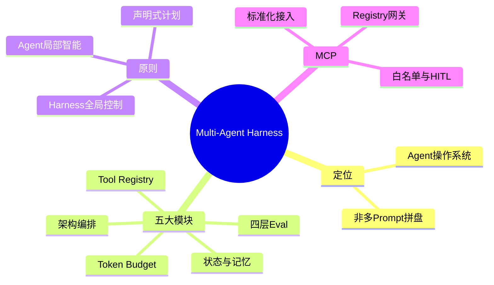
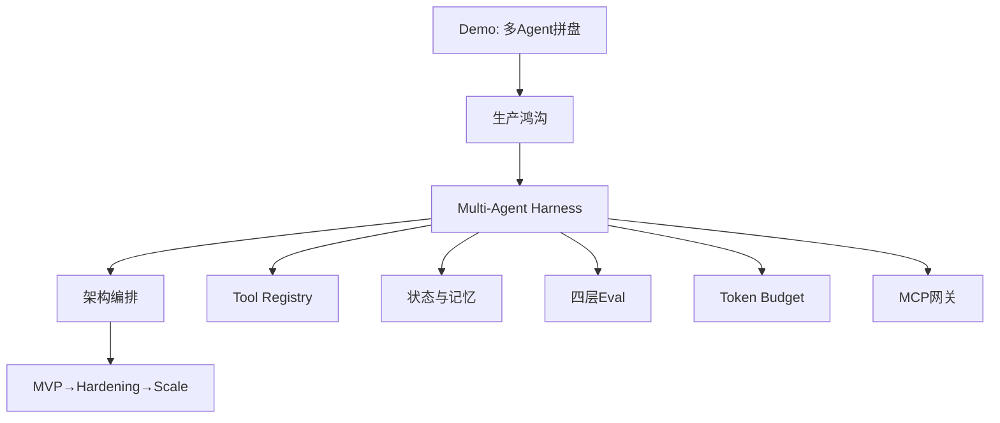

---
tags:
  - tech-article
  - Multi-Agent
  - Harness
  - MCP
  - Agent架构
  - 生产实践
created: 2026-05-13
category: 技术文章/AI
aliases:
  - Multi-Agent Harness
  - 生产级Harness设计
  - Harness操作系统
source: https://mp.weixin.qq.com/s/JPhcyDc4JwRmnMQ-76A-FQ
author: 李伟山（腾讯云开发者社区）
---

# Multi-Agent Harness：生产级架构、评估、记忆、成本与 MCP 接入

> **原文链接**: [微信公众号](https://mp.weixin.qq.com/s/JPhcyDc4JwRmnMQ-76A-FQ)

> **原标题**: 从零设计生产级 Multi-Agent Harness：架构、评估、记忆、成本与 MCP 工具接入全拆解

> **一句话总结**: Harness 是 Multi-Agent 的「操作系统」——Agent 出主意、Harness 拿决定；五大模块（编排、Tool Registry、状态/记忆、四层 Eval、Token Budget）+ MCP 安全网关，是从 Demo 到生产的全景地图。

> **前置知识检查**:
> - [ ] 了解单 Agent vs 多 Agent 协作
> - [ ] 知道 MCP、Tool Calling 基本概念
> - [ ] （可选）读过 [[Harness工程化-五层架构与门禁阻断实践]]

## 原文

关注腾讯云开发者，一手技术干货提前解锁👇

注：本文有使用 AI 进行辅助写作，特此说明。

   引言：Agent 很热闹，生产现场很骨感

过去一年，几乎每个团队都做过 AI Agent。

一个输入框，一个大模型，几个工具，一段写得很漂亮的 System Prompt，再配上一个炫酷的前端，看起来就像一个能干活的“数字员工”。演示会上效果惊艳，老板拍板，业务兴奋，研发也觉得：这事，稳了。

然后真正进入生产，麻烦就开始了。

Agent 为什么会反复调用同一个工具？为什么一个简单任务能烧掉几十万 Token？为什么某个子 Agent 失败后，整条链路都挂了？为什么最终结果看似正确，但中间过程一片黑盒？为什么接入一个新工具要改十几处胶水代码？为什么业务来一句“这个结论怎么得出来的”，系统就只能沉默？

这就是 Demo 和生产之间的鸿沟。

很多人以为，跨过这条鸿沟靠的是更强的模型，或者更精妙的 Prompt。错。真正决定 Multi-Agent 系统能否落地的，是背后那个常常被忽略的运行时底座——Multi-Agent Harness（多智能体执行框架）。

它负责编排、调度、记忆、状态、工具治理、预算控制、可观测性、安全边界。它是 Agent 的“操作系统”，也是 AI 工程化的真正主战场。

本文用一篇长文，从零开始拆解：一个生产级 Multi-Agent Harness，到底应该怎么设计？ 包括架构、评估、记忆、成本和 MCP 工具接入五大核心模块，配以完整的 PlantUML 图示，帮你建立一张可落地的全景地图。

# 01

Harness 是什么：Agent 的“操作系统”，不是“多 Prompt 拼盘”

先解决一个概念问题：Harness 到底指什么？

在英文语境里，Harness 原意是“挽具、束缚、收束”，引申为“把多种力量统一约束并驱动的装置”。在 AI Agent 领域，Multi-Agent Harness 指的是把多个 Agent 的能力、工具、状态、通信、编排、监控统一收束在一个运行时之内的框架。

它和我们熟悉的几个概念有什么区别？

它不只是 Prompt 模板。 Prompt 解决的是“怎么让模型理解任务”，Harness 解决的是“怎么让模型可靠地完成任务”。

它不只是 Orchestrator（编排器）。 Orchestrator 解决“顺序”，Harness 还要解决“资源、记忆、成本、安全、可观测”。

它不只是 Agent Framework（如 LangGraph、AutoGen）。 框架是积木，Harness 是把积木拼成生产建筑的工程方案。

可以用一个类比理解：
**
Prompt 是台词，Agent 是演员，工具是道具，模型是大脑，而 Harness 是整个舞台的导演、灯光、调度系统、安全规章和票务系统。

没有舞台系统，演员再好也只是即兴表演；有了舞台系统，才能稳定地一晚演两场，连演一年。

这就是为什么 Multi-Agent 在 Demo 阶段“拼几个 Agent”就够了，而生产阶段“没有 Harness 寸步难行”。

下面这张图先建立一个总体认知：一个生产级 Multi-Agent Harness 由哪些模块组成。

接下来，我们逐一拆解最关键的五个模块：架构编排、工具治理、状态与记忆、评估体系、成本控制，最后再单独讲 MCP 工具接入。

# 02

架构编排：让 Agent 出主意，让 Harness 拿决定

Multi-Agent 系统最常见的失败模式，不是 Agent 不够聪明，而是 决策权交错了人。

很多团队的写法是这样：让 Planner Agent 自己决定调用哪个 Agent、是否继续、是否重试、是否结束。短期看很灵活，长期看很危险。因为大模型本质上不是一个可靠的调度器。它没有天然的成本意识、并发意识、权限意识、全局一致性意识。

生产级原则只有一句话：
**
Agent 负责局部智能，Harness 负责全局控制。

具体来说，Orchestrator 必须独占以下五项决策权。

第一，任务生命周期。 每个任务从创建、规划、执行、审查、完成、失败，都要有明确的状态机，而不是一个模糊的“它好像还在跑”。

第二，执行计划裁决。 计划可以来自静态 DAG，也可以来自 Planner Agent，但计划一旦生成，必须由 Orchestrator 接管。每一步是否能跑、是否并行、是否超预算，由它判断。

第三，Agent 路由。 不是每个 Agent 都能处理每个任务。一个 Coder Agent 不该处理财务审批，一个 Research Agent 不该写数据库。路由要结合任务类型、Agent 能力、权限、历史质量评分。

第四，失败处理。 某个 Agent 失败后是重试、降级、跳过还是终止？这绝不能让出错 Agent 自己说了算。

第五，硬终止条件。 必须有 max_steps、max_tokens、max_duration、max_tool_calls 四道硬闸，否则 Agent 容易陷入循环。

下面这张时序图，展示了一个任务从进入 Harness 到返回结果的完整调度过程。

这里还有一个工程师容易忽略的细节：Planner 应该输出“声明式计划”，而不是“命令式调用”。

声明式：{step: 1, intent: "research", agent: "researcher", input: "..."}

命令式：直接 await researcher.run("...")

声明式的好处是 Harness 可以介入：可以重排顺序、可以并行优化、可以拒绝某些步骤、可以在执行前做安全审查。命令式则相当于把方向盘交给了 Agent。

别让 Agent 开车，让 Agent 当导航。

# 03

工具治理：Tool Registry 是 Agent 的安全边界

Agent 的能力，绝大部分来自工具。

没有工具，Agent 只是会聊天。

有了工具，Agent 才能查数据库、跑代码、读文件、调接口、生成工单、检索知识库、操作系统。

但工具越强，破坏力越大。
**
一个能读文件的 Agent，可能读到不该读的；

一个能写数据库的 Agent，可能误删生产数据；

一个能跑代码的 Agent，可能直接造成事故；

一个能调外网的 Agent，可能把敏感信息发出去。

所以生产级 Harness 中，工具不能是普通函数，必须是受治理的资源。一切工具调用都要经过 Tool Registry 这个统一关口。

一个合格的 Tool Registry，每个工具都至少要登记九项元信息：

- 
工具名称（唯一标识）

- 
工具描述（给 LLM 看的说明）

- 
输入参数 JSON Schema（用于校验）

- 
允许调用的 Agent 列表（RBAC）

- 
调用超时与速率限制

- 
风险等级（低/中/高）

- 
是否需要人工确认

- 
输出结果结构

- 
审计日志策略（保存什么、保留多久、谁能看）

这背后的思维转变其实很关键：
**
工具不是函数调用，而是生产资源的对外授权点。

你给 Agent 一个工具，等于给它一把权限钥匙。这把钥匙能开多少门、有没有时限、留不留痕、谁能审计——这些事必须从 Day 1 就想清楚。

下面这张图展示了一次工具调用从发起到落地的完整治理链路。

很多团队会问：MVP 阶段是不是可以先不上这些？

强烈不建议。

工具治理不是装饰层，而是结构层。如果一开始没有统一入口，后面每个 Agent 都各自调用工具，系统会迅速演化成一团“散落的特权代码”，再想收回来代价极高。

正确的做法是：哪怕你只有 3 个工具，也从第一天起强制走 Tool Registry。先有规矩，后扩规模。

# 04

状态与记忆：让 Agent 记住该记的，忘掉该忘的

Multi-Agent 系统中，“记忆”是一个被严重浪漫化的词。

很多文章会说 Agent 要像人一样积累经验。但生产环境里，记忆首先不是浪漫问题，而是工程问题。它有四种典型的失败方式：

- 
记得太少：每次都像第一次，无法复用经验。

- 
记得太多：上下文膨胀，检索噪声大，成本爆炸。

- 
不分层：临时数据和长期知识混在一起。

- 
不遗忘：过期信息长期污染决策。

正确的做法是把“状态”和“记忆”分开。

状态（State） 是当前任务运行所需的数据，生命周期短，关心一致性。

记忆（Memory） 是跨任务复用的经验和知识，生命周期长，关心相关性。

状态可以分三层：

- 
Working State：当前步骤的临时上下文，任务结束即丢。

- 
Session State：一次会话里多个 Agent 共享的信息，放 Redis，设 TTL。

- 
Execution Log：不可变执行日志，不一定参与推理，但必须用于审计、回放、评估。

记忆可以分两类：

- 
Episodic Memory（事件记忆）：踩过的坑、用户偏好、某类问题处理经验。

- 
Semantic Memory（语义记忆）：领域概念、业务规则、工具约束。

下面这张图展示了一个 Agent 在执行任务时如何分层检索记忆，以及任务完成后如何巩固。

记忆系统中有两个被严重低估的设计点。

第一是注入时机（Retrieval Timing）。

任务前自动注入，简单稳定但费 Token。

按需检索，省钱但 Agent 可能忘记调用。

生产推荐：混合模式——前置注入少量高置信记忆 + 提供 memory_search 工具供 Agent 主动调用。

第二是遗忘机制（Memory Forgetting）。

听起来反直觉，但极其关键。一个只增不删的记忆系统会随时间退化：检索越来越慢、相关性越来越差、过期信息污染新决策。

应基于访问频次、创建时间、重要性、最近使用计算保留分数：

- 
低分记忆 → 直接删除

- 
中分记忆 → 压缩为摘要

- 
高分记忆 → 保留原文

记忆不是仓库，而是花园。需要定期修剪。

# 05

评估体系：不要只看答案，要看轨迹

Multi-Agent 系统的评估，是目前被低估最严重的环节。

单 Agent 评估很简单：输入一个问题，比对输出是否正确。Multi-Agent 完全不一样——它有计划、有中间步骤、有工具调用、有 Agent 协作、有重试、有反思、有最终合成。

如果只看最终答案，会漏掉很多危险信号：
**
最终报告对了，但中间用了未授权的数据源。

最终代码能跑，但 Agent 调用了十几次无意义工具。

最终回答完整，但关键事实来自错误检索。

某次结果成功，只是因为重试撞上了正确答案。

生产级 Eval Pipeline 应至少分四层。

第一层 Component Eval（组件评估）： 单 Agent 是否选对工具、参数是否合规、输出是否符合角色职责。

第二层 Trajectory Eval（轨迹评估）： 步骤是否必要、顺序是否合理、是否重复调用、是否陷入循环。这一层是 Multi-Agent 最大的创新点。

第三层 Task Completion Eval（任务完成度）： 是否满足用户目标、是否覆盖必要信息、是否存在事实错误。

第四层 End-to-End Eval（端到端业务效果）： 用户是否采纳、人工返工率、处理时长、单位任务成本。

这里要特别强调一点：LLM-as-Judge 不是万能药。

它适合评估表达完整性、推理连贯性、总结质量等开放式输出。但对事实正确性、代码可运行性、SQL 结果、权限合规——应该优先用确定性检查。

成熟的 Eval 必然是混合的：

- 
单元测试检查代码

- 
Schema 校验结构化输出

- 
规则引擎检查安全约束

- 
检索对齐校验引用来源

- 
LLM-as-Judge 评开放式表达

- 
人工抽检校准 Judge 偏差

- 
线上反馈验证业务效果

更重要的是，Eval 必须进入 CI。每次改 Prompt、换模型、加工具、调参数，都要跑回归。对 Agent 系统来说，Prompt 就是代码，工具 Schema 就是接口，执行轨迹就是日志，Eval 就是测试体系。没有它，每次优化都是“凭感觉调参”。

# 06

成本控制：Token Budget 是生产级 Agent 的生命线

很多团队第一次跑通 Agent 时，最惊讶的不是模型能力，而是账单。

为什么 Multi-Agent 这么烧钱？
**
每个 Agent 都有 System Prompt。

每个 Agent 都需要上下文。

工具结果会被塞回模型。

Planner 生成计划，Worker 执行步骤，Reviewer 审查输出。

失败后还要重试。

多轮协作让历史不断复制膨胀。

如果没有成本控制，Agent 系统会从“智能助手”一夜变成“预算黑洞”。

生产级 Harness 必须有 Token Budget——它不是事后统计，而是实时调度。

核心逻辑是：根据任务复杂度分配预算，执行中实时监控，触发不同等级的降级策略。

成本控制有三个核心策略。

策略一：Model Routing（模型路由）。

不是所有步骤都需要最强模型。

- 
分类、摘要、格式转换 → 小模型即可

- 
复杂推理、最终合成 → 用强模型

- 
高风险审查 → 强模型 + 规则校验双保险

- 
低价值重试 → 禁止使用高价模型

目标不是一味省钱，而是在质量和成本之间找到可控平衡。

策略二：Context Compression（上下文压缩）。

多数 Token 浪费来自历史膨胀。有效做法是保留最近几轮原文 + 把更早历史压缩成结构化摘要，摘要中只保留关键事实、决策、未解决问题、工具结果引用。

但要注意：事实型任务必须保留原始引用，合规型任务关键证据不可压缩。 压缩策略不能一刀切。

策略三：Budget 分级降级。

- 
绿区（>50%）：正常执行

- 
黄区（20%–50%）：压缩上下文

- 
红区（5%–20%）：切小模型 + 跳过 CoT

- 
熔断区（<5%）：强制收束，返回 partial result

生产环境至少要监控这些指标：

- 
单任务 Token 总量

- 
单 Agent Token 占比

- 
工具结果 Token 占比

- 
重试 Token 占比

- 
不同路由策略下的成本与成功率

- 
预算熔断次数

- 
单位业务结果成本（每完成一个合格任务多少钱）

当你能精准回答最后一项时，Agent 系统才真正进入了可运营阶段。

# 07

MCP 工具接入：标准化是趋势，但不能裸奔

最后单独讲一下 MCP（Model Context Protocol，模型上下文协议）——目前最值得关注的工具生态变量。

MCP 解决的核心问题是什么？ 在 MCP 出现之前，每接入一个工具都要为不同 LLM 写不同适配器，工具开发者和模型集成方都很痛苦。MCP 把这层标准化了：工具一次实现，所有支持 MCP 的 LLM 应用都能调用。

类比：MCP 之于 AI 工具，如同 USB-C 之于充电接口。

它对 Multi-Agent Harness 的意义有三点：

- 
快速扩展能力：通过 MCP Server，Agent 可以一键接入文件系统、数据库、Git、Slack、Jira、内部 API 等海量能力。

- 
生态可复用：业界形成的 MCP Server 可以直接拿来用，而不是每个团队各写一套。

- 
解耦工具与模型：工具实现不绑定特定 LLM，未来切换模型成本更低。

但标准化不等于安全。恰恰相反，工具越容易接入，越需要 Harness 在中间做安全网关。

下面这张图展示了 MCP 工具从注册到调用，经过 Harness 安全治理的完整链路。

接入 MCP 的几个最佳实践：

第一，永远不要把 MCP Server 直接暴露给 Agent。 必须经过 Tool Registry。MCP 提供的是“能力”，Harness 提供的是“治理”。

第二，给每个 MCP Server 单独配额。 一个流氓 MCP Server 不应该拖垮整个系统。

第三，对工具做白名单而不是黑名单。 哪怕 MCP Server 暴露了 50 个工具，也只把业务真正需要的几个开放给特定 Agent。

第四，高风险工具一律走 Human-in-the-Loop。 文件写入、删除、代码执行、数据库写、外部支付——这些不能让 Agent 自动执行。

第五，所有 MCP 调用都要打 Trace。 工具来源、参数、结果、调用者必须可追溯。

可以这样总结：MCP 让工具接入变得便宜，Harness 让工具调用变得可信。 两者必须搭配，不可偏废。

# 08

可观测性与落地路线：从 MVP 到规模化

最后讲两件常被忽略的事：可观测性和落地节奏。

   可观测性：没有 Trace，就没有生产级 Agent

传统后端出问题时，我们看日志、看指标、看链路。Agent 系统更需要这些，因为 Agent 的错误往往不是异常，而是过程偏移：

> 它可能调用了错误工具。
**
可能读取了错误记忆。

可能误解了用户目标。

可能因为压缩丢了关键约束。

可能因为预算不足提前收束。

可能因为路由用了能力不够的小模型。

   落地路线：分三阶段演进，别想一步到位

Phase 1 — MVP：跑通一条端到端业务闭环。最小 Orchestrator + Tool Registry + 简单状态 + 基础 Trace + 评估数据集。不要一开始就上动态 Planner、十个 Agent、复杂长期记忆。先把一条链路跑稳。

Phase 2 — Hardening：把 Demo 变成可控系统。增加 Budget、权限、重试、压缩、轨迹评估、审计、回归测试。重点解决“为什么错、哪里贵、哪里慢、哪里不安全”。

Phase 3 — Scale：支撑更多场景与并发。引入分布式队列、多租户隔离、动态模型路由、Agent 质量排行榜、A/B 测试、长期记忆治理、统一 MCP 接入平台、成本看板。

技术选型上的几条务实建议：

- 
小团队：LangGraph 或自研轻量状态机 + FastAPI + Redis + PostgreSQL/pgvector + Langfuse/OpenTelemetry + LiteLLM 网关。

- 
企业团队：必须更重视权限、审计、多租户、成本中心、数据治理。MCP 作为接入标准，但不允许直连 Agent。

- 
研究团队：可以探索动态 Planner、自反思、自动 Eval、长期记忆压缩，但务必区分研究效果和生产 SLA。

最后一个组织层面的提醒：Multi-Agent Harness 不是纯算法项目，而是系统工程。它需要算法、后端、平台、安全、业务专家的多角色协同。如果团队只让一个“会写 Prompt 的同学”负责全部，几乎一定卡在 Demo 阶段。

# 09

结语：未来的竞争，不是“谁的 Agent 更多”，而是“谁的 Harness 更稳”

Multi-Agent 的想象空间确实很大。

它可以像一支小团队一样协作，把复杂任务拆成多步专业流程，让模型使用工具，把知识、流程、系统连接起来。它代表了一种从聊天式 AI走向执行式 AI的方向。

但越接近生产，越会发现：真正难的不是让 Agent 开口说话，而是让 Agent 在边界内稳定行动。

能不能控成本？

能不能追踪过程？

能不能评估质量？

能不能限制工具权限？

能不能管理状态和记忆？

能不能在失败时优雅降级？

能不能回答“为什么这个结果可信”？

这些问题的答案，最终都落在 Multi-Agent Harness 上。

如果说 Prompt 是 Agent 的台词，工具是它的手脚，模型是它的大脑，那么 Harness 就是它的骨架、神经系统和安全带。

**
没有 Harness，Multi-Agent 只是热闹；有了 Harness，Agent 才可能成为生产力。

对今天准备落地 Agent 的团队来说，最好的起点不是堆十个 Agent，也不是追逐最新框架，而是先画清楚自己的 Harness：

任务怎么进来？谁负责拆解？谁负责调度？工具怎么接？状态放哪里？记忆怎么检索？预算怎么控制？轨迹怎么评估？失败怎么处理？审计怎么保留？

把这十个问题回答清楚，你就已经越过了大多数 Agent Demo 的边界。

下一个问题留给你：你的团队，已经走到了哪一阶段？

-End-

> **图片说明**: 正文配图 8 张位于 `assets/Multi-Agent Harness-生产级架构评估记忆成本与MCP接入/`（图1–8 为架构图；提取时含尾部推广图已裁剪）。

---
## 核心概念脑图

## 与你已有知识的关联

**《[[Harness工程化-五层架构与门禁阻断实践|Harness 五层架构]]》**：国内五层门禁与本文 Orchestrator 硬终止、Tool Registry 同属 Harness 纪律；本文更偏 Multi-Agent 全景与 MCP。

**《[[Agent Harness Engineering-ETCLOVG七层框架综述|Agent Harness 综述]]》**：CMU 等 ETCLOVG 七层学术框架；本文是腾讯云视角的生产级五模块落地拆解，互补阅读。

**《[[Function Calling与MCP-Skills本质差异与最佳实践|MCP 与 Skills]]》**：MCP 标准化工具接入；本文第 07 节强调 MCP 须经 Tool Registry，不可裸奔直连 Agent。

**《[[Token成本控制-AI Coding Agent五层优化框架|Token 成本控制]]》**：五层优化框架与本文 Model Routing、Context Compression、Budget 分级降级同构。

**《[[企业级Agent-多智能体架构与选型指南|企业级多智能体]]》**：选型指南偏架构模式；本文补全运行时底座（记忆分层、轨迹 Eval、成本看板）。

## 重难点理解

- **重点1**: Agent 负责局部智能，Harness 负责全局控制 — Orchestrator 独占生命周期、路由、失败处理、硬终止；Planner 输出声明式计划而非命令式调用。
- **重点2**: Tool Registry 是安全边界 — 九项元信息（Schema、RBAC、风险等级、审计）；工具是「授权点」不是普通函数。
- **难点1**: 状态 vs 记忆 — Working/Session/Execution Log 三层状态 + Episodic/Semantic 记忆；混合检索时机 + 遗忘机制防污染。
- **难点2**: 四层 Eval — 组件、轨迹、任务完成度、端到端业务；LLM-as-Judge 不能替代事实/SQL/权限的确定性检查。
- **误区**: 「更强模型就能上生产」— Demo 与生产鸿沟在 Harness，不在 Prompt。

## 原文内容流程图

## 经验

1. **Day1 强制 Tool Registry**: 哪怕只有 3 个工具也走统一关口 — **应用场景**: 任何生产 Agent — **预期效果**: 避免「散落特权代码」后期无法收回。
2. **声明式计划**: Planner 输出 intent/agent/input 结构，Harness 可重排、拒绝、并行 — **应用场景**: 多步工作流 — **预期效果**: 不把方向盘交给 LLM。
3. **Eval 进 CI**: Prompt/模型/工具变更跑回归 — **应用场景**: 团队迭代 — **预期效果**: 优化从「凭感觉」变可度量。
4. **单位业务结果成本**: 监控「每完成一个合格任务多少钱」— **应用场景**: 成本运营 — **预期效果**: Agent 进入可运营阶段。

## 知识

| 知识点 | 定义 | 关键要素 | 关联概念 |
| --- | --- | --- | --- |
| Multi-Agent Harness | 收束多 Agent、工具、状态、编排、监控的运行时底座 | Orchestrator、Registry、Budget | Agent OS、LangGraph |
| 声明式计划 | 描述 step intent 而非直接 await 调用 | Harness 可介入、安全审查 | 条件边、工作流 |
| Trajectory Eval | 评估中间步骤与工具轨迹 | 防「答案对过程错」 | trace-native 评估 |
| Token Budget | 实时预算与绿黄红熔断 | Model Routing、压缩、降级 | 五层 Token 优化 |
| MCP 网关 | 标准化工具经 Registry 治理 | 白名单、配额、HITL、Trace | USB-C 类比 |

## 可复用建议

1. **落地三阶段**: Phase1 单链路 MVP → Phase2 Budget/权限/轨迹 Eval → Phase3 多租户/MCP 平台 — **适用场景**: 团队规划 — **预期效果**: 避免一步到位失败。
2. **记忆花园**: 低分删、中分压缩、高分保留 — **适用场景**: 长期记忆系统 — **预期效果**: 防检索噪声与成本爆炸。
3. **MCP 五实践**: 不经 Registry 不暴露、单 Server 配额、白名单、高风险 HITL、全 Trace — **适用场景**: MCP 接入 — **预期效果**: 便宜接入 + 可信调用。
4. **十个自检问题**: 任务怎么进、谁调度、状态放哪、预算怎么控… — **适用场景**: 方案评审 — **预期效果**: 越过 Demo 边界。

## 实施办法

1. **第1步**: 画任务状态机 + 四道硬闸（max_steps/tokens/duration/tool_calls）。
2. **第2步**: 实现最小 Tool Registry（3 工具也登记九项元信息）。
3. **第3步**: 分层 State/Session/Log + 混合记忆注入。
4. **第4步**: 建四层 Eval 数据集并进 CI；对照 [[专题/Claude-Code专题]] 与 [[Devix-7x24自动化运维Harness Engineering实践]] 看垂直场景。
