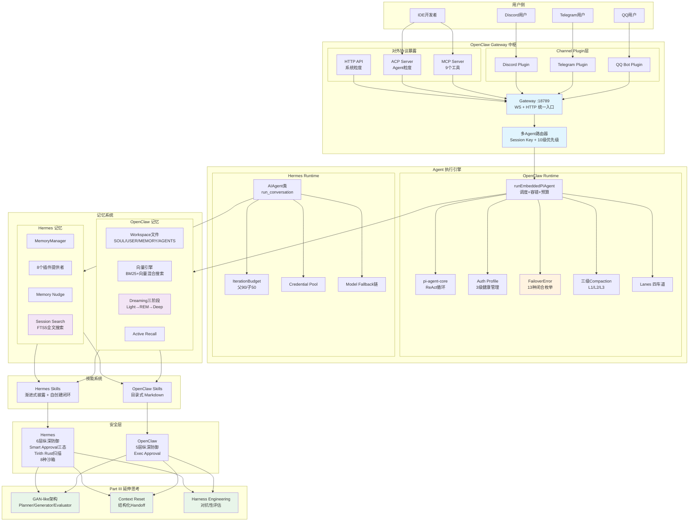

# OpenClaw 与 Hermes：AI Agent 架构源码复盘

> **原文链接**: https://mp.weixin.qq.com/s/49dxdMXEUoWIYlIh8fFqMQ

> **原标题**: OpenClaw与Hermes：源码里的 AI Agent 架构知识大复盘
> **一句话总结**: OpenClaw（TypeScript 微内核架构，一个Agent多端触达）和 Hermes（Python 单体架构，技能自创建闭环）代表了 AI Agent 框架的两条路线——前者是给平台架构师的范本，后者是给个人开发者的瑞士军刀，核心差异在于目标受众不同而非谁更好。
> **前置知识检查**: - [ ] 了解 ReAct（Reason + Act）循环 - [ ] 了解 MCP/ACP 协议的基本概念 - [ ] 了解 RAG 和向量检索的基本原理 - [ ] 了解 Agent 的记忆系统分层（短期/长期记忆）

## 原文

本文是腾讯程序员 rianli 基于开发 openclaw-qqbot 插件两个月的源码阅读经历，对 OpenClaw 和 Hermes 两个主流 AI Agent 框架的深度架构复盘。全文分三部分：

**Part I（第1-13章）**：OpenClaw 的 TypeScript 微内核架构——Gateway 中枢、消息路由（Session Key + 多 Agent 路由绑定）、插件系统（Channel & Gateway 5种交互模式）、Agent 执行引擎（ReAct循环 + FailoverError 13种闭合枚举 + Auth Profile 三级健康管理 + 双路径执行 + 三级Compaction + Lanes分车道 + Bootstrap Budget）、记忆系统（双层流转 + Dreaming三阶段加权晋升 + Active Recall）、安全机制（五层纵深防御）、QQ Bot 插件实战案例。

**Part II（第14-20章）**：Hermes 的 Python 单体架构——AIAgent 核心类（单文件万行级）、IterationBudget 线程安全迭代控制、Credential Pool 与 Model Fallback、四步上下文压缩、冻结快照 Prompt 缓存、ToolRegistry 导入时自注册、delegate_tool 子Agent并行、MemoryManager + 8插件提供者 + Memory Nudge + Session Search FTS5全文搜索、技能自创建闭环与渐进式披露（三级访问）、Smart Approval 三态安全评估、Tirith Rust安全扫描器、8种沙箱后端。

**Part III（第21-22章）**：10张维度对比表（执行引擎/记忆系统/插件工具/安全模型/子Agent/Prompt缓存/记忆+检索方案/技能系统/通信协议/运行时治理）+ 8节落地延伸思考——协议互通、记忆分层（程序性记忆/千人千面/遗忘机制）、Context Engineering（上下文焦虑症与Context Reset）、能力管理（渐进式披露 + 云端Skill体系）、确定性编排、多Agent协作（GAN-like架构 + Sprint Contract）、Harness Engineering（对抗性评估消除自我评估偏差）、沙箱安全——最后以 Google《Agentic Design Patterns》21个模式作为坐标系审视两套架构。

## 核心概念脑图 (mermaid mindmap)

```mermaid
mindmap
  root((OpenClaw vs Hermes<br/>AI Agent 架构复盘))
    OpenClaw 微内核
      Gateway 中枢
        5大角色：唯一常驻进程/消息总线/多Agent路由/认证信任根/嵌入式HTTP Host
        42个RPC handler
        Challenge-Response + Ed25519 认证
      消息路由
        Session Key：agent:{agentId}:{scope}
        多Agent路由绑定：10级优先级匹配
        Agent间通信：sessions_send / sessions_spawn
      插件系统
        Channel 25+ Adapter 契约
        5种 Channel-Gateway 交互模式
        Channel Docking 跨通道会话迁移
        Per-channel Streaming Adapter
      执行引擎
        ReAct循环：pi-agent-core + OpenClaw编排层
        FailoverError 13种闭合枚举
        Auth Profile：api_key/token/oauth 三级健康管理
        双路径执行：Embedded vs CLI Backend
        三级Compaction：L1预请求/L2超时触发/L3溢出
        Lanes 四车道并发调度
        Bootstrap Budget：5文件allowlist + 头尾保留砍中间
        预算体系：5层防御 + SAFETY_MARGIN 1.2
      记忆系统
        静态层：SOUL/USER/MEMORY/AGENTS/TOOLS/IDENTITY/HEARTBEAT/BOOTSTRAP
        向量层：memory-core SQLite+FTS5+sqlite-vec
        混合搜索：BM25(0.3)+向量(0.7)+时间衰减+MMR
        Dreaming三阶段：Light整理→REM提取→Deep评分晋升
        双层流转：daily memory ↔ MEMORY.md
      CLI Backend 双向连接
        消费：spawn claude-cli/codex-cli 当backend
        暴露：MCP Server + ACP Server + HTTP API
    Hermes 单体
      执行引擎
        AIAgent 单体类 run_conversation()
        IterationBudget：父90/子50 线程安全
        Credential Pool + Model Fallback 链
        四步上下文压缩 + 反抖动保护
        冻结快照 Prompt 缓存：system_and_3 策略
      工具系统
        ToolRegistry 导入时自注册
        76个工具文件 6组分类
        delegate_tool：子Agent并行 MAX_DEPTH=1
        阻止列表：禁止递归委托/记忆写入/跨平台副作用
      记忆系统
        MemoryManager + 8插件提供者(Honcho/Mem0/Hindsight)
        Memory Nudge：每10轮触发后台review
        Session Search：SQLite FTS5 + trigram双索引 + Gemini Flash摘要
        三层安全扫描：记忆内容/上下文文件/MCP工具描述
      技能自创建
        渐进式披露：三级访问 skills_list→skill_view→skill_view+子路径
        技能自创建闭环：经验→Nudge→review→创建/更新→安全扫描→保存
        4级信任模型：builtin/trusted/community/agent-created
        Skills Hub 社区技能生态
      安全模型
        Smart Approval：LLM三态评估 approve/deny/escalate
        Tirith Rust安全扫描器 + cosign供应链验证
        8种沙箱后端：Local/Docker/SSH/Modal/Daytona/Singularity/Vercel/Managed Modal
    Part III 对比与延伸
      架构对比10张表
        执行引擎/记忆系统/插件工具/安全/子Agent/Prompt缓存/记忆检索/技能/通信协议/运行时
      8个落地延伸方向
        22.1 插件化+协议互通
        22.2 记忆系统分层管理→程序性记忆/千人千面/遗忘
        22.3 Context Engineering→上下文焦虑症/Context Reset vs Compaction
        22.4 Skill渐进式披露→云端Skill体系
        22.5 确定性编排→Skill→Workflow固化
        22.6 多Agent协作→GAN-like Planner/Generator/Evaluator + Sprint Contract
        22.7 Harness Engineering→对抗性评估消除自我评估偏差
        22.8 沙箱执行→端侧隐私保护
      Google《Agentic Design Patterns》21模式坐标系
      Anthropic Harness Engineering 核心原则
```

## 与你已有知识的关联

**《[[深入理解OpenClaw技术架构与实现原理（上）|深入理解OpenClaw技术架构与实现原理（上）]]》**：本文是该文的深入续篇，对 Gateway、Channel 契约、执行引擎的剖析更加深入，并新增了 Hermes 对比视角。

**《[[Function Calling与MCP-Skills本质差异与最佳实践|AI Agent系列]]》**：本文第6.4节详细解释了 OpenClaw 如何通过 MCP Server 暴露工具、ACP Server 暴露 Agent、CLI Backend 消费外部 CLI——正好对应 Function Calling、MCP、ACP 三种协议的实际工程应用。

**《[[Skills-从编程工具配角到Agent研发核心|Skills：从编程工具的配角到Agent研发的核心]]》**：本文第18章（Hermes 技能系统）和第22.4节（渐进式披露）是对 Skills 在 Agent 框架中的核心地位的工程验证——Skills 不仅是指令文档，更是 Agent 自我改进闭环的载体。

**《[[AgentSkillsTeams 架构演进过程及技术选型之道|AgentSkillsTeams 架构演进]]》**：本文第22.6节（多Agent协作编排）和 GAN-like 架构讨论，为 Skills+Teams 的架构选型提供了业界前沿参考。

**《[[企业级 Agent 多智能体架构与选型指南|企业级Agent多智能体架构]]》**：本文第21章的10张对比表和22章的8个延伸方向，可作为企业级 Agent 选型的具体技术决策依据。

**《[[高可用Agent-阿里云服务领域构建与调优方法论|如何构建高可用性Agent]]》**：本文第22.7节 Harness Engineering 的三阶段治理模型（执行前/中/后），是 Agent 高可用性的工程落地框架。

## 重难点理解

### 1. FailoverError 闭合枚举——平台级框架的"错误契约"设计

**理解难点**：为什么 OpenClaw 要把 13 种错误类型做成闭合枚举，而不是像大多数框架一样"抓异常重试"？

**解释**：闭合枚举的本质是把"外部世界的不确定性"转化为"内部可证明的确定性"。当 `runEmbeddedPiAgent` 抛出 `FailoverError("rate_limit")`，上层 `runWithModelFallback` 不需要理解具体错误内容——它只看 `FailoverError` 类型就知道"这个 profile 暂时不行了，换下一个"。这种设计让错误恢复路径变得**静态可证明**，调用链上任何一层都能准确判断"我还能做什么补救"。代价是错误分类器（`resolveFailoverReasonFromError`）要维护大量启发式规则，但因为边界条件是"外部决定的"（API 厂商改 HTTP status），维护成本可控。

### 2. Context Reset vs Context Compaction——长周期任务的根本解法

**理解难点**：OpenClaw 的三级 Compaction 已经很精细，为什么 Anthropic 还要提出更激进的 Context Reset？

**解释**：Compaction 的本质是"有损压缩"——无论算法多好，被压缩掉的信息可能恰好是关键决策依据。Chroma Research 证明 Context Rot 是 Transformer 注意力机制的**架构级属性**（上下文每增长10倍，每个 token 获得的注意力权重减少10倍），不是靠压缩能解决的。Context Reset 的做法是"彻底重启一个新 Agent，只传递结构化 Handoff 文件"——类比不是所有内存泄漏都能靠清理缓存解决，有时候得重启进程。关键洞察：**Agent 在约35分钟/80K-150K tokens 时开始出现"焦虑"行为**，此时应预防性轮换（60-70%时同步记忆，80%时触发 Handoff），而不是等 overflow 再应急压缩。

### 3. Dreaming 三阶段——把记忆管理从"存下来"升级为"整理+固化"

**理解难点**：为什么 Dreaming 要分 Light/REM/Deep 三阶段，而不是一次性全部搞定？

**解释**：三阶段模仿人类睡眠的记忆整合过程。Light 是"快速过一遍今天的事"（物料准备），REM 是"做梦时大脑抽象推演找出模式"（提取跨日反复主题，产生强化信号），Deep 是"清醒后决定哪些值得永久记住"（6信号加权评分 + 3重门禁，唯一写入路径）。REM 的置信度公式（relevance 权重 0.45 > consolidation 0.20 > ...）和 Deep 的评分公式（relevance 0.30 + frequency 0.24 + diversity 0.15 + recency 0.15）**目标不同**：REM 找"稳固事实"，Deep 找"值得每轮可见的稳固事实"。所以 REM 不看 diversity 和 recency（只关心内在质量），Deep 必须看（不能让陈旧/单一视角永久驻场）。

### 4. Smart Approval 三态——在人工审批和自动放行之间插入 LLM 分诊

**理解难点**：为什么不直接用规则匹配或直接交给用户审批？

**解释**：纯规则（如 OpenClaw 的 Exec Approval）面对模糊命令（如 `grep -r "secret" .env | sort`）无法做上下文判断——看起来危险但可能完全合理。Smart Approval 的做法：先让一个轻量级辅助 LLM 评估命令风险，给出三态结果——`APPROVE`（低风险自动放行，会话级免审）、`DENY`（高风险直接阻止，禁止重试）、`ESCALATE`（不确定才叫人）。这相当于在规则匹配和人工审批之间插入了一个"AI 安全审查员"层，大幅减少人工介入次数的同时保持安全底线。

### 5. GAN-like 多智能体架构——把"生成"和"验收"的角色彻底分离

**理解难点**：为什么需要独立 Evaluator Agent，父 Agent 自己验收不行吗？

**解释**：Anthropic 发现自我评估偏差（Self-evaluation Bias）是长周期任务失败的第二大原因——模型倾向于高估自己的输出质量，形成"幻觉闭环"。独立 Evaluator 的核心价值是：通过 Playwright 等工具对**运行中的应用**进行动态测试（而非阅读静态代码），用"物理现实"（跑通还是报错）锚定评估。Evaluator 的提示词被设计为"寻找漏洞的挑剔者"——**消除模型的讨好倾向**。这与 OpenClaw/Hermes 的当前设计有本质区别：两个框架都是"spawn/delegate → 收结果 → 信任结果"，缺少独立的对抗性验证环节。

## 原文内容流程图 (mermaid flowchart)



## 经验

1. **"边界 vs 实现"分离是微内核架构的核心红利**：OpenClaw 的 Gateway 只做协议+路由+信任，具体能力全由插件填充。这让核心代码保持在几千行，却能支撑百余个扩展的独立演进。任何需要长期维护的多扩展系统都应参考这种分层。

2. **把错误分类做成闭合契约，而不是靠 LLM 猜**：FailoverError 的 13 种枚举类型让错误恢复路径静态可证明。外部世界的不确定性被显式吃掉——代价是分类器维护启发式规则，但远比"不知道为什么会失败"的黑盒风险低。

3. **记忆系统不要只存不整理**：两个框架都把记忆系统当做一级模块重点投入（Dreaming三阶段、MemoryManager+8插件），说明长期记忆管理是 Agent 能否持续变好用的关键变量——不是附加功能，是核心能力。

4. **Session 层和 Memory 层是互补的，不要二选一**：OpenClaw 的 Memory 层做得好（Dreaming自动整理），Hermes 的 Session 层做得好（FTS5全文搜索）。理想形态是两层都做好——Session 保证"找得到原始出处"，Memory 保证"不用每次都重读原始"。

5. **Context Reset 比 Compaction 更根本**：压缩是有损的，模型注意力机制天然会随上下文增长而退化。预防性轮换（不等 overflow）+ 结构化 Handoff（不是摘要，是状态+决策+优先级的完整交接）是长周期任务的正确解法。

## 知识

1. **ReAct 循环的分层实现**：OpenClaw 把 ReAct 循环抽成独立包 `pi-agent-core`（只做循环本身），编排能力（预算、容错、Compaction）在 OpenClaw 层叠加。Hermes 则把循环和编排耦合在同一个 `AIAgent` 万行类里。

2. **Context Rot 是 Transformer 的架构级属性**：Chroma Research 对 18 个模型的实证研究表明，1M 窗口的模型在 50K tokens 时仍出现退化。Agent 在约 35 分钟/80K-150K tokens 时形成"噪声→错误→修复→更多噪声"的自我强化退化循环。更大窗口不能解决问题，需要预防性上下文隔离。

3. **Self-evaluation Bias 是 Agent 失控的根源**：模型在完成任务后倾向于高估产出质量——表现为盲目自信、拒绝查证、幻觉闭环。解法是独立 Evaluator Agent + 动态测试（Playwright运行验证）而非静态代码检查——用"物理现实锚点"粉碎幻觉。

4. **Anthropic 的 Harness Engineering 三原则**：执行前拦截（PreToolUse Hook + Sprint Contract）、执行中约束（预算+沙箱+Context Reset）、执行后质检（PostToolUse Hook + 对抗性评估）。核心理念——"缩小依赖模型自觉性的面积"。

5. **Channel Plugin 25+ Adapter 的本质**：不只是消息收发适配器，而是完整的 IM 域协作单元——同时承担协议适配、身份配对、安全审批、命令路由、配置生命周期管理。Channel 还可以反向给 LLM 提供工具（agentTools），成为 LLM 的能力扩展源。

6. **Prompt Caching 的"动态性 vs 命中率"取舍**：OpenClaw 每次 buildPrompt 动态构建（记忆实时反映但缓存命中率低），Hermes 首轮冻结快照（命中率约75%但记忆延迟一个会话）。没有标准答案——成本敏感选 Hermes 模式，记忆驱动选 OpenClaw 模式。

7. **子 Agent 隔离的设计原则**：Hermes 保留"人格连续性"（SOUL/USER/IDENTITY 5个文件注入）但剥离"状态性数据"（HEARTBEAT/BOOTSTRAP/MEMORY）。子 Agent 必须和主 Agent 同一个人格，但不携带历史包袱。

## 可复用建议

1. **设计 Agent 框架时先问"目标受众是谁"**：是多人协作的平台团队（走微内核 + Plugin SDK 路线），还是个人开发者的快速闭环（走单体 + 自注册路线）。不同受众对应不同的架构取舍——不存在通用的"最佳实践"。

2. **把错误恢复路径做成显式契约**：不要靠 try-catch 隐式重试。把错误类型用闭合枚举明确定义，每种类型对应一条明确的降级路径。上层调用者只需要匹配错误类型就能判断"还能做什么"，不需要理解具体错误内容。

3. **记忆系统必须设计"写入-整理-检索-淘汰"全链路**：不要只做 RAG 单次召回。需要主动整理机制（Dreaming/Nudge）、跨会话搜索（Session Search）、安全扫描、时间衰减、MMR 去重。记忆是 Agent 的长期竞争力。

4. **长周期任务必须引入 Context Reset 机制**：不要靠压缩硬撑。实现两阶段轮换——60-70% 使用率触发记忆同步，80% 触发结构化 Handoff（5层：状态快照/叙事上下文/决策日志/优先队列/警告与陷阱），新 session warm start 直接读取。

5. **能力目录采用渐进式披露**：当 skills 超过 50 个时必须采用三级访问（目录→元数据→完整内容），避免 O(N) 的 token 成本。在创建技能时对 name/description 设置硬性字符限制（name ≤64, description ≤1024），保证目录成本不随技能数量退化。

6. **安全审批采用 LLM 三态分诊模式**：在规则匹配和人工审批之间插入辅助 LLM 风险评估——低风险自动放行（且会话级免审），高风险直接阻止，不确定才叫人工。大幅减少人工介入次数。

7. **对抗性评估是消除自我评估偏差的根本解法**：为 Generator 配对独立 Evaluator Agent，用动态测试（Playwright 运行验证）替代静态审查。Evaluator 的提示词设计为"寻找漏洞的挑剔者"以消除模型的讨好倾向。

8. **预算体系要覆盖所有稀缺资源**：不只是 token 限额，还包括单次工具输出、启动上下文、循环迭代、凭证冷却、子 Agent 递归、Lane 并发等。每种预算配一条超限后的降级路径，让降级行为可证明而非靠 LLM 重新思考。

## 实施办法

1. **评估当前 Agent 系统的记忆成熟度**：检查是否覆盖了"写入-整理-检索-淘汰"全链路。如果只做了写入（存到向量库/文件）+ 检索（BM25/向量），缺整理（自动沉淀）和淘汰（遗忘机制），优先补整理环节。

2. **引入 Dreaming-like 记忆整理机制**：先做最简单的版本——定时 cron 任务，读取近期对话记录，用 LLM 生成摘要，人工审核后写入持久记忆文件。不需要一步到位做三阶段+6信号评分。

3. **实施渐进式披露**：将现有的 skills/tools 目录重构为三级访问——一级只返回 name+description（≤1024字符），二级按需加载完整 SKILL.md，三级按需加载支撑文件。在技能创建时强制 name/description 长度校验。

4. **为长周期任务引入 Context Reset**：在任务管理器/编排层增加 Context 使用率监控（60% 触发同步，80% 触发 Handoff），实现结构化 Handoff 文件格式（状态+决策+优先级+陷阱），新 session 启动时读取 Handoff 暖启动。

5. **搭建对抗性评估基础设施**：为关键任务创建独立 Evaluator Agent（拥有 Playwright MCP 工具但不拥有代码编辑权限），定义验收 Rubric（设计质量/原创性/工艺/功能性），Generator 完成后自动触发 Evaluator 验证。

6. **升级安全审批为三态分诊**：在现有规则匹配之上，增加辅助 LLM 风险评估节点——低风险自动放行+会话级免审，高风险直接阻止，不确定才交给人工审批。减少 80% 以上的人工审批次数。

7. **定期审视 Harness 与模型能力的动态平衡**：当模型升级后，重新评估以下参数是否需要调低——Compaction/Reset 频率、Sprint 粒度、迭代预算。模型越强，脚手架可以越轻。