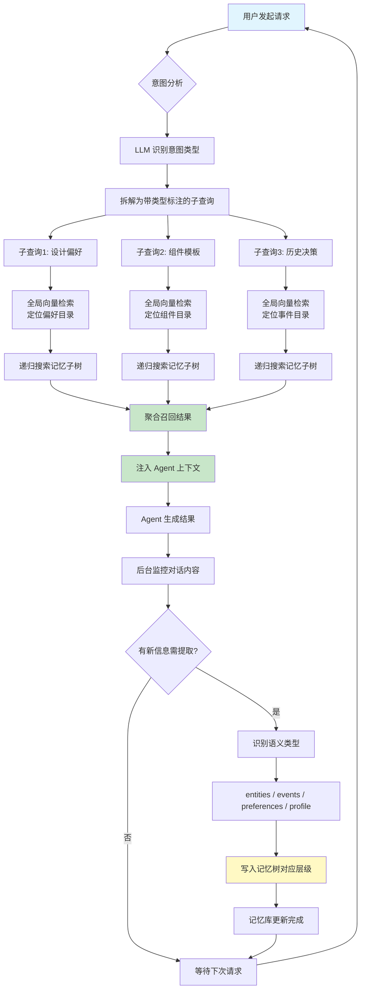

# OpenViking：Agent 记忆协议与 MCP 记忆方案

> **原文链接**: https://mp.weixin.qq.com/s/J30fOLp_8hn7Gij9MnKnFg

> **原标题**: 你的 Agent 每次都"失忆"？这个工具彻底治好了我的前端开发焦虑
> **一句话总结**: OpenViking 是一个可跨会话、跨平台、跨 SubAgent 共享的 Agent 长期记忆中枢，通过意图分析+层级检索解决 Agent"每次对话都从零开始"的上下文断裂问题，尤其适合前端设计这类长链路、多工具协作场景。
> **前置知识检查**: - [ ] 了解 MCP（Model Context Protocol）基本概念 - [ ] 了解 Agent 上下文窗口限制 - [ ] 了解向量检索（Embedding + Vector Search）基本原理 - [ ] 了解 SubAgent/多智能体协作概念

## 原文

### 问题背景：Agent 的"金鱼记忆"

凌晨一点，你刚和 Agent 把要设计的前端页面风格敲定——采用深色科技风格的背景，页面字体一致——然后关掉会话去睡觉。第二天一早，你重新开一个窗口，输入「帮我继续做数据看板」，AI 吐出的却是一张白色卡片，文字忽大忽小，五花八门的字体。你所有的心血，在会话关闭的那一刻就已经全部清零。

更糟心的是跨工具切换：用 Trae 对齐了交互逻辑，切到 Codex 继续开发又要从头解释；换 Claude Code 调 Bug，还是得重新交代一遍设计规范。那份精心整理的组件文档、沉淀下来的历史决策，就像散落在各个聊天框里的碎纸片。

**根本原因**：缺乏可结构化、可召回、可跨会话跨 Agent 流通的长期记忆底座。

### OpenViking 是什么？

**OpenViking 是连接你和所有 AI Agent 工具之间的「记忆中枢」**。它以 MCP / 插件 / CLI 工具的形式接入 Trae、Codex、Claude Code 等工具，在你每次与 AI 协作的过程中，悄悄提炼、存储你说过的一切重要规范与决策——并在下次需要时，精准召回。

### 核心能力一：形成个人长期设计规范

#### 记忆提取

Agent 对话中的零散信息（审美倾向、布局偏好、组件要求等）按语义类型分类存储：

| 类型 | 含义 | 示例 |
|------|------|------|
| **entities** | 被反复提及的组件 | Header、Sidebar、DataTable |
| **events** | 关键决策事件 | 某次背景颜色从蓝色调整为深色 |
| **preferences** | 可复用的偏好规则 | 配色、布局、字体、交互风格 |
| **profile** | 项目级画像 | 整体风格和长期约束 |

#### 记忆召回：意图分析 + 层级检索

OpenViking 的召回策略采用"意图分析 + 层级检索"两阶段方法：

**第一阶段：意图分析。** 借助 LLM 对用户请求进行意图识别，判断真正需要调用的是哪一类上下文信息——是设计偏好？组件模板？还是固化下来的操作技能？系统把用户输入拆解成带有类型标注的子查询，每个子查询带着明确的检索目标路由到对应记忆空间。

**第二阶段：层级检索。** 记忆库不是扁平仓库，而是一棵按语义路径生长的记忆树。检索时先做全局向量检索找到最相关起始目录，然后采用递归搜索策略：从相关性评分最高的节点开始，优先向下展开。相当于沿着最可能正确的路径逐层深入，而非大海捞针。

### 核心能力二：跨会话记忆延续

同一项目下的多个会话共享一份长期记忆。新会话中，Agent 无需从零开始，而是基于已有项目背景继续推进——即使当初记录设计规范的旧会话早已关闭，规范依然可被新会话召回。

### 核心能力三：SubAgent 记忆共享

使用 Codex 等 Agent 工具时，**需求 Agent** 拆解任务、**代码 Agent** 实现功能、**审查 Agent** 检查结果——OpenViking 让多个 SubAgent 共享同一份项目上下文。前一个 Agent 的输出成为后一个 Agent 的依据，后一个 Agent 的反馈继续沉淀进项目记忆。各 SubAgent 不再"各做各的"，而是围绕同一份记忆协同工作。

### 核心能力四：跨平台 Agent 记忆共享

用 Codex 生成底图、切换 Trae 添加功能、再换 Claude Code 修 bug——OpenViking 让三者接入同一份项目记忆。在 Codex 里沉淀的颜色规范，Trae 直接可见；Trae 写入的页面布局决策，Claude Code 接手时照样召回。你在任何工具里"教"过 AI 的东西，都不会消失。

### 案例演示：搭建 Playground 网页四阶段

1. **规范沉淀阶段**：与 Agent 多轮协作确认布局、配色、组件细节，OpenViking 后台自动提炼、归类、写入记忆库。
2. **快速召回阶段**：新项目新会话中，一句话「帮我复现上个 Playground 的风格」即可完成语义检索，配色、布局、组件规范、历史决策一并注入 Agent 初始上下文。
3. **增量更新阶段**：项目迭代中补充新规范，OpenViking 写入记忆并与既有内容合并，后续自动遵守，无需反复提醒。
4. **效果对比阶段**：接入前页面风格涣散、组件体系混乱；接入后背景、按钮、标题处处有据可依，因为之前说过的每一个偏好都被记住了。

### 快速接入（以 Trae 为例）

**第一步：连接 Trae 与 OpenViking。** 在 Trae 的 设置 → MCP 中手动添加 MCP 配置 `{"mcpServers": {"openviking": {"url": "http://127.0.0.1:1933/mcp"}}}`；本地启动 OpenViking-server，状态变为连接成功即完成。

**第二步：配置检索规则。** 在 设置 → 规则 中创建规则，引导 Agent 在对话时判断是否需要调用历史记忆、是否需要提取新记忆，保存后立即生效。

**资源链接**：GitHub `github.com/volcengine/OpenViking`，官网 `https://openviking.ai/`

## 核心概念脑图

```mermaid
mindmap
  root((OpenViking<br/>Agent 记忆中枢))
    记忆提取
      entities<br/>反复提及的组件
      events<br/>关键决策事件
      preferences<br/>偏好规则
      profile<br/>项目级画像
    记忆召回
      意图分析
        用户意图识别
        子查询拆解
        类型标注与路由
      层级检索
        全局向量检索定位入口
        递归搜索记忆树
        相关性评分排序
    核心能力
      跨会话记忆延续
      多会话共享项目记忆
      SubAgent记忆共享
      需求Agent / 代码Agent / 审查Agent
      跨平台Agent记忆共享
      Codex / Trae / Claude Code
    接入方式
      MCP协议
      插件
      CLI工具
```

## 与你已有知识的关联

**《[[个人学习/LLM大模型类相关知识/AI Agent系列｜深入解析Function Calling、MCP和Skills的本质差异与最佳实践|AI Agent系列：Function Calling、MCP和Skills本质差异]]》**：OpenViking 正是通过 MCP（Model Context Protocol）作为核心接入协议，让不同 Agent 工具统一连接到同一记忆服务。如果你已理解 MCP 的"工具注册与调用"机制，OpenViking 本质上就是通过 MCP 暴露了 `search`（召回记忆）和 `remember`（提取记忆）两个核心工具。

**《[[个人学习/LLM大模型类相关知识/AgentSkillsTeams 架构演进过程及技术选型之道|AgentSkillsTeams 架构演进过程及技术选型之道]]》**：OpenViking 的多 SubAgent 记忆共享能力，与 AgentSkillsTeams 的多智能体协作场景高度互补——前者解决"记忆"问题，后者解决"分工"问题，两者结合可实现有状态的 Multi-Agent 协作。

**《[[个人学习/LLM大模型类相关知识/如何构建和调优高可用性的Agent？浅谈阿里云服务领域Agent构建的方法论|如何构建和调优高可用性的Agent]]》**：高可用 Agent 的一个关键维度是"上下文连续性"。OpenViking 的跨会话记忆延续机制，正是解决这一维度的具体方案——让 Agent 的上下文不因会话关闭而丢失，从而提升长期可用性。

**《[[个人学习/LLM大模型类相关知识/企业级 Agent 多智能体架构与选型指南|企业级 Agent 多智能体架构与选型指南]]》**：在企业级多智能体架构中，共享上下文是核心挑战之一。OpenViking 的 SubAgent 记忆共享提供了轻量级实现路径，可作为企业架构中"记忆层"的参考方案，与已有的消息队列、共享存储等方案互补。

**《[[个人学习/LLM大模型类相关知识/Skills：从编程工具的配角到Agent研发的核心|Skills：从编程工具的配角到Agent研发的核心]]》**：Skills 是 Agent 的"能力"维度，而 OpenViking 解决的是"记忆"维度。两者的关系是：记忆层存储"做什么和怎么做"的规范，Skills 层负责"执行"——一个完整的 Agent 体系需要两者协同。OpenViking 中沉淀的偏好和模板，本质上可以视为 Skills 的"个性化配置"。

## 重难点理解

### 1. 为什么简单的"全文搜索"不够，需要意图分析？

**通俗解释**：想象你去图书馆找书。如果图书管理员直接把你的问题当关键词去所有书架上一本本翻，大概率找到一堆不相关的内容。OpenViking 的做法是：先说"你想做UI设计对吧？那就去设计规范区和组件模板区找，不用去代码实现区翻"。先判断意图（去哪找），再做检索（怎么找），效率和质量都能提升。

### 2. 记忆树 v.s. 扁平向量库的区别

**通俗解释**：扁平向量库像一个把所有文件扔进一个大箱子——搜索时全箱翻一遍。记忆树则像一个有分层的文件柜：设计规范放第一层抽屉，组件模板放第二层，每个抽屉里还有子文件夹。搜索时，先找到正确的抽屉（向量检索定位入口），再一层层往里找（递归搜索），这样做的好处是：1）搜索范围越来越小，速度快；2）语义相关性更高，不会被其他类型记忆干扰。

### 3. 四种语义类型的设计意图

**通俗解释**：entities 是"这个项目中反复出现的组件有哪些"（名词清单），events 是"我们做过了哪些关键决策"（时间线），preferences 是"我喜欢什么样的风格"（偏好库），profile 是"这个项目的整体定位是什么"（画像卡）。四种类型不是凭空设计的，而是对应了人类在协作中记忆的四类核心信息——知道要建什么（entities）、知道发生了什么（events）、知道怎么建更好（preferences）、知道最终要达成什么（profile）。

### 4. 跨平台共享的真正难点在哪？

**通俗解释**：不同 Agent 工具（Codex/Trae/Claude Code）的内部上下文格式和 prompt 注入方式各不相同。OpenViking 通过 MCP 协议提供了一个标准化的"记忆访问接口"，各个工具不需要理解彼此的内部格式，只需通过统一的 `search` / `remember` 工具与记忆层交互。这种"协议解耦"是跨平台共享能够落地的关键。

### 5. 为什么"记忆提取"需要在后台自动进行？

**通俗解释**：如果每次都要用户手动告诉 Agent "记住这个"，就和以前写文档没什么区别了。OpenViking 的价值在于：你在正常写代码、讨论需求的过程中，它静默观察并自动提取——就像一个好的 Pair Programmer，不需要你反复强调，他自然会记住讨论过的关键决策。这种"零摩擦"设计是记忆系统能否被持续使用的关键。

## 原文内容流程图



## 经验

1. **Agent 的长期记忆问题本质上是"结构化上下文管理"问题**，而非简单的对话历史存储。OpenViking 将记忆分为 entities/events/preferences/profile 四类语义类型，这种分类方式值得在自己的 Agent 项目里参考——比单纯的"全文搜索历史对话"效果好得多。

2. **跨工具共享的关键在于"协议标准化"而非"格式统一"**。不同 Agent 工具各有所长，强行统一格式不现实。通过 MCP 提供标准化的记忆访问接口，是实现跨平台记忆共享的务实路径。

3. **记忆系统的易用性比智能性更重要**。OpenViking 的自动提取+零摩擦设计才是它能被实际使用的关键——用户不需要学习新操作，系统在后台静默工作。这个设计理念适用于任何"辅助型"工具。

4. **前端设计场景是 Agent 记忆问题的"最佳压力测试"**：长链路（多轮迭代）、多会话（跨天工作）、多工具（Codex/Trae/Claude Code）、多角色（SubAgent 协作）——这四重复杂度叠加，让记忆断层问题在该场景下被放大到无法忽视的程度。

5. **火山引擎开源的 OpenViking 本质上做的是 Agent 生态的"基础设施层"**。它不是要替代任何 Agent 工具，而是在它们之上加一个记忆层——这个定位让它既能独立发展，又不会和现有工具生态竞争。

## 知识

- **Agent 记忆分类法**：entities（组件清单）、events（决策事件）、preferences（偏好规则）、profile（项目画像）——这是 OpenViking 的四类语义类型，可作为 Agent 记忆系统设计的参考框架。

- **意图驱动的记忆召回**：不同于简单的向量相似度匹配，先通过 LLM 做意图识别确定"该去哪类记忆空间找"，再做层级检索——两阶段召回策略，兼顾了召回效率和结果质量。

- **记忆树（Memory Tree）**：按语义路径组织的层级存储结构。检索时利用树的层级关系逐步缩小搜索范围（先定位入口节点，再递归向下搜索），替代暴力遍历的扁平检索。

- **MCP 作为记忆访问协议**：OpenViking 通过 MCP 暴露 `search` 和 `remember` 两个工具，让任何支持 MCP 的 Agent 工具都能接入记忆层——这是 MCP 在"工具调用"之外作为"基础设施连接层"的典型应用案例。

- **跨平台共享的关键前提**：记忆的提取和存储格式必须是平台无关的结构化数据（JSON），不能依赖任何特定 Agent 工具的内部格式——这是 OpenViking 能做到 Codex/Trae/Claude Code 三方共享的技术基础。

## 可复用建议

1. **如果你在构建自己的 Agent 项目**：参考 OpenViking 的四类语义记忆分类（entities/events/preferences/profile），将对话历史结构化存储，而非简单堆砌——这会显著提升记忆召回的相关性和准确度。

2. **如果你是前端开发者**：在团队中引入 OpenViking 或类似记忆机制，将设计规范从"口头约定"变成"Agent 可读取的结构化记忆"——免去每次换工具/开新会话时反复交代设计规范的痛苦。

3. **如果你在做 Multi-Agent 系统**：为所有 SubAgent 提供统一的记忆访问接口（如 MCP 工具），让各 Agent 共享同一份项目上下文，而非各自维护独立的对话历史——这是多智能体协作中经常被忽略但至关重要的基础设施。

4. **如果你在评估 Agent 工具链**：将"是否支持 MCP"和"是否有记忆管理能力"作为核心评估标准之一。一个只会在单会话内工作的 Agent，和一条金鱼的差别不大。

## 实施办法

1. **本地部署 OpenViking**：从 GitHub `github.com/volcengine/OpenViking` 拉取代码，按文档启动 OpenViking-server（默认端口 1933），确保服务可访问。

2. **接入第一个 Agent 工具**（以 Trae 为例）：在 Trae 设置 → MCP 中添加手动配置 `{"mcpServers": {"openviking": {"url": "http://127.0.0.1:1933/mcp"}}}`，确认连接状态为"已连接"。

3. **配置 Agent 调用规则**：在 Trae 设置 → 规则中创建新规则，核心内容为：「与用户对话时判断是否有需要用到历史记忆/偏好/规范的意图，如有则优先调用 OpenViking 的 search 工具；发现新规范时调用 remember 工具提取记忆。」

4. **启动一个真实项目验证**：用一个需要多轮 UI 迭代的前端小项目（如构建一个 Dashboard 页面），刻意分多个会话、甚至切换不同 Agent 工具，验证跨会话和跨工具的规范延续效果。

5. **效果评估标准**：对比接入前后，新会话中 Agent 首次生成结果与历史规范的吻合度——背景风格、颜色体系、字体层级、组件类型四大维度是否一致。