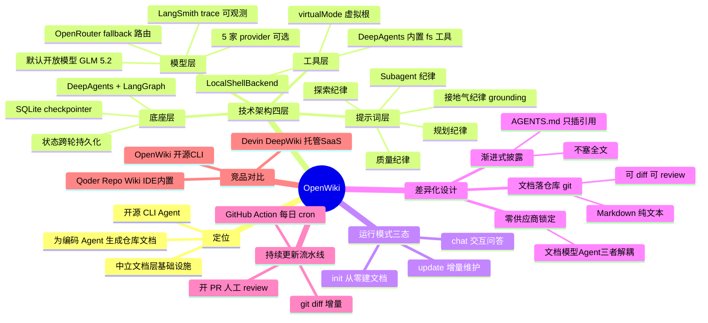
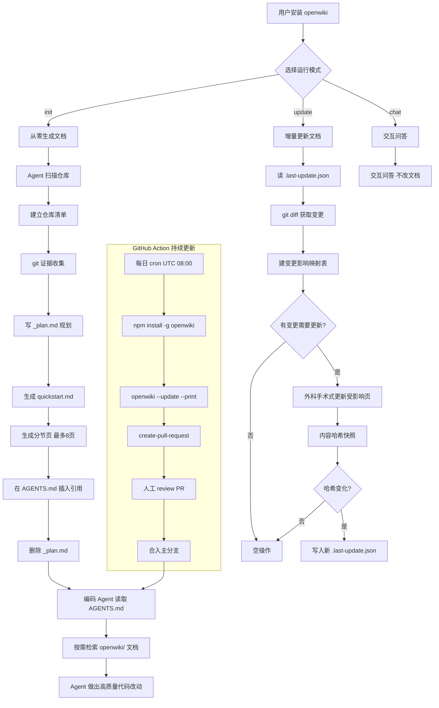

---
tags:
  - tech-article
  - Agent
  - OpenWiki
  - DeepAgents
  - CodeDocumentation
  - LangChain
created: 2026-07-06
category: 技术文章/AI
aliases:
  - OpenWiki
  - 仓库文档Agent
---

## 原文链接与概要

- **原文链接**：[OpenWiki：把"给 Agent 看的仓库文档"做成一个开源 CLI Agent](https://mp.weixin.qq.com/s/7iANuoZSqenn0enSrWoiLA)
- **原标题**：OpenWiki：把"给 Agent 看的仓库文档"做成一个开源 CLI Agent

**一句话总结**：OpenWiki 是 LangChain 发布的开源 CLI Agent，通过 DeepAgents 框架自动为代码仓库生成并维护 Markdown 文档，以"渐进式披露"方式经 AGENTS.md 引用接给任意编码 Agent，是唯一"开源+自带模型+文档留在仓库+不绑定 Agent"的组合方案。

**前置知识检查**：
- 了解 Agent 基本概念（LLM + 工具调用 + 自主循环）
- 熟悉 LangChain / LangGraph 生态基础
- 了解 AGENTS.md / CLAUDE.md 等编码 Agent 指令文件的作用
- 具备 Git 工作流和 GitHub Action 的基本认知
- 了解 Markdown 文档结构和 CLI 工具使用

---

## 原文板块

### 一、OpenWiki 到底做了什么

过去一年，"给 codebase 生成 wiki"已经不是新鲜事——Devin 的 DeepWiki 早在 2025 年 4 月就把这件事变成了一个换域名就能用的公共服务，Karpathy 也提过 LLM Wiki 的概念。OpenWiki 的作者 Brace Sproul 在发布推文里也直接承认，灵感来自 DeepWiki、AutoWiki 和 Karpathy 的想法。所以判断这个项目的价值，不能只看"它能不能生成文档"，而要看它在别人已经趟过的路上，做了哪几个不一样的工程决策。

先把定位说清楚：OpenWiki 是一个 npm 全局安装的命令行工具（`npm install -g openwiki`），运行 `openwiki --init`后，它会启动一个基于 DeepAgents 的 Agent，扫描当前仓库，然后在仓库里生成一个 `openwiki/`目录，里面是一套互相链接的 Markdown 文档。发布不到两天，GitHub star 就冲到 1600+（截至 2026 年 7 月 3 日的 star history 图），到本文写作时（7 月 4 日）已经超过 2100，增长曲线相当陡。

<assets/OpenWiki-开源CLI Agent仓库文档生成器/img_01.png>

它要解决的问题，官方博客说得很直白，而且逻辑链是完整的：Agent 写代码的质量取决于它对仓库的理解——关键逻辑在哪、文件怎么连、代码库遵循什么模式。好文档能提供这种上下文。但文档最难的地方不是写第一版，而是**跟着代码变**。大仓库、高频 PR 的场景下，文档几天就过时了。OpenWiki 的主张是：把"写初版"和"持续更新"这两件苦活都自动化掉。

这里有个容易被忽略的立场差别。DeepWiki 那批工具的隐含读者是**人类工程师**——帮你快速看懂一个陌生开源库。OpenWiki 的标题就写着 "built specifically for agents"，它的首要读者是**编码 Agent**。这个立场差别会一路影响到它的所有设计：文档放哪、怎么被消费、怎么更新，全都是围绕"让另一个 Agent 高效取用"来做的。

### 二、技术架构：一个 DeepAgents 应用的教科书式样本

OpenWiki 的代码量不大——核心逻辑集中在 `src/agent/`下的几个文件里——但它是观察"如何用 DeepAgents 搭一个实用 Agent"的好样本。整个运行时可以拆成四层。

<assets/OpenWiki-开源CLI Agent仓库文档生成器/img_02.png>

#### 2.1 底座：DeepAgents + LangGraph

OpenWiki 没有自己写 Agent 循环，而是直接调 `createDeepAgent()`。DeepAgents 是 LangChain 在 2025 年 7 月开源的 "agent harness"——它把 task planning、文件系统、subagent 派生、长期记忆这些能力打包成开箱即用的中间件，底层跑在 LangGraph runtime 上，负责持久化执行、流式输出和 human-in-the-loop。换句话说，OpenWiki 借来了一整套 Agent 基础设施，自己只需要专注在"文档生成"这个垂直任务上。

具体的构造调用暴露了几个关键设计：

```
const agent = createDeepAgent({  model,  tools: [],  checkpointer,  backend: new LocalShellBackend({    maxOutputBytes: 100_000,    rootDir: cwd,    timeout: 120,    virtualMode: true,  }),  systemPrompt: createSystemPrompt(command),});
```

值得注意的是 `tools: []`——OpenWiki 没有自定义任何工具。它完全依赖 DeepAgents 内置的文件系统工具（`ls`、`glob`、`grep`、`read_file`、`write_file`、`edit_file`）和一个 `LocalShellBackend`提供的 shell `execute`。也就是说，Agent 探索仓库、跑 git 命令、写文档，全靠这套通用工具。`virtualMode: true`把文件系统的根锚定到目标仓库：Agent 眼里的 `/`就是仓库根，这样能防止它误读父目录或其他仓库——system prompt 里反复强调"不要传 host 绝对路径"，就是在给这个虚拟根打补丁。

`checkpointer`用的是 SQLite（`@langchain/langgraph-checkpoint-sqlite`），checkpoint 文件落在 `~/.openwiki/openwiki.sqlite`，权限被 chmod 成 `0600`。这让对话状态可以跨轮持久化——CLI 默认在一次运行后保持打开，你可以继续追问，靠的就是同一个 `thread_id`加 checkpointer 恢复上下文。

#### 2.2 模型层：默认开放模型 + OpenRouter fallback 路由

OpenWiki 一个反直觉的默认选择：**默认不用闭源大模型**。`src/constants.ts`里，默认 provider 是 OpenRouter，默认模型是开放权重的 GLM 5.2（`z-ai/glm-5.2`）。它支持五家 provider——OpenRouter、Baseten、Fireworks、OpenAI、Anthropic——每家都预置了几个模型选项，也允许填自定义 model ID。

模型层最有工程味的一处是 fallback 路由。在 OpenRouter 上，它不是单点调用，而是配置了一条 fallback 链：

```
export const OPENROUTER_FALLBACK_MODEL_IDS = [  "openai/gpt-5.4-mini",  "anthropic/claude-sonnet-5",];
```

当主模型（GLM 5.2）返回 5xx 服务端错误时，`runOpenWikiAgentWithModelFallbacks`会自动换下一个模型重试，并给重试用的 `thread_id`加后缀避免 checkpoint 冲突。它甚至 hook 了全局 `fetch`，专门捕获发往 OpenRouter `/chat/completions`的请求，记录失败详情、脱敏响应体（把 `api_key`/`token`/`password`之类字段替换成 `[REDACTED]`）用于 debug。这种对"开放模型 + 便宜推理容易抖"的防御性工程，说明作者是真拿开放模型当默认路径在跑，而不是摆样子。

因为跑在 DeepAgents 上，OpenWiki 天然支持 LangSmith tracing。填了 LangSmith API key 后，每次运行都会 trace 到名为 "openwiki" 的项目里，你能看到 Agent 到底读了哪些文件、跑了哪些命令、怎么一步步把文档写出来。这是它相对于黑盒 SaaS 的一个隐性优势——生成过程是可观测、可审计的。

#### 2.3 提示词层：把"好文档"的标准写进 system prompt

如果说架构是骨架，那 `src/agent/prompt.ts`里那份三百多行的 system prompt 才是 OpenWiki 真正的"产品"。生成质量的绝大部分 know-how 都编码在这里，它比代码本身更值得读。这份 prompt 把 Agent 的行为切成了好几套纪律（discipline），每一套都在防一种典型的生成翻车。

**探索纪律**明确禁止 Agent 从仓库根跑 `glob **/*`——大仓库会直接炸上下文；要求用 `rg --files`配合排除 `.git`、`node_modules`、`dist`等目录做定向发现，优先 grep/glob 加短读，而不是整文件读。**Subagent 纪律**规定：大仓库默认只用 1-2 个 subagent 并行做只读研究，小中仓库或领域天然独立时才用 3-4 个；subagent 只能"看和总结"，绝不能写文件，所有落盘由主 Agent 负责。**规划纪律**要求 Agent 在正式写文档前，先在 `openwiki/_plan.md`里列出打算写哪些页、每页的源码证据、遗留问题，写完文档后必须删掉这个临时文件。

最能体现"给 Agent 写文档"这个立场的是**接地气纪律（grounding）**：prompt 反复强调"不要臆造文件、模块、API、业务规则或行为，每个重要论断都要落到你亲自看过的源码、现有文档或 git 证据上"。它甚至要求 Agent 大量使用 git——用 `git log`、`git show`、`git blame`去理解"为什么这段代码存在"，而不只是"这段代码是什么"。文档目标里写得很清楚：一个未来的 Agent 应该能靠这套文档做出高质量代码改动，同时少做源码探索。

还有一套**质量纪律**在专门对抗 AI 生成文档的通病——它禁止创建"薄页"（stub page）、禁止为单文件建目录、要求每页都有真实解释价值（这块做什么、为什么存在、从哪开始、要注意什么、关键源码引用）。对约 10 个文件以下的小仓库，明确要求只写 `quickstart.md`加至多 1-2 个补充页。这些约束的存在，本身就说明作者踩过"AI 把文档灌成一堆无信息量碎片"的坑。

#### 2.4 运行模式：init / update / chat 三态

OpenWiki 把运行分成三个命令，每个命令对应一套独立的 mode 指令：

`init`是从零建文档。Agent 先建仓库清单（现有文档、入口、配置、主要领域目录、测试、数据/schema 文件），用 git 证据理解重要文件的来龙去脉，然后先写 `quickstart.md`作为入口，再写链接的分节页。初版最多 8 页（除非仓库极小）。

`update`是增量维护，这是 OpenWiki 声称"更有价值"的部分。它的 mode 指令要求 Agent "外科手术式"更新：读 `openwiki/.last-update.json`里记录的上次 `gitHead`，用 `git log <lastHead>..HEAD`拿到自上次以来的所有改动，然后建一个"源码变更 → 影响哪些文档 → 需要改什么 → 为什么"的映射表。它甚至给了软性 diff 预算：改动少于约 5 个源文件时，最多更新 1-2 个 wiki 页；不许做纯格式化改动；如果 wiki 已经是最新的，就明确说"无需改动"，直接空操作。

这套增量逻辑的落地靠 `src/agent/utils.ts`里的 git 证据收集：它跑 `git status --short`、`git rev-parse HEAD`、`git log <lastHead>..HEAD --name-status`、`git diff --name-status HEAD`，把这些拼成一段"git 证据"喂给 prompt。更新完成后，CLI 会对 `openwiki/`目录做一次内容哈希快照（排除 metadata 文件），只有哈希真的变了才写入新的 `.last-update.json`——避免"跑了但啥也没改"也刷新时间戳。

`chat`是交互问答态，默认不改文档，除非你明确要求。

下面这张表把四层拼在一起看：

| 层 | 组件 | 关键选择 |
| --- | --- | --- |
| 底座 | DeepAgents + LangGraph + SQLite checkpointer | 不自研 Agent 循环；状态跨轮持久化 |
| 工具 | DeepAgents 内置 fs 工具 + LocalShellBackend | tools: []，虚拟根锚定仓库 |
| 模型 | OpenRouter(默认 GLM 5.2) / Baseten / Fireworks / OpenAI / Anthropic | 默认开放模型 + fallback 路由 + LangSmith trace |
| 提示词 | init/update/chat 三套 mode 指令 | 探索/subagent/规划/grounding/质量五套纪律 |

### 三、OpenWiki 真正的差异化：文档怎么接给 Agent

生成文档只是第一步。OpenWiki 最想强调、也最能和竞品拉开身位的，是它怎么把 wiki"接"到你的编码 Agent 上。这里的设计哲学值得单独讲，因为它直接回答了"为什么不是又一个 DeepWiki"。

现在几乎所有编码 Agent 都会读仓库根的指令文件——`AGENTS.md`或 `CLAUDE.md`。一个直觉的做法是把仓库文档全塞进这些文件里。OpenWiki 明确拒绝了这条路：大仓库的 wiki 可能有几百页，全部塞进指令文件，每次 Agent 运行都要加载，既浪费上下文又难维护。

它的做法是**只插一段引用（reference），不塞全文**。生成 wiki 后，OpenWiki 会在 `AGENTS.md`/`CLAUDE.md`里加一段固定结构的 `## OpenWiki`小节，告诉 Agent"这个仓库的文档在 `/openwiki`目录，从 quickstart 开始读，需要仓库上下文时来这里找"。如果文件不存在就创建，如果已存在就只更新这一小节、保留其余内容。这段引用的模板在 prompt 里是写死的：

```
## OpenWikiThis repository has documentation located in the /openwiki directory.Start here:- [OpenWiki quickstart](openwiki/quickstart.md)...When working in this repository, read the OpenWiki quickstart first, thenfollow its links to the relevant architecture, workflow, domain, operation,and testing notes.
```

这是典型的**渐进式披露（progressive disclosure）**：指令文件里只放一个指针，Agent 需要时顺着链接自己检索。它不依赖任何特定 Agent 的私有 API——只要那个 Agent 会读 `AGENTS.md`（现在主流的 Cursor、Claude Code、Codex 等都会），它就能自动发现并使用这套文档。这是一个"零供应商锁定"的接入方式，也是 OpenWiki 相对于闭环产品最锋利的一点：文档、模型、消费它的 Agent，三者完全解耦。

### 四、持续更新：GitHub Action + git diff 的后台流水线

文档会过时，是所有 codebase wiki 的死穴。OpenWiki 给的答案是一条可以完全跑在后台的流水线。仓库里的 `examples/openwiki-update.yml`是一个现成的 GitHub Action：默认每天 UTC 08:00（美西午夜）跑一次，`npm install -g openwiki`后执行 `openwiki --update --print`，然后用 `peter-evans/create-pull-request`把 `openwiki/`目录的改动开成一个 PR。

```
- name: Run OpenWiki  run: openwiki --update --print  env:    OPENROUTER_API_KEY: ${{ secrets.OPENROUTER_API_KEY }}    OPENWIKI_MODEL_ID: z-ai/glm-5.2    LANGSMITH_API_KEY: ${{ secrets.LANGSMITH_API_KEY }}
```

这条流水线把前面讲的所有机制串了起来：`--print`是一次性非交互运行（跑完打印结果就退出，适合 CI）；`--update`触发增量逻辑，读 `.last-update.json`的 gitHead，用 git diff 理解自上次以来的改动，只改受影响的页；改动以 PR 形式提交，保留了人工 review 的关卡，而不是直接 push 到主分支。你的编码 Agent 则通过 `AGENTS.md`里那段引用，始终读到合进主分支后的最新 wiki。

选择"开 PR 而非直接提交"是个克制的决定——它承认自动生成的文档需要人把关，同时又把日常维护的重复劳动全接管了。

### 五、和 DeepWiki、Qoder Repo Wiki 的异同

这三个产品都在做"仓库 wiki"，但它们的产品形态、数据归属、消费方式差得很远。理解差异的关键，是看**文档生成在哪、存在哪、被谁消费、怎么更新、谁掏钱**这几条轴。

#### 5.1 三者定位速览

Devin 的 DeepWiki 是 Cognition 在 2025 年 4 月推出的**托管 SaaS**。用法极简：把任意公开仓库 URL 里的 `github.com`换成 `deepwiki.com`就能看到自动生成的 wiki，带架构图、代码摘要和源码链接。它已经索引了 5 万+ 顶级开源仓库；公开仓库免费，私有仓库需要 Devin 账号。文档不落进你的仓库，而是存在 Cognition 的服务器上，通过网页浏览、Ask Devin 问答，或官方 MCP server（`mcp.deepwiki.com`，提供 `ask_question`、`read_wiki_structure`、`read_wiki_contents`三个工具）被消费。想引导生成方向，可以在仓库根提交 `.devin/wiki.json`，指定 `repo_notes`和要生成的 `pages`。

Qoder 的 Repo Wiki 是**IDE 内置能力**，是 Qoder "Knowledge Engine"三件套（Repo Wiki + Knowledge Card + Conversation Memory）的一部分。它在本地生成 `.qoder/repowiki`目录，持续监控代码改动，在三种场景下触发更新（wiki 首次生成后监控、代码与 wiki 不一致时点 Update、直接改了 Markdown 时点 Sync）。它最有特色的是"人工修订不被覆盖"——你用 `/knowledge`命令改过的内容会被反向同步到 knowledge card，把人的判断沉淀成知识资产。团队共享既可以 git 提交 `.qoder/repowiki`，也可以用 Web console 的团队同步。据教程数据，4000 个文件的仓库生成一次约需 120 分钟。它的消费方是 Qoder 自家的 Agent。

OpenWiki 的定位前面已经讲透了：**开源 CLI Agent**，文档以 Markdown 落进 `openwiki/`并提交 git，通过 `AGENTS.md`引用接给任意编码 Agent，用 GitHub Action 增量更新。

#### 5.2 核心差异对照

| 维度 | OpenWiki | Devin DeepWiki | Qoder Repo Wiki |
| --- | --- | --- | --- |
| 开源 | 是（MIT） | 否（DeepWiki-Open 是第三方复刻） | 否 |
| 产品形态 | 本地 CLI Agent | 托管 SaaS（换域名即用） | IDE 内置功能 |
| 文档存放 | 你的仓库 openwiki/，提交 git | Cognition 服务器 | 本地 .qoder/repowiki，可提交 git |
| 消费方 | 任意读 AGENTS.md的 Agent | Ask Devin / 网页 / MCP | Qoder 自家 Agent |
| 模型 | 自带（默认开放模型 GLM 5.2，5 家可选） | Cognition 固定 | Qoder 固定 |
| 更新机制 | GitHub Action 每日 + git diff 增量，开 PR | Cognition 后台重新索引 | 代码变更监控 + 手动 Update/Sync |
| 人工修订保护 | 靠 git PR review | .devin/wiki.json引导 | 修订反向同步、不被覆盖（较强） |
| 成本模型 | 自付推理 API（BYO key） | 公开仓库免费 / 私有付费 | Qoder 订阅 + credit |
| 过程可观测 | LangSmith trace | 黑盒 | 黑盒 |

#### 5.3 怎么看这些差异

**数据归属是最根本的分野。**DeepWiki 把文档留在 Cognition 那边，好处是零配置、换个域名就能看世界上任何开源库；代价是你的文档不在你手里，私有代码要上传到第三方，且离线不可用。OpenWiki 和 Qoder 都把文档留在仓库里，OpenWiki 更进一步——纯 Markdown、提交 git、可 diff、可 review，和你现有的代码评审流程无缝衔接。对私有代码敏感、或者希望文档跟着仓库走的团队，这是决定性的差别。

**消费方式决定了锁定程度。**DeepWiki 通过 Ask Devin 和 MCP 消费，Qoder 通过自家 Agent 消费——两者的 wiki 价值都和各自的产品生态绑定。OpenWiki 用 `AGENTS.md`引用这个"公共协议"接入，理论上今天 Cursor 生成的 wiki，明天换 Claude Code 照样能用。这是它作为开源工具最想占的生态位：不做 Agent，只做"给所有 Agent 用的文档层"。

**模型自由度上 OpenWiki 独一份。**它是三者里唯一让你自带模型和 provider 的，甚至默认就用开放权重模型跑。DeepWiki 和 Qoder 都用厂商锁定的模型，你无从选择。对成本敏感、或者有合规要求必须用特定模型/自托管推理的团队，OpenWiki 的开放性是硬需求。当然反过来，DeepWiki 公开仓库免费、Qoder 开箱即用，对只想快速看懂一个开源库的个人开发者更省事——OpenWiki 需要你配 API key、掏推理费用。

**更新机制的哲学也不同。**OpenWiki 是"push 式"——你主动配一个每日 cron，靠 git diff 精准增量、开 PR 让人把关。Qoder 是"IDE 内触发式"——在你编码时监控变化、提示你点 Update/Sync，且有较强的人工修订保护。DeepWiki 是"平台托管式"——Cognition 在后台重新索引，你基本不用管。三种节奏分别对应"CI 后台自动化""开发者贴身协作""看别人代码零维护"三类场景。

值得补一句：Qoder 的 Repo Wiki 其实野心更大，它不止做文档，还配了 Knowledge Card（高密度知识单元）和 Conversation Memory（从对话里提炼的踩坑和决策），三者汇进同一个知识引擎。OpenWiki 目前只专注 codebase 文档这一件事——但作者在博客里明确说，这个"给 Agent 维护持久上下文"的模式未来能推广到编码之外的更多工作流。方向上，两者都在往"Agent 的长期知识底座"走，只是 OpenWiki 起步更聚焦。

<assets/OpenWiki-开源CLI Agent仓库文档生成器/img_03.png>

### 六、总结：它赌的是"文档层"该开放且中立

OpenWiki 在技术上没有惊人的创新——生成 wiki 这件事 DeepWiki 一年前就做了，增量更新、git 证据、subagent 并行这些手法在 Agent 工程里也不算新。它真正的判断在产品哲学：**"给 Agent 用的仓库文档"应该是开源的、模型中立的、留在你自己仓库里的、不绑定任何一个编码 Agent 的一层基础设施。**

这个赌注押在一个正在成型的行业共识上——`AGENTS.md`正在成为编码 Agent 的事实标准入口。一旦这个入口稳定，"往入口里挂一层可检索的仓库文档"就是自然的下一步，而 OpenWiki 想成为那一层的默认实现。它不和 Cursor、Claude Code、Devin 抢 Agent 的活，而是做它们共同的上游。发布两天冲到 2000+ star，说明这个"中立文档层"的定位戳中了真实痛点。

它的局限也很清楚：需要自配 API key 和推理预算，对个人开发者的即时性不如 DeepWiki 换域名那么爽；生成质量高度依赖 system prompt 和所选模型，默认的开放模型在复杂仓库上能不能稳定产出高质量文档，还需要更多真实项目验证；`update`的"外科手术式"增量逻辑在超大 monorepo 上的实际效果，目前也缺乏公开的规模化数据（此为推测，官方尚未给出大仓库基准）。但作为一个把"文档层开放化"作为核心主张的开源项目，它的方向和工程完成度都值得关注。

<assets/OpenWiki-开源CLI Agent仓库文档生成器/img_04.png>

### 参考资料

- OpenWiki GitHub 仓库：https://github.com/langchain-ai/openwiki
- LangChain 官方博客《Introducing OpenWiki, an open source agent for repo documentation》（2026-07-02）：https://www.langchain.com/blog/introducing-openwiki-an-open-source-agent-for-repo-documentation
- 源码分析基于 clone 的仓库：`src/agent/index.ts`、`src/agent/prompt.ts`、`src/agent/utils.ts`、`src/constants.ts`、`examples/openwiki-update.yml`（commit 截至 2026-07-04）
- DeepAgents 概览（LangChain Docs）：https://docs.langchain.com/oss/python/deepagents/overview
- DeepAgents GitHub 仓库：https://github.com/langchain-ai/deepagents
- Devin DeepWiki 文档：https://docs.devin.ai/work-with-devin/deepwiki
- Cognition 博客《DeepWiki: AI docs for any repo》：https://cognition.com/blog/deepwiki
- 《Frontier Code Intelligence》（DeepWiki / Codemaps / MCP 关系分析）：https://trilogyai.substack.com/p/frontier-code-intelligence
- Qoder Knowledge Engine 概览：https://docs.qoder.com/user-guide/knowledge-engine
- Qoder Repo Wiki 文档：https://docs.qoder.com/user-guide/knowledge-engine/repo-wiki
- Qoder 上手教程（含 `.qoder/repowiki`结构与生成耗时）：https://tutorial.theaibuilders.dev/tutorials/Vibe%20Coding/qoder-tutorial

---

## 核心概念脑图



---

## 与你已有知识的关联

**《[[大厂技术文章-DailyTech/文章/LLM Wiki-直播数据知识底座编译实践|LLM Wiki-直播数据知识底座编译实践]]》**：两篇都围绕"用 LLM 为代码/数据仓库生成结构化知识文档"展开。LLM Wiki 侧重直播数据领域的知识编译，OpenWiki 则面向通用代码仓库，且以 Agent 为首要读者，可对比两者在文档生成策略和消费方式上的异同。

**《[[大厂技术文章-DailyTech/文章/ContextBucket-Agent无限记忆与工作区底座|ContextBucket-Agent无限记忆与工作区底座]]》**：ContextBucket 解决 Agent 的持久记忆和工作区管理问题，OpenWiki 解决的是 Agent 对仓库上下文的持久理解。两者都是"Agent 长期知识底座"方向的不同切面，OpenWiki 偏文档层，ContextBucket 偏记忆层。

**《[[大厂技术文章-DailyTech/文章/Agent Harness Engineering-ETCLOVG七层框架综述|Agent Harness Engineering-ETCLOVG七层框架综述]]》**：OpenWiki 本身就是一个 DeepAgents harness 应用的典型样本，其四层架构（底座/工具/模型/提示词）可以与 ETCLOVG 七层框架做映射对照，理解 Agent 工程的通用分层模式。

**《[[大厂技术文章-DailyTech/文章/OpenClaw与Hermes-AI Agent架构源码复盘|OpenClaw与Hermes-AI Agent架构源码复盘]]》**：同样是对开源 Agent 项目的源码级拆解，OpenClaw/Hermes 和 OpenWiki 都基于 LangChain 生态，可以对比不同 Agent 项目在工具设计、提示词工程和架构选型上的差异。

**《[[大厂技术文章-DailyTech/文章/GBrain-Agent时代知识自组织与自进化体系|GBrain-Agent时代知识自组织与自进化体系]]》**：GBrain 关注知识的自组织和自进化，OpenWiki 的增量更新机制（git diff + 外科手术式更新）是知识自进化在代码文档领域的具体实现。两者共同指向"Agent 知识底座需要持续演进"这一核心命题。

---

## 重难点理解

### 1. 渐进式披露（Progressive Disclosure）是核心设计哲学

OpenWiki 最关键的设计不是"怎么生成文档"，而是"怎么把文档接给 Agent"。它选择在 AGENTS.md 里只放一个指针（引用），而非塞入全文。这个决策背后有三层考量：
- **上下文经济性**：大仓库 wiki 可能几百页，全塞进 AGENTS.md 会浪费大量上下文窗口
- **按需检索**：Agent 只在需要时才顺着链接去读具体文档，类似人类的"目录→章节"阅读模式
- **零锁定**：AGENTS.md 是事实标准入口，所有主流编码 Agent 都会读，不依赖任何私有 API

### 2. "给 Agent 写文档"和"给人写文档"的立场差异

这是容易被忽略但影响全局的设计分野。给人写的文档注重可读性、叙事性；给 Agent 写的文档注重**可检索性、可定位性、证据链完整性**。OpenWiki 的 system prompt 要求 Agent 大量使用 git（log/show/blame）来理解"为什么"而非仅"是什么"，就是因为编码 Agent 在做代码修改时，需要理解设计意图和变更历史，而不只是当前代码长什么样。

### 3. 五套纪律的本质是"防翻车工程"

OpenWiki 的 system prompt 之所以有三百多行，不是因为任务复杂，而是因为 AI 生成文档有太多已知的翻车模式：
- 探索纪律 → 防"大仓库炸上下文"
- Subagent 纪律 → 防"多 Agent 写文件冲突"
- 规划纪律 → 防"无计划乱写"
- 接地气纪律 → 防"AI 幻觉臆造不存在的模块"
- 质量纪律 → 防"生成一堆无信息量的薄页"

每套纪律都是对一个具体失败模式的防御，这种"以纪律对抗翻车"的 prompt 工程思路值得借鉴。

### 4. 增量更新的"外科手术式"策略

update 模式不是重新生成全部文档，而是：读上次 gitHead → git diff 拿变更 → 建"源码变更→文档影响"映射 → 只改受影响的页。这是性能和质量的平衡点——全量重新生成太贵且容易丢失人工修订，纯增量又可能遗漏关联影响。OpenWiki 用 git diff 作为"变更感知器"，是一个低成本高信息量的选择。

---

## 原文内容流程图



---

## 经验

1. **"只插引用不塞全文"是 Agent 上下文管理的黄金法则**：OpenWiki 的渐进式披露策略证明，给 Agent 提供信息不是越多越好，而是要在"入口指引"和"按需检索"之间找到平衡。这个原则适用于所有需要给 Agent 提供大量上下文的场景。

2. **用 git 作为"变更感知器"是低成本高回报的选择**：git diff/log/blame 天然提供了代码变更的完整历史和语义信息，比自建变更追踪系统更可靠且零额外成本。任何需要理解代码演变的 Agent 工具都应该优先利用 git 证据。

3. **system prompt 的"纪律化"组织方式值得学习**：把 prompt 按"防翻车模式"切分成多套纪律，每套针对一个具体失败模式，比笼统的指令更有效。这是"防御性 prompt engineering"的实践范例。

4. **默认开放模型 + fallback 路由是成本与稳定性的最优解**：用便宜的开放模型做默认路径，失败时自动降级到更贵的模型，既控制了日常成本，又保证了可用性。这个模式适合所有需要高频调用 LLM 的工具。

5. **"开 PR 而非直接提交"体现了对人机协作边界的清醒认知**：自动生成的内容保留人工 review 关卡，是当下 AI 能力水平的务实选择。完全自动化和完全人工之间的"半自动"状态，是当前最可靠的工程模式。

---

## 知识

| 概念 | 定义 | 关键细节 |
| --- | --- | --- |
| OpenWiki | LangChain 发布的开源 CLI Agent，为代码仓库生成并维护 Markdown 文档 | npm install -g openwiki；MIT 协议；2 天冲到 2100+ star |
| DeepAgents | LangChain 2025 年 7 月开源的 Agent harness | 提供 task planning、文件系统、subagent、长期记忆等中间件；跑在 LangGraph 上 |
| 渐进式披露 | 在入口文件只放指针，Agent 按需检索详细内容 | OpenWiki 在 AGENTS.md 只插引用，不塞全文 |
| virtualMode | LocalShellBackend 的配置，将文件系统根锚定到目标仓库 | 防止 Agent 误读父目录或其他仓库 |
| fallback 路由 | 主模型失败时自动切换到备选模型重试 | OpenRouter 上配置 GLM 5.2 → GPT-5.4-mini → Claude Sonnet-5 的链 |
| 五套纪律 | system prompt 中组织 Agent 行为的五类规则 | 探索/subagent/规划/grounding/质量 |
| .last-update.json | 记录上次更新时的 git commit hash | update 模式用它计算 git diff 范围 |
| AGENTS.md | 编码 Agent 的事实标准入口文件 | OpenWiki 在其中插入 `## OpenWiki` 引用小节 |
| LangSmith tracing | LangChain 的可观测性服务 | OpenWiki 天然支持，可审计 Agent 的每一步操作 |
| 内容哈希快照 | 对 openwiki/ 目录做哈希，排除 metadata 文件 | 只有哈希变化才更新 .last-update.json，避免空跑刷新时间戳 |

---

## 可复用建议

1. **渐进式披露模式可用于所有 Agent 上下文管理场景**：当你需要给 Agent 提供大量参考信息时，在入口文件放指针+按需检索，比全量灌入上下文更高效。这个模式适用于知识库接入、文档系统、RAG 架构等场景。

2. **git 证据收集函数可直接复用**：`git status --short`、`git rev-parse HEAD`、`git log <lastHead>..HEAD --name-status`、`git diff --name-status HEAD` 这组命令组合，可用于任何需要"感知代码变更"的自动化工具。

3. **五套纪律的 prompt 组织方式可迁移**：当你需要让 Agent 完成复杂任务时，按"已知翻车模式"切分纪律来组织 system prompt，比写一段笼统的指令更有效。可以直接参考 OpenWiki 的 prompt.ts 作为模板。

4. **fallback 路由模式适用于所有高频 LLM 调用场景**：主模型用便宜的开放模型，失败时降级到更贵更稳的闭源模型，是成本和可用性的最佳平衡策略。

5. **GitHub Action + PR 的文档自动更新流水线可直接搭建**：OpenWiki 提供了现成的 `openwiki-update.yml`，任何团队都可以直接 fork 使用，实现仓库文档的每日自动增量更新。

---

## 实施办法

### 阶段一：快速体验（1-2 小时）

1. 安装 OpenWiki：`npm install -g openwiki`
2. 在一个小型开源仓库中运行 `openwiki --init`，观察生成的 `openwiki/` 目录结构
3. 检查 AGENTS.md 中被插入的引用内容，理解渐进式披露的具体形态
4. 用 `openwiki --chat` 交互问答，测试 Agent 对仓库的理解程度

### 阶段二：接入团队仓库（1-2 天）

1. 选择一个中等规模的团队仓库，配置 OpenRouter API key（或其他 provider）
2. 运行 `openwiki --init` 生成初版文档，人工 review 生成质量
3. 评估默认模型（GLM 5.2）的效果，如不满意可切换到其他 provider/model
4. 确认 AGENTS.md 引用内容正确，团队使用的编码 Agent 能自动发现文档

### 阶段三：搭建持续更新流水线（半天）

1. 将 `examples/openwiki-update.yml` 复制到仓库的 `.github/workflows/`
2. 在 GitHub Secrets 中配置 `OPENROUTER_API_KEY`（和可选的 `LANGSMITH_API_KEY`）
3. 调整 cron 时间（默认 UTC 08:00）适应团队节奏
4. 第一次自动 PR 生成后，团队 review 并合入，验证全链路通畅

### 阶段四：优化与定制（持续）

1. 根据实际使用反馈，评估是否需要调整模型选择（成本 vs 质量）
2. 如果默认开放模型质量不够，切换到 OpenAI/Anthropic provider
3. 关注 OpenWiki 的版本更新，特别是 prompt 模板和增量逻辑的改进
4. 考虑 fork 并定制 system prompt，使其更贴合团队的代码规范和文档偏好
