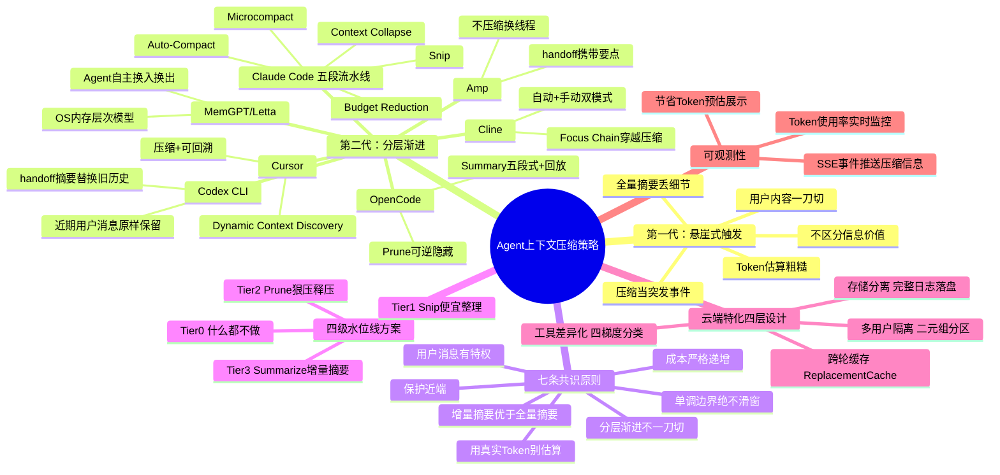
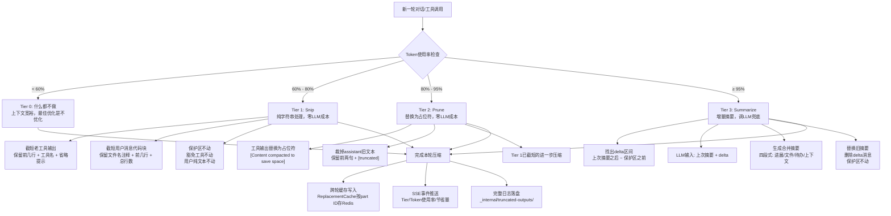

# 上下文压缩：六大 Agent 策略横向拆解与第 7 种方案

> **原文链接**: https://mp.weixin.qq.com/s/BQwyvE2qIfguwKk63F3LZw

> **原标题**: 横向拆解Claude Code、Codex等六大Agent上下文压缩策略后，我们做了第7个
> **一句话总结**: 横向对比Claude Code、Codex CLI、OpenCode、Cline、Cursor、Amp六大主流Agent的上下文压缩策略，提炼分层渐进、增量摘要、Prompt Cache友好等共识原则，最终落地一套四级水位线+增量摘要的云端多用户Agent上下文管理方案。
> **前置知识检查**: - [ ] 了解Agent基本架构和工作原理 - [ ] 理解LLM上下文窗口（Context Window）概念 - [ ] 了解Prompt Cache的基本原理 - [ ] 了解Token与计费的基本概念 - [ ] 了解云端多租户服务的基本特点

## 原文

作者：mervynyang（腾讯程序员）

文章系统性地横向拆解了Claude Code、Codex CLI、OpenCode、Cline、Cursor、Amp六大主流Agent的上下文压缩策略，从第一代"撑不住才动手"的悬崖式触发痛点出发，分析第二代"分层+渐进"各家的设计哲学差异，提炼出七条共识原则，最终在MUR AI（面向用研场景的云端多用户Agent）上落地了一套四级水位线+增量摘要的方案，并详述了云端场景特有的存储分离、工具差异化、跨轮缓存、多用户隔离四层设计。

**六大方案对比速览：**

| 产品 | 核心策略 |
|------|----------|
| Claude Code | 五段流水线（Budget Reduction → Snip → Microcompact → Context Collapse → Auto-Compact），成本递增，结构化九段摘要 |
| Codex CLI | 95%触发handoff摘要，近期用户消息原样保留，旧历史蒸馏替换 |
| OpenCode | Prune（可逆隐藏+时间戳标记）+ Summary（五段式摘要+回放最后一条用户消息） |
| Cline | `/smol`手动+Auto-Compact自动双模式，Focus Chain待办列表穿越压缩 |
| Cursor | 自动摘要+提示开新对话，Dynamic Context Discovery可搜索历史 |
| Amp | 不做递归压缩，`/handoff`开新线程携带要点，线程为一等公民 |
| MemGPT/Letta | 按OS内存层次建模：Main Context=RAM, Recall Memory=交换分区, Archival Memory=磁盘 |

**四级水位线方案（核心产出）：**
- **Tier 0（< 60%）**：什么都不做，上下文宽裕时最好的优化是不优化
- **Tier 1（60-80%）**：Snip——纯字符串截断，零LLM成本，截短老工具输出和代码块
- **Tier 2（80-95%）**：Prune——替换为占位符，裁掉assistant旧文本，依然零LLM成本
- **Tier 3（≥ 95%）**：Summarize——增量摘要，只合并delta部分，保护区不动

## 核心概念脑图

## 与你已有知识的关联

- **《[[Function Calling与MCP-Skills本质差异与最佳实践|AI Agent系列｜Function Calling、MCP和Skills]]》**：上下文压缩是Agent运行时工程的核心环节，与Function Calling、MCP等同样影响Agent的实际可用性——压缩策略差会导致模型忘掉已调用的工具结果，直接破坏工具链的连贯性。
- **《[[AgentSkillsTeams 架构演进过程及技术选型之道|AgentSkillsTeams 架构演进过程]]》**：多智能体架构中，上下文压缩策略直接影响子Agent间的交接质量。Codex CLI的"handoff摘要"思想和Amp的"换线程"思路，与多Agent编排中"子任务交接"有相同的设计本质——如何在不丢失关键信息的前提下切换执行上下文。
- **《[[高可用Agent-阿里云服务领域构建与调优方法论|构建高可用性Agent的方法论]]》**：本文提出的四级水位线正是高可用性的一种工程实践——通过渐进式分级响应避免悬崖式塌方，用可观测性（SSE事件推送压缩状态）让系统行为透明可控。
- **《[[企业级 Agent 多智能体架构与选型指南|企业级Agent多智能体架构与选型指南]]》**：云端多用户场景的存储分离、跨轮缓存、多用户隔离三层设计，是企业级Agent架构的必要补充——CLI工具不需要考虑Pod重启和流量漂移，但企业级服务必须处理。
- **《[[Skills-从编程工具配角到Agent研发核心|Skills：从编程工具的配角到Agent研发的核心]]》**：本文将Skill和Task标记为PROTECTED_TOOLS——任何Tier都不压缩其输出，这从上下文管理的视角印证了Skill在Agent系统中的核心地位，其输出具有会话级状态意义，删了Agent就糊涂了。

## 重难点理解

### 1. 增量摘要 vs 全量摘要：本质差异
- **全量摘要**：每次触发压缩时，把整个历史重新送给LLM生成摘要。问题在于：(1) 输入越来越长，成本递增；(2) 同一段历史被反复重写，每写一次信息就失真一次——"摘要的摘要"导致语义漂移；(3) 同一文件如果被多次提及，可能被描述好几次且互相矛盾。
- **增量摘要**：维护一份持续更新的"活摘要"。每次只把"上次摘要之后、保护区之前"的新增内容送给LLM，让模型合并新旧摘要。好处：输入更短更便宜，历史不会被反复重写，合并时模型可以主动取舍（"这个文件改过了，旧描述更新一下"）。
- **类比**：全量摘要 = 每周重写过去三个月的周报；增量摘要 = 维护一份持续更新的项目状态，每周只追加和修订。

### 2. Prompt Cache 与压缩的博弈（滑窗陷阱）
- **问题**：如果在step-loop里每一步都用滑窗规则重算哪些消息需要stub替换，每完成一个step就有1条旧消息滑出窗口被替换——它的字节变了，从这个位置往后的整段Prompt Cache前缀失效，需要重新写入。
- **真实代价**：作者团队一个177 step的会话烧了$77.3，其中83%（$64.8）全是cache_write（单价是cache_read的12.5倍）。从step 7起前缀缓存就死了，剩下50多个step每一步都在为"窗口又挪了一格"买单。
- **解决方案**：stub决策必须单调推进——一个part一旦被标成stub，后续所有turn、所有step里都保持stub不变，绝不因为"又老了一步"而反复触发。实现上可以通过按part ID持久化决策（Redis/内存映射），或者用cache_edits API让服务端处理。

### 3. 存储分离：模型工作记忆与用户审计需求的解耦
- CLI工具的工具输出要么留在context里，要么就没了——它们没有前端，不需要事后审计。
- 云端Agent不同：用户合上电脑回来、运维排查问题需要完整日志。解决方案是完整输出落盘（沙箱`_internal/truncated-outputs/{callId}.log`），对话里只保留截断版+回取路径。前端按需调API取完整日志，完全绕开context约束。
- **本质**：把"模型应该用多少token看到什么"和"用户事后想看什么"这两个需求拆开处理。

### 4. 工具差异化分类：信息密度决定压缩策略
- **完全保护（PROTECTED_TOOLS: Skill, Task）**：Skill关联知识库绑定，Task是会话级元任务，输出有状态意义，任何Tier不动。
- **微压缩豁免（Task, AskUserQuestion）**：AskUserQuestion的输出是用户的回答，删了等于把用户回话抹掉。
- **白名单内可压（bash, read, grep, websearch…）**：无状态读取类工具，压缩的主力。
- **差异化存储预算**：Read 30KB、Bash 50KB、WebSearch 15KB——bash常吐大段构建日志，read相对可控，websearch几条结果就够。
- **本质**：一段grep输出和一次Skill调用的信息密度不在一个量级，用统一阈值处理就是粗暴。

### 5. Context Rot：上下文压缩的终极目标不是省钱
- 200K上下文窗口塞到70%以上，模型的中段失忆和指令漂移就会明显恶化——不是"忘了"，是注意力被稀释、信号被噪声淹没。
- **压缩系统的本质是信号工程师**：把无关工具输出降为占位符，把老assistant文本裁短，把历史合并成结构化摘要——让模型用事实思考而不是用文本回忆。
- 省钱是顺带的，核心目标是保护模型的注意力。

## 原文内容流程图

## 经验

1. **Token估算在中文场景不可靠**：`text.length / 3`估算在中英混合场景误差30-50%。作者团队曾因估算70%实际92%差点溢出。触发判断必须用LLM API返回的`usage.totalTokens`——免费、精确、唯一可信。

2. **Cache Write是最隐蔽的成本杀手**：cache_write单价是cache_read的12.5倍。如果压缩策略没有考虑Prompt Cache稳定性（如滑窗stub替换），cache_write会吃掉大部分费用。177步会话中83%费用是cache_write。

3. **压缩最大的事故不是压不够，而是压错东西**：Skill/Task的输出、用户纯文本消息、保护区内的消息一旦被误压，模型行为会产生漂移，比上下文溢出更危险。宁可让上下文爆出来，也不能通过破坏这些红线来救场。

4. **Amp的"不压缩换线程"有其道理**：递归摘要会导致性能逐步衰减（引用了OpenAI内部研究）。长对话本身就是问题——一系列有焦点的短步骤，比一个逐渐退化的长对话好。但云端Agent不能像CLI工具一样随便开新会话，用户期待接着上次继续。

5. **压缩系统需要可观测性**：没有可观测性的压缩等于盲调。SSE事件中推Tier级别、Token使用率、节省Token量、ReplacementCache命中数，前端渲染压缩面板，trace系统支持基于生产数据调水位线——这些是工程化的必备环节。

## 知识

1. **Context Rot（上下文衰减）**：上下文塞到70%以上时，模型中段失忆和指令漂移明显恶化——注意力被稀释、信号被噪声淹没。这是上下文压缩要解决的根本问题，省钱只是顺带的。

2. **Prompt Cache前缀稳定性原理**：Prompt Cache基于消息序列的前缀哈希命中。任何对序列前缀的修改——哪怕是替换一个工具输出为stub——都会导致从修改位置往后的整段缓存失效。因此压缩操作需要单调推进（一旦标记stub就永久不变）而非滑窗重算。

3. **cache_edits API**（Anthropic beta）：客户端的prompt字节原封不动，服务端在已缓存的前缀上直接抠掉指定内容。字节没变，缓存不失效。Claude Code已经在用这个API，是比本地压缩更优雅的解法。

4. **context_management API**（Anthropic beta context-management-2025-06-27）：让服务端按input_tokens阈值自动裁剪旧的工具调用。更彻底的服务端方案，Vertex/Bedrock也支持。

5. **增量摘要的delta区间定义**："上次摘要之后、保护区之前"的消息区间。第一次触发时"上次摘要"为空，相当于普通摘要；之后每次都是追加合并。

6. **工具输出信息密度分级**：grep输出信息密度低、Bash构建日志量大但关键信息少、Skill输出信息密度高且具有状态意义。压缩策略必须差异化处理。

7. **ReplacementCache模式**：按`msgOptCache:{sessionId}`key将压缩决策持久化到Redis（TTL 30分钟）。跨Pod、跨重启复用之前的决策，保证同一part在整个会话中始终长一样。

8. **四级水位线的累积关系**：Tier不是互斥的而是累积的——Tier 3触发时会先执行完Tier 1和Tier 2再做摘要。这意味着即使最坏情况下，需要送给LLM的内容量也已被前两步免费砍掉一大块。

## 可复用建议

1. **新项目直接采用四级水位线框架**：Tier 0 (<60%) → Tier 1 Snip (60-80%) → Tier 2 Prune (80-95%) → Tier 3 Summarize (≥95%)。三级阈值（60/80/95）是可配置的常量，接入远程配置后能热更新，出问题时调到1.0即禁用。

2. **压缩触发判断必须用真实Token**：每次LLM API调用都返回`usage.totalTokens`，用它做是否触发压缩的判断。`text.length / 3`只用于内部排序（"先裁哪个工具输出"），排序只需要相对大小，30%误差不影响结论。

3. **stub决策必须持久化，绝不滑窗重算**：一旦决定某个part要被替换为stub，将其按part ID存入缓存（Redis/内存映射），后续所有step直接复用。这是Prompt Cache友好的前提——消息前缀稳定，缓存才不会每步失效。

4. **定义清晰的红线（不可压缩清单）**：
   - 保护区内的所有消息（建议最近8000 token）
   - 用户消息的纯文本部分
   - PROTECTED_TOOLS的输出（Skill / Task等有状态意义的工具）
   - AskUserQuestion等保对话流的工具输出
   - 业务侧标`compactionProtected`的Part

5. **工具输出做存储分离**：完整日志落盘（沙箱文件/COS），对话历史里只保留截断版+回取路径。前端按需调API取完整日志。模型token省下来，用户事后还能审计。

6. **SSE事件推送压缩可观测性数据**：当前Tier、Token使用率、Snip/Prune/Summarize分别处理了几个part、节省Token预估量、ReplacementCache命中数。前端渲染压缩面板，让用户和开发者都能看见压缩在做什么。

7. **云端Agent必须做多用户隔离**：压缩状态按`(userId, sessionId)`二元组隔离。DB写入强制双条件WHERE，COS路径按用户分区，SSE事件按sessionId过滤订阅。

8. **暂缓事项清单参考**：主动cache-aware调度（等cache命中率成瓶颈再说）、可逆隐藏（审计需求已满足）、回放最后一条消息（Tier 3频率低不急）、用户消息一字不动（已保护纯文本）、分层长期记忆（另一个产品方向）——这些都是有效但不急的优化，避免过度工程。

## 实施办法

**阶段一：基础水位线落地（1-2周）**
1. 接入LLM API的`usage.totalTokens`，替换现有的`text.length/3`估算作为触发判断依据
2. 实现Tier 1 Snip：纯字符串级别的截短逻辑，重点处理工具输出和代码块的截断
3. 定义保护区（建议8000 token）和豁免工具列表（Skill / Task / AskUserQuestion）
4. 确认红线规则在每一级压缩中严格执行

**阶段二：增量摘要+缓存稳定性（2-3周）**
1. 实现Tier 2 Prune：占位符替换逻辑，assistant旧文本裁短
2. 实现Tier 3 Summarize：增量摘要合并逻辑——delta区间计算、LLM输入拼装（上次摘要+delta）、结构化摘要输出解析（进展/文件/待办/上下文四段）
3. 实现ReplaceCache：按part ID持久化压缩决策到Redis（`msgOptCache:{sessionId}`, TTL 30min），保证跨轮跨Pod一致性

**阶段三：云端特化+可观测性（2-3周）**
1. 存储分离：工具完整输出落盘（沙箱`_internal/truncated-outputs/`），对话里只留截断版+`fullLogPath`
2. 工具差异化：按四梯度分类（完全保护/微压缩豁免/白名单可压/差异化存储预算）实现不同压缩策略
3. SSE事件推送压缩可观测性数据：Tier级别、Token使用率、节省Token量、ReplacementCache命中数
4. 多用户隔离：压缩状态按`(userId, sessionId)`二元组分区，DB/COS/SSE三重隔离

**阶段四：生产调优（持续）**
1. 基于trace系统收集真实生产数据，调优水位线阈值
2. 监控cache_write占比，评估是否需要引入cache_edits API或主动cache-aware调度
3. 根据生产反馈迭代豁免工具列表和保护区大小
4. 接入远程配置实现阈值热更新