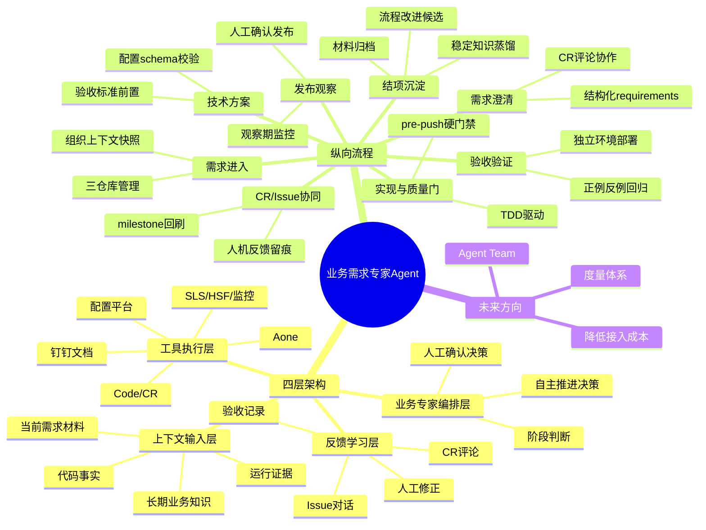
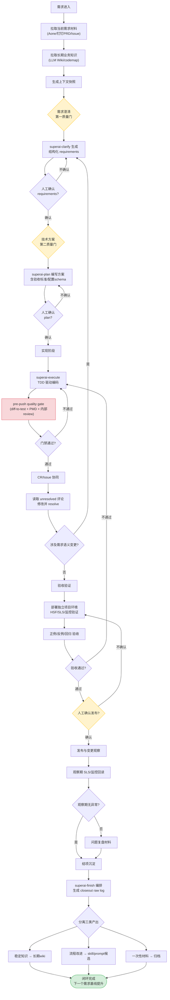

---
tags:
  - tech-article
  - AI
  - Agent
  - 端到端
  - TDD
  - 业务需求
  - RAG
  - 四层架构
created: 2026-06-15
category: 技术文章/AI
aliases:
  - 端到端业务需求Agent
  - 业务需求专家Agent
---

# 业务需求专家 Agent：端到端搭建指南

> **一句话总结**: 本文记录了一套已在真实业务需求上跑通的端到端 Agent 研发闭环——将业务需求从进入、澄清、方案、实现、CR 协同、验收、发布到结项沉淀组织成系统化链路，通过"上下文管理 + 工具编排 + 质量门禁 + 反馈沉淀"四层架构，把人工从重复性的串联、取证和回忆中解放出来，让 Agent 能自主推进需求、人只在关键节点确认。

> **前置知识检查**:
> - [ ] 了解 AI Agent 的基本概念（Skill、Tool、Prompt 编排）
> - [ ] 了解软件开发流程（需求 → 方案 → 开发 → CR → 测试 → 发布）
> - [ ] 了解 TDD（测试驱动开发）的基本理念
> - [ ] 了解 Git 分支管理和 Code Review 流程
> - [ ] 对 RAG / 上下文管理有一定认知

---

## 原文

### 1. 问题：代码之外的串联成本才是真正的瓶颈

AI 写代码本身已经不再是主要瓶颈。但一个业务需求从 PRD 到上线，中间要经过需求澄清、方案确认、实现、CR、验收、发布观察和结项沉淀——代码生成只是其中最标准化的一段，真正贵的是代码之外的串联成本。

每个环节 AI 都已经能参与一点，但如果这些能力只是散落在不同对话、不同工具和不同命令里，最后真正负责串起来的还是人。人要反复梳理上下文、切换平台、调用工具、判断下一步该做什么，还要决定哪些经验需要留到下一次。人工介入的频次越高，整条链路越容易被上下文切换、经验差异和时间占用拖住。

拆开来看，要解决的是三个工程化问题：

- **上下文能不能被组织起来。** 需求文档、用户澄清、历史业务知识、代码事实、配置平台、日志和人的经验，原本分散在不同地方。很多时候 Agent 表现不好，不是模型不会推理，而是它拿到的上下文就不完整。
- **工具能不能被串起来。** Aone、CR、代码仓、配置平台、SLS、HSF、监控、钉钉文档等都参与研发链路，但过去需要人手动编排。每多切一次平台，就多一次上下文丢失和人工判断。
- **反馈能不能产生复利。** Agent 在澄清里问错了什么、方案里漏看了什么、CR 里反复被指出什么，如果只停留在聊天记录里，下一个需求大概率还会再犯一次。

这也是作者把目标描述成"业务需求专家 Agent"的原因。它不是一个更聪明的代码生成器，而是把需求研发过程中的上下文、工具调用、人工确认、验收证据和反馈沉淀组织成一个闭环，尽可能把人从重复性的串联、取证和回忆里解放出来。

### 2. 总体架构：围绕需求交付组织上下文、工具和反馈

这套系统本质上是一个业务需求承接系统：它负责把上下文组织好，把工具串起来，把人工确认放在正确的位置，再把过程反馈收回来。

从静态视角看，这套系统可以拆成四层：

**第一层：上下文输入层。** 回答"Agent 靠什么理解业务"。不是把所有资料一次性塞进 prompt，而是按阶段拉取和组织长期业务知识、当前需求材料、代码事实和运行证据。上下文错了，后面越努力越偏。

**第二层：业务专家编排层。** 回答"下一步该做什么"。需求当前是在澄清阶段、方案阶段，还是已经可以实现？哪些地方必须停下来等人确认？哪些地方可以继续自主推进？遇到证据不足时，是回退补上下文，还是直接请求人工介入？

**第三层：工具执行层。** 回答"具体动作怎么落地"。Aone、Code / CR、配置平台、SLS / HSF、监控和钉钉文档不再是一堆需要人手动切换的网站，而是可以按阶段调用的能力。

**第四层：反馈学习层。** 回答"下次能不能更好"。CR 评论、issue 对话、验收记录、自恢复日志和人工修正，如果只留在过程里，需求结束就蒸发了。结项时需要把稳定知识沉淀到长期 wiki / codemap，把反复出现的流程问题变成 skill / prompt 改进候选。

这套方案本身不绑定特定平台，核心仍然是 skill 的组合编排和提示词设计。落地时选择 Multica，因为它在几个关键基础设施问题上降低了成本：独立 issue 工作区带来上下文隔离，Agent 与 skill 绑定减少每次手动拼装，多运行时和沙箱让需求可以持续推进，不依赖本地开发机在线。

### 3. 纵向闭环：一个需求如何被业务专家承接

#### 3.1 需求进入：先组织上下文

在真正让 Agent 开始澄清或写方案之前，它需要先拿到两类已经存在的信息：

- **当前需求材料**：Aone 工作项、钉钉 PRD、issue 评论、用户补充说明。
- **长期业务知识**：LLM Wiki、codemap、历史口径、系统边界。

落地时，上下文管理拆成了三个仓库：

| 仓库 | 分支策略 | 内容 |
|------|---------|------|
| 代码仓库 | feature 分支 | 业务代码 |
| 项目记忆仓库 | feature 分支 | requirements、plan、progress、CR 评论、验收证据 |
| 长期 wiki 仓库 | master | 稳定的业务知识 |

关键设计原则：**不直接升级**。项目过程中产生的事实先留在项目记忆层，只有经过结项审视和人工确认，才会选择性地进入长期知识。既避免噪声污染长期 wiki，也保证每次结项都能沉淀出真正有复用价值的业务知识。

#### 3.2 需求澄清：第一质量门

有了初始上下文快照后，这个阶段要解决的是"纠错"和"确认"：哪些业务口径还不清楚，哪些边界容易误解，哪些验收标准没有说完整。

主责是 `superai-clarify`，采用结构化澄清方式——把初始上下文整理成可审阅的 requirements：目标行为、非目标边界、验收标准、风险和待确认问题。人需要确认的不是一堆零散回答，而是"这份 requirements 是否准确表达了需求"。

**协作留痕**：对 Agent 的反馈不应该只停留在对话框里，而应该落到 Aone / Code 平台本身的评论体系里。确认前，`superai-workflow` 不应继续进入技术方案或实现；确认后的 requirements 会成为后续 plan、实现和验收的共同基准。

#### 3.3 技术方案：第二质量门

requirements 确认后，下一步不是直接写代码，而是先写技术方案。这是整个流程中人工确认最密集的第二处。

方案阶段要回答的问题：现状是什么、目标行为是什么、不做什么、影响范围在哪、核心改动点是什么、风险在哪、怎么验证、出问题怎么回滚。

**关键洞察**：方案阶段就应该把"怎么验收"定清楚。验收不只是单元测试，还包括 HSF 接口调用、SLS 日志查询、监控指标核对等真实环境验证。正面 case 和反面 case 都要在方案阶段定好。

配置相关需求尤其重要：方案阶段不只是读取当前配置状态，还包括提前创建配置的 schema、完成配置校验，并写进技术方案文档里。落地时由 `superai-plan` 负责，配置取证和 schema 校验基于天机星 CLI 和工作台 CLI。

#### 3.4 实现与内部质量门：TDD、PMD、review

核心设计决策：**用 TDD 驱动实现**。AI 写测试最常见的失败模式是"为了通过覆盖率而写"——先写完代码，再补一堆只验证代码能跑通的测试。真正有价值的 TDD 是反过来的：先根据 plan 里已经定好的验收标准和业务行为写测试，让测试定义"什么是对的"，再让实现去满足测试。

**pre-push quality gate**（Agent 内部硬门禁）：
- **diff-to-test 映射**：每一处生产代码的行为变化都要有具体测试锚点
- **PMD / lint 检查**：规则类问题由自动化工具捕获
- **Agent 内部代码 review**：PMD 通过后，再对完整待 push diff 做结构化 review

关键设计取舍：这些门禁不能只靠提示词约束，必须变成 Agent 绕不过去的硬规则。落地时通过 git pre-push hook 把 PMD 校验和单元测试覆盖率检查注入到 push 流程里——不通过就直接拒绝 push。

#### 3.5 CR / Issue 协同：把人机反馈留下来

评论协作从需求一进入就已经开始。requirements 和 plan 都是先写入项目记忆仓库的 feature 分支、push 后创建 CR，然后人在 CR 上通过评论反馈。实际跑下来发现，评论协作最密集的阶段恰恰是澄清和方案，而不是代码实现。

关键做法：
- Agent 主动读取 CR 上的 unresolved 评论，按评论内容修改对应文档或代码、提交新 commit、回复并 resolve
- 如果评论涉及需求语义或范围变更，回到 requirements 或 plan 阶段重新确认
- 需求推进的重大节点通过 Aone milestone 评论回刷，每条评论带 commit link、CR link 和验证证据

**强调"留痕"的原因**：CR 评论和 issue 对话不只是当次需求的协作工具，更是后续结项沉淀的素材。哪些澄清反复出现、哪些代码模式被反复指出、哪些人工介入本可以自动化——这些信息只有留在平台上，结项时才能被系统性地回看和分析。

#### 3.6 验收验证：让 Agent 用真实证据确认结果

单元测试通过不等于业务做对了。通过独立项目环境验证，Agent 会创建或复用独立项目环境，把当前 feature 分支部署上去，然后通过 HSF 泛化调用验证业务行为、通过 SLS 查询验证日志输出、通过监控验证运行时指标。

验收至少要覆盖三类：
- **正例**：核心业务场景是否按预期工作
- **反例**：边界条件和异常路径是否被正确处理
- **回归**：改动是否影响了不应该变化的行为

验收证据写入 progress 或 verification 文件。独立环境验收通过后，进入主预发或线上发布之前，仍需要人工确认——Agent 不会自动执行主预发部署或线上发布。

#### 3.7 发布与变更观察：上线不是流程终点

验收通过、人工确认发布后，需求并没有结束。发布本身需要变更材料、风险评估和回滚预案，由 Agent 协助准备，但发布动作仍由人工确认和执行。

发布后同样需要回读日志、检查运行时指标、确认业务行为与预期一致。如果出现异常，观察期内发现的问题同样会进入结项复盘的素材。

设计原则：**上线是需求交付的一个节点，不是终点。** 只有观察期无异常，才算真正可以进入结项。

#### 3.8 结项沉淀：让下一次需求更少依赖人工

需求过程中积累的项目记忆，在结项时完成选择性蒸馏。结项回答三个问题：

1. **哪些知识是稳定的**：业务规则、系统边界、验收规范、排障经验 → 进入长期 wiki 和 codemap
2. **哪些流程可以改进**：Agent 在哪个环节犯了错、走了弯路、被人工反复纠正 → skill 和提示词的迭代候选
3. **哪些材料只需要归档**：一次性的实现细节、临时调试记录 → 留在 closeout raw log 作为审计底稿

结项后，蒸馏出的稳定知识回到长期 wiki，成为下一个需求进入时的背景拉取来源。每做一个需求，Agent 理解业务的基线就高一点，人需要解释的上下文就少一点。

### 4. 现有问题与后续规划

#### 4.1 接入成本还需要降低

当前 Agent 的首次接入成本偏高，主要在鉴权和运行时初始化环节。集团内不少平台工具还只支持网页授权登录，没有对 Agent 的命令行沙箱环境做好适配。

#### 4.2 缺少 Agent 效果的度量体系

至少需要能观测几个维度：
- **人力投入**：人工介入次数、评论轮次、人工修正比例是否下降
- **需求质量**：方案返工率、验收一次通过率是否提升
- **线上稳定性**：上线后的问题数、回滚次数是否减少
- **协作效率**：Aone 和 Multica 双事实源之间的同步成本、跨平台信息丢失率

#### 4.3 从单 Agent 走向 Agent Team

长期规划方向：
- **前后端协同**：前端 Agent + 后端 Agent + 测试 Agent + 队长角色
- **上游延伸**：PD Agent 负责生成 PRD、梳理业务规则、输出验收标准
- **平行领域**：数据专家 Agent 采用相同方法论——上下文组织、方案确认、TDD 实现、验收取证、结项沉淀

关键设计约束：**共享长期 wiki，各自维护视角**。所有 Agent 共享同一份长期业务知识，保证对业务理解的一致性；但每个 Agent 从整体需求中只拆解出跟自己职责相关的部分。

### 5. 结语

这套系统做的事情可以概括为：把一个业务需求从进入到结项的完整过程，组织成 Agent 能自主推进、人只在关键节点确认的闭环。

背后隐含着一个协作模式的转变：人不应该继续在每个需求里反复补位，而是把这些补位动作沉到系统里。Agent 缺上下文，就补知识和项目记忆；缺能力，就补工具接口；流程容易跑偏，就补确认门和质量门；反馈容易丢失，就补评论、验收和结项沉淀。只有这些工作条件被系统化，需求交付才不会继续卡在人身上。

---

## 核心概念脑图

---

## 与你已有知识的关联

本文与你知识库中以下文章存在强关联：

**《[[个人学习/LLM大模型类相关知识/AgentSkillsTeams 架构演进过程及技术选型之道|AgentSkillsTeams]]》** — 本文第4.3节讨论的"从单 Agent 走向 Agent Team"与这篇文章直接呼应。本文提供了从单 Agent 端到端闭环向多 Agent 团队演进的实践路径和设计约束（共享长期 wiki，各自维护视角）。

**《[[个人学习/LLM大模型类相关知识/AI Agent系列｜深入解析Function Calling、MCP和Skills的本质差异与最佳实践|AI Agent系列]]》** — 本文落地时大量使用了 skill 编排（superai-clarify、superai-plan、superai-execute 等），本质上是将 skill 作为 Agent 能力的原子单元进行编排。可以对照理解 skill 如何从"单个工具"升级为"流程节点"。

**《[[个人学习/LLM大模型类相关知识/如何构建和调优高可用性的Agent？浅谈阿里云服务领域Agent构建的方法论|高可用性Agent]]》** — 本文的质量门禁设计（pre-push hook、PMD、TDD）、验收证据化和反馈学习层，与高可用性 Agent 的方法论高度互补。

**《[[个人学习/LLM大模型类相关知识/企业级 Agent 多智能体架构与选型指南|企业级多智能体]]》** — 本文第4.3节的多 Agent Team 规划和"共享长期 wiki，各自维护视角"的设计约束，可以与该文章的多智能体架构选型对照阅读。

**《[[个人学习/LLM大模型类相关知识/AI Agent系列｜深入解析Function Calling、MCP和Skills的本质差异与最佳实践|AI Agent系列]]》** — 本文中 Agent 与各类平台工具（Aone、SLS、HSF 等）的交互方式，可以结合 Function Calling 和 Skills 的对比来理解"为什么选择 skill 编排而不是直接 function calling"。

## 重难点理解

### 重难点 1：三层记忆体系（代码仓库 + 项目记忆 + 长期 wiki）

**通俗解释**：想象你在写一本家族史。代码仓库是你当下正在写的手稿（会涂改）；项目记忆是你每一章的草稿和批注（记录过程但未定稿）；长期 wiki 是最终出版的族谱（只记录经过确认的事实）。关键在于**不直接升级**——你不会把草稿直接印成书，而是经过结项时的审视和确认，才把有价值的内容写进族谱。这样做的好处是：长期 wiki 始终保持高质量，不被每一次开发的噪音污染。

### 重难点 2：pre-push quality gate 的"硬门禁"设计

**通俗解释**：很多人以为给 Agent 写一段提示词"push 前必须跑 PMD"就够了。但实际中 Agent 在复杂任务里经常跳过这类"软约束"。硬门禁的思路是：把检查逻辑注入到 git pre-push hook 里——Agent 执行 `git push` 时，hook 自动触发检查，不通过就直接拒绝。这是"不做就推不上去"的工程化卡口，而不是靠提示词的自觉。类比：提示词约束像贴一张"请随手关门"的纸条，硬门禁像是在门上装了弹簧，不推门就关不上。

### 重难点 3：TDD 在 AI 辅助编程中的正确用法

**通俗解释**：AI 写测试最常见的失败模式是"先写代码，再补测试验证代码能跑通"——这本质上是用测试确认自己的实现，而不是用测试约束正确行为。正确的做法是反过来的：先根据 plan 里定好的验收标准写测试（定义"什么是对的"），再让 AI 写实现去满足测试。这样测试才是真正的质量约束，而不是事后的覆盖率装饰。类比：你先画好靶子（测试），再射箭（写代码），而不是先射箭再在箭落点画靶子。

### 重难点 4：反馈学习层的"复利"机制

**通俗解释**：大多数 Agent 系统在做完一个需求后就"失忆"了——CR 评论、issue 对话、验收记录全留在聊天记录里，下一个类似需求还是要从零开始。反馈学习层的核心思路是：结项时系统性地回看整个过程，把两类东西分离出来——稳定的业务知识蒸馏到长期 wiki（成为下一个需求的"背景知识"），反复出现的流程问题变成 skill/prompt 改进候选（让 Agent 下次不再犯同样的错）。每做一个需求，Agent 的基线就高一点。这就像一个有经验的工程师，每做完一个项目都会更新自己的"方法论笔记"，而不是每次从白纸开始。

### 重难点 5：人工确认节点的精准放置

**通俗解释**：全文反复强调的一个设计哲学是——不是所有环节都需要人，但关键节点必须有人。两个质量门（需求澄清和技术方案）是人工确认最密集的地方，因为"需求理解错了、方案方向偏了，后面写再多代码都是浪费"。而实现阶段（TDD + PMD + 内部 review）和验收阶段（正例/反例/回归）可以由 Agent 自主推进。发布动作仍然保留人工确认。这背后的逻辑是：把人的判断力放在"方向性决策"上，把重复性执行交给 Agent。

---

## 原文内容流程图

---

## 经验

1. **代码生成只是需求研发中最标准化的一段，真正的瓶颈是串联成本。** 不要把 Agent 定位为"代码生成器"，而要定位为"业务需求承接系统"——它要解决的是上下文组织、工具编排、人工确认和反馈回收的全链路问题。

2. **上下文是 Agent 表现的根基。** Agent 表现不好，往往不是模型不会推理，而是它拿到的上下文就不完整。需求进入阶段必须先组织好上下文快照（当前需求材料 + 长期业务知识），起点歪了，后面每一步都在放大偏差。

3. **质量门禁不能靠提示词约束，必须变成硬规则。** 提示词再怎么写"push 前必须跑 PMD"，Agent 在复杂任务中还是可能跳过。通过 git pre-push hook 注入检查逻辑，让"不做就推不上去"。

4. **TDD 在 AI 编程中的正确用法是先写测试定义"什么是对的"，再写实现去满足。** 避免"先写代码再补测试验证代码能跑通"的覆盖率装饰模式。

5. **方案阶段就应该把"怎么验收"定清楚。** 很多需求到了实现完才开始想怎么验证，结果发现验收条件不明确、配置状态没确认、边界场景没覆盖，又要回头补。

6. **评论协作最密集的阶段是澄清和方案，而不是代码实现。** 需求理解对了、方案确认了，到了真正写代码的时候，以现在 Agent 的能力反而不需要那么多微操。

7. **反馈不应该只停在聊天框里。** CR 评论和 issue 对话不只是当次需求的协作工具，更是后续结项沉淀的素材。留在聊天框里的信息，需求结束就蒸发了。

8. **上线是需求交付的一个节点，不是终点。** 只有观察期无异常，才算真正可以进入结项。

9. **结项的"选择性蒸馏"是关键。** 不是所有过程材料都值得进入长期知识——稳定的业务知识蒸馏进 wiki，反复出现的流程问题变成 skill 改进候选，一次性材料只归档。

10. **每做一个需求，Agent 理解业务的基线就高一点，人需要解释的上下文就少一点。** 这是反馈学习层带来的"复利效应"。

---

## 知识

### 知识卡片 1：三层记忆体系

| 层级 | 仓库 | 分支 | 生命周期 | 内容 |
|------|------|------|---------|------|
| 代码 | 代码仓库 | feature 分支 | 需求周期 | 业务代码 |
| 过程 | 项目记忆仓库 | feature 分支 | 需求周期 → 结项蒸馏 | requirements、plan、progress、CR 评论、验收证据 |
| 长期 | 长期 wiki 仓库 | master | 持续积累 | 业务规则、系统边界、验收规范、排障经验 |

**核心原则**：不直接升级，结项时选择性蒸馏。避免噪声污染长期 wiki。

### 知识卡片 2：pre-push quality gate 三件套

| 检查项 | 工具 | 说明 |
|--------|------|------|
| diff-to-test 映射 | 自定义 | 生产代码的每一处行为变化都要有具体测试锚点 |
| PMD / lint | PMD / lint 工具 | 规则类问题由自动化工具捕获，失败则回到实现阶段 |
| 内部代码 review | superai-code-review | 结构化 review，发现 actionable 问题就修、重跑、再 review |

**关键设计**：通过 git pre-push hook 硬绑定，不通过就直接拒绝 push。

### 知识卡片 3：两大质量门

| 质量门 | 阶段 | 产物 | 确认方式 | 主责 Skill |
|--------|------|------|---------|-----------|
| 第一质量门 | 需求澄清 | requirements（目标行为、非目标边界、验收标准、风险、待确认问题） | 人工确认 requirements 是否准确表达需求 | superai-clarify |
| 第二质量门 | 技术方案 | plan（现状、目标行为、不做范围、影响范围、核心改动、风险、验证方式、回滚预案） | 人工确认方案完整性 | superai-plan |

### 知识卡片 4：验收三类覆盖

| 类别 | 验证内容 |
|------|---------|
| 正例 | 核心业务场景是否按预期工作 |
| 反例 | 边界条件和异常路径是否被正确处理 |
| 回归 | 改动是否影响了不应该变化的行为 |

**验证方式**：独立项目环境 + HSF 泛化调用 + SLS 日志查询 + 监控指标核对。验收证据写入 progress/verification 文件。

### 知识卡片 5：结项三分类

| 分类 | 去向 | 确认方式 |
|------|------|---------|
| 稳定知识 | 长期 wiki + codemap | 人工确认后写入 |
| 流程改进 | skill/prompt 迭代候选 | 人工确认后执行改进 |
| 一次性材料 | closeout raw log 归档 | 仅归档，不进长期知识 |

### 知识卡片 6：核心 Skill 清单

| Skill | 职责 | 所属阶段 |
|-------|------|---------|
| superai-memories | 上下文拉取、项目记忆管理、长期 wiki 候选生成 | 需求进入 / 结项 |
| superai-aone | Aone 平台交互（分支、CR、milestone） | 全流程 |
| superai-clarify | 结构化需求澄清 | 需求澄清 |
| superai-plan | 技术方案编写 + 配置校验 | 技术方案 |
| superai-execute | TDD 驱动编码 | 实现 |
| superai-code-review | 内部结构化代码 review | 实现质量门 |
| superai-sls | SLS 日志查询 | 验收 / 发布观察 |
| superai-ops | HSF 泛化调用 + 监控核对 | 验收 / 发布观察 |
| superai-finish | 结项编排 | 结项 |
| superai-workflow | 阶段流转控制 | 全流程 |
| superai-tjx / superai-mt | 配置平台交互 | 技术方案 |

---

## 可复用建议

1. **把 Agent 定位从"代码生成器"升级为"业务需求承接系统"。** 不要只关注 AI 写代码的能力，要关注整个需求交付链路的系统化。即使你所在团队的工具链不同，这个思维转变是可复用的。

2. **建立团队的长期知识库（wiki/codemap）。** 这是 Agent 理解业务的基础。如果没有现成的长期知识积累，可以先从最简单的 README 和架构文档开始，逐步积累。

3. **在流程中明确设置"质量门"。** 至少设置两个：需求澄清确认（"我们到底要做什么"）和技术方案确认（"我们打算怎么做"）。让这两个节点成为必须人工确认的硬卡口。

4. **用 git hook 实现硬质量门禁，而不是靠提示词约束。** 这个设计思路不依赖特定平台——任何使用 git 的团队都可以在 pre-push hook 中加入 lint、测试覆盖率、diff-to-test 映射检查。

5. **把验收标准提前到方案阶段定义。** 正例、反例、回归三类 case 在写代码之前就定好，验收时直接对着 plan 逐项核对，而不是临时想"到底该查什么"。

6. **让 Agent 的反馈落在平台评论体系里，而不是聊天框里。** 无论是 CR 评论、issue 对话还是 milestone 备注——把反馈留在可追溯、可回看的位置，为后续结项沉淀提供素材。

7. **每个需求结束后做"结项沉淀"。** 哪怕只是一个简单的模板：这个需求学到了什么稳定知识？Agent 在哪里犯了错？哪些只是临时材料？养成这个习惯，团队的知识积累就会有"复利"。

---

## 实施办法

### 第一阶段：基础设施准备（1-2 周）

1. **建立长期 wiki 仓库**：梳理团队现有的业务规则、系统边界、排障经验，整理为结构化的 markdown 文档，放入 wiki 仓库 master 分支。
2. **建立项目记忆仓库模板**：定义 requirements、plan、progress、verification 等文件的标准模板。
3. **搭建 Agent 运行环境**：选择一个支持 skill 编排和 issue 上下文隔离的 Agent 平台（如 Multica 或同等能力的框架）。
4. **补齐工具接口**：确认团队使用的平台（需求管理、代码仓、CR、日志、监控、配置平台）是否有 CLI 或 API 可供 Agent 调用。

### 第二阶段：核心 Skill 开发（2-4 周）

1. **superai-clarify**：开发结构化需求澄清 skill，输入上下文快照，输出可审阅的 requirements（目标行为、非目标边界、验收标准、风险、待确认问题）。
2. **superai-plan**：开发技术方案编写 skill，输入 requirements + 代码事实 + 配置状态，输出 plan（含验收标准和配置 schema）。
3. **superai-execute**：开发 TDD 驱动编码 skill，要求先根据 plan 中的验收标准写测试，再写实现。
4. **superai-code-review**：开发内部结构化 review skill，在 PMD 通过后对完整 diff 做结构化检查。
5. **git pre-push hook**：部署 PMD 校验 + 单元测试覆盖率检查 + diff-to-test 映射检查。

### 第三阶段：流程串联（1-2 周）

1. **superai-workflow**：开发阶段流转控制 skill，定义各阶段的进入/退出条件和人工确认节点。
2. **superai-aone / 对应平台适配**：对接需求管理平台的评论读写、milestone 回刷、分支管理能力。
3. **superai-sls / superai-ops**：对接日志和监控平台的查询能力。
4. **superai-finish**：开发结项编排 skill，生成 closeout raw log，分离三类产出（稳定知识、流程改进、归档材料）。

### 第四阶段：试运行与迭代（持续）

1. **选一个中等复杂度的后端需求作为试点**，完整走通从进入到结项的闭环。
2. **记录人工介入频次和节点**，识别流程中的卡点和 Agent 的薄弱环节。
3. **结项时执行完整的沉淀流程**：蒸馏稳定知识到 wiki，生成 skill/prompt 改进候选。
4. **逐步建立度量体系**：跟踪人工介入次数、方案返工率、验收一次通过率、上线后问题数等指标。

### 第五阶段：扩展（视需要）

1. **引入多 Agent Team 模式**：当前后端 Agent 跑通后，根据实际需要引入前端 Agent、测试 Agent、PD Agent。
2. **扩展到非编码领域**：将同样的方法论（上下文组织 → 方案确认 → TDD 实现 → 验收取证 → 结项沉淀）应用到数据开发、报表生成等场景。
---
> **原文作者**: 森叶
> **原文来源**: 阿里妹导读 (微信公众号)
> **整理日期**: 2026-06-15