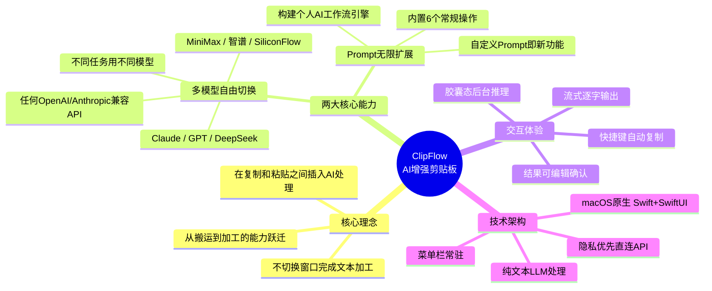
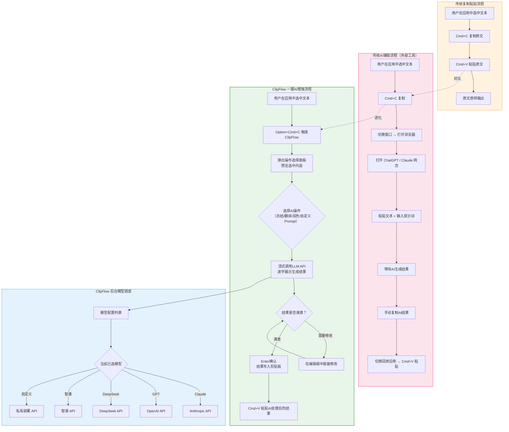

---
tags:
  - tech-article
  - AI
  - Agent
  - ClipFlow
  - 剪贴板
  - Prompt
  - 多模型
  - 人机协作
created: 2026-06-15
category: 技术文章/AI
aliases:
  - ClipFlow
  - 复制粘贴进化
  - 贾维斯
---

# 剪贴板 AI 增强：人与 Agent 协作的复制粘贴进化

> **一句话总结**: 本文介绍了一款 macOS 原生 AI 增强剪贴板工具 ClipFlow，核心思想是在传统「复制→粘贴」之间插入一层 AI 处理，让用户不离开当前窗口即可调用任意 LLM 模型完成总结、翻译、润色等文本加工，并通过可无限扩展的自定义 Prompt 将剪贴板打造成个人专属的 AI 工作流引擎，是「人与 AI Agent 协同工作」在操作系统交互层面的一次落地实践。

> **前置知识检查**:
> - [ ] 了解 LLM 大语言模型的基本概念（API 调用、Prompt 系统提示词）
> - [ ] 了解 macOS 基本操作（快捷键、菜单栏应用、隐私与安全性设置）
> - [ ] 了解剪贴板（Clipboard）的工作机制
> - [ ] 了解 AI Coding / Vibe Coding 的基本概念
> - [x] 如果你已经用过 ChatGPT、Claude 等 AI 工具处理文本，本文的理解门槛会更低

## 原文

> **作者**: 京东零售 刘侃
> **来源**: [微信公众平台](https://mp.weixin.qq.com/s/skdvjdQ1UCl-0EhtKuMElA)

---

### 背景

最近到处都是「AI Coding」，AI 正在深刻改变我们的工作方式和合作模式。本文作者分享了自己 Vibe Coding 的一个小应用：**ClipFlow** —— 一款给复制操作加上大脑、让 AI 重构操作习惯的 macOS 工具。

> 注意：本应用为作者本地编译构建，非 App Store 商店应用。

### 它解决什么问题

传统的 Cmd+C / Cmd+V 只是搬运文字。你复制一段会议纪要，粘贴出来还是那段会议纪要。想要总结、翻译、提取要点，你得：打开浏览器 → 找到 ChatGPT → 粘贴进去 → 等结果 → 再复制回来。

ClipFlow 把这个流程压缩成一步：**选中文本 → Option+Cmd+C → 选择 AI 操作 → 结果自动进剪贴板**。不切换窗口，不打开浏览器，不手动粘贴提示词。AI 处理完的结果直接覆盖剪贴板，你只需要 Cmd+V 粘贴。

### 核心概念

| 传统复制粘贴 | ClipFlow |
|---|---|
| 选中 → Cmd+C → Cmd+V → 原文 | 选中 → Option+Cmd+C → 选择 AI 操作 → Cmd+V → AI 处理后的结果 |

ClipFlow 在「复制」和「粘贴」之间插入了一层 AI 处理。你仍然在用剪贴板，但剪贴板里的内容已经被 AI 加工过了。

### 两大核心能力

#### 1. 多模型自由切换，一个工具驾驭多数常见 AI

ClipFlow 不绑定任何单一 AI 供应商。你可以同时配置 **Anthropic Claude、OpenAI GPT、DeepSeek、MiniMax、月之暗面、智谱、SiliconFlow**，甚至任何兼容 OpenAI/Anthropic 协议的私有部署模型——全部保存在统一的模型列表中。

**实时切换，即刻生效。** 在设置面板中点击一下，当前使用的模型立即切换，无需重启、无需重新配置、无需等待。上一秒用 Claude 写正式邮件，下一秒切到 GPT 翻译技术文档，再下一秒换成 DeepSeek 分析代码——每个模型的特长都在你指尖，一键调度。

你可以为不同场景准备不同的模型：用最强的模型处理复杂推理，用最快的模型做简单翻译，用最便宜的模型做日常润色。所有 AI 的能力叠加成你的能力。

#### 2. 无限扩展的 Prompt 功能库，把任何想法变成一键操作

ClipFlow 内置了 6 个常规操作（总结、要点、方案、翻译、改写、润色），但这只是起点。

**真正的力量在于你可以无限添加自己的 Prompt。** 打开设置 → Prompt 面板，写一条系统提示词，它就会出现在 Option+Cmd+C 的操作列表中。每一个 Prompt 都是一个全新的功能——你不是在用一个工具，你是在构建一个专属于你的 AI 工作流引擎。

自定义 Prompt 场景示例：
- 「生成周报」—— 选中本周工作记录，一键生成结构化周报
- 「转为 SQL」—— 选中自然语言描述，直接输出可执行的 SQL
- 「代码审查」—— 选中一段代码，获得专业的 review 意见
- 「客户回复」—— 选中客户问题，生成得体的回复
- 「会议纪要」—— 选中对话记录，提取决策和行动项
- 「论文摘要」—— 选中学术文本，输出规范的中英文摘要

你能想到的任何文本处理需求，写一条 Prompt 就能变成一键操作。功能数量没有上限，场景覆盖没有边界。

### 与传统剪贴板的对比

| 场景 | 传统 Cmd+C | ClipFlow Option+Cmd+C |
|---|---|---|
| 复制内容 | 原文 | 原文 |
| 粘贴内容 | 原文 | AI 处理后的结果 |
| 总结一篇文章 | 复制 → 打开 AI → 粘贴 → 写提示词 → 等 → 复制结果 | Option+Cmd+C → 选「简洁总结」→ Enter |
| 翻译一段话 | 复制 → 打开翻译工具 → 粘贴 → 等 → 复制结果 | Option+Cmd+C → 选「翻译为中文」→ Enter |
| 提取要点 | 复制 → 打开 AI → 粘贴 → 写提示词 → 等 → 复制结果 | Option+Cmd+C → 选「详细要点」→ Enter |
| 操作步骤 | 5-6 步，切换多个窗口 | 3 步，不离开当前窗口 |

### 内置操作

| 操作 | 输入 | 输出 |
|---|---|---|
| 简洁总结 | 一篇长文 | 2-4 句核心观点 |
| 详细要点 | 一段材料 | 3-6 条结构化要点 |
| 解决方案 | 一个问题描述 | 分步骤的可执行方案 |
| 翻译为中文 | 外语文本 | 自然流畅的中文翻译 |
| 改写为正式语气 | 口语化文字 | 书面化表达 |
| 润色错别字 | 有错别字的文本 | 修正后的全文 |

### 快捷键

| 快捷键 | 功能 |
|---|---|
| Option+Cmd+C | 触发 ClipFlow（自动复制选中内容） |
| ↑ ↓ | 切换操作 |
| Enter | 确认（选择操作 / 复制结果） |
| Cmd+Enter | 编辑框内换行 |
| Esc | 取消 |

取消操作说明：AI 生成过程中点击面板外，窗口会收缩为胶囊态（推理继续进行），双击胶囊可展开回全尺寸继续查看，推理完成后自动展开结果；任何时候按 Esc 均可取消操作。

### 技术特点

- **macOS 原生应用**：Swift + SwiftUI，菜单栏常驻，无 Electron
- **纯文本 LLM**：当前仅支持大语言模型的文本处理能力，不支持多模态模型，对富文本支持有限
- **流式输出**：AI 结果逐字显示，思考过程实时可见并可折叠
- **多模型管理**：保存任意数量的模型配置，一键切换即刻生效，不同任务用不同模型
- **多供应商支持**：Anthropic、OpenAI、DeepSeek、MiniMax、月之暗面、智谱、SiliconFlow，也支持任意 OpenAI/Anthropic 兼容 API
- **中英双语界面**：在设置中切换中文/英文，界面即时切换，内置 Prompt 同步切换语言
- **Prompt 无限扩展**：内置 6 个操作，支持添加任意数量的自定义 Prompt，每个 Prompt 就是一个新功能
- **URL 自动补全**：填入 API 基础地址，自动拼接协议路径
- **结果可编辑**：AI 输出后可直接修改，满意后再确认
- **无需浏览器**：无需登录，无需订阅（自带 API Key）
- **隐私优先**：文本直接发送到你配置的 API，不经过第三方中转

### 已测试模型

| 供应商 / 来源 | 模型 | 协议 |
|---|---|---|
| 京东云（Anthropic 代理） | Claude Opus 4.6 | Anthropic |
| 本地代理 | Claude Opus 4.7 | Anthropic |
| MiniMax | MiniMax-M2.7 | Anthropic |
| 智谱 AI | GLM-4.5-Air | OpenAI |
| OpenAI | GPT-4o | OpenAI |

其他供应商（DeepSeek、月之暗面、SiliconFlow 等）暂未覆盖测试，理论上兼容 OpenAI/Anthropic 协议的模型均可使用。

### 安装与系统要求

**从 DMG 安装步骤：**
1. 下载最新的 `ClipFlow.dmg`
2. 打开 DMG，将 ClipFlow 拖入 Applications
3. （可选）移除系统隔离标记：`sudo xattr -cr /Applications/ClipFlow.app`
4. 如果仍提示无法打开，前往 系统设置 → 隐私与安全性 → 仍要打开
5. 在 系统设置 → 隐私与安全性 → 辅助功能 中授权 ClipFlow
6. 点击菜单栏图标 → 设置 → 配置模型

**系统要求：**
- macOS 13.0 (Ventura) 或更高版本
- Apple Silicon（M1 / M2 / M3 / M4 系列）
- 不支持 Intel Mac（当前仅编译 arm64 架构）

**运行依赖：**
| 依赖 | 说明 |
|---|---|
| 辅助功能权限 | 必须授权，用于模拟 Cmd+C 按键复制选中文本 |
| 网络连接 | 仅在使用 AI 功能时需要，连接用户自行配置的 LLM API 端点 |
| Gatekeeper 绕过 | 未经 Apple 签名，安装后需执行 `xattr -cr` |

### 核心功能面板展示

1. **操作选择面板**：按下 Option+Cmd+C 后弹出，预览选中内容，选择 AI 操作
2. **AI 流式生成**：选择操作后，AI 结果逐字输出，思考过程实时可见
3. **结果编辑确认**：生成完毕后可直接编辑，Enter 确认复制到剪贴板
4. **复制完成动效**：确认后随机展示一种科技风主题动效
5. **多模型管理**：保存多个模型配置，一键切换当前使用的 AI
6. **Prompt 预设管理**：自定义 AI 操作，完全控制系统提示词，无限扩展功能场景

### 版本历史

- v5 — HUD 窗口跟随鼠标弹出、自由拖动、推理中收缩为胶囊、点击外部行为优化
- v4 — 中英文语言切换、内置 Prompt 双语支持
- v3 — 多模型配置列表、自定义图标、思考过程展示、滚动修复、多项 Bug 修复
- v2 — 完成动效、面板稳定性、UI 优化、Prompt 去 AI 味
- v1 — 首个正式版本：供应商搜索、UI 重设计、DMG 打包

---

## 核心概念脑图

## 与你已有知识的关联

本文与你的知识库中存在多处可关联的内容：

**《[[个人学习/LLM大模型类相关知识/AI Agent系列｜深入解析Function Calling、MCP和Skills的本质差异与最佳实践|AI Agent系列]]》**：ClipFlow 本质上是将 Agent 能力嵌入操作系统交互层的一种实践——通过剪贴板将 AI 能力注入工作流，是一种极简化的 Agent 交互模式。

**《[[个人学习/LLM大模型类相关知识/Skills：从编程工具的配角到Agent研发的核心|Skills核心]]》**：ClipFlow 的自定义 Prompt 本质上就是 Skills 的雏形——每个 Prompt 是独立的能力单元，可随意组合调用，在 OS 交互层面，Prompt 本身就是轻量级 Skill。

**《[[个人学习/LLM大模型类相关知识/如何构建和调优高可用性的Agent？浅谈阿里云服务领域Agent构建的方法论|高可用性Agent]]》**：ClipFlow 的多模型路由策略（不同任务用不同模型），与高可用性 Agent 方法论中的"模型选择"策略异曲同工。

**《[[个人学习/LLM大模型类相关知识/企业级 Agent 多智能体架构与选型指南|企业级多智能体]]》**：ClipFlow 可作为企业级 Agent 架构中"人机交互层"的参考实现——在用户操作系统的剪贴板层面嵌入 AI 能力。

**《[[个人学习/LLM大模型类相关知识/优秀的Prompt提示词参考|Prompt参考]]》**：ClipFlow 的 Prompt 模板功能与 Prompt 提示词设计理念直接相关，是对"好的 Prompt 应该被复用"理念的产品化实践。

## 重难点理解

### 1. 为什么「在剪贴板上做文章」是一步妙棋？

**通俗解释**：剪贴板是操作系统中最基础的「数据搬运工」，所有应用都依赖它来传递信息。ClipFlow 选择在剪贴板环节拦截并加工数据，相当于在「所有应用的公共通道」上安装了一个 AI 处理器。这意味着你不需要为每个应用（Word、浏览器、IDE、邮件客户端……）分别集成 AI 功能——一次集成，所有应用都受益。这比「在每个应用里塞一个 AI 按钮」要优雅得多。

### 2. Prompt 为什么能成为「新功能」？

**通俗解释**：传统软件的功能是通过代码实现的，加一个功能就要写代码、编译、发布。但在 LLM 时代，Prompt 就是「用自然语言写的程序」。一条好的 Prompt 定义清楚了「输入什么、怎么处理、输出什么」，LLM 充当了「Prompt 的执行引擎」。ClipFlow 把这种能力暴露给了普通用户——你不需要写代码，只需要写一段描述你想要的效果的文字，就能「创造」一个新功能。这是软件开发范式的一次重大转变。

### 3. 多模型切换的真正价值是什么？

**通俗解释**：没有人能用一把螺丝刀修所有的东西。同理，没有一个 LLM 模型在所有任务上都最优。Claude 擅长长文写作和推理，GPT 在代码和结构化输出上很强，DeepSeek 性价比高，MiniMax 在中文场景有优势……ClipFlow 让你可以像切换工具一样切换模型，对翻译任务用翻译最好的模型，对代码审查用代码最强的模型。这不只是「支持多种模型」，而是「为每个任务匹配最优模型」的工作方式升级。

### 4. 纯文本 LLM 的局限与取舍

**通俗解释**：ClipFlow 目前只支持纯文本处理，不支持图片、多模态。这不是技术做不到，而是一种刻意的「功能边界」。剪贴板里最常见的就是文本（一段话、一段代码、一个链接），把这些场景吃透比做一个「什么都能干但什么都不精」的工具更有价值。这也符合「做减法」的产品哲学——有时候限制不是弱点，而是聚焦。

### 5. macOS 辅助功能权限——原生应用的门槛

**通俗解释**：ClipFlow 需要「辅助功能」权限来模拟 Cmd+C 按键，这是 macOS 安全模型的必然要求。这个设计揭示了一个有趣的事实：**越接近 OS 底层的 AI 集成，越需要越过安全权限的藩篱**。这也是为什么很多 AI 工具选择 Web 或 Electron 方案——它们在沙箱里运行，权限少但安全。ClipFlow 选择了原生方案，代价是安装配置更复杂（需要手动绕过 Gatekeeper、授权辅助功能），但换来的是更深度的系统集成体验。

## 原文内容流程图

## 经验

### 1. 好的 AI 工具应该「隐身」

ClipFlow 的设计哲学是让 AI 处理发生在用户看不到的地方。用户不需要「使用 AI」这个意识动作——他们只是在复制粘贴，只不过粘贴出来的结果变聪明了。**最好的 AI 体验是让用户感觉不到自己在用 AI。** 这比那些需要专门打开一个窗口、登录一个账号、输入提示词的「AI 功能」要自然得多。

### 2. Prompt 是新时代的「功能单元」

在传统软件开发中，一个功能 = 一段代码。在 AI 增强时代，一个功能 = 一段 Prompt。ClipFlow 的设计证明了：**把 Prompt 当作一等公民来管理（增删改查、排序、切换），本身就是一种产品设计范式**。未来可能会有专门的「Prompt 包管理器」出现，就像 npm 管理代码包一样。

### 3. 模型多样性是刚需，不是噱头

不同模型在不同任务上的表现差异显著。ClipFlow 的多模型切换不是「为了支持而支持」，而是**工作流优化的实际需要**。这个经验告诉我们：在设计 AI 工具时，不要把模型绑定死，要给用户选择的自由。模型会快速迭代，但「切换模型的能力」是长期存在的需求。

### 4. 隐私 = 信任，尤其在企业场景

ClipFlow 强调「文本直接发送到你配置的 API，不经过第三方中转」，这不是技术细节，而是信任基础。在企业环境中使用 AI 工具，数据流向是决策者最关心的问题之一。直连 API 的架构在隐私合规上比「通过中间服务器转发」的方案更有优势。

### 5. macOS 原生 vs 跨平台框架的取舍

作者选择了 Swift + SwiftUI，放弃了 Electron。代价是只支持 macOS 且只支持 Apple Silicon，但换来的是：低内存占用、原生动画流畅度、菜单栏常驻、深层系统集成（辅助功能权限）。**做个人工具时，深度 > 广度往往更正确。** 先在一个平台上做到极致，比在所有平台上做得平庸更有价值。

## 知识

### 知识点卡片 1：AI 增强剪贴板的架构模式

**概念**: 在操作系统剪贴板的数据流通路径上插入 AI 处理层，实现「复制即加工」。

**关键设计**:
- 拦截层：通过辅助功能权限模拟 Cmd+C 捕获选中文本
- 处理层：将文本发送给用户配置的 LLM API，附带预设 Prompt
- 注入层：将 AI 返回结果覆盖剪贴板，用户粘贴时得到加工后的内容

**适用场景**: 任何需要频繁进行文本加工的工作流（写作、翻译、代码审查、数据分析）

### 知识点卡片 2：Prompt 作产品的设计范式

**概念**: 将 Prompt 从「一次性输入」提升为「持久化的功能模块」，提供增删改查、排序、分组等管理能力。

**核心要素**:
- 系统提示词（System Prompt）：定义 AI 的角色和行为边界
- 输入变量：用户选中的文本作为动态输入
- 输出格式期望：通过 Prompt 约束输出结构
- 命名与分类：让用户可以快速识别和选择

**价值**: 让非技术用户也能「开发 AI 功能」——写 Prompt 就是写代码

### 知识点卡片 3：LLM 模型路由策略

**概念**: 根据任务类型、复杂度、成本预算动态选择最合适的 LLM 模型。

**路由维度**:
- 任务类型：翻译 → 多语言能力强的模型；代码 → 代码能力强的模型
- 复杂程度：简单任务 → 便宜/快的模型；复杂推理 → 最强模型
- 成本控制：日常润色 → 低成本模型；关键决策 → 高质量模型
- 延迟要求：实时交互 → 低延迟模型；批量处理 → 高吞吐模型

**ClipFlow 的实现**: 用户手动选择（非自动路由），但提供了「一键切换」的便捷性

### 知识点卡片 4：macOS 原生应用开发的技术栈选择

**技术栈**: Swift + SwiftUI + AppKit 混合

**关键组件**:
- SwiftUI：声明式 UI 框架，构建菜单栏面板和设置界面
- AppKit：用于菜单栏常驻（NSStatusBar）、全局快捷键注册
- KeyboardShortcuts (2.4.0)：第三方库，处理全局快捷键录制与注册
- URLSession / async/await：网络请求，调用 LLM API
- 辅助功能 API (AXUIElement)：模拟键盘事件实现自动复制

**优势**: 低内存占用（vs Electron）、原生性能和动画、深度系统集成
**代价**: 仅支持 macOS、不支持跨平台、分发受限（需手动绕过 Gatekeeper）

### 知识点卡片 5：AI 工具的用户体验设计原则

**原则总结**:

| 原则 | ClipFlow 的实现 | 反面案例 |
|---|---|---|
| 零上下文切换 | 在当前窗口浮动面板中完成所有操作 | 需要切换到浏览器打开 AI 网页 |
| 即时反馈 | 流式逐字输出，思考过程可见 | 转圈等待，不知道 AI 在干什么 |
| 可控可逆 | 结果可编辑、Esc 随时取消、胶囊态后台推理 | 结果不可修改，取消不可恢复 |
| 渐进式复杂度 | 内置 6 个操作入门，自定义 Prompt 进阶 | 上来就是满屏配置项 |
| 隐私透明 | 直连用户自己的 API，不过第三方 | 数据经过中间服务器 |

## 可复用建议

### 1. 构建你自己的「快捷键 AI 工作流」

不需要自己写一个 ClipFlow，你可以用现有的工具组合实现类似效果：
- **macOS**: 使用 Shortcuts（快捷指令）+ 「请求输入」+ 「运行 Shell 脚本」调用 LLM API
- **Windows**: 使用 PowerToys Run + 自定义脚本调用 LLM API
- **跨平台**: 使用 Raycast（macOS）/ uTools（跨平台）的插件系统集成 AI 功能

核心思路不变：选中文本 → 快捷键触发 → AI 处理 → 结果回到剪贴板。

### 2. 设计你的 Prompt 库

ClipFlow 最有价值的思想是「Prompt 即功能」。你可以现在就开始积累你的 Prompt 库：
- **整理高频文本操作**：过去一周你复制粘贴最多的文本类型是什么？（邮件、代码、文档……）
- **为每个高频操作写一条 Prompt**：定义输入、处理逻辑、输出格式
- **验证和迭代**：实际使用 10 次以上，观察 AI 输出的质量，不断优化 Prompt
- **分类管理**：按场景（工作/学习/创作）或按类型（翻译/总结/润色）分类

### 3. 多模型策略落地

参考 ClipFlow 的多模型思路，为你的工作流建立模型选择策略：
- **任务-模型映射表**：列出你的常见任务，为每个任务指定首选模型和备选模型
- **成本意识**：计算每个模型处理 1000 token 的成本，对高频任务优先使用低成本模型
- **定期评测**：模型更新很快，每月重新评测一次各模型在你实际任务上的表现

### 4. 原生应用 vs Web 应用的选择框架

如果你要做类似的工具，以下决策框架可供参考：

选择原生应用（Swift/Kotlin/C#）如果你需要：
- 深层系统集成（剪贴板、快捷键、菜单栏、文件系统）
- 极致的性能和动画流畅度
- 离线优先的功能
- 操作系统原生 API（辅助功能、通知、Spotlight 集成）

选择 Web 技术（Electron/Tauri/WebView）如果你需要：
- 跨平台支持（macOS + Windows + Linux）
- 快速迭代和热更新
- 复用 Web 前端生态（React、UI 组件库）
- 非专业桌面开发者的技术栈

### 5. 企业场景的落地思路

ClipFlow 的设计对企业 AI 落地有以下启发：
- **私有化部署支持**：支持任意 OpenAI/Anthropic 兼容 API，意味着可以对接企业内部的私有 LLM 部署
- **数据安全**：直连 API 的架构确保企业数据不经过外部服务
- **零培训成本**：AI 能力「隐身」在剪贴板操作中，员工不需要学习新工具
- **可管控的 Prompt 库**：企业可以预置标准化的 Prompt（如「周报模板」「代码审查规范」），统一团队的输出质量

## 实施办法

### 如果你只是想体验 ClipFlow 的思路（30 分钟）

1. **下载并安装 ClipFlow**：从作者提供的 DMG 体验包安装（仅 macOS + Apple Silicon）
2. **配置一个 API Key**：建议先用 DeepSeek（便宜）或 OpenAI 的 API Key
3. **试用内置的 6 个操作**：对一段文字分别尝试「简洁总结」「翻译为中文」「润色错别字」
4. **体验多模型切换**：如果有多个 API Key，对比不同模型在同一任务上的表现差异
5. **创建一个自定义 Prompt**：想一个你日常最常做的事情（如「把口语化的微信消息转成正式邮件」），写好 Prompt 并验证效果

### 如果你想从零构建类似工具（1-2 周）

1. **技术选型**：Swift + SwiftUI（macOS 专属）或 Tauri + Rust（跨平台）
2. **核心功能 MVP**（Day 1-3）：
   - 全局快捷键监听
   - 获取选中文本（macOS 用 AXUIElement，Windows 用 UI Automation）
   - 调用 LLM API（先硬编码一个 Prompt）
   - 将结果写入剪贴板
3. **Prompt 管理**（Day 4-5）：
   - Prompt 的 CRUD 界面
   - 本地持久化（UserDefaults / SQLite）
   - 操作选择面板（浮动窗口）
4. **多模型支持**（Day 6-7）：
   - 模型配置的 CRUD
   - OpenAI 和 Anthropic 两种协议适配
   - 一键切换当前模型
5. **体验打磨**（Day 8-10）：
   - 流式输出（SSE / Stream）
   - 窗口动画和动效
   - 结果编辑功能
   - 胶囊态后台推理
6. **分发和测试**（Day 11-14）：
   - DMG 打包（macOS）或 MSI/EXE（Windows）
   - 找 3-5 个用户试用，收集反馈
   - 根据反馈迭代 Prompt 模板和交互细节

### 如果你想在企业内部推广类似方案（1-2 月规划）

1. **需求调研**（Week 1）：访谈 10-20 名不同岗位的员工，了解他们最频繁的文本操作场景
2. **Prompt 模板库建设**（Week 2-3）：为调研出的 Top 10 场景编写高质量的 Prompt 模板，内部评测
3. **技术方案评审**（Week 3-4）：评估是自研还是基于 ClipFlow 二次开发，确认数据安全和合规方案
4. **小范围试点**（Week 5-6）：在一个 5-10 人的团队中试用，收集效率提升数据（操作步骤数、耗时对比）
5. **全公司推广**（Week 7-8）：根据试点反馈优化，制定培训材料和推广计划