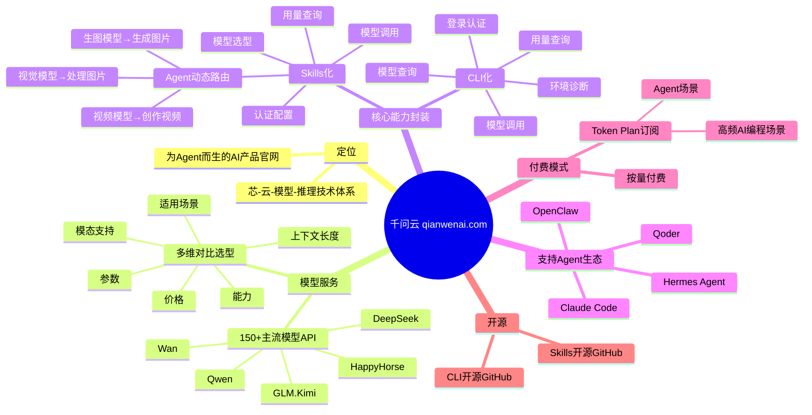
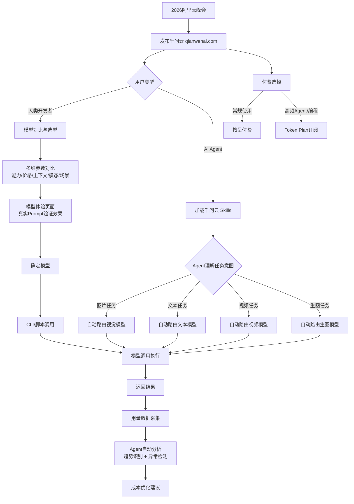

---
tags:
  - tech-article
  - AI
  - Agent
  - 千问云
  - Skills
  - CLI
  - 阿里云
  - MCP
created: 2026-06-15
category: 技术文章/AI
aliases:
  - 千问云
  - 阿里云千问云
---

# 千问云：Agent-first 模型服务 Skill 与 CLI 化

> **一句话总结**: 阿里云千问云（qianwenai.com）将模型服务从"人用的API平台"重构为"Agent用的 Skill + CLI 化平台"，让 Agent 无需写代码即可动态调用 150+ 模型，标志着模型服务平台正式进入 Agentic 时代。

> **前置知识检查**:
> - [ ] 了解 AI Agent 的基本概念（自主决策、工具调用）
> - [ ] 了解 Function Calling / Tool Use 的基本原理
> - [ ] 了解 LLM API 服务的基本形态（模型路由、token 计费）
> - [ ] 了解 CLI（命令行接口）和 Skill 在 Agent 生态中的角色
> - [ ] 对阿里云或主流大模型厂商（Qwen、DeepSeek、Kimi 等）有基本认知

## 原文

5月20日，在2026阿里云峰会上，阿里云发布为Agent而生的全新AI产品官网**"千问云"**（www.qianwenai.com），提供 Qwen、GLM、Kimi、DeepSeek、Wan、HappyHorse 等 150 多款主流模型 API，并将模型服务的核心能力封装为 **Skills** 和 **CLI 工具**，可让 Agent 工具高效地用模型和开发 AI 应用。这是面向 Agentic 时代全面升级的重要部分，当天阿里云推出了全新"芯-云-模型-推理"技术体系。

阿里云资深副总裁刘伟光表示，过去模型服务平台为人服务，未来用模型的主力将是 **Agent**，千问云正在全面重构模型服务平台，为开发者和 Agent 提供更友好的体验。

### 全面重构的模型服务平台

千问云网站从原子能力到交互逻辑实现了全面重构。UI 设计及功能模块更加简洁，在模型选择和模型调用环节，可为用户提供不同模型在**参数、能力、价格、上下文长度、模态支持、适用场景**等维度的对比信息。对比后即可直接进入模型体验页面，用真实 Prompt 或任务验证输出效果，帮助用户快速完成体验、评估和选择与业务匹配的模型。

### Skills：让 Agent "学会"调用模型

千问云秉持对 Agent 更友好的设计理念，将模型服务链路**全面 Skill 和 CLI 化**。用模型不再需要人完成阅读文档、写集成代码、调试 API 参数等繁杂工作，仅需一句指令，OpenClaw、Hermes Agent、Claude Code、Qoder 等 Agent 即可"学会"网站全部能力，并根据用户需求一键调用。

千问云 Skills 将**模型选型、模型调用、认证配置、用量查询**等完整链路能力封装，用户无需编写任何代码，Agent 即可：
- 动态路由不同模型
- 自动用视觉模型处理图片
- 用生图模型生成图片
- 用视频生成模型创作视频

### CLI：脚本化的模型服务工作流

千问云 CLI 可覆盖**登录认证、模型查询、模型调用、用量查询和环境诊断**等能力，可直接通过脚本或命令行自动化完成所有模型服务的工作流。

### 智能用量管理

基于千问云 Skills 和 CLI，Agent 可实时拉取模型用量数据，自动分析趋势、识别异常，为用户提供成本优化建议。目前，千问云 Skills 和 CLI 均已在 GitHub 开源。

### 付费模式

千问云提供**按量付费**和 **Token Plan 订阅**两种付费模式。Token Plan 适用于高频 AI 编程和 Agent 场景，可显著降低用户的 Token 成本。

## 核心概念脑图

## 与你已有知识的关联

**《[[个人学习/LLM大模型类相关知识/Skills：从编程工具的配角到Agent研发的核心|Skills核心]]》**：本文是 Skills 理念在模型服务平台的落地实践——千问云将 Skills 从编程工具概念扩展到模型调度领域。

**《[[个人学习/LLM大模型类相关知识/AI Agent系列｜深入解析Function Calling、MCP和Skills的本质差异与最佳实践|AI Agent系列]]》**：千问云 Skills 是 Skills 范式的具体产品化案例，可与 Function Calling 和 MCP 做对比理解。

**《[[个人学习/LLM大模型类相关知识/AgentSkillsTeams 架构演进过程及技术选型之道|AgentSkillsTeams]]》**：千问云的 Skills + CLI 架构可作为 AgentSkillTeam 中"模型服务层"的参考实现。

**《[[个人学习/LLM大模型类相关知识/深入理解OpenClaw技术架构与实现原理（上）|OpenClaw架构]]》**：文中明确提到 OpenClaw 可直接集成千问云 Skills，是 OpenClaw 生态的重要扩展。

**《[[个人学习/LLM大模型类相关知识/如何构建和调优高可用性的Agent？浅谈阿里云服务领域Agent构建的方法论|高可用性Agent]]》**：同属阿里云 Agent 构建体系，千问云是基础设施层，前文是方法论层。

**《[[个人学习/LLM大模型类相关知识/企业级 Agent 多智能体架构与选型指南|企业级多智能体]]》**：千问云作为模型服务中台，是企业级 Agent 架构中"模型接入层"的参考方案。

## 重难点理解

### 1. 为什么模型服务平台要从"为人服务"转向"为Agent服务"？

**通俗解释**：过去开发者调用模型 API 需要自己写代码、读文档、调试参数，这套流程是为"人"设计的。但 AI Agent 正在成为模型的主要调用者——Agent 需要自动选择合适的模型、自动处理多模态输入输出、自动管理 token 用量。如果平台接口仍然是"给人读的"API 文档和 SDK，Agent 调用效率极低。千问云的思路是把接口变成 Agent 原生可理解的形式（Skills + CLI），就像把网页从"给人看的 HTML"变成"给机器读的 API"。

### 2. Skills 化与 CLI 化的区别是什么？

**通俗解释**：Skills 是给 Agent 用的"说明书"——Agent 拿到 Skill 描述后，知道自己能做什么、怎么调用，无需写代码。CLI 是给人/脚本用的"命令行"——开发者可以在终端里一条命令完成模型查询、调用、用量分析。两者互补：Skills 面向 Agent 自动化，CLI 面向开发者手动操作和脚本编排。Skills 本质上是"Agent-friendly API"，CLI 本质上是"人类可读的命令行封装"。

### 3. Agent 如何"动态路由"不同模型？

**通俗解释**：传统做法是开发者在代码里硬编码"图片任务用 GPT-4V，文本任务用 DeepSeek"。而千问云 Skills 的做法是：Agent 理解用户意图后，根据任务类型（图片/文本/视频）自动选择最合适的模型。比如用户说"帮我分析这张图并生成一个类似的"，Agent 会自动先用视觉模型解析图片内容，再用生图模型生成新图——两次调用自动路由到不同模型，开发者无需手动编排。

### 4. Token Plan 订阅模式相比按量付费的优势在哪？

**通俗解释**：按量付费就像坐出租车，跑一公里付一公里钱。Token Plan 订阅就像买月卡——高频场景下单价更低。对于频繁调用模型的 Agent 场景（如 AI 编程、自动化工作流），Token Plan 能显著降低成本。这是云厂商针对 Agent 时代"高频、持续调用"特征设计的计费模式，暗示 Agent 将成为模型消费的主力。

### 5. "芯-云-模型-推理"技术体系意味着什么？

**通俗解释**：这不是简单的一个网站改版，而是从底层芯片到上层推理的全栈重构。阿里云的野心是打造从 IaaS（芯片/云基础设施）到 PaaS（模型服务/推理引擎）再到 SaaS（千问云 Skills/CLI）的完整 Agent 技术栈。千问云是这个体系中最靠近开发者的"最后一公里"。

## 原文内容流程图

## 经验

1. **模型服务平台的终局是 Agent-native 接口**：传统 API + SDK 模式终将被 Skills + CLI 模式取代，因为未来模型调用的主力是 Agent 而非人类开发者。谁先完成这个转型，谁就能抢占 Agent 时代的平台入口。

2. **Skills 是连接 Agent 与云服务的"通用语言"**：不是简单的 API 封装，而是让 Agent 能"理解"和"自主决策"的服务描述。千问云的做法证明，Skills 不应只是编程助手的工具，而应成为所有云服务的标准接口。

3. **多模型路由是 Agent 的刚需，不应由开发者硬编码**：Agent 场景天然需要动态模型选择——视觉、文本、视频、语音等不同模态的任务需要不同模型。平台侧提供统一的动态路由能力，能大幅降低 Agent 开发复杂度。

4. **开源 Skills 和 CLI 是生态建设的关键策略**：千问云选择将 Skills 和 CLI 开源到 GitHub，意味着任何 Agent（OpenClaw、Claude Code 等）都可以直接集成，不需要厂商适配。这是一种"以开放换生态"的策略。

5. **Token Plan 订阅模式是 Agent 消费的必然产物**：Agent 的模型调用频率远超人类用户，按量付费经济性不足。Token Plan 订阅不仅降低用户成本，也是云厂商锁定高频 Agent 流量的商业手段。

## 知识

- **知识点：千问云核心定位** — 阿里云面向 Agentic 时代推出的 AI 产品官网，提供 150+ 主流模型 API，核心理念是将模型服务从"为人服务"重构为"为 Agent 服务"。
- **知识点：Skills 化模型服务** — 将模型选型、调用、认证、用量管理封装为 Agent 可理解的 Skill 描述，Agent 加载后即可自主完成模型调用全链路，无需开发者写集成代码。
- **知识点：CLI 化模型服务** — 将登录认证、模型查询、模型调用、用量查询、环境诊断封装为命令行工具，支持脚本化和自动化工作流。
- **知识点：Agent 动态模型路由** — Agent 根据任务类型（视觉/文本/视频/生图）自动选择最合适的模型，无需开发者在代码中硬编码模型选择逻辑。
- **知识点：Token Plan 订阅** — 面向高频 AI 编程和 Agent 场景的订阅付费模式，相比按量付费可显著降低 token 成本。
- **知识点：芯-云-模型-推理全栈体系** — 阿里云从底层芯片（芯）到云基础设施（云）到模型服务（模型）到推理引擎（推理）的全栈重构，千问云是其中最靠近应用层的产品。

## 可复用建议

1. **评估自己的 Agent 项目是否适合迁移到千问云**：如果项目中 Agent 需要同时调用多个不同模型（文本 + 视觉 + 生图等），千问云的 Skills + 动态路由可以大幅简化架构。评估维度包括：模型种类、调用频率、当前 API 集成复杂度。

2. **在你的 Agent 框架中尝试集成 Skills 模式**：即使不直接用千问云，也可以学习其"Skills 描述 + Agent 自主调用"的设计思路。将你的内部服务封装为 Agent 可理解的 Skill 格式，提升 Agent 的自主性。

3. **关注 Token Plan 订阅模式，优化高频场景成本**：如果团队有高频 AI 编程或持续运行的 Agent 工作流，对比按量付费和 Token Plan 的成本差异，选择合适的计费模式。

4. **将 CLI 工具纳入自动化工作流**：即使 Agent 还不成熟，CLI 化的模型服务也能立即提高开发效率——将模型查询、调用、用量分析等操作脚本化，减少手动操作。

5. **持续关注千问云 Skills 开源仓库**：千问云 Skills 和 CLI 已在 GitHub 开源，可研究其实现方式，作为自己设计 Agent-friendly API 的参考。

## 实施办法

1. **第一阶段：了解与评估（1-2 天）**
   - 访问千问云官网（www.qianwenai.com），体验模型对比与选型功能。
   - 对比千问云上的模型与当前项目使用的模型在价格、能力、上下文长度上的差异。
   - 阅读千问云 Skills 和 CLI 的 GitHub 开源仓库，了解其接口设计和实现方式。

2. **第二阶段：CLI 集成试点（2-3 天）**
   - 安装千问云 CLI 工具，完成登录认证配置。
   - 编写脚本实现模型查询、调用、用量查询的自动化。
   - 对比 CLI 调用与原有 API 调用的效率和便捷性差异。

3. **第三阶段：Skills 集成试点（3-5 天）**
   - 选择一个已有的 Agent 项目（如基于 Claude Code 或 OpenClaw 的项目）。
   - 集成千问云 Skills，让 Agent 能够动态选择和调用模型。
   - 测试 Agent 在多模态任务（图片 + 文本 + 生图）中的动态路由效果。

4. **第四阶段：全面切换与成本优化（1-2 周）**
   - 将项目中频繁调用的模型切换到千问云。
   - 根据调用频率评估是否需要切换为 Token Plan 订阅。
   - 启用 Agent 自动用量分析功能，建立成本监控和优化机制。