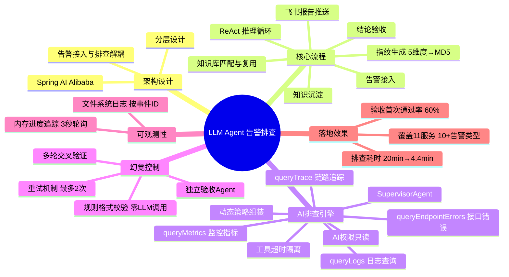
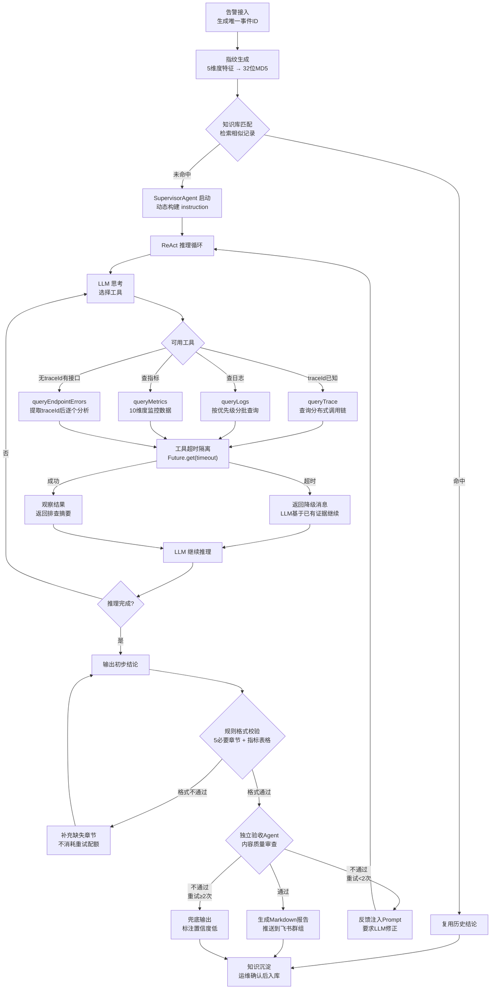

# 告警排查 Agent：得物 LLM Agent 重构告警流程

> **原文链接**: https://mp.weixin.qq.com/s/AZ-np48XJLM1QO5NJ_YiVA

> **原标题**: 用 LLM Agent 重构告警排查流程｜得物技术
> **一句话总结**: 得物技术团队用 Spring AI Alibaba 的 ReAct Agent 构建了 Troubleshooter 系统，将告警排查从人工多平台切换的 20 分钟降至 AI 自动化的 4.4 分钟，覆盖 11 个服务和 10+ 种告警类型，核心在于 SupervisorAgent 编排四个排查工具 + 独立 Validation Agent 验收 + 多维度幻觉控制。
> **前置知识检查**: - [ ] 了解 ReAct Agent 推理循环（思考→行动→观察→结论） - [ ] 了解 Spring AI Alibaba 框架基本概念 - [ ] 了解 APM、链路追踪、日志平台等运维工具 - [ ] 了解 Function Calling / Tool 机制

## 原文

### 一、引言

告警来了，第一反应是打开日志平台搜关键词，切到 APM 看监控曲线，再去链路追踪系统找 trace 详情。三个平台来回切换，最后发现只是上游 GC 抖动导致的瞬间超时，一分钟后就自愈了。

这类告警排查通常需要 10~30 分钟，主要耗时不在分析本身，而在于频繁登录不同平台、拼凑分散的数据。此外，排查效率高度依赖个人经验，新人面对告警往往不知道该先看什么。

于是得物技术团队做了 **Troubleshooter**——用 LLM Agent 自动完成告警的数据采集、根因分析和处置建议生成。上线后，中位数排查耗时从 20 分钟左右降到 4.4 分钟，覆盖了 11 个服务和 10+ 种告警类型。

### 二、架构设计

整体采用**分层设计**，核心原则是告警接入与排查执行解耦——接入层只负责接收和持久化，排查由独立的调度器异步触发。

**技术栈**：Spring AI Alibaba 作为 Agent 框架，选择它而不是自建 ReAct 循环，主要原因是框架已内置推理循环、工具拦截器、模型拦截器，开箱可用。

### 三、核心流程

完整排查链路分为七个步骤：

1. **告警接入**：接收告警数据，生成唯一事件 ID
2. **指纹生成**：提取 5 维度特征（服务名、告警类型、错误模式、指标名、错误摘要），生成 32 位 MD5 指纹
3. **知识匹配**：在知识库中检索相似记录，匹配成功则直接复用历史结论
4. **AI 排查**：Supervisor Agent 编排排查，执行 ReAct 推理循环
5. **结论验收**：独立 Validation Agent 检查根因明确性和处置建议完整性
6. **报告推送**：生成 Markdown 格式报告，推送到飞书群组
7. **知识沉淀**：运维确认后的结论存入知识库

### 四、AI 排查引擎：ReAct Agent 实战

这是整个系统最核心的部分，使用 Spring AI Alibaba 的 ReactAgent，实现经典 ReAct 推理循环：

`LLM 思考 → 选择工具 → 执行工具 → 观察结果 → 继续思考 → ... → 输出结论`

#### 1. SupervisorAgent：不是简单地调 Prompt

很多人以为「AI 排查」就是构造一个 Prompt 丢给大模型。但实际中，LLM 无法凭空知道服务当前 QPS、错误日志内容、调用链哪个环节超时——它需要工具。

SupervisorAgent 核心设计：
- 四个 `@Tool` 方法暴露给 ReactAgent 框架
- 动态构建 instruction（策略匹配 or 兜底策略）
- 验收循环：最多 2 次 LLM 内容重试，验收不通过时将反馈注入 prompt 要求修正

```java
@Component
public class SupervisorAgent {
    @Tool(description = "查询并分析应用日志，返回排查摘要")
    public String queryLogs(String serviceName, Integer minutes, ...) { ... }

    @Tool(description = "查询服务监控指标（QPS/RT/错误率/CPU/内存/GC）")
    public String queryMetrics(String serviceName, String metricTypes, ...) { ... }

    @Tool(description = "通过 traceId 查询分布式调用链详情")
    public String queryTrace(String traceId) { ... }

    @Tool(description = "无 traceId 时，通过接口路径查询错误日志并提取 traceId")
    public String queryEndpointErrors(String serviceName, String endpoint, ...) { ... }

    public InvestigationResult investigate(TroubleEvent event) {
        String dynamicInstruction = buildDynamicInstruction(event);
        ReactAgent agent = ReactAgent.builder()
                .name("supervisor")
                .model(selectedModel)
                .systemPrompt(dynamicInstruction)
                .methodTools(this)
                .build();

        for (int attempt = 0; attempt <= maxRetries + 2; attempt++) {
            AssistantMessage response = agent.call(currentPrompt);
            ValidationResult validation = conclusionValidationAgent
                    .validate(responseText, metricsQueried, eventId);
            if (validation.isPassed()) break;
            currentPrompt = buildRetryPrompt(feedback, responseText);
        }
        return InvestigationResult.complete(responseText, suggestion);
    }
}
```

#### 2. 四个排查工具的设计哲学

**工具一：queryLogs——日志查询与分析**
日志是排查的第一入口。通过 WebSocket 连接日志平台，按优先级分批查询：`traceId > exceptionName > endpoint > keywords`。每批结果经过 LLM 异步分析，最后汇总所有批次结论。另有 LogDeduplicator 防止同一请求的多条日志重复占据分析窗口。

**工具二：queryMetrics——监控指标查询**
支持 10 个维度的指标查询：qps, rt, errorRate, containerCpu, containerMemory, percentileRt, gcCount, gcRt, qpstop10, rttop10。LLM 可以根据告警类型自主决定查询哪些维度。MetricService 接口为不同环境（csprd/oa/pre/t1）提供了可插拔的实现。

**工具三：queryTrace——分布式链路追踪**
当告警带有 traceId 时，直接查询 APM 获取 Span 树，渲染为格式化文本后交给 LLM 分析，识别哪个下游依赖变慢、哪个环节抛出异常。

**工具四：queryEndpointErrors——接口错误排查**
无 traceId 但有明确接口路径时，查询该接口的错误日志，通过正则提取所有 traceId，再逐个分析。重要防护逻辑：endpoint 为根路径 "/" 时拒绝执行。

#### 3. 动态策略组装

不同服务、不同告警类型的排查思路差异很大。按 `(service_name, alert_type)` 从数据库精确匹配排查策略，未匹配时使用内置兜底策略。运维人员可通过前端页面在线编辑策略内容，无需改代码。

```
instruction = ROLE + strategy(service_name, alert_type) + OUTPUT_FORMAT
```

#### 4. 工具超时隔离

外部系统不一定稳定。每个工具调用通过 ToolExecutor 包装，用独立线程池 + `Future.get(timeout)` 实现超时控制。超时时返回降级消息（如"指标查询超时，继续使用已有信息进行排查"），LLM 基于已有证据继续推进，不因单个工具超时导致整个排查流程中断。

#### 5. AI 权限安全保证

排查 Agent 仅拥有只读权限，不涉及任何变更操作（修改配置、重启服务、回滚代码等）。所有优化建议仅为文本输出，需人工二次确认后方可执行。

### 五、幻觉控制与结论质量保障

LLM 输出不稳定是落地过程中最大的风险点，从四个维度构建幻觉控制体系：

1. **规则格式校验（零 LLM 调用）**：直接检查 5 个必要章节是否存在、指标表格格式是否规范，毫秒级完成
2. **独立验收 Agent**：检查结论是否明确、核心判定是否合理、根因是否有工具证据、建议是否可执行
3. **多轮交叉验证**：queryLogs 与 queryTrace 交叉、queryLogs 与 queryMetrics 交叉、时间线一致性校验
4. **重试机制**：格式问题不消耗重试配额；内容问题最多重试 2 次；验收 Agent 异常时宽容通过

### 六、排查过程可观测性

排查过程不能是黑盒。每次排查在文件系统中创建独立目录（按事件 ID），LoggerInterceptor 和 ToolInterceptor 记录所有 LLM 输入/输出和工具调用/返回：

```
logs/evt-20260514153012345-001/
├── raw_alert.txt
├── 00_RECEIVED.log
├── 01_INVESTIGATION_START.log
├── 03_LLM_SYSTEM_PROMPT.log
├── 04_LLM_USER_PROMPT.log
├── 05_LLM_CALL_1.log
├── 06_工具调用：日志分析.log
├── 07_LLM_CALL_2.log
├── 08_工具调用：指标查询.log
├── 09_LLM_FINAL_RESPONSE.log
├── 10_VALIDATION_START.log
├── 11_VALIDATION_PASS.log
└── 12_CONCLUSION.log
```

EventProgressTracker 在内存中维护每个事件的实时状态（当前阶段、当前策略描述），前端通过 3 秒轮询获取进度更新。

### 七、真实排查案例：效率网关超时

告警信息：
- 服务名：效率网关
- 告警类型：效率网关业务应用 30s 内接口异常告警
- 错误信息：效率网关业务应用 30s 内接口异常告警，持续 0 分钟
- 严重级别：P4
- 环境：生产环境
- 接口路径：/xxxx-admin/daemon/api/xxxx/xxxx/list
- TraceID：无
- 告警时间：2026-04-23 18:10:36

**AI 排查过程**：SupervisorAgent 在 4 分钟内完成 3 次工具调用 + 1 轮验收修正。第 1 次验收未通过（缺失必填字段），第 2 次验收通过。

**AI 最终排查结论**：
- **根因**：舆情管理端接口在处理 `upgrade_quality_status IN (0,1,2,3,5)` 多条件过滤 + 分页查询时，底层 gorm-v2 数据库组件执行严重阻塞，耗时 29.99s，超过效率网关 30s 超时阈值，触发 TimeoutException
- **紧急程度**：观察（30 分钟内仅触发 2 次 ERROR，服务整体指标正常）
- **置信度**：高（分布式调用链完整还原了 99% 耗时集中于 gorm-v2 组件）
- **处置建议**：排查慢查询日志、确认复合索引、补充 fallback 降级、考虑异步查询

**效果对比**：整个排查约 4 分钟（工具调用 88s + LLM 推理 + 验收），人工需 10~20 分钟。

### 八、技术难点与踩过的坑

#### 1. 环境统一映射

告警信息中的环境标识五花八门：「xxprd」「生产」「XX石」「prd」「xxprd-proxy」实际都指生产环境，且日志平台和 APM 平台的环境代码还不一样。通过 EnvironmentProperties 集中管理 5 套环境的别名映射，支持精确匹配 + 包含匹配，且在 tool 方法中直接使用告警事件中的环境字段，不让 LLM 自行映射。

#### 2. LLM 调用 Round-Robin 多 Key

LLM 网关有频率限制，单个 API Key 在高频调用下会被限流。实现了 RoundRobinChatModel，支持配置多个 API Key，按事件 ID 哈希取模固定分配——同一个排查过程中的所有 LLM 调用使用同一个 Key，避免上下文切换。

### 九、效果与数据

统计周期：2026-04-21 至 2026-05-14

- **排查性能**：中位数排查耗时从约 20 分钟降至 4.4 分钟
- **结论质量**：验收首次通过率约 60%，二次通过率约 38%，验收耗尽兜底率约 2%
- **覆盖范围**：11 个服务、10+ 种告警类型

### 十、后续迭代方向

按优先级规划：
1. 多 Agent 并行排查：日志查询和指标查询可以并行执行
2. 指纹知识库：实现秒级匹配已知问题
3. 跨服务关联分析：识别级联故障
4. 自动处置能力：从「排查+建议」升级到「排查+自动修复」
5. 向量语义检索：实现语义级相似问题检索

> Troubleshooter 不是要替代运维人员，而是把「登录多个平台、切换不同入口、凭经验猜方向」这种机械操作交给 AI，让运维人员专注于需要判断力和创造力的决策。

## 核心概念脑图



## 与你已有知识的关联

**《[[个人学习/LLM大模型类相关知识/AI Agent系列｜深入解析Function Calling、MCP和Skills的本质差异与最佳实践|AI Agent系列]]》**：该文深入讲解了 ReAct Agent 中 Function Calling 的机制与 Skills 的设计哲学，本文 SupervisorAgent 的四个 @Tool 方法正是 Function Calling 在运维场景的实战应用。对比来看，该文偏重通用框架设计，本文则展示了工具如何贴合具体业务领域（日志、指标、链路、错误）进行设计。两篇文章结合阅读，可以完整理解从「为什么需要 Function Calling」到「如何在生产环境设计高可用工具」的全链路。

**《[[个人学习/LLM大模型类相关知识/企业级 Agent 多智能体架构与选型指南|企业级多智能体]]》**：该文基于阿里巴巴内部 1000+ 智能体实践经验，提出了 Supervisor 模式、单智能体优先等架构原则。本文的 SupervisorAgent + ValidationAgent 双 Agent 协作正是 Supervisor 模式的一种简化实践，验证了该文中「单智能体 + 专职验收」模式的有效性。两篇文章都基于 Spring AI Alibaba 框架，形成从架构理论到工程落地的完整参照。

**《[[个人学习/LLM大模型类相关知识/如何构建和调优高可用性的Agent？浅谈阿里云服务领域Agent构建的方法论|高可用性Agent]]》**：该文聚焦阿里云服务领域的 Agent 构建方法论，讨论了幻觉控制、工具调用稳定性等共性问题。本文的规则格式校验 + 独立验收 Agent + 多轮交叉验证 + 重试机制四层幻觉控制体系，可视为该文「高可用性」理念在运维场景的具体落地，两者在工程化思维上高度一致。

**《[[个人学习/LLM大模型类相关知识/Skills：从编程工具的配角到Agent研发的核心|Skills核心]]》**：该文重新定位 Skills 在 Agent 研发中的核心地位。本文的四个排查工具本质上就是四个面向运维领域的 Skills，动态策略组装机制更展示了 Skills 如何根据场景灵活组合。两篇文章从不同角度揭示了同一个趋势：Agent 的能力边界由其 Skills 定义，而非 Prompt 本身。

**《[[个人学习/LLM大模型类相关知识/AgentSkillsTeams 架构演进过程及技术选型之道|AgentSkillsTeams]]》**：该文探讨 Agent 团队的架构演进与技术选型。本文的 SupervisorAgent 编排多工具的思路，可视为 AgentSkillsTeams 中「Leader Agent 调度多 Skill」模式的简化版。后续迭代方向中「多 Agent 并行排查」的规划，也呼应了该文中团队协作的架构思路。

## 重难点理解

**1. ReAct Agent 推理循环 vs 传统 Workflow**
通俗解释：传统 Workflow 是「先查日志，再查指标，再查链路」的固定剧本，遇到没见过的告警类型就抓瞎。ReAct Agent 则是让 LLM 自己当导演——查完日志发现没有 traceId，它会主动决定「那我用 queryEndpointErrors 去错误日志里捞 traceId」，就像有经验的运维人员一样灵活应变。关键在于 Agent 能根据中间结果动态调整下一步行动，而不是机械执行预设流程。

**2. 动态策略组装——为什么不能只靠 Prompt**
通俗解释：OOM 告警和接口超时告警，排查思路完全不同——前者要看 GC 和堆内存，后者要看 QPS 和下游延迟。如果把所有情况都写在一个 Prompt 里，LLM 容易遗漏关键步骤。动态策略组装相当于给 Agent 准备了一本「排查剧本库」，根据 (服务名, 告警类型) 精确匹配最合适的剧本，再结合通用角色设定和输出格式要求，拼出最优的 system prompt。

**3. 独立验收 Agent——为什么要「自己审自己」**
通俗解释：LLM 输出的结论可能看起来头头是道，但仔细检查会发现根因和证据对不上（幻觉）。单独用一个 Agent 来做验收，本质是给排查加了一道「质量控制」关卡。验收 Agent 不参与排查，只负责审查——检查结论是否有据可查、建议是否可执行。验收不通过就把反馈塞回 Prompt 让 SupervisorAgent 修正，最多重试 2 次。这种「干活 + 审稿」的双 Agent 模式，是控制 LLM 输出质量的有效工程手段。

**4. 工具超时隔离——外部依赖不可靠时的兜底设计**
通俗解释：排查需要调用日志平台、APM 等外部系统，这些系统可能响应慢甚至挂掉。如果在代码里直接同步调用，一个工具卡住整个排查就中断了。ToolExecutor 的做法是：每个工具调用扔到独立线程池里，设一个超时时间（比如 30 秒），超时就返回降级消息「查不到了，你看着办」，让 LLM 基于已有证据继续推理。这就像给每个工具调用配了一个独立倒计时闹钟，响铃了就不等了。

**5. 环境统一映射——不要让 LLM 做它不擅长的事**
通俗解释：告警消息里环境字段可能是「xxprd」「生产」「XX石」——人一看就知道是生产环境，但 LLM 可能会把它们当成三个不同环境。解决思路是「确定性逻辑在代码层解决，不确定推理才交给 LLM」：在 tool 方法中直接用预配置的环境映射表做转换，不让 LLM 自行「翻译」环境名，避免 LLM 在这个环节产生低级错误。

## 原文内容流程图



## 经验

1. **Agent 框架选型优先考虑成熟方案**：自建 ReAct 循环虽然灵活，但 Spring AI Alibaba 已内置推理循环、拦截器机制，能省去大量基础设施工作。团队应把精力放在业务工具设计和幻觉控制上，而非重复造轮子。

2. **排查系统的核心不是 Prompt，是工具链**：LLM 再聪明也无法凭空知道你的服务状态。四个排查工具（日志、指标、链路、错误）覆盖了运维排查的全部数据入口，Agent 的能力上限由工具的覆盖度和可靠性决定。

3. **验收机制是生产级 Agent 的必需品**：「干活 + 审稿」的双 Agent 模式用很小的成本（一次额外 LLM 调用）换来了结论质量的显著提升。验收首次通过率仅 60% 也说明，如果没有这道关卡，40% 的排查结论可能存在质量问题。

4. **可观测性是 AI 系统信任的基础**：运维人员需要看到 AI 每一步在做什么才能建立信任。文件系统日志按事件 ID 归档 + 内存进度追踪前端的方案，成本低、效果好，是 AI 排查系统获得用户认可的关键设计。

5. **确定性逻辑放在代码层，不确定推理放在 LLM 层**：环境映射、超时控制、格式校验这些确定性逻辑在代码中处理，LLM 只负责需要推理和判断的部分（日志分析、根因推断、建议生成），各自做擅长的事。

## 知识

**ReAct Agent 推理循环**：LLM 思考 → 选择工具 → 执行工具 → 观察结果 → 继续思考 → 输出结论。与固定 Workflow 的核心区别在于 Agent 能根据中间结果动态调整下一步行动。

**Spring AI Alibaba ReactAgent**：阿里开源的 Agent 框架，内置推理循环、@Tool 注解机制、工具拦截器、模型拦截器。通过 `ReactAgent.builder().methodTools(this)` 即可将标注 @Tool 的方法暴露给 LLM 调用。

**多维度幻觉控制体系**：规则格式校验（零 LLM 调用）→ 独立验收 Agent（内容审查）→ 多轮交叉验证（工具结果互证）→ 重试机制（格式不消耗配额，内容最多 2 次）的四层递进体系。

**工具超时隔离模式**：独立线程池 + `Future.get(timeout)` + 降级消息，确保单个外部系统故障不中断整个排查流程。

**RoundRobinChatModel**：多 API Key 轮询 + 事件 ID 哈希固定分配，解决 LLM 网关频率限制问题，同时保证同一排查过程的上下文一致性。

**5 维度告警指纹**：(服务名, 告警类型, 错误模式, 指标名, 错误摘要) → 32 位 MD5，用于知识库匹配和历史结论复用。

## 可复用建议

1. **双 Agent 验收模式可直接复用**：任何一个需要 LLM 生成结构化结论的系统，都可以采用「主 Agent 干活 + 验收 Agent 审稿 + 重试修正」的模式。验收 Agent 的 Prompt 重点是检查证据链完整性和建议可执行性。

2. **工具超时隔离的线程池模式可跨场景使用**：任何依赖外部系统的 Agent 工具都建议包装超时控制，超时后返回语义化的降级消息而非异常，让 LLM 能理解和处理降级情况。

3. **动态策略组装的 instruction 拼接公式可通用**：`instruction = ROLE + strategy(业务标识, 场景类型) + OUTPUT_FORMAT`，将可变部分抽离为可配置策略，固定部分作为兜底模板。

4. **文件系统日志按事件 ID 归档**：为每次 AI 任务创建独立目录，记录完整的 prompt、工具调用、LLM 响应链路，比写入数据库更适合调试和审计。

5. **Spring AI Alibaba 的 @Tool 注解机制**：对于 Java 技术栈的 Agent 项目，直接使用 `@Tool(description = "...")` 注解将业务方法暴露给 Agent，description 的描述质量直接影响 LLM 对工具的选用准确性。

## 实施办法

1. **搭建 Agent 框架基础（1-2 天）**：引入 Spring AI Alibaba 依赖，创建 SupervisorAgent 类，用 @Tool 注解封装日志查询、指标查询、链路追踪等外部系统接口作为 Agent 工具。

2. **构建告警接入与指纹生成（1 天）**：对接现有告警系统，实现 5 维度特征提取和 MD5 指纹生成逻辑，建立告警事件的持久化存储。

3. **实现动态策略配置（1-2 天）**：设计策略表结构 `(service_name, alert_type, strategy_content)`，实现 instruction 动态拼接逻辑，提供前端策略编辑页面。

4. **接入验收 Agent（1 天）**：创建独立的 ValidationAgent，设计验收 Prompt（检查结论明确性、证据链完整性、建议可执行性），实现验收失败时的反馈注入和重试循环。

5. **添加幻觉控制与可观测性（1-2 天）**：实现规则格式校验（正则检查必要章节）、工具超时隔离（线程池 + Future.get）、文件系统日志归档和前端进度轮询。

6. **灰度上线与策略迭代（持续）**：先覆盖 2-3 个核心服务 + 3-5 种高频告警类型，收集验收不通过案例持续优化策略 Prompt，逐步扩展到更多服务和告警类型。