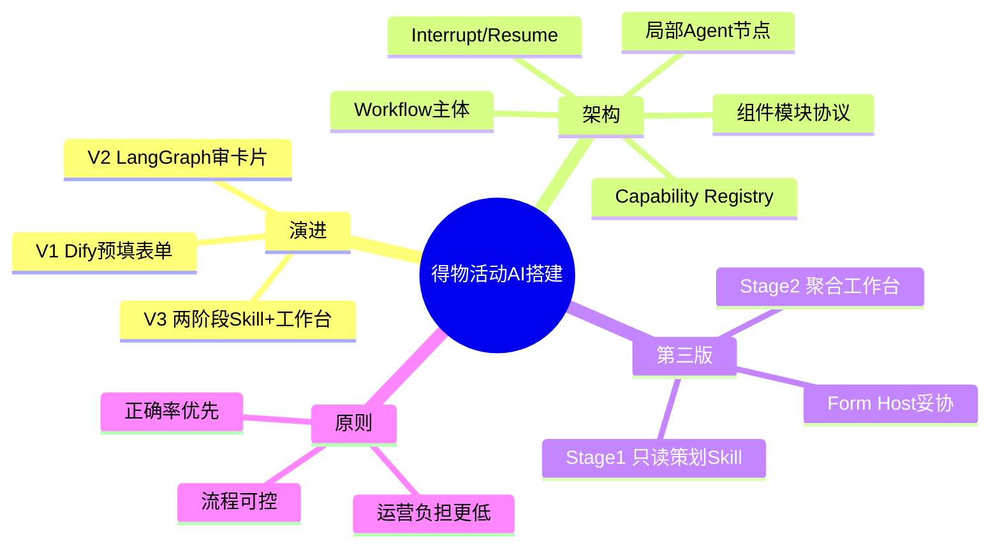
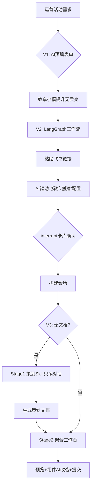

---
tags:
  - tech-article
  - AI
  - Agent
  - LangGraph
  - Harness
  - Human-in-the-loop
  - 工程化
created: 2026-06-24
category: 技术文章/AI
aliases:
  - 得物活动Agent
  - 表单到Agent
  - 会场搭建AI
---

# 得物活动 Agent：从表单到 LangGraph 的社区活动搭建实践

> **原文链接**: [微信公众号原文](https://mp.weixin.qq.com/s/hiOqwjA7Hb7LfJfJyYirnw)

> **原标题**: 从表单到 Agent：得物社区活动搭建的 AI 实践之路

> **一句话总结**: 得物社区活动搭建从「AI 预填表单」演进到 LangGraph 工作流 + 中断确认 + 两阶段 Skill/聚合工作台，核心拐点不是填字段更快，而是让 AI 成为流程主体、人只在关键节点踩刹车。

> **前置知识检查**:
> - [ ] 了解 Workflow 与 Agent 的基本区别
> - [ ] 知道 LangGraph / Human-in-the-loop 概念
> - [ ] 有运营后台或多系统表单协作经验
> - [ ] 理解副作用控制与权限分级（读/写/发布）

## 原文

**目录**

一、项目背景 · 二、第一版探索与 Agent CLI 可行性评估 · 三、第二版实现与组件模块协议 · 四、第三版设计与工程实践 · 五、架构全景 · 六、实践中的取舍 · 七、总结与展望

**一、项目背景**

一场营销活动从策划到上线，运营要在三个系统间跳转 10+ 次、填写 40+ 个字段。得物用 AI 重新设计链路——从「AI 帮你填表单」到「两阶段 Agent + 聚合工作台」。

**二、第一版：AI 帮你填表——但人还是主角**

5 步表单向导 + 两个 Dify Workflow（文档解析 + 语义匹配下拉项）。运营从「全部手填」变成「AI 预填 + 人工校验」，但范式未变：不可逆、AI 黑盒等待、组件硬编码、无持久化。

**关键认知**：若 AI 只是「帮你填字段」，永远不会质变；价值跃迁发生在 **AI 从辅助工具变成流程主体**。

Agent CLI（OpenCode/Cursor/Claude Code）被评估但暂不落地：缺业务约束体感、无法获取实时状态、操作缺审计。定位在 Anthropic Agentic 光谱中间的 **Prompt Chaining + Routing + Human-in-the-loop**。

**三、第二版：从「填表」到「审卡片」**

运营只做两件事：提供飞书策划链接 + 在中断卡片上确认微调；其余由工作流驱动。

- **Workflow vs Agent**：会场搭建可画成有限状态机 → 大框架用 Workflow；局部（改写规则文案等）用 Agent 式 LLM 调用。
- **LangGraph**：LLM 是节点内执行者，不参与路由；Checkpointer 持久化状态。
- **Interrupt/Resume**：`interrupt()` 暂停并发 payload 给前端渲染卡片，`Command(resume=value)` 恢复。

**Capability Registry**：插件式能力注册表，壳与业务解耦；已接入会场搭建、动态筛选、通用聊天。

**组件模块协议**：统一生命周期（初始化无副作用 → 构建前才写操作）；双轨注册（显式选择 + 条件注入）；声明式位置编排。

**四、第三版：从「我有文档」到「帮我写文档」**

| 范式 | 输入 | AI 角色 | 交互 |
| --- | --- | --- | --- |
| 会场搭建 | 已有策划文档 | 执行者 | 审卡片 |
| 策划生成 | 模糊想法 | 引导者 | 对话追问 |

**Stage 1 Skill**：只读不写（查预算池/类目/标签/历史会场）；渐进式披露收集「名称+时间+话题」三件套。

**Stage 2 聚合工作台**：独立页面；中栏 H5 预览 + 可点击遮罩；Form Host 复用搭建器 Formily 运行时（工程妥协）。

**五、架构全景**

**六、实践取舍**

- AI 负责提取/草稿/推荐，代码负责流程/校验/副作用时机
- 混合交互：自然语言意图 + 结构化 UI 确认 + 可视化预览
- 假进度条消耗信任；中断卡片需解释「AI 已做什么、还缺什么」

**七、总结**

- V1：AI 填字段，人仍是主角
- V2：AI 开车，人踩刹车（审卡片 + interrupt）
- V3：AI 帮写文档 + Stage2 聚合工作台

不变原则：**流程可控、正确率优先、运营负担更低**。

> **图片说明**: 原文 23 张配图位于 `assets/得物活动Agent-从表单到LangGraph的社区活动搭建实践/`，完整版含图 3–6、9–11、13–18、20、22–23 等，微信 CDN 原链可能过期。

---

## 核心概念脑图

## 与你已有知识的关联

**《[[大厂技术文章-DailyTech/文章/Loop Engineering-深度拆解概念与实践趋势|Loop Engineering]]》**：Loop 强调生成者与检查者分离；本文 interrupt 卡片 + Stage1 只读权限，是同一「Human-in-the-loop + 副作用门禁」思路在运营场景的具体化。

**《[[大厂技术文章-DailyTech/文章/业务需求专家Agent-端到端搭建指南|业务需求专家Agent]]》**：该文四层纵向闭环；本文 Stage1→Stage2 两阶段架构同样是「先理解/策划、再执行/搭建」的端到端 Agent 化路径。

**《[[大厂技术文章-DailyTech/文章/Harness工程化-五层架构与门禁阻断实践|Harness工程化]]》**：Harness 强调门禁与预算；本文组件协议「初始化无副作用、构建前才写」是 Harness 纪律在会场配置领域的落地。

**《[[大厂技术文章-DailyTech/文章/剪贴板AI增强-人与Agent协作的复制粘贴进化|人机协作]]》**：该文关注轻量协作入口；本文则展示企业级场景必须用 **结构化 UI + 工作流** 而非纯自然语言 CLI 的原因（审计、正确率、业务约束）。

**《[[大厂技术文章-DailyTech/文章/Skills-从编程工具配角到Agent研发核心|Skills核心]]》**：Stage1「活动方案生成 Skill」是 Skills 范式在运营策划场景的实例——只读工具集 + 渐进式对话引导。

## 重难点理解

- **重点/难点1**: 质变拐点 — 不是「填更快」，而是 **AI 驱动流程、人做监督**；V1 失败根源是范式仍是「人走流程、AI 辅助」。

- **重点/难点2**: Workflow vs Agent — 可画有限状态机 → Workflow；局部灵活任务 → 节点内 Agent。大多数企业生产场景是混合体。

- **重点/难点3**: Interrupt/Resume — LangGraph 把前后端交互语言标准化；6 个中断点混合 Approve/Edit/Respond 模式，是 Human-in-the-loop 的工程化表达。

- **重点/难点4**: 副作用时机 — 组件协议规定初始化只读、构建前才写；避免「打开卡片看了一眼就创建了活动数据」类脏数据 bug。

- **重点/难点5**: Stage1 只读 — 权限分级（读/写/发布）对应最小权限原则；策划与搭建分阶段降低 AI 越权风险。

## 原文内容流程图

## 经验

1. **有限状态机用 Workflow**: 步骤确定、正确率要求高 → LangGraph 而非完全自主 Agent — **应用场景**: 多系统表单、审批流、会场搭建。

2. **Capability Registry 解耦壳与场景**: 新场景只注册能力模块，不改交互壳 — **应用场景**: 同一 Agent 壳支撑多业务线。

3. **组件开闭原则**: 双轨注册 + 统一生命周期，避免 16+ 组件时改中心调度文件 — **应用场景**: 可组合配置台、页面搭建器。

4. **渐进式披露收集信息**: Stage1 先收三件套再追问，降低运营认知负担 — **应用场景**: 策划/需求澄清类对话 Agent。

5. **Form Host 务实复用**: 不重写几十个 Formily 表单，消息协议嵌入旧运行时 — **应用场景**: 新旧技术栈并存的企业系统。

## 知识

| 知识点 | 定义 | 关键要素 | 关联概念 |
|-------|------|---------|---------|
| Interrupt/Resume | 工作流在需人工输入处暂停并恢复 | payload 卡片、Command(resume) | Human-in-the-loop |
| Capability Registry | 场景 UI 能力插件注册表 | 欢迎态/中断卡片/结果展示 | 微前端 Module Federation |
| 组件模块协议 | 组件统一生命周期与注册轨道 | 初始化无副作用、双轨注册 | 开闭原则 |
| 两阶段架构 | 策划生成与会场搭建分离 | Stage1 只读、Stage2 写操作 | 最小权限 |
| Progressive Disclosure | 渐进式信息收集 UX | 三件套优先、对话追问 | Stage1 Skill |

## 可复用建议

1. **先判断范式是否该变**: 若 AI 只是预填字段，先评估是否应升级为「AI 驱动 + 人确认」— **适用场景**: 多步骤运营后台 — **预期效果**: 避免「有 AI 无质变」。

2. **大框架 Workflow + 局部 Agent**: 用 LangGraph 管路由与持久化，LLM 只在节点内做解析/文案 — **适用场景**: 高正确率企业流程 — **预期效果**: 可控性与灵活性兼得。

3. **写操作门禁**: 所有副作用推迟到用户 explicit 确认后 — **适用场景**: 任何 Agent 触达生产数据 — **预期效果**: 减少脏数据与信任损耗。

4. **策划与执行分 Stage**: 读权限 Skill 生成方案，写权限工作台执行 — **适用场景**: 运营从「无文档」起步 — **预期效果**: 降低前置文档门槛。

## 实施办法

1. **第1步**: 梳理现有流程是否「人为主体、AI 预填」——若是，评估 interrupt 工作流改造 ROI。

2. **第2步**: 用有限状态机画出步骤与确认点，选型 LangGraph（或同类）并实现 Checkpointer。

3. **第3步**: 设计 Capability Registry 与组件模块协议，把扩展点从调度中心剥离。

4. **第4步**: 若运营常无策划文档，增加 Stage1 只读 Skill + Stage2 聚合工作台。

5. **第5步**: 建立副作用审计、中断卡片解释文案、禁止假进度条等信任机制。

## 相关笔记

- [[LangGraph 企业级落地实战报告]] — 四行业落地案例、Checkpoint 部署架构、ROI 量化数据（与本文 LangGraph 实践互补）
- [[📋 LangGraph索引|LangGraph 学习索引]]
