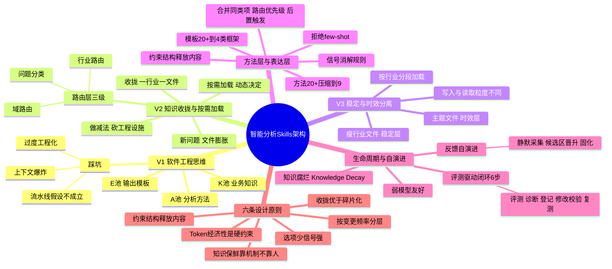

---
tags:
  - tech-article
  - AI
  - Skills
  - Agent
  - 知识架构
  - Token经济性
  - Skill设计原则
created: 2026-07-17
category: 技术文章/AI
aliases:
  - 智能分析Skills
  - Skills架构设计
  - V1到V3架构演进
  - 六条Skill设计原则
  - 知识腐烂
---

# 智能分析Skills：V1到V3架构演进与六条设计原则

> **原文链接**: https://mp.weixin.qq.com/s/mF3TyV_GzkBdoyYfK14fWQ

> **原标题**: 面向复杂业务场景的智能分析 Skills 架构设计与演进实践

> **一句话总结**: 面向本地生活几十个行业的分析类 Skill，经历 V1（软件工程分层 K/A/E 池）→ V2（知识收拢+按需加载+路由层）→ V3（稳定知识与时效知识分离）三次重构，提炼出「收拢优于碎片化、按变更频率分层、选项少信号强、约束结构释放内容、知识保鲜靠机制、Token 经济性是硬约束」六条设计原则——Skill 的能力上限不取决于模型，取决于喂给它的知识架构。

> **前置知识检查**:
> - [ ] 了解 Skill / Agent 的基本概念
> - [ ] 知道 LLM context 窗口与 token 消耗的基本概念
> - [ ] 了解 prompt 工程的基本实践
> - [ ] 可选：了解 RAG / 按需加载 / 路由分发的基本思路

## 原文

这是2026年的第 37 篇文章

（ 本文阅读时间：约 15 分钟 ）

背景
过去一个月，我们在搭建一个面向本地生活业务的分析类 Skill，让 AI 能像资深分析师一样做经营诊断、归因拆解和趋势预测。业务覆盖几十个行业，每个行业有独立的经营框架和指标体系，复杂度远超一个 prompt 能承载的范围。

搭建过程中，我们经历了三次架构重构（V1 → V2 → V3），每次都是被真实问题逼出来的。这篇文章完整复盘了这个演进过程，最终提炼为六条 Skill 架构设计原则。

如果你正在搭建领域知识密集型 Skill，或正面临「prompt 越写越长但效果越来越差」的困境，这篇文章或许能够提供一些思路。每章独立成节，可按需跳读。

01
V1：用软件工程思维设计 Skill，踩了什么坑
大部分团队搭建 Skill 的路径都类似：大 prompt → 打补丁 → 越来越长 → 没人敢改。我们绕过了大 prompt，但踩进了另一个坑，那就是用软件工程思路做分层解耦，结果过度工程化。

Skill 的能力上限不取决于模型，取决于你喂给它的知识架构。

### 设计直觉

我们面对的业务场景有几个特点：覆盖几十个行业，每个行业有独立的经营框架和指标体系；分析方法涉及归因、趋势、预测、漏斗、分层等十几种；输出形式从日报到诊断报告到决策备忘各不相同。

一个 prompt 显然装不下。所以我们很自然地借用了软件工程的经典范式：分层解耦，把 Skill 拆成三个独立的知识池：

- K 池（Knowledge）：负责管理业务知识。行业概览、规则口径、运营抓手、关键事件、外部因素，每个行业在 K 池下都有独立的子目录。

- A 池（Analysis）：负责管理分析方法。从宏观的问题定性（“这是什么类型的问题”），到中观的分析框架（“按什么维度拆解”），再到微观的具体方法（“用什么算法归因”），分成三层。

- E 池（Expression）：负责管理输出。按场景设计了 20 多个模板，从异常告警到月报到诊断报告到决策备忘全部覆盖。

层间通过标准化的接口契约通信——K 池组装好知识包给 A 池，A 池产出分析结论包给 E 池。看起来架构清晰、职责分明。

### 跑起来之后

V1 上线跑了不到两周，我们就发现了三个结构性问题：

- 上下文爆炸。一个行业的知识被打散到 K 池的多个子目录里，一次分析要跨三层拉十几个文件，context 窗口直接装不下。根因是知识碎片化，LLM 需要在一个视野内看到连贯的行业知识才能做准确推理，但 K/A/E 架构把它们分散在了几十个文件里。

- 过度工程化。层间接口契约、版本解析器、schema 校验，这些在传统软件工程中都是好实践，但 LLM 不是微服务，它不需要序列化的数据包在层间传递，它需要的是在一个 context 里看到足够的信息做推理。

- 流水线假设不成立。K→A→E 假设信息是单向流动的，但真实的分析过程是交织的。分析到一半需要补充知识，输出时发现结论要修正。流水线切断了这种交互。

认知转变

V1 让我们意识到一件事：LLM 的知识组织范式和传统软件架构根本不同。

传统软件追求模块化、接口标准化、关注点分离。这些原则在 LLM 场景下不是完全失效，而是需要重新定义“正确的分离方式”。分层的目的是让模型在需要的时候能拿到完整的上下文，这和微服务架构里「每个服务只看自己的数据」的理念正好相反。

这个认知逼出了 V2 的重构方向：知识收拢、按需加载、做减法。

02
V2：知识收拢与按需加载

### 重构原则

V2 的重构，我们围绕三条原则展开：

- 知识收拢。一个行业的知识不再分散到多个子目录，而是收拢到一个独立的文件里：业务模式、核心公式、经营框架、指标体系、诊断起点，一个文件看全貌。LLM 加载一个文件就能获得足够的行业上下文。

- 按需加载。不在启动时把所有知识全量灌入 context，我们根据用户的问题动态决定加载哪些文件。一个简单的口径问题只需要加载行业文件；一个复杂的归因分析才需要追加分析框架和方法文件。

- 做减法。砍掉接口契约、版本解析器、schema 校验等工程设施。V1 的 100 多个文件被重新组织为 40 多个结构清晰的文件。工程复杂度大幅下降。

路由层的诞生

按需加载的前提是有一个可靠的路由机制：Skill 需要先判断「用户在问什么」，再决定「加载什么知识」。

入口文件从 V1 的「三层 orchestrator」变成了单一路由入口，承担三级路由职责：

- 域路由：判断用户问的是哪个业务域。不同域有不同的分析框架和指标体系，域判断是第一步。

- 行业路由：在域内映射到具体的行业。通过关键词匹配和歧义消解规则，把用户提问映射到对应的行业知识文件。

- 问题分类：判断问题类型：“是什么”（知识类）、“为什么”（分析类）、“怎么做”（方法论类），决定加载哪些 reference 文件。

举个例子：用户问“某行业 XX 指标为什么降了”，三级路由依次命中业务域、具体行业、“分析类”问题，于是加载行业文件 + 分析框架 + 归因方法；而“XX 口径怎么定义的”只需要加载行业文件。

路由层真正有技术含量的部分是处理歧义和兜底。几十个行业的关键词不可避免地会重叠，我们的做法是：先看上下文有没有行业锚点，有就走行业路由，没有就走横向职能，还判断不了就询问用户。完全没命中时，加载通用兜底文件作答。

本质上，路由层是用路由逻辑换 context 效率，用少量路由 token 换取大幅减少无效知识加载，按需组合替代全量灌入。这是 token 经济性的第一个体现。

### 效果与新问题

V2 上线后，收拢解决了知识碎片化问题，按需加载有效控制了 context 占用。分析质量明显提升。

但只跑了一周左右，新的问题就浮现了：重构的保质期比我们想象的短得多。行业文件越写越胖。

原因很直接。收拢意味着一个行业的所有知识都包含到一个文件里。经营框架是稳定的，核心公式是稳定的，但季度策略打法在变、竞争格局在变、运营抓手在变、关键事件在持续发生。这些内容不断追加到同一个文件中，部分行业文件膨胀到了数百行。

维护者的痛苦很具体：改一个运营策略要翻完整个文件才能找到位置；业务规划周期更新时不知道哪些该改哪些该保留；几十个行业文件逐个检查更新，效率极低。

我们意识到：收拢 ≠ 全塞一个文件，需要找到更精细的组织方式。

03
V3：稳定知识与时效知识的分离

### 问题本质

行业知识不是铁板一块，我们仔细观察就会发现，这些知识有着截然不同的变更频率：

- 稳定知识（低频变更）：经营框架、核心公式、指标定义、业务模式。这些内容可能一两年才调整一次，甚至更久。

- 时效知识（高频变更）：策略打法、竞争格局、运营抓手、关键事件、口径规则。这些内容每个季度甚至每个月都在变。

V2 把它们塞进同一个文件，导致了两个实际问题：

- 更新时效内容时容易误改稳定内容。维护者在一个几百行的文件里找某条策略，可能不小心改动了旁边的经营框架定义。

- 文件膨胀让维护者看不过来。一个行业的策略、竞争、事件、口径全堆在一起，到底哪些是这次该改的、哪些不该动，需要人肉判断。几十个行业乘以每次更新的判断量，工作量指数级增长。

### 分离方案

V3 的核心设计决策是按变更频率分层，把行业知识拆成两层存储：

- 瘦行业文件（稳定层）。每个行业一个文件，只保留低频变更的内容：经营框架、核心公式、指标定义、业务模式。精简到百行级，打开就是这个行业的全景概要，一眼看全貌。

- 主题文件（时效层）。按知识主题（而非按行业）组织高频变更的内容。比如所有行业的策略打法放在一个主题文件里，所有行业的竞争格局放在另一个主题文件里。每个主题文件内部按行业分段管理。

这带来了三个直接收益：

- 写入效率：更新某一类时效知识时（比如全部行业的季度策略），只需要打开一个主题文件，逐段修改即可。不用打开几十个行业文件逐个翻找。

- 维护清晰度：行业文件瘦身超过 60%，从 10000 多行压缩到 3000 多行。维护者能快速定位内容，误改稳定内容的风险大幅下降。

- 生命周期独立：稳定内容和时效内容可以分别管理。策略刷新时只改主题文件，不碰行业文件；经营框架调整时只改行业文件，不碰主题文件。

### 加载策略的配套设计

知识存储分了两层，加载策略也要跟着调整；关键设计在于跨行业集中管理，但按行业分段加载。

一个主题文件可能有几千行，覆盖所有行业的策略打法。但单次请求时，路由层只加载其中目标行业的那一个段落，token 消耗控制在几百以内。大部分简单问题只需要加载瘦行业文件就够了，只有涉及策略、竞争等时效性话题时，才按需追加对应主题文件的对应段落。

这个设计背后有一个关键洞察：写入和读取的最优粒度不一样。维护者的视角是“一个文件改完所有行业”（写入效率），LLM 的视角是“只看一个行业的段落”（读取效率，即 token 效率）。同一个物理文件，通过分段加载策略同时满足了两边的需求。

### 一个具体的例子

此处我用一个虚构的行业来说明分离前后的差异。

分离前（V2 胖文件）：一个行业文件里混着以下内容——

数百行混在一起。维护者要更新本季度策略，需要跳过前面的稳定内容，找到策略段落，改完再小心翼翼地不碰到旁边的经营框架。

分离后（V3）：同一个行业变成两部分——

- 瘦行业文件（百行级）只保留上面的“基础信息”和“经营框架”，打开就是这个行业的全景概要。

- 策略打法、竞争格局、关键事件、口径规则分别进入对应的主题文件。比如“策略”主题文件里，所有行业的策略按段落排列——更新时打开这一个文件，从头到尾逐行业改完即可。

### 通用原则

这不只是一个文件拆分技巧。背后的原则是：变更频率不同的内容混在一起，维护成本会指数级增长。

这个原则对所有类型的 Skill 都适用。无论你做的是分析类、客服类还是运营类 Skill，只要涉及领域知识，就一定存在“稳定知识”和“时效知识”的区分。把它们分开管理，是控制长期维护成本的关键。

04
把专家经验变成可调用的模块
路由层和知识层解决了「知识怎么组织和调度」，接下来看另外两个问题：分析方法怎么结构化，以及输出怎么标准化。

### V1 的“全家桶”问题

V1 的 A 池里有 20 多个分析方法和 10 多个规则，E 池里有 20 多个输出模板。看起来很完备，但实际运行中暴露了三个问题：

- 路由错误频发。20 多个方法平行陈列，LLM 在面对一个具体问题时需要从中选择最合适的。但方法之间的边界模糊，「结构变化」该用分层方法还是结构迁移方法？「趋势下滑」该用趋势分析还是异常检测？

- 模板维护成本高。20 多个输出模板之间有大量重复内容：置信度声明、caveat 规范、多输出编排规则，几乎每个模板都写了一遍；改一处规范要改 20 多处，而且很容易漏改。

- 本质问题。这和给用户设计 UI 是一样的道理。选项多不等于能力强，选项多只会增加决策错误的概率。对 LLM 来说尤其如此：它的每一次选择都在消耗推理能力，选项越多，用于真正分析的推理资源就越少。

### 方法层：大幅做减法

V2 把 20 多个方法压缩到了 9 个，过程中做了三件事：

- 合并同类项。把多个细粒度方法合并为一个大类的子场景。比如因果推断领域的 DID、RDD、PSM、合成控制法，对 LLM 来说都是「归因问题」的不同手段：合并后模型先判断大类，再在内部选具体方法，一级决策的选项从 20 多个降到 9 个。

- 建立路由优先级。9 个方法有标准顺序：异常检测 → 归因 → 趋势 → 预测。LLM 顺着优先级往下走，遇到匹配的信号就停下来，不做全局选择题。

- 后置触发机制，在分析框架的知识文件里预埋触发标记。模型分析到某个维度、发现特定模式时（比如“供给数量上升但单位产出下降”，这是典型的结构迁移信号），触发标记指示它按需加载对应的方法文件。决策点从“分析前选方法”变成“分析中遇到问题再加载”。

核心原则是：让 LLM 的每一步决策都是少选项、强信号的。

从 token 经济性的角度看，20 多个方法文件全量预加载 vs 9 个方法按信号触发按需加载，token 占用差距是数量级的。

### 信号消解：减少选项还不够

压缩到 9 个方法后，方法之间的关键词仍然有重叠。比如用户说「结构变化」，这可能触发分层分析（识别不同群组的差异），也可能触发结构迁移分析（衡量结构占比变化对总指标的影响）。

我们为每对容易混淆的方法设计了消解规则：

- 关注“结构占比变化对总指标的影响有多大” → 结构迁移分析

- 关注“哪些个体/群组贡献最大” → 分层分析

- 两个信号同时命中时，默认走结构迁移（更聚焦因果归因），分析过程中按需追加分层分析

这说明：减少选项是第一步，消除选项之间的歧义是第二步。如果做过 NLU 意图识别的同学应该会有共鸣：意图数量越少不一定越好，意图之间的边界越清晰才越好。

### 表达层：从 20+ 个模板到 4 类框架

输出层面，V1 的 20 多个模板被压缩为 4 类输出框架：监控 / 诊断 / 预测 / 汇报。

设计思路是「约束结构，释放内容」：

- 只定义一级骨架，二级让模型自由发挥。比如诊断类输出的一级骨架是固定的：诊断结论 → 定位路径 → 归因分析 → 建议行动。但每一步的具体表述、数据呈现方式、详略程度，都由模型根据具体问题自行组织。这比 20 多个刚性模板灵活得多，又比完全不限制可控得多。

- 通用规则抽取。置信度声明、数据约束说明、受众适配规则，从每个模板的重复段落中提取出来，只写一次，所有输出类型共享。改一处规范，全局生效。

- 受众适配内置。不是不同受众用同一个框架内置适配规则：给高管看结论和数字，给中层看趋势和行动项，给执行者看操作细节；一套框架覆盖所有受众。

### 为什么不用 few-shot 示例

很多人做 Skill 输出控制的第一反应是给模型塞几个 few-shot 示例——「参照这个格式输出」。

我们试过，效果不好。原因在于模型会过拟合到示例的表面形式：用词、句式、段落长度都在模仿示例，而不是学到结构约束。换一个行业、换一种问题类型，输出又开始跑偏。

「约束骨架但不约束填充内容」的框架式设计，比 few-shot 更稳定。它告诉模型“必须有哪些部分”，但不告诉模型“每个部分怎么写”，给模型留出了根据具体场景灵活调整的空间。

### 给 LLM 设计架构的反直觉

方法层和表达层的共同教训，可以总结为一组「反直觉」的经验：

Skill 架构设计是找到 「最少的约束产生最稳定的输出」的那个平衡点，给 LLM 的架构要做减法，给 LLM 的知识要做加法。

05
知识会过时 — 生命周期与自演进

### 一个被忽视的问题

搭建完成只是起点。V3 架构刚稳定下来，我们就碰到了一个传统软件不存在的问题：知识腐烂（Knowledge Decay）。代码的逻辑不会自己变，但业务知识会，包括口径变更、组织调整、策略刷新、竞争格局变化、行业政策出台。如果没有系统化的更新机制，Skill 的输出质量会随时间持续下降。

这比「功能不够」更为致命。功能不够，用户会反馈“你能不能支持 XX”；知识过时，用户看到的是“分析结论不对”“数据口径对不上”“策略建议和现在的打法矛盾”。但他们不会告诉你“是因为知识过时了”，他们只会默默离开，不再使用。

### 评测驱动的更新闭环

为了解决知识腐烂，我们设计了一套结构化的知识更新流程，核心思路是把知识管理当代码管理来做。

整个流程分为六步：

- 评测（Eval）。定期用标准化的测试题集验证 Skill 的输出质量。测试题覆盖各行业、各问题类型、各分析场景。评测产出一份结构化的差距清单：哪些题答对了、哪些答错了、错在哪里。

- 诊断（Diagnose）。基于差距清单生成修改计划。不是“哪里错了改哪里”，是结构化地分析：这个错误是哪个知识模块的问题？影响范围有多大？优先级如何？预期修复后能提升多少分？

- 登记（Register）。这是最容易被忽略但最关键的一步。修改知识之前，先登记即将变更的事实：旧值是什么、新值是什么、在哪些文件中出现过。为什么？因为同一个业务事实可能在多个文件中被引用。如果只改了一处、漏了另外两处，就会出现同一个 Skill 内部版本不一致的问题，这对分析类 Skill 来说是致命的。

- 修改 + 校验（Review）。按计划执行修改，完成后跑校验脚本：扫描所有知识文件，检查旧值是否已清除、新值是否已到位、是否存在被禁用的表述残留。零错误才允许提交。

- 复测（Re-eval）。跑同一套评测题，验证分数提升。如果分数没有提升或者出现了回归问题，回到步骤 2 重新诊断。

这套流程的核心理念在于，知识更新是一个有登记、有校验、有复测的工程流程，不只是「打开文件改一下」。它和代码的 CI/CD 是同一个思路，只不过被管理的对象从代码变成了知识。

### 反馈自演进：让 Skill 自己变聪明

评测驱动是「维护者主动巡检」，定期体检，发现问题修复问题。但还有一类信号来自用户使用过程中的隐式反馈。

我们设计了一套静默反馈采集机制，让 Skill 在日常使用中自动积累改进信号：

- 采集。在对话过程中自动识别多种反馈信号。用户纠错（“不对，应该是 XX”）、追问补充（“你漏了 XX”）、重复提问（同一个问题换个说法再问一遍）、放弃对话（问了一半不问了）。采集过程完全静默，不打断对话节奏，用户无感知。

- 候选区晋升。采集到的反馈不会立即生效。原因是：单次反馈可能是个例，用户可能记错了、问题可能有特殊上下文。如果一次纠错就改 Skill 的行为，反而会引入新的错误。所以我们设计了候选区：反馈先进入候选区观察，同一类反馈被多次确认后，才晋升到正式区，开始影响 Skill 的行为。

- 固化到知识库。命中次数足够高的反馈，最终从运行时记忆固化到正式的知识文件中，变成 Skill 的永久知识，而非会话级记忆。

这套机制有一个重要的设计约束，那就是弱模型友好。

所有操作，包括采集时的信号识别、去重判断、晋升决策都用关键词匹配和规则判断来实现，不依赖 LLM 的语义理解能力。为什么？因为反馈机制本身运行在 LLM 的 context 里。如果它消耗太多推理能力来做语义分析，就是在和主任务抢资源。反馈机制应该是轻量级的后台进程，不是另一个推理任务。

### 两套机制的关系

评测闭环和反馈自演进解决的是同一个问题：让 Skill 的知识保鲜。区别在于——

- 评测闭环是定期体检，系统化、全面、但有时滞；

- 反馈自演进是日常免疫系统，实时、精准、但覆盖有限。

两者互补，缺一不可。大部分 Skill 的失败不是因为架构不好，而是因为上线三个月后知识过时了，既没有人定期评测，也没有机制从用户行为中捕获退化信号。

生命周期管理是 Skill 从「一次性交付」变成「持续运转的系统」的关键一步。

06
回到核心命题 — 架构决定上限

### 演进复盘

回顾整个演进路径，每一次重构都对应一个关键的认知升级。

一个月，三次重构，四次认知升级。这个节奏在传统软件开发中并不常见，但在 Skill 搭建中可能会成为常态。因为你的「需求方」是 LLM 的行为模式，而你对 LLM 行为模式的理解，只有在实际运行中才能快速校准。

### 落地效果

截至目前，这个 Skill 的落地规模如下。

- 覆盖 20+ 个行业，每个行业有独立的知识文件和经营框架

- 内置 9 种标准分析方法（归因、趋势、预测、异常检测、分层、漏斗、结构迁移、影响模拟、A/B 实验），通过优先级路由和后置触发组合调度

- 支持 4 类输出框架（监控、诊断、预测、汇报），覆盖从日常问答到正式报告的全场景

- 知识更新闭环已跑通：评测 → 诊断 → 登记 → 校验 → 复测，配合反馈自演进机制持续迭代

值得一提的是，整个搭建过程本身也大量借助了 AI Coding 工具：知识迁移、文件重构、校验脚本编写、评测执行，很多重复性高但要求精确的工作交给了 AI 完成。一个月内完成三次架构重构、近万行知识重建，没有 AI 辅助是很难做到的。

### 待解决的问题

诚实地说，这套架构远不是终态。我们目前仍然面临几个挑战：

- 评测体系还不够系统化。我们有评测题集，但覆盖面有限，主要覆盖了高频的分析场景，低频场景（比如跨行业对比、长周期趋势判断）的评测用例还很薄。评测题本身的质量也需要持续迭代——什么算“答对了”，判断标准有时候依赖人工经验，还没有完全自动化。

- 反馈自演进的数据积累还在早期。机制搭好了，但候选区里的反馈条数还不够多，大部分还没达到晋升门槛。这套机制的真正价值需要更长的运行时间来验证。

- 跨 Skill 的知识共享还没做好。我们目前有分析类 Skill 和查数类 Skill 两套体系，部分知识（比如指标口径、行业基础信息）在两边都需要维护。理想状态是有一层共享的知识底座，但目前还是各管各的，偶尔靠手动同步。

这些问题并不影响当前的使用效果，但它们是下一阶段要解决的方向。

### 六条设计原则

从这些踩坑中，我们提炼出六条 Skill 架构设计原则：

- 原则一：收拢优于碎片化。一个分析场景需要的知识应该收拢到尽量少的文件中。LLM 需要连贯的上下文做推理，不是碎片化的数据包拼装。

- 原则二：按变更频率分层。半年不变的知识和每个月都在变的知识不要放在一起。变更频率不同的内容混合存储，维护成本会指数级增长。

- 原则三：选项少、信号强。给 LLM 的路由选择、方法选择、输出选择都要做减法。每一步决策都应该是低歧义的，选项越少，模型选对的概率越高。

- 原则四：约束结构，释放内容。定义骨架让模型填充，比穷举模板更稳定也更灵活。告诉模型“必须有哪些部分”，不告诉模型“每个部分怎么写”。

- 原则五：知识保鲜靠机制不靠人。评测、登记、校验、复测，没有更新机制的知识是有保质期的。

- 原则六：Token 经济性是架构的硬约束。每一个设计决策都要回答“这会消耗多少 context 窗口”。收拢是为了减少跨文件加载的 token 开销，按需加载是为了只占用必要的 token，主题文件按行业分段而非全量加载是为了精确控制 token 粒度。Skill 架构本质上是在有限的 token 预算内最大化知识密度。

07
写在最后
模型会持续进化。今天的 context 窗口限制，明天可能不再是瓶颈。但知识怎么组织、怎么路由、怎么更新，这些架构决策的价值不会因为模型变强而消失。就像一个资深分析师换了更强的电脑，他的分析质量并不会因此提升；真正决定分析质量的是他脑子里的框架、方法和行业认知。Skill 的知识架构就是这个「脑子」。

这套范式不只适用于分析类 Skill。任何需要领域知识驱动的 Skill，都面临同样的问题。

架构决定上限。

欢迎留言一起参与讨论~
---

## 核心概念脑图

## 与你已有知识的关联

**《[[大厂技术文章-DailyTech/文章/Skills-从编程工具配角到Agent研发核心|Skills：从编程工具配角到 Agent 研发核心]]》**：系统阐述了 Skill 作为 Agent 研发核心范式的定位与价值——本文是这一范式在「领域知识密集型分析 Skill」场景下的深度落地实践，回答了「Skill 里的知识到底该怎么组织」这个 Skills 核心文章未展开的工程问题，两者是「为什么要有 Skill」与「Skill 内部架构怎么设计」的上下游关系。

**《[[大厂技术文章-DailyTech/文章/Agent架构演进-Skills与Teams技术选型之道|Agent 架构演进：Skills 与 Teams 技术选型之道]]》**：从宏观选型视角对比 Skills 与 Teams 两种组织形态——本文则下沉到单个 Skill 内部的知识架构设计，两文互补：前者解决「用 Skill 还是 Team 组织 Agent」，后者解决「单个 Skill 内部知识怎么分层与路由」。

**《[[大厂技术文章-DailyTech/文章/verify-data一个端到端的数据验数Agent Skill|verify-data：一个端到端的数据验数 Agent Skill]]》**：同为具体业务落地的 Skill 实践案例（数据验数场景）——本文的「路由层按需加载」「约束结构释放内容」原则可直接对照理解 verify-data 如何用自然语言触发全流程、如何用 PASS/WARNING/FAIL 结构化结论，是同一套设计原则在不同业务域的两次落地。

**《[[大厂技术文章-DailyTech/文章/Function Calling与MCP-Skills本质差异与最佳实践|Function Calling 与 MCP：Skills 本质差异与最佳实践]]》**：辨析了 Skill 与 Function Calling / MCP 的本质差异——本文的「知识架构决定 Skill 上限」论点，恰好解释了为什么 Skill 不是简单的函数封装，而是需要独立的知识组织范式，呼应了该文「Skill 是更高层抽象」的判断。

**《[[个人学习/LLM大模型类相关知识/LLM的一些扫盲知识|LLM 的一些扫盲知识]]》**：LLM 基础扫盲，涵盖 context 窗口、token 等基本概念——是理解本文「上下文爆炸」「Token 经济性是硬约束」「按需加载替代全量灌入」等核心论点的前置知识补充。

## 重难点理解

- **重点1：LLM 知识组织范式与传统软件架构的根本不同** — 传统软件追求模块化、接口标准化、关注点分离（每个服务只看自己的数据）；LLM 恰恰相反，它需要在一个 context 里看到连贯的完整上下文才能准确推理。V1 用 K/A/E 分层把知识打散到几十个文件，导致「上下文爆炸」——这是最核心的认知转变，理解了它就理解了后面所有重构的动机。

- **重点2：写入粒度与读取粒度的分离（V3 核心洞察）** — 维护者视角是「一个文件改完所有行业」（写入效率），LLM 视角是「只看一个行业的段落」（读取/token 效率）。V3 用「主题文件跨行业集中管理 + 按行业分段加载」让同一物理文件同时满足两边——这是全文最精巧的设计，也是「Token 经济性」原则的具体体现。

- **难点1：为什么「选项少」反而比「选项多」更强** — 反直觉。V1 把 20+ 方法平行陈列看似完备，但 LLM 每一次选择都在消耗推理能力，选项越多用于真正分析的推理资源越少，且方法边界模糊导致路由错误频发。V2 压到 9 个 + 路由优先级 + 后置触发，把「分析前选方法」变成「分析中遇到信号再加载」。误区是以为「方法越多能力越强」。

- **难点2：为什么不用 few-shot 示例控制输出** — 反直觉。few-shot 会让模型过拟合到示例的表面形式（用词、句式、段落长度），换行业换问题就跑偏。「约束骨架但不约束填充内容」的框架式设计更稳定——告诉模型「必须有哪些部分」，不告诉「每个部分怎么写」。误区是把 LLM 当成会举一反三的人类，实际它更易模仿表面。

- **重点3：知识腐烂是 Skill 的隐性致命伤** — 代码逻辑不会自己变，但业务知识会（口径变更、策略刷新、竞争格局变化）。知识过时用户不会说「知识过时了」，只会看到「结论不对」然后默默离开。这比「功能不够」更致命——本文据此提出评测驱动闭环 + 反馈自演进两套互补机制，把知识管理当代码 CI/CD 来做。

## 原文内容流程图

```mermaid
flowchart TD
    A[背景: 几十行业分析类Skill] --> B[V1 软件工程思维]
    B --> B1[K池/A池/E池 三层解耦]
    B1 --> B2[踩坑: 上下文爆炸+过度工程+流水线假设]
    B2 --> B3[认知: LLM需连贯context 非碎片数据包]

    B3 --> C[V2 知识收拢与按需加载]
    C --> C1[收拢: 一行业一文件]
    C1 --> C2[按需加载: 动态决定]
    C2 --> C3[做减法: 砍工程设施 100+到40+文件]
    C3 --> C4[路由层三级: 域/行业/问题分类]
    C4 --> C5[新问题: 行业文件越写越胖]

    C5 --> D[V3 稳定与时效分离]
    D --> D1[瘦行业文件: 稳定层 百行级]
    D1 --> D2[主题文件: 时效层 按主题组织]
    D2 --> D3[按行业分段加载: token几百内]
    D3 --> D4[洞察: 写入与读取粒度不同]

    D4 --> E[方法层与表达层]
    E --> E1[方法20+压到9: 合并+优先级+后置触发]
    E1 --> E2[信号消解: 消除方法间歧义]
    E2 --> E3[模板20+到4类: 约束结构释放内容]
    E3 --> E4[拒绝few-shot: 框架式更稳定]

    E4 --> F[生命周期与自演进]
    F --> F1[知识腐烂: 隐性致命伤]
    F1 --> F2[评测闭环6步: 评测诊断登记校验复测]
    F2 --> F3[反馈自演进: 静默采集+候选区晋升+固化]
    F3 --> F4[两机制互补: 体检+免疫系统]

    F4 --> G[六条设计原则]
    G --> G1[收拢优于碎片化]
    G1 --> G2[按变更频率分层]
    G2 --> G3[选项少信号强]
    G3 --> G4[约束结构释放内容]
    G4 --> G5[知识保鲜靠机制不靠人]
    G5 --> G6[Token经济性是硬约束]
    G6 --> H[架构决定上限]
```

## 经验

1. **LLM 不是微服务**：不要用接口契约、版本解析器、schema 校验等传统软件工程设施去组织 Skill 知识——LLM 需要的是在一个 context 里看到连贯完整的信息做推理，不是序列化数据包在层间传递。**应用场景**：从零设计 Skill 时，第一反应不该是分层解耦，而是「模型一次需要看到哪些连贯上下文」。

2. **知识收拢但别全塞一个文件**：收拢解决碎片化，但把稳定知识和时效知识塞同一个文件会引发维护灾难——稳定内容被误改、文件膨胀看不过来。**应用场景**：当单个知识文件超过数百行、维护者开始「翻找」时，就该按变更频率拆分了。

3. **给 LLM 做减法是常态**：方法、模板、路由选项都要做减法。选项多不等于能力强，只会增加决策错误概率、消耗推理资源。**应用场景**：发现 LLM 路由错误频发、选择困难时，优先合并同类项、建优先级、做信号消解，而不是加更多方法。

4. **知识有保质期，必须配更新机制**：上线只是起点，没有评测+登记+校验+复测闭环和反馈自演进，Skill 三个月后就会因知识过时而质量下滑，且用户不会告诉你原因。**应用场景**：任何领域知识驱动的 Skill，上线时就要同步搭好知识更新闭环，不能等出问题再补。

5. **反馈机制要弱模型友好**：反馈采集、去重、晋升决策用关键词和规则实现，不依赖 LLM 语义理解——因为反馈机制跑在主任务的 context 里，不能和主任务抢推理资源。**应用场景**：设计 Skill 的自演进/自修复机制时，保持其轻量后台化，别让它变成第二个推理任务。

## 知识

| 知识点 | 定义 | 关键要素 | 关联概念 |
|-------|------|---------|---------|
| K/A/E 三池架构（V1） | 用软件工程分层解耦思路把 Skill 拆成知识/分析/输出三池 | 层间接口契约、版本解析器、schema 校验 | 过度工程化、上下文爆炸 |
| 知识收拢（V2） | 一个行业的知识收拢到一个独立文件，一个文件看全貌 | 业务模式+核心公式+经营框架+指标体系+诊断起点 | 按需加载、做减法 |
| 路由层三级路由 | 单一路由入口承担域路由+行业路由+问题分类 | 关键词匹配、歧义消解、兜底文件 | token 经济性、按需加载 |
| 瘦行业文件（V3 稳定层） | 每个行业一个文件，只保留低频变更内容 | 经营框架、核心公式、指标定义、业务模式；百行级 | 主题文件、稳定与时效分离 |
| 主题文件（V3 时效层） | 按知识主题（非按行业）组织高频变更内容，内部按行业分段 | 策略打法、竞争格局、运营抓手、关键事件、口径规则 | 按行业分段加载、写入读取粒度分离 |
| 后置触发机制 | 在分析框架知识文件里预埋触发标记，分析中遇信号再加载方法 | 决策点从「分析前选方法」变「分析中遇问题再加载」 | 路由优先级、选项少信号强 |
| 信号消解规则 | 为易混淆的方法对设计消歧规则 | 关注结构占比变化→结构迁移；关注个体贡献→分层 | NLU 意图识别、边界清晰 |
| 约束结构释放内容 | 只定义一级骨架，二级让模型自由发挥 | 诊断类骨架：结论→定位→归因→建议；通用规则抽取共享 | 拒绝 few-shot、框架式设计 |
| 知识腐烂 Knowledge Decay | 业务知识随时间自行变化，导致 Skill 输出质量持续下降 | 口径变更、策略刷新、竞争格局变化；用户默默离开 | 评测驱动闭环、反馈自演进 |
| 评测驱动闭环 | 把知识管理当代码 CI/CD 做，6 步结构化更新 | 评测→诊断→登记→修改校验→复测 | 候选区晋升、知识保鲜 |
| 反馈自演进 | 静默采集用户隐式反馈，多次确认后晋升固化 | 采集（纠错/追问/重复/放弃）→候选区→晋升→固化 | 弱模型友好、静默不打断 |
| 六条设计原则 | 从三次重构提炼的 Skill 架构设计准则 | 收拢、按频率分层、选项少信号强、约束结构、靠机制保鲜、Token 硬约束 | 架构决定上限 |

## 可复用建议

1. **Prompt 分层架构（收拢+按频率分层）**：把领域知识按变更频率分两层组织——稳定层（经营框架、核心公式、指标定义）放瘦行业文件，时效层（策略、竞争、事件、口径）按主题集中放主题文件。**适用场景**：任何领域知识密集型 Skill（分析类、客服类、运营类）。**预期效果**：维护成本从指数级增长降为线性，误改稳定内容风险大幅下降。

2. **路由层按需加载**：设计单一路由入口做三级路由（域→行业→问题分类），根据问题动态决定加载哪些文件，简单问题只加载瘦行业文件，复杂问题才追加主题文件对应段落。**适用场景**：知识总量超过单次 context 预算的 Skill。**预期效果**：用少量路由 token 换取大幅减少无效知识加载，token 占用从全量灌入降到按需几百。

3. **方法层做减法 + 后置触发**：把平行陈列的方法合并同类项、建路由优先级、用后置触发标记替代「分析前选方法」。**适用场景**：方法/工具数量超过 10 个的 Skill。**预期效果**：路由错误率下降，决策从全局选择题变为顺优先级遇信号即停，推理资源更多用于真正分析。

4. **框架式输出（约束结构释放内容）**：输出层只定义一级骨架 + 通用规则抽取共享，不写穷举模板、不用 few-shot。**适用场景**：需要结构化又灵活的输出（诊断报告、汇报、备忘）。**预期效果**：改一处规范全局生效，跨行业跨问题类型输出稳定不跑偏。

5. **知识更新闭环 + 反馈自演进双轨**：上线即搭好评测→诊断→登记→校验→复测闭环，配合静默反馈采集+候选区晋升机制。**适用场景**：所有需要长期运转的领域知识 Skill。**预期效果**：解决知识腐烂这个隐性致命伤，让 Skill 从一次性交付变为持续运转系统。

## 实施办法

### 第一步：审计现有 Skill 知识结构（1-2 天）

- 梳理现有 Skill 的知识文件，检查是否存在 V1 式的碎片化分层（知识被打散到多个子目录/文件）
- 检查是否有单个文件膨胀到数百行、稳定与时效内容混存的情况
- 输出：知识结构审计报告 + 收拢/分层改进清单

### 第二步：按 V3 重构知识组织（3-5 天）

- 把每个业务域/行业的稳定知识收拢到瘦行业文件（百行级，只留经营框架、核心公式、指标定义、业务模式）
- 把高频变更的时效知识按主题（策略、竞争、事件、口径）抽到主题文件，内部按行业分段
- 设计按行业分段加载策略，确保单次请求只加载目标行业段落

### 第三步：搭建路由层与方法层（1 周）

- 实现单一路由入口的三级路由（域→行业→问题分类），处理歧义消解和兜底
- 把方法做减法：合并同类项、建路由优先级（异常检测→归因→趋势→预测）、预埋后置触发标记
- 为易混淆方法对设计信号消解规则

### 第四步：输出层框架化 + 知识更新闭环（1-2 周）

- 把输出模板压缩为 4 类框架（监控/诊断/预测/汇报），只定义一级骨架，抽取通用规则共享
- 搭建评测驱动闭环：标准化评测题集 → 差距清单 → 诊断 → 登记（旧值/新值/出现位置）→ 修改+校验脚本 → 复测
- 设计静默反馈采集机制（纠错/追问/重复/放弃）+ 候选区晋升规则，保持弱模型友好

### 第五步：持续迭代与跨 Skill 共享（长期）

- 定期跑评测闭环，识别知识腐烂信号，按 6 步流程更新
- 跟踪反馈自演进候选区晋升情况，验证机制价值
- 评估跨 Skill 知识共享底座（指标口径、行业基础信息），从各管各的手动同步走向共享知识层
- 将「收拢、按频率分层、选项少信号强、约束结构、靠机制保鲜、Token 硬约束」六原则纳入 Skill 设计规范

