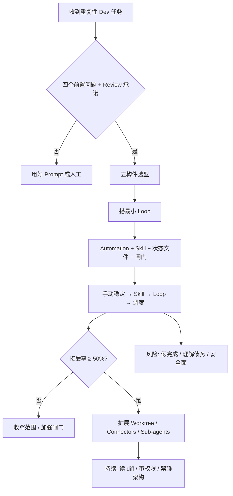

---
tags:
  - tech-article
  - AI
  - Loop-Engineering
  - Agent
  - 工程化
  - Skills
  - MCP
created: 2026-06-21
category: 技术文章/AI
aliases:
  - Loop Engineering 实操手册
  - Loop 工程 14 步
---

# 重磅！Loop Engineering 实操手册公开

> **原文链接**: [微信公众号原文](https://mp.weixin.qq.com/s/kICrdEkPCYAiyOiwI-Gt1Q)

> **一句话总结**: Loop Engineering 不是更好的 prompt，而是把 Agent 放进「可自动验收、可停止、可审计」的循环工作流里——先判断值不值得做，再用五块积木搭最小闭环，最后用硬闸门和人工 review 守住质量与安全。

> **前置知识检查**:
> - [ ] 理解 Prompt Engineering 与一次性 Agent 调用的边界
> - [ ] 熟悉 CI/CD、测试套件、linter 等自动化质量闸门
> - [ ] 了解 Git worktree、MCP、Skills 等 Agent 工具链概念

## 原文

**Datawhale干货**

**作者：Codez，X博主**

上周，我们分享了一篇《提示词工程已死，Loop Engineering来了！》带大家了解了 Loop engineering 是什么。

今天我们分享由 Codez 总结的 14 步，全网 220w 人看过，讲的就是如何构建 Loop Engineering。


内容综合自 Anthropic 的工程文档、Addy Osmani 关于 loop 工程的长文，以及最近几篇有实测数据的研究。


全文分为三个层次：先判断你到底需不需要循环，再学会五块积木，最后搭一个最小的、不会坑你的循环。

### 一、动手前：四个问题，决定你要不要 Loop Engineering

Loop 不是免费的。它烧 token、要花时间搭、出了问题你还得去 debug 一个你没亲眼看它跑的系统。所以先问自己四个问题，都想清楚之后，再动手。

**一、这个任务是重复的吗？** Loop 的搭建成本靠多次运行摊回来。一次性的活，一个好 prompt 更快更省。

**二、有没有东西能自动判定"这活干砸了"？** 测试、类型检查、linter、构建脚本，随便哪个都行。没有自动检查，你就得自己逐行读 diff，那 loop 就并没有帮你节省时间。

**三、你的 token 预算扛得住浪费吗？** Loop 会反复读上下文、重试、试探，不管有没有产出都在烧 token。

**四、Agent 能跑自己写的代码吗？** Agent 需要有日志、能复现、看得到哪里崩。

还有个附加题，比上面四个都重要：**你打算 review 它产出的代码吗?** 不打算，就别建 Loop。

**谁适合上手**

有强测试套件的团队，干 CI 失败分类、依赖升级、lint-and-fix、把 issue 转成 PR 草稿这类任务（重复、能机器校验、出事范围小）。

**谁不适合上手**

消费级套餐上的个人开发者、测试覆盖不够的代码库、瓶颈在 review 而不在打字速度的团队。

所以，loop engineering 真有用，但大部分人现在还用不上。


## 二、Loop Engineering 的五个核心构件

@0xCodez 把 loop 拆成五个构件。这个拆法好在每个都能单独用、单独试。


**Automations——loop 的心跳。** 按节奏触发（定时，或某个事件），跑完一轮，停下，等下一次。Codex 在 Automations 里配，Claude Code 用命令配。关键是停止条件要写死，别让它无限跑。


**Worktrees——并行不打架。** 多个 Agent 同时干活，最怕它们改同一个文件。Git worktree 给每个 Agent 一份独立工作区，互不干扰，最后再合。

**Skills——把背景写下来。** 项目用什么框架、有什么约定、踩过什么坑，写成一个 skill 存着，Agent 每轮直接读，省得你每次从零解释。

**Connectors——连上真实工具链。** 只能看文件系统的 loop 干不了几件事。通过 MCP 接上 GitHub（开 PR）、Linear/Jira（更新 ticket）、Slack（发汇总）、Sentry（查告警），loop 才算真正接入你的工作流。

**Sub-agents——写的和验的分开。** 这可能是最有用的一个改造。写代码的模型给自己打分太宽容。换一个带不同指令的第二个 Agent 来验收，能抓到第一个自我说服过去的问题。loop 是在你不看的时候跑的，一个你信得过的验证器，是你能放心走开的唯一理由。

## 三、构建一个最小的 Loop

当我们确定要构建 Loop 了，也别上来就建"全能系统"，先建能用的最小版：


1. **一个 automation：** 按节奏触发，按明确条件停。

2. **一个 skill：** 存下项目背景，省得每轮重讲。

3. **一个状态文件：** 记下做完了什么、下一步干啥，明天续上。

```
# Loop state · ci-triage
## 上次运行
2026-06-09 03:30 UTC · 7 个失败已分类，3 个草拟修复，4 个上报
## 进行中
- claude/fix-auth-token-refresh — 本地测试通过，等 CI
## 今日完成
- claude/bump-axios-1.7.4 → 已合并（CI 绿，依赖 loop 已验证）
## 上报给人
- src/billing/refund.ts — 测试三种崩法，根因不明
## 经验教训（写这里，别写在聊天里）
- 2026-06-08: 这台 Windows runner 上 PowerShell 撞 TLS 1.2 问题，改用 bash。
```

4. **一个闸门：** 自动拒绝坏活的测试 / 类型检查 / 构建。

此时，顺序是十分重要的。先让一次手动运行稳定 → 做成 skill → 包成 loop → 再去调度。

搭好之后盯一个指标：**每个被接受的改动的成本**。如果接受率低于 50%，这 loop 就在亏本。

## 四、Loop 跑起来之后，会存在三种翻车和一个安全问题

loop 跑起来后，容易以三种方式翻车。

**一是假装干完了。** 工程师 Geoffrey Huntley 管这叫 Ralph Wiggum 循环：Agent 提前发"完成"信号，活干一半就退。原因只有一个：没有硬闸门，缺少了测试和验收。


**二是理解债务。** loop 越快交付你没写过的代码，"仓库里有什么"和"你理解什么"的差距就越大。有一天，你得 debug 一个团队里没人读过的系统。

**三是认知投降。** 你慢慢不再自己判断，loop 返回啥就收啥。所以，即使有了 Loop，也要读 diff、抽查闸门、不让 loop 碰架构。

安全上还有一条红线：**无人值守的 loop，就是无人值守的攻击面。**

- 生成代码未审就上线：闸门里得加 SAST、依赖审计、密钥扫描。
- Skill 是注入入口：社区 17022 个 skill 里有 520 个会泄露凭证，自动安装前先读源码。
- 凭证泄露进日志：生产 loop 关掉 verbose 日志。
- 权限蔓延：今天加一个写权限，明天再加一个，每 30 天复审一次。

## 写在最后：构建 Loop Engineering 的 14 步路线图

最后，我们把上面整条路径压缩成一张清单：

**第一段 · 先想清楚要不要做（5 步）**

1. 确认这活是重复的：一次性的活，好 prompt 更划算
2. 确认有东西能自动判定"干砸了"：测试、类型检查、linter，至少一个
3. 确认 token 预算扛得住浪费：loop 不产出也照样烧钱
4. 确认 Agent 跑得了自己写的代码：有日志、能复现、看得到哪崩了
5. 确认你真打算 review 产出：不打算，就别建

**第二段 · 搭一个最小能跑的 Loop（8 步）**

6. 先让一次手动运行稳定下来：顺序别跳
7. 把项目背景沉淀成一个 Skill：省得每轮从零解释
8. 加一个状态文件：记下做完了什么、下一步干啥
9. 设一道硬闸门：测试 / 构建过不了就自动拒
10. 配一个 Automation：按节奏触发，用 `/goal` 设停止条件
11. 多个 Agent 并行就上 Worktree：别让它们改同一个文件打架
12. 接上 Connectors：让 loop 能开 PR、更新 ticket、发 Slack
13. 拆出 Sub-agents：写代码的和验收的分开

**第三段 · 上线之后守住（1 步，但最难）**

14. 盯住每个被接受的改动成本，定期复审权限、读 diff、别让 loop 碰架构

两年来，与编码 Agent 协作的杠杆一直在提示词上。更好的提示词、更好的上下文、更好的一次性输出。

而现在，工作流成了真正的护城河。


---

## 核心概念脑图

```mermaid
mindmap
  root((Loop Engineering))
    是否值得做
      任务可重复
      自动验收闸门
      Token 预算
      人工 Review 承诺
    五块积木
      Automations 心跳
      Worktrees 并行隔离
      Skills 背景沉淀
      Connectors MCP 接入
      Sub-agents 写验分离
    最小闭环
      状态文件
      硬闸门
      接受率 KPI
    风险
      Ralph Wiggum 假完成
      理解债务
      认知投降
      无人值守攻击面
```



## 与你已有知识的关联

**《[[大厂技术文章-DailyTech/Prompt被淘汰了？深度拆解Loop Engineering，炒作还是趋势？|Loop Engineering 深度拆解]]》**：本文是同一主题的前序概念篇；本篇 14 步清单把该文的五模块框架压缩成可执行的立项与落地 checklist。

**《[[大厂技术文章-DailyTech/Loop Engineering 实践指南：在 Code Buddy 中构建自主循环系统|CodeBuddy Loop 实践]]》**：该文的双层循环、状态外置、`/goal` 停止条件，对应本文「最小 Loop」四件套与 Sub-agents 写验分离的具体产品实现。

**《[[大厂技术文章-DailyTech/Loop Engineering 概念解析、思考与实践|Loop 概念解析]]》**：本文「理解债务」「认知投降」是对该文 Intent Debt 类问题的实操化表述——Loop 越快，人与代码理解 gap 越大。

**《[[大厂技术文章-DailyTech/Skills：从编程工具的配角到Agent研发的核心|Skills 核心]]》**：本文 Skills 构件（项目背景沉淀）是该文「Skills 作为 Agent 研发核心」在 Loop 场景下的最小必要实践。

**《[[大厂技术文章-DailyTech/AI Agent系列｜深入解析Function Calling、MCP和Skills的本质差异与最佳实践|MCP/Skills 差异]]》**：Connectors 通过 MCP 接 GitHub/Jira/Slack，是该文 MCP 作为「工具链连接器」在 Loop Engineering 中的标准用法。

**《[[大厂技术文章-DailyTech/一篇搞懂 AI Coding Agent 的 Token 成本控制|Token 成本控制]]》**：本文第三个前置问题「token 预算扛得住浪费吗」可直接套用该文五层优化框架做 Loop ROI 评估。

## 重难点理解

- **重点/难点1: Loop vs Prompt** — Loop 用多次运行摊平搭建成本，Prompt 用一次调用解决问题 — 一次性任务强行上 Loop 会又慢又贵。
- **重点/难点2: 硬闸门** — 没有测试/linter/构建等机器可判定的「干砸了」信号，Loop 只会把 diff 堆给你人工读 — 这是 Ralph Wiggum 循环的根因。
- **重点/难点3: Sub-agents 写验分离** — 写代码的 Agent 自我评分偏乐观 — 独立验收 Agent 是「无人值守时敢走开」的前提。
- **重点/难点4: 接受率 KPI** — 被接受改动成本，接受率低于 50% 即亏本 — Loop 不是「能跑就行」，要有经济性与质量度量。
- **重点/难点5: Skill 安全** — Skill 是注入与凭证泄露入口 — 社区 Skill 需人工审源码再自动安装，生产 Loop 关 verbose 日志。

## 原文内容流程图



## 经验

1. **先手动再自动化**: 一次手动运行稳定后再包成 Loop — **应用场景**: 任何新 Loop 类型 — **预期效果**: 避免调试「黑盒自动化」叠加「黑盒 Agent」。
2. **状态写文件不写聊天**: 经验教训、进行中任务进状态文件 — **应用场景**: 跨会话/跨日续跑 — **预期效果**: 上下文不丢、可审计。
3. **停止条件写死**: Automation 必须有明确停止条件 — **应用场景**: 定时/事件触发 — **预期效果**: 防止 token 无限燃烧。
4. **并行必 Worktree**: 多 Agent 改同一仓库 — **应用场景**: 并行 fix / 并行 PR — **预期效果**: 避免文件冲突与互相覆盖。

## 知识

| 知识点 | 定义 | 关键要素 | 关联概念 |
|-------|------|---------|---------|
| Loop Engineering | 把 Agent 嵌入可重复、可验收、可停止的自动化循环 | 重复任务、硬闸门、Review | Prompt Engineering |
| Automations | Loop 的定时/事件触发与停止 | 节奏、停止条件、单轮边界 | Cron、Webhook |
| Worktrees | Git 独立工作区供并行 Agent | 一 Agent 一 tree、最后合并 | 并行 Agent |
| Skills | 持久化项目背景与约定 | 框架、坑、规范 | Context、RAG |
| Connectors | 通过 MCP 等接外部系统 | GitHub、Jira、Slack、Sentry | MCP |
| Sub-agents | 写代码与验收分离 | 独立指令、交叉验证 | Code Review Bot |
| Ralph Wiggum 循环 | Agent 未完工却发完成信号 | 缺硬闸门 | 假阳性完成 |
| 理解债务 | 代码增速超过人脑理解增速 | diff 不读、架构不碰 | 技术债 |

## 可复用建议

1. **14 步清单当 Checklist**: 立项前走第一段 5 步，实施走第二段 8 步，上线走第 14 步 — **适用场景**: 团队引入 Agent Loop — **预期效果**: 减少「上来就全能系统」的失败项目。
2. **CI Triage 作为首个 Loop**: 失败分类、依赖 bump、lint-fix — **适用场景**: 强测试套件团队 — **预期效果**: 任务重复、可机器验证、爆炸半径小。
3. **闸门栈**: 测试 + 类型检查 + 构建 + SAST + 依赖审计 — **适用场景**: 无人值守 Loop — **预期效果**: 降低未审代码上线与供应链风险。
4. **接受率仪表盘**: 跟踪「Loop 产出 PR 被 merge 比例」 — **适用场景**: Loop 运行 2 周后 — **预期效果**: 量化 Loop ROI，指导收窄或关停。

## 实施办法

1. **第1步**: 用四个问题 + Review 承诺评估当前任务是否适合 Loop；不适合则优化 Prompt 或人工流程。
2. **第2步**: 选手动可稳定复现的一条路径（如「CI 失败 → 分类 → 草拟 fix」），记录步骤与失败模式。
3. **第3步**: 将项目背景、命令约定、已知坑写入 Skill；新增 `loop-state.md` 模板（上次运行 / 进行中 / 完成 / 上报 / 经验教训）。
4. **第4步**: 接硬闸门（本地测试 + CI）；手动跑通 3–5 轮并统计接受率。
5. **第5步**: 配置 Automation（明确停止条件）→ 按需加 Worktree、MCP Connectors、验收 Sub-agent → 上线后每 30 天审权限、禁 Loop 改架构。

> **图片说明**: 原文 8 张配图位于 assets/重磅！Loop Engineering 实操手册公开/，微信 CDN 原链可能过期。
