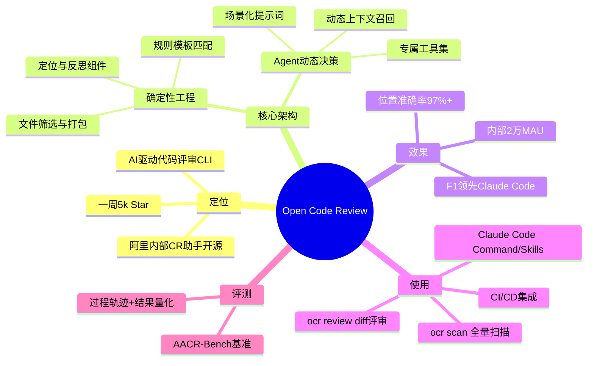
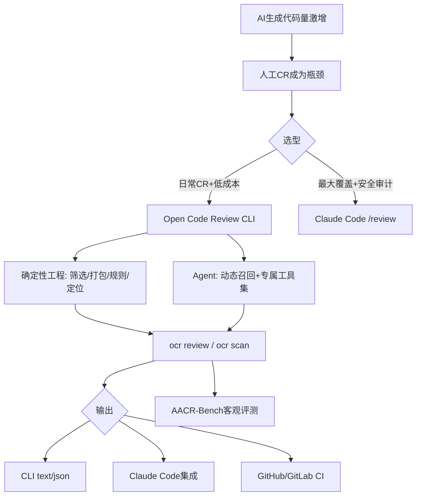

---
tags:
  - tech-article
  - AI
  - Open-Code-Review
  - Code-Review
  - Claude-Code
  - Harness工程
  - Token
created: 2026-06-24
category: 技术文章/AI
aliases:
  - Open Code Review
  - OCR代码评审
  - 阿里代码评审开源
---

# 阿里重磅开源！Open Code Review：一周 5k star，为你的代码保驾护航

> **原文链接**: [https://mp.weixin.qq.com/s/WSicyyMEIXnNVDoWuz0jrw](https://mp.weixin.qq.com/s/WSicyyMEIXnNVDoWuz0jrw)

> **一句话总结**: Open Code Review 用「确定性工程 + Agent 混合驱动」解决 AI 代码评审的覆盖、定位与稳定性问题，在准确率与 Token 成本上显著优于通用 Agent 方案，适合作为 AI 编码时代的专业评审底座。

> **前置知识检查**:
> - [ ] 了解 Git diff / PR 代码评审基本流程
> - [ ] 使用过 Claude Code 或类似 AI 编程 Agent
> - [ ] 理解 MCP、Skills、CLI 在 Agent 工具链中的角色差异
> - [ ] 知道准确率、召回率、F1 在评测中的含义

## 原文


阿里妹导读

文章内容基于作者个人技术实践与独立思考，旨在分享经验，仅代表个人观点。

前言

AI 每天生成的代码量已经远超人工评审的上限 —— 以前每天 review 几百行，现在动辄几千、几万行。代码评审，正在成为研发效率新的质量瓶颈。


Open Code Review 是什么？


Open Code Review 是一款 AI 驱动的代码评审 CLI 工具。**它的前身是阿里集团内部官方 AI 代码评审助手**，过去两年在**内部服务了数万开发者，识别了数百万个代码缺陷**，经过大规模充分验证后，我们将其孵化为开源项目，对社区开放[1]。

**为什么不直接用通用 Agent 评审代码？**

如果你深度用过 Claude Code 等通用 Agent + Skills 方案做代码评审，可能对以下问题深有同感：

- **覆盖不全：**变更较大时，Agent 倾向于"偷懒"，选择性地评审部分文件，导致遗漏。
- **位置漂移：**报告的问题与实际代码位置常常对不上，出现行号或文件偏移。
- **效果不稳定：**基于自然语言驱动的 Skills 难以调试，评审质量因提示词的细微差异而大幅波动。
这些问题的根源在于：**纯语言驱动的架构缺乏对评审流程的强约束。**

**核心设计：确定性工程 × Agent 混合驱动**

Open Code Review 的核心设计理念是将确定性工程与 Agent 结合，各司其职：

#### 确定性工程：负责强约束

对代码评审场景中"不能出错"的环节，由工程逻辑而非语言模型来保证：

- **精准的文件筛选：**明确哪些文件需要评审、哪些应当过滤，确保真正重要的改动一个不漏。
- **智能的文件打包：**将关联文件归并为同一评审单元（例如 `message_en.properties` 与 `message_zh.properties` 会被打包在一起）。每个包会作为 subagent 进行任务，他们之间的上下文是隔离的，这一分治策略在超大变更场景下表现更为稳定，同时天然支持并发评审（由于某些原因，对外版本暂时采用了固定的分治策略）。
- **精细化规则匹配：**针对不同文件的特征，匹配对应的评审规则，确保模型的注意力足够聚焦，从源头规避信息噪声的干扰。相比纯语言驱动的规则引导，基于模板引擎的规则匹配行为更稳定、结果更可预期。
- **外挂的定位与反思组件：**独立的评论定位模块与评论反思模块，系统性地提升 AI 反馈的位置准确性与内容准确性。

#### Agent：负责动态决策

#### 将 Agent 的优势集中发挥在它真正擅长的地方，动态决策、动态召回上下文等：

- **场景化提示词调优：**针对代码评审场景深度优化提示词模版，在提升效果的同时有效降低 Token 消耗。
- **场景化工具集沉淀：**基于对大量线上数据中工具调用轨迹的深入分析，包括不同工具的调用频率分布、单一工具的重复调用率、新增工具对整体调用链路的影响等多维度分析，从而对通用 Agent **工具集进行取舍与拆分**，最终沉淀出一套在代码评审场景下效果更稳定、行为更可预期的专属工具集。


Open Code Review 效果怎么样？

**内部使用情况**

Open Code Review 的前身已在阿里集团内部经过大规模生产环境验证，这组数据表明，Open Code Review 不仅具备大规模落地的工程能力，更在真实开发工作流中获得了一线工程师的广泛认可。以下数据的前提为 **CR 被合并到目标分支** 中：

| 指标 | 数据 |
|------|------|
| 月活用户 | 2万 |
| 累计执行任务 | 370万次（真实评审任务） |
| 用户采纳率 | 超过30% |
| 有效AI评论占比 | 全集团范围内近80% |
| 评论位置准确率 | 超过97% |


**开源评测集对比**

我们基于真实场景的 CodeReview 基准测试进行了客观评估，该评测集从 **50** 个热门开源仓库中精选 **200** 个真实的 PullRequest，覆盖 **10 **种编程语言、多种问题类型与不同的变更规模，并由 **80+** 位资深工程师交叉标注完成。评测对比了三类工具：**Open Code Review**（v1.3.1）、**Claude Code**（v2.1.169，/code-review）和 **Codex**（v0.140.0，/review），涵盖 Claude-4.6-Opus、Claude-4.8-Opus、GPT-5.5、Qwen3.7-Max、Deepseek-V4-Pro、GLM-5.1 共六款主流模型。

##### 结论一：不同工具在准确率与召回率上各有所长

Open Code Review 的核心优势在于准确率：各模型的准确率在 25%–38% 之间，远高于 Claude Code 的 7%–16%。以 Claude-4.6-Opus 为例，OCR 产出 889 条评论、命中 301 个真实问题（准确率 33.90%），而 Claude Code 产出 5980 条评论、命中 435 个真实问题（准确率 7.23%）。更高的准确率意味着更低的噪声，工程师在处理评审结果时效率更高。

然而，Claude Code 的核心优势在于召回率：CC + Claude-4.6-Opus 以 28.90% 的召回率位居所有组合之首，实际命中了 435 个真实问题——比 OCR 最优组合多发现了 134 个（增幅约 45%）。不仅如此，CC + Qwen3.7-Max（23.37%）和 CC + GLM-5.1（20.80%）的召回率同样超过了 OCR 的多数组合。对于安全审计等"宁可多查、不可遗漏"的场景，更高的召回率有着不可替代的价值。

综合来看，Open Code Review 凭借 F1 指标领先（最优 25.10% vs Claude Code 最优 14.13%），在准确率和召回率之间取得了更均衡的表现；而 Claude Code 则在最大化问题覆盖方面更具优势，适合对遗漏风险容忍度低的场景。

##### 结论二： 资源开销与适用场景存在差异

三类工具在资源消耗上呈现出明显的层次差异。Open Code Review 的平均 Token 消耗为 352K–743K，耗时 1–6 分钟，是三者中效率最高的选择。Claude Code 的 Token 消耗在 2,062K–5,664K 之间，耗时 5–14 分钟，资源开销显著更高，但更高的召回率使其在深度审查场景中仍具价值。Codex 的 Token 消耗（525K）和耗时（约 3 分钟）与 OCR 处于同一量级，且保持了 27.82% 的准确率，但 4.92% 的召回率使其仅能覆盖少量问题，更适合作为轻量级的快速扫描工具。

结论三： 新一代模型并非在所有维度上均优于上一代

一个值得关注的现象是，Claude-4.8-Opus 在两个工具上均表现出"更精确但更保守"的特征：它的准确率是所有组合中最高的（OCR 上 37.80%、CC 上 15.93%），但召回率明显低于 Claude-4.6-Opus（OCR 上 11.70% vs 20.00%、CC 上 12.70% vs 28.90%）。这说明模型的代际升级并不一定带来代码评审效果的全面提升 —— 更强的模型能力可能倾向于更严格的判断标准，从而在提升精度的同时牺牲了覆盖面。


**实践案例：Open Code Review 评审一个由 
Claude Code 从零构建的生产级项目**

Open Code Review 的前身是阿里内部基于 Java 构建的系统。我们全程使用 Claude Code 以 Go 语言进行开源版本的代码重写，并将 Open Code Review 接入自身的开发工作流，对每一次变更进行评审。

这一结果揭示了一个关键洞察：AI 写代码与 AI 审代码，是两种截然不同的能力。 即便是最强的编码 Agent，也需要专业的评审 Agent 来兜底。这个开源项目本身，就是 Open Code Review 能力最真实的证明。

**结果：在 106 次代码变更中，累计发现 145 个有效问题，涵盖：**严重 Bug / 逻辑错误、安全问题、错误处理不当、命名 / 拼写错误、代码重复 / DRY 违反、性能问题、Shell 脚本问题、React / 前端问题、国际化不完整。


Open Code Review 做了什么？

**假阴性（漏报）的优化：
如何尽可能发现代码中的客观问题？**

漏报的根因可归为三类：**看不到**（上下文缺失，diff 之外的关键信息不可见）、**看太多**（上下文噪声导致注意力稀释）、**想不到**（静态的 CoT/Workflow 无法覆盖需要多步动态推理的复杂缺陷）。

Open Code Review 从架构层面系统性地解决这些问题：

- **智能文件打包（File Bundling）：**相关文件（如 `message_en.properties` 和 `message_zh.properties`）被打包成一个评审单元，在同一上下文中评审，解决跨文件关联缺陷的检测问题。
- **Plan 阶段（大文件专用）：**当变更行数 ≥ n 时，先执行一个 Plan 阶段让 LLM 制定结构化的评审计划，再进入主评审循环，确保复杂变更不被遗漏。
- **Agent 化的动态上下文召回：**每个评审子任务是一个独立的 Agent 循环（最多 20 轮 tool-use），模型可以根据当前推理需求动态决定调用哪些工具——`file_read` 读取完整源文件、`code_search` 全仓库搜索（git grep）、`file_read_diff` 查看其他变更文件的 diff、`file_find` 按名称模式搜索文件。这使得 Agent 能像人类评审者一样层层递进地推理，例如发现一个可能返回 null 的方法调用后，主动搜索该方法的实现和历史调用方式来验证假设。
- **场景化工具集的精心设计：**工具集从大规模生产数据中的 tool-call traces 蒸馏而来——分析了调用频率分布、每个工具的重复调用率、新工具对整体调用链的影响——最终形成一个专为代码评审场景设计的工具集，比通用 Agent 工具包更稳定、更可预测。
**假阳性（误报）的优化：
如何确保 AI 反馈的准确性？**

误报是导致"告警疲劳"的核心原因——当误报过多时，用户会逐渐麻木，忽视真正的关键问题。误报的来源包括：知识遗忘（如不知道 `StringUtils.isBlank` 是 null 安全的）、上下文不足（把合理的设计决策误解为缺陷）、违背用户指定的评审方向等。

Open Code Review 的应对策略：

- **反思模型（Reflection Model）作为过滤器：**在集团内部实践中，团队利用用户反馈数据（采纳、误报、忽略）训练了一个专项 Qwen3-30B-A3B 模型。由于线上数据存在噪声（"忽略"中混合了正确和错误的数据），他们将少量专家标注和用户明确反馈作为锚点，通过混合不同噪声比例的扰动数据集训练多个差异化模型进行协同标注，从噪声中识别可靠样本。最终模型相比基模的误报拦截率从 30.09% 提升到 52.63%，平均耗时从大尺寸主模型的 5 秒降低到 500ms 内。（参考论文[2]）


- **精细化规则模板：**通过 glob pattern 将规则精准匹配到特定文件类型（如 Java 文件用 Java 规则、XML mapper 用 SQL 规则），避免模型"发散"到不相关的问题上。相比纯自然语言驱动的规则指导，基于模板引擎的规则匹配更稳定可预测。这些规则是根据当下架构的能力边界以及阿里内部数万用户的使用数据迭代而来。（规则文档[3]）
- **上下文隔离设计：**由于对代码变更采用了分治策略，评审任务的 LLM 对话上下文之间交叉污染更小，降低了因上下文混淆带来的误报概率。
**用户主观性：什么算问题，由谁说了算？**

试图用一套规则满足所有用户是不可能的。AI 代码评审中，规则存在显著的"边际效益递减"现象——写得越多，指令跟随越差。不同业务的 DNA 不同（支付系统的安全规则对内容管理系统可能是噪音），同一个客观问题在不同团队中的重要性也不同。

Open Code Review 通过**四层规则穿透机制**解决这一问题。每层采用 first-match-wins 策略：文件路径命中某个 glob pattern 后立即生效，不再向下穿透；若该层无匹配，则自动降级到下一层：

- **CLI 参数（**`--rule <path>`**）：**一次性覆盖，优先级最高。适合临时的专项评审场景，例如安全审计、上线前 Checklist 检查，无需修改任何持久化配置。
- **项目维度（**`.opencodereview/rule.json`**）：**团队级规则，随代码仓库版本控制，所有团队成员共享。例如："Java 文件记录日志时必须使用代码库内部的 FormatLogUtil 工具类"、"禁止多表关联查询超过 5 张表"、"金额计算应使用 BigDecimal 而不是 double"。
- **用户维度（**`~/.opencodereview/rule.json`**）：**个人偏好规则，跨所有项目生效。
- **系统默认：**内置 13 套语言/文件类型专属规则文档，开箱即用，覆盖主流场景。针对每种文件类型，规则聚焦于该语言最高频的缺陷模式，例如：Java 关注 NPE、线程安全、循环内 N+1 查询；TypeScript/React 关注 Hooks 规则、XSS 防护（禁止 `innerHTML`/`eval`）、严格 `===`；C 关注 malloc/free 配对、缓冲区溢出、悬空指针；MyBatis XML 关注 `${}` 与 `#{}` 混用导致的 SQL 注入；Maven/Gradle 关注 SNAPSHOT 版本泄漏到生产依赖等。
规则文件还支持 `include`/`exclude` 字段精确控制评审范围。`exclude` 可跳过自动生成的代码或特定目录；`include` 则可反向覆盖系统默认的测试文件排除策略——当你明确需要评审测试代码时，将测试路径加入 `include` 即可。可使用 `ocr rules check <file>` 命令预览任意文件路径将匹配到哪条规则，方便调试规则配置。

此外，`--background` 参数支持注入需求背景信息（使用 `--commit` 模式时还会自动提取 commit message 作为背景），使模型在评审时能区分"有意为之的设计决策"与"真正的缺陷"，从源头减少因上下文缺失导致的误报。

**定位准确率：问题内容正确，但位置对不上**

评论位置的准确性是用户阅读 AI 反馈的前提。位置不准确不仅增加理解成本，还会为后续的自动修复引入噪声。业界主流方案各有短板：

- **复述代码定位：**模型复述问题对应的原始代码，但受训练数据影响偶尔会篡改原始代码（约 30%的偏差率）。
- **行号定位：**模型直接输出行号，但 LLM 对数字不敏感，位置偏移较常见（改动越复杂越明显）。
- **AST 定位：**基于 AST 标记，准确性高但粒度太粗（如一个 20 行的 if 语句只能定位到语句级别）。
Open Code Review 设计了三层递进式定位策略：

**第一层：Hunk-based 文本匹配。** 模型通过 `code_comment` 工具提供 `existing_code`（它正在评论的代码片段），而不是行号。系统解析 diff hunks，提取索引行，通过归一化的连续行匹配找到精确位置。这个设计从架构上回避了"让 LLM 数行号"的固有缺陷。

**第二层：全文件内容扫描。** 如果 hunk 匹配失败，回退到对文件新版本内容逐行扫描。

**第三层：LLM 重定位（Re-location Model）。** 如果前两层都失败（通常是模型复述代码时发生了篡改），调用 LLM 重新从 diff 中提取精确的逐字代码片段，然后重试前两层。集团内部还训练了专项 Qwen3-8B 定位模型，基模成功率从 37.35% 提升到 85.65%，耗时从 3 秒降至 1 秒内。

**Token 消耗的优化**

在大规模场景下（数万开发者、日均数百万次评审），token 成本是必须面对的工程问题。以 Anthropic 的 Code Review 产品为例，每次 PR 平均消耗 15–25 美元——对大多数团队而言，这个数字意味着规模化部署在经济上不可行。

Open Code Review 的核心设计原则是：**每一步只给模型看它需要的信息，尽早丢弃不需要的内容，严格限制输出范围。** 具体体现在以下几个层面：

- **分治策略，token 消耗线性可控。**将代码变更拆分为独立子任务并发评审，各自维护独立的对话上下文。这避免了将所有变更塞入一个上下文窗口的做法——变更规模翻倍，token 消耗也仅线性增长，而不会因上下文膨胀导致成本失控。
- **双阈值内存压缩，防止对话历史溢出。**当 Agent 工具循环中的对话历史达到 MaxTokens 的 60% 时，触发异步后台压缩（非阻塞，不影响主循环）；达到 80% 时，立即执行同步压缩。压缩采用三区模型：冻结区（系统提示词 + 初始用户消息，永不压缩）、压缩区（中间轮次，由 LLM 摘要为结构化文本）、活跃区（最近 K 轮保持原样，保留推理连续性）。
- **大文件预过滤，避免无效消耗。**Diff 本身超过 MaxTokens 80% 的文件直接跳过——这些文件即使送入模型也会因 token 不足而无法完成有意义的评审，不如提前止损。
- **工具输出设上限，防止上下文被撑爆。**`file_read`单次最多返回 500 行，`code_search` 最多 100 条匹配，`file_find` 最多 100 个结果。每个工具都有明确的输出边界，防止一次调用就耗尽大量 token 预算。
- **Plan 阶段智能跳过。**变更不足 50 行的小文件直接跳过 Plan 阶段，节省一次完整的 LLM 往返调用。小改动本身不需要复杂的评审策略规划。
- **精确的 token 预算控制。**使用 tiktoken（根据模型自适应选择 cl100k_base 或 o200k_base 编码）进行token 预估，确保每次 LLM 调用前有准确的预算判断，在超限前主动拦截而非等待 API 报错。
- **确定性逻辑接管高确定性任务。**文件筛选、路径规则匹配、行号定位等不需要"理解"的步骤，全部由工程代码完成，零 token 消耗。LLM 只在真正需要语义理解和推理的环节介入——把最贵的资源用在最需要的地方。
Open Code Review 如何使用？

**作为 CLI 使用**

### 安装

安装后，`ocr` 命令即可全局使用。

```bash
npm install -g @alibaba-group/open-code-review
# 验证版本
ocr version
```

### 基础使用

在审查代码之前，必须先配置 LLM。

```bash
ocr config provider          # 选择内置供应商或添加自定义供应商
ocr config model             # 为当前供应商选择模型
```


配置完成后，在任意 Git 仓库中即可开始评审：

```bash
# 工作区模式 —— 评审所有暂存、未暂存和未追踪的变更
ocr review
# 分支对比 —— 比较两个引用之间的 diff
ocr review --from main --to feature-branch
# 单次提交
ocr review --commit abc123
# 附带需求背景 —— 评审变更是否正确实现了需求
ocr review --background "实现用户登录的手机号验证逻辑"
```

常用参数：

| 参数 | 默认值 | 说明 |
|------|--------|------|
| `--repo` | 当前目录 | Git 仓库根目录 |
| `--format` | text | 输出格式：text 或 json |
| `--concurrency` | 8 | 最大并发评审文件数 |
| `--timeout` | 10 | 并发任务超时（分钟） |
| `--audience` | human | human（展示进度）或 agent（仅输出摘要） |
| `--background` | — | 需求背景描述 |
| `--preview`、`-p` | — | 预览将被审查的文件列表 |

全量扫描模式（ocr scan）

`ocr review` 针对**变更（diff）**进行评审，而 `ocr scan` 针对**完整文件**进行评审——它不依赖 diff，而是直接读取并审查整份源码。适用于以下场景：

- **审计陌生代码库：**新接手一个项目，想快速摸清潜在风险点。
- **迁移/重构前体检：**在大规模改造之前，对目标目录做一次全量缺陷扫描。
- **无有意义 diff 的目录：**例如初始化导入的存量代码、长期未评审的历史模块。
`ocr scan` 同样适用于**非 Git 目录**——当目标目录不是 Git 仓库时，会自动回退到文件系统遍历，并遵守 `.gitignore` 的排除规则。

#### 使用

```bash
# 扫描整个仓库（不指定 --path 时的默认行为）
ocr scan

# 扫描单个目录
ocr scan --path internal/agent

# 扫描多个指定文件
ocr scan --path internal/agent/agent.go,internal/diff/scan.go

# 排除生成代码 / 测试文件
ocr scan --path internal --exclude '**/*_test.go,**/generated/**'

# 扫描非 Git 目录，并以 JSON 输出（包含 project_summary 字段）
ocr scan --repo /path/to/plain/dir --format json
```

#### 多阶段评审流程

为了在「全量」这一更大的扫描范围下保持效果与成本可控，`ocr scan` 在主评审循环之外引入了多个可选阶段：

- **Plan 阶段（逐文件）：**在评审每个文件前，先让 LLM 制定结构化的评审计划，确保复杂文件不被遗漏。可用 `--no-plan` 跳过以节省一次 LLM 调用。
- **批次评审（Batching）：**将文件按策略归并为批次后并发评审，通过 `--batch` 控制：`by-language`（按语言/扩展名，默认）、`by-directory`（按一级子目录）、`none`（每个文件独立成批）。
- **Dedup 阶段（批内去重）：**每个批次评审结束后，对批内相似评论进行合并去重，降低噪声。可用 `--no-dedup` 跳过。
- **Project Summary 阶段（跨文件总结）：**所有批次完成后，生成一份项目级的 Markdown 总结，提炼跨文件的共性问题与高风险热点。可用 `--no-summary` 跳过；JSON 输出中以 `project_summary` 字段返回。

#### 成本控制

由于全量扫描的范围远大于 diff 评审，`ocr scan` 内置了成本预估与预算上限能力：

- 每次运行前会打印一份粗略的 **token 成本预估**，让你在调用 LLM 前对开销心里有数。


- 使用 `--preview`（`-p`）可在不调用任何 LLM 的情况下，先查看将被扫描的文件清单。


- 使用 `--max-tokens-budget` 设置总 token 上限（input + output），一旦超出便停止调度新的批次，避免在大型仓库上失控消耗。

```bash
# 先预览将被扫描的文件清单（不调用 LLM）
ocr scan --preview

# 扫描整个仓库，将开销限制在约 50 万 token 以内
ocr scan --max-tokens-budget 500000

# 最快速的扫描：跳过 Plan、Dedup 和项目总结三个阶段
ocr scan --no-plan --no-dedup --no-summary
```

#### 常用参数

| 参数 | 默认值 | 说明 |
|------|--------|------|
| `--path` | 整个仓库 | 逗号分隔的待扫描目录或文件（仓库相对路径） |
| `--exclude` | — | 逗号分隔的 gitignore 风格排除模式 |
| `--preview`、`-p` | false | 预览将被扫描的文件清单，不调用 LLM |
| `--max-tokens-budget` | 0（不限） | 总 token 用量上限，超出后停止调度新批次 |
| `--no-plan` | false | 跳过逐文件的 Plan 预处理阶段 |
| `--no-dedup` | false | 跳过批内相似评论的去重阶段 |
| `--no-summary` | false | 跳过项目级总结阶段 |
| `--batch` | by-language | 批次策略：none / by-language / by-directory |
| `--format`、`-f` | text | 输出格式：text 或 json |
| `--model` | — | 覆盖本次扫描使用的 LLM 模型 |
| `--background`、`-b` | — | 需求/业务背景描述 |
| `--concurrency` | 8 | 最大并发扫描文件数 |
| `--repo` | 当前目录 | 待扫描的仓库或目录根 |
| `--rule` | — | 自定义 JSON 评审规则文件路径 |

#### 高级用法

#### 自定义评审规则

Open Code Review 通过四层链路解析评审规则。每层采用首次匹配原则：如果文件路径匹配到某个模式，则使用该规则；否则穿透到下一层。

| 优先级（高→低） | 来源 | 路径 | 描述 |
|----------------|------|------|------|
| 1 | CLI 参数 `--rule` | 用户指定路径 | CLI 显式覆盖 |
| 2 | 项目配置 | `<repoDir>/.opencodereview/rule.json` | 项目级规则，可用 git 管理 |
| 3 | 全局配置 | `~/.opencodereview/rule.json` | 用户级规则 |
| 4 | 系统默认 | 内嵌 | 覆盖常见语言和文件类型的内置规则 |

规则配置文件格式：

```json
{
  "rules": [
    {
      "path": "force-api/**/*.java",
      "rule": "所有对外接口必须使用 AuthType 注解进行鉴权"
    },
    {
      "path": "**/*mapper*.xml",
      "rule": "检查 SQL 注入风险、参数错误和缺少闭合标签"
    }
  ]
}
```

- `path` 支持 `**` 递归匹配和 `{java,kt}` 大括号展开。
- 在每一层内，规则按声明顺序评估 —— 首次匹配生效。
- 如果规则文件不存在，将被静默跳过。

#### 可观测性（OpenTelemetry）

内置 OpenTelemetry 支持，可上报评审过程的 spans 和 metrics，便于监控和调优：

```bash
# 启用遥测
ocr config set telemetry.enabled true
# 配置 OTLP 导出
ocr config set telemetry.exporter otlp
ocr config set telemetry.otlp_endpoint localhost:4317
# 可选：在遥测数据中包含 LLM prompt 内容（用于调试）
ocr config set telemetry.content_logging true
```

#### Web 视图

启动内置 WebUI 查看器，可视化浏览历史评审会话：

```bash
ocr viewer
ocr viewer --addr :3000
```


**在 Claude Code 中使用**

Open Code Review 提供了对 Claude Code 的原生集成，支持 **Command** 和 **Skills** 两种接入方式，执行对应命令即可完成安装（在此之前请参考上文配置你的模型端点）。

| 维度 | Command | Skills（CLAUDE.md） |
|------|---------|---------------------|
| 触发方式 | 用户主动调用 `/open-code-review` | 每次对话自动加载 |
| 本质 | 可复用的任务提示词模板 | 持久的行为规范、常驻上下文 |
| 灵活性 | 支持参数传入 | 静态内容，全局生效 |
| 适用场景 | 特定任务的快捷入口 | 项目级约束与背景知识 |

#### Command

```bash
mkdir -p ~/.claude/commands && curl -fsSL "https://code.alibaba-inc.com/open-code-review/cc-integrated/raw/master/.claude/commands/open-code-review.md" -o ~/.claude/commands/open-code-review.md
```

#### Skills

```bash
mkdir -p ~/.claude/skills/open-code-review && curl -fsSL "https://code.alibaba-inc.com/open-code-review/cc-integrated/raw/master/.claude/skills/open-code-review/SKILL.md" -o ~/.claude/skills/open-code-review/SKILL.md
```
安装完成后，你可以在 Claude Code 的任意工作流中随时触发 Open Code Review。其核心工作机制如下：

- **上下文隔离：**评审任务在独立线程中执行，全程不污染当前主任务的上下文。
- **需求感知：**Agent 会自动判断是否需要提取当前需求背景，并将其注入评审上下文，从而对需求完成度与实现一致性进行深度评审。
- **置信度分级：**评审结果按 High / Medium / Low 三级过滤，自动丢弃低置信度意见，只呈现真正有价值的问题。
- **自动修复：**对于值得采纳的建议，Agent 可直接发起自动修复，减少人工介入成本。
这种集成方式让专业的代码评审无缝嵌入编码过程，**真正将评审左移至编码阶段**，在问题产生的第一现场将其拦截，与此同时，借助上游 Agent 已有的需求上下文，能够更准确地区分哪些问题值得修复、哪些是 by design 的合理决策，从而避免误报干扰，**整个过程无需人工介入**。


**集成到 Github/Gitlab CI 流水线**

Open Code Review 天然适配 CI/CD 场景——`--format json` 输出结构化的评审结果（包含文件路径、行号、问题描述、修复建议），`--audience agent` 静默所有进度输出，两者组合即可获得纯净的机器可读输出，方便下游脚本解析并回写到代码平台。

我们在 `examples/` 目录下提供了 **GitHub Actions** 和 **GitLab CI** 的完整集成示例，开箱可用：

- **GitHub Actions**（`examples/github_actions/`）：在 PR 创建或评论 `/open-code-review` 时自动触发，评审结果通过 GitHub Pulls API 以 **inline review comments** 的形式精准标注到对应代码行，并支持 GitHub 原生的 `suggestion` 代码块，开发者可一键采纳修复建议。
- **GitLab CI**（`examples/gitlab_ci/`）：在 Merge Request 创建时自动触发，评审结果通过 GitLab Discussions API 以**行级讨论**的形式回写到 MR，支持自托管 GitLab 实例。
两套方案只需配置一个模型端点（通过 CI Secrets/Variables 注入 `OCR_LLM_URL`、`OCR_LLM_AUTH_TOKEN`、`OCR_LLM_MODEL`），无需额外改造现有流水线。核心命令均为：

```bash
ocr review --from "origin/$BASE_BRANCH" --to "origin/$HEAD_BRANCH" \
    --format json --audience agent
```

Open Code Review 如何客观衡量评审质量？

一个值得警惕的趋势正在发生：开发者已经开始不再仔细审查 AI 生成的代码。这种惰性同样会蔓延到 AI 代码评审环节 —— 当编码成本趋近于零，开发者可能会盲目采纳所有建议，或者干脆忽略所有建议。如今阿里内部代码平台上的 AI 评论占比已达 80%，真人参与实际评审的比例大幅萎缩。在这种情况下，采纳率、AI 生成占比等传统指标将彻底失真 —— 它们衡量的是用户行为，而非评审本身的质量。

那么，如何客观定义 AI 代码评审工具自身的质量标准？

我们的答案是：**基于运行轨迹对过程评估、基于客观评测集对结果量化。**这种评估方式不依赖用户行为，直接衡量 Agent 工程本身的能力。

**为什么 CLI 形态更具可评测性？**

要让上述评估方式真正落地，工具本身的可观测性至关重要。相比 Skills 方案，CLI 形态在工程层面天然具备三项优势：

- 输入输出确定性：CLI 接受标准化的 diff 输入，产出结构化的 JSON 结果，天然适合自动化评测流水线。
- 执行隔离性：每次评审独立、可重复，不受对话上下文干扰，执行轨迹易于复现与调试。
- 批量评测友好：可通过脚本批量运行评测集中的所有 case，自动计算各项指标，显著降低评估成本。
**行业基准：AACR-Bench**

评估体系的建立，离不开高质量的行业基准作为锚点。为此，南京大学与阿里巴巴 TRE 联合推出了AACR-Bench。

AACR-Bench 不仅是一个数据集，更是一套完整的评估体系，核心优势体现在三个维度：

- 人机结合：更高质量的真值采用“AI 辅助 + 人类专家校验”的先进标注流水线，汇聚了80 多位资深工程师交叉标注的智慧。相比传统数据集，AACR-Bench 的问题覆盖率提升了285%，成功挖掘出大量原 PR 中被忽略的隐性缺陷。
- 多维度评估：更全面的评估维度打破语言壁垒，支持10 种主流编程语言，并提供完整的仓库级依赖上下文，覆盖了多种类型与多种作用域的代码问题。这使得评估场景能够真实还原复杂的跨文件代码审查过程，全面考验模型的系统性理解能力。
- 更深刻的行业洞察：通过对主流 LLM 的广泛评估，我们发现上下文粒度和检索方法的选择对模型表现有着巨大影响。AACR-Bench 重新定义了 ACR 任务的评估标准，揭示了以往因数据局限性而被误导或低估的模型能力。


展望

目前我们正在逐步将内部版的更多特性开源到社区中，后续我们会发布** Ultra 评审模式**、**IDE 插件、MCP 集成、专用模型训练、特定领域的长期记忆等。**

我们诚挚邀请对 AI 代码评审感兴趣的开发者加入共建 —— 无论是优化语言规则、优化 Agent 策略、优化工具集，还是集成到更多平台，所有贡献都欢迎。如果有任何使用体验问题或更好的想法，欢迎通过 GitHub Issues[4] 反馈给我们。

参考链接
[1]https://github.com/alibaba/open-code-review[2]https://arxiv.org/pdf/2602.20166v1[3]https://github.com/alibaba/open-code-review/tree/main/internal/config/rules/rule_docs[4]https://github.com/alibaba/open-code-review/issues
GitHub：https://github.com/alibaba/aacr-bench

Paper：https://arxiv.org/abs/2601.19494

huggingface dataset：https://huggingface.co/datasets/Alibaba-Aone/aacr-bench

---

## 核心概念脑图



## 与你已有知识的关联

**《[[大厂技术文章-DailyTech/一篇搞懂 AI Coding Agent 的 Token 成本控制|Token成本控制]]》**：OCR 的分治策略、双阈值压缩、工具输出上限，是 Token 五层优化框架在代码评审场景的工程化落地。

**《[[大厂技术文章-DailyTech/Skills：从编程工具的配角到Agent研发的核心|Skills核心]]》**：文章指出通用 Agent + Skills 做 CR 存在覆盖不全、位置漂移、效果不稳定；OCR 用确定性工程约束流程，Skills 更适合触发入口而非承载全流程。

**《[[大厂技术文章-DailyTech/AI 不缺智商缺纪律：一场 Harness 工程化实践|Harness工程化]]》**：OCR 的「确定性工程 × Agent」分工，与 Harness 中「纪律约束 + 模型能力」的分层思想一致——把不能出错的环节交给工程逻辑。

**《[[大厂技术文章-DailyTech/AI编程能力边界探索：基于 Claude Code 的 Spec Coding 项目实战-得物技术|Spec Coding实战]]》**：文章实践案例即「Claude Code 写 Go + OCR 审 Go」，印证 AI 写代码与 AI 审代码是两种不同能力，需要专业评审 Agent 兜底。

**《[[大厂技术文章-DailyTech/AI Agent系列｜深入解析Function Calling、MCP和Skills的本质差异与最佳实践|MCP与Skills差异]]》**：OCR 提供 CLI + 未来 MCP 集成，与 Claude Code Command/Skills 双轨接入，是专用工具与通用协议在 CR 场景的具体选型案例。

## 重难点理解

- **重点1: 确定性工程 × Agent 混合驱动** — 文件筛选、打包、规则匹配、定位由代码保证；语义推理、动态召回由 Agent 负责 — 纯语言驱动 CR 缺乏流程强约束，是通用 Agent 评审不稳定的根源。

- **重点2: 假阴性 vs 假阳性优化** — 漏报来自「看不到/看太多/想不到」；误报来自知识遗忘、上下文不足 — OCR 用 File Bundling、Plan 阶段、反思模型、四层规则分别应对，而非只靠提示词。

- **重点3: 三层定位策略** — Hunk 文本匹配 → 全文件扫描 → LLM 重定位 — 避免让 LLM 直接输出行号；评论位置准确率是用户采纳 AI 反馈的前提。

- **难点1: 准确率与召回率的权衡** — OCR 准确率高（25%–38%）、Claude Code 召回率高（最高 28.90%）— 日常 CR 选 OCR 降噪声；安全审计等场景可接受更高误报时用 CC 提高覆盖。

- **难点2: 四层规则穿透** — CLI `--rule` > 项目 `.opencodereview/rule.json` > 用户全局规则 > 系统默认 — first-match-wins，解决「什么算问题由谁说了算」的团队差异问题。

## 原文内容流程图



## 经验

1. **AI 写 ≠ AI 审**: 最强编码 Agent 仍需专业评审 Agent 兜底 — **应用场景**: Claude Code/Cursor 生成代码后的质量门禁。

2. **CLI 比 Skills 更可评测**: 标准化 diff 输入 + JSON 输出 + 执行隔离 — **应用场景**: 需要批量评测、CI 集成、效果对比时优先 CLI 形态。

3. **规则边际效益递减**: 规则写得越多，指令跟随越差 — **应用场景**: 用四层规则 + glob 精准匹配，而非一个大而全的 prompt。

4. **新一代模型不一定全面更好**: Claude-4.8-Opus 更准确但更保守 — **应用场景**: 选型时同时看准确率、召回率、Token 成本，不唯模型版本论。

5. **采纳率不能衡量 CR 质量**: AI 评论占比 80% 时用户行为指标失真 — **应用场景**: 用 AACR-Bench 等客观基准评估工具本身。

## 知识

| 知识点 | 定义 | 关键要素 | 关联概念 |
|-------|------|---------|---------|
| Open Code Review | 阿里开源的 AI 代码评审 CLI | `ocr review`/`ocr scan`、混合架构 | AACR-Bench |
| 确定性工程 | 用代码逻辑约束 CR 流程 | 文件打包、规则模板、定位组件 | Harness |
| File Bundling | 关联文件合并为评审单元 | i18n 文件对等 | 分治策略 |
| 反思模型 | 过滤误报的专项小模型 | Qwen3-30B-A3B、52.63% 拦截率 | 假阳性 |
| 四层规则 | 规则优先级穿透机制 | CLI > 项目 > 用户 > 默认 | glob pattern |
| AACR-Bench | 南大+阿里联合 CR 评测基准 | 200 PR、10 语言、80+ 工程师标注 | F1/召回率 |

## 可复用建议

1. **先 preview 再评审**: 用 `ocr scan --preview` 或 `ocr review --preview` 确认文件范围 — **适用场景**: 大仓库首次扫描 — **预期效果**: 避免 Token 失控。

2. **项目级规则入库**: 在 `.opencodereview/rule.json` 维护团队规范 — **适用场景**: 多成员共享编码约束 — **预期效果**: 减少团队差异导致的误报/漏报。

3. **CI 用 JSON + agent 模式**: `--format json --audience agent` — **适用场景**: GitHub/GitLab PR 自动评论 — **预期效果**: 机器可读、无进度噪声。

4. **Claude Code 左移评审**: 安装 Command/Skills，评审在独立线程 — **适用场景**: 编码过程中实时 CR — **预期效果**: 借助需求上下文区分 by-design 与真缺陷。

5. **图片本地化存档**: 微信 CDN 链接会过期，知识库应下载到 `assets/` — **适用场景**: Obsidian/离线阅读 — **预期效果**: 文档长期可读。

## 实施办法

1. **第1步**: `npm install -g @alibaba-group/open-code-review`，`ocr config provider` + `ocr config model` 配置 LLM。

2. **第2步**: 在目标仓库执行 `ocr review`（工作区）或 `ocr review --from main --to feature`（分支对比）。

3. **第3步**: 根据团队规范创建 `.opencodereview/rule.json`，用 `ocr rules check <file>` 调试匹配。

4. **第4步**: （可选）安装 Claude Code Command/Skills，或配置 GitHub Actions / GitLab CI 示例。

5. **第5步**: 大仓库全量审计用 `ocr scan --preview` 预估后，加 `--max-tokens-budget` 控制成本。

---

> **图片说明**: 原文 14 张配图已下载至 `assets/阿里重磅开源！Open Code Review：一周 5k star，为你的代码保驾护航/`，Obsidian 内可直接预览；微信 CDN 原链可能过期，请以本地资源为准。
