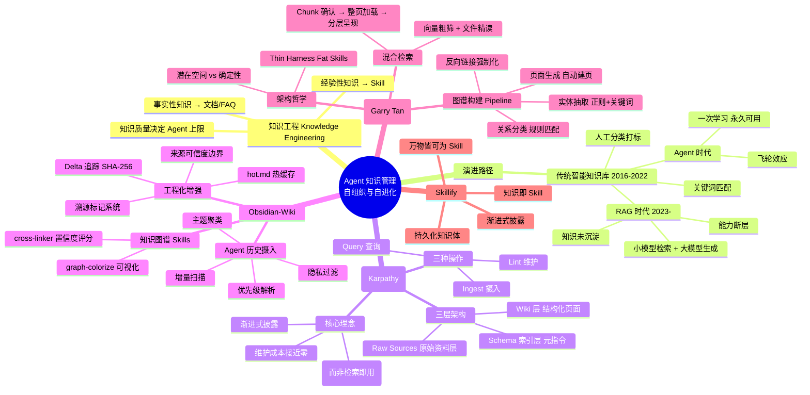
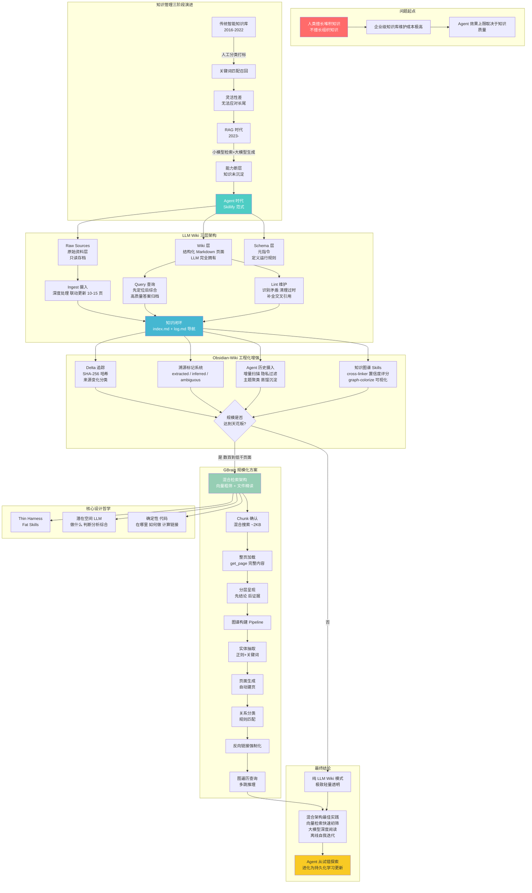

---
tags:
  - tech-article
  - AI
  - Agent
  - Knowledge-Engineering
  - LLM-Wiki
  - GBrain
  - 知识管理
  - 自进化
created: 2026-05-13
category: 技术文章/AI
aliases:
  - Agent时代知识的自组织与自进化
  - LLM Wiki与GBrain深度解析
---

# 深度解析LLM Wiki / Obsidian-Wiki / GBrain：Agent时代知识的"自组织"与"自进化"

> **原文链接**: https://mp.weixin.qq.com/s/48XpgAMHeaKYj26PrJK-hw
> **一句话总结**: Agent 的知识管理正从"检索即用"（RAG）转向"编译即用"（结构化 Wiki），通过 LLM Wiki 的三层架构、Obsidian-Wiki 的工程化增强和 GBrain 的混合检索+图谱，实现知识的自组织与自进化，让 Agent 越用越聪明。
> **前置知识检查**:
> - [ ] 了解 RAG（检索增强生成）的基本原理与局限性
> - [ ] 理解 Agent Skills / Progressive Disclosure（渐进式披露）的概念
> - [ ] 对 LLM 上下文窗口（Context Window）及 "Lost in the Middle" 现象有基本认知
> - [ ] 了解 Obsidian 的基本使用（wikilink、图谱视图、Dataview）
> - [ ] 对知识图谱（节点、边、关系类型）有基本概念

## 原文

（作者：飞樰，原文链接：https://mp.weixin.qq.com/s/48XpgAMHeaKYj26PrJK-hw）

### 背景

本文是「项目深度解析」系列的第4篇，从 Knowledge Engineering（知识工程）的角度展开，探讨如何让 Agent 的知识库实现"自动梳理"、"自动组织"、"自动更新"甚至"自动进化"。

核心痛点：人类擅长"无脑堆积"知识（收藏文章、保存文档），但极不擅长"组织"知识。企业级知识库的维护成本极高——时效性动态维护困难、组织结构复杂（多维度交叉关联，简单树状层级无法刻画网状关系）。

在 AI 时代，知识的质量直接决定 Agent 效果的上限。Context 不仅包含对话指令和历史记录，更核心的是外部注入的知识：
- **经验性知识**：完成特定任务所需的策略、步骤和隐性经验（即 Skill）
- **事实性知识**：领域内的客观信息、文档、FAQ 等静态数据

### 从"知识堆积"到"结构化记忆"

Andrej Karpathy 开源了 **LLM-Wiki**——一个 Markdown 文件，目标是指导大模型 Agent 进行知识的更新与结构化。Garry Tan（Y Combinator CEO）构建了 **GBrain**，一个思想类似但更工程化的知识库项目。

核心理念：**Skillify**——将知识像 Skill 一样去组织和加载。不仅包含事实性知识和经验性知识，还可以容纳长期记忆、个人喜好、过往经历等碎片化信息。

### 阿里云智能客服知识体系演进三阶段

1. **传统智能知识库时代（2016-2022）**：人工分类、打标、归档，树状/标签体系，关键词匹配召回。高度依赖人工，灵活性差。
2. **RAG 时代（2023-）**："前置小模型检索 + 后置大模型生成"。问题：模型能力断层（小模型语义理解有限）、搜索独立性（每次独立检索，上次找到下次未必找到）、知识未沉淀（Agentic RAG 用昂贵推理成本弥补检索不足）。
3. **Agent 时代**：LLM Wiki / GBrain 的"一次学习，永久可用"——消除重复搜索、全链路大模型参与、知识的累积效应（飞轮效应）。

比喻：RAG 是让大模型"带着书本进考场"，Skillify 是让大模型"把书读透并记成整理后的笔记"。

### LLM Wiki：三层架构的知识闭环

LLM Wiki 的核心思路：不是查询时从原始文档检索，而是让 LLM **渐进式地构建和维护一个持久的 Wiki**——结构化的、相互链接的 Markdown 文件集合。

**三层架构**：
1. **原始资料层（Raw Sources）**：只读存档区，存放未经处理的原始输入
2. **Wiki 层（The Wiki）**：按主题、人物、概念等维度组织的结构化知识页面
3. **索引层（The Schema）**：顶层逻辑，定义系统如何运行、更新和校验知识的元指令

**三种操作形成完整闭环**：
- **摄入（Ingest）**：LLM 阅读原始资料，提取关键要点，生成摘要页面，自动更新全局索引及相关实体页面。单一来源往往联动更新 10-15 个页面。
- **查询（Query）**：先定位相关 Wiki 页面，阅读后综合出带引用的答案。高质量答案可归档为新页面，每次探索都在为知识库做增量贡献。
- **维护（Lint）**：类似代码静态检查，定期识别事实矛盾、清理过时声明、发现孤儿页面、补全缺失的交叉引用。

**两个特殊导航文件**：
- `index.md`（面向内容）：Wiki 中所有页面的目录，按类别组织
- `log.md`（面向时间）：追加式操作记录，给 Wiki 一个演化时间线

**为什么有效**：人类放弃 Wiki 是因为维护负担增长得比价值更快。LLM 不会觉得无聊，不会忘记更新交叉引用，维护成本接近零。

### Obsidian-Wiki：从想法到系统的工程化实现

Obsidian-Wiki 是基于 Skill 的多 Agent 框架，实现了 LLM Wiki 模式。核心特性：
- **Agent 无关**：支持 9+ 种 Agent（Claude Code、Cursor、Windsurf、Codex、OpenClaw、Hermes 等）
- **Skill 驱动**：所有操作通过标准化 Markdown Skill 文件定义
- **Obsidian 原生**：利用 wikilink、图谱视图、Dataview 等功能

**相比 LLM-Wiki 的增强**：
- **Delta 追踪**：使用 `.manifest.json` + SHA-256 哈希跟踪来源变化，将来源分类为 new/modified/touched/unchanged/deleted
- **来源可信度边界**：来源文档被视为不可信，LLM 永不执行来源中的命令，防止 prompt injection
- **溯源标记系统**：`^[extracted]` 直接提取 / `^[inferred]` 基于推断 / `^[ambiguous]` 存在歧义
- **可见性标签**：支持 `visibility/internal` 和 `visibility/pii` 标签
- **hot.md 热缓存**：500 字语义快照，记录最近活动

**Agent 历史摄入 Skills**：自动扫描 Claude Code、Codex、OpenClaw、Hermes Agent 等工具的历史记录，增量扫描、优先级解析（Memory 文件 > 近期笔记 > 会话记录）、隐私过滤、主题聚类、蒸馏沉淀。

**知识图谱 Skills**：`cross-linker` 自动发现页面间潜在联系并建立交叉引用（置信度评分系统），`graph-colorize` 可视化着色。

**适用场景**：个人深度研究、结构化读书笔记、项目知识管理、AI Agent 记忆固化、小型团队内部 Wiki。

**局限性**：无数据库依赖（规模天花板明显）、无自动化调度、弱结构化图谱（缺乏类型化边）、非实时实体检测。

### GBrain：混合检索架构与图谱关系演进

GBrain 保留了 LLM Wiki 的核心精髓（文件系统存储 + 渐进式披露），但构建了更厚重的工程化中间件以解决规模化性能瓶颈。

**架构哲学**：Thin Harness, Fat Skills——把 Harness 做薄，主要精力在丰富 Skills 上。

**核心设计洞察**：**潜在空间 vs 确定性**
- **潜在空间（Latent Space）**：由 LLM 处理——判断、分析、综合（决定"做什么"）
- **确定性（Deterministic）**：由代码处理——SQL、计算、链接构建（保证"在哪里"和"如何做"）

**混合检索架构**："Chunk 确认 → 整页加载 → 分层呈现"
- 第一步：混合搜索（Hybrid Search），关键词匹配 + 语义向量相似度，快速筛选相关 Chunk（~2KB）
- 第二步：确认相关性后，调用 `get_page()` 加载完整页面
- 第三步：分层喂给模型——优先提供"编译真相"（最新综合摘要），随后补充"时间线证据"（历史记录、原始来源）

**Benchmark 效果**（240 页富文本语料库）：GBrain 带图谱 P@5 = 49.1%，仅混合搜索 P@5 = 17.7%，提升 +31.4 pp。图谱加权的 back-link boost 是主要增益来源。

**图谱构建 Pipeline**：
1. 实体抽取：正则表达式匹配 Markdown 链接和 wikilink，关键词模式匹配关系动词
2. 页面生成：为每个实体自动生成对应 Markdown 页面
3. 关系分类：关键词匹配判断关系类型（`works_at`、`founded`、`invested_in`、`advises` 等）
4. 反向链接强制化：A 提到 B 则自动在 B 页面添加指向 A 的反向链接

**多模态支持**：解析视频、音频、PDF、截图等，通过自动转录、OCR 识别和实体抽取转化为结构化信息。

### 总结

LLM Wiki 和 GBrain 代表两种技术路径：前者追求极致轻量与透明（个人/小规模），后者追求工程化稳健与扩展（复杂数据/大规模）。共同目标：让 Agent 高效管理、使用并持续迭代内部知识。

最佳实践通常是**混合架构**：利用向量检索、关键词索引进行快速初筛（"找得快"），同时保留大模型对高价值知识的深度阅读、渐进式披露和离线自我迭代（"答得准"、"记得牢"）。

Skill 与知识的动态维护体系，是决定 Agent 能否从"一次次试错探索"进化为"持久化学习更新"的分水岭。

## 核心概念脑图

## 与你已有知识的关联

**《[[个人学习/LLM大模型类相关知识/AgentSkillsTeams 架构演进过程及技术选型之道|AgentSkillsTeams 架构演进过程及技术选型之道]]》**：本文是 Agent 架构演进系列的重要补充——前文聚焦于 Agent 的"执行架构"（Single Agent → Multi-Agent → Skills → Teams），本文则聚焦于 Agent 的"知识架构"（RAG → LLM Wiki → GBrain）。两者共同构成完整的 Agent 系统设计方法论。前文提出的"能用 Single Agent 解决就绝不上复杂架构"的奥卡姆剃刀原则，与本文 GBrain 的"Thin Harness, Fat Skills"哲学高度一致。

**《[[个人学习/LLM大模型类相关知识/Skills：从编程工具的配角到Agent研发的核心|Skills：从编程工具的配角到Agent研发的核心]]》**：本文的"Skillify"概念与前文 Skills 的"渐进式披露"和"标准化接口"理念一脉相承。前文讨论了 Skills 在编程工具 vs Agent 研发场景中的价值差异，本文则进一步将 Skills 泛化为知识组织形态——任何 Markdown 文件、文档片段都可以通过 Schema 定义成为可被 Agent 调用的"Skill"。

**《[[个人学习/LLM大模型类相关知识/AI Agent系列｜深入解析Function Calling、MCP和Skills的本质差异与最佳实践|AI Agent系列｜深入解析Function Calling、MCP和Skills的本质差异与最佳实践]]》**：本文的"潜在空间 vs 确定性"设计哲学（LLM 决定"做什么"，代码保证"在哪里"和"如何做"），与 Function Calling / MCP 的"工具调用"边界划分有直接关联——都是对 LLM 能力边界的认知与工程化补偿。

**《[[个人学习/LLM大模型类相关知识/深入理解OpenClaw技术架构与实现原理（上）|深入理解OpenClaw技术架构与实现原理（上）]]》**：本文提到的 Obsidian-Wiki 能自动摄入 OpenClaw 的 MEMORY.md、DREAMS.md 等长期记忆文件，这与 OpenClaw 的记忆系统直接相关。将 OpenClaw 的碎片化记忆转化为结构化 Wiki 知识，正是本文"自进化"理念的具体落地。

**《[[个人学习/LLM大模型类相关知识/企业级 Agent 多智能体架构与选型指南|企业级 Agent 多智能体架构与选型指南]]》**：本文的 GBrain 混合检索架构（向量粗筛 + 文件精读 + 分层呈现）为企业级 Agent 知识库的规模化提供了具体方案，是对前文选型指南中"知识管理"维度的深化。

## 重难点理解

### 1. "编译即用" vs "检索即用"：知识管理的范式转变

**难点**：理解 LLM Wiki 为什么不是"另一种 RAG"。

**解释**：传统 RAG 本质上是"解释型"知识获取——每次查询时重新检索、重新推理、重新综合。LLM Wiki 则是"编译型"知识获取——知识在摄入时就被深度处理、交叉引用、矛盾标记，形成持久化的结构化知识体。类比编程语言：RAG 是解释型语言（每次执行都需要解释器），LLM Wiki 是编译型语言（一次编译，重复使用）。这意味着前者每次查询都有"重新发现"的成本和不确定性，后者则实现了知识的累积效应——Agent 越用越聪明，因为知识库在不断增厚。

### 2. 潜在空间（Latent Space）vs 确定性（Deterministic）的边界划分

**难点**：GBrain 的核心设计哲学——什么交给 LLM，什么交给代码。

**解释**：这不是简单的"AI 做决策，代码做执行"二分法。关键在于：LLM 擅长处理模糊、需要判断和综合的任务（如"这条信息应该归类到哪个实体页面"），但不应承担需要精确性和可重复性的任务（如"构建交叉引用链接"、"验证引用格式"）。最差的 Agent 系统往往把错误的工作放在错误的一边——让 LLM 去执行确定性操作（导致 hallucination），或让代码去处理模糊判断（导致僵化）。正确做法是：用 LLM 的"潜在空间"能力做语义理解和决策，用代码的"确定性"能力做数据操作和校验。

### 3. 渐进式披露（Progressive Disclosure）的三个层次

**难点**：理解渐进式披露在不同场景下的实现差异。

**解释**：本文涉及三个层次的渐进式披露：
- **Skill 层面**（前文已讨论）：Agent 先看目录概览，再逐步深入具体步骤
- **Wiki 层面**（LLM Wiki）：通过 index.md 目录先定位相关页面，再读取具体内容
- **检索层面**（GBrain）：Chunk 确认 → 整页加载 → 分层呈现（先结论后证据）

三者共同构成了"按需加载、逐步深入"的知识消费模式，核心目标是最大化有限 Context Window 的利用效率。

### 4. GBrain 图谱 vs 传统知识图谱的本质区别

**难点**：GBrain 的 Markdown 链接 + 规则匹配算不算真正的知识图谱？

**解释**：传统知识图谱基于 RDF 三元组（Subject-Predicate-Object），需要复杂的本体设计、实体对齐和关系抽取。GBrain 采用了轻量级的替代方案：节点 = 实体 Markdown 页面，边 = links 表中的 `(Source, Relation_Type, Target)` 记录，关系类型 = 关键词匹配（如 `works_at`、`founded`）。虽然缺少学术意义上的语义严谨性，但在工程实践中具有极高的可维护性和可解释性。维护传统知识图谱的复杂度极高，不一定适合 Agent 时代的需求——GBrain 的轻量方案恰好是"够用就好"的工程智慧。

### 5. 知识库规模化的天花板与破局思路

**难点**：为什么纯 Markdown 文件系统的知识库有规模上限，以及如何突破。

**解释**：LLM Wiki 依赖 `index.md` + 文件遍历，在数百到低千页面时效果极佳。但超过阈值后，目录膨胀导致模型在海量文件中定位困难。这类似传统软件工程中的"Skill 爆炸"——当 Skill 库过大时，检索和调用效率显著降低。GBrain 的破局思路是引入向量检索作为"粗筛"层，但保持知识本体在文件系统中——"向量粗筛 + 文件精读"的折衷方案，既避免了纯 RAG 的语义丢失，也克服了纯文件遍历的效率低下。更进一步，可能需要引入图数据库或专用搜索引擎来应对万级以上的页面规模。

## 原文内容流程图

## 经验

1. **知识质量决定 Agent 上限，但知识组织方式决定下限**：再强大的模型，如果知识库混乱、检索不准，Agent 的表现也会不稳定。投入精力在知识工程上，往往比调优 Prompt 更有效。

2. **"编译即用"优于"检索即用"，但有代价**：LLM Wiki 的准确性优势以增加工具调用和文档读取时间开销为代价。在企业级生产环境中，这种延迟可能不可接受，因此混合架构是更务实的方案。

3. **人类放弃 Wiki 是因为维护负担，LLM 不会——这正是 Agent 知识管理的核心优势**：LLM 可以一次性处理 15 个文件的交叉引用更新，不会觉得无聊，不会忘记。维护成本接近零，意味着知识库可以持续保持"活"的状态。

4. **"Thin Harness, Fat Skills" 是一种反直觉但有效的设计哲学**：大部分团队倾向于把重心放在 Harness Engineering（框架、流程、调度）上，但 GBrain 的实践表明，把 Harness 做薄，用丰富的 Skills 来承载功能，能得到更好的可维护性和可扩展性。

5. **知识图谱的"够用就好"原则**：不需要上来就构建学术标准的 RDF 三元组知识图谱。用 Markdown 链接 + 规则匹配 + 反向链接强制化，就能在工程实践中构建出足够有用的轻量级图谱。维护成本才是决定方案能否长期存活的关键。

## 知识

1. **LLM Wiki 的三层架构**：Raw Sources（原始资料层，只读）→ Wiki 层（结构化页面，LLM 拥有）→ Schema 层（元指令，定义运行规则）。三者形成"数据-知识-规则"的分层体系。

2. **知识摄入的三种操作构成闭环**：Ingest（摄入，深度处理 + 联动更新）→ Query（查询，先定位后综合，高质量答案归档）→ Lint（维护，识别矛盾 + 清理过时 + 补全引用）。这个闭环使得知识库具有自我进化能力。

3. **Obsidian-Wiki 的五大工程增强**：Delta 追踪（SHA-256 哈希）、来源可信度边界（防 prompt injection）、溯源标记系统（extracted/inferred/ambiguous）、可见性标签（internal/pii）、hot.md 热缓存（500 字语义快照）。

4. **GBrain 的混合检索架构**：Chunk 确认（混合搜索，关键词 + 语义向量，~2KB）→ 整页加载（get_page 完整内容）→ 分层呈现（先结论后证据）。Benchmark 显示带图谱 P@5 = 49.1%，相比纯搜索 17.7% 提升 +31.4 pp。

5. **GBrain 图谱构建四步 Pipeline**：实体抽取（正则 + 关键词，非传统 NER）→ 页面生成（自动建页）→ 关系分类（关键词匹配，如 works_at、founded）→ 反向链接强制化（A 提到 B 则 B 自动链回 A）。

6. **潜在空间（Latent Space）vs 确定性（Deterministic）**：LLM 负责"做什么"（判断、分析、综合），代码负责"在哪里"和"如何做"（SQL、计算、链接构建）。最差的系统总是把错误的工作放在错误的一边。

## 可复用建议

1. **从 Day 1 就设计知识库的"摄入-查询-维护"闭环**：不要只做"存储"，要设计一套让 LLM 能自动维护知识的机制。至少包含 index.md（内容目录）和 log.md（操作日志）两个导航文件，让 Agent 能自主定位和更新知识。

2. **优先采用"编译即用"模式处理高价值、高频使用的知识**：对于核心业务知识、常用 FAQ、关键流程文档，在摄入时就做深度处理（生成摘要、建立交叉引用、标记矛盾），而不是每次查询时重新检索。这会显著提升响应稳定性和准确性。

3. **引入 Delta 追踪机制避免重复处理**：用 manifest 文件 + 哈希值跟踪知识来源的变化。当知识库增长到一定规模后，没有 Delta 追踪会导致大量重复处理，浪费算力。

4. **为知识条目添加溯源标记**：用 `^[extracted]`（直接提取）、`^[inferred]`（基于推断）、`^[ambiguous]`（存在歧义）等标记标注每条知识的可信度。让 Agent 和人类都能区分"事实"和"推断"，这是高质量知识库的基础。

5. **轻量级知识图谱优先于重型知识图谱**：用 Markdown wikilink + 反向链接强制化 + 关键词匹配关系类型，就能构建出可用的知识图谱。不要一开始就追求 RDF 三元组和本体设计，维护成本太高，大概率会半途而废。

6. **"向量粗筛 + 文件精读"是当前最务实的规模化方案**：纯 RAG 有语义丢失，纯文件遍历有规模瓶颈。引入向量检索作为粗筛层，但保持知识本体在 Markdown 文件系统中，让大模型做最终的精读和综合。

## 实施办法

1. **搭建个人 LLM Wiki 知识库**（1-2 天）
   - 在 Obsidian 中创建三层目录结构：`raw/`（原始资料）、`wiki/`（结构化页面）、`schema/`（元指令）
   - 编写 `schema/CLAUDE.md`（或 AGENTS.md），定义 Wiki 的命名规范、页面模板、摄入流程、Lint 检查项
   - 创建 `index.md` 和 `log.md` 两个导航文件
   - 手动摄入 3-5 篇高质量文章作为种子知识，建立基本结构

2. **引入 Agent 历史摄入**（1 天）
   - 如果使用 Claude Code，配置 Obsidian-Wiki 的 Claude history ingest Skill
   - 如果使用 OpenClaw/Hermes，配置对应的 MEMORY.md 和 DREAMS.md 解析
   - 设置增量扫描，仅处理上次摄入后的新增内容
   - 配置隐私过滤规则，排除 API Key、密码等敏感信息

3. **建立知识维护例行机制**（持续）
   - 每周执行一次 Lint 检查：识别矛盾、清理过时声明、发现孤儿页面
   - 每次摄入新知识后，手动 Review LLM 生成的摘要和交叉引用，纠正偏差
   - 定期 Review Schema 文件，根据实际使用体验调整命名规范和页面模板

4. **规模扩展至 GBrain 模式**（当页面超过 200 页时）
   - 引入向量数据库（如 ChromaDB 或 QMD）作为粗筛层
   - 配置混合搜索：关键词 BM25 + 语义向量相似度
   - 启动图谱构建 Pipeline：实体抽取 → 页面生成 → 关系分类 → 反向链接强制化
   - 实现分层呈现：先返回"编译真相"（最新综合摘要），再补充"时间线证据"

5. **企业级知识库建设路径**（团队场景）
   - 第一阶段：选择 1-2 个核心业务域，搭建 LLM Wiki 试点
   - 第二阶段：引入 Delta 追踪和溯源标记，建立知识可信度体系
   - 第三阶段：构建轻量级知识图谱，实现跨域知识关联
   - 第四阶段：开放 Skill 生态，允许团队贡献和共享专业领域 Skills