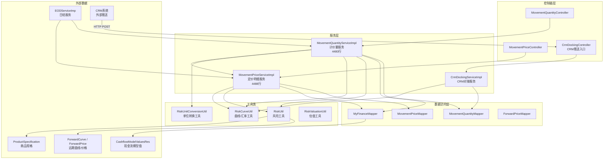
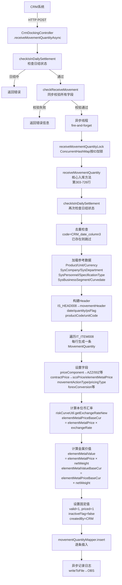
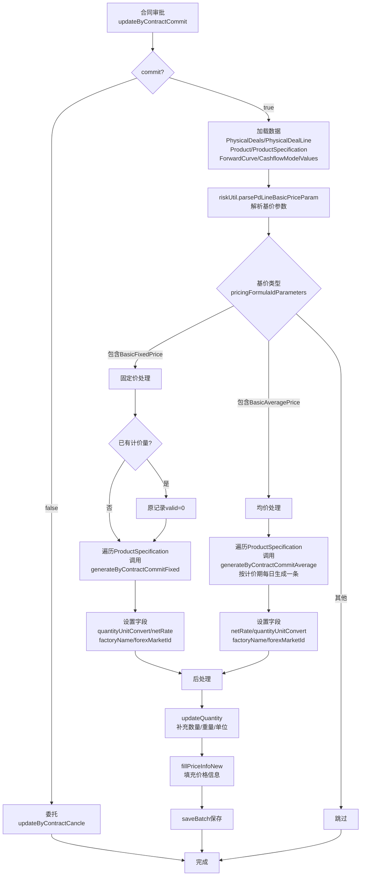
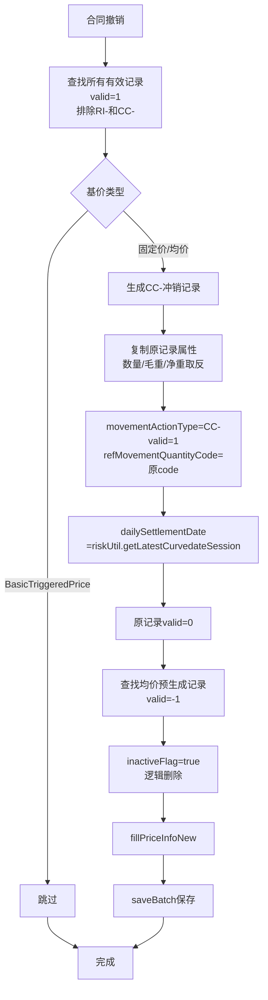
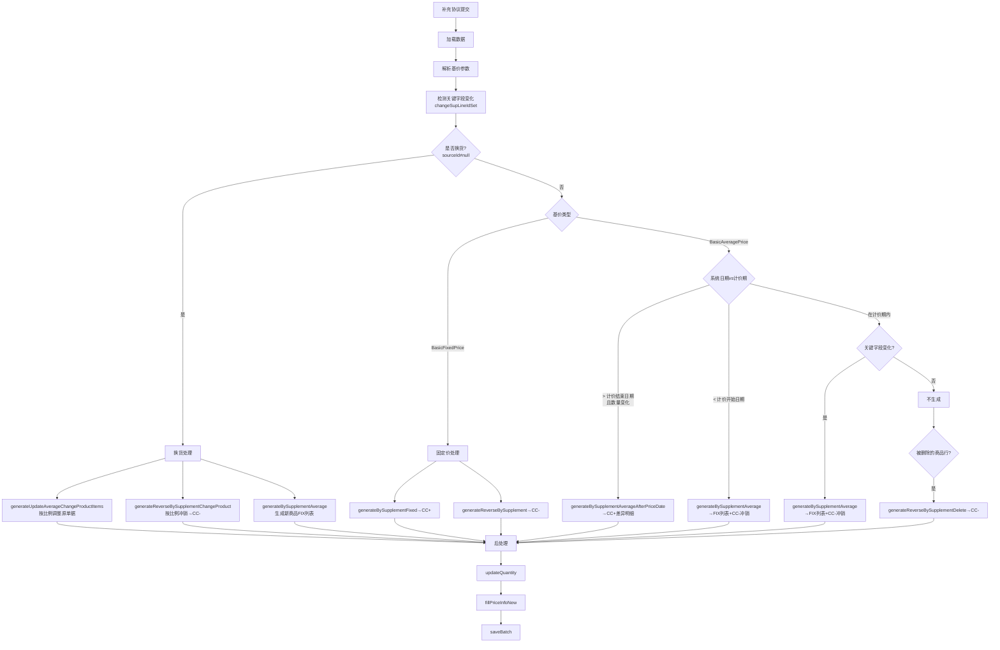
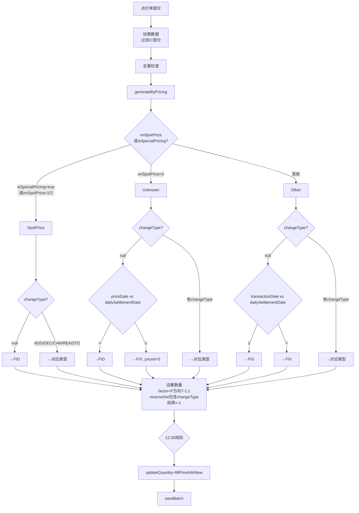
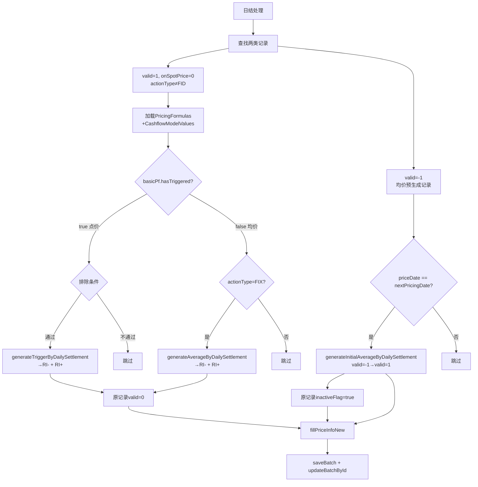
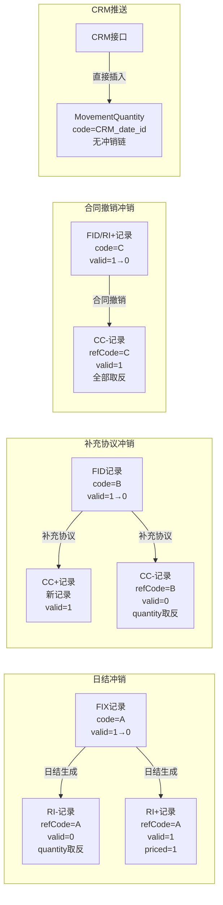

# 计价量模型（MovementQuantity）计算逻辑文档

> [!info] 文档信息
> - **生成日期**：2026-07-01
> - **源码位置**：`MovementQuantityServiceImpl.java`（4480行）
> - **关联文件**：`MovementPriceServiceImpl.java`（4488行）、`CrmDockingServiceImpl.java`
> - **关联文档**：[[定价明细MovementPrice生成逻辑文档]]

---

## 一、概述

> [!abstract] 功能说明
> 计价量模型（MovementQuantity）与定价明细（MovementPrice）是**平行结构**的两个系统：
> - **MovementPrice**：记录订单的**价格**变动历史（金额、升贴水、汇率等）
> - **MovementQuantity**：记录订单的**数量**变动历史（数量、毛重、净重等）
>
> 两者共享相同的 `movementActionType` 枚举和业务触发时机，但分别维护各自的数据。
>
> 计价量的生成有**两条路径**：
> 1. **CTRM内部生成**：通过合同提交、补充协议、点价、日结等内部业务操作触发（`MovementQuantityServiceImpl`）
> 2. **CRM外部推送**：通过CRM系统接口直接推送产成品现货计价量（`CrmDockingServiceImpl`），不依赖现金流模型

### 1.1 核心字段说明

| 字段 | 类型 | 说明 |
|------|------|------|
| `movementActionType` | String | 操作类型：FID / FIX / RI+ / RI- / CC+ / CC- / ADD / DEC / CAN / REA / STO |
| `valid` | Integer | 生效状态：1-生效，0-失效（被冲销），-1-待日结更新 |
| `priced` | Integer | 计价状态：1-已计价，0-未计价 |
| `onSpotPrice` | Integer | 定价方式：0-Unknown，1-On Spot Price，2-Known |
| `quantity` | Double | 计价数量（经过单位转换后的值） |
| `sourceQuantity` | BigDecimal | 原始数量（quantity的BigDecimal副本） |
| `grossWeight` | Double | 毛重 = quantity × levelRate |
| `netWeright` | Double | 净重 = grossWeight × netRate |
| `levelRate` | Double | 品位率（来自商品规格 ProductSpecification.defaultValue） |
| `netRate` | Double | 净率/收率（Yield，来自商品规格中Yield类型的defaultValue） |
| `quantityUnitConvert` | BigDecimal | 重量单位转换系数（分子单位/分母单位） |
| `unitConversion` | BigDecimal | 结算单位到KG的转换系数 |
| `scoPrice` | BigDecimal | 计价价格（元素金属价格） |
| `elementMetalPrice` | BigDecimal | 元素金属价格 |
| `elementMetalValue` | BigDecimal | 元素金属价值 = netWeight × elementMetalPrice |
| `fixationPrice` | BigDecimal | 点价价格（来自关联的MovementPrice） |
| `dataSource` | String | 数据来源：`CTRM`（内部生成）或 `CRM`（外部推送） |
| `refMovementQuantityCode` | String | 关联计价量编码，用于冲销引用链 |
| `refDocumentType` | Integer | 关联单据类型：1-现货，2-长协，3-补充协议，4-点价记录 |

### 1.2 数量计算核心公式

```
quantity = 原始数量 × 买卖方向因子(P/S) × 单位转换系数
grossWeight = quantity × levelRate（品位率）
netWeight = grossWeight × netRate（净率/收率）
elementMetalValue = netWeight × elementMetalPrice
```

---

## 二、系统架构总览

### 2.1 服务类关系



### 2.2 方法调用总览（CTRM内部路径）

```mermaid
flowchart TB
    subgraph 公开入口方法
        A1[updateByContractCommit<br/>合同审批]
        A2[updateByContractCancle<br/>合同撤销]
        A3[updateBySupplementCommit<br/>补充协议提交]
        A4[updateBySupplementCancle<br/>补充协议撤销]
        A5[updateByPricingCommit<br/>点价提交]
        A6[updateByDailySettlement<br/>日结处理]
        A7[updateMissingPriceByDailySettlement<br/>补填缺失价格]
    end

    subgraph 私有生成方法-合同
        B1[generateByContractCommitFixed<br/>固定价→FID]
        B2[generateByContractCommitAverage<br/>均价→FIX列表]
    end

    subgraph 私有生成方法-补充协议
        C1[generateBySupplementFixed<br/>固定价→CC+]
        C2[generateBySupplementAverage<br/>均价→FIX列表]
        C3[generateBySupplementAverageAfterPriceDate<br/>计价期后→CC+]
        C4[generateReverseBySupplement<br/>冲销→CC-]
        C5[generateReverseBySupplementDelete<br/>删除冲销→CC-]
        C6[generateReverseBySupplementChangeProduct<br/>换货冲销→CC-]
        C7[generateUpdateAverageChangeProductItems<br/>换货比例调整]
    end

    subgraph 私有生成方法-点价
        D1[generateByPricing<br/>点价→FID/FIX/ADD/DEC等]
        D2[generateByPricingForIC<br/>IC点价]
    end

    subgraph 私有生成方法-日结
        E1[generateTriggerByDailySettlement<br/>点价日结→RI-+RI+]
        E2[generateAverageByDailySettlement<br/>均价日结→RI-+RI+]
        E3[generateInitialAverageByDailySettlement<br/>均价初始→激活]
    end

    subgraph 后处理方法
        F1[updateQuantity<br/>补充数量/重量/单位]
        F2[fillPriceInfoNew<br/>填充价格/汇率/金属价]
    end

    A1 --> B1
    A1 --> B2
    A1 --> F1
    A1 --> F2

    A2 --> C4
    A2 --> F2

    A3 --> C1
    A3 --> C2
    A3 --> C3
    A3 --> C4
    A3 --> C5
    A3 --> C6
    A3 --> C7
    A3 --> F1
    A3 --> F2

    A5 --> D1
    A5 --> F1
    A5 --> F2

    A6 --> E1
    A6 --> E2
    A6 --> E3
    A6 --> F2
```



---

## 三、CRM外部推送路径（产成品现货计价量）

> [!important] 独立于CTRM内部流程的第二条路径
> CRM系统通过HTTP接口直接推送计价量数据，**不依赖现金流模型**，所有字段值直接从接口参数中获取。

### 3.1 接口信息

| 项目 | 值 |
|------|------|
| **入口** | `CrmDockingController.receiveMovementQuantityAsync` |
| **URL** | `POST /receiveMovementQuantityAsyn` |
| **实现** | `CrmDockingServiceImpl.receiveMovementQuantity`（第303行） |
| **请求DTO** | `MovementQuantityReq`（IS_HEAD008 + List\<IT_ITEM008\>） |
| **响应DTO** | `MovementQuantityResponse`（ET_RTN008） |
| **数据来源** | `dataSource = "CRM"` |

### 3.2 调用链总览



### 3.3 请求数据结构

#### IS_HEAD008（请求头）

| 字段 | 说明 | 映射到MovementQuantity |
|------|------|----------------------|
| `ID` | 唯一标识 | 用于并发锁 |
| `date` | 计价量日期（yyyy-MM-dd） | `dailySettlementDate` |
| `contractNumber` | 点价单ID | 仅校验用 |
| `contractLineNumber` | 点价单行号 | `refContractNumber` |
| `productCode` | SAP物料编码 | `productId`（通过code查找） |
| `quantity` | 金属数量 | `quantity` |
| `unitCode` | 数量单位编码 | `pdQuantityUnitId`（通过code查找） |
| `psFlag` | 买卖方向：0=采购，1=销售 | `psFlag`：0→"P"，1→"S" |
| `factoryCode` | 工厂编码 | `factoryCode` |

#### IT_ITEM008（请求行，每行生成一条记录）

| 字段 | 说明 | 映射到MovementQuantity |
|------|------|----------------------|
| `priceComponent` | 合金代码 | `priceComponent`（cu→AZZ, zn→00Z, pb→04Z, ti→01Z, al→03Z, ag→12Z, ni→02Z） |
| `netWeight` | 合金数量 | `netWeright` 和 `grossWeight`（两者都设为此值） |
| `priceDate` | 价格生成日期 | `priceDate` |
| `contractPrice` | 合同价格 | `scoPrice` 和 `elementMetalPrice`（两者都设为此值） |
| `taxRate` | 税率代码 | `taxCodeId`（通过name查找） |
| `contractQuantityUnitCode` | 合约数量单位 | `contractQuantityUnitId` 和 `pdQuantityUnitId` |
| `contractCurrencyCode` | 合约币种 | `contractCurrencyId` 和 `settlementCurrencyId` |
| `forexMarket` | 外汇市场ID | `forexMarketId` |
| `forexContractCode` | 外汇合约ID | `forexContractId` |
| `forexConversion` | 汇率 | `forexConversion` |
| `settlementCurrencyCode` | 结算币种 | `settlementCurrencyId` |
| `contractType` | 合同类型：1=现货，2=长协 | `contractType`：1→"Spot"，2→"LongTerm" |
| `businessType` | 业务类型 | `businessTypeId` |
| `pricingType` | 定价类型：1=固定/2=点价/3=均价 | `basicPriceFormulaId`：1→99，2→102，3→103 |
| `movementActionType` | 操作类型 | `movementActionType`（FID/FIX/RI-/RI+/STO/REA/ADD/CAN等） |
| `dataSource` | 数据来源 | `dataSource`（固定为"CRM"） |
| `legalEntityCode` | 公司代码 | `legalEntityId`（通过companyCode查找） |
| `businessDepartmentCode` | 部门代码 | - |
| `businessSegmentCode` | 业务板块代码 | `businessSegmentId`（SL/RS/RB/BA→查表获取ID） |
| `trader` | 员工工号 | `traderId`（通过jobNumber查找） |
| `column1` | session | `session`（Integer） |
| `column2` | 关联单据号 | `refContractNumber`（覆盖header的值） |
| `column3` | crmOnlyId | `crmOnlyId`，同时用于code生成：`CRM_date_column3` |

### 3.4 CRM推送与CTRM内部生成的关键区别

| 维度 | CTRM内部生成 | CRM外部推送 |
|------|-------------|-------------|
| **入口** | `MovementQuantityServiceImpl` 的各个 `updateBy*` 方法 | `CrmDockingServiceImpl.receiveMovementQuantity` |
| **数据来源** | `dataSource = "CTRM"` | `dataSource = "CRM"` |
| **价格来源** | 从现金流模型（`CashflowModelValuesRes`）、远期曲线（`ForwardPrice`）等计算 | 直接从接口参数 `contractPrice` 获取，赋值给 `scoPrice` 和 `elementMetalPrice` |
| **数量计算** | 经过 `updateQuantity` 方法处理单位转换、品位率、收率 | 直接使用接口传入的 `quantity` 和 `netWeight` |
| **后处理** | `updateQuantity` + `fillPriceInfoNew`（复杂的批量价格填充） | 仅计算本位币汇率和金属价值，无复杂后处理 |
| **code生成** | `idService.getIdByIdKey("movementQuantityCode")` | `"CRM" + "_" + date + "_" + column3` |
| **valid/priced** | 根据业务场景有不同值（-1/0/1） | 固定为 `valid=1, priced=1` |
| **执行方式** | 同步事务 | 校验同步 + 入库异步（`new Thread()`） |
| **并发控制** | Spring事务 | `ConcurrentHashMap` 按ID加锁 |
| **日结检查** | 由调用方控制 | 两次检查（入口+核心方法） |
| **去重** | 通过 `refContractNumber` 等字段 | 通过 `code`（CRM_date_column3）检查 |
| **毛重/净重** | `grossWeight = quantity × levelRate`，`netWeight = grossWeight × netRate` | `grossWeight = netWeight = 接口传入的netWeight` |
| **本位币汇率** | `fillPriceInfoNew` 批量计算 | `riskCurveUtil.getExchangeRateNew` 单条计算 |

### 3.5 CRM推送的元素价格映射

CRM传入的 `priceComponent`（合金代码）会被映射为系统内部的质检类型代码：

| CRM传入 | 系统内部 | 对应元素 |
|---------|---------|---------|
| `cu` | `AZZ` | 铜（Copper） |
| `zn` | `00Z` | 锌（Zinc） |
| `pb` | `04Z` | 铅（Lead） |
| `ti` | `01Z` | 钛（Titanium） |
| `al` | `03Z` | 铝（Aluminium） |
| `ag` | `12Z` | 银（Silver） |
| `ni` | `02Z` | 镍（Nickel） |

### 3.6 CRM推送的金属价值计算

```java
// 本位币汇率
exchangeRateToBaseCur = riskCurveUtil.getExchangeRateNew(
    publicationId,              // Bloomberg（或默认3）
    contractCurrencyId,         // 合约币种
    company.getBaseCurrency(),  // 本位币
    dailySettlementDate         // 计价量日期
);

// 本位币金属价格
elementMetalPriceBaseCur = elementMetalPrice × exchangeRateToBaseCur;

// 金属价值
elementMetalValue = elementMetalPrice × netWeight;
elementMetalValueBaseCur = elementMetalPriceBaseCur × netWeight;
```

### 3.7 CRM推送的业务板块映射

| CRM代码 | 业务板块全称 |
|---------|------------|
| `SL` | SL-SEMILAVORATI |
| `RS` | RS-Residui semilavorati per RS |
| `RB` | RB-Residui barre RB |
| `BA` | BA-BARRE |

### 3.8 注意事项

> [!warning] CRM推送特殊规则
> 1. **异步执行**：校验同步返回结果，入库在异步线程中执行，CRM只看到校验结果
> 2. **事务问题**：`receiveMovementQuantityLock` 在新线程中通过 `this.` 调用，Spring AOP代理可能无法拦截，`@Transactional` 可能不生效
> 3. **日结互斥**：日结运行中（`EODStatus = RUNNING`）拒绝接收CRM推送
> 4. **毛重=净重**：CRM推送中 `grossWeight` 和 `netWeight` 都设为接口传入的 `netWeight` 值，不经过品位率和收率计算
> 5. **code格式**：`CRM_yyyy-MM-dd_crmOnlyId`，用于去重
> 6. **不生成MovementPrice**：CRM推送只生成 MovementQuantity 记录，不会同步生成对应的 MovementPrice 记录

---

## 四、CTRM内部业务流程详解

### 4.1 合同提交流程

**入口方法**：`updateByContractCommit(List<Long> pdIds, Boolean commit)`（第201行）

> [!note] 流程说明
> 当 `commit=false` 时，会委托给 `updateByContractCancle()` 执行撤销逻辑。



#### 4.1.1 固定价合同提交 — `generateByContractCommitFixed`（第519行）

| 字段 | 取值逻辑 |
|------|----------|
| `movementActionType` | `FID`（固定初始交易） |
| `valid` | `1`（生效） |
| `priced` | `1`（已计价） |
| `onSpotPrice` | `1`（On Spot Price） |
| `quantity` | `pdLine.quantity × (P方向?-1:1)` |
| `levelRate` | `productSpecification.defaultValue`（品位率） |
| `dailySettlementDate` | `riskUtil.getCurveDate(legalEntityId)` |
| `priceDate` | `pd.contractDate` |
| `session` | `riskUtil.getLatestCurvedateSession().session`，默认3 |
| `refDocumentType` | Spot→1, 长协→2 |

#### 4.1.2 均价合同提交 — `generateByContractCommitAverage`（第582行）

**关键步骤**：
1. 从 `pricingFormulaIdParameters` 解析 `beginDate` / `endDate`
2. 调用 `riskUtil.getPricingDate(beginDate, endDate, forwardContractId)` 获取计价日期列表
3. 数量按天数均分：`quantity = pdLine.quantity / pricingDates.size()`
4. 对每个计价日生成一条记录，根据 `pricingDate` 与 `curveDate` 的关系设置不同状态：

| 条件 | movementActionType | valid | priced | onSpotPrice | dailySettlementDate |
|------|--------------------|-------|--------|-------------|---------------------|
| `pricingDate < curveDate` | FID | 1 | 1 | 1 | curveDate |
| `pricingDate == curveDate` | FIX | 1 | 0 | 0 | pricingDate |
| `pricingDate > curveDate` | FIX | -1 | 0 | 0 | pricingDate |

> [!warning] 12:30规则
> 如果生成的是 FIX 类型，且 `dailySettlementDate == curveDate`，且当前时间已过12:30，则 `dailySettlementDate` 调整为下一个工作日：
> ```java
> riskUtil.getLatestFinancialDate(76L, dailySettlementDate, 1, false)
> ```

---

### 4.2 合同撤销流程

**入口方法**：`updateByContractCancle(List<Long> pdIds)`（第424行）



**关键规则**：
- 排除 `RI-` 和 `CC-` 类型的记录（它们本身已经是冲销记录）
- 排除点价类型（`BasicTriggeredPrice`）
- CC- 冲销记录的 `quantity`、`grossWeight`、`netWeight` 全部取反（乘以-1）
- 均价预生成记录（`valid=-1`）直接标记为 `inactiveFlag=true`

---

### 4.3 补充协议提交流程

**入口方法**：`updateBySupplementCommit(List<Long> supplementIds)`（第696行）

> [!note] 复杂度说明
> 这是整个计价量系统中最复杂的方法（约400行），涉及换货、非换货、固定价、均价、计价期内/外等多种分支。



#### 均价关键字段（`changeSupLineIdSet`）

以下字段的变化会触发在计价期内重新生成计价量：

| 字段 | 说明 |
|------|------|
| `quantity` | 数量 |
| `quantityUnitId` | 数量单位 |
| `settlementCurrencyId` | 结算币种 |
| `productTaxCodeId` | 税率 |
| `spreadValue` | 升贴水值 |
| `spreadCurrencyId` | 升贴水币种 |
| `spreadUnitId` | 升贴水单位 |
| `spreadIsPercentage` | 升贴水是否百分比 |

---

### 4.4 点价单提交流程

**入口方法**：`updateByPricingCommit(List<Long> pricingIds, LocalDate date)`（第1770行）
**核心方法**：`generateByPricing`（第2233行）



**数量因子（factor）计算**：
```
factor = 1.0
if (psFlag == "P") factor *= -1       // 采购方向取反
if (changeType in {2,3,5}) factor *= -1  // DEC/CAN/STO 取反
quantity = priceTriggering.quantity × factor
```

---

### 4.5 日结处理流程

**入口方法**：`updateByDailySettlement(List<String> contractNumbers, LocalDate curveDate)`（第2695行）



#### 日结生成的记录对比

| 字段 | RI-（冲销） | RI+（新生效，点价） | RI+（新生效，均价） |
|------|------------|-------------------|-------------------|
| `movementActionType` | `RI_MINUS` | `RI_PLUS` | `RI_PLUS` |
| `valid` | `0` | `1` | `1` |
| `priced` | 保持原值 | `1` | `1` |
| `onSpotPrice` | 保持原值 | 保持原值 | `1` |
| `quantity` | `原quantity × -1` | `原quantity` | `原quantity` |
| `grossWeight` | `原grossWeight × -1` | 保持原值 | 保持原值 |
| `netWeight` | `原netWeight × -1` | 保持原值 | 保持原值 |
| `refMovementQuantityCode` | `原code` | `原code` | `原code` |

---

## 五、后处理方法详解

### 5.1 `updateQuantity` — 补充数量/重量/单位（第2843行）

**处理步骤**（跳过 CC- 和 RI- 类型）：

1. **补充日结日期**：如果 `dailySettlementDate == null`，取 `riskUtil.getCurveDate()`
2. **补充业务板块**：根据 `oriProductId + factoryCode` 查找 `ProductFactoryBusiness`
3. **单位转换**：M（吨）→ KG，或不同商品间的主计量单位转换
4. **计算重量**：
   ```
   quantity = unitConversion × quantity
   grossWeight = quantity × levelRate（品位率）
   netWeight = grossWeight × netRate（净率/收率）
   ```
5. **设置合约信息**：从 `ForwardCurve` 获取 `contractCurrencyId` 和 `contractQuantityUnitId`

### 5.2 `fillPriceInfoNew` — 填充价格信息（第3969行）

**核心计算逻辑**（跳过 FIX 和 RI- 类型）：

1. **设置本位币**：从 `SysCompany` 获取 `baseCurrency`
2. **获取关联定价明细**：通过 `physicalDealLineId + movementActionType + priceDate + valid + priced` 匹配 MovementPrice
3. **计算点价价格**：`fixationPrice = movementPrice.settlementNetPrice / unitConversion`
4. **确定最终定价日期**：从 `dailySettlementDate` 向前找到最近的有价格的交易日
5. **获取结算币种到本位币汇率**：`riskCurveUtil.getExchangeRateNew(...)`
6. **获取当前元素价格**：按 `productId + specificationTypeId` 查找，优先匹配工厂分类
7. **计算元素金属价值**：`elementMetalValue = netWeight(KG) × elementMetalPrice × yield`
8. **计算计价价格（scoPrice）**：
   - Z002/Z003商品：使用 `riskUtil.getScoPrice()` 获取
   - 其他：从关联的 MovementPrice 获取 `basePrice`

---

## 六、冲销引用链关系



---

## 七、完整操作对照表

| 操作 | 基价类型 | 条件 | 生成类型 | valid | priced | 数量来源 | dataSource |
|------|----------|------|----------|-------|--------|----------|------------|
| **CRM推送** | - | 接口直传 | 接口指定 | 1 | 1 | 接口直传 | **CRM** |
| 合同提交 | 固定价 | - | **FID** | 1 | 1 | pdLine.quantity | CTRM |
| 合同提交 | 均价 | - | **FIX**（每日一条） | -1/1 | 0/1 | pdLine.quantity / 天数 | CTRM |
| 合同提交 | 点价 | - | 不生成 | - | - | - | - |
| 点价提交 | - | onSpotPrice=1/2, changeType=null | **FID** | 1 | 1 | priceTriggering.quantity | CTRM |
| 点价提交 | - | onSpotPrice=1/2, changeType=ADD | **ADD** | 1 | 1 | priceTriggering.quantity | CTRM |
| 点价提交 | - | onSpotPrice=1/2, changeType=DEC | **DEC** | 1 | 1 | priceTriggering.quantity × -1 | CTRM |
| 点价提交 | - | onSpotPrice=0, priceDate < dailySettlementDate | **FID** | 1 | 1 | priceTriggering.quantity | CTRM |
| 点价提交 | - | onSpotPrice=0, priceDate ≥ dailySettlementDate | **FIX** | 1 | 0 | priceTriggering.quantity | CTRM |
| 日结处理 | 点价 | curveDate ≥ priceDate | **RI-** + **RI+** | 0/1 | -/1 | 原quantity取反/原quantity | CTRM |
| 日结处理 | 均价 | actionType=FIX | **RI-** + **RI+** | 0/1 | 0/1 | 原quantity取反/原quantity | CTRM |
| 补充协议 | 固定价 | - | **CC+** + **CC-** | 1/0 | 1/- | supplementLine.quantity | CTRM |
| 补充协议 | 均价 | 系统日期 > 计价结束日期 | **CC+**（差异） | 1 | 1 | 新旧数量差 | CTRM |
| 补充协议 | 均价 | 计价期内 且 关键字段变化 | **FIX** + **CC-** | -1/0 | 0/- | supplementLine.quantity / 天数 | CTRM |
| 合同撤销 | 固定价/均价 | - | **CC-** | 1 | - | 原quantity × -1 | CTRM |

---

## 八、关键依赖方法索引

### 8.1 RiskUtil 工具方法

| 方法 | 调用位置 | 功能 |
|------|----------|------|
| `getCurveDate(legalEntityId)` | 多处 | 获取当前曲线日期（交易日） |
| `getLatestCurvedateSession(legalEntityId)` | 多处 | 获取最新的曲线日期会话（含date和session） |
| `getPricingDate(beginDate, endDate, forwardContractId)` | 均价生成 | 获取计价日期列表（排除非交易日） |
| `getLatestFinancialDate(calendarId, date, offset, includeSelf)` | 12:30规则 | 获取最近的工作日 |
| `getPreAndNextWorkingDate(curveDate, null)` | 日结 | 获取前一和下一工作日 |
| `parsePdLineBasicPriceParam(pdLines)` | 多处 | 解析商品行的基价参数（JSON→Map） |
| `parseSupLineDtoBasicPriceParam(supLineDtos)` | 补充协议 | 解析补充协议行的基价参数 |
| `selectElementPrice(productIds, dates, null, 0)` | fillPriceInfoNew | 查询元素金属价格 |
| `getScoPrice(productId, date, legalEntityId)` | fillPriceInfo | 获取SCo价格 |

### 8.2 RiskCurveUtil 曲线工具方法

| 方法 | 调用位置 | 功能 |
|------|----------|------|
| `getExchangeRateNew(publicationId, fromCurrencyId, toCurrencyId, date)` | fillPriceInfoNew / **CRM推送** | 获取汇率 |
| `getBaseCurrency(legalEntityId)` | fillBasicInfo | 获取本位币 |
| `initExchangeMap(publicationIds, dates)` | fillPriceInfoNew | 预加载汇率数据 |

### 8.3 RiskUnitConversionUtil 单位转换方法

| 方法 | 调用位置 | 功能 |
|------|----------|------|
| `getUnitConversion(fromUnitId, toUnitId)` | 多处 | 获取单位转换系数 |
| `getUnitConversionNew(fromUnitId, toUnitId, productId)` | fillPriceInfoNew | 获取单位转换系数（新版） |

### 8.4 MyFinanceMapper 现金流查询

| 方法 | 调用位置 | 功能 |
|------|----------|------|
| `selectCashModelValuesByPdLineId(pdLineIds)` | 合同提交/日结/fillPriceInfo | 查询现金流模型主值 |
| `selectCashflowModelPricingDetailsByPdLineId(pdLineIds)` | fillPriceInfo/fillPriceInfoNew | 查询现金流定价行明细 |

---

## 九、MovementQuantity 与 MovementPrice 的对比

| 维度 | MovementQuantity（计价量） | MovementPrice（定价明细） |
|------|---------------------------|--------------------------|
| **核心关注** | 数量、重量、金属价值 | 价格、升贴水、汇率、金额 |
| **服务类** | MovementQuantityServiceImpl | MovementPriceServiceImpl |
| **行数** | 4480行 | 4488行 |
| **数量计算** | `quantity × levelRate → grossWeight × netRate → netWeight` | `quantity`（直接使用合同数量） |
| **价格来源** | `riskUtil.selectElementPrice` / `movementPrice.basePrice` / **CRM直传** | `CashflowModelValues` / `ForwardPrice` / `PriceTriggering` |
| **单位转换** | 结算单位→KG，考虑商品规格 | 合约单位→结算单位 |
| **后处理** | `updateQuantity` + `fillPriceInfoNew` | `fillBasicInfo` + `fillPriceInfo` / `fillPriceInfoNew` |
| **IC处理** | `generateByPricingForIC` | `generateByPricingForIC` + `fillPriceInfoForIC` |
| **CRM推送** | ✅ 支持（`CrmDockingServiceImpl`） | ❌ 不支持 |
| **关联关系** | `movementPriceId` 指向 MovementPrice | 通过 `physicalDealLineId + actionType + priceDate` 被查找 |

---

## 十、注意事项

> [!warning] 重要规则
> 1. **点价类型（BasicTriggeredPrice）** 在合同提交和补充协议提交时都不生成计价量，只在日结处理时生成 RI-/RI+
> 2. **均价预生成记录**（valid=-1）在合同撤销时被标记为 `inactiveFlag=true`，而不是生成 CC-
> 3. **12:30规则**：点价/均价生成 FIX 类型时，如果 `dailySettlementDate == curveDate` 且当前时间已过12:30，`dailySettlementDate` 会调整为下一个工作日
> 4. **数量因子**：P（采购）方向的数量会乘以-1；DEC/CAN/STO 变更类型也会乘以-1
> 5. **CC- 和 RI- 跳过**：`updateQuantity` 和 `fillPriceInfoNew` 都会跳过冲销类型记录
> 6. **fillPriceInfoNew 跳过 FIX 和 RI-**：未计价的 FIX 和冲销的 RI- 不需要填充价格
> 7. **均价计价期后补充协议**：CC+ 差异明细的 `scoPrice` 和 `elementMetalPrice` 取已计价记录的**平均值**
> 8. **换货比例计算**：`proportion = 新数量 / 原数量`，冲销量 = `proportion × 汇总量 × -1`
> 9. **日结触发时机**：手动触发，不是定时任务自动执行
> 10. **IC点价**：通过 `updateByPricingCommitForIC` 单独处理，排除 Normal 类型，只处理 BTO/BTS
> 11. **CRM推送**：不依赖现金流模型，所有价格/数量字段直接从接口参数获取，`grossWeight = netWeight = 接口传入的netWeight`
> 12. **CRM推送异步**：校验同步返回，入库在异步线程执行，`@Transactional` 在新线程中可能不生效
> 13. **CRM推送只生成MovementQuantity**：不会同步生成对应的 MovementPrice 记录
