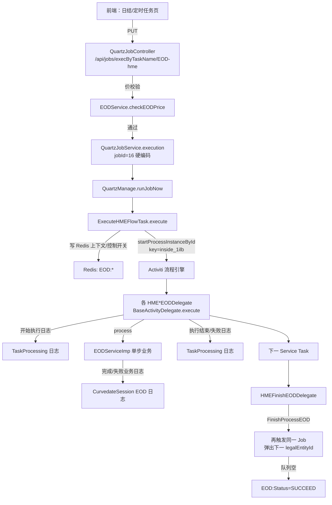
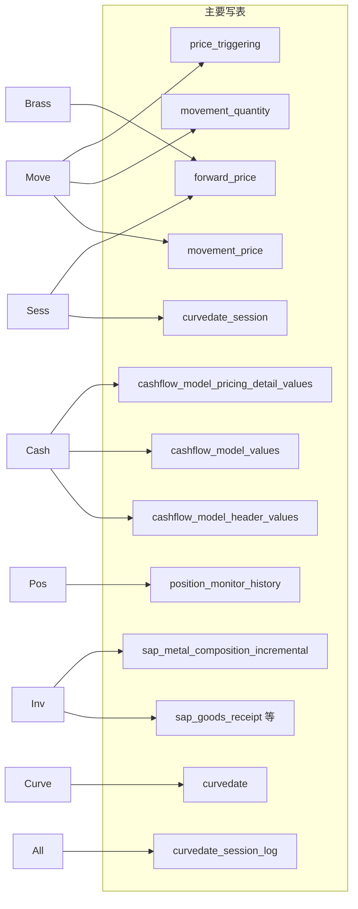

# HME 日结（EOD）运行时指南

> 面向新开发：从页面触发到 Activiti Service Task，再到各 `*EODDelegate.process` 与 `EODServiceImp` 业务落点。  
> 切入点类：`HMEBrassScorporoEODDelegate`（注解 `@BaseActivityAnnotation`，实现 `process`）。  
> 配套可视化：[`diagrams/eod-hme-runtime.html`](./diagrams/eod-hme-runtime.html)

---

## 一、总调用图（先给全局）



**说明：** BPMN 定义（processDefinitionKey=`inside_1ilb`）不在本仓库源码中，部署在 Activiti 库表。下文「建议步骤顺序」按业务语义与控制开关推导，**精确节点顺序请以环境中 BPMN / Activiti 流程设计器为准**。

---

## 二、入口定位（接口层）

| 项 | 值 |
|---|---|
| 前端页面 | 定时任务 / 日结操作页（调用 jobs API；本仓库为后端） |
| API | `PUT /api/jobs/execByTaskName/{name}`，且 `name` 必须为 `EOD-hme` |
| Controller | `com.resrun.modules.quartz.rest.QuartzJobController#executionEODHme` |
| 关联业务页 API | `/api/curvedateSession/*`（交易小节、行情导入、查日志）——**准备/查询**用，**不直接启动** Activiti 日结流 |

入口关键动作：

1. 解析 body：`date` → `curveDate`，可选 `nextDate`、`legalEntityIds` 等。
2. `eodService.checkEODPrice(checkPriceDate)`：结算价校验不通过则直接 `fail`，不启动任务。
3. 固定：`jobId = 16`，`key = "inside_1ilb"`，补齐 `userId` / `userName` / `systemContext`。
4. `quartzJobService.execution(quartzJob)` → 异步立刻跑 Job Bean。

状态查询：`GET /api/jobs/processingStatusByTaskName/EOD-hme` → `getEODStatus`（读 Redis `EOD:Status`）。

执行日志：`PUT /api/jobs/processingInfo`、`.../logs`（TaskProcessing 体系，对应 Delegate 里「开始执行 / 执行结束 / 执行错误」）。

---

## 三、执行链路总览（按调用层级）

1. **Controller** `executionEODHme` — 鉴权上下文、价校验、组装参数。
2. **Quartz** `QuartzJobServiceImpl.execution` → `QuartzManage.runJobNow` → `QuartzRunnable` 反射调用 Bean。
3. **编排入口** `ExecuteHMEFlowTask.execute(String args)`  
   - 置 `EOD:Status=RUNNING`  
   - 初始化 Redis 上下文与各 `EOD:control:*` 默认值  
   - 从 `EOD:LegalEntityIds` 弹出一个机构写入 `EOD:LegalEntityId`  
   - `runtimeService.startProcessInstanceById(pd.getId(), ...)`
4. **Activiti** 按 BPMN 顺序调度每个 Service Task。
5. **Delegate 模板** `BaseActivityDelegate.execute`（所有 EOD 步骤共用）：  
   `initContext` → `afterInit` → **开始执行日志** → `process` → **执行结束日志** → `processAfter`；异常则写**执行错误**、任务状态 Error 并抛出。
6. **业务门面** `EODServiceImp.*`：从 Redis `initEodContext`，按对接配置 `EodControl` 开关决定是否真正执行，写业务 EOD 日志。
7. **收尾** `FinishProcessEOD`：标记本机构完成，再次 `execution` 同一 Job 处理下一机构；队列空则 `SUCCEED`。

---

## 四、分层调用链深度解析

### 4.1 接口入口层（Controller）

#### 4.1.1 `QuartzJobController.executionEODHme`

- **作用：** HME 日结唯一专用 HTTP 启动口；拒绝非 `EOD-hme` 的 name。
- **上下游：** 上游前端；下游 Quartz Job + `EODService.checkEODPrice`。
- **子方法/内部调用：**
  - **4.1.1.1 `EODService.checkEODPrice`**  
    - 作用：按 `EodCheckCurves` 等对接配置校验指定日结算价。  
    - 与父方法关系：失败则整次日结不启动。
  - **4.1.1.2 `QuartzJobService.findById(16L)` / `execution`**  
    - 作用：取 Job 并立刻执行。  
    - 与父方法关系：真正进入批处理编排。

### 4.2 业务编排层（Quartz + Activiti 启动）

#### 4.2.1 `ExecuteHMEFlowTask.execute`

- **业务目标：** 把前端参数落到 Redis，启动 Activiti 流程实例，并为 TaskProcessing 记一条总任务。
- **关键步骤：** 解析 `HMEProcessDefinitionParameter` → `initEODRedis` → `initEODControl` → 机构队列 pop → `startProcessInstanceById`。
- **关键上下文（Redis）：**

| Key | 含义 |
|---|---|
| `EOD:Status` | 0 Idle / -1 Failed / 1 Running / 2 Succeed / 3 TempComplete |
| `EOD:LegalEntityIds` | 待处理机构集合 |
| `EOD:LegalEntityId` | 当前机构 |
| `EOD:CurveDate` / `EOD:NextDate` / `EOD:PreDate` | 日结日、下一交易日等 |
| `EOD:UserId` / `EOD:UserName` / `EOD:JobId` / `EOD:Key` | 审计与回环触发 |
| `EOD:SystemContext` | 再次触发 Job 时复用的参数 JSON |
| `EOD:control:*` | 各步骤开关初值（运行时以对接配置 `EodControl` 为准） |
| `EOD:Finished:{date}-{legalEntityId}` | 该机构该日已完成标记 |

- **子方法：**
  - **4.2.1.1 `initEODRedis`** — 写入 SystemContext 与日期/用户键。
  - **4.2.1.2 `initEODControl`** — 若无键则默认写 `0`（关闭），避免 NPE；真正是否执行走对接配置。
  - **4.2.1.3 `addProcessingInfo`** — 创建 processingKey，供前端查「开始执行/失败」明细。

### 4.3 应用编排层（Delegate 模板）——「开始计算 / 计算失败」从哪来

#### 4.3.1 `BaseActivityDelegate.execute`（模板方法）

这是所有带 `@BaseActivityAnnotation` 的 Delegate 的**统一壳**：

```text
initContext(execution)
  → afterInit
  → setProcessBeforeLog   // 日志：开始执行.  + annotation.delegateDescription
  → internalProcess       // 调子类 process；catch → 执行错误 + Status=Error + 再抛
  → setProcessAfterLog    // 日志：执行结束.
  → processAfter          // 把 context 写回 Activiti variable systemContext
```

- **`@BaseActivityAnnotation(delegateDescription=...)`**：写入 TaskProcessing 日志的「任务名」。若 BPMN 配置了 `processingNode`，则优先用节点名（见 `BaseEODDelegate.afterInit`）。
- **注意：** 多个 HME Delegate 注解文案误写成 `"Fixation更新"`（拷贝残留）；**以类名 + `EODService` 方法 + 日志 START/END 为准**。

#### 4.3.2 `BaseEODDelegate`

- 注入静态 `EODService` / `RedisUtils` / `EODUtils`。
- `afterInit`：解析 BPMN 上的 `mode`、`processingNode` 等到 `BaseActivityContext`。
- 子类只需覆盖 `process`，做「自己那一步」。

#### 4.3.3 以 `HMEBrassScorporoEODDelegate` 为样例

```17:28:bcadmin-system/src/main/java/com/resrun/modules/eod/delegate/HMEBrassScorporoEODDelegate.java
@BaseActivityAnnotation(delegateDescription ="Fixation更新")
public class HMEBrassScorporoEODDelegate extends BaseEODDelegate {
    @Override
    public BaseEODDelegate process(DelegateExecution execution, BaseActivityContext context) {
        StopWatch sw = new StopWatch();
        sw.start("movement计算TASK");
        log.info("Tube/Special Brass Scorporo Price COMPUTE TASK - START");

        _eodService.ComputeBrassScorporoHMEEOD(context);
        // ...
```

- **做什么：** 日结黄铜/特殊管 Brass Scorporo 价格计算与价格复制。
- **怎么做：** 调 `ComputeBrassScorporoHMEEOD`；类内另有未使用的 `internalProcess`（死代码，真正异常处理在父类）。
- **依赖上下文：** Redis 中的 `legalEntityId`、`curveDate`、`nextDate`；开关 `EOD:control:ComputeBrassScorporo`（对接配置值需为 `"1"`）。

`ComputeBrassScorporoHMEEOD` 业务落点：

1. 开关关闭 → 静默 return。  
2. `forwardPriceService.calculateCurvePrice(curveDate, null, "endOfDay")`  
3. `copyComplicatePrice` / `copyMarginPriceToZeroSession` / `copyMarginPrice`（当日 session0 → 次日 session1）  
4. 成功/失败写 CurvedateSession EOD 日志（`${kslangcode.eod.ComputeBrassScorporo.完成|失败}`）。

**两层日志对照：**

| 层级 | 来源 | 文案 |
|---|---|---|
| 流程任务日志 | `BaseActivityDelegate` | 「开始执行.」「执行结束.」「执行错误…」 |
| 业务日结日志 | `EODServiceImp` + `_EodLogService` | 「完成 / 失败」类 i18n |

### 4.4 业务实现层（EODService）— HME 步骤一览

下表按**建议业务顺序**排列（推导依据：先锁价/算价，再 Movement/现金流/持仓/库存，再推进 Session，再解锁与系统日期，最后 Finish 驱动多机构循环）。**请用环境 BPMN 核对。**

| 建议序 | Delegate | `process` → Service | 控制开关（对接 EodControl） | 业务摘要 |
|---|---|---|---|---|
| 1 | `HMEFixationLockEODDelegate` | `FixationLockEOD` | `EOD:control:lock` | 推 CRM/SAP：EOD 进行中锁定（session=1, eod=0） |
| 2 | `HMEBrassScorporoEODDelegate` | `ComputeBrassScorporoHMEEOD` | `EOD:control:ComputeBrassScorporo` | 曲线价计算 + 价格复制 |
| 3 | `HMELMEScorpCheckEODDelegate` | `LMEScorpCheckEOD` | `EOD:control:LMEScorpCheck` | 当前实现主要为校验完成日志 |
| 4 | `HMEMovementEODDelegate` | `UpdateMovementEOD` | `EOD:control:movement` | 定价明细/计价量日结更新 |
| 5 | `HMEContractCashflowEODDelegate` | `UpdateContractHMEEOD` | `EOD:control:cashflow` | 有效合同现金流重算 |
| 6 | `HMEPositionMonitorEODDelegate` | `UpdatePositionMonitorEOD` | `EOD:control:PositionMonitor` | 持仓监控历史日结数据 |
| 7 | `HMEInventoryReportEODDelegate` | `UpdateInventoryReportEOD` | `EOD:control:inventoryReport` | SAP 库存报表增量写入 |
| 8 | `HMEMetalBullitinoEODDelegate` | `UpdateMetalBullitino` | （实现体为空） | 占位，无实质逻辑 |
| 9 | `HMESessionEODDelegate` | `UpdateSecondSessionEOD` | 无开关（必跑逻辑） | 推进到 session=2，复制 C1→S 价格 |
| 10 | `HMEFixationUnlockEODDelegate` | `FixationUnlockEOD` | `EOD:control:lock` | 推 CRM/SAP：日结完成解锁（session=2, eod=1） |
| 11 | `HMECurvedateEODDelegate` | `updateCurveDate` | `EOD:control:updateCurveCate` | 全机构都日结完才推进系统曲线日 |
| 12 | `HMEFinishEODDelegate` | `FinishProcessEOD` | 无 | 写完成日志、`TEMP_COMPLETE`、再触发 Job 处理下一机构 |

#### 4.4.1 `FinishProcessEOD`（多机构循环关键）

- **业务目标：** 单机构流程走完后，驱动下一家，而不是前端多次点击。
- **关键步骤：**  
  1. 日志「日结操作已完成」  
  2. `EOD:Status = TEMP_COMPLETE`  
  3. `EOD:Finished:{curveDate}-{legalEntityId}=1`，删当前 `EOD:LegalEntityId`  
  4. 用 Redis 中的 SystemContext 再次 `quartzJobService.execution`  
  5. 下次 `ExecuteHMEFlowTask` pop 下一机构；若无机构则 `SUCCEED`

### 4.5 数据访问层（落点示例）

| Service 方法 | 主要落点 |
|---|---|
| `ComputeBrassScorporoHMEEOD` | ForwardPrice / Margin 相关表（经 `ForwardPriceService`） |
| `UpdateMovementEOD` | `MovementPrice` / `MovementQuantity` |
| `UpdateContractHMEEOD` | 现金流引擎 `_a157.a1208` + 合同查询 `EODMapper` |
| `UpdateSecondSessionEOD` | `curvedate_session` 表 insert/update |
| `updateCurveDate` | `curvedate` 系统日期表 + Redis `CurveDate*` |
| `FixationLock/Unlock` | 外部 CRM / SAP 推送（无本地主业务表写） |
| 任务日志 | TaskProcessing 相关表（开始/结束/错误） |
| 业务日结日志 | CurvedateSession EOD Log |

### 4.6 与「交易小节」页面的关系

| 能力 | API | 是否启动 Activiti 日结流 |
|---|---|---|
| 列表/最新 Session | `GET /api/curvedateSession/list` 等 | 否 |
| 更新交易小节 | `POST .../updateMultiSession` | 否（改 Session + 可推 CRM） |
| 行情导入 | `POST .../importForwardPrice` | 否（日结前置准备） |
| 日结日志查询 | `GET .../selectLogList` | 否（看结果） |
| **启动日结批处理** | **`PUT /api/jobs/execByTaskName/EOD-hme`** | **是** |

典型操作顺序（业务侧）：确认 Session/行情就绪 → 点日结执行（jobs API）→ 轮询 `processingStatusByTaskName` / 看 TaskProcessing 与 CurvedateSession 日志。

---

## 五、非 HME 通用 EOD Delegate（对照）

同包还有合同/单据/租船/衍生品/存贷款/银行授信、SAP 主数据拉取、快照生成等 Delegate（如 `ContractEODDelegate`、`PullCustomerDelegate`、`GenerateEODDelegate`），走同一 `BaseActivityDelegate` 模板，但由**其他** processDefinitionKey / Job 编排。HME 日结以 `HME*` + `inside_1ilb` + `EOD-hme` 为准。

---

## 六、新开发接入清单

1. **加一步：** 新建 `XxxEODDelegate extends BaseEODDelegate`，注解描述写清楚；`process` 只调 `EODService` 一个方法；在 `EODServiceImp` 内 `initEodContext` + 开关 + try/catch 写业务日志。  
2. **挂流程：** 在 Activiti 设计器把 Bean/类挂到 `inside_1ilb`（或新流程）对应 Service Task；勿只改 Java 不改 BPMN。  
3. **开关：** 在对接配置 `EodControl` 增加 `EOD:control:xxx`，并在 `ExecuteHMEFlowTask.initEODControl` 补默认值（可选）。  
4. **验证：** 价校验通过 → 任务日志出现「开始执行」→ 业务日志完成/失败 → Finish 后下一机构或 SUCCEED。  
5. **勿依赖** 类里重复的 `internalProcess`/`afterInit` 空实现（多为拷贝残留，真正模板在父类）。

---

## 七、关键源码索引

| 文件 | 角色 |
|---|---|
| `quartz/rest/QuartzJobController.java` | HTTP 入口 `EOD-hme` |
| `quartz/task/ExecuteHMEFlowTask.java` | Redis + 启动 Activiti |
| `activiti/BaseActivityDelegate.java` | 开始/结束/失败日志模板 |
| `activiti/BaseActivityAnnotation.java` | 任务显示名 |
| `eod/BaseEODDelegate.java` | EOD 公共注入与 afterInit |
| `eod/delegate/HME*.java` | 各步骤薄封装 |
| `eod/EODServiceImp.java` | 真实业务 |
| `business/rest/CurvedateSessionController.java` | 小节与日志页面 API |

可视化总览请打开：`proj-context/diagrams/eod-hme-runtime.html`（含逐步计算与落库展开）。

---

## 八、各步骤深度：计算了什么、目的、落哪些表

> 约定：几乎每步都会写 **`curvedate_session_log`**（业务日结日志）。下表「写表」列只列**业务主表**；开关读自 **`abutment_config` / `abutment_config_details`**（`EodControl`）。  
> **重要现状：** Brass 相关若干「算价/复制」落库代码在 `ForwardPriceServiceImpl` 中**已被注释**，运行时可能只写 Margin 的 `copyMarginPrice` 路径——下文已标明。

### 数据落库总览



### 8.1 FixationLock — `FixationLockEOD`

| 项 | 内容 |
|---|---|
| **目的** | 日结开始时通知 CRM/SAP：本机构进入 EOD 锁定（禁止外围再改价/点价类操作） |
| **计算/动作** | 组 `EodAndSessionRequest`：session=1，eodStatus=0，sessionStatus=0，curveDate=nextDate；推 CRM + SAP IT_ITEM065 |
| **读表** | `sys_company`；开关配置表 |
| **写表** | 仅 `curvedate_session_log`（本地无「锁表」字段） |
| **外部** | CRM `pushEodAndSession`、SAP `pushEodAndSessionToSap` |
| **开关** | `EOD:control:lock=1` |

### 8.2 Brass Scorporo — `ComputeBrassScorporoHMEEOD`

| 项 | 内容 |
|---|---|
| **目的** | 日终合成曲线价（Tube/Special Brass Scorporo）计算，并把 Margin 价格推进到下一小节 |
| **计算/动作** | ① `calculateCurvePrice(..., "endOfDay")`：读合成曲线公式（JEXL/priority）算合约日价；**`saveCurveForwardPriceData` 已注释 → 算完不落库** ② `copyComplicatePrice(curve→next, 0→1)`：**insert 循环已注释** ③ `copyMarginPriceToZeroSession`：**saveBatch/updateBatch 已注释** ④ `copyMarginPrice(curve→next, 0→1)`：**有效**，经 `copyPrice` insert/update |
| **读表** | `forward_contract`、`forward_curve`、`forward_composite_curve`、`curve_formula_ranges`、`forward_price` |
| **写表（当前有效）** | **`forward_price`**（Margin 合约，session 0→1 / date curveDate→nextDate） |
| **开关** | `EOD:control:ComputeBrassScorporo=1` |

### 8.3 LME Scorp Check — `LMEScorpCheckEOD`

| 项 | 内容 |
|---|---|
| **目的** | 名义上「金属价汇率 / scorporoPrice 检查完成」节点 |
| **计算/动作** | **无计算**；仅写两条成功日志 |
| **写表** | `curvedate_session_log` |
| **备注** | **占位空实现**；开关 `EOD:control:LMEScorpCheck` |

### 8.4 Movement — `UpdateMovementEOD`

| 项 | 内容 |
|---|---|
| **目的** | 日结刷新合同定价明细（价）与计价量（量），保证点价/均价 RI+/RI- 行与 Sco 价齐全 |
| **计算/动作** | ① 查本机构 status∈{APPROVED=2, CONTRACT_VARIATION=9} 合同号 ② `MovementPriceService.updateByDailySettlement`：点价/均价拆 RI+/RI-，旧行 valid=0，回写触发价 ③ `MovementQuantityService.updateByDailySettlement`：对称处理量 ④ `updateMissingPriceByDailySettlement`：补空 sco_price |
| **读表** | `physical_deals`、`movement_price`、`movement_quantity`、`pricing_formulas`、`cashflow_model_values`（取结算价/spread）、`price_triggering`、`forward_price` 等 |
| **写表** | **`movement_price`**、**`movement_quantity`**、**`price_triggering`**（点价回写） |
| **开关** | `EOD:control:movement=1` |

### 8.5 合同现金流 — `UpdateContractHMEEOD`

| 项 | 内容 |
|---|---|
| **目的** | 对 HME 有效物理合同重跑 PHYSICAL 现金流模型，刷新结算净价、spread、费用等模型值 |
| **计算/动作** | `getAllValidContractDataHME` 取合同行；过滤过期 Fixed/Average；按合同调 `_a157.a1208`（`isSave=true`，MODIFY） |
| **读表** | `physical_deals`、`physical_deal_line`、`contract_execution_monitor`、`receipt_delivery_details`、`movement_price`（触发价子查询）等 |
| **写表** | **`cashflow_model_header_values`**、**`cashflow_model_values`**、**`cashflow_model_pricing_detail_values`** |
| **开关** | `EOD:control:cashflow=1` |

### 8.6 持仓监控 — `UpdatePositionMonitorEOD`

| 项 | 内容 |
|---|---|
| **目的** | 按机构+基础金属生成当日持仓监控历史快照（期初/期末、LME/现货变动） |
| **计算/动作** | `getPositionMonitorMainReport` 聚合现货/期货/历史 → `saveOrUpdate` 按 (date, legalEntityId, baseMetal) |
| **读表** | `movement_quantity`、`futures_movement_quantity`、`position_monitor_history`（前日）、`curvedate_session`、fixation_adjustment 相关等 |
| **写表** | **`position_monitor_history`** |
| **开关** | `EOD:control:PositionMonitor=1` |
| **备注** | 日结路径写正式表；手动重算接口才写 `position_monitor_history_temp` |

### 8.7 库存报表 — `UpdateInventoryReportEOD`

| 项 | 内容 |
|---|---|
| **目的** | 从 SAP 拉当日库存相关单据落地，并异步拆分为金属元素增量表 |
| **计算/动作** | `inputInventoryBySap`：入库单 / 销售发票 / 废料再生产 / 分包商物料 → 写中间表 → 事件异步 `processAll` 写 incremental |
| **读表** | SAP 配置；处理时读各 `sap_*` 中间表、`sap_metal_composition_config` |
| **写表** | **`sap_goods_receipt`**、**`sap_sales_invoice`**、**`sap_recycle_scarp`**、**`sap_sub_matl_doc` / item**、**`sap_metal_composition_incremental`** |
| **外部** | SAP 四类接口 |
| **开关** | `EOD:control:inventoryReport=1` |
| **备注** | 本步**不**直接刷新 `sap_metal_composition_inventory`（需另有聚合任务） |

### 8.8 Metal Bollettino — `UpdateMetalBullitino`

| 项 | 内容 |
|---|---|
| **目的** | 历史预留：金属公报更新 |
| **计算/动作** | **方法体全部注释，无动作** |
| **写表** | 无 |

### 8.9 Session 推进 — `UpdateSecondSessionEOD`

| 项 | 内容 |
|---|---|
| **目的** | 在 nextDate 上创建 Session=2（日结后小节），并把 Margin 价从 session1 拷到 session2 |
| **计算/动作** | ① 作废 nextDate 上 session≥2 ② session=1 的 latest=-1 ③ insert session=2（status=2, latest=1）④ `copyComplicatePrice(1→2)` 写库已注释 ⑤ `copyMarginPrice("1","2")` **有效写** `forward_price` |
| **读表** | `curvedate_session`、`forward_curve`/`forward_contract`/`forward_price` |
| **写表** | **`curvedate_session`**、**`forward_price`**（Margin） |
| **开关** | 无（上下文缺 legalEntityId/nextDate 则跳过） |

### 8.10 FixationUnlock — `FixationUnlockEOD`

| 项 | 内容 |
|---|---|
| **目的** | 通知 CRM/SAP：日结完成，进入 Session=2 解锁态 |
| **计算/动作** | 推送 session=2，eodStatus=1，sessionStatus=1 |
| **写表** | 仅 `curvedate_session_log` |
| **外部** | CRM、SAP |
| **开关** | 与 Lock 共用 `EOD:control:lock` |

### 8.11 系统日期 — `updateCurveDate`

| 项 | 内容 |
|---|---|
| **目的** | **全机构**都出现 session=2（已日结）后，推进全局系统计价日 |
| **计算/动作** | Redis 记本机构 CurveDate；比对全部 enable 公司 vs 已日结集合；齐了才 `getPreAndNextWorkingDate` 更新 `curvedate` |
| **读表** | `sys_company`、`curvedate_session`、`curvedate` |
| **写表** | **`curvedate`**（date/prevDate 等） |
| **开关** | `EOD:control:updateCurveCate=1` |
| **备注** | 未齐只写「业务机构未全部日结」日志，不改系统日 |

### 8.12 Finish — `FinishProcessEOD`

| 项 | 内容 |
|---|---|
| **目的** | 标记本机构流程结束，串起下一机构的同一 Job |
| **计算/动作** | 日志完成 → Redis `TEMP_COMPLETE` + `EOD:Finished:{date}-{le}` → 删 LegalEntityId → 再 `quartzJobService.execution` |
| **读表** | `sys_quartz_job`（取 Job） |
| **写表** | `curvedate_session_log`；调度侧可能写 quartz 日志表 |
| **开关** | 无 |

---

### 按「真正改业务数据」优先级（排查问题时）

| 优先级 | 步骤 | 关键写表 |
|---|---|---|
| P0 | Movement / 现金流 / Session / 系统日 | `movement_*`、`cashflow_model_*`、`curvedate_session`、`curvedate` |
| P1 | Brass Margin 复制 / 持仓历史 / SAP 库存 | `forward_price`、`position_monitor_history`、`sap_*` |
| P2 | Lock/Unlock / Finish / LMECheck / MetalBullitino | 主要是日志或外部推送 / 空实现 |

---

## 九、深度相关源码

| 文件 | 角色 |
|---|---|
| `business/service/impl/ForwardPriceServiceImpl.java` | Brass 算价与价格复制（注意注释掉的落库） |
| `business/service/impl/MovementPriceServiceImpl.java` / `MovementQuantityServiceImpl.java` | 日结 Movement |
| `business/service/impl/PositionMonitorHistoryServiceImpl.java` | 持仓历史快照 |
| docking SAP 库存相关 Service | 库存报表拉取与 incremental |
