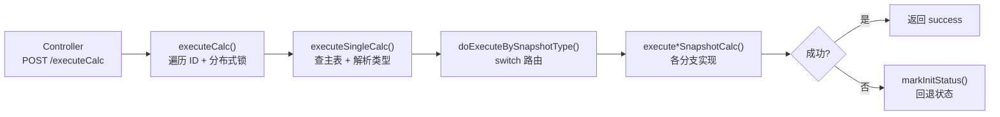
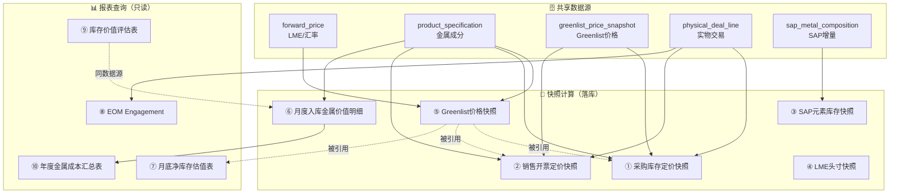

# 月结报表与快照计算 — 索引文档

> 本目录包含 HME 系统中所有月结快照计算和报表查询的调用链梳理文档，方便阅读和维护。

---

## 一、快照计算（6 种）

快照计算统一入口：`DataMainSnapshotServiceImpl.executeCalc()` → `doExecuteBySnapshotType()` 按类型路由。

| # | 文档 | 快照类型枚举 | 业务名称 | 核心逻辑概述 |
|---|------|-------------|---------|-------------|
| 1 | [01-采购库存定价快照计算.md](01-采购库存定价快照计算.md) | `PurchaseMetalSnapshot` | 采购库存定价快照 | 从采购库存定价报表取数 → 汇率换算 → 金属成分拆分 → Greenlist 估值 |
| 2 | [02-销售开票定价快照计算.md](02-销售开票定价快照计算.md) | `SalesMetalSnapshot` | 销售开票定价快照 | 从销售 Engagement 报表取数 → 汇率换算 → 金属成分拆分 → Greenlist 估值 |
| 3 | [03-SAP元素库存快照计算.md](03-SAP元素库存快照计算.md) | `SapInventorySnapshot` | SAP 元素库存快照 | 从 SAP 增量表取 B/C/D/E/H/A/F 类型数据 → 分组汇总 → Ending Stock |
| 4 | [04-LME头寸快照计算.md](04-LME头寸快照计算.md) | `LmeEngageSnapshot` | LME 头寸快照 | 从期货 Engagement 报表取已定价未交割数据 → 直接快照落库 |
| 5 | [05-Greenlist价格快照计算.md](05-Greenlist价格快照计算.md) | `GreenlistPriceSnapshot` | Greenlist 价格基底快照 | 加载 LME/汇率/金属成分/手工价 → 逐商品计算 Greenlist 单价 + Adder |
| 6 | [06-月度入库金属价值明细计算.md](06-月度入库金属价值明细计算.md) | `InventoryValueEvaluationSnapshot` | 月度入库金属价值明细 | 从库存价值评估表取数 → 金属成分拆分 + 估值计算 → 主表+明细子表落库 |

### 快照计算通用流程

---

## 二、报表查询（4 个）

这些是**只读报表**，不涉及快照落库，直接查询并返回计算结果。

| # | 文档 | Controller | 业务名称 | 核心逻辑概述 |
|---|------|-----------|---------|-------------|
| 7 | [07-月底净库存估值表.md](07-月底净库存估值表.md) | `EOMStorageController` | 月底净库存估值表 | 采购+销售+库存多源数据 → 金属成分拆分 → LME 估值 → 净库存汇总 |
| 8 | [08-EOM-Engagement月底已定价未交割.md](08-EOM-Engagement月底已定价未交割.md) | `EomEngagementReportController` | EOM Engagement（明细+汇总） | 期货 Engagement 数据 → 按机构/金属/合约汇总已定价未交割量 |
| 9 | [09-库存价值评估表查询.md](09-库存价值评估表查询.md) | `EOMStorageController` | 库存价值评估表 | 入库明细 + 定价数据 → 按会计月过账区间 → 库存条目估值 |
| 10 | [10-年度库存金属成本汇总表.md](10-年度库存金属成本汇总表.md) | `SnapshotMetalSummaryReportController` | 年度库存金属成本汇总表（EOM PMP Summary） | 从快照明细聚合 → 按机构+业务板块+金属维度汇总年度成本 |

---

## 三、快照与报表关系图

---

## 四、共享组件速查

| 组件 | 位置 | 用途 | 被谁使用 |
|------|------|------|---------|
| `DataMainSnapshotServiceImpl` | `service/impl/` | 快照调度：分布式锁 + 类型路由 | 所有快照 |
| `PurchaseSalesSnapshotDetailServiceImpl` | `service/impl/` | 采购/销售金属拆分计算 | ①② |
| `GreenlistPriceSnapshotServiceImpl` | `service/impl/` | Greenlist 价格计算引擎 | ⑤（也被①②⑦引用） |
| `InventoryValueEvaluationMetalCalcServiceImpl` | `service/impl/` | 入库金属成分+估值计算 | ⑥ |
| `EomCommittedStockValuationServiceImpl` | `service/impl/` | 月底净库存估值计算 | ⑦ |
| `FuturesRecordServiceImpl` | `service/impl/` | 期货 Engagement 数据查询 | ④⑧ |
| `EvaluationOfDetaileEntriesValueSnapshotServiceImpl` | `service/impl/` | 库存价值评估快照 | ⑥⑨ |
| `SnapshotMetalSummaryReportServiceImpl` | `service/impl/` | 年度金属成本汇总 | ⑩ |

---

## 五、公共数据加载模式

多个快照/报表共享以下数据加载逻辑：

| 数据 | 加载方法 | 来源表 | 使用者 |
|------|---------|--------|--------|
| Yield 折率 ID | `incrementalService.getYieldId()` | `specification_type` | ①②⑤⑥ |
| 顶层父商品映射 | `productService.getTopProductIdMap()` | `product` | ①②⑤ |
| 工厂-机构映射 | `abutmentConfigService.selectConfigDetailsByDockingMark("Factory")` | `abutment_config_details` | ①②⑤ |
| 前3交易日 | `dataMainSnapshotService.getPreThreeTradeDate()` | `special_calendar` | ①② |
| 商品大类 | `productCategoryService.getProductCategoryMapByProductIds()` | `product_category` | ①②⑤ |
| 金属成分比 | `greenlistPriceSnapshotMapper.splitMetalCommodityFactoryByProductId()` | `product_specification` + `forward_curve` | ①②⑤⑥ |
| Greenlist 价格 | `fillGreenListMap()` → `getGreenlistPriceSnapshotList()` | `greenlist_price_snapshot` | ①② |
| LME 结算价 | `purchaseSalesSnapshotDetailMapper.selectForwardPrice()` | `forward_price` | ⑤⑦ |
| USD→EUR 汇率 | `forward_curve_name = "USD-EUR-Bloomberg"` | `forward_price` | ⑤⑦ |
