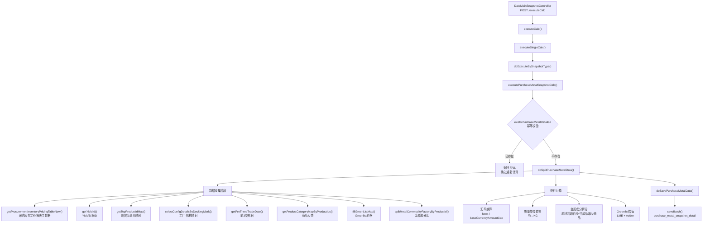

# 采购库存定价快照计算 — 调用链梳理

> **业务含义**：从采购库存定价报表拉取已定价未入库的数据，进行汇率换算、金属成分拆分、Greenlist 估值计算，生成快照明细落库。

---

## 一、调用链路图



---

## 二、数据收集阶段（核心）

### 2.1 主数据源：采购库存定价报表

**方法**：`receiptDeliveryDetailsService.getProcurementInventoryPricingTableNew(req)`

**SQL 结构**（MyReceiptDeliveryDetailsMapper.xml L2752-2905）：

```sql
-- 3个CTE + 主查询
WITH movement_data AS (
    -- 从 movement_price 按 physical_deal_line_id 汇总已定价数量
    SELECT physical_deal_line_id, SUM(quantity) 
    FROM movement_price 
    WHERE priced = 1
    GROUP BY physical_deal_line_id
),
document_check AS (
    -- 入库量：action_id=42, offset_flag='N', status IN (2,10), sap_push_status=2
    SELECT physical_deal_line_id, SUM(quantity)
    FROM document_items JOIN documents
    GROUP BY physical_deal_line_id
),
document_offset_check AS (
    -- 冲销量：offset_flag='Y'
    SELECT physical_deal_line_id, SUM(quantity)
    FROM document_items JOIN documents
    GROUP BY physical_deal_line_id
)
-- 主查询关联
SELECT ...
FROM physical_deal_line 
JOIN physical_deals ON ps_flag = 'P' AND contract_type != 'ShortTerm'
LEFT JOIN product, counterparty, currency, unit, sys_company
WHERE ABS(movement_qty) != ABS(doc_check_qty - offset_qty)  -- 只返回有差异的记录
```

**关键过滤条件**：
- `ps_flag = 'P'`：仅采购
- `contract_type != 'ShortTerm'`：排除短期合同
- 定价量与入库量存在差异（超过 0.01%）
- 排除 RB/RS 业务板块

### 2.2 辅助数据加载

| 步骤 | 方法 | 来源表 | 用途 |
|------|------|--------|------|
| ① | `getYieldId()` | `specification_type` | 查 name="Yield" 的 ID |
| ② | `getTopProductIdMap()` | `product` | 沿 parent_id 链追溯到顶层父商品 |
| ③ | `selectConfigDetailsByDockingMark("Factory")` | `abutment_config_details` | 机构ID→工厂代码映射 |
| ④ | `getPreThreeTradeDate()` | `special_calendar` | 前3个交易日（含当天） |
| ⑤ | `getProductCategoryMapByProductIds()` | `product_category` | Z001原材料/Z002半成品/Z003 Alloy |
| ⑥ | `fillGreenListMap()` | `greenlist_price_snapshot` | Greenlist 价格（当月→上月回退） |
| ⑦ | `splitMetalCommodityFactoryByProductId()` | `product_specification` + `forward_curve` | Cu/Ni/Sn/Ag/Al/Zn/Pb/Yield 占比 |

---

## 三、逐行计算逻辑

### 3.1 汇率换算（行 238-247）

```java
// 查 forward_price 表，Bloomberg 发布、settlement price、前3交易日最新
forex = getForeignExchangeRate(workDay, settlementCurrencyId, currencyId)
baseCurrencyAmountCac = amountInSettleCurrency ÷ forex  // 本位币金额
baseCurrencyAmountDiff = baseCurrencyAmountCac - amountInSettleCurrency
```

### 3.2 质量单位转换（行 250-260）

```java
// 吨→KG 转换率，用于 Greenlist 价格从 EUR/吨 → EUR/KG
converQuantityRate = riskUnitConversionUtil.getUnitConversion(tonUnitId, kgUnitId, productId)
```

### 3.3 金属成分拆分（行 267-326）

**核心业务规则**：
- **原材料（Z001）**：取**自身**商品的 `product_specification`
- **半成品（Z002）/成品/Alloy（Z003）**：取**顶层父商品**的 `product_specification`

```java
// 按工厂过滤（category 字段匹配 factoryLegalMap）
metalCommodityCompCounts = metalCommodityCompMap.get(productId)
    .filter(s -> s.category == factoryLegalMap.get(legalEntityId))

yieldValue = Yield折率
yieldMutQuantity = pricedButNotInStockKg × yieldValue  // 量先乘折率

// 对每种金属（Cu/Ni/Sn/Ag/Al/Zn/Pb）
for each metal:
    metalKg = metalPct × yieldMutQuantity  // 成分百分比 × 折后量
```

### 3.4 Greenlist 估值（行 334-345）

```java
// 从 greenlistPriceSnapshotMap 取 legalEntityId:productId 对应的数据
greenlistPrice = LmeForGreenlist ÷ converQuantityRate  // EUR/吨 → EUR/KG
lmeEquivalent = LmeEquivalent ÷ converQuantityRate
adder = Adder ÷ converQuantityRate

netias = baseCurrencyAmountCac - (adder × pricedButNotInStockKg)
netiasComm = pricedButNotInAmount1 - (adder × pricedButNotInStockKg)
netiasCommDiff = netiasComm - baseCurrencyAmountCac
```

---

## 四、落库

**目标表**：`purchase_metal_snapshot_detail`

**写入字段**：
- 基础信息：`data_main_snapshot_id`, `id`（雪花ID）, 法律实体, 交易对手, 合同号, 商品信息
- 量价数据：已定价未入库量(KG)、已入库量、已定价量、金额（结算币/本位币/EUR）
- 汇率：`forex`, `baseCurrencyAmountCac`, `baseCurrencyAmountDiff`
- 金属成分：Cu/Ni/Sn/Ag/Al/Zn/Pb 百分比 + 对应KG量
- Greenlist：`greenlistPrice`, `lmeEquivalent`, `adder`, `netias`, `netiasComm`, `netiasCommDiff`
- Yield折率

---

## 五、重要业务备注

1. **幂等保护**：计算前检查是否已存在明细，防止重复计算
2. **RB/RS 业务板块排除**：采购库存价值报表不统计 RB、RS 板块的商品
3. **原材料 vs 半成品的金属拆分策略不同**：原材料取自身 specification，半成品/成品/Alloy 取顶层父商品的 specification
4. **工厂维度过滤**：金属成分按 `category` 字段匹配工厂代码，同一商品不同工厂可能有不同成分配比
5. **Yield 折率**：数量先乘以折率再分配给各金属成分，Yield 本身不参与金属成分计算
6. **Greenlist 价格回退机制**：当月无数据时回退到上月
7. **汇率取值**：取前3个交易日内 Bloomberg 发布的最新 settlement price
8. **精度**：所有金额/比率统一保留5位小数，`HALF_UP` 舍入
9. **仅处理采购（P）且非短期合同**：SQL 中 `ps_flag = 'P'` 且 `contract_type != 'ShortTerm'`
10. **差异过滤**：只返回定价量与入库量存在差异的记录（差异超过 0.01%）
