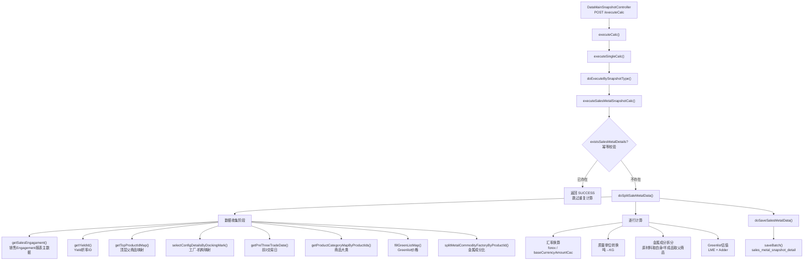

# 销售开票定价快照计算 — 调用链梳理

> **业务含义**：从销售 Engagement 报表拉取已定价未开票的数据，进行汇率换算、金属成分拆分、Greenlist 估值计算，生成快照明细落库。与采购快照逻辑高度相似，区别在于数据源和销售方向。

---

## 一、调用链路图



---

## 二、数据收集阶段（核心）

### 2.1 主数据源：销售 Engagement 报表

**方法**：`salesEngagamentAdjustdifferenceDetailsService.getSalesEngagament(queryDto, new BasePage())`

**请求参数**：
```java
SalesEngagamentRequest queryDto = new SalesEngagamentRequest();
queryDto.setYearMonthDate(psSnapshot.getDate().format(DateUtil.DFY_MD));  // 年月
queryDto.setLegalEntityId(psSnapshot.getLegalEntityId());  // 业务机构
// 可选：queryDto.setPdlId(Long.valueOf(psSnapshot.getComment()));  // 指定PDL ID（测试用）
```

**返回数据**：`List<SalesEngagamentResponse>`，包含：
- 法律实体、交易对手、合同号
- 商品信息（productId、商品名、规格）
- 已定价未开票量（pricedButNotInvoicedQuantity）
- 结算币种、本位币、金额

### 2.2 辅助数据加载

与采购快照完全相同，参见 [01-采购库存定价快照计算.md](01-采购库存定价快照计算.md) 的 2.2 节。

---

## 三、逐行计算逻辑

与采购快照逻辑高度相似，参见 [01-采购库存定价快照计算.md](01-采购库存定价快照计算.md) 的第三节。

**关键差异**：
- 数据源不同：销售 Engagement vs 采购库存定价
- 量字段名不同：`pricedButNotInvoicedQuantity` vs `pricedButNotInStockKg`
- 其他计算逻辑（汇率、金属拆分、Greenlist 估值）完全一致

### 3.1 汇率换算（行 239-253）

```java
// 汇率缓存：Map<settlementCurrencyId_baseCurrencyId, BigDecimal>
converRate = getForeignExchangeRate(workDay, settlementCurrencyId, baseCurrencyId);
if (converRate == null) converRate = BigDecimal.ONE;

detail.setForex(converRate);
detail.setBaseCurrencyAmountCac(amountInSettleCurrency ÷ converRate);  // 结算币金额 ÷ 汇率
detail.setBaseCurrencyAmountDiff(baseCurrencyAmountCac - amountInSettleCurrency);  // 差异
```

### 3.2 金属成分拆分（行 254-327）

```java
// 按工厂过滤
metalCommodityCompCounts = metalCommodityCompMap.get(productId)
    .filter(s -> s.category == factoryLegalMap.get(legalEntityId))

yieldValue = Yield折率
yieldMutQuantity = pricedButNotInvoicedQuantity × yieldValue  // 已定价未开票量 × 折率

// 对每种金属（Cu/Ni/Sn/Ag/Al/Zn/Pb）
for each metal:
    metalKg = metalPct × yieldMutQuantity  // 成分百分比 × 折后量
```

**金属量计算公式**：

| 金属 | 成分占比（%） | 金属量（KG） |
|------|--------------|-------------|
| Cu | `cu = metalCommodityCompCount.defaultValue` | `cuKg = cu × yieldMutQuantity` |
| Ni | `ni = metalCommodityCompCount.defaultValue` | `niKg = ni × yieldMutQuantity` |
| Sn | `sn = metalCommodityCompCount.defaultValue` | `snKg = sn × yieldMutQuantity` |
| Ag | `ag = metalCommodityCompCount.defaultValue` | `agKg = ag × yieldMutQuantity` |
| Al | `al = metalCommodityCompCount.defaultValue` | `alKg = al × yieldMutQuantity` |
| Zn | `zn = metalCommodityCompCount.defaultValue` | `znKg = zn × yieldMutQuantity` |
| Pb | `pb = metalCommodityCompCount.defaultValue` | `pbKg = pb × yieldMutQuantity` |

### 3.3 Greenlist 估值（行 337-348）

```java
GreenlistPriceSnapshot finalGreenListPrice = greenlistPriceSnapshotMap.get(greenlistKey);
if (finalGreenListPrice != null) {
    BigDecimal LmeForGreenlist = finalGreenListPrice.getLmeForGreenlist();
    BigDecimal tLmeEquivalent = finalGreenListPrice.getLmeEquivalent();
    BigDecimal adder = finalGreenListPrice.getAdder();
    
    // 单位转换：EUR/吨 → EUR/KG
    detail.setGreenlistPrice(LmeForGreenlist ÷ converQuantityRate);
    detail.setLmeEquivalent(tLmeEquivalent ÷ converQuantityRate);
    detail.setAdder(adder ÷ converQuantityRate);
    
    // 金额计算
    detail.setNetias(baseCurrencyAmountCac - (adder × pricedButNotInvoicedQuantity));
    detail.setNetiasComm(pricedButNotInvoicedValue - (adder × pricedButNotInvoicedValue));
    detail.setNetiasCommDiff(netiasComm - baseCurrencyAmountCac);
}
```

**字段含义**：
- `greenlistPrice`：Greenlist 单价（EUR/KG）
- `lmeEquivalent`：LME 等价单价（EUR/KG）
- `adder`：Adder 单价（EUR/KG），= Greenlist - LME
- `netias`：NETIAS = 本位币金额 - Adder × 数量
- `netiasComm`：NET COMM = 结算币金额 - Adder × 金额
- `netiasCommDiff`：NETIAS 与 NET COMM 的差异

---

## 四、落库

**目标表**：`sales_metal_snapshot_detail`

**写入字段**：与采购快照相同，参见 [01-采购库存定价快照计算.md](01-采购库存定价快照计算.md) 的第四节。

---

## 五、重要业务备注

1. **幂等保护**：计算前检查是否已存在明细，防止重复计算（注意：销售快照返回 SUCCESS 而非 FAIL）
2. **RB/RS 业务板块排除**：与采购快照相同
3. **原材料 vs 半成品的金属拆分策略**：与采购快照相同
4. **工厂维度过滤**：与采购快照相同
5. **Yield 折率**：与采购快照相同
6. **Greenlist 价格回退机制**：与采购快照相同
7. **汇率取值**：与采购快照相同
8. **精度**：与采购快照相同
9. **仅处理销售（S）**：数据源本身已过滤为销售方向
10. **可选的 PDL ID 过滤**：可通过 `psSnapshot.getComment()` 指定单个 PDL ID 进行测试
