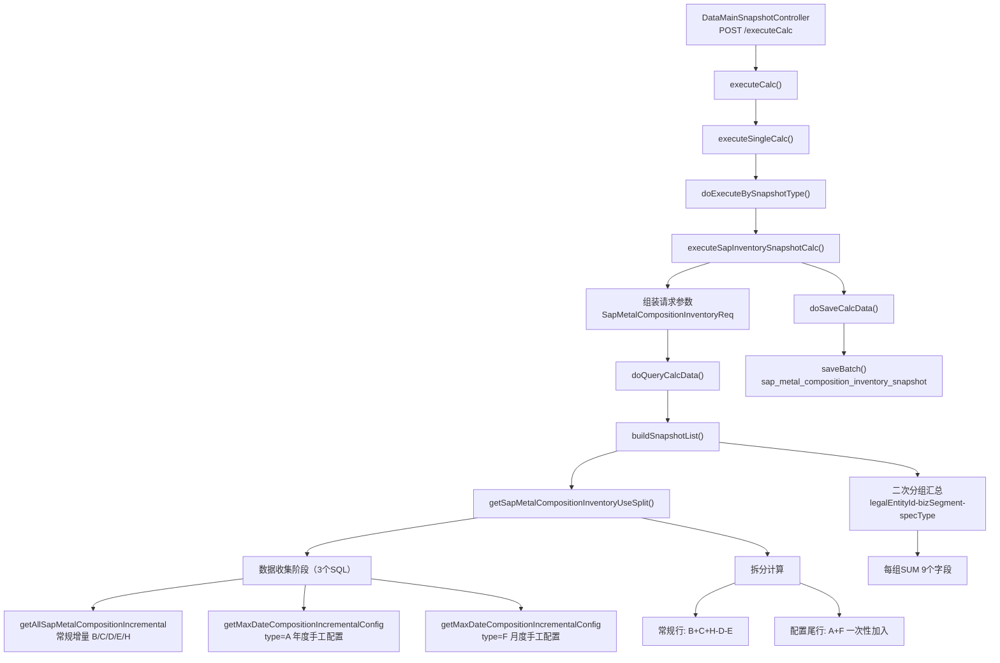

# SAP元素库存快照计算 — 调用链梳理

> **业务含义**：从 SAP 金属成分增量表拉取年度内各类型（入库/销售/废料/手工配置等）数据，按机构+业务板块+成分类型分组汇总，生成 Ending Stock Ownership 快照。

---

## 一、调用链路图



---

## 二、数据收集阶段（核心）

### 2.1 请求参数组装

```java
SapMetalCompositionInventoryReq req = new SapMetalCompositionInventoryReq();
req.setInitialDate(psSnapshot.getDate().withDayOfYear(1));   // 当年1月1日
req.setDateBegin(psSnapshot.getDate().withDayOfYear(1));     // 当年1月1日
req.setDateEnd(psSnapshot.getDate());                         // 快照日期
req.setLegalEntityId(psSnapshot.getLegalEntityId());          // 业务机构
```

### 2.2 三个数据源

全部来自同一张表 `sap_metal_composition_incremental`，通过 `type` 字段区分：

| 查询 | type 过滤 | 日期范围 | 用途 |
|------|----------|---------|------|
| `getAllSapMetalCompositionIncremental` | `NOT IN ('A','F')` | dateBegin ~ dateEnd | 常规增量（B/C/D/E/H） |
| `getMaxDateCompositionIncrementalConfig` | `= 'A'` | initialDate ~ dateEnd | **年度初始配置**（年初手工数据） |
| `getMaxDateCompositionIncrementalConfig` | `= 'F'` | dateBegin ~ dateEnd | **月度初始配置**（月初手工数据） |

三个查询都 LEFT JOIN：
- `sys_business_segment`（业务板块名称）
- `sys_company`（业务机构名称）
- `specification_type`（成分类型名称）

### 2.3 增量类型说明

| type | 含义 | 字段映射 |
|------|------|---------|
| A | 年度初始配置（年初手工） | `initialYearQuantity` |
| B | 入库单数量 | `goodsReceiptQuantity` |
| C | 销售发票数量 | `salesInvoiceQuantity` |
| D | 销售发票 sub 数量 | `salesInvoiceSubQuantity` |
| E | 废料再生产数量 | `recycleScrapQuantity` |
| F | 月度初始配置（月初手工） | `initialMonthQuantity` |
| H | 分包商数量 | `sapSubcontractQuantity` |

---

## 三、拆分计算逻辑

### 3.1 常规行（非 A/F 类型）

```
SUMpart_1 = B(goodsReceipt) + C(salesInvoice) + H(sapSubcontract)
SUMpart_2 = SUMpart_1 - E(recycleScrap) - D(salesInvoiceSub)
→ calculateQuantity = diffQuantity = SUMpart_2
```

### 3.2 配置尾行（每组最后一条）

> **关键业务规则**：年度(A)和月度(F)手工数据**不参与逐行计算**，只在每组最后一行一次性加入，避免重复计算。

```
diffQuantity = configMonth（月度配置合计）
calculateQuantity = yearItem.initialYearQuantity + configMonth
```

- **年度(A)**：取最大日期的那条记录的值
- **月度(F)**：取日期范围内所有记录的 `initialMonthQuantity` 之和

### 3.3 二次分组汇总（buildSnapshotList）

按 `legalEntityId-businessSegmentId-specificationTypeId` 分组，对每组 SUM 以下 9 个字段：

1. `initialYearQuantity`（A-初始年数量）
2. `initialMonthQuantity`（F-初始月数量）
3. `goodsReceiptQuantity`（B-入库单数量）
4. `salesInvoiceQuantity`（C-销售发票数量）
5. `salesInvoiceSubQuantity`（D-销售发票sub数量）
6. `recycleScrapQuantity`（E-废料再生产数量）
7. `sapSubcontractQuantity`（H-分包商数量）
8. `diffQuantity`（差异量）
9. `calculateQuantity`（计算量）

每组生成 1 条 `SapMetalCompositionInventorySnapshot`。

---

## 四、落库

**目标表**：`sap_metal_composition_inventory_snapshot`

**事务**：`@Transactional`，`saveBatch(snapshotList, 100)` 批量插入。

---

## 五、数据流总结

```
源表: sap_metal_composition_incremental
  ├── type NOT IN ('A','F') → 常规增量行 → 逐行计算 B+C+H-D-E
  ├── type = 'A' → 年度手工配置 → 取最大日期记录的 initialYearQuantity
  └── type = 'F' → 月度手工配置 → 求和 initialMonthQuantity
        │
        ▼
  按 legalEntityId-businessSegmentId-specificationTypeId 分组
  每组生成: 多条常规行 + 1条配置尾行
        │
        ▼  (buildSnapshotList 二次分组)
  再次按相同 key 分组，SUM 所有字段
  每组 → 1条 SapMetalCompositionInventorySnapshot
        │
        ▼
目标表: sap_metal_composition_inventory_snapshot
```

---

## 六、重要业务备注

1. **公式**：`B+C+H-D-E+F` = diffQuantity，`A+B+C+H-D-E+F` = calculateQuantity（Ending Stock Ownership）
2. **手工配置数据的特殊处理**：A（年度）和 F（月度）不参与常规逐行计算，只在每组末尾追加
3. **无幂等校验**：当前没有检查是否已存在快照数据（删除逻辑已被注释），重复执行可能产生重复数据
4. **无分页**：快照场景下加载全部符合条件的数据到内存计算
